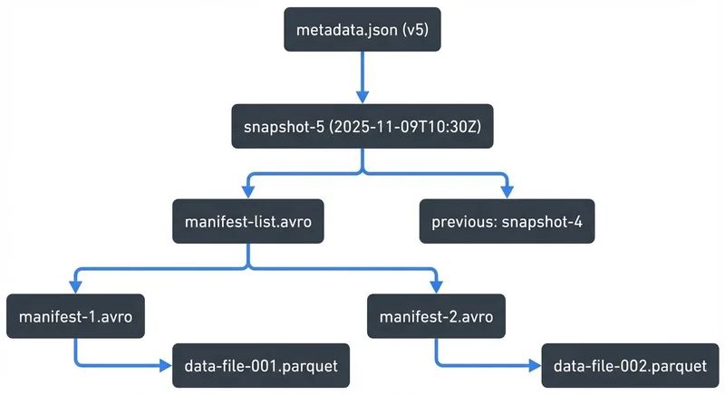

# Apache Iceberg

Apache Iceberg is an open table format that brings **database-like reliability and transactional guarantees** to massive datasets stored in cloud object stores. Created at Netflix to address the limits of traditional data lakes, Iceberg provides the missing structure and control that teams need to manage analytical data at scale.

It has become a foundational layer for **data lakehouse architectures**, bridging real-time streaming ingestion from systems like Kafka and analytical queries on Spark, Trino, or Flink.

---

## Why Table Formats Exist

Raw data lakes built on Parquet or ORC files are flexible but fragile. They lack atomic operations, consistent schema management, and efficient file handling. This makes data engineering complex and error-prone as datasets grow and evolve.

Common challenges include:

* **No atomicity:** Multiple concurrent writers can corrupt datasets.
* **Rigid schemas:** Evolving or renaming columns often requires rewriting entire tables.
* **Performance overhead:** Query engines must scan thousands of files to infer structure.
* **Small files problem:** Frequent micro-batch writes from streaming systems create excessive metadata and degrade query performance.

Table formats like **Apache Iceberg, Delta Lake, and Apache Hudi** were created to solve these problems by adding a **metadata layer** that tracks versions, schemas, and file locations. Iceberg stands out for its open specification, flexible partitioning, and support for concurrent streaming and batch workloads.

---

## How Apache Iceberg Works

Iceberg organizes data through multiple metadata layers that manage both data and schema evolution efficiently.

### Key Components

1. **Data files:** Contain actual records, typically in Parquet or ORC format.
2. **Manifests:** List data files and include statistics like record counts and partition values.
3. **Snapshots:** Immutable views representing the state of a table at a specific time.
4. **Metadata file:** The top-level JSON file that points to the active snapshot and stores schema history.

Each write operation in Iceberg creates a **new snapshot** without altering existing data. This *copy-on-write* model allows atomic commits and concurrent readers.

For comprehensive coverage of Iceberg's internal architecture, metadata layers, and snapshot mechanics, see [Iceberg Table Architecture: Metadata and Snapshots](https://conduktor.io/glossary/iceberg-table-architecture-metadata-and-snapshots).

A simplified example:



<!-- ORIGINAL_DIAGRAM
```
metadata.json (v5)
  └── snapshot-5 (2025-11-09T10:30Z)
       ├── manifest-list.avro
       │    ├── manifest-1.avro → data-file-001.parquet
       │    ├── manifest-2.avro → data-file-002.parquet
       └── previous: snapshot-4
```
-->

### Hidden Partitioning and Partition Evolution

Traditional data lakes expose partition columns directly, often leading to brittle query logic. Iceberg’s **hidden partitioning** abstracts this detail away — users can query logical fields without worrying about how data is stored.
If access patterns change, **partition evolution** allows new partition strategies (for example, switching from `day()` to `hour()`) without rewriting existing data.

### Metadata-Only Operations

Iceberg supports operations that work purely on metadata — like listing partitions or updating schemas — without scanning data files. This design keeps both maintenance and queries efficient at scale.

---

## ACID Transactions and Time Travel

Apache Iceberg brings **ACID transactions** to data lakes through **optimistic concurrency control**. Multiple writers can attempt to modify the same table, but only one commit succeeds, ensuring atomic updates without locking.

Readers always see consistent snapshots, and failed writers automatically retry using the latest table state.

### Time Travel Queries

Iceberg records a history of all table snapshots, allowing you to query data as it existed at any point in time:

```sql
SELECT * FROM orders VERSION AS OF 1082348923412;
SELECT * FROM orders TIMESTAMP AS OF '2025-11-01 10:00:00';
```

This feature supports **debugging**, **reproducible analytics**, and **regulatory compliance**.
To manage costs, Iceberg allows administrators to define **snapshot retention and orphan file cleanup** policies, balancing governance and storage efficiency.

---

## Apache Iceberg in the Lakehouse Ecosystem

In a data lakehouse, Iceberg acts as the **storage and transaction layer** that unifies batch and interactive analytics over cloud storage.

Major query engines — **Spark, Trino, Snowflake, Flink, and Dremio** — natively support Iceberg, enabling teams to query the same datasets with different compute engines. This interoperability makes Iceberg ideal for multi-engine and multi-cloud environments.

Iceberg integrates with metadata catalogs such as **AWS Glue**, **Hive Metastore**, **Project Nessie**, and **Apache Polaris**, allowing unified table discovery, access control, and schema management. For detailed catalog comparisons, configuration, and migration strategies, see [Iceberg Catalog Management: Hive, Glue, and Nessie](https://conduktor.io/glossary/iceberg-catalog-management-hive-glue-and-nessie).

Combined with features like **Z-order clustering**, **configurable file compaction**, and **metadata pruning**, Iceberg delivers warehouse-grade performance on top of open storage.

---

## Apache Iceberg and Data Streaming

Streaming data systems like Kafka and Flink continuously generate small batches of events — a pattern that doesn't fit traditional batch-oriented storage. Iceberg bridges this gap by supporting **incremental ingestion and CDC (Change Data Capture)** at scale.

For understanding how Kafka streaming integrates with data lakes, see [Apache Kafka](https://conduktor.io/glossary/apache-kafka). For CDC implementation details, see [Implementing CDC with Debezium](https://conduktor.io/glossary/implementing-cdc-with-debezium).

### Streaming Patterns

1. **Append mode:** Ideal for high-volume event streams that continually add new data.
2. **Upsert mode:** Designed for CDC pipelines using tools like **Debezium**, where updates and deletes must be reflected in analytical tables.

For example, Flink's Iceberg connector enables exactly-once ingestion with upsert support:

```sql
CREATE TABLE orders_iceberg (
  order_id BIGINT,
  customer_id BIGINT,
  amount DECIMAL(10,2),
  updated_at TIMESTAMP(3),
  PRIMARY KEY (order_id) NOT ENFORCED
) WITH (
  'connector' = 'iceberg',
  'catalog-type' = 'rest',  -- Modern REST catalog (Polaris, Nessie) recommended over Hive
  'catalog-uri' = 'http://catalog-server:8181',
  'warehouse' = 's3://my-warehouse/iceberg',
  'write.distribution-mode' = 'hash'  -- Distribute by primary key for upserts
);
```

The `PRIMARY KEY` declaration (available in Flink 1.15+) enables upsert semantics automatically, while `write.distribution-mode = 'hash'` ensures updates to the same key are processed by the same writer for consistency.

Iceberg supports **file compaction** to consolidate the small files generated by streaming writes, preventing performance degradation and maintaining healthy table structures over time. Note that compaction must be explicitly configured and scheduled (using Flink actions, Spark procedures, or dedicated compaction jobs)—it doesn't happen automatically without configuration.

This combination of streaming ingestion and governed storage makes Iceberg central to **real-time analytics**, **fraud detection**, and **AI feature store** architectures.

---

## Summary

Apache Iceberg transforms the data lake into a **reliable, versioned, and queryable** foundation for modern analytics. It fixes the gaps of traditional data lakes through strong transactional guarantees, schema evolution, and metadata-driven performance.

In streaming environments, Iceberg enables **real-time ingestion** from Kafka or Flink into consistent analytical tables, while automatically managing file compaction and schema consistency. Governance platforms extend this reliability to the operational layer — ensuring every Kafka-to-Iceberg pipeline remains secure, observable, and governed across the enterprise.

---

## Sources and References

* [Apache Iceberg Official Documentation](https://iceberg.apache.org/)
* [Netflix Tech Blog: Introducing Iceberg](https://netflixtechblog.com/)
* [Apache Flink: Iceberg Connector Guide](https://nightlies.apache.org/flink/flink-docs-stable/docs/connectors/table/iceberg/)
* [Confluent: Kafka Connect Iceberg Sink Connector](https://docs.confluent.io/kafka-connectors/iceberg/current/overview.html)
* [Databricks Blog: Understanding Table Formats in Lakehouses](https://www.databricks.com/blog/)
