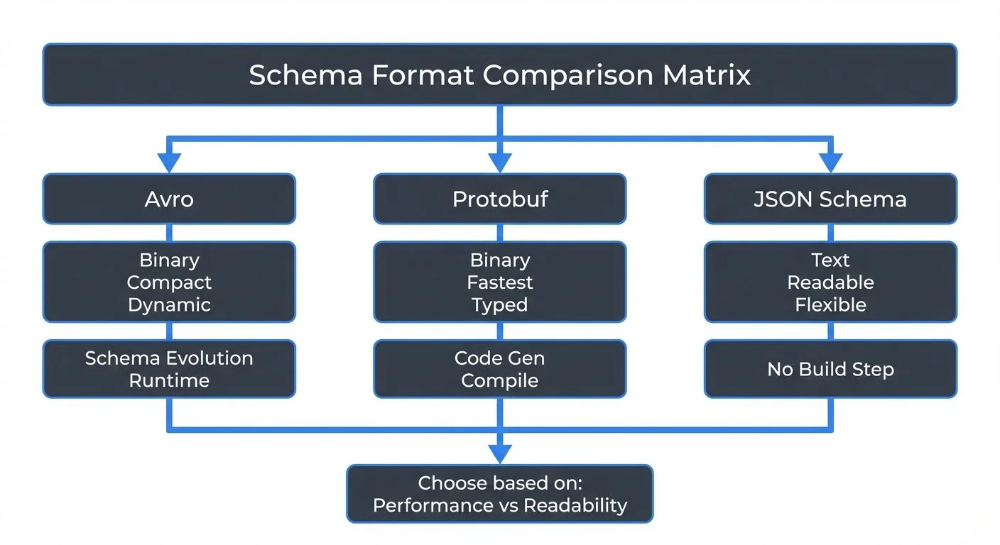

# Avro vs Protobuf vs JSON Schema

When building distributed systems and data pipelines, choosing the right schema format affects performance, developer experience, and long-term maintainability. Apache Avro, Protocol Buffers (Protobuf), and JSON Schema represent three different approaches to defining and validating data structures. Each has distinct strengths that make it suitable for different scenarios.

This article compares these three popular schema formats, examining their design philosophies, serialization approaches, and practical tradeoffs in real-world applications.

## Introduction to Schema Formats



<!-- ORIGINAL_DIAGRAM
```
┌────────────────────────────────────────────────────────────────┐
│               Schema Format Comparison Matrix                  │
└────────────────────────────────────────────────────────────────┘
                              │
         ┌────────────────────┼────────────────────┐
         │                    │                    │
    ┌────▼─────┐         ┌────▼────┐         ┌────▼──────┐
    │   Avro   │         │Protobuf │         │   JSON    │
    │          │         │         │         │  Schema   │
    ├──────────┤         ├─────────┤         ├───────────┤
    │ Binary   │         │ Binary  │         │   Text    │
    │ Compact  │         │ Fastest │         │ Readable  │
    │ Dynamic  │         │ Typed   │         │ Flexible  │
    ├──────────┤         ├─────────┤         ├───────────┤
    │ Schema   │         │  Code   │         │   No      │
    │Evolution │         │  Gen    │         │  Build    │
    │ Runtime  │         │Compile  │         │  Step     │
    └────┬─────┘         └────┬────┘         └────┬──────┘
         │                    │                    │
         └────────────────────┼────────────────────┘
                              ▼
                      Choose based on:
                   Performance vs Readability
```
-->

Schema formats serve two primary purposes: defining the structure of data and enabling validation. In distributed systems, schemas provide a contract between producers and consumers, ensuring data compatibility across services and over time.

Without schemas, systems rely on implicit assumptions about data structure. When a service changes its data format, downstream consumers may break unexpectedly. Schemas make these contracts explicit and machine-readable.

The three formats covered here take different approaches. Avro and Protobuf focus on compact binary serialization with strong schema evolution support. JSON Schema focuses on validating human-readable JSON documents. Understanding these differences helps you choose the right tool for your use case.

## Understanding Binary Serialization

Before diving into specific formats, let's clarify what "binary serialization" means. When you serialize data to binary format, you convert it into a sequence of bytes that machines can process efficiently. Unlike human-readable text formats (like JSON), binary formats optimize for:

- **Size**: Compressed representation using techniques like variable-length integers
- **Speed**: Direct memory mapping without parsing text
- **Schema enforcement**: Structure embedded in the format itself

The tradeoff is readability—you can't open a binary file in a text editor and understand it. You need the schema and appropriate deserialization tools.

## Avro: Compact and Schema Evolution

Apache Avro is a binary serialization format created within the Hadoop ecosystem. It stores data in a compact binary format while keeping the schema separate from the data itself.

Avro's defining characteristic is its approach to schema evolution. When reading Avro data, you provide both the writer's schema (used when data was written) and the reader's schema (expected by the current application). Avro resolves differences between these schemas at read time, enabling backward and forward compatibility.

**Key features**:
- Binary encoding with small message sizes
- Schema stored separately from data (often in a Schema Registry)
- Dynamic typing - no code generation required
- Rich support for schema evolution with resolution rules

**Example Avro schema**:
```json
{
  "type": "record",
  "name": "User",
  "fields": [
    {"name": "id", "type": "long"},
    {"name": "username", "type": "string"},
    {"name": "email", "type": ["null", "string"], "default": null}
  ]
}
```

Avro excels when schema evolution is critical. Adding a field with a default value allows old readers to process new data and new readers to process old data seamlessly. This makes Avro popular in data lakes and streaming platforms where data schemas change frequently.

## Protocol Buffers: Performance and Cross-Language Support

Protocol Buffers (Protobuf) is Google's language-neutral serialization format. Unlike Avro, Protobuf uses code generation to create strongly-typed classes in your target programming language.

Protobuf achieves excellent performance through its compact binary format and the use of generated code. The schema, defined in `.proto` files, specifies field numbers that are used in the binary encoding. This makes Protobuf messages extremely efficient.

**Key features**:
- Very compact binary encoding
- Strong typing through code generation
- Field numbers enable schema evolution
- Extensive language support with official compilers

**Example Protobuf schema**:
```protobuf
syntax = "proto3";

message User {
  int64 id = 1;
  string username = 2;
  optional string email = 3;
}
```

Schema evolution in Protobuf relies on field numbers. You can add new fields, mark fields as deprecated, or change field names without breaking compatibility, as long as field numbers remain stable. Removing fields requires careful consideration of backward compatibility.

Protobuf's code generation approach provides compile-time type safety but requires a build step. This makes it particularly popular in microservices architectures where strong typing and performance are priorities.

## JSON Schema: Human-Readable Validation

JSON Schema takes a fundamentally different approach. Rather than defining a serialization format, JSON Schema validates JSON documents. The data remains human-readable JSON text.

JSON Schema defines rules for what constitutes valid JSON. It specifies types, required fields, format constraints, and complex validation logic. This makes it powerful for API validation and configuration files where human readability matters.

**Key features**:
- Validates standard JSON (no custom serialization)
- Human-readable data and schema
- Rich validation capabilities (regex, ranges, custom formats)
- No code generation or build step required

**Example JSON Schema**:
```json
{
  "$schema": "http://json-schema.org/draft-07/schema#",
  "type": "object",
  "properties": {
    "id": {"type": "integer"},
    "username": {"type": "string"},
    "email": {"type": "string", "format": "email"}
  },
  "required": ["id", "username"]
}
```

The tradeoff with JSON Schema is efficiency. JSON text is significantly larger than binary formats, and parsing JSON is slower than deserializing binary data. However, for use cases where debugging, human inspection, or web APIs are important, this tradeoff may be acceptable.

JSON Schema's evolution model is less formalized than Avro or Protobuf. You can add optional fields or loosen validation rules without breaking existing documents, but there's no built-in schema resolution mechanism.

## Schema Formats in Data Streaming

All three formats are commonly used with Apache Kafka and other streaming platforms, but with different patterns and tradeoffs.

**Avro with Kafka** is perhaps the most common combination. Kafka messages contain only the binary data and a schema ID. The Schema Registry stores schemas centrally and ensures compatibility between producers and consumers. Confluent's implementation provides automatic schema validation and evolution checks.

**Protobuf with Kafka** follows a similar pattern but leverages code generation. Producers and consumers use generated classes, providing type safety at compile time. Schema Registry support for Protobuf enables the same centralized schema management as Avro.

**JSON Schema with Kafka** is used when human readability is valuable, such as in development environments or when non-technical users need to inspect messages. The larger message size impacts throughput and storage costs in high-volume scenarios.

**Real-world example**: A financial services company might use Protobuf for high-frequency trading data (millions of messages per second), Avro for analytical data lakes (frequent schema changes), and JSON Schema for configuration events (human readability for operations teams).

Tools like Conduktor provide unified interfaces for working with all three formats. Developers can inspect messages, validate schemas, and test compatibility rules without writing custom deserialization code. This is particularly valuable in environments where different teams choose different formats for different use cases. For managing schemas across these formats, see [Conduktor's Schema Registry Management](https://docs.conduktor.io/guide/manage-kafka/kafka-resources/schema-registry).

## Schema Evolution and Compatibility

All three formats support schema evolution, but managing compatibility becomes critical in production systems. When using Schema Registry (Confluent Schema Registry, AWS Glue Schema Registry), you configure compatibility modes that determine which schema changes are allowed:

- **Backward compatibility**: New schemas can read old data (most common—consumers upgrade before producers)
- **Forward compatibility**: Old schemas can read new data (producers upgrade before consumers)
- **Full compatibility**: Both backward and forward compatible (most restrictive)

For a comprehensive guide to schema compatibility modes, validation rules, and practical evolution patterns, see the [Schema Registry and Schema Management](https://conduktor.io/glossary/schema-registry-and-schema-management) article. Schema Registry works with all three formats covered here (Avro, Protobuf, JSON Schema) and provides the safety guardrails needed to evolve schemas without breaking production systems.

## Choosing the Right Format

The choice between these formats depends on several factors:

**Choose Avro when**:
- Schema evolution is a primary concern
- You need dynamic typing and runtime flexibility
- Working with data lakes or analytical workloads
- Integration with Hadoop ecosystem tools

**Choose Protobuf when**:
- Maximum performance is critical
- You want strong compile-time type safety
- Building microservices with multiple languages
- Code generation fits your development workflow

**Choose JSON Schema when**:
- Human readability is essential
- Working with web APIs or browser clients
- Schema validation without custom serialization
- Developer tooling and debugging are priorities

**Performance comparison**: In typical benchmarks, Protobuf produces the smallest messages (often 20-30% smaller than Avro), followed by Avro, with JSON being 3-5x larger than binary formats. Serialization and deserialization speed follows similar patterns.

**Ecosystem and tooling**: All three formats have mature ecosystems. Avro benefits from Hadoop integration. Protobuf has official Google support and extensive language bindings. JSON Schema has ubiquitous support in web technologies.

Many organizations don't choose just one format. They use Protobuf for high-performance services, Avro for data pipelines, and JSON Schema for APIs. The key is establishing clear guidelines for when to use each format and ensuring your infrastructure supports all chosen formats.

## Summary

Apache Avro, Protocol Buffers, and JSON Schema each excel in different scenarios. Avro provides excellent schema evolution with dynamic typing, making it ideal for data pipelines where schemas change frequently. Protocol Buffers delivers maximum performance and type safety through code generation, fitting high-throughput microservices. JSON Schema prioritizes human readability and validation of standard JSON, serving web APIs and configuration use cases.

In data streaming environments like Apache Kafka, all three formats integrate well with Schema Registry for centralized schema management. The choice depends on your specific requirements around performance, type safety, schema evolution, and human readability.

Understanding these tradeoffs enables you to make informed decisions about which format best serves each component of your system. Many production systems successfully use multiple formats, applying each where its strengths align with requirements.

## Related Concepts

- [Message Serialization in Kafka](https://conduktor.io/glossary/message-serialization-in-kafka) - Comprehensive guide to how Kafka uses Avro, Protobuf, and JSON Schema for message serialization and deserialization.
- [Schema Registry and Schema Management](https://conduktor.io/glossary/schema-registry-and-schema-management) - Learn how Schema Registry provides centralized management for all three schema formats with compatibility enforcement.
- [Schema Evolution Best Practices](https://conduktor.io/glossary/schema-evolution-best-practices) - Best practices for evolving schemas safely across different serialization formats while maintaining compatibility.

## Sources and References

1. [Apache Avro Documentation](https://avro.apache.org/docs/) - Official specification and schema evolution rules
2. [Protocol Buffers Language Guide](https://protobuf.dev/programming-guides/proto3/) - Google's official Protobuf documentation
3. [JSON Schema Specification](https://json-schema.org/specification) - Complete JSON Schema standards
4. [Confluent Schema Registry Documentation](https://docs.confluent.io/platform/current/schema-registry/index.html) - Multi-format schema management for Kafka
5. [Schema Evolution in Avro, Protocol Buffers and Thrift](https://martin.kleppmann.com/2012/12/05/schema-evolution-in-avro-protocol-buffers-thrift.html) - Martin Kleppmann's technical analysis of schema evolution approaches
