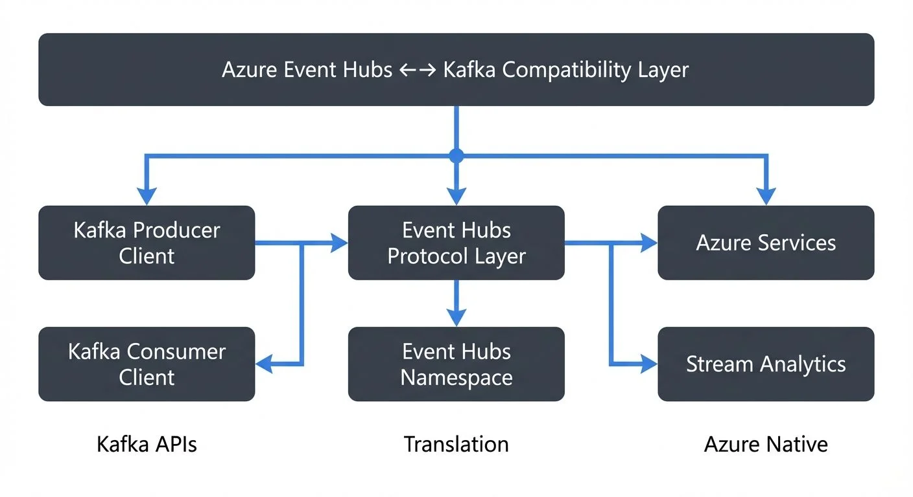

Azure Event Hubs is Microsoft's fully managed, cloud-native event streaming platform designed to handle millions of events per second. One of its most significant features is built-in compatibility with the Apache Kafka protocol, allowing organizations to use existing Kafka client applications with minimal changes. This compatibility bridges the gap between on-premises Kafka deployments and Azure's managed services, offering a path for cloud migration and hybrid architectures.

Understanding how Event Hubs implements Kafka compatibility is essential for architects and engineers evaluating cloud streaming options or planning migration strategies.

## Understanding Kafka Protocol Compatibility

Azure Event Hubs implements the Apache Kafka producer and consumer APIs, supporting Kafka clients version 1.0 and later. This means applications written using standard Kafka client libraries can connect to Event Hubs by simply changing the connection configuration.

The compatibility layer works by translating Kafka protocol requests into Event Hubs operations. When a Kafka producer sends messages, Event Hubs receives them as events. Similarly, Kafka consumers can read from Event Hubs partitions using familiar consumer group semantics.

### How It Works

Event Hubs exposes a Kafka-compatible endpoint that listens on port 9093 (standard Kafka SSL port). To connect a Kafka client, you configure the bootstrap server to point to your Event Hubs namespace and provide authentication credentials using SASL/PLAIN or SASL/OAUTHBEARER.

Example connection configuration:
```
bootstrap.servers=your-namespace.servicebus.windows.net:9093
security.protocol=SASL_SSL
sasl.mechanism=PLAIN
sasl.jaas.config=org.apache.kafka.common.security.plain.PlainLoginModule required username="$ConnectionString" password="[connection-string]";
```

In this configuration, an Event Hub acts as a Kafka topic, and partitions in Event Hubs map directly to Kafka partitions. This one-to-one mapping preserves ordering guarantees and partition assignment logic.

## Migration Strategies and Use Cases

Organizations adopt Event Hubs with Kafka compatibility for several strategic reasons:

**Cloud Migration**: Companies moving to Azure can migrate Kafka workloads without rewriting applications. By pointing existing Kafka producers and consumers to Event Hubs endpoints, teams can validate cloud performance before committing to deeper architectural changes.

**Hybrid Architectures**: Some organizations maintain on-premises Kafka clusters while using Event Hubs for specific workloads. For example, a financial services company might keep sensitive trading data on-premises while streaming analytics events to Azure for processing with Azure Stream Analytics or Azure Databricks.

**Managed Service Benefits**: Event Hubs eliminates operational overhead associated with Kafka cluster management. Teams avoid tasks like broker configuration, partition rebalancing, and version upgrades, allowing them to focus on application development.

**Integration with Azure Ecosystem**: Event Hubs natively integrates with Azure services like Azure Functions, Azure Data Explorer, and Azure Synapse Analytics. Applications can stream data through Event Hubs using Kafka protocols while downstream processing leverages Azure-native tools.

## Feature Comparison: Event Hubs vs Native Kafka

While Event Hubs supports Kafka protocols, it's not a drop-in replacement for all Kafka features. Understanding these differences is critical for migration planning.

### Supported Features
- Producer and consumer APIs (Kafka 1.0+)
- Consumer groups with offset management
- Partition-level ordering
- Idempotent producers
- Transactional writes (in premium and dedicated tiers)

### Limitations and Differences
- **Kafka Streams API (Preview)**: Event Hubs now supports Kafka Streams API in preview for Premium and Dedicated tiers, enabling stateful stream processing. However, production use should consider Azure Stream Analytics or Flink as mature alternatives.
- **No Native Kafka Connect**: Event Hubs doesn't provide a native Connect framework. Connectors must run separately and connect to Event Hubs as a Kafka endpoint.
- **Topic Administration**: Creating and configuring Event Hubs requires using Azure Portal, CLI, or ARM templates rather than Kafka admin APIs.
- **Log Compaction (GA)**: Event Hubs now supports log compaction in General Availability across all tiers, enabling key-value store patterns and stateful applications.
- **Message Size**: Event Hubs supports up to 1 MB messages in Standard tier and up to 20 MB in Dedicated tier (versus Kafka's configurable limits).

These limitations mean Event Hubs works best for producer-consumer patterns rather than complex stream processing or connector-heavy architectures.

## Working with Event Hubs Kafka Endpoint

Migrating a Kafka application to Event Hubs typically involves four steps:

1. **Create Event Hubs Namespace**: Provision an Event Hubs namespace in Azure, selecting the appropriate tier (Standard, Premium, or Dedicated) based on throughput and feature requirements.

2. **Configure Connection Strings**: Retrieve the connection string from Azure Portal and configure Kafka clients to authenticate using SASL.

3. **Map Topics to Event Hubs**: Each Kafka topic requires a corresponding Event Hub. Create these through Azure Portal or Infrastructure as Code templates.

4. **Test and Validate**: Deploy applications to a staging environment and verify message production, consumption, and consumer group behavior.

A real-world example: An e-commerce platform migrated its order processing pipeline from self-managed Kafka to Event Hubs. The team changed only connection configuration in their Spring Boot microservices, deployed to Azure Kubernetes Service, and achieved 99.9% uptime with reduced operational burden.

## Monitoring and Management in Multi-Protocol Environments

Operating Event Hubs with Kafka clients introduces monitoring challenges. Azure provides native metrics through Azure Monitor, but teams accustomed to Kafka tooling may find the transition difficult.

Key monitoring considerations:
- **Partition Metrics**: Track throughput, lag, and consumer group offsets across partitions
- **Error Rates**: Monitor authentication failures, throttling events, and protocol errors
- **Schema Registry**: Event Hubs now includes integrated Schema Registry (free with every namespace), providing schema validation and evolution management compatible with Confluent Schema Registry APIs
- **Express Tier**: New cost-effective tier for dev/test workloads with auto-inflate capabilities

Management platforms help teams operate multi-protocol streaming environments by providing unified monitoring, schema management, and data governance across both native Kafka clusters and Event Hubs. This is particularly valuable for organizations running hybrid architectures or gradually migrating workloads to Azure.

Teams should also establish alerting for consumer lag and throughput saturation to maintain service level objectives during migration.

## Summary

Azure Event Hubs provides Kafka protocol compatibility that enables organizations to leverage existing Kafka investments while adopting Azure's managed streaming platform. The compatibility layer supports core producer and consumer patterns, making it suitable for lift-and-shift migrations and hybrid cloud architectures.

Event Hubs has evolved significantly: Kafka Streams API is now in preview, log compaction is GA, integrated Schema Registry is available for free, and new tiers like Express provide cost-effective options. However, teams should carefully evaluate their specific use cases, particularly around stream processing maturity and connector dependencies, before migrating.

For organizations committed to Azure, Event Hubs offers significant operational benefits: reduced management overhead, native integration with Azure services, and enterprise-grade reliability. When combined with proper monitoring and governance tools, Event Hubs can serve as an effective foundation for cloud-native event streaming architectures.

The decision to adopt Event Hubs should balance protocol compatibility benefits against feature limitations, cost implications, and long-term architectural goals. For many teams, the combination of Kafka familiarity and Azure ecosystem integration makes Event Hubs a compelling choice for modern data streaming.

## Related Concepts

- [Apache Kafka](https://conduktor.io/glossary/apache-kafka) - The streaming platform that Event Hubs provides compatibility with
- [Introduction to Confluent Cloud](https://conduktor.io/glossary/introduction-to-confluent-cloud) - Alternative managed Kafka service for multi-cloud deployments
- [Streaming Total Cost of Ownership](https://conduktor.io/glossary/streaming-total-cost-of-ownership) - Comparing the economics of managed streaming platforms

## Sources and References

1. [Azure Event Hubs for Apache Kafka](https://learn.microsoft.com/en-us/azure/event-hubs/event-hubs-for-kafka-ecosystem-overview) - Microsoft Learn
2. [Apache Kafka Protocol Documentation](https://kafka.apache.org/protocol) - Apache Software Foundation
3. [Azure Event Hubs quotas and limits](https://learn.microsoft.com/en-us/azure/event-hubs/event-hubs-quotas) - Microsoft Learn
4. [Migrating to Azure Event Hubs for Apache Kafka](https://learn.microsoft.com/en-us/azure/event-hubs/apache-kafka-migration-guide) - Microsoft Learn
5. [Azure Architecture Center - Event-driven architecture](https://learn.microsoft.com/en-us/azure/architecture/guide/architecture-styles/event-driven) - Microsoft Learn
