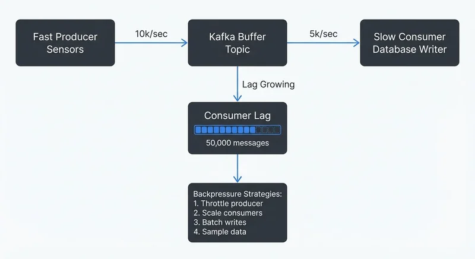

# Backpressure Handling in Streaming Systems

In distributed streaming systems, data flows continuously from producers through processing pipelines to consumers. When downstream components can't keep up with the rate of incoming data, backpressure occurs. Understanding and properly handling backpressure is essential for building reliable, scalable streaming applications.

## What is Backpressure?

Backpressure is the resistance or feedback signal that occurs when a downstream system component cannot process data as quickly as it's being produced upstream. Think of it like water flowing through connected pipes of different diameters—when a narrow pipe can't handle the flow from a wider one, pressure builds up.



<!-- ORIGINAL_DIAGRAM
```
┌─────────────────────────────────────────────────────────────────┐
│              Backpressure in Streaming Pipeline                 │
├─────────────────────────────────────────────────────────────────┤
│                                                                 │
│  Fast Producer          Kafka Buffer        Slow Consumer       │
│  ┌───────────┐         ┌──────────┐         ┌───────────┐      │
│  │           │ 10k/sec │          │ 5k/sec  │           │      │
│  │ Sensors   │────────▶│  Topic   │────────▶│ Database  │      │
│  │           │         │          │         │  Writer   │      │
│  └───────────┘         └────┬─────┘         └───────────┘      │
│                             │                                   │
│                             │ Lag Growing                       │
│                             ▼                                   │
│                  ┌─────────────────────┐                        │
│                  │   Consumer Lag      │                        │
│                  │   ▓▓▓▓▓▓▓▓▓▓░░░░░   │                        │
│                  │   50,000 messages   │                        │
│                  └─────────────────────┘                        │
│                             │                                   │
│                             ▼                                   │
│              ┌─────────────────────────────┐                    │
│              │  Backpressure Strategies:  │                    │
│              │  1. Throttle producer      │                    │
│              │  2. Scale consumers        │                    │
│              │  3. Batch writes           │                    │
│              │  4. Sample data            │                    │
│              └─────────────────────────────┘                    │
│                                                                 │
└─────────────────────────────────────────────────────────────────┘
```
-->

In streaming systems, backpressure manifests when:

- Producers generate events faster than consumers can process them
- A processing stage takes longer than expected (due to complex transformations, external API calls, or database writes)
- Network congestion slows data transfer between components
- Downstream systems experience temporary performance degradation

Without proper handling, backpressure leads to unbounded memory growth, system crashes, data loss, or cascading failures across your infrastructure.

## Why Backpressure Matters in Streaming

Unlike batch processing where you control when jobs run, streaming systems operate continuously. This creates unique challenges:

**Memory Exhaustion**: If a consumer keeps accepting data it can't process, buffers fill up until the system runs out of memory and crashes.

**Data Loss**: When buffers overflow, systems may silently drop events or fail to acknowledge messages, leading to data loss.

**Latency Spikes**: As queues grow, end-to-end latency increases. An event that normally processes in milliseconds might take minutes during backpressure situations.

**Cascading Failures**: Backpressure in one component can propagate upstream, affecting the entire pipeline and connected systems.

**Resource Waste**: Over-provisioned systems that don't handle backpressure intelligently waste compute and storage resources buffering data unnecessarily.

Real-world streaming applications must handle variable data rates. A retail system might see 10x traffic during flash sales. An IoT platform might receive bursts when sensors reconnect after network outages. Proper backpressure handling ensures systems remain stable during these variations.

## Common Backpressure Strategies

Different strategies address backpressure depending on your requirements for data completeness, latency, and cost:

### Buffering

Store incoming data temporarily until the downstream system catches up. Buffers smooth out short-term spikes but have limits. Kafka topics act as distributed buffers, storing messages until consumers process them. Configure buffer sizes based on expected spike duration and available memory.

### Throttling and Blocking

Slow down producers when consumers can't keep up. In Kafka, this happens when producers receive a `buffer.memory` exception and must wait before sending more messages. Reactive Streams implementations use this approach, where subscribers signal demand and publishers respect it.

### Load Shedding and Sampling

Drop some data to protect system stability. For metrics or monitoring data where approximate values suffice, sampling every 10th event during high load maintains system health. Implement this with filters that check system load and probabilistically drop events.

### Elastic Scaling

Automatically add consumer instances when lag increases. Kubernetes can scale consumer deployments based on metrics. Kafka consumer groups automatically rebalance partitions across new instances.

### Batching and Windowing

Process multiple events together to improve throughput. Instead of writing each event individually to a database, batch 100 events and write once. This reduces per-event overhead and helps consumers catch up.

## Backpressure in Popular Streaming Platforms

### Apache Kafka

Kafka handles backpressure through several mechanisms:

- **Partitions and Consumer Groups**: Scale consumption by adding partitions and consumer instances. Each partition is consumed by one consumer in a group. For detailed consumer group mechanics, see [Kafka Consumer Groups Explained](https://conduktor.io/glossary/kafka-consumer-groups-explained).
- **Consumer Lag Monitoring**: Track how far behind consumers are. High lag indicates backpressure. See [Consumer Lag Monitoring](https://conduktor.io/glossary/consumer-lag-monitoring) for monitoring strategies.
- **Producer Controls**: Configure `buffer.memory`, `max.block.ms`, and `linger.ms` to control producer behavior when brokers can't keep up.
- **Quotas**: Enforce rate limits on producers and consumers to prevent any single client from overwhelming the system.
- **KRaft Mode (Kafka 4.0+)**: The modern consensus protocol improves metadata operations, reducing coordination overhead during scaling events. KRaft's faster leader elections help systems recover from backpressure-induced failures more quickly than legacy ZooKeeper mode.

### Apache Flink

Flink implements automatic backpressure propagation:

When a downstream operator (like a sink writing to a database) becomes slow, Flink automatically slows upstream operators. This happens through network buffers—when buffers fill, the sender blocks until space becomes available.

**Flink 1.13+ Visual Backpressure Monitoring**: The web UI provides enhanced backpressure visualization, showing per-operator backpressure status with color-coded indicators (green, yellow, red). Task metrics now include busy/idle time ratios, making it easier to identify bottlenecks. The Task Manager metrics page displays buffer pool usage and network buffer details for granular troubleshooting.

### Kafka Streams

Kafka Streams applications are both consumers and producers. Backpressure happens naturally through Kafka's consumer behavior. If processing slows, the application commits offsets less frequently and processes fewer records per poll. Configure `max.poll.records` and `max.poll.interval.ms` to control this behavior.

### Apache Pulsar

Pulsar provides more granular backpressure control than Kafka:

- **Flow Control**: Consumers send permits indicating how many messages they can receive
- **Delayed Message Delivery**: Producers can specify delivery delays when backpressure occurs
- **Multi-layer Architecture**: Separation of serving and storage layers helps isolate backpressure issues

## Real-World Scenarios and Solutions

### Scenario 1: IoT Sensor Data Ingestion

A factory operates 10,000 sensors, each sending temperature readings every second (10,000 events/sec). The analytics database can only handle 5,000 writes per second.

**Problem**: Without backpressure handling, the processing application's memory fills up with pending writes, eventually causing OutOfMemory errors.

**Solution**: Implement a combination of strategies:
1. Batch database writes (insert 100 readings per transaction instead of individual inserts)
2. Use Kafka with sufficient partitions (20 partitions allowing parallel consumption)
3. Add consumer instances to parallelize processing
4. Implement sampling for non-critical sensors during peak periods
5. Monitor consumer lag and alert when it exceeds thresholds

### Scenario 2: Event Processing Pipeline

An e-commerce platform processes order events through multiple stages: validation, inventory check, payment processing, and fulfillment. The payment service has variable response times (50ms to 2000ms depending on payment provider).

**Problem**: When payment processing slows, events back up, increasing end-to-end latency from seconds to minutes.

**Solution**:
1. Use Kafka between stages to decouple components
2. Configure the payment processing stage with appropriate timeouts and retries
3. Implement circuit breakers to fail fast when payment services are down
4. Scale payment processors based on queue depth
5. Monitor lag across each processing stage to identify bottlenecks quickly

When consumer lag in the payment processing topic exceeds 10,000 messages, the operations team receives alerts and can investigate whether to scale consumers or if the payment provider is experiencing issues.

## Best Practices and Monitoring

### Design for Backpressure

- **Set Explicit Limits**: Configure memory limits, buffer sizes, and timeouts explicitly rather than relying on defaults
- **Plan for Peak Load**: Design capacity for 2-3x normal load to handle spikes
- **Implement Graceful Degradation**: Define which data can be sampled or delayed when backpressure occurs
- **Use Dead Letter Queues**: Route problematic messages to separate topics for later investigation instead of blocking processing. See [Dead Letter Queues for Error Handling](https://conduktor.io/glossary/dead-letter-queues-for-error-handling) for implementation patterns.

### Monitor Key Metrics

Essential metrics for detecting backpressure:

- **Consumer Lag**: The number of messages consumers are behind producers
- **Processing Time**: How long each event takes to process (p50, p95, p99 percentiles)
- **Queue Depth**: Number of messages waiting in buffers
- **Memory Utilization**: Heap usage in consumers and producers
- **Error Rates**: Timeouts, failed writes, rejected messages

### Tools for Visibility

Kafka's built-in metrics expose lag and throughput, but interpreting raw metrics requires effort. Streaming management platforms provide [dashboards that visualize consumer lag](https://docs.conduktor.io/guide/monitor-brokers-apps/index), identify slow consumers, and show partition-level throughput. This visibility helps teams quickly identify whether backpressure stems from under-provisioned consumers, slow downstream systems, or data skew across partitions.

During incident response, seeing which specific consumer groups are lagging and which partitions are affected saves valuable troubleshooting time.

### Testing Backpressure Scenarios

Don't wait for production to test backpressure handling:

- **Chaos Engineering**: Deliberately slow down consumers or inject latency in downstream systems
- **Load Testing**: Gradually increase producer rate to find breaking points
- **Partition Testing**: Verify behavior when adding/removing partitions
- **Consumer Failure**: Test what happens when consumers crash during high load

## Summary

Backpressure is an inevitable challenge in streaming systems where components operate at different speeds. Understanding how backpressure manifests and implementing appropriate handling strategies—buffering, throttling, load shedding, and elastic scaling—ensures your streaming applications remain stable and performant.

Modern streaming platforms like Kafka and Flink provide built-in mechanisms for handling backpressure, but you must configure them appropriately for your use case. Monitor consumer lag, processing times, and queue depths to detect backpressure early. Design systems with explicit limits and graceful degradation paths.

Whether you're building IoT data pipelines, event-driven microservices, or real-time analytics platforms, proper backpressure handling is essential for reliability. Start by understanding your throughput requirements, identify potential bottlenecks, implement monitoring, and test your system under load. With these practices, you'll build streaming systems that handle variable data rates gracefully.

## Related Concepts

- [Apache Kafka](https://conduktor.io/glossary/apache-kafka) - Platform with built-in backpressure mechanisms through consumer groups
- [Consumer Lag Monitoring](https://conduktor.io/glossary/consumer-lag-monitoring) - Tracking processing delays to detect backpressure
- [Kafka Capacity Planning](https://conduktor.io/glossary/kafka-capacity-planning) - Sizing infrastructure to handle throughput requirements

## Sources and References

1. **Apache Kafka Documentation - Producer and Consumer Configurations**
   https://kafka.apache.org/documentation/
   Official documentation covering producer buffer management, consumer lag, and flow control mechanisms

2. **Apache Flink Documentation - Back Pressure Monitoring**
   https://nightlies.apache.org/flink/flink-docs-stable/docs/ops/monitoring/back_pressure/
   Detailed explanation of Flink's automatic backpressure propagation and monitoring tools

3. **Reactive Streams Specification**
   https://www.reactive-streams.org/
   Foundation specification for asynchronous stream processing with non-blocking backpressure

4. **Kleppmann, Martin. "Designing Data-Intensive Applications"**
   O'Reilly Media, 2017
   Chapter 11 covers stream processing architectures and handling variable data rates

5. **Confluent Blog - "Kafka Producer and Consumer Internals"**
   https://www.confluent.io/blog/
   Technical deep-dives on Kafka's internal mechanisms for flow control and performance tuning
