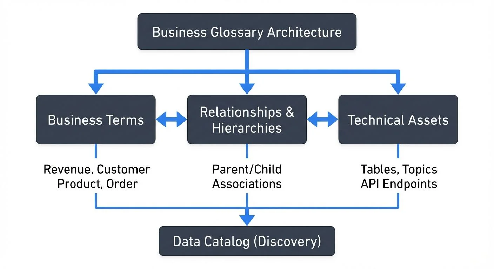

# Building a Business Glossary for Data Governance

In the complex landscape of modern data management, one of the most persistent challenges organizations face is establishing a common language across business and technical teams. A well-constructed business glossary serves as the cornerstone of effective data governance, providing the semantic layer that connects business terminology with technical data assets. For a deeper exploration of semantic layers in streaming contexts, see [Semantic Layer for Streaming](https://conduktor.io/glossary/semantic-layer-for-streaming).

## Understanding the Business Glossary



<!-- ORIGINAL_DIAGRAM
```
┌────────────────────────────────────────────────────────────────┐
│              Business Glossary Architecture                    │
└────────────────────────────────────────────────────────────────┘
                              │
         ┌────────────────────┼────────────────────┐
         │                    │                    │
    ┌────▼────────┐     ┌─────▼──────┐     ┌──────▼──────┐
    │  Business   │     │Relationships│     │  Technical  │
    │   Terms     │────▶│     &      │◀────│   Assets    │
    │             │     │ Hierarchies│     │             │
    └─────────────┘     └────────────┘     └─────────────┘
         │                    │                    │
    Revenue, Customer    Parent/Child         Tables, Topics
    Product, Order       Associations         API Endpoints
         │                    │                    │
         └────────────────────┼────────────────────┘
                              ▼
                    ┌─────────────────┐
                    │  Data Catalog   │
                    │   (Discovery)   │
                    └─────────────────┘
```
-->

A business glossary is more than a simple dictionary of terms. It's a living, governed repository that defines business concepts, their relationships, and their mappings to physical data assets. While a data dictionary focuses on technical metadata—column names, data types, and constraints—a business glossary operates at a higher level of abstraction, capturing the meaning and context that data holds within your organization.

Business glossaries are typically managed within data catalogs, which provide the technical infrastructure for discovery, search, and governance. For an overview of modern data catalog capabilities, see [What is a Data Catalog? Modern Data Discovery](https://conduktor.io/glossary/what-is-a-data-catalog-modern-data-discovery).

For instance, "customer" might mean different things across departments. Marketing might define it as anyone who has engaged with promotional content, while finance considers only those who have completed a purchase. Without a business glossary, these inconsistencies propagate through dashboards, reports, and analytics, leading to conflicting insights and eroded trust in data.

## Core Components of an Effective Business Glossary

### Business Terms and Definitions

Each term in your glossary should include a clear, agreed-upon definition that reflects how your organization uses the concept. Avoid technical jargon in these definitions—they should be understandable to business stakeholders. Include context about when and how the term applies, along with any specific business rules or calculations.

### Relationships and Hierarchies

Terms rarely exist in isolation. Document how concepts relate to one another through hierarchies, associations, and dependencies. A "revenue" term might have child terms like "gross revenue," "net revenue," and "recurring revenue," each with distinct definitions and calculation methods.

### Data Asset Mappings

The real power of a business glossary emerges when you link business terms to their technical implementations. Map terms to database tables, columns, API endpoints, and even streaming topics. This bidirectional linkage allows business analysts to find the data they need and data engineers to understand the business impact of technical changes.

When combined with data lineage tracking, glossary terms flow through transformation pipelines, enabling end-to-end business context from source to consumption. For detailed coverage of lineage tracking, see [Data Lineage: Tracking Data from Source to Consumption](https://conduktor.io/glossary/data-lineage-tracking-data-from-source-to-consumption).

### Ownership and Stewardship

Assign clear ownership to each term. Data stewards should be subject matter experts who can validate definitions, approve changes, and resolve ambiguities. This governance layer ensures the glossary remains authoritative and current.

For detailed guidance on establishing roles and responsibilities, see [Data Governance Framework: Roles and Responsibilities](https://conduktor.io/glossary/data-governance-framework-roles-and-responsibilities).

## Building Your Glossary: A Practical Approach

### Start with High-Impact Terms

Don't attempt to catalog your entire organizational vocabulary at once. Begin with the terms that appear most frequently in critical business processes, reports, and decisions. Focus on areas where misalignment has caused concrete problems—missed targets, compliance issues, or conflicting analytics.

Conduct workshops with cross-functional teams to document these terms. These sessions often reveal surprising discrepancies in understanding and provide opportunities to build consensus early.

### Establish Governance Workflows

Create formal processes for proposing, reviewing, and approving glossary entries. This might include:

- Submission templates that ensure consistent information capture
- Review committees with representatives from business and technical teams
- Approval workflows with appropriate stakeholders
- Change management processes for updating existing terms
- Versioning to track how definitions evolve over time

### Integrate with Technical Metadata

The value of your business glossary multiplies when integrated with your technical metadata infrastructure. Modern data catalogs (2025) provide sophisticated glossary capabilities with automated linking:

**Enterprise Data Catalogs:**
- **Atlan**: AI-powered glossary with automated term propagation and column-level lineage
- **Collibra**: Workflow-driven governance with business glossary as the central hub
- **Microsoft Purview**: Cloud-native catalog integrating with Azure ecosystem and Microsoft 365
- **DataHub (LinkedIn)**: Open-source metadata platform with real-time glossary updates
- **Alation**: Behavioral AI that learns from data usage patterns to suggest glossary mappings

**Cloud-Native Options:**
- **AWS Glue Data Catalog**: Native integration with AWS services and Lake Formation
- **Google Cloud Data Catalog**: Automatic discovery and tagging with Data Loss Prevention (DLP)

These platforms automatically link business terms to database schemas, data warehouse models, BI dashboards, and streaming topics. This integration enables impact analysis—when a business term changes, you can immediately see which reports, dashboards, pipelines, and systems are affected.

For detailed coverage of technical versus business metadata and their relationship, see [Metadata Management: Technical vs Business Metadata](https://conduktor.io/glossary/metadata-management-technical-vs-business-metadata).

## Streaming Integration and Real-Time Glossaries

As organizations adopt streaming architectures for real-time data processing, the business glossary must extend to cover event streams and topics. Streaming platforms like Apache Kafka have become critical infrastructure, yet the business meaning of event payloads often remains opaque.

Document your streaming terms with the same rigor as batch data. Define what business events your topics represent, the business entities they describe, and how event attributes map to business concepts. For example, a "payment.processed" event topic should have glossary entries explaining the business meaning of each field in the event payload.

### Practical Streaming Glossary Integration

**Schema Registry Integration:**

Link business terms directly to schema definitions in Confluent Schema Registry or AWS Glue Schema Registry:

```json
{
  "namespace": "com.example.payments",
  "type": "record",
  "name": "PaymentProcessed",
  "doc": "Business Glossary: Payment Transaction Event - represents completed payment processing",
  "fields": [
    {
      "name": "transactionId",
      "type": "string",
      "doc": "Glossary Term: Transaction ID - unique identifier for payment transaction"
    },
    {
      "name": "amount",
      "type": "double",
      "doc": "Glossary Term: Transaction Amount - gross payment value before fees"
    },
    {
      "name": "currency",
      "type": "string",
      "doc": "Glossary Term: Currency Code - ISO 4217 three-letter currency code"
    }
  ]
}
```

**Stream Governance Tools (2025):**

Modern platforms enable glossary integration:

- **Conduktor**: Visual stream governance with glossary-driven topic validation, automatic schema-to-glossary mapping, and approval workflows
- **DataHub**: Real-time metadata ingestion from Kafka with glossary term propagation
- **StreamSets**: Data pipeline observability with business context from glossary terms

These tools enforce naming conventions, validate topic alignment with approved business terms, and maintain semantic consistency across batch and streaming ecosystems. This integration proves valuable for data governance officers managing hybrid architectures, allowing business analysts to discover relevant topics through business terminology rather than navigating technical names and schemas.

For implementation details on schema management and evolution, see [Schema Registry and Schema Management](https://conduktor.io/glossary/schema-registry-and-schema-management). For broader streaming governance patterns, refer to [Apache Kafka](https://conduktor.io/glossary/apache-kafka).

## Maintaining Glossary Quality

### Regular Audits and Updates

Schedule periodic reviews of glossary content. Business terminology evolves as your organization grows, enters new markets, or undergoes digital transformation. Stale definitions undermine trust and adoption.

### Usage Analytics

Monitor which terms are searched, viewed, and referenced most frequently. Low-engagement terms might need better definitions or may not be as important as initially thought. High-engagement terms deserve extra attention to ensure their accuracy and completeness.

### Feedback Mechanisms

Enable users to suggest corrections, request new terms, or ask questions about definitions. This crowdsourced input keeps your glossary aligned with actual business usage while building a culture of shared data ownership.

## AI-Powered Glossary Management (2025)

Modern glossary platforms leverage artificial intelligence and machine learning to automate and enhance glossary management:

### Automated Term Extraction

AI models scan existing documentation, code comments, data dictionaries, and SQL queries to identify candidate business terms automatically. Natural language processing (NLP) extracts frequently used concepts and suggests them for glossary inclusion, dramatically reducing manual cataloging effort.

### Intelligent Definition Generation

Large language models (LLMs) can draft initial term definitions based on context from:
- Database column names and comments
- Business documentation and wiki pages
- Historical usage patterns in queries and reports
- Similar terms in the existing glossary

These AI-generated definitions serve as starting points for subject matter experts, accelerating glossary population while maintaining human oversight for accuracy.

### Smart Term Matching and Classification

Machine learning algorithms automatically:
- Match technical column names to business terms (e.g., "cust_id" → "Customer Identifier")
- Classify terms into categories (financial, operational, customer-facing)
- Detect synonyms and suggest term consolidation
- Identify potential duplicates or conflicting definitions
- Automatically tag sensitive terms (PII, financial data) for compliance

For comprehensive strategies on data classification and tagging, see [Data Classification and Tagging Strategies](https://conduktor.io/glossary/data-classification-and-tagging-strategies).

### Usage Analytics and Recommendations

AI-powered systems track how data assets are queried and consumed, then recommend:
- Which terms need better documentation based on search patterns
- Which datasets should be linked to specific business terms
- High-value terms that deserve prioritization based on usage frequency

Tools like Atlan's AI-powered glossary assistant, Alation's behavioral AI, and Collibra's ML-driven recommendations demonstrate these capabilities in production environments.

For related automation in data quality, see [Automated Data Quality Testing](https://conduktor.io/glossary/automated-data-quality-testing) and [Building a Data Quality Framework](https://conduktor.io/glossary/building-a-data-quality-framework).

## Data Mesh and Domain-Specific Glossaries

In data mesh architectures, business glossaries operate at both global and domain levels, reflecting the decentralized nature of data ownership.

### Domain Glossaries

Each data domain (e.g., Customer, Product, Finance) maintains its own glossary of domain-specific terms, owned and curated by domain teams. Domain glossaries define:

- **Domain-specific entities**: Terms unique to that domain's context
- **Local definitions**: How the domain interprets shared concepts
- **Domain data products**: Business meaning of published data products

For example, the Customer domain defines "Customer Lifetime Value" while the Finance domain defines "Revenue Recognition Period"—both valid within their contexts.

### Global Enterprise Glossary

The global glossary establishes common terminology across domains:

- **Cross-domain entities**: Terms used by multiple domains (e.g., "Customer", "Order")
- **Standardized definitions**: Agreed-upon meanings that all domains respect
- **Federated governance**: Coordination between domain glossaries

### Glossary Federation Pattern

Modern implementations support glossary federation where:

1. Domain teams maintain autonomy over domain-specific terms
2. Global glossary defines shared vocabulary and standards
3. Data catalog platforms (DataHub, Purview, Atlan) automatically aggregate and link domain glossaries
4. Conflicts are surfaced through automated governance checks

This approach balances consistency with domain autonomy, preventing the glossary from becoming a centralized bottleneck.

For comprehensive coverage of data mesh principles, see [Data Mesh Principles and Implementation](https://conduktor.io/glossary/data-mesh-principles-and-implementation). For data product governance patterns, refer to [Building and Managing Data Products](https://conduktor.io/glossary/building-and-managing-data-products) and [Data Product Governance](https://conduktor.io/glossary/data-product-governance).

## Common Challenges and Best Practices

### Challenge: Low Adoption

**Symptom**: Glossary exists but few people use it.

**Solutions**:
- Embed glossary directly in data tools (BI platforms, SQL editors, data notebooks)
- Make glossary search the default in your data catalog
- Gamify contributions with leaderboards and recognition
- Demonstrate ROI with concrete examples of time saved or errors prevented

### Challenge: Glossary Becomes Stale

**Symptom**: Definitions are outdated or terms are deprecated.

**Solutions**:
- Automate freshness checks by comparing glossary terms to actual data usage
- Set review cycles tied to business planning (quarterly, annually)
- Alert term owners when usage patterns change significantly
- Archive unused terms rather than deleting them (maintain history)

### Challenge: Conflicting Definitions Across Departments

**Symptom**: Multiple teams define the same term differently.

**Solutions**:
- Document context-specific definitions with clear scope (e.g., "Customer - Marketing definition")
- Establish a cross-functional data council to resolve conflicts
- Use qualified names (namespaces) to distinguish domain-specific interpretations
- Leverage data mesh patterns for federated glossary management

### Challenge: Glossary Scope Creep

**Symptom**: Glossary becomes unwieldy with thousands of rarely-used terms.

**Solutions**:
- Start with top 50-100 high-impact terms
- Require business justification for new term additions
- Archive low-engagement terms after analysis
- Focus on terms that drive decisions, not every database column

## Measuring Success

A successful business glossary should demonstrate measurable impact:

- **Time to Insight**: Reduced time for analysts to find and understand data (target: 30-50% reduction)
- **Data Trust**: Decreased incidents of misinterpreted data leading to wrong decisions
- **Onboarding Velocity**: Faster onboarding of new team members to data assets (target: 2-3x faster)
- **Compliance**: Improved compliance through clear documentation of regulated terms
- **Reuse Rate**: Higher reuse of existing data assets versus duplicate creation (target: 40%+ reuse rate)
- **Engagement Metrics**: Search volume, term views, and contribution rates

Track these metrics quarterly and report to leadership to demonstrate glossary value and justify continued investment.

## Conclusion

Building a business glossary is an investment in organizational clarity and alignment. It transforms data governance from a compliance checkbox into a strategic enabler, bridging the gap between what business needs and what technology delivers.

The landscape has evolved significantly in 2025. Modern glossary platforms leverage AI for automated term extraction, intelligent classification, and smart recommendations. Cloud-native data catalogs provide seamless integration across batch and streaming systems. Data mesh architectures enable federated glossary management while maintaining global consistency.

Start small with high-impact terms, establish clear governance workflows, integrate deeply with your technical infrastructure through modern data catalog platforms, and leverage AI to accelerate glossary population and maintenance. Whether your data flows through traditional databases, cloud data warehouses, or real-time streaming platforms like Kafka, a well-maintained business glossary ensures everyone in your organization speaks the same language when it comes to data.

For data governance officers and business analysts, the glossary becomes both a reference tool and a collaboration platform—a shared space where business meaning and technical implementation meet, enabling data-driven decisions grounded in common understanding.

## Related Concepts

- [Metadata Management: Technical vs Business Metadata](https://conduktor.io/glossary/metadata-management-technical-vs-business-metadata) - Understanding different types of metadata in governance
- [Data Classification and Tagging Strategies](https://conduktor.io/glossary/data-classification-and-tagging-strategies) - Organizing and labeling data for governance
- [Schema Registry and Schema Management](https://conduktor.io/glossary/schema-registry-and-schema-management) - Managing technical schemas alongside business definitions

## Sources

1. DAMA International - "DAMA-DMBOK: Data Management Body of Knowledge" (2023 Edition) - https://www.dama.org/cpages/body-of-knowledge
2. Atlan - "The Modern Data Catalog: AI-Powered Glossary Management" (2025) - https://atlan.com/glossary/
3. Microsoft - "Microsoft Purview Data Catalog Documentation" (2025) - https://learn.microsoft.com/azure/purview/
4. DataHub Project - "DataHub Glossary and Metadata Management" (2025) - https://datahubproject.io/docs/
5. Collibra - "Business Glossary Best Practices and Governance Workflows" (2024) - https://www.collibra.com/glossary/
6. Confluent - "Stream Governance and Schema Registry Integration" (2025) - https://docs.confluent.io/platform/current/schema-registry/
7. Alation - "Building a Business Glossary: Implementation Guide" (2024) - https://www.alation.com/blog/business-glossary/
8. Gartner - "Magic Quadrant for Metadata Management Solutions" (2024) - https://www.gartner.com/en/documents/metadata-management
