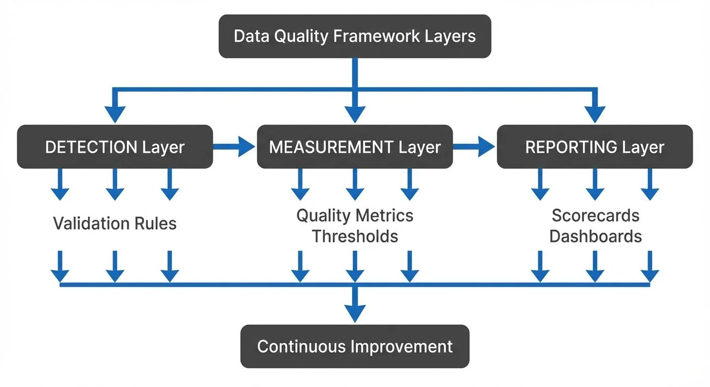

Data quality is the foundation of trustworthy analytics, reliable machine learning models, and sound business decisions. For Data Governance Officers and Data Quality Analysts, establishing a comprehensive data quality framework is not just a technical exercise—it's a strategic imperative that impacts every data-driven initiative across the organization.

## Understanding the Data Quality Framework

A data quality framework is a structured approach to measuring, monitoring, and improving data quality across your organization. It encompasses the processes, metrics, tools, and governance structures needed to ensure data meets the quality standards required for its intended use.

The framework typically addresses six core dimensions of data quality: accuracy, completeness, consistency, timeliness, validity, and uniqueness. Each dimension requires specific validation rules, measurement approaches, and remediation strategies tailored to your organization's data landscape and business requirements.

## Designing Your Framework Architecture

<!-- ORIGINAL_DIAGRAM
```
┌────────────────────────────────────────────────────────────────┐
│             Data Quality Framework Layers                      │
└────────────────────────────────────────────────────────────────┘
                              │
         ┌────────────────────┼────────────────────┐
         │                    │                    │
    ┌────▼─────────┐    ┌─────▼────────┐    ┌─────▼────────┐
    │  DETECTION   │    │ MEASUREMENT  │    │  REPORTING   │
    │    Layer     │───▶│    Layer     │───▶│    Layer     │
    └──────────────┘    └──────────────┘    └──────────────┘
         │                    │                    │
    Validation          Quality Metrics      Scorecards
    Rules               Thresholds           Dashboards
         │                    │                    │
         └────────────────────┼────────────────────┘
                              ▼
                    ┌─────────────────┐
                    │  Continuous     │
                    │  Improvement    │
                    └─────────────────┘
```
-->

Begin by establishing clear ownership and accountability structures. Every dataset should have a designated data steward responsible for quality standards, while data quality analysts focus on implementing and monitoring quality checks. This separation of concerns ensures both business context and technical rigor are applied to quality management.

Your framework architecture should include three primary layers: the **detection layer** that identifies quality issues, the **measurement layer** that quantifies quality levels, and the **reporting layer** that communicates quality status to stakeholders. These layers work together to create a continuous feedback loop that drives quality improvement.

Consider both batch and streaming data patterns in your design. While batch processing allows for comprehensive quality checks on historical data, streaming data requires real-time validation to catch issues before they propagate through your data pipelines. This dual approach ensures quality controls operate at the speed of your business.

## Defining Quality Metrics and Validation Rules

Quality metrics provide quantifiable measures of data health. Start with foundational metrics like completeness rates (percentage of non-null values), accuracy scores (comparison against trusted sources), and consistency checks (verification across systems). These metrics should be specific, measurable, and aligned with business impact.

Validation rules translate quality requirements into executable checks. For example, a customer email field might require format validation (proper email structure), uniqueness validation (no duplicates), and domain validation (only approved domains). Document each rule with its business rationale, severity level, and expected threshold.

Here's a practical example of implementing data quality validation in Python:

```python
import re
from dataclasses import dataclass
from typing import List, Optional
from enum import Enum

class Severity(Enum):
    CRITICAL = "critical"
    MAJOR = "major"
    MINOR = "minor"

@dataclass
class ValidationResult:
    field: str
    passed: bool
    severity: Severity
    message: Optional[str] = None

class DataQualityValidator:
    def __init__(self):
        self.approved_domains = ['company.com', 'partner.com']

    def validate_email(self, email: str) -> List[ValidationResult]:
        """Validate email field against multiple quality rules."""
        results = []

        # Completeness check FIRST (avoid regex on null/empty values)
        if not email or email.strip() == "":
            results.append(ValidationResult(
                field="email",
                passed=False,
                severity=Severity.CRITICAL,
                message="Email field is empty"
            ))
            return results  # Early return, don't check format/domain on empty values

        # Format validation
        email_pattern = r'^[a-zA-Z0-9._%+-]+@[a-zA-Z0-9.-]+\.[a-zA-Z]{2,}$'
        if not re.match(email_pattern, email):
            results.append(ValidationResult(
                field="email",
                passed=False,
                severity=Severity.CRITICAL,
                message=f"Invalid email format: {email}"
            ))
            return results  # Don't check domain if format is invalid

        # Domain validation (only if format is valid)
        if '@' in email:
            domain = email.split('@')[1]
            if domain not in self.approved_domains:
                results.append(ValidationResult(
                    field="email",
                    passed=False,
                    severity=Severity.MAJOR,
                    message=f"Unapproved domain: {domain}"
                ))

        # If no issues found, return success
        if not results:
            results.append(ValidationResult(
                field="email",
                passed=True,
                severity=Severity.MINOR
            ))

        return results

    def calculate_completeness_rate(self, records: List[dict], field: str) -> float:
        """Calculate completeness rate for a specific field."""
        total = len(records)
        if total == 0:
            return 0.0

        non_null = sum(1 for r in records if r.get(field) is not None and str(r.get(field)).strip() != "")
        return (non_null / total) * 100

# Example usage
validator = DataQualityValidator()

# Validate individual record
results = validator.validate_email("user@company.com")
for result in results:
    print(f"{result.severity.value}: {result.message if result.message else 'Passed'}")

# Calculate completeness for a dataset
records = [
    {"email": "user1@company.com", "age": 25},
    {"email": "", "age": 30},
    {"email": "user3@company.com", "age": None}
]
completeness = validator.calculate_completeness_rate(records, "age")
print(f"Age field completeness: {completeness:.1f}%")
```

Implement a tiered severity model for quality issues: **critical** issues that block data usage, **major** issues that significantly impact reliability, and **minor** issues that should be monitored but don't prevent usage. This classification helps prioritize remediation efforts and set appropriate alerting thresholds.

Create quality rules that are both preventive and detective. Preventive rules enforce quality at data entry or ingestion points, while detective rules identify issues in existing data. For streaming scenarios, preventive rules are particularly valuable as they stop bad data before it enters downstream systems.

## Building Quality Scorecards

Quality scorecards aggregate metrics into actionable dashboards that communicate data health to various stakeholder groups. Executive scorecards might show overall quality trends and business impact, while operational scorecards provide detailed breakdowns by dataset, data domain, or quality dimension.

Design scorecards with clear visual indicators—green, yellow, and red status indicators quickly communicate whether quality meets expectations. Include trend lines to show improvement or degradation over time, and contextualize metrics with business impact assessments that translate quality scores into business terms.

Your scorecards should answer key questions: Which datasets have the highest quality issues? Are quality trends improving or declining? What is the business impact of current quality levels? Which data domains require immediate attention? These insights drive prioritization and resource allocation for quality improvement initiatives.

## Implementing Streaming Quality Checks

Modern data architectures increasingly rely on streaming platforms like Apache Kafka for real-time data movement. Integrating quality checks into streaming pipelines ensures issues are caught immediately rather than discovered downstream when they've already impacted analytics or operations.

Use schema validation as your first line of defense in streaming scenarios. Governance platforms provide real-time schema enforcement capabilities, ensuring every message conforms to expected structure before entering your data platform. This prevents schema evolution issues and malformed data from propagating through your systems.

Implement stateful streaming quality checks for metrics that require aggregation or historical context. For example, detecting duplicate records in a stream requires maintaining state about previously seen keys. Similarly, checking for referential integrity or validating business rules often requires looking up reference data or maintaining running aggregations.

Here's an example of implementing streaming quality checks using Kafka Streams:

```java
import org.apache.kafka.streams.*;
import org.apache.kafka.streams.kstream.*;
import java.time.Duration;
import java.util.*;

// Data model
class CustomerRecord {
    public String customerId;
    public String email;
    public Integer age;
    public List<String> qualityErrors = new ArrayList<>();
}

public class StreamingQualityValidator {

    public static void main(String[] args) {
        Properties props = new Properties();
        props.put(StreamsConfig.APPLICATION_ID_CONFIG, "data-quality-validator");
        props.put(StreamsConfig.BOOTSTRAP_SERVERS_CONFIG, "localhost:9092");

        StreamsBuilder builder = new StreamsBuilder();

        // Read incoming data stream
        KStream<String, CustomerRecord> sourceStream =
            builder.stream("customer-events");

        // Branch stream into valid and invalid records
        Map<String, KStream<String, CustomerRecord>> branches = sourceStream
            .split(Named.as("quality-"))
            .branch((key, record) -> isValid(record), Branched.as("valid"))
            .branch((key, record) -> !isValid(record), Branched.as("invalid"))
            .noDefaultBranch();

        // Send valid records to main topic
        branches.get("quality-valid")
            .to("customer-validated");

        // Send invalid records to quarantine for review
        branches.get("quality-invalid")
            .mapValues(record -> enrichWithQualityErrors(record))
            .to("customer-quarantine");

        // Detect duplicates using stateful processing
        KStream<String, CustomerRecord> validStream = branches.get("quality-valid");
        validStream
            .groupByKey()
            .windowedBy(TimeWindows.ofSizeWithNoGrace(Duration.ofMinutes(5)))
            .count()
            .toStream()
            .filter((windowedKey, count) -> count > 1)
            .map((windowedKey, count) ->
                KeyValue.pair(windowedKey.key(),
                    "Duplicate detected: " + count + " occurrences"))
            .to("quality-alerts");

        KafkaStreams streams = new KafkaStreams(builder.build(), props);
        streams.start();
    }

    private static boolean isValid(CustomerRecord record) {
        // Completeness checks
        if (record.email == null || record.email.isEmpty()) {
            return false;
        }

        // Format validation
        if (!record.email.matches("^[A-Za-z0-9+_.-]+@(.+)$")) {
            return false;
        }

        // Business rule validation
        if (record.age != null && (record.age < 0 || record.age > 150)) {
            return false;
        }

        return true;
    }

    private static CustomerRecord enrichWithQualityErrors(CustomerRecord record) {
        List<String> errors = new ArrayList<>();

        if (record.email == null || record.email.isEmpty()) {
            errors.add("Missing required field: email");
        } else if (!record.email.matches("^[A-Za-z0-9+_.-]+@(.+)$")) {
            errors.add("Invalid email format");
        }

        if (record.age != null && (record.age < 0 || record.age > 150)) {
            errors.add("Age out of valid range");
        }

        record.qualityErrors = errors;
        return record;
    }
}
```

Consider quality check performance carefully in streaming contexts. Quality validations must process data at the rate it arrives without creating backpressure or latency. Design checks to be computationally efficient and scalable, using techniques like sampling for expensive validations that don't need to run on every record. For backpressure handling strategies, see [Backpressure Handling in Streaming Systems](https://conduktor.io/glossary/backpressure-handling-in-streaming-systems).

## Modern Data Quality Tools (2025)

The data quality tooling landscape has evolved significantly. Modern frameworks complement custom validation code with declarative quality definitions and automated monitoring:

**Soda Core**: Open-source data quality testing framework using YAML-based quality checks. Define data contracts and quality rules declaratively, integrating with orchestration tools like Airflow and Dagster.

**dbt Tests and Contracts**: dbt (data build tool) now includes native data quality testing and contracts. Define expectations in SQL and enforce them during transformation workflows. dbt contracts (introduced in dbt 1.5+) provide explicit interfaces between models with automatic validation.

**Elementary Data**: Observability platform for dbt that provides automatic data quality monitoring, anomaly detection, and lineage tracking. Complements dbt's built-in testing with ML-based anomaly detection.

**Great Expectations**: Comprehensive data validation framework with extensive built-in expectations. See [Great Expectations: Data Testing Framework](https://conduktor.io/glossary/great-expectations-data-testing-framework) for implementation patterns.

**Data Contracts (ODCS)**: The Open Data Contract Standard (ODCS v3.1.0) provides a specification for formal data contracts. See [Data Contracts for Reliable Pipelines](https://conduktor.io/glossary/data-contracts-for-reliable-pipelines) for implementation guidance.

These tools integrate with streaming platforms like Kafka, enabling real-time quality validation alongside custom code solutions.

## Monitoring and Platform Integration

Governance platforms provide comprehensive monitoring capabilities for streaming-based data quality frameworks. Use data lineage features to track how quality issues propagate through your pipelines, identifying exactly where problems originate and which downstream consumers are affected.

Leverage platform governance policies to enforce quality standards at the infrastructure level. Define policies that automatically reject messages failing validation criteria, route problematic data to quarantine topics for review, or trigger alerts when quality thresholds are breached. These automated governance controls ensure quality standards are consistently applied across all streaming data flows. For actionable implementation with Conduktor, see [Data Quality Policies](https://docs.conduktor.io/guide/conduktor-concepts/data-quality-policies) and [Governance Insights](https://docs.conduktor.io/guide/insights/governance).

Testing capabilities in modern platforms allow you to validate quality rules before deploying them to production. Create test scenarios with both valid and invalid data to verify your validation logic catches expected issues without generating false positives. This testing discipline prevents quality frameworks from becoming obstacles to legitimate data flows.

## Establishing Continuous Improvement

A data quality framework is never truly complete—it evolves with your data landscape and business needs. Establish regular reviews of quality metrics, validation rules, and scorecards to ensure they remain relevant and effective. Incorporate feedback from data consumers about quality issues they encounter in practice.

Measure the business impact of quality improvements to demonstrate value and secure ongoing investment in quality initiatives. Track metrics like reduced incident response time, decreased data rework efforts, or improved decision confidence. These outcomes connect technical quality metrics to business value.

Create feedback loops between quality measurement and data platform improvements. When quality issues reveal systemic problems—inadequate data validation, missing reference data, or architectural gaps—use these insights to drive platform enhancements that prevent entire classes of quality issues.

## Related Concepts

- [Automated Data Quality Testing](https://conduktor.io/glossary/automated-data-quality-testing) - Implementing continuous testing practices
- [Data Quality Dimensions: Accuracy, Completeness, and Consistency](https://conduktor.io/glossary/data-quality-dimensions-accuracy-completeness-and-consistency) - Core quality metrics to track
- [Data Contracts for Reliable Pipelines](https://conduktor.io/glossary/data-contracts-for-reliable-pipelines) - Formalizing quality expectations

## Conclusion

Building a data quality framework requires balancing technical rigor with practical business needs. By establishing clear metrics, implementing both batch and streaming validation, creating actionable scorecards, and leveraging governance platforms for streaming oversight, you create a foundation for trustworthy data that enables confident decision-making. The framework you build today becomes the trust infrastructure that supports your organization's data-driven future.

## Sources and References

1. **Data Quality: The Accuracy Dimension** by Jack E. Olson (Morgan Kaufmann, 2003) - Comprehensive guide to data quality dimensions and measurement techniques.

2. **DAMA-DMBOK: Data Management Body of Knowledge** (2nd Edition, 2017) - Industry standard framework for data governance and quality management practices. Available at: https://www.dama.org/cpages/body-of-knowledge

3. **Designing Data-Intensive Applications** by Martin Kleppmann (O'Reilly, 2017) - Chapter 12 covers data quality, consistency, and validation patterns in distributed systems.

4. **Apache Kafka Documentation - Stream Processing** - Official documentation on implementing stateful stream processing for data validation. Available at: https://kafka.apache.org/documentation/streams/

5. **The Data Quality Dimensions: A Comprehensive Framework** by Richard Y. Wang and Diane M. Strong, MIT Sloan School of Management (1996) - Foundational research paper defining the six dimensions of data quality used across the industry.
