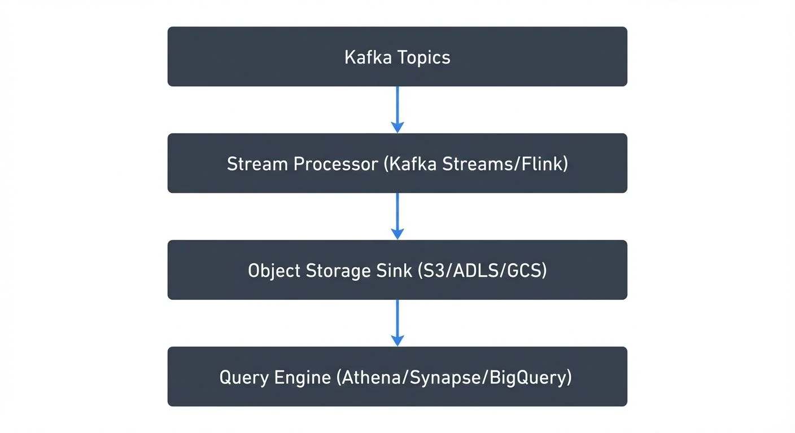

# Building a Modern Data Lake on Cloud Storage

Data lakes have become the foundation of modern data architectures, enabling organizations to store vast amounts of structured and unstructured data at scale while maintaining flexibility for diverse analytics workloads. Unlike traditional data warehouses with rigid schemas, data lakes embrace a "store first, structure later" approach that's particularly well-suited to today's cloud-native storage solutions.

## Why Cloud Object Storage?

Cloud object storage services—AWS S3, Azure Data Lake Storage Gen2, and Google Cloud Storage—have emerged as the de facto standard for data lake implementations. Their advantages are compelling:

**Infinite scalability**: No capacity planning required. Your storage grows elastically with your data, from gigabytes to exabytes.

**Cost-efficiency**: Pay only for what you use, with tiered storage classes (hot, cool, archive) that optimize costs based on access patterns. Storage costs have dropped dramatically, making it economical to retain years of historical data.

**Durability and availability**: Built-in replication across availability zones provides 99.999999999% (11 nines) durability, eliminating the need to manage complex backup strategies.

**Separation of storage and compute**: Unlike traditional systems, you can scale processing power independently from storage, running multiple analytics engines (Spark, Presto, Athena) against the same dataset.

## Architectural Patterns

### The Three-Zone Architecture

A well-designed data lake typically follows a three-zone pattern that mirrors the data refinement process. For detailed best practices on implementing this architecture, see [Data Lake Zones: Bronze, Silver, Gold Architecture](https://conduktor.io/glossary/data-lake-zones-bronze-silver-gold-architecture).

**Raw Zone (Bronze Layer)**: Immutable source data stored exactly as ingested. This might include JSON logs from applications, CSV exports from databases, or binary files like images. Partition by ingestion date (e.g., `s3://datalake/raw/system_logs/year=2025/month=12/day=07/`) to enable efficient pruning.

**Curated Zone (Silver Layer)**: Cleansed, validated, and transformed data in standardized formats. Convert to columnar formats like Parquet or ORC for better compression and query performance. This layer often includes deduplication, schema enforcement, and data quality checks.

**Analytics Zone (Gold Layer)**: Business-ready datasets optimized for specific use cases. These are often aggregated, denormalized, and partitioned by business dimensions (region, product line, customer segment) rather than just time.

### Storage Format Selection

Choosing the right file format significantly impacts performance and cost:

**Parquet**: Columnar format ideal for analytical queries. Instead of storing data row-by-row, Parquet stores each column separately, enabling queries to read only the columns they need (reducing I/O by 10-100x). Excellent compression ratios and predicate pushdown support (filtering data at storage level before reading into memory). Use for structured data that's queried by specific columns.

**Avro**: Row-oriented with strong schema evolution support (ability to add/remove fields without breaking existing data readers). Preferred for write-heavy workloads and streaming data where you need to preserve exact record order.

**Open Table Formats (Iceberg/Delta Lake/Hudi)**: Modern table formats that bring ACID transactions (atomicity, consistency, isolation, durability), time travel, and schema evolution to object storage. Apache Iceberg has emerged as the industry standard in 2024-2025, with adoption across Snowflake, Databricks, AWS, Google Cloud, and nearly all major data platforms. These formats are essential for scenarios requiring updates, deletes, or consistent reads during writes. For detailed coverage of Iceberg's architecture and capabilities, see [Apache Iceberg](https://conduktor.io/glossary/apache-iceberg).

## Platform-Specific Implementations

### AWS S3 Data Lake

```yaml
# S3 bucket structure
s3://production-datalake/
  raw/
    clickstream/
      year=2025/month=12/day=07/
        events-{timestamp}.json.gz
  curated/
    user_sessions/
      region=us-east/
        part-00000.parquet
  analytics/
    daily_metrics/
      report_date=2025-12-07/
        metrics.parquet
```

Leverage S3 features:
- **S3 Intelligent-Tiering**: Automatically moves objects between access tiers based on usage patterns
- **S3 Select**: Query data in place using SQL without downloading entire files
- **S3 Express One Zone** (2024+): High-performance storage class delivering single-digit millisecond latency for frequently accessed data, ideal for real-time analytics workloads
- **S3 Tables** (2024+): AWS-native Apache Iceberg table management with automatic optimization, compaction, and query performance improvements. Simplifies lakehouse operations without separate table format maintenance
- **AWS Glue Data Catalog**: Central metadata repository that integrates with Athena, EMR, and Redshift Spectrum. Now includes native Iceberg table support (2024+) with full schema evolution and time travel capabilities
- **S3 Event Notifications**: Trigger Lambda functions or SQS messages when new data arrives

### Azure Data Lake Storage Gen2

ADLS Gen2 combines blob storage's scalability with hierarchical namespaces that enable directory-level operations and POSIX permissions (Unix-style read/write/execute permissions familiar to Linux users):

```bash
# ADLS Gen2 structure with hierarchical namespace
abfss://datalake@storageaccount.dfs.core.windows.net/
  /raw/transactional_db/orders/year=2025/month=12/
  /curated/customer_360/
  /analytics/sales_dashboard/
```

Key capabilities:
- **Azure Synapse Analytics**: Integrated analytics workspace combining data engineering, warehousing, and BI
- **Azure Databricks**: Optimized Spark with Delta Lake and Unity Catalog support (2024+) for unified batch and streaming with centralized governance
- **Role-Based Access Control (RBAC)**: Fine-grained security at the directory and file level
- **Microsoft Purview** (evolved from Azure Purview): Unified data governance providing automated data discovery, classification, and lineage tracking across your entire data estate

### Google Cloud Storage

GCS offers a unified object storage API with automatic performance optimization:

```python
# GCS bucket organization
gs://company-datalake/
  raw/pubsub_events/
  curated/enriched_events/
  analytics/ml_features/
```

Notable features:
- **BigQuery External Tables**: Query GCS data directly without loading into BigQuery
- **Cloud Storage FUSE**: Mount buckets as file systems for legacy applications
- **Autoclass**: Automatic storage class transitions based on access patterns

## Unified Table Catalogs and Governance (2024-2025)

A critical evolution in modern data lakes is the emergence of unified table catalogs that provide centralized metadata management across table formats, engines, and clouds:

**Open Source Catalogs**:
- **Apache Polaris**: Open catalog for Apache Iceberg supporting multi-engine access with centralized governance
- **Project Nessie**: Git-like semantics for data lakes with branching, tagging, and versioning of table metadata
- **Unity Catalog** (Databricks, now open-sourced): Cross-platform catalog supporting Delta Lake, Iceberg, and Hudi with fine-grained access control

**Platform-Integrated Catalogs**:
- **AWS Glue with Iceberg**: Native Iceberg support enabling consistent table access across Athena, EMR, Redshift, and third-party engines
- **Google BigLake**: Unified metadata layer providing fine-grained access control across BigQuery, Spark, and other engines
- **Azure Unity Catalog**: Centralized governance for Databricks and expanding to Synapse integration

These catalogs solve the historic "metadata sprawl" problem where each engine maintained separate metadata, leading to inconsistencies and governance challenges. In 2025, unified catalogs are considered essential for production data lakes. For an architectural overview of lakehouse patterns built on these catalogs, see [Introduction to Lakehouse Architecture](https://conduktor.io/glossary/introduction-to-lakehouse-architecture).

## Integrating Streaming Data

Modern data lakes must handle both batch and streaming ingestion. Apache Kafka infrastructure often feeds real-time data into your lake. For comprehensive streaming ingestion patterns, see [Streaming Ingestion to Lakehouse](https://conduktor.io/glossary/streaming-ingestion-to-lakehouse).

### Kafka to Data Lake Pipeline



<!-- ORIGINAL_DIAGRAM
```python
# Conceptual streaming pipeline
Kafka Topics
  ↓
Stream Processor (Kafka Streams/Flink)
  ↓
Object Storage Sink (S3/ADLS/GCS)
  ↓
Query Engine (Athena/Synapse/BigQuery)
```
-->

When streaming events into your data lake, modern patterns combine Kafka with table formats for reliable, exactly-once ingestion. For detailed Kafka fundamentals, see [Apache Kafka](https://conduktor.io/glossary/apache-kafka).

**Modern Streaming Best Practices (2025)**:

1. **Use Kafka Connect with Iceberg**: The Iceberg Sink Connector (Apache Kafka 3.x+) provides native table format support with automatic schema evolution and compaction. For building robust data pipelines with Kafka Connect, see [Kafka Connect: Building Data Integration Pipelines](https://conduktor.io/glossary/kafka-connect-building-data-integration-pipelines).

2. **Implement exactly-once semantics**: Kafka transactions (Kafka 3.0+) combined with Iceberg's ACID guarantees ensure data isn't duplicated during failures. Exactly-once delivery is now the standard for production streaming data lakes.

3. **Leverage Apache Flink 1.18+ for complex transformations**: Flink's native Iceberg sink provides millisecond-latency writes with automatic compaction and sorting, ideal for real-time analytics on lakehouse tables.

4. **Handle schema evolution**: Use Avro or Protobuf with schema registry to manage changes without breaking downstream consumers. For schema management patterns, see [Schema Registry and Schema Management](https://conduktor.io/glossary/schema-registry-and-schema-management). Both Iceberg and Delta Lake support automatic schema evolution when ingesting from evolving schemas.

## Best Practices

**Partition strategically**: Over-partitioning creates too many small files (inefficient for queries due to high metadata overhead), while under-partitioning forces full scans. Aim for files between 128MB-1GB—large enough to amortize open/close costs but small enough for parallel processing. Modern table formats like Iceberg handle this automatically through compaction.

**Implement data lifecycle policies**: Automatically archive or delete old data in the raw zone. Move infrequently accessed curated data to cheaper storage tiers.

**Secure by default**: Enable encryption at rest and in transit. Use IAM roles and policies for access control. Implement data catalog tagging for classification (PII, confidential, public).

**Monitor and optimize**: Track storage costs by zone and team. Use query performance metrics to identify partitioning improvements. Set up alerts for failed ingestion jobs.

**Document metadata**: Maintain a data catalog (AWS Glue, Microsoft Purview, Google Dataplex) describing datasets, owners, lineage, and SLAs. Poor metadata management is a common data lake failure mode. Modern catalogs integrate with unified table formats to provide automated lineage tracking and data discovery. For comprehensive coverage, see [What is a Data Catalog: Modern Data Discovery](https://conduktor.io/glossary/what-is-a-data-catalog-modern-data-discovery).

## Conclusion

Building a modern data lake on cloud storage requires thoughtful architecture that balances flexibility with governance. By leveraging the unique strengths of AWS S3, Azure Data Lake Storage, or Google Cloud Storage, implementing a structured zone-based approach, and adopting open table formats like Apache Iceberg with unified catalogs, you can create a scalable foundation for analytics that evolves with your organization's needs.

The 2024-2025 evolution toward lakehouse architectures—combining the flexibility of data lakes with the reliability of data warehouses—has made table formats and unified catalogs essential rather than optional. These technologies provide the ACID guarantees, time travel, and governance capabilities that production data lakes require. The key is starting with clear patterns while remaining adaptable as new technologies and requirements emerge.

## Related Concepts

- [Kafka Connect: Building Data Integration Pipelines](/kafka-connect-building-data-integration-pipelines)
- [What is Change Data Capture: CDC Fundamentals](/what-is-change-data-capture-cdc-fundamentals)
- [Data Lineage: Tracking Data from Source to Consumption](/data-lineage-tracking-data-from-source-to-consumption)

## Sources and References

- [AWS S3 Data Lake Best Practices](https://docs.aws.amazon.com/prescriptive-guidance/latest/defining-bucket-names-data-lakes/welcome.html) - AWS guidance on building data lakes with S3
- [Azure Data Lake Storage Gen2 Documentation](https://learn.microsoft.com/en-us/azure/storage/blobs/data-lake-storage-introduction) - Microsoft's hierarchical namespace and integration patterns
- [Google Cloud Storage Best Practices](https://cloud.google.com/storage/docs/best-practices) - GCS optimization and architecture patterns
- [Apache Parquet Documentation](https://parquet.apache.org/docs/) - Columnar storage format for efficient analytics
- [Delta Lake Documentation](https://docs.delta.io/) - ACID transactions and time travel for data lakes on cloud storage
