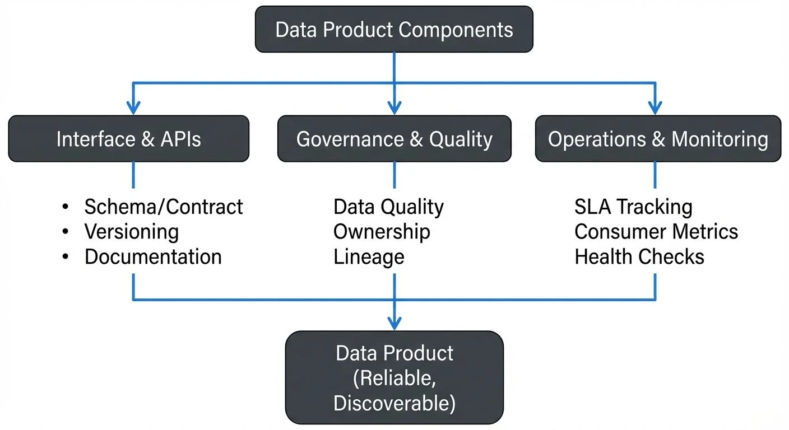

Data products represent a fundamental shift in how organizations think about data. Rather than treating data as a byproduct of applications or as raw material locked in databases, data products package data as consumable, reliable, and well-defined assets that serve specific user needs.

This article explores what data products are, how to design and build them, their relationship with streaming architectures, and best practices for governance and operations.

## What Are Data Products?

<!-- ORIGINAL_DIAGRAM
```
┌────────────────────────────────────────────────────────────────┐
│                  Data Product Components                       │
└────────────────────────────────────────────────────────────────┘
                              │
         ┌────────────────────┼────────────────────┐
         │                    │                    │
    ┌────▼──────┐       ┌─────▼─────┐       ┌─────▼──────┐
    │ Interface │       │Governance │       │ Operations │
    │  & APIs   │       │ & Quality │       │& Monitoring│
    └────┬──────┘       └─────┬─────┘       └─────┬──────┘
         │                    │                    │
    Schema/Contract      Data Quality         SLA Tracking
    Versioning           Ownership            Consumer Metrics
    Documentation        Lineage              Health Checks
         │                    │                    │
         └────────────────────┼────────────────────┘
                              ▼
                    ┌─────────────────┐
                    │  Data Product   │
                    │   (Reliable,    │
                    │  Discoverable)  │
                    └─────────────────┘
```
-->

A data product is a self-contained, reusable data asset designed with clear ownership, well-defined interfaces, and quality guarantees. Unlike traditional datasets or reports, data products are built with product thinking: they have users, versioned APIs, documentation, and service-level objectives.

Key characteristics include:

- **Clear ownership**: A dedicated team responsible for the product's quality and evolution
- **Well-defined interface**: Schemas, APIs, or contracts that consumers can depend on
- **Discovery and documentation**: Metadata, lineage, and usage examples
- **Quality guarantees**: Data quality checks, SLAs for freshness and completeness
- **Versioning**: Backward compatibility and deprecation policies

For example, a "Customer 360" data product might aggregate customer data from multiple sources, provide a standardized schema via an API, guarantee 99.9% uptime, and update within 5 minutes of source changes.

## Designing Data Products: The Product Mindset

Building effective data products requires understanding your users and their needs. Data product consumers might include data analysts, machine learning engineers, business intelligence tools, or downstream applications.

Start with user discovery. What questions do they need to answer? What latency is acceptable? What format works best? A real-time fraud detection system needs sub-second streaming data, while a monthly executive dashboard can work with batch updates.

Define clear interfaces early. For batch data products, this might be a REST API or a well-documented table schema. For streaming products, this means Kafka topic schemas with clear semantics: is each event a full snapshot or a delta? What guarantees does ordering provide?

Consider versioning from day one. Breaking changes are inevitable as requirements evolve. Semantic versioning (v1, v2) lets you evolve the product while giving consumers time to migrate. Document deprecation timelines clearly.

## Technical Architecture and Implementation

Data products can be implemented using various architectural patterns, but modern approaches often leverage event-driven and domain-driven design principles.

In a data mesh architecture, data products are owned by domain teams rather than a centralized data team. Each domain (e.g., payments, customer service) publishes data products relevant to their business area. This decentralization improves scalability and domain expertise but requires strong governance. For detailed coverage of data mesh principles and implementation patterns, see [Data Mesh Principles and Implementation](https://conduktor.io/glossary/data-mesh-principles-and-implementation).

Technical implementation considerations include:

**Data modeling**: Use schemas that balance flexibility and strictness. Avro, Protobuf, and JSON Schema are popular for streaming data products because they support schema evolution while maintaining compatibility. Avro and Protobuf offer stronger type safety and smaller message sizes, while JSON Schema provides better accessibility for JavaScript-based consumers.

**Storage and serving layers**: Batch data products might use object storage (S3) with query engines (Athena, Trino). Streaming products use message brokers (Kafka 4.0+ with KRaft mode and Tiered Storage for scalable retention) or databases optimized for real-time queries. Modern lakehouse formats (Apache Iceberg, Delta Lake) bridge batch and streaming, enabling data products that serve both access patterns efficiently. For lakehouse architecture patterns, see [Introduction to Lakehouse Architecture](https://conduktor.io/glossary/introduction-to-lakehouse-architecture).

**Transformation pipelines**: Tools like Apache Flink (1.18+), Spark Structured Streaming, or dbt (Core 1.7+) transform raw data into polished data products. Flink's unified batch and streaming processing makes it particularly well-suited for building consistent data products. These pipelines should be versioned, tested, and monitored like application code.

**Access patterns**: Provide multiple access methods when possible. A single data product might offer batch exports, REST APIs for point queries, and streaming subscriptions for real-time updates.

## Data Products in Streaming Architectures

Streaming architectures are particularly well-suited for data products because they enable real-time, event-driven data sharing across an organization.

In Apache Kafka (4.0+), a data product might be represented as one or more topics with strict schema contracts managed through Schema Registry. For instance, a "payment-events" data product could be a Kafka topic where each message represents a payment transaction with a well-defined Avro schema. Consumers subscribe to this topic knowing the schema won't break unexpectedly. Kafka's KRaft mode (replacing ZooKeeper) simplifies operational management, while Tiered Storage enables cost-effective long-term retention for historical data products.

Apache Flink can transform raw event streams into refined data products. A raw clickstream might be processed by Flink to produce a "user-session-events" data product that groups clicks into sessions, enriches them with user metadata, and outputs to a new Kafka topic.

Streaming data products enable powerful patterns:

- **Event-driven microservices**: Services consume data products to react to business events in real time. For architectural patterns, see [Event-Driven Microservices Architecture](https://conduktor.io/glossary/event-driven-microservices-architecture).
- **Real-time analytics**: Stream processing applications compute aggregations and alerts directly from data products
- **Change data capture (CDC)**: Database changes become consumable data products for downstream systems. For CDC implementation details, see [CDC for Real-Time Data Warehousing](https://conduktor.io/glossary/cdc-for-real-time-data-warehousing).

Governance platforms help manage streaming data products by providing centralized schema governance, ensuring consumers see consistent data contracts, and monitoring topic health and consumer lag to verify SLAs are met.

## Governance and Quality Management

Data products require ongoing governance to maintain trust and usability.

**Schema management** is critical. As data products evolve, schemas must change in compatible ways. Enforce compatibility rules (backward, forward, or full compatibility) through automated checks. Schema registry integrations let teams enforce these rules and preview breaking changes before deployment. For robust schema management, see [Data Contracts for Reliable Pipelines](https://conduktor.io/glossary/data-contracts-for-reliable-pipelines).

**Data quality** must be continuously validated. Define quality metrics relevant to your product: completeness (no missing required fields), accuracy (values within expected ranges), and freshness (data arrives within SLA windows). For comprehensive coverage of these dimensions, see [Data Quality Dimensions: Accuracy, Completeness, and Consistency](https://conduktor.io/glossary/data-quality-dimensions-accuracy-completeness-and-consistency). Implement automated quality checks in your pipelines using tools like Great Expectations (1.x), Soda Core, or dbt tests. These frameworks integrate with streaming pipelines to validate data products in real time and alert when violations occur.

**Ownership and accountability** are foundational. Each data product needs a clear owner responsible for SLAs, breaking changes, and support. In data mesh architectures, domain teams own their products, but a central governance team might define standards and provide platforms.

**Access control** ensures sensitive data products are only available to authorized users. Role-based access control (RBAC) and attribute-based access control (ABAC) can restrict who can read or write to specific topics or tables. For detailed implementation guidance, see [Data Access Control: RBAC and ABAC](https://conduktor.io/glossary/data-access-control-rbac-and-abac).

**Lineage and observability** help users understand data flow. Document where data comes from, how it's transformed, and who consumes it. This transparency builds trust and simplifies debugging. For detailed coverage of lineage tracking, see [Data Lineage: Tracking Data from Source to Consumption](https://conduktor.io/glossary/data-lineage-tracking-data-from-source-to-consumption).

### Self-Service for Data Product Management

Managing data products at scale requires enabling domain teams to operate independently without creating governance gaps. Self-Service frameworks address this by providing teams autonomy within guardrails—domain teams manage their data products through declarative configuration files in version control (GitOps), and the platform validates changes against centralized governance policies before automatically provisioning resources.

This approach eliminates ticket-based bottlenecks while maintaining consistency. Version control creates audit trails, automated compatibility checks prevent breaking changes, and access control policies are enforced centrally. Platform teams shift from gatekeepers to enablers. For implementation guidance, see [Self-Service](https://docs.conduktor.io/guide/conduktor-concepts/self-service).

## Operationalizing Data Products

Production data products require operational rigor similar to software services.

**Monitoring** should cover both technical and product metrics. Track infrastructure health (throughput, latency, error rates) and product-specific KPIs (freshness, consumer count, quality violations). Modern observability platforms (Datadog, Grafana with Prometheus, Confluent Control Center) and distributed tracing tools (OpenTelemetry, Jaeger) provide end-to-end visibility across data products. For data freshness tracking, see [Data Freshness Monitoring and SLA Management](https://conduktor.io/glossary/data-freshness-monitoring-sla-management). Set up alerts when SLAs are at risk.

**Consumer analytics** reveal how your data product is used. Which consumers are most active? Are any experiencing lag? Tools like Kafka Lag Exporter, Burrow, or Confluent Control Center track consumer group metrics across all data products. For understanding consumer group behavior, see [Kafka Consumer Groups Explained](https://conduktor.io/glossary/kafka-consumer-groups-explained). Conduktor provides comprehensive consumer insights through [VIP Topics](https://docs.conduktor.io/guide/insights/vip-topics) that help identify critical data products and their consumer patterns. This information guides capacity planning and helps identify when consumers might need support during schema changes. Consumer monitoring dashboards that show lag, consumption rates, and trends across all consumers of a data product provide valuable insights.

**Lifecycle management** includes versioning, deprecation, and retirement. When introducing breaking changes, announce them early, provide migration guides, and support old versions during a transition period. Retire unused data products to reduce maintenance burden.

**Documentation** is essential for adoption. Include schema definitions, sample queries, SLA commitments, known limitations, and contact information for the owning team. Treat documentation as part of the product, not an afterthought.

**Example**: A retail company's "inventory-updates" data product streams real-time stock changes. The team monitors message throughput, schema validation errors, and consumer lag. When they need to add a "warehouse-location" field, they publish v2 with the new field as optional, maintain v1 for six months, notify all consumers via email and Slack, and provide code examples for migration.

## Summary

Building and managing data products transforms data from a passive asset into an active, consumable resource that drives business value. By applying product thinking to data, organizations create reliable, discoverable, and high-quality data assets that serve diverse users.

Key principles include:
- Treat data as a product with users, interfaces, and SLAs
- Design with clear ownership and governance from the start
- Leverage streaming architectures for real-time, event-driven data products
- Enforce schema contracts and data quality standards
- Monitor operations and consumer health continuously
- Document thoroughly and communicate changes proactively

Whether you're building batch analytics datasets or real-time event streams, the data product approach ensures your data infrastructure scales with your organization's needs while maintaining trust and usability.

## Related Concepts

- [Data Lineage: Tracking Data from Source to Consumption](https://conduktor.io/glossary/data-lineage-tracking-data-from-source-to-consumption) - Understanding data flow and dependencies is essential for managing data product lifecycles and impact analysis
- [Data Quality Dimensions: Accuracy, Completeness, and Consistency](https://conduktor.io/glossary/data-quality-dimensions-accuracy-completeness-and-consistency) - Core quality metrics that every data product must define and maintain
- [Schema Evolution Best Practices](https://conduktor.io/glossary/schema-evolution-best-practices) - Critical patterns for evolving data product interfaces while maintaining consumer compatibility

## Sources and References

1. Dehghani, Zhamak. *Data Mesh: Delivering Data-Driven Value at Scale*. O'Reilly Media, 2022. [O'Reilly](https://www.oreilly.com/library/view/data-mesh/9781492092384/)

2. Kleppmann, Martin. *Designing Data-Intensive Applications*. O'Reilly Media, 2017. [O'Reilly](https://www.oreilly.com/library/view/designing-data-intensive-applications/9781491903063/)

3. Confluent. "Building Data Products with Apache Kafka." Confluent Blog, 2023. [Confluent](https://www.confluent.io/blog/)

4. Uber Engineering. "Building Uber's Data Platform: From Batch to Real-Time." Uber Engineering Blog. [Uber Engineering](https://www.uber.com/blog/engineering/)

5. Sadalage, Pramod and Martin Fowler. "Evolutionary Database Design." martinfowler.com, 2016. [martinfowler.com](https://martinfowler.com/articles/evodb.html)
