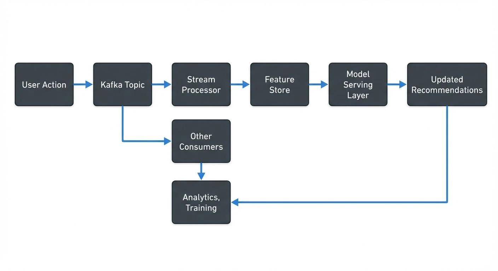

# Building Recommendation Systems with Streaming Data

Recommendation systems power some of the most engaging experiences on the internet, from Netflix's video suggestions to Amazon's product recommendations. While traditional recommendation systems operate on batch-processed data, modern applications increasingly demand real-time personalization that responds to user behavior as it happens. This shift requires fundamentally different architecture patterns built on streaming data platforms.

## Understanding Recommendation Systems

Recommendation systems analyze user behavior, preferences, and contextual signals to suggest relevant content, products, or services. Traditional approaches use collaborative filtering (finding similar users or items), content-based filtering (analyzing item attributes), or hybrid methods combining both.

The classic batch approach processes historical data periodically—perhaps daily or hourly—to update recommendations. A user's morning browsing session might not influence their afternoon recommendations. This delay creates a disconnect between user intent and system response.

Streaming recommendation systems process events as they occur. When a user clicks a product, adds items to a cart, or watches a video, the system immediately updates features and potentially refreshes recommendations. This responsiveness creates more engaging experiences and captures fleeting user interests before they fade.

## The Challenge of Real-Time Recommendations

Moving from batch to streaming recommendations introduces significant technical challenges. Batch systems benefit from complete datasets and predictable processing windows. Streaming systems must handle incomplete information, out-of-order events, and strict latency requirements.

Latency becomes critical. Users expect recommendations to update within seconds, not minutes. This requires fast feature computation, efficient model serving, and optimized data pipelines. A streaming architecture must balance freshness with computational cost—not every event justifies recomputing all recommendations.

Data consistency poses another challenge. In distributed streaming systems, events may arrive out of order or be duplicated. A user might rate a movie before the system processes their viewing event. Handling these scenarios requires careful event timestamp management and idempotent processing logic.

Model complexity creates trade-offs. Complex deep learning models that work well in batch processing may be too slow for real-time serving. Streaming systems often use simpler models that can execute in milliseconds, or employ techniques like model distillation to compress larger models into faster approximations.

## Streaming Architecture for Recommendations

A streaming recommendation architecture typically involves several key components working together. Apache Kafka serves as the central nervous system, capturing user events in real-time. Every click, view, purchase, or rating becomes an event flowing through Kafka topics. For foundational Kafka concepts, see [Apache Kafka](https://conduktor.io/glossary/apache-kafka) and [Kafka Topics, Partitions, Brokers: Core Architecture](https://conduktor.io/glossary/kafka-topics-partitions-brokers-core-architecture).

Feature engineering happens continuously using stream processing frameworks like Apache Flink or Kafka Streams. These systems maintain running aggregations—items viewed in the last hour, categories explored this session, time spent on different content types. Features stay fresh, updating with each new event.

A feature store bridges streaming and serving. Modern platforms like Tecton, Feast, Hopsworks, or cloud-native solutions (AWS SageMaker Feature Store, Vertex AI Feature Store) maintain low-latency access to both batch-computed features (user demographics, long-term preferences) and streaming features (recent activity, session context). These systems typically provide sub-10ms read latency and handle feature freshness guarantees, ensuring models query consistent, up-to-date features during inference. For detailed coverage of feature store architectures, see [Feature Stores for Machine Learning](https://conduktor.io/glossary/feature-stores-for-machine-learning).

Model serving requires specialized infrastructure. Modern frameworks include TensorFlow Serving, Ray Serve (for Python-native models), Seldon Core, KServe, and MLflow Model Serving. These platforms provide APIs for model inference with single-digit millisecond latency and support A/B testing, canary deployments, and automatic scaling. Some architectures pre-compute candidate recommendations and use streaming features only for final ranking, reducing computational load. For real-time ML inference patterns, see [Real-Time ML Inference with Streaming Data](https://conduktor.io/glossary/real-time-ml-inference-with-streaming-data).

Vector databases have become essential for modern recommendation systems using embedding-based approaches. Platforms like Pinecone, Weaviate, Milvus, Qdrant, and cloud solutions (Azure AI Search, Amazon OpenSearch with vector support) enable real-time similarity search over millions of item embeddings. These systems integrate with streaming pipelines to update embeddings as new items arrive or user preferences change, enabling semantic recommendations that go beyond traditional collaborative filtering. For comprehensive coverage, see [Vector Databases and Streaming Architectures](https://conduktor.io/glossary/vector-databases-and-streaming-architectures) and [Vector Embeddings in Streaming](https://conduktor.io/glossary/vector-embeddings-in-streaming).

## Implementation Patterns

Consider an e-commerce platform implementing streaming recommendations. When a user views a product, several processes activate simultaneously. The event flows into Kafka, triggering multiple consumers that update different aspects of the recommendation system. For comprehensive e-commerce streaming patterns, see [E-Commerce Streaming Architecture Patterns](https://conduktor.io/glossary/e-commerce-streaming-architecture-patterns).

One consumer updates session features: products viewed, categories explored, price ranges considered. Another updates the user's real-time preference vector, adjusting weights based on recent behavior. A third consumer may trigger re-ranking of recommended products already loaded in the user's browser.

The architecture might look like this:



<!-- ORIGINAL_DIAGRAM
```
User Action → Kafka Topic → Stream Processor → Feature Store
                     ↓                              ↓
              Other Consumers              Model Serving Layer
                     ↓                              ↓
           Analytics, Training ← Updated Recommendations
```
-->

Here's a concrete example using Kafka Streams to compute real-time recommendation features:

```java
// Compute user session features from click events
StreamsBuilder builder = new StreamsBuilder();
KStream<String, UserEvent> events = builder.stream("user-events");

// Calculate items viewed per category in the last hour
KTable<Windowed<String>, Long> categoryViews = events
    .filter((key, event) -> event.getEventType().equals("PRODUCT_VIEW"))
    .groupBy((key, event) -> event.getUserId() + ":" + event.getCategory(),
             Grouped.with(Serdes.String(), userEventSerde))
    .windowedBy(TimeWindows.ofSizeWithNoGrace(Duration.ofHours(1)))
    .count();

// Compute average session duration
KTable<String, Double> avgSessionDuration = events
    .groupByKey()
    .windowedBy(SessionWindows.ofInactivityGapWithNoGrace(Duration.ofMinutes(30)))
    .aggregate(
        () -> new SessionStats(),
        (key, event, stats) -> stats.update(event),
        Materialized.with(Serdes.String(), sessionStatsSerde)
    )
    .mapValues(stats -> stats.averageDuration());

// Write features to feature store topic
categoryViews.toStream().to("recommendation-features");
```

For Apache Flink users, similar feature computation might look like:

```java
// Flink DataStream API for computing recommendation features
StreamExecutionEnvironment env =
    StreamExecutionEnvironment.getExecutionEnvironment();

DataStream<UserEvent> events = env
    .addSource(new FlinkKafkaConsumer<>("user-events",
                                        new UserEventSchema(),
                                        properties));

// Compute sliding window aggregations with watermarks
DataStream<CategoryFeature> categoryFeatures = events
    .assignTimestampsAndWatermarks(
        WatermarkStrategy.<UserEvent>forBoundedOutOfOrderness(Duration.ofSeconds(10))
            .withTimestampAssigner((event, timestamp) -> event.getTimestamp())
    )
    .keyBy(event -> event.getUserId())
    .window(SlidingEventTimeWindows.of(Time.hours(1), Time.minutes(5)))
    .aggregate(new CategoryViewAggregator());

categoryFeatures.addSink(new FlinkKafkaProducer<>("recommendation-features",
                                                   new CategoryFeatureSchema(),
                                                   properties));
```

These examples demonstrate how stream processing continuously maintains fresh features. For in-depth coverage of Kafka Streams patterns, see [Introduction to Kafka Streams](https://conduktor.io/glossary/introduction-to-kafka-streams). For Flink implementation details, see [Flink DataStream API: Building Streaming Applications](https://conduktor.io/glossary/flink-datastream-api-building-streaming-applications).

Feature computation uses windowing to balance recency and stability. A tumbling window of 5 minutes aggregates very recent activity. A sliding window of 1 hour captures session-level behavior. Daily windows track longer-term trends. The model considers all three time scales.

Event-time processing ensures correct ordering. Even if events arrive late or out of sequence, the stream processor uses event timestamps to maintain accurate feature values. Watermarks determine when to finalize window computations, balancing lateness tolerance against result freshness. For a detailed explanation of watermarks and handling late-arriving data, see [Event Time and Watermarks in Flink](https://conduktor.io/glossary/event-time-and-watermarks-in-flink) and [Handling Late-Arriving Data in Streaming](https://conduktor.io/glossary/handling-late-arriving-data-in-streaming).

## Real-World Applications

Netflix provides a compelling example of streaming recommendations at scale. When you pause on a title, that dwell-time event updates your preference signals in real-time. The next row of recommendations may already reflect this micro-signal of interest. Netflix processes billions of events daily through Kafka, using sophisticated stream processing to maintain fresh features for hundreds of millions of users. For broader context on real-time ML architectures, see [Real-Time ML Pipelines](https://conduktor.io/glossary/real-time-ml-pipelines) and [Clickstream Analytics with Kafka](https://conduktor.io/glossary/clickstream-analytics-with-kafka).

Spotify uses streaming data to power its Discover Weekly and Daily Mix features. As users listen to songs, skip tracks, or add songs to playlists, these events flow through streaming pipelines. The system balances immediate feedback (you're in a workout mood right now) with long-term preferences (you generally prefer indie rock).

Uber Eats adjusts restaurant recommendations based on real-time signals like current location, time of day, and recent searches. The system must process location updates, search queries, and ordering events while maintaining low latency for mobile users. Stream processing enables this responsiveness across millions of concurrent sessions.

## Monitoring and Operating Streaming Recommendations

Operating streaming recommendation systems requires robust monitoring and debugging capabilities. Unlike batch systems where failures are obvious and contained, streaming systems can silently degrade through data quality issues, processing lag, or feature drift.

Monitoring Kafka topics becomes essential. Modern tools like Kafka Lag Exporter (integrated with Prometheus and Grafana) provide real-time visibility into consumer lag metrics. Are user events flowing at expected rates? Are there sudden spikes or drops that indicate upstream issues? Is consumer lag growing, suggesting the feature computation pipeline cannot keep up with event volume? For comprehensive monitoring patterns, see [Consumer Lag Monitoring](https://conduktor.io/glossary/consumer-lag-monitoring) and [Kafka Cluster Monitoring and Metrics](https://conduktor.io/glossary/kafka-cluster-monitoring-and-metrics).

Data quality checks must run continuously. Are event schemas valid? Are feature values within expected ranges? Do session boundaries make sense? Modern data observability platforms (Monte Carlo, Datadog Data Streams Monitoring, Conduktor) help teams monitor Kafka clusters, detect anomalies, inspect message content, and debug data quality issues before they impact recommendation quality. For systematic approaches, see [Building a Data Quality Framework](https://conduktor.io/glossary/building-a-data-quality-framework) and [Data Quality vs Data Observability: Key Differences](https://conduktor.io/glossary/data-quality-vs-data-observability-key-differences).

Access control matters particularly for recommendation systems, which process sensitive user behavior data. Kafka topics containing viewing history, purchase data, or browsing patterns require careful governance under regulations like GDPR and CCPA. Apache Kafka 4.0 with KRaft mode provides enhanced security capabilities and simplified ACL management. Teams need to audit who accesses which topics and ensure data masking policies are enforced for sensitive fields. For security best practices, see [Kafka ACLs and Authorization Patterns](https://conduktor.io/glossary/kafka-acls-and-authorization-patterns) and [Data Masking and Anonymization for Streaming](https://conduktor.io/glossary/data-masking-and-anonymization-for-streaming).

Testing streaming recommendation pipelines requires special considerations. Teams need to replay historical events to validate feature computation logic, test new model versions against production traffic, and verify that updates don't degrade recommendation quality. This requires infrastructure to capture production events, replay them in test environments, and compare results. For testing strategies, see [Testing Strategies for Streaming Applications](https://conduktor.io/glossary/testing-strategies-for-streaming-applications).

Model drift and data drift pose ongoing challenges for streaming recommendations. As user behavior patterns shift over time, models trained on historical data may degrade. Continuous monitoring of recommendation quality metrics (click-through rate, conversion rate, engagement time) helps detect when retraining becomes necessary. For strategies to detect and handle drift, see [Model Drift in Streaming](https://conduktor.io/glossary/model-drift-in-streaming) and [Data Drift in Streaming](https://conduktor.io/glossary/data-drift-in-streaming).

## Summary

Building recommendation systems with streaming data transforms how applications personalize user experiences. By processing events in real-time, systems can respond to user intent with millisecond latency, creating more engaging and relevant interactions.

The architecture requires careful orchestration of event streaming (Apache Kafka 4.0 with KRaft), stream processing (Apache Flink, Kafka Streams), feature stores (Tecton, Feast, Hopsworks), vector databases (Pinecone, Weaviate, Milvus), and model serving infrastructure (Ray Serve, KServe, TensorFlow Serving). Each component must balance freshness, accuracy, and computational cost. Modern 2025 platforms provide enterprise-grade capabilities for real-time feature computation, embedding-based similarity search, and low-latency model inference.

Real-world implementations at Netflix, Spotify, and Uber demonstrate the power of streaming recommendations. These systems process billions of events daily while maintaining low latency and high availability, leveraging the latest streaming technologies and ML infrastructure.

Success requires not just the right architecture, but also robust monitoring (Kafka Lag Exporter, Prometheus, Grafana), debugging, and governance capabilities (ACLs, data masking, compliance). As recommendation systems become more real-time and incorporate advanced techniques like vector embeddings and LLM-powered personalization, the operational complexity grows, making modern platform tooling increasingly important for maintaining data quality and system reliability.

## Sources and References

1. **Netflix Technology Blog** - "Distributed Time-Travel for Feature Generation" ([https://netflixtechblog.com/distributed-time-travel-for-feature-generation-389cccdd3907](https://netflixtechblog.com/distributed-time-travel-for-feature-generation-389cccdd3907))

2. **Apache Kafka Documentation** - "Kafka Streams Use Cases" ([https://kafka.apache.org/documentation/streams/](https://kafka.apache.org/documentation/streams/))

3. **Uber Engineering Blog** - "Building Uber's Eats Personalization Engine" ([https://www.uber.com/blog/eats-personalization/](https://www.uber.com/blog/eats-personalization/))

4. **Spotify Engineering** - "How Machine Learning Powers Spotify's Recommendations" ([https://engineering.atspotify.com/](https://engineering.atspotify.com/))

5. **Apache Flink Documentation** - "Real-time Feature Engineering" ([https://flink.apache.org/use-cases.html](https://flink.apache.org/use-cases.html))
