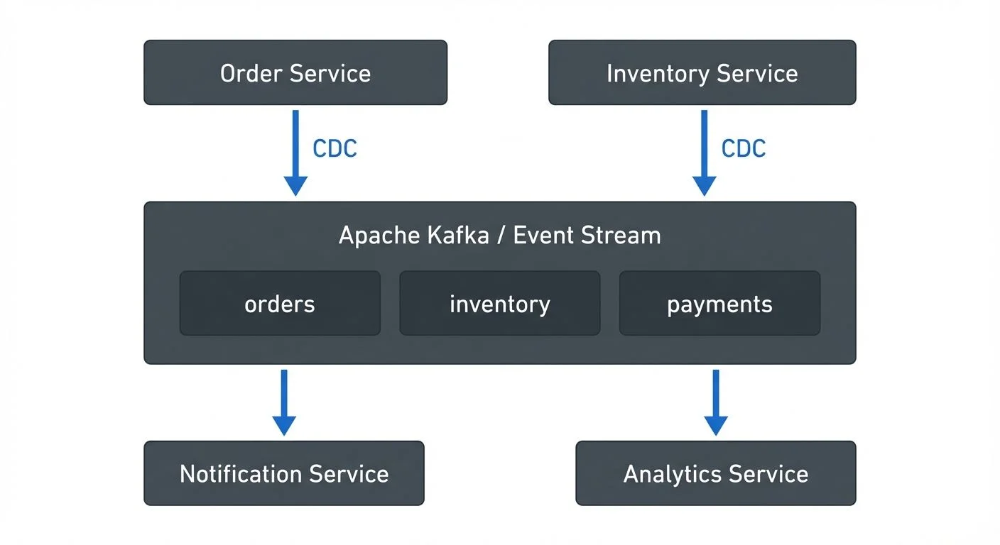

# CDC for Microservices: Event-Driven Architectures

Change Data Capture (CDC) has emerged as a critical enabler for modern event-driven microservices architectures. By capturing database changes as streams of events, CDC bridges the gap between traditional data storage and real-time event processing, enabling loosely coupled services that react to data changes with minimal latency.

In this article, we'll explore how CDC powers event-driven architectures, supports advanced patterns like event sourcing and CQRS, and integrates with streaming platforms to create scalable, resilient microservices ecosystems.

For a comprehensive guide on implementing CDC with specific tools and configurations, see [Implementing CDC with Debezium](https://conduktor.io/glossary/implementing-cdc-with-debezium). For a comparison of different CDC approaches, refer to [Log-Based vs Query-Based CDC Comparison](https://conduktor.io/glossary/log-based-vs-query-based-cdc-comparison).

## Understanding CDC in Event-Driven Systems

### The Event-Driven Architecture Challenge

Microservices architectures aim to decompose monolithic applications into independent, loosely coupled services. However, maintaining data consistency and enabling inter-service communication without tight coupling presents significant challenges:

- **Service Isolation**: Each microservice owns its data, but services need to react to changes in other services
- **Dual Writes Problem**: Writing to a database and publishing an event as separate operations creates consistency risks. For example, if you save an order to the database and then publish an OrderCreated event to Kafka, a crash between these operations leaves your system in an inconsistent state—the order exists in the database but downstream services never receive the event.
- **Real-Time Data Propagation**: Services require near-real-time visibility into data changes across the system

Traditional approaches like API polling or message queues require application-level coordination, increasing complexity and creating coupling between services.

### CDC as an Event Backbone

CDC transforms database changes into a stream of events automatically, without requiring application code changes. This provides several architectural benefits:

**Automatic Event Generation**: Every INSERT, UPDATE, and DELETE operation becomes an event, ensuring complete capture of state changes without manual event publishing.

**Guaranteed Ordering**: CDC preserves the order of changes as they occurred in the database transaction log (the internal log that databases use to ensure durability and replication), maintaining causal consistency.

**Low Latency**: Modern CDC implementations can capture and stream changes within milliseconds, enabling near-real-time event propagation.



<!-- ORIGINAL_DIAGRAM


<!-- ORIGINAL_DIAGRAM
```
┌─────────────────────────────────────────────────────────────┐
│                    Event-Driven Architecture                 │
├─────────────────────────────────────────────────────────────┤
│                                                               │
│  ┌──────────────┐         ┌──────────────┐                  │
│  │   Order      │         │   Inventory  │                  │
│  │   Service    │         │   Service    │                  │
│  └──────┬───────┘         └──────┬───────┘                  │
│         │                        │                           │
│         │ CDC                    │ CDC                       │
│         ▼                        ▼                           │
│  ┌──────────────────────────────────────────┐               │
│  │        Apache Kafka / Event Stream       │               │
│  │  ┌────────┐  ┌────────┐  ┌────────┐    │               │
│  │  │ orders │  │inventory│  │payments│    │               │
│  │  └────────┘  └────────┘  └────────┘    │               │
│  └──────────────────────────────────────────┘               │
│         │                        │                           │
│         ▼                        ▼                           │
│  ┌──────────────┐         ┌──────────────┐                  │
│  │  Notification│         │   Analytics  │                  │
│  │   Service    │         │   Service    │                  │
│  └──────────────┘         └──────────────┘                  │
│                                                               │
└─────────────────────────────────────────────────────────────┘
```
-->
-->

## Event Sourcing and CDC

### Event Sourcing Fundamentals

Event sourcing is an architectural pattern where the state of an application is determined by a sequence of events rather than storing only the current state. Each state change is captured as an immutable event, creating a complete audit trail.

CDC complements event sourcing by:

1. **Deriving Events from State Changes**: Traditional databases store current state; CDC extracts the change events from the transaction log
2. **Event Store Population**: CDC can populate event stores from existing databases without application refactoring
3. **Hybrid Approaches**: Combine application-generated domain events with CDC-derived data change events

For detailed coverage of event sourcing patterns and implementation strategies with Kafka, see [Event Sourcing Patterns with Kafka](https://conduktor.io/glossary/event-sourcing-patterns-with-kafka) and [CQRS and Event Sourcing with Kafka](https://conduktor.io/glossary/cqrs-and-event-sourcing-with-kafka).

### Practical Event Sourcing with CDC

Each database operation generates a CDC event that downstream services can consume to maintain their own views or trigger business logic. For example, as an order moves through states (PENDING → CONFIRMED → SHIPPED), CDC captures each transition as an event (OrderCreated, OrderConfirmed, OrderShipped).

**Example CDC Event Structure:**

When an order record is updated in PostgreSQL, Debezium generates a CDC event like this:

```json
{
  "before": {
    "id": 12345,
    "customer_id": 789,
    "status": "PENDING",
    "total": 99.99,
    "updated_at": "2025-01-15T10:30:00Z"
  },
  "after": {
    "id": 12345,
    "customer_id": 789,
    "status": "CONFIRMED",
    "total": 99.99,
    "updated_at": "2025-01-15T10:35:00Z"
  },
  "source": {
    "version": "2.5.0.Final",
    "connector": "postgresql",
    "name": "order-db",
    "ts_ms": 1705318500000,
    "db": "order_service",
    "schema": "public",
    "table": "orders"
  },
  "op": "u",
  "ts_ms": 1705318500123
}
```

This event captures both the `before` and `after` state, allowing consumers to understand exactly what changed, when, and in which database.

## CQRS: Command Query Responsibility Segregation

### CDC-Powered Read Models

CQRS separates write operations (commands) from read operations (queries) by maintaining separate models for each. CDC is instrumental in keeping read models synchronized with the write model:

**Write Model (Command Side)**:
- Handles business logic and state transitions
- Single source of truth
- Optimized for transactional consistency

**Read Models (Query Side)**:
- CDC streams changes from write model
- Denormalized, optimized for specific query patterns
- Multiple read models for different use cases

### Building Read Models with CDC

CDC events can be consumed to build specialized read models. For example, consuming product database changes to update an Elasticsearch search index in real-time. This approach enables:
- **Specialized Views**: Create read models optimized for specific query patterns (search, reporting, caching)
- **Polyglot Persistence**: Materialize data into different storage engines (Elasticsearch, Redis, MongoDB)
- **Independent Scaling**: Scale read and write paths independently

## Streaming Ecosystem Integration

### Apache Kafka and CDC

Apache Kafka has become the de facto standard for event streaming in microservices architectures. CDC integrates seamlessly with Kafka through connectors like Debezium.

**Modern Kafka Features for CDC (2025)**:

- **KRaft Mode (Kafka 4.0+)**: Kafka now runs without ZooKeeper, using its built-in Raft consensus protocol for metadata management. This simplifies CDC deployments by eliminating ZooKeeper dependencies and improving startup times and failover.

- **Exactly-Once Semantics (EOS)**: Kafka's idempotent producers and transactional capabilities ensure CDC events are delivered exactly once, preventing duplicate event processing even during failures.

- **Tiered Storage**: Store older CDC events in cloud object storage (S3, Azure Blob) while keeping recent data on local disks, enabling cost-effective long-term event retention for audit and replay scenarios.

**CDC Tools Ecosystem (2025)**:

- **Debezium 2.x+**: The leading open-source CDC platform with improved performance, support for all major databases (PostgreSQL, MySQL, MongoDB, SQL Server, Oracle), and enhanced Kafka Connect integration.

- **Apache Flink CDC**: Native CDC connectors for Flink providing low-latency streaming with exactly-once guarantees, ideal for real-time data pipelines and stream processing.

- **Kafka Streams & ksqlDB**: Process CDC events in real-time using stream processing, enabling event enrichment, filtering, and aggregation directly within the Kafka ecosystem. See [Introduction to Kafka Streams](https://conduktor.io/glossary/introduction-to-kafka-streams) and [ksqlDB for Real-Time Data Processing](https://conduktor.io/glossary/ksqldb-for-real-time-data-processing) for details.

For foundational knowledge about Apache Kafka, refer to [Apache Kafka](https://conduktor.io/glossary/apache-kafka). To understand Kafka Connect's role in CDC pipelines, see [Kafka Connect: Building Data Integration Pipelines](https://conduktor.io/glossary/kafka-connect-building-data-integration-pipelines).

### The Outbox Pattern

The outbox pattern solves the dual writes problem by ensuring atomic writes to the database and event publication. It's a critical pattern for maintaining consistency in event-driven architectures:

**How the Outbox Pattern Works**:

1. Application writes business data and events to an outbox table in a single transaction
2. CDC monitors the outbox table for changes
3. CDC streams outbox events to Kafka
4. Events are consumed by downstream services
5. Optionally, processed events are cleaned up from the outbox

The outbox pattern provides:
- **Atomicity**: Database writes and event publication succeed or fail together
- **Reliability**: No lost events due to message broker failures
- **Ordering Guarantees**: Events are published in the order they were written

**Outbox Pattern Implementation Example:**

```sql
-- Create outbox table
CREATE TABLE outbox (
  id UUID PRIMARY KEY DEFAULT gen_random_uuid(),
  aggregate_type VARCHAR(255) NOT NULL,
  aggregate_id VARCHAR(255) NOT NULL,
  event_type VARCHAR(255) NOT NULL,
  payload JSONB NOT NULL,
  created_at TIMESTAMP DEFAULT CURRENT_TIMESTAMP
);

-- Application code writes both business data and outbox event atomically
BEGIN;
  INSERT INTO orders (id, customer_id, status, total)
  VALUES ('12345', '789', 'CONFIRMED', 99.99);

  INSERT INTO outbox (aggregate_type, aggregate_id, event_type, payload)
  VALUES (
    'Order',
    '12345',
    'OrderConfirmed',
    '{"orderId": "12345", "customerId": "789", "total": 99.99}'::jsonb
  );
COMMIT;
```

```yaml
# Debezium connector configuration for outbox pattern
name: outbox-connector
config:
  connector.class: io.debezium.connector.postgresql.PostgresConnector
  database.hostname: postgres
  database.port: 5432
  database.user: cdc_user
  database.dbname: order_service
  table.include.list: public.outbox
  transforms: outbox
  transforms.outbox.type: io.debezium.transforms.outbox.EventRouter
  transforms.outbox.table.field.event.type: event_type
  transforms.outbox.table.field.event.key: aggregate_id
  transforms.outbox.table.field.event.payload: payload
  transforms.outbox.route.topic.replacement: ${routedByValue}.events
```

The Debezium outbox transformation extracts events from the outbox table and routes them to appropriate Kafka topics, transforming database rows into clean business events.

For a comprehensive guide to the outbox pattern and its implementation, see [Outbox Pattern for Reliable Event Publishing](https://conduktor.io/glossary/outbox-pattern-for-reliable-event-publishing). To understand exactly-once guarantees in this context, refer to [Exactly-Once Semantics in Kafka](https://conduktor.io/glossary/exactly-once-semantics-in-kafka).

### Governance and Visibility

As CDC-based event-driven architectures scale, managing the proliferation of event streams, schemas, and consumers becomes challenging. Governance platforms provide critical visibility and control:

**Schema Management**:
- CDC generates events with evolving schemas as database schemas change
- Schema registries track schema versions and enforce compatibility rules
- Prevents breaking changes from propagating through the event pipeline
- See [Avro vs Protobuf vs JSON Schema](https://conduktor.io/glossary/avro-vs-protobuf-vs-json-schema) for schema format comparisons and [Schema Registry for Kafka](https://conduktor.io/glossary/schema-registry-for-kafka) for registry implementation

**Data Lineage and Discovery**:
- Visualize data flows from source databases through CDC to consuming services
- Understand dependencies between services through event consumption patterns
- Impact analysis: identify which services are affected by schema or data changes
- For comprehensive data lineage tracking, see [Data Lineage: Tracking Data from Source to Consumption](https://conduktor.io/glossary/data-lineage-tracking-data-from-source-to-consumption)

**Quality and Monitoring**:
- Monitor CDC lag and throughput metrics
- Set alerts for anomalous event patterns or consumption delays
- Validate data quality rules on CDC event streams

**Example Governance Use Case**:

When a database schema change is proposed (e.g., renaming a column in the products table):

1. Lineage views show all services consuming product CDC events
2. Schema compatibility checks identify which consumers would break
3. Teams coordinate migration: new column added alongside old one
4. CDC captures both columns during transition period
5. Consumers migrate to new schema at their own pace
6. Old column deprecated and removed after all consumers migrated

This governance layer prevents the chaos that often accompanies event-driven architectures at scale.

## Service Integration Patterns

### Inter-Service Communication

CDC enables several patterns for service integration:

**1. Database-to-Database Synchronization**:
Services maintain local caches or denormalized views of data owned by other services.

```
Order Service DB → CDC → Kafka → Shipping Service
                                  (maintains local order cache)
```

**2. Event-Driven Workflows**:
Services coordinate complex workflows through event choreography. For example, the Inventory Service listens for OrderCreated events, reserves inventory, and writes to its local database. CDC then publishes InventoryReserved or InventoryInsufficient events for downstream services.

**3. Polyglot Persistence**:
Different services use optimal storage technologies (e.g., PostgreSQL for transactional data, Elasticsearch for search, Redis for caching) while staying synchronized through CDC events.

### Error Handling and Resilience

CDC-based integration requires robust error handling:

**Dead Letter Queues**: Failed events are routed to DLQs for analysis and replay. See [Dead Letter Queues for Error Handling](https://conduktor.io/glossary/dead-letter-queues-for-error-handling) for implementation patterns.
**Idempotency**: Consumers must handle duplicate events gracefully by tracking processed event IDs
**Circuit Breakers**: Prevent cascading failures when downstream services are unavailable
**Compensation Events**: Publish compensating events when operations need to be reversed

## Best Practices and Considerations

### Schema Evolution

Database schema changes directly impact CDC events. Follow these practices:

- **Backward Compatibility**: Add columns instead of renaming; deprecate gradually
- **Schema Registry**: Use Confluent Schema Registry or similar to version and validate schemas
- **Consumer Resilience**: Design consumers to handle missing or additional fields gracefully

### Performance Optimization

CDC can generate high event volumes. Optimize with:

- **Filtering**: Configure CDC to capture only relevant tables and columns
- **Batching**: Consume events in batches for higher throughput
- **Partitioning**: Use appropriate Kafka partition keys to distribute load

### Monitoring and Observability

Implement comprehensive monitoring using modern observability tools:

**Key CDC Metrics (2025)**:
- **CDC Lag**: Time between database change and event availability in Kafka
- **Replication Slot Growth**: Monitor PostgreSQL replication slots (Write-Ahead Log segments retained for CDC) to prevent disk exhaustion
- **Consumer Lag**: Track how far behind consumers are from the latest events using tools like Kafka Lag Exporter or Burrow. Understanding consumer groups is essential—see [Kafka Consumer Groups Explained](https://conduktor.io/glossary/kafka-consumer-groups-explained)
- **Schema Compatibility**: Alert on schema incompatibilities detected by Schema Registry
- **Throughput & Errors**: Monitor CDC connector throughput, error rates, and restart counts

**Modern Observability Stack**:
- **OpenTelemetry**: Standardized telemetry collection for distributed tracing across CDC pipelines, Kafka brokers, and consuming services. See [Distributed Tracing for Kafka Applications](https://conduktor.io/glossary/distributed-tracing-for-kafka-applications) for implementation guidance.
- **Prometheus & Grafana**: Metrics collection and visualization for CDC lag, Kafka throughput, and consumer health. For comprehensive Kafka metrics, see [Kafka Cluster Monitoring and Metrics](https://conduktor.io/glossary/kafka-cluster-monitoring-and-metrics).
- **Kafka Lag Exporter**: Dedicated tool for monitoring consumer group lag with Prometheus integration
- **Conduktor Platform**: Unified governance and monitoring for Kafka-based CDC architectures

Governance platforms provide centralized monitoring across the entire CDC pipeline, aggregating metrics from connectors, brokers, and consumers.

### Security and Compliance

CDC streams contain sensitive data:

- **Encryption**: Encrypt data in transit (TLS) and at rest. See [Encryption at Rest and in Transit for Kafka](https://conduktor.io/glossary/encryption-at-rest-and-in-transit-for-kafka) for implementation details.
- **Access Control**: Implement fine-grained ACLs on Kafka topics. Refer to [Kafka ACLs and Authorization Patterns](https://conduktor.io/glossary/kafka-acls-and-authorization-patterns) for access control strategies.
- **Data Masking**: Use Kafka Connect transformations to mask PII before events reach consumers. For PII handling strategies, see [Data Masking and Anonymization for Streaming](https://conduktor.io/glossary/data-masking-and-anonymization-for-streaming) and [PII Detection and Handling in Event Streams](https://conduktor.io/glossary/pii-detection-and-handling-in-event-streams).
- **Audit Logging**: Track who accesses CDC event streams. For comprehensive audit logging, see [Audit Logging for Streaming Platforms](https://conduktor.io/glossary/audit-logging-for-streaming-platforms).

## Summary

Change Data Capture has become a foundational technology for modern event-driven microservices architectures. By automatically transforming database changes into event streams, CDC enables:

- **True Event-Driven Architecture**: Services react to data changes in real-time without tight coupling
- **Event Sourcing**: Complete audit trails and state reconstruction from change events
- **CQRS Implementation**: Synchronized read models optimized for different query patterns
- **Reliable Integration**: The outbox pattern ensures atomic event publication and data consistency
- **Streaming Ecosystem**: Seamless integration with Apache Kafka for scalable event distribution

The combination of CDC with streaming platforms like Kafka, governance tools, and architectural patterns like outbox and CQRS creates resilient, scalable microservices ecosystems. As organizations continue to decompose monoliths and embrace event-driven architectures, CDC will remain a critical enabler of loosely coupled, reactive systems.

Successful CDC implementation requires attention to schema evolution, performance optimization, monitoring, and security. By following best practices and leveraging the right tooling, teams can harness the full power of CDC to build next-generation microservices architectures that are both flexible and maintainable.

## Sources and References

**Core Technologies:**
- [Debezium Documentation](https://debezium.io/documentation/) - Open-source CDC platform for databases
- [Apache Kafka Documentation](https://kafka.apache.org/documentation/) - Distributed event streaming platform
- [Confluent Schema Registry](https://docs.confluent.io/platform/current/schema-registry/) - Schema versioning and compatibility

**Architectural Patterns:**
- Martin Fowler - [Event Sourcing](https://martinfowler.com/eaaDev/EventSourcing.html)
- Martin Fowler - [CQRS](https://martinfowler.com/bliki/CQRS.html)
- Chris Richardson - [Microservices Patterns: Transactional Outbox](https://microservices.io/patterns/data/transactional-outbox.html)

**Tools and Platforms:**
- [Conduktor](https://www.conduktor.io/) - Apache Kafka governance, monitoring, and development platform
- [Kafka Connect](https://docs.confluent.io/platform/current/connect/) - Integration framework for Kafka

**Best Practices:**
- [Debezium Tutorial](https://debezium.io/documentation/reference/tutorial.html) - Getting started with CDC
- [Designing Event-Driven Systems](https://www.confluent.io/designing-event-driven-systems/) - Comprehensive guide by Ben Stopford
- [Building Microservices](https://www.oreilly.com/library/view/building-microservices-2nd/9781492034018/) - Sam Newman (2nd Edition)
