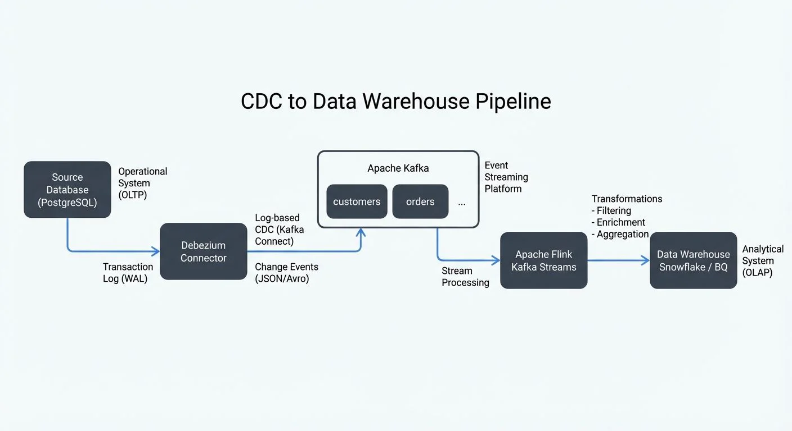

# CDC for Real-Time Data Warehousing

Real-time data warehousing has become a critical requirement for modern data-driven organizations. Traditional batch ETL processes that run nightly or hourly can no longer meet the demand for immediate insights. Change Data Capture (CDC) provides the foundation for building real-time data warehouses by continuously capturing and streaming database changes as they occur, enabling near-instantaneous analytics and reporting.

## Understanding CDC in the Data Warehouse Context

Change Data Capture is a design pattern that identifies and captures changes made to data in a database, then delivers those changes to downstream systems in real-time or near-real-time. Unlike traditional full-table extracts that read entire datasets repeatedly, CDC tracks only the incremental changes—inserts, updates, and deletes—making it highly efficient for data warehousing scenarios.

In a data warehouse context, CDC serves as the bridge between operational databases (OLTP - Online Transaction Processing systems optimized for transactional workloads) and analytical databases (OLAP - Online Analytical Processing systems optimized for complex queries and aggregations). By capturing changes at the source and streaming them to the warehouse, organizations can maintain synchronized, up-to-date analytical datasets without impacting source system performance or requiring large batch processing windows.

CDC operates through several mechanisms:

- **Log-based CDC**: Reads transaction logs from the source database (e.g., MySQL binlog, PostgreSQL WAL - Write-Ahead Log)
- **Trigger-based CDC**: Uses database triggers to capture changes into shadow tables
- **Query-based CDC**: Polls tables for changes using timestamp or version columns

Log-based CDC is generally preferred for data warehousing because it has minimal performance impact on source systems and captures all changes reliably without requiring schema modifications. For comprehensive coverage of CDC fundamentals and mechanisms, see [What is Change Data Capture (CDC): Fundamentals](what-is-change-data-capture-cdc-fundamentals.md).

## Incremental Loading Patterns

Incremental loading is the cornerstone of efficient real-time data warehousing. Rather than reprocessing entire datasets, incremental patterns apply only the changes captured by CDC to the target warehouse.

### Append-Only Pattern

In this pattern, all CDC events are appended to the warehouse as immutable records. Each change creates a new row with metadata indicating the operation type and timestamp. This approach preserves complete history and simplifies stream processing, but requires additional logic for querying current state.

```sql
CREATE TABLE customer_changes (
    change_id BIGINT PRIMARY KEY,
    customer_id INT,
    name VARCHAR(255),
    email VARCHAR(255),
    operation_type VARCHAR(10), -- INSERT, UPDATE, DELETE
    change_timestamp TIMESTAMP,
    source_transaction_id VARCHAR(100)
);
```

### Upsert Pattern

The upsert (update-or-insert) pattern applies CDC changes directly to warehouse tables, maintaining current state. Updates and inserts modify existing rows or create new ones, while deletes remove records. This pattern provides simpler querying but requires merge capabilities in the warehouse.

```sql
MERGE INTO customer_warehouse AS target
USING customer_cdc_stream AS source
ON target.customer_id = source.customer_id
WHEN MATCHED AND source.operation = 'UPDATE' THEN
    UPDATE SET name = source.name, email = source.email
WHEN MATCHED AND source.operation = 'DELETE' THEN
    DELETE
WHEN NOT MATCHED AND source.operation = 'INSERT' THEN
    INSERT (customer_id, name, email) VALUES (source.customer_id, source.name, source.email);
```

### Slowly Changing Dimensions (SCD)

For maintaining historical context, SCD patterns track how dimension attributes change over time. Type 2 SCD creates a new row for each change with validity timestamps, enabling historical analysis while preserving current state.

## Streaming Ecosystem Integration

Modern CDC pipelines leverage streaming platforms to decouple data capture from consumption, providing scalability, fault tolerance, and flexibility.

### Architecture Components

A typical CDC streaming architecture includes:

**Debezium** captures changes from source databases by reading transaction logs and converting them to change events. It supports multiple databases (MySQL, PostgreSQL, MongoDB, Oracle, SQL Server) and produces standardized event formats.

**Apache Kafka** serves as the distributed event streaming platform, receiving CDC events from Debezium and buffering them for consumption. Kafka topics organize events by source table, and partitioning ensures ordering guarantees per key. For Kafka topic design considerations, see [Kafka Topic Design Guidelines](kafka-topic-design-guidelines.md).

**Apache Flink** or other stream processors consume CDC events from Kafka, transform them as needed, and write to the data warehouse. Flink provides exactly-once processing semantics (guaranteeing each change event is processed once and only once, even during failures), stateful operations, and windowing capabilities essential for complex transformations. For details on guaranteeing data consistency, see [Exactly-Once Semantics in Kafka](exactly-once-semantics-in-kafka.md).

### Reference Architecture



<!-- ORIGINAL_DIAGRAM
```
┌─────────────────────────────────────────────────────────────┐
│                  CDC to Data Warehouse Pipeline              │
└─────────────────────────────────────────────────────────────┘

  ┌─────────────────┐
  │ Source Database │  Operational System
  │   (PostgreSQL)  │  (OLTP)
  └────────┬────────┘
           │ Transaction Log (WAL)
           ▼
  ┌─────────────────┐
  │    Debezium     │  Log-based CDC
  │   Connector     │  (Kafka Connect)
  └────────┬────────┘
           │ Change Events (JSON/Avro)
           ▼
  ┌─────────────────────────────────────┐
  │         Apache Kafka                │
  │  ┌──────────┐  ┌──────────┐        │  Event Streaming
  │  │customers │  │ orders   │  ...   │  Platform
  │  └──────────┘  └──────────┘        │
  └────────┬────────────────────────────┘
           │ Stream Processing
           ▼
  ┌─────────────────┐
  │  Apache Flink   │  Transformations
  │  Kafka Streams  │  - Filtering
  └────────┬────────┘  - Enrichment
           │           - Aggregation
           ▼
  ┌─────────────────┐
  │  Data Warehouse │  Analytical System
  │ Snowflake / BQ  │  (OLAP)
  └─────────────────┘
```
-->

### Debezium Configuration Example

```json
{
  "name": "postgres-cdc-connector",
  "config": {
    "connector.class": "io.debezium.connector.postgresql.PostgresConnector",
    "database.hostname": "postgres-db.example.com",
    "database.port": "5432",
    "database.user": "debezium_user",
    "database.password": "${secret:debezium-secrets:postgres-password}",
    "database.dbname": "production_db",
    "database.server.name": "prod",
    "table.include.list": "public.customers,public.orders",
    "plugin.name": "pgoutput",
    "slot.name": "debezium_slot",
    "publication.name": "debezium_publication",
    "topic.prefix": "prod",
    "key.converter": "org.apache.kafka.connect.json.JsonConverter",
    "value.converter": "org.apache.kafka.connect.json.JsonConverter",
    "transforms": "unwrap",
    "transforms.unwrap.type": "io.debezium.transforms.ExtractNewRecordState",
    "transforms.unwrap.drop.tombstones": "false"
  }
}
```

This configuration captures changes from specific PostgreSQL tables using the native `pgoutput` logical decoding plugin (available in PostgreSQL 10+, recommended for Debezium 2.x+) and publishes them to Kafka topics with the prefix `prod` (e.g., `prod.public.customers`). The `ExtractNewRecordState` transformation simplifies the event structure by extracting the after-state of changes, making downstream processing easier.

For detailed Debezium implementation guidance, see [Implementing CDC with Debezium](implementing-cdc-with-debezium.md).

### Modern CDC Platforms and 2025 Tooling

While Debezium remains the leading open-source CDC solution (version 3.0+ as of 2024/2025), the CDC landscape has evolved with several modern alternatives:

**Cloud-Native CDC Services**:
- **AWS Database Migration Service (DMS)**: Fully managed CDC for AWS RDS and Aurora databases, with native integration to Redshift, S3, and Kinesis
- **Google Cloud Datastream**: Serverless CDC service for MySQL, PostgreSQL, and Oracle, streaming to BigQuery, Cloud Storage, or Pub/Sub
- **Azure Data Factory with Change Feed**: Native CDC for Azure Cosmos DB and SQL Database

**Unified Data Integration Platforms**:
- **Airbyte** (2025): Open-source data integration platform with 300+ connectors, including CDC connectors for major databases with configuration UI and monitoring
- **Fivetran**: Managed CDC platform with automatic schema drift handling and built-in transformations
- **Striim**: Real-time data integration with CDC, in-flight processing, and multi-cloud support

**Kafka 4.0+ Enhancements** (2024/2025):
- Native **KRaft mode** (ZooKeeper removed): Simplified Kafka deployment and improved metadata performance for CDC pipelines
- **Kafka Connect improvements**: Enhanced connector management, better error handling, and improved exactly-once support
- **Tiered storage**: Cost-effective long-term retention of CDC events in object storage (S3, GCS, Azure Blob)

These modern platforms reduce operational overhead and provide managed CDC infrastructure, though open-source solutions like Debezium offer greater flexibility and cost control for sophisticated use cases. For Kafka fundamentals and architecture, see [Apache Kafka](apache-kafka.md).

### Governance and Visibility

In production CDC pipelines, governance and operational visibility become critical. Streaming governance platforms provide centralized monitoring and management for Kafka-based CDC infrastructures:

- **Schema validation**: Ensures CDC events conform to expected schemas before reaching the warehouse
- **Data quality monitoring**: Tracks event volumes, delays, and anomalies in CDC streams
- **Access control**: Manages which teams can consume specific CDC topics
- **Pipeline observability**: Visualizes data flows from source databases through Kafka to warehouses

This governance layer prevents data quality issues from propagating to analytical systems and provides the operational transparency needed to maintain SLAs for real-time reporting.

## Data Lake Ingestion with CDC

CDC pipelines often feed both data warehouses and data lakes, creating a unified approach to real-time analytics across structured and semi-structured data.

### Initial Snapshots and Bootstrap Strategy

Before streaming incremental changes, CDC pipelines must capture the current state of source tables through initial snapshots. This bootstrap process ensures the target warehouse starts with complete data before applying ongoing changes:

1. **Snapshot Capture**: Debezium or similar tools read the entire table(s) using consistent snapshots (leveraging database-specific mechanisms like PostgreSQL's `REPEATABLE READ` transactions)
2. **Streaming Transition**: After snapshot completion, the CDC process switches to reading transaction logs from the point captured during the snapshot
3. **Backfill Strategies**: For large tables, consider splitting snapshots into chunks or using parallel snapshot threads to reduce initial load time

Modern CDC tools handle this transition automatically, preventing data loss during the snapshot-to-streaming switch. For large-scale migrations, see [CDC for Microservices Event-Driven Architectures](cdc-for-microservices-event-driven-architectures.md).

### Lake House Architecture

The lake house pattern combines data lake flexibility with warehouse performance. CDC events land initially in the data lake (S3, Azure Data Lake) in raw format, then incremental transformations promote data through bronze, silver, and gold layers.

**Bronze Layer**: Raw CDC events stored as Parquet or Avro files, partitioned by timestamp
**Silver Layer**: Cleaned and deduplicated events with basic transformations applied
**Gold Layer**: Business-aggregated datasets optimized for analytics

Technologies like **Delta Lake**, **Apache Iceberg**, and **Apache Hudi** provide ACID transactions and time-travel capabilities on lake storage, enabling upserts and deletes that traditional data lakes cannot handle efficiently.

**Modern Table Format Features (2025)**:
- **Apache Iceberg 1.4+**: Native upsert support with merge-on-read optimization, partition evolution without rewriting data, and multi-table transactions
- **Apache Hudi 0.14+**: Record-level indexes for faster upserts, clustering for improved query performance, and metadata table for change tracking
- **Apache XTable (formerly OneTable)**: Universal table format translator enabling cross-format interoperability (read Iceberg as Delta, etc.)
- **Delta Lake 3.0+**: Deletion vectors for efficient row-level deletes, liquid clustering (automatic data organization), and improved merge performance

For details on lakehouse patterns, see [Introduction to Lakehouse Architecture](introduction-to-lakehouse-architecture.md) and [Apache Iceberg](apache-iceberg.md).

### Incremental Processing Strategy

```python
# Example: Flink streaming job for CDC to Delta Lake
from pyflink.datastream import StreamExecutionEnvironment
from pyflink.table import StreamTableEnvironment, EnvironmentSettings

# Configure Flink for exactly-once processing
env = StreamExecutionEnvironment.get_execution_environment()
env.enable_checkpointing(60000)  # Checkpoint every 60 seconds
env.get_checkpoint_config().set_checkpointing_mode(CheckpointingMode.EXACTLY_ONCE)

# Create Table Environment
settings = EnvironmentSettings.in_streaming_mode()
t_env = StreamTableEnvironment.create(env, settings)

# Define Kafka source with CDC events
t_env.execute_sql("""
    CREATE TABLE customer_cdc (
        customer_id INT,
        name STRING,
        email STRING,
        operation STRING,
        ts TIMESTAMP(3),
        WATERMARK FOR ts AS ts - INTERVAL '5' SECOND
    ) WITH (
        'connector' = 'kafka',
        'topic' = 'prod.public.customers',
        'properties.bootstrap.servers' = 'kafka:9092',
        'properties.group.id' = 'flink-cdc-consumer',
        'format' = 'json',
        'scan.startup.mode' = 'earliest-offset'
    )
""")

# Define Delta Lake sink
t_env.execute_sql("""
    CREATE TABLE customer_delta (
        customer_id INT,
        name STRING,
        email STRING,
        PRIMARY KEY (customer_id) NOT ENFORCED
    ) WITH (
        'connector' = 'delta',
        'path' = 's3://data-lake/silver/customers',
        'write.mode' = 'upsert'
    )
""")

# Process CDC stream and upsert to Delta Lake
t_env.execute_sql("""
    INSERT INTO customer_delta
    SELECT customer_id, name, email
    FROM customer_cdc
    WHERE operation IN ('INSERT', 'UPDATE')
""")
```

This Flink job demonstrates exactly-once processing semantics with checkpointing, ensuring no data loss or duplication when streaming CDC events from Kafka to Delta Lake. The watermark configuration handles late-arriving events, and the upsert mode ensures the Delta table reflects the current state of each customer.

## Operational Considerations

Implementing CDC for real-time data warehousing requires careful attention to operational aspects that impact reliability and performance.

### Schema Evolution

CDC pipelines must handle schema changes in source databases without breaking downstream consumers. Use schema registries (Confluent Schema Registry, Apicurio) to version and validate schemas. Configure warehouses to support schema evolution through automatic column additions or versioned tables.

For detailed guidance on managing schema changes, see [Schema Evolution Best Practices](schema-evolution-best-practices.md) and [Schema Registry and Schema Management](schema-registry-and-schema-management.md).

### Backpressure and Lag Management

Monitor consumer lag between CDC event production and warehouse ingestion. High lag indicates **backpressure**—a condition where the warehouse or stream processor cannot keep up with the incoming change volume, causing events to accumulate in Kafka. Address this through:

- **Horizontal scaling of stream processors**: Add more Flink task managers or Kafka Streams instances
- **Warehouse optimization**: Improve clustering, partitioning, and indexing strategies
- **Micro-batching**: Reduce write overhead by batching multiple CDC events into single warehouse transactions
- **Filtering irrelevant changes**: Drop unnecessary columns or tables at the CDC source to reduce data volume
- **Monitoring tools**: Use Kafka Lag Exporter, Burrow, or Confluent Control Center to track consumer lag metrics

For comprehensive coverage of backpressure patterns, see [Backpressure Handling in Streaming Systems](backpressure-handling-in-streaming-systems.md). For monitoring consumer lag, see [Consumer Lag Monitoring](consumer-lag-monitoring.md).

### Disaster Recovery

CDC pipelines must support failure recovery without data loss. Kafka's retention policies should accommodate reasonable downtime, and checkpoint mechanisms in stream processors ensure exactly-once processing. Maintain runbooks for rebuilding state after catastrophic failures, including procedures for historical backfills from database snapshots.

For disaster recovery strategies and high availability patterns, see [Disaster Recovery Strategies for Kafka Clusters](disaster-recovery-strategies-for-kafka-clusters.md) and [Kafka Replication and High Availability](kafka-replication-and-high-availability.md).

### Performance Metrics and SLAs

Establish clear performance targets for CDC pipelines to ensure real-time data warehousing meets business requirements:

**Latency Metrics**:
- **End-to-end latency**: Time from database commit to warehouse availability (typical target: < 60 seconds for real-time use cases)
- **Replication lag**: Time between source database change and CDC event capture (target: < 5 seconds)
- **Processing lag**: Time for stream processor to consume and transform events (target: < 10 seconds)

**Throughput Metrics**:
- **Events per second**: CDC event production rate per table/topic
- **Warehouse write rate**: Insert/update operations per second in target warehouse
- **Data volume**: GB/hour of change data captured and processed

**Reliability Metrics**:
- **Data loss**: Zero tolerance for production CDC pipelines (requires exactly-once semantics)
- **Duplicate rate**: Percentage of duplicate events reaching the warehouse (target: 0% with idempotent writes)
- **Pipeline availability**: Uptime percentage (typical target: 99.9%+)

Monitor these metrics using tools like Prometheus, Grafana, Datadog, or cloud-native monitoring services. Set up alerts for SLA violations and establish escalation procedures. For streaming SLA management, see [SLA for Streaming](sla-for-streaming.md).

### Data Quality and Validation

CDC pipelines must maintain data quality as changes flow from operational systems to analytical warehouses:

**Validation Strategies**:
- **Schema validation**: Ensure CDC events match expected schema versions before processing
- **Row count reconciliation**: Periodically compare source table counts with warehouse row counts
- **Checksum validation**: Verify data integrity by comparing aggregated checksums between source and target
- **Business rule validation**: Apply domain-specific validation rules (e.g., non-negative account balances, valid date ranges)

**Quality Monitoring Tools (2025)**:
- **Great Expectations**: Define data quality expectations on CDC streams and warehouse tables
- **Soda Core**: Open-source data quality framework with SQL-based checks
- **Monte Carlo**: Data observability platform with automated anomaly detection for CDC pipelines
- **Elementary**: dbt-native data quality monitoring

Implement data quality checks at multiple stages: at CDC capture (Debezium level), during stream processing (Flink/Kafka Streams), and post-warehouse ingestion (batch validation jobs). For comprehensive data quality strategies, see [Building a Data Quality Framework](building-a-data-quality-framework.md) and [Data Quality Dimensions: Accuracy, Completeness, and Consistency](data-quality-dimensions-accuracy-completeness-and-consistency.md).

## Summary

Change Data Capture transforms traditional batch-oriented data warehousing into responsive, real-time analytics infrastructure. By capturing incremental changes through log-based mechanisms and streaming them via platforms like Kafka, organizations achieve near-instantaneous data availability without overwhelming source systems or warehouse resources.

Successful CDC implementation combines appropriate loading patterns (append-only, upsert, SCD) with robust streaming architectures built on Debezium, Kafka, and stream processors like Flink. Integration with data lakes through lake house architectures extends CDC benefits to both structured analytics and flexible exploration workloads.

Operational maturity requires governance tools for visibility and control, careful schema evolution strategies, and proactive monitoring of pipeline health. When implemented thoughtfully, CDC-based real-time data warehousing delivers the immediacy modern businesses demand while maintaining the reliability and accuracy that analytical systems require.

## Sources and References

- **Apache Kafka Documentation**: [https://kafka.apache.org/documentation/](https://kafka.apache.org/documentation/)
- **Debezium Documentation**: [https://debezium.io/documentation/](https://debezium.io/documentation/)
- **Apache Flink CDC Connectors**: [https://nightlies.apache.org/flink/flink-cdc-docs-stable/](https://nightlies.apache.org/flink/flink-cdc-docs-stable/)
- **Delta Lake Documentation**: [https://docs.delta.io/](https://docs.delta.io/)
- **Slowly Changing Dimensions**: Kimball, R. & Ross, M. (2013). *The Data Warehouse Toolkit*. Wiley.
- **Change Data Capture Patterns**: Kleppmann, M. (2017). *Designing Data-Intensive Applications*. O'Reilly Media.
