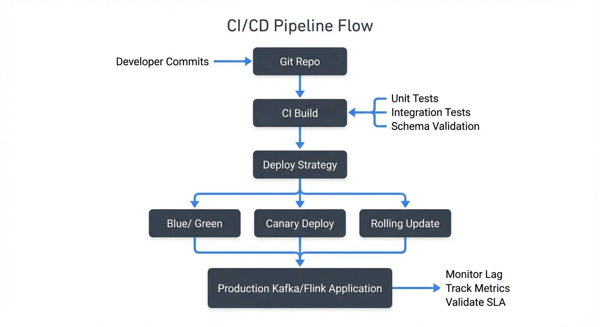

Continuous Integration and Continuous Deployment (CI/CD) practices have become standard in modern software development, but streaming applications present unique challenges that traditional CI/CD approaches don't fully address. Unlike stateless request-response services, streaming applications process data continuously, maintain state, and must evolve schemas without breaking downstream consumers.

This article explores best practices for implementing robust CI/CD pipelines specifically designed for streaming applications built on platforms like Apache Kafka, Apache Flink, Kafka Streams, and similar event-driven architectures. For foundational knowledge about these platforms, see [Apache Kafka](https://conduktor.io/glossary/apache-kafka), [What is Apache Flink](https://conduktor.io/glossary/what-is-apache-flink-stateful-stream-processing), and [Introduction to Kafka Streams](https://conduktor.io/glossary/introduction-to-kafka-streams).

<!-- ORIGINAL_DIAGRAM
```
┌─────────────────────────────────────────────────────────────────┐
│                    CI/CD Pipeline Flow                          │
└─────────────────────────────────────────────────────────────────┘

    Developer    ┌─────────────┐
    Commits  ──▶ │  Git Repo   │
                 └──────┬──────┘
                        │
                        ▼
                 ┌─────────────┐
                 │  CI Build   │ ◀─── Unit Tests
                 └──────┬──────┘      Integration Tests
                        │             Schema Validation
                        ▼
                 ┌─────────────┐
                 │   Deploy    │
                 │  Strategy   │
                 └──────┬──────┘
                        │
         ┌──────────────┼──────────────┐
         ▼              ▼              ▼
    ┌────────┐    ┌────────┐    ┌────────┐
    │ Blue/  │    │Canary  │    │Rolling │
    │ Green  │    │Deploy  │    │Update  │
    └────┬───┘    └────┬───┘    └────┬───┘
         │             │             │
         └──────────┬──┴─────────────┘
                    ▼
         ┌──────────────────┐
         │  Production      │ ──▶ Monitor Lag
         │  Kafka/Flink     │     Track Metrics
         │  Application     │     Validate SLA
         └──────────────────┘
```
-->

## Understanding the Unique Challenges

Streaming applications differ from traditional services in several critical ways that impact CI/CD strategy.

First, they are **stateful**. A Kafka Streams application or Flink job might maintain gigabytes of state that must be preserved across deployments. Losing this state could mean reprocessing millions of events or losing aggregated data entirely.

Second, they operate **continuously**. Traditional web services can experience brief downtime during deployments, but streaming applications often require zero-downtime deployments to avoid data loss or processing gaps.

Third, they involve **schema evolution**. As data models change, producers and consumers must remain compatible. A breaking schema change can cascade through an entire streaming ecosystem, affecting dozens of downstream applications.

These characteristics require specialized CI/CD practices that go beyond standard deployment automation.

## Testing Strategies for Streaming Applications

Effective testing is foundational to any CI/CD pipeline, but streaming applications require a multi-layered testing approach. For comprehensive coverage of testing patterns, see [Testing Strategies for Streaming Applications](https://conduktor.io/glossary/testing-strategies-for-streaming-applications).

**Unit tests** should cover business logic in isolation. For Kafka Streams applications, frameworks like Kafka Streams Test Utils provide a TopologyTestDriver that allows testing stream processing logic without running a full Kafka cluster. Similarly, Flink provides testing harnesses for validating operator behavior.

**Integration tests** verify that components work together correctly. These tests should use embedded Kafka clusters (like the one provided by Testcontainers) to validate actual message production, consumption, and processing. With Kafka 4.0+ running in KRaft mode (ZooKeeper-free), test environments are faster to start and simpler to configure, making integration testing more efficient. For details on KRaft, see [Understanding KRaft Mode in Kafka](https://conduktor.io/glossary/understanding-kraft-mode-in-kafka). For example:

```java
@Test
public void testOrderProcessing() {
    // Start embedded Kafka with KRaft (Kafka 4.0+)
    kafka.start();

    // Produce test events
    producer.send(new ProducerRecord<>("orders", order));

    // Consume and verify output
    ConsumerRecord<String, ProcessedOrder> result = consumer.poll();
    assertEquals("COMPLETED", result.value().getStatus());
}
```

Modern testing frameworks for streaming applications include:
- **Testcontainers** (Java, Python, Go) for spinning up real Kafka clusters in Docker
- **kafka-python** with pytest fixtures for Python applications
- **kafka-streams-test-utils** for testing Kafka Streams topologies
- **Flink Testing Harness** for validating Flink operators

**Contract testing** ensures compatibility between producers and consumers. Schema registries play a crucial role here. By validating schemas against a registry during CI builds, teams can catch breaking changes before they reach production. Modern tools like Confluent Schema Registry's Maven/Gradle plugins, or AWS Glue Schema Registry's validation APIs, can automate schema validation and compatibility checks as part of the CI pipeline. Additionally, tools like Schemathesis can generate contract tests automatically from OpenAPI/AsyncAPI specifications, preventing incompatible schema changes from being deployed.

**End-to-end tests** validate entire data pipelines in staging environments. These tests should include realistic data volumes and processing patterns to catch performance issues and edge cases. For validating resilience under failure conditions, see [Chaos Engineering for Streaming Systems](https://conduktor.io/glossary/chaos-engineering-for-streaming-systems).

## Managing State and Schema Evolution

State management and schema evolution are perhaps the most critical aspects of CI/CD for streaming applications.

For **stateful applications**, deployments must preserve processing state. Apache Flink addresses this through savepoints, consistent snapshots of application state taken before deployment. For detailed information, see [Flink State Management and Checkpointing](https://conduktor.io/glossary/flink-state-management-and-checkpointing). A proper CI/CD pipeline should:

1. Trigger a savepoint before stopping the application
2. Deploy the new version
3. Restore from the savepoint when starting the new version

Kafka Streams handles this through state stores and changelog topics. For more details, see [State Stores in Kafka Streams](https://conduktor.io/glossary/state-stores-in-kafka-streams). When upgrading a Kafka Streams application, ensure that state store formats remain compatible or plan for state rebuilding.

**Schema evolution** requires careful governance. For comprehensive guidance, see [Schema Registry and Schema Management](https://conduktor.io/glossary/schema-registry-and-schema-management) and [Schema Evolution Best Practices](https://conduktor.io/glossary/schema-evolution-best-practices). Adopt these practices:

- Use a schema registry (Confluent Schema Registry, AWS Glue Schema Registry) as the source of truth
- Enforce compatibility rules (backward, forward, or full compatibility)
- Include schema validation in CI pipelines, reject builds that introduce incompatible schemas
- Version schemas alongside application code
- Test both old and new schema versions in integration tests

Modern data governance platforms like Atlan, Collibra, or open-source tools like DataHub (2025) provide schema management capabilities that integrate with CI/CD workflows. These platforms automatically validate schema changes, track schema lineage, and ensure compatibility across environments. Additionally, data quality tools like Soda Core, Great Expectations, or Monte Carlo can validate data contracts as part of CI pipelines. For detailed guidance on implementing data quality testing, see [Great Expectations Data Testing Framework](https://conduktor.io/glossary/great-expectations-data-testing-framework) and [Building a Data Quality Framework](https://conduktor.io/glossary/building-a-data-quality-framework).

## Deployment Patterns for Zero-Downtime

Achieving zero-downtime deployments for streaming applications requires thoughtful deployment strategies.

**Blue-green deployments** work well for stateless streaming applications. Deploy the new version (green) alongside the existing version (blue), validate its behavior, then switch traffic. For Kafka consumers, this means starting a new consumer group with the new application version, monitoring its lag and error rates, then stopping the old consumer group once confidence is established. For details on consumer groups, see [Kafka Consumer Groups Explained](https://conduktor.io/glossary/kafka-consumer-groups-explained).

**Canary deployments** are ideal for gradually rolling out changes. Deploy the new version to a small subset of instances or partitions first. For example, if your Kafka Streams application processes 100 partitions, initially deploy the new version to instances handling just 10 partitions. Monitor metrics closely, and if no issues arise, gradually expand to more instances.

**Rolling updates with savepoints** (for Flink) provide zero-downtime deployments for stateful applications:

1. Trigger a savepoint on the running job
2. Cancel the job gracefully
3. Deploy new version to Kubernetes/YARN
4. Submit new job, restoring from savepoint

This approach preserves exactly-once processing guarantees while updating application logic.

For Kafka-based applications running in Kubernetes, use rolling updates with proper health checks and readiness probes to ensure each instance is fully initialized before routing traffic.

**Progressive delivery** tools like Flagger or Argo Rollouts can automate canary deployments with automatic rollback based on metrics. These tools integrate with Prometheus to monitor success rates, latency, and custom streaming metrics (like consumer lag), automatically rolling back deployments if metrics degrade.

## Infrastructure as Code and Environment Parity

Streaming applications often involve complex infrastructure, Kafka clusters, schema registries, stream processing frameworks, and supporting databases. Managing this infrastructure manually across development, staging, and production environments leads to configuration drift and deployment failures.

**Infrastructure as Code** (IaC) ensures consistency. For comprehensive guidance on Kafka deployments, see [Infrastructure as Code for Kafka Deployments](https://conduktor.io/glossary/infrastructure-as-code-for-kafka-deployments) and [Running Kafka on Kubernetes](https://conduktor.io/glossary/running-kafka-on-kubernetes). Use tools like:

- **Terraform** for provisioning Kafka clusters, schema registries, and cloud resources
- **Kubernetes Helm charts** for deploying Flink jobs or Kafka Streams applications
- **GitOps workflows** (ArgoCD, FluxCD) for declarative deployments

Define Kafka topics, partitions, replication factors, and configurations in code. This allows CI/CD pipelines to automatically create or update topics as part of deployment processes.

Maintain **environment parity** between development and production. While production may run larger Kafka clusters, the topic configurations, schema registry settings, and application configurations should be identical. Use environment-specific variable files while keeping core infrastructure definitions consistent.

Store all infrastructure code in version control alongside application code. When an application requires a new Kafka topic or schema, the PR should include both the application changes and the infrastructure updates.

## CI/CD Pipeline Implementation

Modern CI/CD platforms provide excellent support for streaming application workflows. Here are patterns for common platforms:

**GitHub Actions** example for Kafka Streams:
```yaml
name: Kafka Streams CI/CD
on: [push, pull_request]
jobs:
  test:
    runs-on: ubuntu-latest
    steps:
      - uses: actions/checkout@v4
      - name: Set up JDK 21
        uses: actions/setup-java@v4
        with:
          java-version: '21'
      - name: Run tests with Testcontainers
        run: ./gradlew test
      - name: Validate schemas
        run: ./gradlew schemaRegistryCompatibilityCheck
  deploy:
    needs: test
    if: github.ref == 'refs/heads/main'
    steps:
      - name: Build Docker image
        run: docker build -t streaming-app:${{ github.sha }} .
      - name: Deploy to Kubernetes
        run: kubectl apply -f k8s/
```

**GitLab CI** offers similar capabilities with built-in container registry and Kubernetes integration. **Jenkins** remains popular for complex streaming workflows with its extensive plugin ecosystem.

**Containerization best practices** for streaming applications:

Use **multi-stage Docker builds** to minimize image size:
```dockerfile
FROM gradle:8-jdk21 AS build
COPY . /app
WORKDIR /app
RUN gradle build

FROM eclipse-temurin:21-jre-alpine
COPY --from=build /app/build/libs/app.jar /app.jar
ENTRYPOINT ["java", "-jar", "/app.jar"]
```

For production deployments, consider **distroless images** or **Alpine-based images** to reduce attack surface and image size. Streaming applications often run 24/7, so security and efficiency are paramount.

## Monitoring and Validation in Production

Even with thorough testing, production monitoring is essential for validating deployments and catching issues early.

**Key metrics to monitor** include:

- Consumer lag, indicates processing performance and potential bottlenecks (see [Consumer Lag Monitoring](https://conduktor.io/glossary/consumer-lag-monitoring))
- Error rates and dead letter queue volumes (see [Dead Letter Queues for Error Handling](https://conduktor.io/glossary/dead-letter-queues-for-error-handling))
- Processing throughput (messages/second)
- State store sizes (for stateful applications)
- Schema validation failures
- End-to-end latency

Set up **automated validation** as part of deployments. After deploying a new version:

1. Monitor consumer lag, it should decrease or remain stable
2. Check error rates, spikes indicate bugs or incompatibilities
3. Validate data quality, sample output messages to ensure correct processing
4. Compare metrics against baseline, significant deviations warrant investigation

**Alerting** should be deployment-aware. Configure alerts to be more sensitive immediately after deployments, when regressions are most likely.

Modern observability stacks for streaming applications typically include:
- **Prometheus + Grafana** for metrics collection and visualization
- **Kafka Lag Exporter** for dedicated consumer lag monitoring
- **OpenTelemetry** for distributed tracing across streaming pipelines
- **Datadog, New Relic, or Confluent Cloud** for managed observability
- **Burrow** (LinkedIn's open-source tool) for consumer lag monitoring

These tools provide centralized observability for Kafka ecosystems, allowing teams to track consumer lag, throughput, and schema usage across all environments from a single interface. This visibility is crucial during and after deployments.

Implement **rollback procedures**. Despite careful testing, production issues can occur. Have automated rollback mechanisms that can quickly revert to the previous version if critical metrics exceed thresholds.

## Summary

CI/CD for streaming applications requires adapting traditional DevOps practices to accommodate continuous processing, statefulness, and schema evolution.

Key best practices include:

- **Implement multi-layered testing**, unit, integration, contract, and end-to-end tests specific to streaming patterns
- **Manage state carefully**, use savepoints (Flink) or state stores (Kafka Streams) to preserve processing state across deployments
- **Enforce schema compatibility**, integrate schema validation into CI pipelines and use schema registries
- **Choose appropriate deployment patterns**, blue-green, canary, or rolling updates with savepoints depending on application requirements
- **Use Infrastructure as Code**, maintain environment parity and version infrastructure alongside application code
- **Monitor actively**, track streaming-specific metrics like consumer lag and validate deployments in production

By following these practices, teams can achieve the same deployment velocity and reliability for streaming applications that they expect from traditional services, while respecting the unique requirements of event-driven architectures.

## Related Concepts

- [Testing Strategies for Streaming Applications](https://conduktor.io/glossary/testing-strategies-for-streaming-applications) - Comprehensive testing approaches for streaming pipelines
- [Consumer Lag Monitoring](https://conduktor.io/glossary/consumer-lag-monitoring) - Essential metrics for CI/CD validation
- [Infrastructure as Code for Kafka Deployments](https://conduktor.io/glossary/infrastructure-as-code-for-kafka-deployments) - Terraform and automation for streaming platforms

## Sources and References

1. Fowler, Martin. "Continuous Integration." martinfowler.com, May 2006. https://martinfowler.com/articles/continuousIntegration.html

2. Confluent. "Kafka Streams Testing." Confluent Documentation, 2024. https://docs.confluent.io/platform/current/streams/developer-guide/test-streams.html

3. Apache Flink. "Savepoints." Apache Flink Documentation, 2024. https://nightlies.apache.org/flink/flink-docs-stable/docs/ops/state/savepoints/

4. Stopford, Ben. "Testing Event-Driven Systems." Confluent Blog, 2019. https://www.confluent.io/blog/testing-event-driven-systems/

5. Kleppmann, Martin. "Designing Data-Intensive Applications." O'Reilly Media, 2017. Chapter 11: Stream Processing.
