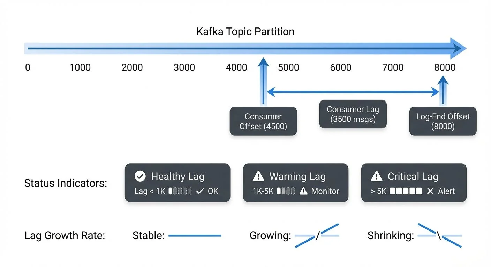

# Consumer Lag: Monitoring and Managing Streaming Health

Consumer lag is one of the most critical metrics in any streaming system. It represents the gap between where your consumers are in processing messages and where the producers are in writing new data. Understanding, monitoring, and managing consumer lag is essential for maintaining healthy streaming pipelines and meeting service level agreements (SLAs).



<!-- ORIGINAL_DIAGRAM
```
┌──────────────────────────────────────────────────────────────────┐
│                    Consumer Lag Visualization                    │
└──────────────────────────────────────────────────────────────────┘

Kafka Topic Partition:
─────────────────────────────────────────────────────────────────▶
Offset:  0    1000   2000   3000   4000   5000   6000   7000  8000

                              ▲                            ▲
                              │                            │
                    Consumer Offset                  Log-End Offset
                         (4500)                          (8000)
                              │                            │
                              └────────────┬───────────────┘
                                           │
                                    ◀──────────▶
                                   Consumer Lag
                                   (3500 msgs)

Status Indicators:
────────────────────────────────────────────────────────────────

   Healthy          Warning           Critical
   Lag < 1K         Lag 1K-5K         Lag > 5K
   ░░░░░            ▒▒▒▒▒             ████
   ✓ OK             ⚠ Monitor         ✗ Alert

Lag Growth Rate:
   Stable: ─────    Growing: ──/──    Shrinking: ──\──
```
-->

For example, if a partition's latest message has an offset of 10,000 and your consumer has committed offset 9,500, the consumer lag is 500 messages. This number tells you how far behind your consumer is from real-time processing.

Lag exists for each partition independently. When monitoring consumer groups that subscribe to topics with multiple partitions, you need to track lag across all assigned partitions to get a complete picture of consumer health. The aggregate lag across all partitions often serves as the primary health indicator for the entire consumer group.

## Why Consumer Lag Matters

Consumer lag directly impacts several critical aspects of your streaming architecture:

**Data Freshness**: High lag means your downstream systems are processing stale data. If you're building real-time dashboards or fraud detection systems, excessive lag can render your insights useless or allow fraudulent transactions to slip through.

**SLA Compliance**: Many organizations have strict SLAs around data processing latency. A consumer that falls behind may violate these agreements, potentially triggering contractual penalties or damaging customer trust.

**System Health Indication**: Sudden increases in lag often signal underlying problems—overloaded consumers, network issues, database bottlenecks, or resource constraints. Lag is frequently the first visible symptom of degraded system performance.

**Capacity Planning**: Trending lag metrics over time help you understand when to scale your consumer infrastructure. Consistently growing lag indicates that your current capacity cannot keep pace with the incoming message rate.

## Root Causes of Consumer Lag

Understanding what causes lag is essential for effective remediation:

**Processing Bottlenecks**: The most common cause is simply that message processing takes too long. This might be due to expensive computations, slow database queries, external API calls, or inefficient code paths.

**Insufficient Consumer Resources**: If consumers don't have enough CPU, memory, or network bandwidth, they cannot process messages fast enough. This often manifests as high CPU utilization or memory pressure on consumer instances.

**Rebalancing Events**: When consumers join or leave a group, Kafka triggers a rebalance that temporarily halts processing. Frequent rebalances—caused by unhealthy consumers, network issues, or misconfigured timeouts—create periodic lag spikes.

**Backpressure from Downstream Systems**: Consumers often write to databases, send HTTP requests, or publish to other systems. If these downstream dependencies slow down or become unavailable, consumers get blocked waiting for responses.

**Message Skew**: Uneven distribution of messages across partitions or "hot" partitions receiving disproportionate traffic can cause some consumers to fall behind while others remain idle.

## Monitoring Consumer Lag

Effective lag monitoring requires multiple approaches and tools:

**Kafka Metrics**: Kafka exposes lag metrics through JMX (Java Management Extensions). The `kafka.consumer:type=consumer-fetch-manager-metrics,client-id=<consumer-id>` MBean provides `records-lag-max` and `records-lag` metrics for each partition.

**Consumer Group Commands**: The Kafka CLI includes the `kafka-consumer-groups.sh` tool for inspecting consumer group status:

```bash
kafka-consumer-groups --bootstrap-server localhost:9092 \
  --describe --group my-consumer-group
```

This command shows current offset, log-end offset, and lag for each partition, providing a real-time snapshot of consumer health.

**Dedicated Lag Monitoring Tools**:

- **Kafka Lag Exporter**: Modern Prometheus-based exporter that provides granular lag metrics with minimal overhead. Supports multiple clusters and integrates seamlessly with Grafana dashboards.
- **Burrow**: LinkedIn's HTTP API-based lag monitor with configurable evaluation rules and multi-cluster support.
- **Kafdrop / Kowl (Redpanda Console)**: Web UIs that provide real-time lag visibility and consumer group management.

**Observability Platforms**: Modern monitoring platforms like Prometheus, Grafana, Datadog, and New Relic offer Kafka integrations that collect lag metrics automatically. These platforms enable visualization, alerting, and correlation with other system metrics.

When implementing lag monitoring, track both absolute lag (number of messages behind) and lag growth rate. A static lag of 1,000 messages might be acceptable if it remains stable, but lag growing by 100 messages per second indicates a serious problem requiring immediate attention.

## Setting Up Effective Alerts

Alert configuration requires balancing sensitivity with noise reduction:

**Threshold-Based Alerts**: Set absolute lag thresholds based on your SLAs and typical message rates. For example, alert when lag exceeds 10,000 messages or when any partition lags by more than 5 minutes of wall-clock time.

**Trend-Based Alerts**: Monitor lag growth over time windows. Alert when lag increases by more than 20% over a 5-minute period, indicating consumers are falling further behind rather than catching up.

**Anomaly Detection**: Use statistical approaches to detect unusual lag patterns. If your typical lag is 500 messages ±200, an anomaly detector can alert when lag suddenly jumps to 5,000, even if that's still below your absolute threshold.

**Partition-Level vs. Group-Level**: Decide whether to alert on individual partition lag or aggregate consumer group lag. Partition-level alerts catch localized issues, while group-level alerts focus on overall health.

Avoid alert fatigue by tuning thresholds to your specific workloads and using alert suppression during planned maintenance windows or deployments.

## Remediation Strategies

When lag occurs, systematic remediation is essential:

**Scale Consumer Instances**: The most direct solution is horizontal scaling. Add more consumer instances to your consumer group, and Kafka will automatically rebalance partitions across the expanded pool. This works when lag is caused by insufficient processing capacity.

**Optimize Processing Logic**: Profile your consumer code to identify bottlenecks. Optimize database queries, cache frequently accessed data, batch external API calls, or move expensive operations to asynchronous processing.

**Adjust Consumer Configuration**: Tune parameters like `fetch.min.bytes`, `fetch.max.wait.ms`, and `max.poll.records` to optimize throughput. Increasing the batch size can improve efficiency if you're processing messages in small batches.

**Partition Rebalancing**: If message distribution is skewed, consider adding partitions to the topic and implementing a better partitioning strategy. Ensure your partition key distributes messages evenly across partitions.

**Temporary Parallel Processing**: For one-time lag remediation, temporarily spin up additional consumer groups reading from the same topic to catch up faster. This requires ensuring your processing is idempotent and can handle duplicate operations.

## Consumer Group Dynamics and Lag

Consumer lag is intrinsically tied to consumer group behavior:

Each consumer in a group is assigned specific partitions through Kafka's partition assignment strategy. Lag exists per partition, so understanding which consumer handles which partition helps localize performance issues.

When consumers are unevenly loaded—perhaps one handles more partitions or more expensive messages—lag patterns become uneven across the group. Monitoring per-partition lag reveals these imbalances.

Rebalancing temporarily increases lag because all consumers must stop processing, coordinate the new partition assignment, and resume. Minimizing rebalance frequency through stable consumer instances and appropriate timeout configurations helps maintain consistent lag levels.

## Modern Consumer Group Protocol (Kafka 4.0 / KIP-848)

Kafka 4.0 introduces a next-generation consumer group protocol (KIP-848) that significantly improves rebalancing and lag management:

**Key Improvements**:
- **Incremental Rebalancing**: Instead of stopping all consumers during rebalance, only affected partitions are reassigned, reducing lag spikes
- **Static Membership Enhancements**: Better support for stable consumer group membership, minimizing unnecessary rebalances
- **Faster Coordination**: Consumer group state management is more efficient, reducing rebalance duration from seconds to milliseconds
- **Improved Lag Visibility**: Enhanced metrics provide better insight into rebalancing impact on lag

**Migration Considerations**: The new protocol is backward compatible but requires consumer upgrades to leverage improvements. Monitor rebalance frequency and duration before and after migration to quantify benefits.

## Advanced Patterns

Sophisticated streaming architectures employ lag-aware patterns:

**Lag-Based Autoscaling**: Use lag metrics to trigger automatic scaling of consumer infrastructure. When lag exceeds a threshold for a sustained period, automatically provision additional consumer instances. When lag normalizes, scale back down to optimize costs. Kubernetes-based deployments can use KEDA (Kubernetes Event-Driven Autoscaling) with Kafka lag metrics as triggers.

**Priority Processing**: Implement separate consumer groups with different priorities. A high-priority group might process a subset of critical messages first, ensuring low lag for important data even if the comprehensive consumer group falls behind.

**Time-Based Lag Monitoring**: In addition to message count lag, monitor time-based lag (how old the messages being processed are). For time-sensitive applications, a 5-minute time lag might be more meaningful than 10,000 message lag.

**Lag-Aware Load Shedding**: When lag becomes critical, implement strategies to shed load temporarily—processing only high-priority messages, sampling data, or bypassing expensive enrichment steps to catch up faster. See [Backpressure Handling in Streaming Systems](https://conduktor.io/glossary/backpressure-handling-in-streaming-systems) for related patterns.

**Circuit Breaker Integration**: Connect lag monitoring to circuit breaker patterns. If a downstream dependency is causing backpressure and increasing lag, open the circuit breaker to prevent further degradation while alerting operators.

## Tools and Ecosystem

The Kafka ecosystem provides rich tooling for lag management:

**Kafka CLI Tools**: Built-in commands like `kafka-consumer-groups.sh` provide essential lag inspection capabilities for troubleshooting and manual monitoring.

**Burrow**: LinkedIn's Burrow offers comprehensive lag evaluation with configurable rules, HTTP API for integration, and multi-cluster support. It's particularly valuable for large-scale deployments.

**Streaming Management Platforms**: Modern platforms provide visual lag monitoring with historical trends, anomaly detection, and governance capabilities. Unified interfaces make it easy to monitor lag across multiple clusters while maintaining data governance standards.

**Kafka Connect**: For Connect-based streaming pipelines, lag monitoring extends to source and sink connectors. Tracking connector lag ensures end-to-end pipeline health.

**Stream Processing Frameworks**: Frameworks like Kafka Streams and Flink expose lag metrics specific to their processing models, including state store lag and processing time lag.

## Conclusion

Consumer lag is more than just a number—it's a window into the health and performance of your entire streaming system. By understanding what causes lag, monitoring it effectively, setting intelligent alerts, and responding with appropriate remediation strategies, you can maintain healthy streaming pipelines that meet SLAs and deliver real-time value.

Remember that lag monitoring is not a one-time configuration but an ongoing practice. As your data volumes grow, your processing logic evolves, and your infrastructure changes, continuously refine your lag monitoring strategy to ensure it remains effective and actionable.

Whether you're using basic Kafka CLI tools or sophisticated streaming management platforms for governance and monitoring, the key is establishing a culture of lag awareness across your team. When everyone understands lag metrics and their implications, your organization can build and maintain robust, reliable streaming systems that truly operate in real time.

## Related Concepts

- [Kafka Cluster Monitoring and Metrics](https://conduktor.io/glossary/kafka-cluster-monitoring-and-metrics) - Comprehensive monitoring strategies covering broker health, partition replication, and performance metrics beyond consumer lag.
- [Kafka Performance Tuning Guide](https://conduktor.io/glossary/kafka-performance-tuning-guide) - Optimization techniques to reduce consumer lag through improved throughput and processing efficiency.
- [Backpressure Handling in Streaming Systems](https://conduktor.io/glossary/backpressure-handling-in-streaming-systems) - Patterns for managing flow control when consumer lag indicates backpressure from downstream systems.

## Sources and References

- [Apache Kafka Monitoring Documentation](https://kafka.apache.org/documentation/#monitoring) - Official guide to Kafka metrics and monitoring approaches
- [Confluent Monitoring Consumer Lag](https://docs.confluent.io/platform/current/kafka/monitoring.html#consumer-lag-monitoring) - Best practices for tracking and analyzing consumer lag
- [LinkedIn Burrow](https://github.com/linkedin/Burrow) - Open-source consumer lag monitoring tool with evaluation rules
- [Kafka Consumer Groups CLI](https://kafka.apache.org/documentation/#basic_ops_consumer_group) - Command-line tools for inspecting consumer group status
- [Prometheus JMX Exporter for Kafka](https://github.com/prometheus/jmx_exporter) - Exposing Kafka JMX metrics for monitoring platforms
