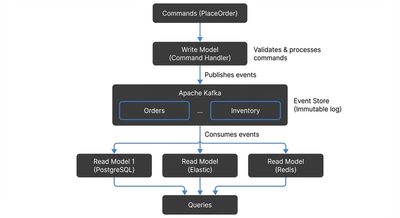

# CQRS and Event Sourcing with Kafka

Modern applications face increasing demands for scalability, auditability, and real-time responsiveness. Two architectural patterns—Command Query Responsibility Segregation (CQRS) and Event Sourcing—address these challenges by rethinking how we model and store data. While each pattern offers distinct benefits, they complement each other exceptionally well, especially when built on Apache Kafka's event streaming platform.

This article explores how CQRS and Event Sourcing work individually and together, why Kafka serves as an ideal foundation, and what you need to know to implement these patterns successfully. For broader context on event-driven systems, see [Event-Driven Architecture](event-driven-architecture.md) and [Event-Driven Microservices Architecture](event-driven-microservices-architecture.md).

## Understanding CQRS: Separating Reads from Writes

Command Query Responsibility Segregation (CQRS) is a pattern that separates the write model (commands) from the read model (queries) in an application. Instead of using a single data model for both operations, CQRS maintains distinct models optimized for their specific purposes.

The write side handles commands that change application state. These commands go through validation, business logic, and eventually modify the system. The read side handles queries that retrieve data, often from denormalized views optimized for specific query patterns.

This separation provides several advantages. Read and write workloads can scale independently, which is valuable when query traffic far exceeds write traffic. Each model can use different data stores optimized for its access patterns—for example, a normalized database for writes and a document store or search index for reads.

CQRS also improves security and performance. You can apply different security policies to commands versus queries, and optimize each side without compromise.

## Event Sourcing: State as a Sequence of Events

Event Sourcing takes a fundamentally different approach to data persistence. Instead of storing the current state of an entity, Event Sourcing stores the complete sequence of events that led to that state. The current state is derived by replaying these events.

Consider a bank account. Traditional systems store the current balance. Event Sourcing stores every transaction: AccountOpened, MoneyDeposited, MoneyWithdrawn. To determine the current balance, you replay these events from the beginning.

This approach offers powerful capabilities. You get a complete audit trail automatically—every change is recorded as an event with full context. You can reconstruct past states by replaying events up to any point in time, enabling temporal queries and debugging. If you discover bugs in your business logic, you can fix the code and replay events to correct the current state.

Events are immutable facts about what happened. Once written, they never change. This immutability simplifies concurrency, debugging, and distributed system reasoning.

### Optimizing Event Replay with Snapshots

For long-lived aggregates with thousands of events, replaying the entire history on every read becomes impractical. **Snapshots** solve this performance challenge by periodically saving the current state as a checkpoint.

Instead of replaying 10,000 account transactions, you load the most recent snapshot (taken at event 9,500) and replay only the 500 events since then. Snapshots are stored alongside events but treated differently—they're performance optimizations, not the source of truth. If a snapshot is corrupted or missing, you can always rebuild it from events.

Kafka's **log compaction** feature supports snapshot strategies. By using a separate compacted topic keyed by aggregate ID, you can store the latest snapshot for each entity. When consumers need to rebuild state, they first read the snapshot, then continue with the event stream. For more details on this Kafka feature, see [Kafka Log Compaction Explained](kafka-log-compaction-explained.md).

```java
// Snapshot strategy example
public AccountState loadAccount(String accountId) {
    // Try loading latest snapshot
    AccountSnapshot snapshot = snapshotStore.getLatest(accountId);

    long startPosition = snapshot != null ?
        snapshot.getLastEventPosition() : 0;

    // Replay events since snapshot
    List<Event> events = eventStore.getEventsSince(accountId, startPosition);

    AccountState state = snapshot != null ?
        snapshot.getState() : new AccountState();

    return events.stream().reduce(state,
        (acc, event) -> acc.apply(event),
        (a, b) -> b);
}
```

## Why Kafka is the Ideal Foundation

Apache Kafka's architecture aligns perfectly with CQRS and Event Sourcing requirements. Kafka is a distributed commit log that stores streams of events durably and provides both pub-sub and queue semantics. For a comprehensive introduction to Kafka's core concepts, see [Apache Kafka](apache-kafka.md).

Kafka topics serve as the event store. Events are written to topics and retained based on configurable policies—for days, weeks, or indefinitely. This durable log becomes the source of truth for Event Sourcing. Unlike traditional message queues that delete messages after consumption, Kafka retains events, allowing new consumers to process the entire history.

Kafka's partitioning enables horizontal scaling. Events with the same key (like a customer ID) go to the same partition, maintaining order for that entity. Multiple partitions allow parallel processing across many consumers. This is crucial when rebuilding read models from potentially millions of events.

Kafka's exactly-once semantics ensure events aren't lost or duplicated, which is essential for financial or transactional systems. As of Kafka 4.0+ (2024-2025), exactly-once processing is more robust with improved transactional guarantees. To achieve exactly-once delivery, configure producers with `enable.idempotence=true` and use transactional IDs for coordinated writes across multiple partitions. For detailed coverage of this critical feature, see [Exactly-Once Semantics in Kafka](exactly-once-semantics-in-kafka.md). The platform's performance—handling millions of events per second—supports even the most demanding real-time applications.

Modern Kafka deployments (4.0+) use KRaft mode, which removes the dependency on Apache ZooKeeper for metadata management. This simplifies operations, reduces infrastructure complexity, and improves cluster startup times and scalability. KRaft mode is the default and recommended configuration for all new Kafka clusters as of 2025.

Kafka Connect and Kafka Streams provide robust ecosystems for integrating with external systems and building stream processing applications. For an introduction to building streaming applications, see [Introduction to Kafka Streams](introduction-to-kafka-streams.md). Additionally, modern stream processing frameworks like Apache Flink integrate seamlessly with Kafka for more complex stateful computations and event-time processing.

## Implementation Patterns and Architecture

Implementing CQRS and Event Sourcing with Kafka follows a typical pattern. The command side receives commands (HTTP requests, API calls), validates them, and publishes events to Kafka topics representing the business domain.



<!-- ORIGINAL_DIAGRAM
```
┌─────────────────────────────────────────────────────────────┐
│            CQRS + Event Sourcing with Kafka                 │
└─────────────────────────────────────────────────────────────┘

  ┌──────────────┐
  │   Commands   │
  │ (PlaceOrder) │
  └──────┬───────┘
         │
         ▼
  ┌──────────────────┐
  │   Write Model    │  Validates & processes commands
  │ (Command Handler)│
  └────────┬─────────┘
           │ Publishes events
           ▼
  ┌────────────────────────────────────┐
  │         Apache Kafka               │  Event Store
  │  ┌──────────┐  ┌──────────┐       │  (Immutable log)
  │  │  Orders  │  │ Inventory│  ...  │
  │  └──────────┘  └──────────┘       │
  └────────┬───────────────────────────┘
           │ Consumes events
           ├────────────┬────────────┐
           ▼            ▼            ▼
  ┌──────────────┐ ┌──────────┐ ┌──────────┐
  │ Read Model 1 │ │Read Model│ │Read Model│
  │ (PostgreSQL) │ │(Elastic) │ │ (Redis)  │
  └──────┬───────┘ └────┬─────┘ └────┬─────┘
         │              │            │
         └──────────────┼────────────┘
                        ▼
                  ┌──────────┐
                  │ Queries  │
                  └──────────┘
```
-->

For example, in an e-commerce system, a "PlaceOrder" command might produce an "OrderPlaced" event containing the order details. This event is written to an "orders" topic in Kafka.

The read side consists of one or more consumers that subscribe to these event topics and build materialized views. Each view is optimized for specific query patterns. One consumer might build a denormalized view in PostgreSQL for transactional queries. Another might index data in Elasticsearch for full-text search. A third might populate Redis for low-latency lookups.

These materialized views are called **projections**—read-optimized representations of data derived from the event stream. Projections transform and aggregate events into formats suitable for queries. Since they're derived from events, you can rebuild or modify projections without affecting the write side or losing data.

Using Kafka Streams or ksqlDB, you can build sophisticated projections with joins, aggregations, and windowing. These tools operate directly on Kafka topics, treating them as tables and streams.

When debugging or developing these systems, tools like Conduktor help visualize event flows through topics, inspect message contents, and test consumer behavior. This visibility is valuable when troubleshooting why a read model isn't updating correctly or when understanding the impact of schema changes.

### Practical Example: Order Management

Consider an order management system. Commands include CreateOrder, ShipOrder, CancelOrder. Each produces corresponding events: OrderCreated, OrderShipped, OrderCanceled.

Here's what an event looks like in practice:

```json
{
  "eventId": "550e8400-e29b-41d4-a716-446655440000",
  "eventType": "OrderCreated",
  "timestamp": "2025-01-15T10:30:00Z",
  "aggregateId": "order-12345",
  "version": 1,
  "data": {
    "orderId": "order-12345",
    "customerId": "customer-789",
    "items": [
      {"productId": "prod-001", "quantity": 2, "price": 29.99}
    ],
    "totalAmount": 59.98,
    "status": "CREATED"
  }
}
```

The command handler validates commands and publishes events to Kafka:

```java
// Command Handler (Write Side)
public class OrderCommandHandler {
    private final KafkaProducer<String, OrderEvent> producer;

    public void handle(CreateOrderCommand command) {
        // Validate command
        validateOrder(command);

        // Create event
        OrderCreatedEvent event = new OrderCreatedEvent(
            UUID.randomUUID(),
            command.getOrderId(),
            command.getCustomerId(),
            command.getItems(),
            Instant.now()
        );

        // Publish to Kafka with order ID as key for partitioning
        ProducerRecord<String, OrderEvent> record =
            new ProducerRecord<>("order-events", event.getOrderId(), event);

        producer.send(record, (metadata, exception) -> {
            if (exception == null) {
                log.info("Event published to partition {} at offset {}",
                    metadata.partition(), metadata.offset());
            }
        });
    }
}
```

The read side consumes events and builds materialized views (projections):

```java
// Consumer building read model (Read Side)
public class OrderReadModelConsumer {
    private final OrderRepository repository;

    @KafkaListener(topics = "order-events", groupId = "order-view-builder")
    public void consume(ConsumerRecord<String, OrderEvent> record) {
        OrderEvent event = record.value();

        switch (event.getType()) {
            case ORDER_CREATED:
                OrderCreatedEvent created = (OrderCreatedEvent) event;
                OrderView view = new OrderView(
                    created.getOrderId(),
                    created.getCustomerId(),
                    created.getTotalAmount(),
                    "CREATED"
                );
                repository.save(view);
                break;

            case ORDER_SHIPPED:
                repository.updateStatus(event.getOrderId(), "SHIPPED");
                break;

            case ORDER_CANCELED:
                repository.updateStatus(event.getOrderId(), "CANCELED");
                break;
        }
    }
}
```

Multiple read models consume the "order-events" topic, partitioned by order ID:

- An operational dashboard queries a PostgreSQL view showing current order statuses
- A reporting system aggregates data in a data warehouse for analytics
- A notification service triggers emails when orders ship

Each consumer maintains its own projection—a denormalized view built from events. If you add a new analytics requirement, you create a new consumer, replay the event history from the beginning, and build the new view without touching the write side.

## Challenges and Trade-offs

While powerful, these patterns introduce complexity. Eventual consistency is inherent—there's a delay between writing an event and updating read models. Applications must handle scenarios where a command succeeds but the read model hasn't updated yet.

Event schema evolution requires careful planning. Events are immutable, but your understanding of the domain evolves. You need strategies for handling multiple event versions and migrating between schemas.

Modern schema management tools help manage this complexity:

- **Confluent Schema Registry** or **Apicurio Registry** provide centralized schema storage with version control and compatibility checking
- **Apache Avro**, **Protocol Buffers**, or **JSON Schema** define structured event formats with evolution rules (see [Avro vs Protobuf vs JSON Schema](avro-vs-protobuf-vs-json-schema.md) for a comparison)
- **Compatibility modes** enforce constraints:
  - **Backward compatibility**: New consumers can read old events (safe to add optional fields)
  - **Forward compatibility**: Old consumers can read new events (safe to remove optional fields)
  - **Full compatibility**: Both forward and backward (safest for most use cases)

In practice, version your events explicitly and handle multiple versions in consumers:

```java
public void consume(ConsumerRecord<String, OrderEvent> record) {
    OrderEvent event = record.value();

    // Handle different event versions
    switch (event.getVersion()) {
        case 1:
            processOrderEventV1(event);
            break;
        case 2:
            processOrderEventV2(event);
            break;
        default:
            log.warn("Unknown event version: {}", event.getVersion());
    }
}
```

Schema registries integrate with Kafka producers and consumers to automatically validate schemas before publishing and deserialize events correctly based on their schema version.

Operational overhead increases. You're managing event stores, multiple read models, and the infrastructure to keep them synchronized. Storage grows since events accumulate over time, though Kafka's retention policies help manage this.

Kafka offers two retention strategies:

- **Time-based or size-based retention**: Delete old events after a specified time (e.g., 30 days) or when storage reaches a limit
- **Log compaction**: For keyed topics, retain only the latest value for each key, automatically removing older versions while preserving the most recent state

Log compaction is particularly useful for snapshot topics in Event Sourcing. Instead of storing every snapshot ever created for an entity, compaction keeps only the most recent one. This provides efficient state recovery without unbounded storage growth.

Not every system needs these patterns. Simple CRUD applications add unnecessary complexity with CQRS and Event Sourcing. These patterns shine in complex domains with high scalability requirements, critical audit needs, or sophisticated read patterns that differ significantly from write patterns.

## Summary

CQRS and Event Sourcing are complementary patterns that excel when built on Apache Kafka's event streaming platform. CQRS separates read and write concerns, enabling independent scaling and optimization. Event Sourcing provides complete audit trails and the ability to reconstruct past states.

Kafka's durable, partitioned, scalable log architecture provides the ideal foundation for implementing these patterns in production systems. While they introduce complexity and operational considerations, the benefits for scalable, auditable, event-driven systems make them valuable tools for modern architectures.

Success requires understanding the trade-offs, investing in proper tooling and monitoring, and applying these patterns where they provide clear value over simpler alternatives. For additional Event Sourcing implementation patterns and best practices, see [Event Sourcing Patterns with Kafka](event-sourcing-patterns-with-kafka.md).

## Sources and References

1. Fowler, Martin. "CQRS." martinfowler.com, 2011. https://martinfowler.com/bliki/CQRS.html
2. Fowler, Martin. "Event Sourcing." martinfowler.com, 2005. https://martinfowler.com/eaaDev/EventSourcing.html
3. Stopford, Ben. "Designing Event-Driven Systems." O'Reilly Media, 2018. https://www.confluent.io/designing-event-driven-systems/
4. Narkhede, Neha, Gwen Shapira, and Todd Palino. "Kafka: The Definitive Guide." O'Reilly Media, 2017.
5. Boner, Jonas, et al. "Reactive Microsystems: The Evolution of Microservices at Scale." O'Reilly Media, 2017. https://www.oreilly.com/library/view/reactive-microsystems/9781491994368/
