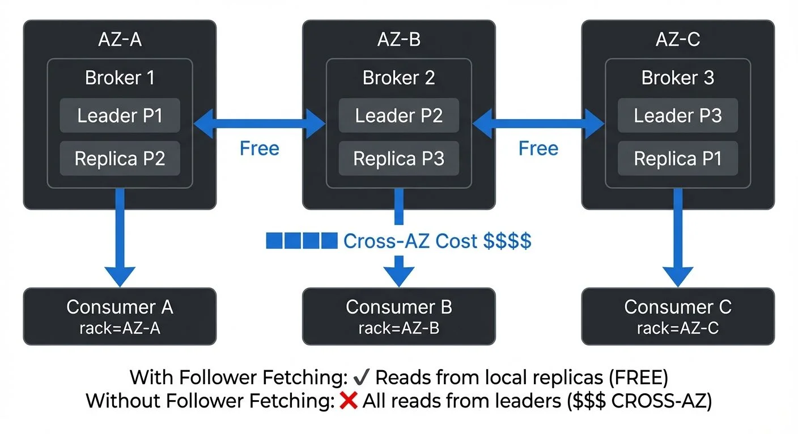

# Cross-AZ Traffic in Streaming: Managing Costs and Latency



<!-- ORIGINAL_DIAGRAM
```
┌──────────────────────────────────────────────────────────────────┐
│          Multi-AZ Kafka Deployment with Traffic Flow             │
└──────────────────────────────────────────────────────────────────┘

    AZ-A                    AZ-B                    AZ-C
┌─────────────┐        ┌─────────────┐        ┌─────────────┐
│             │        │             │        │             │
│  Broker 1   │◀──────▶│  Broker 2   │◀──────▶│  Broker 3   │
│  Leader P1  │  Free  │  Leader P2  │  Free  │  Leader P3  │
│  Replica P2 │        │  Replica P3 │        │  Replica P1 │
│             │        │             │        │             │
└─────┬───────┘        └─────┬───────┘        └─────┬───────┘
      │                      │                      │
      │ ████ Cross-AZ        │                      │
      │ $$$$ Cost            │                      │
      │                      │                      │
┌─────▼───────┐        ┌─────▼───────┐        ┌─────▼───────┐
│ Consumer A  │        │ Consumer B  │        │ Consumer C  │
│ rack=AZ-A   │        │ rack=AZ-B   │        │ rack=AZ-C   │
│             │        │             │        │             │
│ With Follower Fetching:                     │
│ ✓ Reads from local replicas (FREE)          │
│                                              │
│ Without Follower Fetching:                  │
│ ✗ All reads from leaders ($$$ CROSS-AZ)     │
└──────────────────────────────────────────────┘
```
-->

## Understanding Cross-AZ Traffic

Cross-availability-zone (cross-AZ) traffic refers to data transfer between different availability zones within the same cloud region. Availability zones are isolated data centers with independent power, cooling, and networking, designed to provide fault tolerance and high availability.

In streaming architectures, cross-AZ traffic occurs whenever data moves between components deployed in different zones. This includes broker-to-broker replication, consumer fetches from brokers in other zones, and producer writes to leaders in different zones. For foundational Kafka concepts including brokers, topics, and partitions, see [Kafka Topics, Partitions, and Brokers: Core Architecture](https://conduktor.io/glossary/kafka-topics-partitions-brokers-core-architecture).

Unlike traffic within a single availability zone (typically free) or between regions (significantly more expensive), cross-AZ traffic occupies a middle ground that can become a substantial cost factor at scale. Understanding and optimizing this traffic is essential for cost-effective streaming deployments.

## Cost and Performance Implications

Cloud providers charge for cross-AZ data transfer, with pricing typically ranging from $0.01 to $0.02 per GB transferred. While this may seem modest, streaming platforms processing terabytes daily can accumulate significant costs:

- **AWS**: $0.01/GB in each direction ($0.02/GB total for bidirectional)
- **Google Cloud Platform**: $0.01/GB
- **Azure**: $0.01/GB between zones

For a Kafka cluster processing 10 TB/day with a replication factor of 3 and distributed consumers, cross-AZ traffic can easily reach 15-20 TB/day, translating to $150-400/day or $4,500-12,000/month in data transfer costs alone.

Beyond costs, cross-AZ traffic introduces latency. While typically modest (1-2ms within a region), this latency compounds in streaming architectures where data passes through multiple stages. For latency-sensitive applications, minimizing cross-AZ hops becomes a performance requirement, not just a cost optimization.

## Cross-AZ Traffic in Kafka

Apache Kafka generates cross-AZ traffic through several mechanisms. With Kafka 4.0 (released 2024) and the transition to KRaft consensus replacing ZooKeeper, cross-AZ traffic patterns have evolved with improved metadata distribution and reduced coordination overhead:

### Replication Traffic

With a replication factor greater than 1, Kafka replicates partition data across multiple brokers. If these brokers reside in different availability zones, replication generates cross-AZ traffic. For a replication factor of 3, this can triple your ingress data volume. For detailed coverage of replication mechanisms and high availability, see [Kafka Replication and High Availability](https://conduktor.io/glossary/kafka-replication-and-high-availability).

### Consumer Fetch Patterns

Consumers fetch data from partition leaders. If a consumer in zone A fetches from a leader in zone B, all consumed data traverses zones. With multiple consumer groups, this traffic multiplies rapidly. For in-depth understanding of consumer group mechanics, see [Kafka Consumer Groups Explained](https://conduktor.io/glossary/kafka-consumer-groups-explained).

### Producer Acknowledgments

Producers receive acknowledgments from partition leaders. When `acks=all`, producers wait for all in-sync replicas to acknowledge, potentially generating cross-AZ traffic for both writes and acknowledgments.

### Partition Leadership Distribution

Kafka distributes partition leadership across brokers. Without rack awareness, leaders may be evenly distributed across zones, maximizing cross-AZ traffic potential. For detailed coverage of partition distribution strategies, see [Kafka Partitioning Strategies and Best Practices](https://conduktor.io/glossary/kafka-partitioning-strategies-and-best-practices).

## Optimization Strategies

### Rack Awareness Configuration

Kafka's rack awareness feature allows you to assign brokers to logical racks (availability zones). When enabled, Kafka distributes partition replicas across racks, ensuring high availability while enabling zone-aware optimizations.

Configure rack awareness in broker properties:

```properties
broker.rack=us-east-1a
```

With rack awareness enabled, Kafka ensures replicas for each partition span multiple racks, preventing data loss if an entire zone fails while providing the foundation for follower fetching optimizations.

### Follower Fetching for Consumers

Introduced in Kafka 2.4 and now standard in Kafka 3.x and 4.x, follower fetching allows consumers to fetch data from the nearest replica rather than always fetching from the partition leader. This dramatically reduces cross-AZ traffic when consumers and follower replicas are co-located.

Enable follower fetching by setting:

```properties
# Consumer configuration
client.rack=us-east-1a
```

Combined with broker rack awareness, Kafka routes consumer fetches to replicas in the same availability zone, potentially reducing consumer-related cross-AZ traffic by 60-80%. In Kafka 4.0, follower fetching has been further optimized with improved replica lag detection and faster failover to leader fetches when necessary.

### Zone-Aware Partition Assignment

For partition assignment strategies, consider implementing custom assignors that account for zone locality. While Kafka's default assignors focus on balance, zone-aware assignors can co-locate consumers with partition replicas, minimizing cross-AZ fetches.

### Strategic Topic Placement

For topics with predictable consumption patterns, consider strategic placement:

- **Internal topics**: If consumed only by brokers, ensure leaders are distributed to minimize cross-AZ replication
- **Single-zone topics**: For less critical data, place all replicas in a single zone to eliminate cross-AZ traffic entirely (sacrificing multi-zone availability)
- **Read-heavy topics**: Ensure replicas exist in all zones where consumers run

### Tiered Storage for Historical Data

Kafka 4.0 introduced production-ready Tiered Storage, which offloads older segments to object storage (S3, GCS, Azure Blob) while keeping recent data on local broker disks. This significantly impacts cross-AZ traffic patterns:

**Benefits for Cross-AZ Traffic:**
- **Reduced replication costs**: Historical data in object storage doesn't require multi-AZ replication across Kafka brokers
- **Lower ongoing costs**: Object storage replication is handled by cloud providers, typically at lower rates
- **Selective local storage**: Keep only hot data (recent messages) on expensive multi-AZ broker storage

**Configuration example:**

```properties
# Broker configuration for Tiered Storage (Kafka 4.0+)
remote.log.storage.system.enable=true
remote.log.manager.task.interval.ms=60000
# Move segments to tiered storage after 1 hour
local.retention.ms=3600000
local.retention.bytes=10737418240
```

Tiered Storage is particularly effective for topics with long retention requirements but infrequent historical data access, reducing cross-AZ traffic by 30-50% for such workloads.

## Monitoring and Measurement

Effective optimization requires visibility into cross-AZ traffic patterns:

### Key Metrics

- **Network bytes in/out per broker**: Track at the availability zone level
- **Replication bytes**: Monitor broker replication traffic
- **Consumer fetch bytes**: Track by consumer group and zone
- **Partition distribution**: Monitor leader and replica distribution across zones

### Monitoring Tools

Cloud providers offer native monitoring for cross-AZ traffic:

- **AWS CloudWatch**: NetworkIn/NetworkOut metrics with availability zone dimensions
- **GCP Cloud Monitoring**: Network egress metrics by zone
- **Azure Monitor**: Network traffic metrics with zone filtering

Kafka metrics provide additional insight:

- `kafka.server:type=BrokerTopicMetrics,name=BytesInPerSec`
- `kafka.server:type=BrokerTopicMetrics,name=BytesOutPerSec`
- `kafka.server:type=FetcherStats,name=BytesPerSec`

**Modern Monitoring Stack (2025):**

For comprehensive cross-AZ traffic monitoring, modern deployments typically use:

- **Prometheus + Grafana**: Industry-standard observability stack with JMX Exporter for Kafka metrics
- **Kafka Lag Exporter**: Tracks consumer lag by partition, enabling zone-specific lag monitoring
- **Cloud provider cost dashboards**: AWS Cost Explorer, GCP Cost Management, Azure Cost Analysis with resource tagging
- **Kafka UI tools**: Conduktor for comprehensive visual monitoring and management

For comprehensive coverage of Kafka monitoring strategies, see [Kafka Cluster Monitoring and Metrics](https://conduktor.io/glossary/kafka-cluster-monitoring-and-metrics).

### Cost Attribution

Implement tagging strategies to attribute cross-AZ costs to specific teams, applications, or topics. This enables data-driven optimization decisions and cost awareness across your organization. For detailed guidance on implementing cost attribution and chargeback models that include network transfer costs, see [Conduktor's Cost Control Insights](https://docs.conduktor.io/guide/insights/cost-control).

## Trade-offs and Best Practices

### High Availability vs Cost Optimization

The fundamental trade-off in cross-AZ optimization is between high availability and cost. Multi-zone deployments provide fault tolerance against zone failures but generate cross-AZ traffic. Consider:

- **Mission-critical topics**: Maintain replication factor 3 across zones
- **Development environments**: Use single-zone deployment or replication factor 2
- **Archival topics**: Lower replication requirements may be acceptable

For disaster recovery strategies beyond availability zone failures, see [Disaster Recovery Strategies for Kafka Clusters](https://conduktor.io/glossary/disaster-recovery-strategies-for-kafka-clusters).

### Performance vs Redundancy

Follower fetching improves performance and reduces costs but creates dependencies on local replicas. If a zone's replicas fall behind, consumers may experience increased latency or fall back to cross-AZ fetches. For comprehensive performance optimization techniques, see [Kafka Performance Tuning Guide](https://conduktor.io/glossary/kafka-performance-tuning-guide).

### Zone-Aware Consumer Configuration

Deploy consumers with explicit zone awareness:

1. Set `client.rack` to match consumer deployment zone
2. Ensure sufficient partition replicas in consumer zones
3. Monitor consumer lag by zone to detect replica lag issues

### Managed Service Considerations

Managed Kafka services handle some optimizations automatically:

- **Amazon MSK**: Automatically configures rack awareness across availability zones. As of 2025, MSK supports Kafka 3.x with KRaft mode, reducing metadata-related cross-AZ traffic

However, you still control consumer deployment and topic configuration, making zone-awareness essential even with managed services. Tools like Conduktor help monitor and optimize these deployments across any Kafka infrastructure.

## Cost Modeling and Planning

Understanding cross-AZ costs is essential for capacity planning and infrastructure budgeting. For comprehensive capacity planning guidance, see [Kafka Capacity Planning](https://conduktor.io/glossary/kafka-capacity-planning).

### Estimating Monthly Costs

Calculate potential cross-AZ costs using this formula:

```
Monthly Cross-AZ Cost = (
  (Daily Ingress × Replication Factor × Cross-AZ Percentage) +
  (Daily Ingress × Consumer Groups × Cross-AZ Fetch Percentage)
) × 30 × Cost per GB
```

### Real-World Scenario

Consider a deployment with:
- 10 TB/day ingress
- Replication factor of 3
- 4 consumer groups
- 50% of replicas in different zones
- 70% of consumer fetches cross-zone (before optimization)
- $0.01/GB cross-AZ cost

**Before optimization:**
- Replication: 10 TB × 2 (additional replicas) × 0.5 = 10 TB/day cross-AZ
- Consumer fetches: 10 TB × 4 × 0.7 = 28 TB/day cross-AZ
- Total: 38 TB/day × 30 × $0.01 = $11,400/month

**After follower fetching:**
- Replication: 10 TB/day (unchanged)
- Consumer fetches: 10 TB × 4 × 0.1 = 4 TB/day cross-AZ (reduced to 10%)
- Total: 14 TB/day × 30 × $0.01 = $4,200/month
- **Monthly savings: $7,200**

### Optimization ROI

Even modest optimizations deliver substantial returns. Implementing follower fetching typically requires minimal engineering effort (configuration changes) while delivering 30-60% reductions in cross-AZ traffic costs.

## Governance and Best Practices

Managing cross-AZ traffic at scale requires governance policies and enforcement mechanisms. Establishing topic creation policies, deployment standards, and cost accountability ensures sustainable optimization.

Governance platforms provide capabilities for managing Kafka deployments, including topic configuration policies, cluster monitoring, and cost visibility. By enforcing zone-aware configurations and providing visibility into traffic patterns, these tools help maintain optimization gains as your streaming infrastructure evolves.

---

## Key Takeaways

- Cross-AZ traffic costs $0.01-0.02/GB and accumulates rapidly in streaming deployments
- Kafka generates cross-AZ traffic through replication, consumer fetches, and partition leadership
- Rack awareness and follower fetching are essential optimizations, reducing cross-AZ traffic by 60-80%
- Kafka 4.0's Tiered Storage reduces cross-AZ costs by 30-50% for topics with long retention requirements
- KRaft consensus (default in Kafka 4.0) reduces metadata-related cross-AZ traffic compared to ZooKeeper
- Monitor cross-AZ traffic at both cloud and application layers for comprehensive visibility using Prometheus, Kafka Lag Exporter, and cloud provider dashboards
- Balance high availability requirements against cost optimization opportunities
- Managed services provide some automatic optimizations but still require zone-aware configuration
- Cost modeling and ROI analysis justify optimization investments
- Governance policies sustain long-term optimization gains

By understanding cross-AZ traffic patterns, implementing strategic optimizations, and maintaining visibility through monitoring, you can build cost-effective, performant streaming architectures that deliver high availability without excessive cloud data transfer costs.

## Related Concepts

- [Apache Kafka](https://conduktor.io/glossary/apache-kafka) - Platform architecture impacting cross-AZ traffic patterns
- [Kafka Capacity Planning](https://conduktor.io/glossary/kafka-capacity-planning) - Planning infrastructure to optimize cross-AZ costs
- [Disaster Recovery Strategies for Kafka Clusters](https://conduktor.io/glossary/disaster-recovery-strategies-for-kafka-clusters) - Multi-AZ strategies for high availability

## Sources and References

- [Apache Kafka 4.0 Documentation](https://kafka.apache.org/documentation/) - Official documentation including Tiered Storage and KRaft consensus
- [Apache Kafka Rack Awareness](https://kafka.apache.org/documentation/#rack) - Official documentation on configuring rack awareness for multi-AZ deployments
- [Kafka Follower Fetching (KIP-392)](https://cwiki.apache.org/confluence/display/KAFKA/KIP-392%3A+Allow+consumers+to+fetch+from+closest+replica) - Kafka Improvement Proposal enabling zone-aware consumer fetches
- [Kafka Tiered Storage (KIP-405)](https://cwiki.apache.org/confluence/display/KAFKA/KIP-405%3A+Kafka+Tiered+Storage) - Tiered Storage architecture and configuration
- [AWS Data Transfer Pricing](https://aws.amazon.com/ec2/pricing/on-demand/#Data_Transfer) - Understanding cross-AZ and inter-region transfer costs
- [Amazon MSK Best Practices](https://docs.aws.amazon.com/msk/latest/developerguide/bestpractices.html) - Multi-AZ deployment and cost optimization strategies
- [Conduktor Platform](https://www.conduktor.io/) - Kafka management and monitoring for multi-AZ deployments
