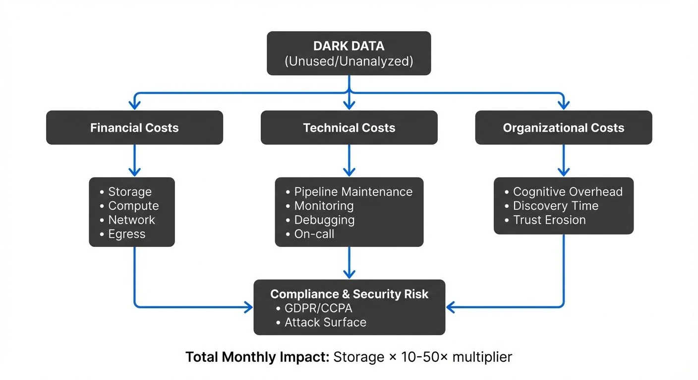

Data has been called the "new oil," but unlike oil, data doesn't automatically become valuable just by existing. Organizations today collect vast amounts of data that is never analyzed, queried, or used for decision-making. This unused information, known as "dark data," creates a hidden tax that extends far beyond storage costs. For a related but distinct challenge, see [Data Obesity](https://conduktor.io/glossary/data-obesity), which explores the broader problem of excessive data volume.

The dark data tax represents the cumulative financial, technical, and organizational burden of maintaining data that provides no business value. While cloud storage may be inexpensive, the true costs manifest in data pipeline maintenance, computational overhead, engineering time, cognitive load on data teams, and increased security and compliance risk.

## The Three Pillars of the Dark Data Tax

The dark data tax can be understood through three interconnected dimensions:

**Financial costs** include not just storage, but the compute resources required to ingest, serialize, transform, and move data through pipelines. Cloud providers charge for data transfer, query execution, and processing—costs that accumulate whether or not anyone uses the resulting datasets.

**Technical costs** emerge when data engineers spend valuable time maintaining pipelines, debugging failures, and optimizing schemas for data that serves no purpose. Every broken pipeline requires investigation, every schema change needs coordination, and every data quality issue demands attention.

**Organizational costs** appear as cognitive overhead. When data platforms contain thousands of unused tables, topics, or datasets, data consumers struggle to find reliable information. Trust in the platform erodes, productivity decreases, and teams waste time navigating "data swamps" instead of extracting insights.

## The Operational Tax: Beyond Storage Costs

A common misconception is that the primary cost of dark data is storage. Cloud object storage services like Amazon S3 or Google Cloud Storage charge only a few cents per gigabyte per month. At this price point, storage itself rarely becomes the limiting factor.

The real operational tax emerges elsewhere in the data lifecycle:

**Data ingestion and movement** consume significant resources. Every record ingested into a data warehouse or lakehouse incurs compute costs for parsing, validation, and transformation. Data transferred between regions or across cloud providers generates egress fees that can far exceed storage costs.

**Pipeline maintenance** represents an ongoing engineering investment. Data engineers build ETL or ELT processes to move data from source systems to analytical stores. These pipelines require monitoring, error handling, schema evolution management, and periodic optimization. When a pipeline breaks at 3 AM to load data that hasn't been queried in six months, the cost is paid in engineer time, burnout, and opportunity cost.

**Query and compute overhead** affects active users. In data warehouses, every table consumes metadata storage and appears in query planning. Unused tables slow down data discovery, clutter autocomplete suggestions, and occasionally get accidentally joined in queries, increasing execution time and costs.

Consider a typical scenario: A product team requests a new data stream to analyze user behavior. Data engineers build the pipeline, create transformations, and load data into a warehouse table. Three months later, the product initiative is cancelled, but the pipeline continues running. Over the next year, the organization pays for continuous ingestion, transformation compute, storage, and maintenance—all for data that will never be analyzed.

## The Dark Data Problem in Streaming Systems

Streaming data platforms like Apache Kafka, Apache Flink, and Apache Pulsar amplify the dark data tax in several ways:

**High-throughput continuous costs**: Unlike batch systems that process data periodically, streaming platforms operate continuously. Every message sent to a Kafka topic incurs network bandwidth, serialization overhead (converting data to efficient formats like Avro, Protocol Buffers, or JSON), and broker storage costs. If a topic receives millions of events per day that are never consumed or analyzed, you're paying constant compute and network costs with zero return.

**Real-time operational urgency**: Streaming systems are typically monitored with high priority because they often support real-time applications. When a stream fails, alerts fire, on-call engineers investigate, and teams treat the issue as urgent. If that stream feeds a dashboard that nobody looks at or a downstream system that was deprecated months ago, the operational overhead becomes pure waste.

**Consumer group proliferation**: In Kafka, multiple consumer groups (independent sets of consumers that each process all messages from a topic) can read from the same topic. Over time, consumer groups may be created for experiments, prototypes, or temporary analyses. Abandoned consumer groups continue tracking offsets and consuming cluster metadata. While the cost per consumer group is small, at scale this creates clutter and makes it difficult to understand actual data usage patterns. For detailed coverage of consumer group mechanics, see [Kafka Consumer Groups Explained](https://conduktor.io/glossary/kafka-consumer-groups-explained).

**Retention and compaction overhead**: Streaming platforms must decide how long to retain data. Longer retention periods provide flexibility for new use cases and recovery scenarios, but also increase storage costs and compaction overhead (the process of consolidating and removing duplicate or obsolete records). When topics contain dark data, organizations pay for retention without benefit. For more on compaction mechanics, see [Kafka Log Compaction Explained](https://conduktor.io/glossary/kafka-log-compaction-explained).

A data streaming team at a financial services company discovered that 40% of their Kafka topics hadn't been consumed in over 90 days. These topics continued generating data, consuming broker resources, and triggering alerts when brokers experienced performance degradation. By identifying and deprecating unused topics, they reduced cluster load by 35% and eliminated dozens of false-alert incidents per month.

**Modern operational improvements (2025)**: Kafka 4.0 and KRaft mode (Kafka's ZooKeeper-less architecture) significantly reduce the operational overhead of managing streaming platforms. KRaft eliminates the need to maintain a separate ZooKeeper ensemble, reducing infrastructure costs and operational complexity. This makes it easier to identify and deprecate dark data topics without worrying about the coordination overhead that ZooKeeper previously imposed. For comprehensive coverage of KRaft benefits, see [Understanding KRaft Mode in Kafka](https://conduktor.io/glossary/understanding-kraft-mode-in-kafka). Tools like Kafka Lag Exporter and Burrow provide real-time visibility into consumer lag and inactive consumer groups, helping teams quickly identify unused streams. For monitoring strategies, refer to [Consumer Lag Monitoring](https://conduktor.io/glossary/consumer-lag-monitoring).

## The Liability Tax: Security and Compliance Risks

Dark data doesn't just cost money and engineering time—it creates legal and security risks that can result in substantial penalties and reputational damage.

**Expanded attack surface**: Every database, data lake, or streaming topic represents a potential target for attackers. Unused datasets are often less monitored than active production systems, making them attractive targets. If a forgotten database contains customer information and gets breached, the organization faces the same regulatory consequences as if it were actively used data.

**Compliance violations**: Data privacy regulations like GDPR, CCPA, and HIPAA require organizations to minimize data collection, implement retention limits, and honor deletion requests. Dark data often violates these principles. You may be storing personally identifiable information (PII) in a deprecated table, unaware that it should have been deleted per a customer's request. The fine for GDPR violations can reach 4% of annual global revenue. For detailed guidance on compliance requirements, see [GDPR Compliance for Data Teams](https://conduktor.io/glossary/gdpr-compliance-for-data-teams) and [PII Detection and Handling in Event Streams](https://conduktor.io/glossary/pii-detection-and-handling-in-event-streams).

**Data residency and sovereignty**: Different jurisdictions have varying requirements about where data can be stored and processed. Dark data that has been replicated across regions or cloud providers may violate data residency requirements without anyone realizing it. Streaming platforms that replicate data across data centers for reliability can inadvertently create compliance issues when data is never purged.

**Audit and discovery burden**: When regulators or legal teams request information about data handling practices, dark data creates significant overhead. Teams must investigate abandoned datasets, determine what they contain, and assess compliance status—all for information that provides no business value.

A healthcare organization discovered during a compliance audit that they were retaining patient event streams in Kafka topics for over two years, far exceeding their stated retention policy of 90 days. While the data was encrypted, the extended retention violated their own privacy commitments and created unnecessary risk. Implementing automated retention policies and governance checks prevented similar issues in the future.

## Identifying and Reducing Dark Data

Reducing the dark data tax requires a combination of technical tooling, organizational processes, and cultural change. Modern platforms provide sophisticated capabilities for tracking and managing data assets:

**Implement data observability**: Deploy tools that track dataset usage, query frequency, and consumer activity. Modern data observability platforms (2025) like Monte Carlo, Datadog Data Streams Monitoring, and Confluent Observability provide comprehensive visibility into data pipelines, automatically detecting unused datasets and anomalies. For data warehouses, monitor table access patterns using query logs and metadata APIs. For streaming platforms, track consumer lag, active consumer groups, and topic throughput using tools like Kafka Lag Exporter or Burrow. Datasets that show no consumption activity for 60-90 days are strong candidates for deprecation. To understand the foundational principles, see [What is Data Observability: The Five Pillars](https://conduktor.io/glossary/what-is-data-observability-the-five-pillars).

**Establish lifecycle policies**: Define clear retention policies based on data type and business value. Operational logs might be retained for 30 days, analytical data for one year, and compliance data for seven years. Automate enforcement of these policies using platform features like Kafka's retention settings, S3 lifecycle rules, data warehouse table expiration, or lakehouse table format features. Modern lakehouse formats like Apache Iceberg, Delta Lake, and Apache Hudi (2025) provide sophisticated retention and time-travel capabilities that make it easier to manage data lifecycles while maintaining compliance and enabling auditing. For detailed coverage of lakehouse architectures, see [Introduction to Lakehouse Architecture](https://conduktor.io/glossary/introduction-to-lakehouse-architecture) and [Apache Iceberg](https://conduktor.io/glossary/apache-iceberg).

**Create data catalogs**: Maintain metadata about dataset purpose, ownership, consumers, and business value. Modern data catalog and governance platforms (2025) like OpenMetadata, Atlan, Collibra, Apache Atlas, and DataHub provide automated discovery, lineage tracking, and usage analytics. These tools help teams understand what data exists, who uses it, and why it was created. When a dataset's purpose is unclear or its owner has left the organization, it's likely dark data. Many platforms now integrate data quality monitoring through tools like Soda Core, automatically flagging datasets with quality issues or no recent consumption. For more on catalog capabilities, see [What is a Data Catalog: Modern Data Discovery](https://conduktor.io/glossary/what-is-a-data-catalog-modern-data-discovery).

**Implement approval workflows**: Require justification before creating new data pipelines or topics. A lightweight review process—where teams document the use case, expected consumers, and retention requirements—prevents the creation of speculative datasets that may never be used. Consider implementing data contracts that formalize agreements between data producers and consumers, ensuring that new data assets have committed downstream users before resources are allocated. For detailed guidance on data contracts, see [Data Contracts for Reliable Pipelines](https://conduktor.io/glossary/data-contracts-for-reliable-pipelines).

**Enable self-service governance**: For streaming platforms, governance tools provide visibility into Kafka clusters, topic usage, and consumer groups. Data teams can identify unused topics, review schema evolution, and enforce access control policies without requiring deep Kafka expertise. This democratizes governance and reduces the burden on central platform teams.

**Conduct regular audits**: Schedule quarterly reviews of data assets. For each dataset, ask: Is this being actively used? Does it serve a documented business purpose? Is it compliant with our retention policies? Datasets that fail these tests should be deprecated or archived.

**Implement soft deletion**: Rather than immediately deleting potentially dark data, mark it as deprecated and prevent new consumers. After a grace period (e.g., 30 days), if no one objects, proceed with deletion. This reduces the risk of accidentally removing valuable datasets while still eliminating waste.

## Summary

The dark data tax is a hidden but significant cost that affects organizations at every scale. While cloud storage is inexpensive, the true burden emerges in compute overhead, pipeline maintenance, engineering time, cognitive load, and security risk.

For streaming data platforms, the tax is particularly acute. Continuous high-throughput processing, real-time operational urgency, and complex consumer ecosystems multiply costs when data goes unused. A Kafka topic that receives millions of unused events per day generates constant network, serialization, and storage costs while consuming engineering attention for monitoring and maintenance. For a comprehensive analysis of streaming costs, see [Streaming Total Cost of Ownership](https://conduktor.io/glossary/streaming-total-cost-of-ownership).

Reducing the dark data tax requires technical solutions—data observability, automated retention policies, and governance tooling—combined with organizational discipline. By implementing usage tracking, establishing lifecycle policies, and conducting regular audits, data teams can identify and eliminate dark data before it accumulates. For broader governance context, see [Data Governance Framework: Roles and Responsibilities](https://conduktor.io/glossary/data-governance-framework-roles-and-responsibilities).

The goal is not to minimize all data collection, but to ensure that every dataset serves a documented purpose and delivers business value proportional to its cost. In an era where data volumes grow exponentially, the organizations that thrive will be those that distinguish between valuable data assets and expensive dark data liabilities.

## Related Concepts

- [Apache Kafka](https://conduktor.io/glossary/apache-kafka) - Streaming platforms where dark data tax often manifests through unused topics and consumer groups
- [Data Obesity](https://conduktor.io/glossary/data-obesity) - The related problem of excessive data volume impacting system performance
- [Streaming Total Cost of Ownership](https://conduktor.io/glossary/streaming-total-cost-of-ownership) - Understanding the full economic burden of streaming infrastructure including dark data

## Sources and References

- Gartner, "How to Deal with Dark Data" - Research on identifying and managing unused data assets
- Apache Kafka Documentation - Topic configuration, retention policies, and consumer group management
- General Data Protection Regulation (GDPR) Article 5 - Data minimization and storage limitation principles
- California Consumer Privacy Act (CCPA) - Requirements for data collection and retention
- AWS Documentation - Data transfer pricing and S3 lifecycle management
- "The Data Warehouse Toolkit" by Ralph Kimball - Best practices for dimensional modeling and data governance
- Apache Flink Documentation - Stream processing concepts and operational best practices
