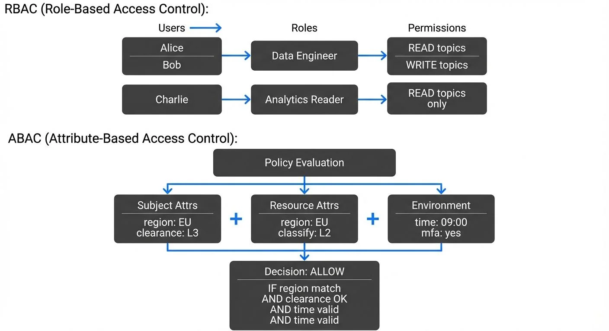

Access control is the cornerstone of data security, determining who can interact with your data and what actions they can perform. As organizations scale and data architectures become more complex—particularly with real-time streaming platforms—choosing the right access control model becomes critical. This article explores two fundamental approaches: Role-Based Access Control (RBAC) and Attribute-Based Access Control (ABAC), with practical examples for streaming data infrastructure.

Modern implementations leverage tools like Open Policy Agent (OPA), Keycloak, AWS Cedar, and cloud-native IAM systems to enforce these models at scale. For comprehensive Kafka-specific authorization patterns, see [Kafka ACLs and Authorization Patterns](https://conduktor.io/glossary/kafka-acls-and-authorization-patterns).

## Understanding RBAC: The Foundation

Role-Based Access Control assigns permissions based on organizational roles. Users inherit permissions through their assigned roles, creating a layer of abstraction between individuals and access rights.

### Core RBAC Concepts

In RBAC, you define three primary components:

1. **Roles**: Collections of permissions (e.g., "Data Engineer," "Analytics Reader")
2. **Permissions**: Specific actions on resources (e.g., "read topic," "write to consumer group")
3. **Users**: Individuals assigned to one or more roles

This model excels in organizations with clearly defined job functions and relatively stable access patterns.

### RBAC in Streaming Platforms

Consider a Kafka deployment. With Kafka 4.0+ and KRaft mode, authorization has evolved beyond simple ACLs to support pluggable authorizers and integration with enterprise identity providers. You might structure your RBAC model as follows:

```yaml
# Example RBAC configuration
roles:
  - name: streaming-producer
    permissions:
      - resource: topic
        pattern: "sales.*"
        operations: [WRITE, DESCRIBE]

  - name: streaming-consumer
    permissions:
      - resource: topic
        pattern: "sales.*"
        operations: [READ, DESCRIBE]
      - resource: consumer-group
        pattern: "analytics-*"
        operations: [READ]

  - name: platform-admin
    permissions:
      - resource: "*"
        pattern: "*"
        operations: [ALL]

users:
  - email: engineer@company.com
    roles: [streaming-producer]
  - email: analyst@company.com
    roles: [streaming-consumer]
```

In this configuration, a data engineer can write to sales topics but cannot read from them directly, while analysts can consume from these topics through designated consumer groups. This separation of concerns is fundamental to RBAC's security model.

**Modern Authorization Implementations (2025):**

- **Keycloak + OAuth2**: Integrate Kafka with Keycloak for centralized RBAC using OAuth2/OIDC tokens. Kafka clients authenticate with bearer tokens, and roles are extracted from token claims.
- **Cloud-native IAM**: AWS MSK supports IAM-based authentication where AWS IAM roles and policies define Kafka permissions. Azure Event Hubs similarly integrates with Azure AD RBAC.
- **OPA (Open Policy Agent)**: While traditionally used for ABAC, OPA can enforce RBAC policies through its Kafka authorizer plugin, centralizing policy management across your stack.

For authentication mechanisms that enable these authorization models, see [Kafka Authentication: SASL, SSL, OAuth](https://conduktor.io/glossary/kafka-authentication-sasl-ssl-oauth).

### RBAC Advantages

**Simplicity**: Easy to understand and implement. New employees can be quickly onboarded by assigning them to appropriate roles.

**Auditability**: Clear role assignments make compliance audits straightforward. You can easily answer "Who has access to customer PII?" by identifying users in relevant roles.

**Scalability**: Adding new users is simple—just assign existing roles. No need to configure individual permissions for each person.

### RBAC Limitations

RBAC struggles with fine-grained, context-sensitive requirements. What if a data engineer should only access production topics during business hours? What if analysts from the EMEA region shouldn't access US customer data? These scenarios require workarounds or additional layers, which is where ABAC excels.

## ABAC: Fine-Grained Control

Attribute-Based Access Control evaluates access decisions based on attributes of the user, resource, action, and environment. Instead of "Does this user have the 'data-engineer' role?" ABAC asks "Does this user's department, clearance level, location, and current time satisfy the policy for this resource?"

### ABAC Components

ABAC policies consider multiple attribute categories:

- **Subject attributes**: User department, security clearance, location, employment status
- **Resource attributes**: Data classification, owner, creation date, geographic origin
- **Action attributes**: Read, write, delete, modify schema
- **Environmental attributes**: Time of day, IP address, authentication strength, security context

### ABAC in Streaming Platforms

Modern data governance platforms enable ABAC policies for Kafka clusters. ABAC policies are typically written in specialized policy languages that evaluate conditions across attributes. The most common pattern uses a structure like:

- **subject.attribute**: Properties of the requesting user/service (e.g., `subject.region`, `subject.department`)
- **resource.attribute**: Properties of the data being accessed (e.g., `resource.data_region`, `resource.classification_level`)
- **environment.attribute**: Contextual factors (e.g., `environment.time`, `environment.ip_address`)
- **action**: The operation being requested (READ, WRITE, DELETE, etc.)

Here's a realistic example using a policy language similar to OPA or Cedar:

```yaml
# Example ABAC policy
policies:
  - name: regional-data-access
    description: Users can only access data from their region
    rule: |
      subject.region == resource.data_region &&
      subject.clearance >= resource.classification_level

  - name: business-hours-production
    description: Production writes restricted to business hours except for on-call
    rule: |
      (environment.time >= "09:00" && environment.time <= "17:00") ||
      subject.on_call_status == true
    effect: allow
    actions: [WRITE]
    resources:
      topics: ["production.*"]

  - name: pii-data-protection
    description: PII data requires additional authentication
    rule: |
      resource.contains_pii == true &&
      environment.mfa_authenticated == true &&
      subject.pii_training_completed == true
    effect: allow
    actions: [READ, WRITE]
    resources:
      topics: ["*.customer-data"]
```

In this ABAC model, access decisions are dynamic and contextual. An engineer might have access to a topic at 10 AM but not at 10 PM. A consumer application in the EU region can access EU customer topics but not US ones, regardless of the service account's other privileges.

**Real-World ABAC with Open Policy Agent (OPA):**

OPA has become the de facto standard for policy-based authorization in cloud-native environments. Here's how you'd implement the regional data access policy in OPA's Rego language for Kafka:

```rego
# OPA Rego policy for Kafka authorization
package kafka.authz

import future.keywords.if
import future.keywords.in

# Allow access if user region matches data region
allow if {
    input.operation.name == "Read"
    topic_region := topic_metadata[input.resource.name].region
    topic_region == input.principal.region
}

# Allow access if user has sufficient clearance
allow if {
    topic_classification := topic_metadata[input.resource.name].classification
    input.principal.clearance_level >= topic_classification
}

# Topic metadata (could be fetched from a data catalog)
topic_metadata := {
    "eu.customer-data": {
        "region": "eu",
        "classification": 3
    },
    "us.customer-data": {
        "region": "us",
        "classification": 3
    }
}
```

This Rego policy integrates with Kafka through an OPA authorizer plugin and evaluates in real-time as clients make requests. For data classification strategies that feed these policies, see [Data Classification and Tagging Strategies](https://conduktor.io/glossary/data-classification-and-tagging-strategies).

### ABAC Advantages

**Granularity**: Extremely fine-grained control based on any measurable attribute.

**Flexibility**: Policies adapt to changing contexts without modifying role assignments.

**Regulatory compliance**: Naturally aligns with data residency, privacy regulations (GDPR, CCPA), and classification-based security requirements.

**Dynamic adaptation**: Automatically responds to attribute changes. When an employee changes departments, their access automatically adjusts based on the new department attribute.

### ABAC Challenges

**Complexity**: Policy creation requires careful planning and testing. Unintended access denials can disrupt operations.

**Performance**: Evaluating complex policies in real-time can introduce latency, particularly in high-throughput streaming scenarios. OPA policy evaluation typically adds 1-10ms per request in well-optimized deployments, but complex policies with external data fetches can add 50-100ms+. For Kafka clusters handling 100,000+ messages/second, this overhead requires careful caching and policy optimization strategies.

**Debugging**: Troubleshooting "Why was I denied access?" becomes more complex when multiple attributes interact. Modern tools like OPA's decision logs and policy tracing help by showing which rules failed, but require additional infrastructure.

## Choosing Between RBAC and ABAC

The choice isn't always binary. Many organizations implement hybrid models.

Use **RBAC** when:
- Organizational roles clearly map to data access needs
- Access patterns are relatively static
- Simplicity and operational ease are priorities
- You're starting your access control journey

Use **ABAC** when:
- Regulatory requirements demand fine-grained, contextual controls
- Data classification levels require dynamic enforcement
- Multi-tenancy or regional data segregation is critical
- Environmental factors (time, location, authentication method) should influence access

Use **Both** when:
- RBAC provides the baseline (e.g., "data-engineer" role)
- ABAC adds contextual restrictions (e.g., "but only during business hours for production")

## Hybrid Implementation Approach

Modern streaming governance platforms provide both RBAC and ABAC capabilities. Conduktor Platform offers UI-driven access management that translates to underlying ACLs or policy engines. You can define roles for common access patterns while layering ABAC policies for specialized requirements:

```yaml
# Hybrid approach example
rbac:
  roles:
    - name: data-engineer
      base_permissions:
        - topics: [READ, WRITE, DESCRIBE]

abac:
  policies:
    - name: production-safeguard
      apply_to_roles: [data-engineer]
      conditions:
        - topic.environment == "production"
        - user.peer_review_approved == true OR user.on_call == true
```

This hybrid model gives engineers broad access to development and staging environments through RBAC, while ABAC gates production access with additional requirements.

**Related Access Control Concerns:**

- For audit trails of who accessed what, see [Audit Logging for Streaming Platforms](https://conduktor.io/glossary/audit-logging-for-streaming-platforms) and [Conduktor's audit logs](https://docs.conduktor.io/guide/conduktor-in-production/admin/audit-logs)
- For protecting sensitive data within allowed topics, see [Data Masking and Anonymization for Streaming](https://conduktor.io/glossary/data-masking-and-anonymization-for-streaming)
- For detecting and preventing PII exposure, see [PII Detection and Handling in Event Streams](https://conduktor.io/glossary/pii-detection-and-handling-in-event-streams)
- For encryption alongside access control, see [Encryption at Rest and in Transit for Kafka](https://conduktor.io/glossary/encryption-at-rest-and-in-transit-for-kafka)

## Conclusion

Both RBAC and ABAC serve critical roles in modern data access control. RBAC provides operational simplicity and clear administrative boundaries, while ABAC delivers the precision needed for complex, dynamic environments. As streaming data platforms become central to enterprise architecture, understanding these models—and knowing when to apply each—is essential for Security Engineers and Data Governance Officers.

In 2025, the access control landscape continues to evolve. Relationship-Based Access Control (ReBAC)—modeling access based on relationships between entities (e.g., "can access if user.manager == resource.owner")—is gaining traction for complex organizational hierarchies. Tools like Google Zanzibar, SpiceDB, and AWS Cedar are making these advanced models more accessible.

**Implementation Strategy:**
1. Start with RBAC for foundational access control using native Kafka ACLs or cloud IAM
2. Layer ABAC policies for compliance requirements (data residency, classification-based access)
3. Integrate with centralized identity providers (Keycloak, Azure AD, Okta) for authentication
4. Implement audit logging to track access decisions
5. Use policy-as-code approaches (OPA, Cedar) for version-controlled, testable access policies

For broader data governance frameworks that incorporate access control, see [Data Governance Framework: Roles and Responsibilities](https://conduktor.io/glossary/data-governance-framework-roles-and-responsibilities).

## Related Concepts

- [Access Control for Streaming](https://conduktor.io/glossary/access-control-for-streaming) - Practical implementation of RBAC and ABAC in Kafka and streaming platforms.
- [Kafka ACLs and Authorization Patterns](https://conduktor.io/glossary/kafka-acls-and-authorization-patterns) - How Kafka's native ACLs map to RBAC and ABAC models.
- [Policy Enforcement in Streaming](https://conduktor.io/glossary/policy-enforcement-in-streaming) - Automated enforcement of RBAC and ABAC policies using tools like OPA.

## Sources and References

**Standards and Research:**
- **NIST RBAC Standard**: NIST. (2004). "Role Based Access Control (RBAC) and Role Based Security" - [NIST RBAC Model](https://csrc.nist.gov/projects/role-based-access-control)
- **XACML Specification**: OASIS. (2013). "eXtensible Access Control Markup Language (XACML) Version 3.0" - [OASIS XACML Standard](http://docs.oasis-open.org/xacml/3.0/xacml-3.0-core-spec-os-en.html)
- **ABAC Guide**: NIST Special Publication 800-162. (2014). "Guide to Attribute Based Access Control (ABAC) Definition and Considerations" - [NIST SP 800-162](https://nvlpubs.nist.gov/nistpubs/SpecialPublications/NIST.SP.800-162.pdf)
- **Access Control Models**: Ferraiolo, D. F., et al. (2001). "Proposed NIST Standard for Role-Based Access Control" - ACM Transactions on Information and System Security
- **Modern Access Control**: Hu, V. C., et al. (2015). "Attribute-Based Access Control" - IEEE Computer Magazine, Vol. 48, No. 2

**Implementation Tools (2025):**
- **Apache Kafka Authorization**: [Kafka Security Documentation](https://kafka.apache.org/documentation/#security_authz) - ACLs and pluggable authorizers
- **Open Policy Agent (OPA)**: [OPA Kafka Authorization](https://www.openpolicyagent.org/docs/latest/kafka-authorization/) - Policy-based access control
- **AWS Cedar**: [Cedar Policy Language](https://www.cedarpolicy.com/) - Amazon's open-source authorization policy language
- **Keycloak**: [Keycloak Authorization Services](https://www.keycloak.org/docs/latest/authorization_services/) - OAuth2/OIDC with fine-grained authorization
- **Zanzibar**: Pang, R., et al. (2019). "Zanzibar: Google's Consistent, Global Authorization System" - USENIX ATC 2019
