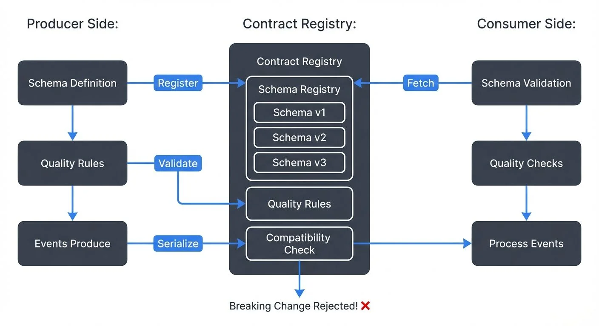

# Data Contracts for Reliable Pipelines

Data pipelines break when producers change data formats without warning consumers. A missing field, a type change from integer to string, or an unexpected null value can cascade through downstream systems, causing processing failures, incorrect analytics, and broken dashboards.

Data contracts formalize the agreement between data producers and consumers, defining not just the structure of data, but also its quality, semantics, and ownership. This article explores how data contracts work, why they matter for streaming pipelines, and how to implement them effectively.



<!-- ORIGINAL_DIAGRAM
```
┌──────────────────────────────────────────────────────────────────┐
│                Data Contract Enforcement Flow                    │
└──────────────────────────────────────────────────────────────────┘

Producer Side:              Contract Registry:        Consumer Side:
─────────────              ──────────────────        ──────────────

┌───────────┐              ┌───────────────┐        ┌───────────┐
│  Schema   │──────────────▶│   Schema      │◀───────│  Schema   │
│Definition │   Register   │   Registry    │ Fetch  │Validation │
└─────┬─────┘              │               │        └─────┬─────┘
      │                    │ ┌───────────┐ │              │
      │                    │ │ Schema v1 │ │              │
      ▼                    │ │ Schema v2 │ │              ▼
┌───────────┐              │ │ Schema v3 │ │        ┌───────────┐
│ Quality   │──────────────▶│ └───────────┘ │        │ Quality   │
│ Rules     │  Validate    │               │        │ Checks    │
└─────┬─────┘              │ ┌───────────┐ │        └─────┬─────┘
      │                    │ │ Quality   │ │              │
      │                    │ │ Rules     │ │              │
      ▼                    │ └───────────┘ │              ▼
┌───────────┐              │               │        ┌───────────┐
│  Events   │─────────────▶│ ┌───────────┐ │        │ Process   │
│ Produce   │  Serialize   │ │Compatibility│────────▶│  Events   │
└───────────┘              │ │ Check     │ │        └───────────┘
      │                    │ └───────────┘ │              │
      │                    └───────────────┘              │
      │                           │                       │
      └───────────────────────────┼───────────────────────┘
                                  ▼
                         Breaking Change
                         Rejected! ✗
```
-->

## What Are Data Contracts?

A data contract is a formal specification that defines:

**Schema**: The structure, field names, and data types
**Semantics**: What each field means and how it should be used
**Quality expectations**: Constraints like nullability, ranges, and uniqueness
**SLAs**: Timeliness, completeness, and availability guarantees
**Ownership**: Who produces the data and who to contact for changes

Unlike informal documentation that quickly becomes outdated, data contracts are enforced programmatically. They shift data quality left, catching breaking changes before they reach production pipelines.

Consider an e-commerce platform where the order service publishes events to Kafka. Without a contract, the service might change `order_total` from an integer (cents) to a float (dollars), breaking every downstream consumer that expects integer arithmetic. A data contract would flag this incompatible change during development.

## Core Components of a Data Contract

### Schema Definition

The foundation is a machine-readable schema. For streaming systems, this typically means Avro, Protobuf, or JSON Schema. For a detailed comparison of these formats, see [Avro vs Protobuf vs JSON Schema](https://conduktor.io/glossary/avro-vs-protobuf-vs-json-schema). These formats support:

- Primitive types (string, integer, boolean, etc.)
- Complex types (nested objects, arrays, maps)
- Optional vs. required fields
- Default values

Example Avro schema for an order event:

```json
{
  "type": "record",
  "name": "OrderCreated",
  "namespace": "com.example.orders",
  "fields": [
    {"name": "order_id", "type": "string"},
    {"name": "customer_id", "type": "string"},
    {"name": "order_total_cents", "type": "long"},
    {"name": "created_at", "type": "long", "logicalType": "timestamp-millis"},
    {"name": "currency", "type": "string", "default": "USD"}
  ]
}
```

### Quality Rules

Beyond structure, contracts specify constraints:

- `order_total_cents` must be positive
- `customer_id` must match UUID format
- `created_at` must be within the last 24 hours (detecting replay issues)
- Required fields cannot be null

These rules can be validated at write time (producer validation) or read time (consumer validation). For comprehensive coverage of quality dimensions, see [Data Quality Dimensions: Accuracy, Completeness, and Consistency](https://conduktor.io/glossary/data-quality-dimensions-accuracy-completeness-and-consistency).

### Compatibility Modes

Contracts define how schemas can evolve. Confluent Schema Registry supports multiple modes:

- **Backward compatibility**: New schema can read old data (safe to add optional fields with defaults)
  - Example: Adding `optional string payment_method = "credit_card"` works because old records will use the default
  - Most common mode for consumer-driven evolution

- **Forward compatibility**: Old schema can read new data (safe to remove optional fields)
  - Example: Removing an optional field that consumers ignore
  - Useful when producers evolve faster than consumers

- **Full compatibility**: Both backward and forward (most restrictive but safest)
  - Only optional field additions with defaults allowed
  - Recommended for critical business data with many consumers

- **None**: No compatibility checks (dangerous for production)
  - Use only for development or isolated topics with single consumer

### Ownership and Documentation

Contracts should specify:

- Team or service responsible for the data
- Contact information for questions
- Business meaning of fields
- Known limitations or edge cases

For enterprise-scale governance of data contracts, see [Data Governance Framework: Roles and Responsibilities](https://conduktor.io/glossary/data-governance-framework-roles-and-responsibilities).

## Data Contracts in Streaming Pipelines

Streaming systems like Apache Kafka and Apache Flink are prime candidates for data contracts. Unlike batch systems where you can inspect data after the fact, streaming pipelines process data continuously. A breaking change can corrupt state stores, trigger incorrect alerts, or cause cascading failures across multiple consumers.

### Schema Registry Integration

Schema Registry acts as the contract enforcement layer. For detailed implementation guidance, see [Schema Registry and Schema Management](https://conduktor.io/glossary/schema-registry-and-schema-management). When a Kafka producer serializes a message:

1. Producer checks if the schema is registered
2. If new, Schema Registry validates compatibility with previous versions
3. If compatible, schema is registered with a new version ID
4. Message includes schema ID in the payload
5. Consumer uses schema ID to deserialize correctly

This prevents incompatible changes from reaching Kafka topics. A producer attempting to publish an incompatible schema receives an immediate error.

### Stream Processing Validation

Flink and Kafka Streams applications can validate data against contracts at runtime. Modern implementations use side outputs to route invalid records to dead letter queues:

```java
// Flink 1.18+ example: validate order events with dead letter queue
OutputTag<Order> invalidOrders = new OutputTag<Order>("invalid-orders"){};

SingleOutputStreamOperator<Order> validOrders = env
    .addSource(new FlinkKafkaConsumer<>("orders",
        ConfluentRegistryAvroDeserializationSchema.forSpecific(Order.class, schemaRegistryUrl),
        properties))
    .process(new ProcessFunction<Order, Order>() {
        @Override
        public void processElement(Order order, Context ctx, Collector<Order> out) {
            // Validate quality rules
            if (order.getOrderTotal() <= 0) {
                ctx.output(invalidOrders, order);  // Route to DLQ
                return;
            }
            if (order.getCustomerId() == null || order.getCustomerId().isEmpty()) {
                ctx.output(invalidOrders, order);
                return;
            }
            out.collect(order);  // Valid record
        }
    });

// Route invalid records to dead letter topic
validOrders.getSideOutput(invalidOrders)
    .addSink(new FlinkKafkaProducer<>("orders-dlq", ...));
```

This pattern prevents pipeline crashes while preserving invalid data for investigation. For detailed error handling patterns, see [Dead Letter Queues for Error Handling](https://conduktor.io/glossary/dead-letter-queues-for-error-handling).

### Multi-Consumer Coordination

Streaming topics often have many consumers: analytics databases, machine learning pipelines, microservices, monitoring systems. Each consumer depends on the contract.

When a producer needs to make a breaking change, the contract provides a coordination mechanism:

1. Propose the new schema version
2. Identify all consumers (via contract metadata)
3. Coordinate migration timeline
4. Deploy backward-compatible intermediate version if possible
5. Migrate consumers before removing old fields

Without contracts, this coordination happens ad-hoc through incidents and debugging sessions.

## Implementing Data Contracts

### Choose a Schema Format

For streaming systems, Avro offers the best balance of performance, tooling, and schema evolution support. Protobuf is popular in polyglot environments. JSON Schema works for less performance-critical applications.

Beyond schema formats, modern data contract platforms provide comprehensive contract management:

**Schema-First Approach (2025):**
- **Confluent Schema Registry + Schema Linking**: Manages schemas across multiple Kafka clusters with bi-directional replication
- **Open Data Contract Standard (ODCS)**: YAML-based specification defining schemas, quality rules, SLAs, and ownership in one document
- **Bitol**: Data contract specification language with built-in validation and code generation

**Data Quality Platforms (2025):**
- **Soda Core**: Open-source framework for defining data quality checks as code, integrates with streaming pipelines
- **Great Expectations**: Provides expectations (assertions) on data, with Kafka integration via custom data sources
- **Monte Carlo**: Data observability platform with ML-driven anomaly detection for contract violations
- **Atlan**: Data catalog with contract enforcement and lineage tracking across streaming and batch systems

These tools shift from pure schema validation to comprehensive data quality contracts covering completeness, freshness, distribution, and custom business rules. For practical implementation patterns, see [Building a Data Quality Framework](https://conduktor.io/glossary/building-a-data-quality-framework).

### Establish Governance Process

Define who can change schemas, how changes are reviewed, and what compatibility modes are required for different data tiers:

- Critical business data: Full compatibility
- Internal service communication: Backward compatibility
- Experimental features: No compatibility guarantees

### Automate Validation

Integrate schema validation into CI/CD pipelines:

```bash
# Confluent Schema Registry: validate compatibility before deployment
curl -X POST http://localhost:8081/compatibility/subjects/orders-value/versions/latest \
  -H "Content-Type: application/vnd.schemaregistry.v1+json" \
  -d @order_created.avsc

# Or using Confluent CLI (requires Confluent Platform or Cloud)
confluent schema-registry schema create --subject orders-value \
  --schema order_created.avsc \
  --compatibility BACKWARD
```

### Monitor Contract Violations

Track metrics on:

- Schema validation failures
- Deserialization errors
- Quality rule violations
- Consumer lag spikes (often caused by malformed data)

For comprehensive monitoring approaches, see [What is Data Observability: The Five Pillars](https://conduktor.io/glossary/what-is-data-observability-the-five-pillars).

Modern schema management platforms provide visibility into schema usage across Kafka clusters:

- **Confluent Schema Registry**: The industry standard, provides REST API for schema storage, compatibility checking, and version management
- **Karapace**: Open-source alternative compatible with Confluent's API, popular for self-hosted deployments
- **AWS Glue Schema Registry**: Native AWS integration with automatic schema discovery and evolution tracking
- **Apicurio Registry**: Open-source registry supporting multiple formats (Avro, Protobuf, JSON Schema) with role-based access control

These platforms show which consumers use which schema versions, enabling coordinated migrations before breaking changes. They support data quality rules that validate message contents against business logic, catching issues like negative order totals or invalid email formats. For implementing data quality enforcement with Conduktor, see [Data Quality Policies](https://docs.conduktor.io/guide/conduktor-concepts/data-quality-policies) and [Enforcing Data Quality](https://docs.conduktor.io/guide/use-cases/enforce-data-quality).

## Benefits and Challenges

### Benefits

**Prevents production incidents**: Breaking changes are caught before deployment
**Enables self-service**: Consumers can discover and trust data without direct producer coordination
**Documents data semantics**: Schema serves as living documentation
**Supports compliance**: Contracts can enforce PII handling, retention policies, and data classification

### Challenges

**Organizational change**: Requires buy-in from producers who may see contracts as overhead
**Initial setup cost**: Defining schemas for existing data can be time-consuming
**Evolution complexity**: Managing compatibility across dozens of consumers requires coordination
**Performance overhead**: Schema validation adds latency (typically <1ms, but matters for high-throughput systems)

## Best Practices

**Start with critical data**: Implement contracts for your most important topics first
**Make schemas discoverable**: Use a schema registry UI or catalog to browse available data
**Version everything**: Even if you think a field will never change, version it
**Test compatibility**: Include schema compatibility tests in your CI pipeline
**Document semantics, not just structure**: Explain what `order_total_cents` means, don't just specify it's a long
**Plan for evolution**: Design schemas with optional fields and defaults to enable backward-compatible additions. See [Schema Evolution Best Practices](https://conduktor.io/glossary/schema-evolution-best-practices) for detailed guidance
**Establish clear ownership**: Every schema should have a responsible team

## Summary

Data contracts transform data pipelines from fragile, undocumented systems into reliable, self-service platforms. By formalizing agreements between producers and consumers, contracts prevent breaking changes, enable safe schema evolution, and provide living documentation.

For streaming pipelines built on Kafka, Flink, and similar technologies, contracts are particularly valuable. The continuous nature of streaming means errors cascade quickly, and the multi-consumer pattern means changes affect many systems simultaneously.

Implementing data contracts requires organizational commitment and tooling investment, but the payoff is substantial: fewer production incidents, faster development cycles, and greater trust in data across the organization.

## Related Concepts

- [Schema Registry and Schema Management](https://conduktor.io/glossary/schema-registry-and-schema-management) - Core infrastructure for enforcing data contracts
- [Data Quality Dimensions: Accuracy, Completeness, and Consistency](https://conduktor.io/glossary/data-quality-dimensions-accuracy-completeness-and-consistency) - Quality expectations defined in contracts
- [Building a Data Quality Framework](https://conduktor.io/glossary/building-a-data-quality-framework) - Systematic approach to contract validation

## Sources and References

1. Chad Sanderson - "Data Contracts: The Foundation of Data Mesh" - https://dataproducts.substack.com/
2. Confluent Documentation - "Schema Registry Overview" - https://docs.confluent.io/platform/current/schema-registry/
3. Andrew Jones - "Designing Data Contracts" - https://www.datamesh-architecture.com/
4. Gwen Shapira - "Kafka: The Definitive Guide" (O'Reilly) - Schema management and compatibility
5. Martin Kleppmann - "Designing Data-Intensive Applications" (O'Reilly) - Schema evolution and data modeling
