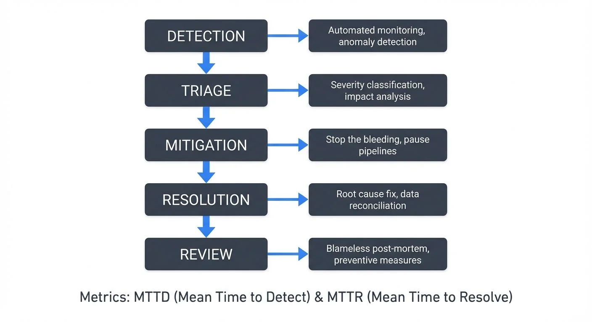

Data incidents are inevitable in modern data platforms. Whether you're managing batch pipelines, real-time streaming systems, or hybrid architectures, understanding how to effectively respond to incidents and perform thorough root cause analysis is critical for maintaining data reliability and stakeholder trust.

<!-- ORIGINAL_DIAGRAM
```
┌─────────────────────────────────────────────────────────────────┐
│              INCIDENT RESPONSE LIFECYCLE                        │
└─────────────────────────────────────────────────────────────────┘

    ┌─────────────┐
    │  DETECTION  │  ← Automated monitoring, anomaly detection
    └──────┬──────┘
           │
           ▼
    ┌─────────────┐
    │   TRIAGE    │  ← Severity classification, impact analysis
    └──────┬──────┘
           │
           ▼
    ┌─────────────┐
    │ MITIGATION  │  ← Stop the bleeding, pause pipelines
    └──────┬──────┘
           │
           ▼
    ┌─────────────┐
    │ RESOLUTION  │  ← Root cause fix, data reconciliation
    └──────┬──────┘
           │
           ▼
    ┌─────────────┐
    │   REVIEW    │  ← Blameless post-mortem, preventive measures
    └─────────────┘

         Metrics: MTTD (Mean Time to Detect) & MTTR (Mean Time to Resolve)
```
-->

## Understanding Data Incidents

A data incident occurs when data quality, availability, or timeliness deviates from expected standards, impacting downstream consumers. Unlike application incidents that might affect user experience immediately, data incidents can be insidious—cascading through pipelines, corrupting analytics, and undermining business decisions before anyone notices.

Common incident types include:

- **Data Quality Issues**: Schema drift, null values, duplicates, or invalid data types
- **Pipeline Failures**: Job crashes, resource exhaustion, or dependency failures
- **Latency Problems**: Service Level Agreement (SLA) breaches, backpressure in streaming systems, or batch delays
- **Data Loss**: Missing partitions, incomplete ingestion, or failed writes
- **Schema Conflicts**: Breaking changes in upstream systems or incompatible transformations

## The Incident Response Lifecycle

Effective incident management follows a structured lifecycle that minimizes Mean Time to Resolution (MTTR—the average time it takes to resolve an incident) while preventing recurrence.

### 1. Detection and Alerting

The first step is knowing an incident occurred. Modern data platforms should implement multi-layered monitoring:

**Data Quality Monitoring**: Automated checks on row counts, schema validation, null rates, and business logic constraints. Modern tools like Great Expectations 1.0+, Soda Core 3.x, and dbt tests validate both technical correctness and business expectations. For detailed coverage of data quality frameworks, see [Data Quality Dimensions: Accuracy, Completeness, and Consistency](https://conduktor.io/glossary/data-quality-dimensions-accuracy-completeness-and-consistency).

**Freshness Monitoring**: Track when data was last updated. For streaming systems like Apache Kafka 4.0+ (now running KRaft mode without ZooKeeper), monitor consumer lag across topics using tools like Kafka Lag Exporter, Burrow, or Confluent Control Center to identify when processing falls behind production. For more on monitoring strategies, see [Kafka Cluster Monitoring and Metrics](https://conduktor.io/glossary/kafka-cluster-monitoring-and-metrics).

**Pipeline Health**: Monitor job execution status, resource utilization, and dependency chains. Modern incident management platforms like Datadog Incident Management, PagerDuty Incident Workflows with AIOps, and Grafana IRM (Incident Response Management) provide unified visibility across data pipelines. Failed jobs should trigger immediate alerts with context about the failure point.

**Anomaly Detection**: Statistical methods and machine learning models to identify unusual patterns that might not trigger rule-based alerts but indicate emerging problems. Cloud-native observability platforms (AWS CloudWatch Anomaly Detection, Azure Monitor, GCP Operations Suite) and data observability tools (Monte Carlo, Soda Core) provide automated anomaly detection for data metrics.

### 2. Triage and Assessment

When an alert fires, rapid triage determines incident severity and guides response:

**Impact Analysis**: Identify affected datasets, downstream dependencies, and business processes. Understanding the blast radius (the scope of systems and users affected by the incident) helps prioritize response efforts.

**Severity Classification**: Not all incidents are equal. Classify based on:
- Business impact (revenue, compliance, critical reports)
- Affected user count
- Data recoverability
- Time sensitivity

**Initial Investigation**: Quickly gather context—recent deployments, configuration changes, upstream system status, and error logs. For streaming platforms, check broker health, partition assignments, and consumer group states.

### 3. Mitigation and Resolution

The goal is restoring service while minimizing additional damage:

**Immediate Mitigation**: Stop the bleeding. This might mean pausing pipelines, rolling back deployments, or switching to backup data sources. In Kafka environments, you might need to reset consumer offsets or pause specific consumers to prevent poison messages (corrupted or malformed messages that cause consumer crashes) from blocking processing. For error handling patterns, see [Dead Letter Queues for Error Handling](https://conduktor.io/glossary/dead-letter-queues-for-error-handling).

**Root Cause Investigation**: While mitigating, begin deeper investigation. Streaming systems add complexity—issues might stem from broker configuration, partition rebalancing (redistribution of topic partitions across consumers), message serialization, or consumer processing logic. Modern observability approaches using OpenTelemetry and distributed tracing help examine topic configurations, consumer group assignments, and message contents, accelerating diagnosis. For advanced debugging techniques, see [Distributed Tracing for Kafka Applications](https://conduktor.io/glossary/distributed-tracing-for-kafka-applications).

**Fix Implementation**: Apply the fix with appropriate testing. For streaming systems, consider:
- Will the fix handle backlog replay correctly?
- Are there ordering guarantees to maintain?
- Will processing the backlog cause downstream issues?

**Data Reconciliation**: Determine if reprocessing is needed. Streaming architectures often provide natural reprocessing mechanisms through offset management, but care must be taken with exactly-once semantics (guaranteeing each message is processed exactly one time, never duplicated or lost) and idempotent consumers (consumers that produce the same result even if they process the same message multiple times).

## Root Cause Analysis: Going Deeper

Resolving an incident is only half the battle. Root cause analysis prevents recurrence and drives systematic improvement.

### The Five Whys Technique

Start with the observed symptom and ask "why" repeatedly until reaching the fundamental cause:

**Example**:
1. Why did the dashboard show incorrect metrics? → Pipeline produced wrong aggregations
2. Why were aggregations wrong? → Duplicate events in the source topic
3. Why were there duplicates? → Producer retry logic without idempotent settings
4. Why wasn't idempotence configured? → Default producer configuration was used
5. Why were defaults used? → No standardized producer configuration template

The root cause isn't the duplicates—it's the lack of standardized configuration management.

**Code Example - Configuring Idempotent Kafka Producer (Kafka 3.0+)**:
```java
Properties props = new Properties();
props.put("bootstrap.servers", "localhost:9092");
props.put("key.serializer", "org.apache.kafka.common.serialization.StringSerializer");
props.put("value.serializer", "org.apache.kafka.common.serialization.StringSerializer");

// Enable idempotence to prevent duplicates
props.put("enable.idempotence", "true");
props.put("acks", "all"); // Required for idempotence
props.put("retries", Integer.MAX_VALUE); // Safe with idempotence
props.put("max.in.flight.requests.per.connection", "5"); // Kafka 3.0+ allows up to 5

KafkaProducer<String, String> producer = new KafkaProducer<>(props);
```

### Contributing Factor Analysis

Complex systems rarely fail from a single cause. Identify contributing factors:

- **Technical Factors**: Schema evolution without compatibility checks, insufficient resources, missing backpressure handling
- **Process Factors**: Lack of deployment validation, insufficient testing, unclear ownership
- **Organizational Factors**: Siloed teams, unclear escalation paths, inadequate documentation

For streaming systems, consider:
- Producer configurations (acks, retries, idempotence)
- Broker settings (retention, replication, partitioning)
- Consumer patterns (offset management, rebalancing strategies)
- Network reliability and partition leadership
- KRaft mode configurations (Kafka 4.0+ replaces ZooKeeper with internal consensus)

**Code Example - Monitoring Consumer Lag (Kafka 4.0+)**:
```bash
# Check consumer lag using kafka-consumer-groups command
kafka-consumer-groups.sh --bootstrap-server localhost:9092 \
  --describe --group my-consumer-group

# Output shows lag per partition:
# GROUP           TOPIC      PARTITION  CURRENT-OFFSET  LOG-END-OFFSET  LAG
# my-consumer-group events    0          1500            2000            500
# my-consumer-group events    1          1800            1800            0

# For programmatic monitoring, use Kafka Lag Exporter or AdminClient API
```

### Preventive Measures

Root cause analysis should produce actionable improvements:

**Automated Safeguards**: Implement schema validation, data quality gates, and compatibility checks. Kafka Schema Registry with compatibility enforcement prevents many schema-related incidents. Modern data quality tools like Great Expectations 1.0+ can run as pipeline gates, blocking bad data before it propagates.

**Improved Monitoring**: Add specific checks targeting the incident class. If consumer lag caused the issue, implement granular lag monitoring with appropriate thresholds using Kafka Lag Exporter or Burrow. Shift from threshold-based alerting to SLO-based alerting (Service Level Objectives) for more context-aware incident detection.

**Documentation and Runbooks**: Capture incident response procedures, architecture decisions, and configuration standards. This organizational memory prevents repeated mistakes. Modern incident management platforms like PagerDuty and Grafana IRM integrate runbooks directly into alert workflows.

**Testing Enhancement**: Add regression tests, chaos engineering experiments, or failure injection to validate resilience. Test how your streaming system handles broker failures, network partitions, or poison messages. Tools like Chaos Mesh and Litmus help inject failures into Kafka clusters to validate recovery procedures. For more on proactive testing, see [Chaos Engineering for Streaming Systems](https://conduktor.io/glossary/chaos-engineering-for-streaming-systems).

## Modern Observability and Incident Management (2025)

The shift toward observability-driven incident management emphasizes understanding system behavior through metrics, logs, and traces rather than just reacting to alerts.

**OpenTelemetry Adoption**: The industry standard for instrumentation now enables unified observability across data pipelines. OpenTelemetry provides automatic instrumentation for Kafka clients, stream processors, and data applications, creating end-to-end visibility from producers to consumers.

**SLO-Based Alerting**: Instead of arbitrary thresholds (e.g., "alert if lag > 1000"), define Service Level Objectives based on business impact (e.g., "99.9% of messages processed within 5 minutes"). This reduces alert fatigue and focuses on what matters.

**AI-Powered Incident Management**: Modern platforms like PagerDuty AIOps, Datadog Watchdog, and Grafana Machine Learning analyze historical incident patterns to predict issues, suggest root causes, and automate routine responses.

**Data Observability Platforms**: Purpose-built tools like Monte Carlo, Soda Core 3.x, and Elementary Data provide data-specific observability—tracking data quality, freshness, volume, and schema changes automatically. These complement traditional infrastructure monitoring.

## Best Practices for Data Platform Teams

**Establish Clear Ownership**: Every dataset and pipeline should have defined owners responsible for monitoring, incident response, and maintenance. Data mesh principles emphasize domain ownership with clear accountability.

**Implement Incident Review Processes**: Post-incident reviews should be blameless, focused on systemic improvement rather than individual mistakes. Document findings in a searchable incident database accessible to all teams.

**Build Observability In**: Design systems with debugging in mind. Comprehensive logging, distributed tracing (using OpenTelemetry), and metadata tracking enable faster diagnosis. Instrument custom metrics for business-specific KPIs, not just infrastructure metrics.

**Automate Recovery**: Where possible, implement self-healing mechanisms—automatic retries with exponential backoff, dead letter queues for poison messages, and circuit breakers for failing dependencies. For streaming error patterns, see [Dead Letter Queues for Error Handling](https://conduktor.io/glossary/dead-letter-queues-for-error-handling).

**Maintain Communication Channels**: During incidents, clear communication with stakeholders prevents panic and sets appropriate expectations. Modern incident management platforms integrate with Slack, Microsoft Teams, and status page tools for automated stakeholder updates.

**Practice Chaos Engineering**: Regularly test your incident response capabilities through controlled failure injection. Validate that your monitoring detects issues, alerts fire appropriately, and recovery procedures work as documented.

## Conclusion

Effective incident management and root cause analysis are essential competencies for data and platform engineering teams. By implementing structured detection, response, and learning processes, teams can minimize MTTR, prevent incident recurrence, and build more resilient data platforms.

The modern approach combines traditional incident response with observability-driven practices, AI-powered insights, and proactive chaos engineering. Tools like OpenTelemetry, Kafka Lag Exporter, Great Expectations 1.0+, and purpose-built data observability platforms provide unprecedented visibility into data system behavior.

The goal isn't eliminating all incidents—that's unrealistic in complex distributed systems. Instead, focus on rapid detection through comprehensive monitoring, efficient response using modern incident management platforms, thorough analysis with the Five Whys technique, and continuous improvement through automated testing and chaos engineering. Over time, this approach builds both technical reliability and organizational capability, transforming how your team handles the inevitable challenges of production data systems.

## Related Concepts

- [Consumer Lag Monitoring](https://conduktor.io/glossary/consumer-lag-monitoring) - Detecting streaming pipeline incidents through lag metrics
- [Apache Kafka](https://conduktor.io/glossary/apache-kafka) - Platform requiring specialized incident response strategies
- [Exactly-Once Semantics in Kafka](https://conduktor.io/glossary/exactly-once-semantics-in-kafka) - Processing guarantees that prevent duplicate-related incidents

## Related Topics

- [Data Quality Dimensions: Accuracy, Completeness, and Consistency](https://conduktor.io/glossary/data-quality-dimensions-accuracy-completeness-and-consistency) - Understanding data quality metrics for incident detection
- [Kafka Cluster Monitoring and Metrics](https://conduktor.io/glossary/kafka-cluster-monitoring-and-metrics) - Comprehensive Kafka monitoring strategies
- [Dead Letter Queues for Error Handling](https://conduktor.io/glossary/dead-letter-queues-for-error-handling) - Patterns for handling failed messages
- [Distributed Tracing for Kafka Applications](https://conduktor.io/glossary/distributed-tracing-for-kafka-applications) - End-to-end visibility in streaming systems
- [Chaos Engineering for Streaming Systems](https://conduktor.io/glossary/chaos-engineering-for-streaming-systems) - Proactive resilience testing
- [Data Quality Incidents](https://conduktor.io/glossary/data-quality-incidents) - Specific incident patterns in data quality

## Sources

1. Google SRE Book - "Managing Incidents" - https://sre.google/sre-book/managing-incidents/
2. Atlassian - "Incident Management for High-Velocity Teams" - https://www.atlassian.com/incident-management
3. PagerDuty - "Incident Response Documentation and Postmortems" - https://response.pagerduty.com/
4. Apache Kafka Documentation - "Operations and Monitoring" (Kafka 4.0+) - https://kafka.apache.org/documentation/#operations
5. AWS - "Building a Data Quality Framework" - https://aws.amazon.com/blogs/big-data/build-a-data-quality-framework/
6. OpenTelemetry Documentation - "Getting Started" - https://opentelemetry.io/docs/
7. Kafka Lag Exporter - GitHub Repository - https://github.com/seglo/kafka-lag-exporter
8. Monte Carlo Data Observability - Documentation - https://docs.getmontecarlo.com/
9. Soda Core 3.x - "Data Quality Monitoring" - https://docs.soda.io/
10. Grafana IRM - "Incident Response Management" - https://grafana.com/products/cloud/irm/
