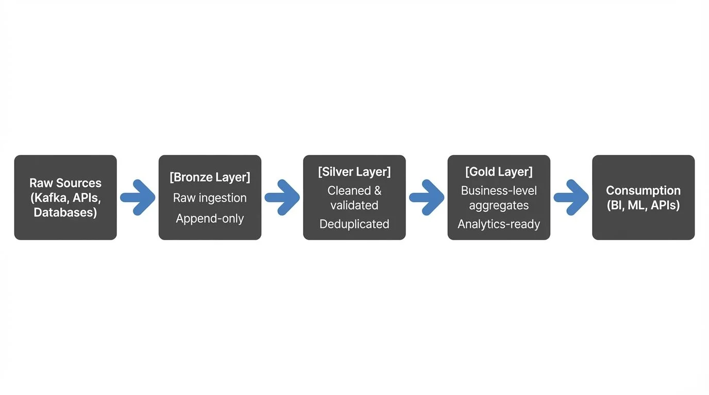
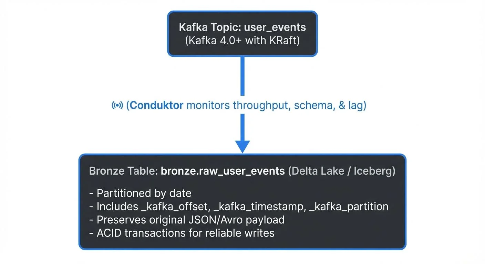
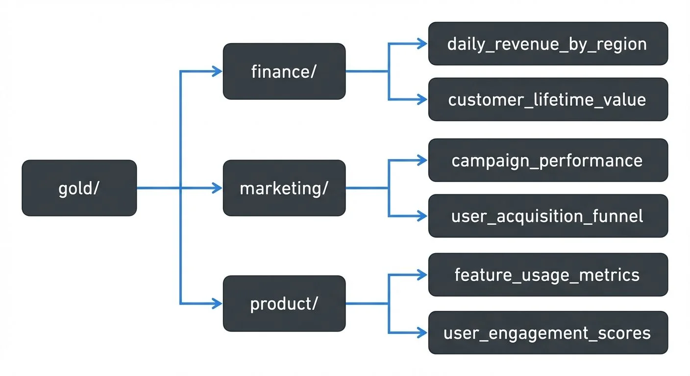

The Medallion Architecture, also known as the Bronze-Silver-Gold pattern, has become the de facto standard for organizing data lakes in modern data platforms. This multi-layered approach provides a clear framework for progressive data refinement, enabling data teams to balance raw data preservation with the need for high-quality, analytics-ready datasets.

## Understanding the Medallion Architecture

The Medallion Architecture divides your data lake into three distinct zones, each serving a specific purpose in the data pipeline:

This layered approach ensures data lineage traceability while providing different consumption patterns for various use cases.

## Bronze Layer: The Foundation of Truth

The Bronze layer serves as your raw data landing zone. Here, data arrives in its most pristine form, exactly as it exists at the source. This layer operates on a fundamental principle: **preserve everything, transform nothing**.

### Key Characteristics

- **Append-only architecture**: Data is never deleted or modified, ensuring complete historical records
- **Schema-on-read**: Data is stored in flexible formats (JSON, Avro, Parquet) without strict schema validation at write time. Schema is applied when reading/querying, allowing you to adapt to source changes without breaking ingestion
- **Full fidelity**: Captures all source data, including metadata like ingestion timestamps, source system identifiers, and Kafka offsets
- **Partitioning**: Typically organized by ingestion date (e.g., `date=2025-01-15`) for efficient time-based querying and data retention

### Streaming Integration

For real-time data pipelines, the Bronze layer excels at consuming streaming data. Apache Kafka topics feed directly into Bronze tables, often using formats like JSON or Avro that preserve the source structure.

Modern Kafka platforms like **Conduktor** provide essential visibility into streaming data flows, helping teams manage topics, monitor consumer lag, validate schemas, and track data quality metrics as events flow into the Bronze layer. See [Conduktor's topic management](https://docs.conduktor.io/guide/manage-kafka/kafka-resources/topics) and [Schema Registry integration](https://docs.conduktor.io/guide/manage-kafka/kafka-resources/schema-registry) for comprehensive streaming governance. This operational insight ensures that your Bronze ingestion pipeline remains healthy and performant.

### Implementation Pattern

```sql
-- Bronze layer typically stores data with minimal transformation
-- Using Delta Lake (2025)
CREATE TABLE bronze.raw_transactions (
    raw_data STRING,
    source_system STRING,
    ingestion_timestamp TIMESTAMP,
    date_partition DATE
)
USING DELTA
PARTITIONED BY (date_partition)
TBLPROPERTIES (
    'delta.enableChangeDataFeed' = 'true',  -- Enable CDC for downstream processing
    'delta.autoOptimize.optimizeWrite' = 'true'  -- Automatic file sizing
);
```

For more details on modern table formats, see [Apache Iceberg](https://conduktor.io/glossary/apache-iceberg) and [Delta Lake Transaction Log](https://conduktor.io/glossary/delta-lake-transaction-log-how-it-works).

## Silver Layer: Cleaned and Conformed

The Silver layer represents your cleaned, validated, and standardized data. This is where data engineering rigor comes into play, transforming raw data into a reliable foundation for analytics.

### Key Characteristics

- **Data quality enforcement**: Invalid records are filtered or corrected using validation rules
- **Schema standardization**: Consistent data types and column names across sources
- **Deduplication**: Removes duplicate records based on business keys
- **Change data capture (CDC)**: Efficiently tracks and processes only changed/new records from Bronze, reducing processing costs. For detailed CDC patterns, see [What is Change Data Capture](https://conduktor.io/glossary/what-is-change-data-capture-cdc-fundamentals)
- **PII handling**: Sensitive data is masked, encrypted, or tokenized for compliance

### Transformation Logic

The Bronze-to-Silver transformation applies business rules while maintaining data integrity:

```sql
-- Silver layer transformation example (Spark SQL / Delta Lake)
CREATE TABLE silver.transactions AS
WITH parsed_data AS (
    SELECT
        CAST(get_json_object(raw_data, '$.transaction_id') AS BIGINT) AS transaction_id,
        CAST(get_json_object(raw_data, '$.amount') AS DECIMAL(10,2)) AS amount,
        CAST(get_json_object(raw_data, '$.currency') AS STRING) AS currency,
        to_timestamp(get_json_object(raw_data, '$.timestamp')) AS transaction_timestamp,
        current_timestamp() AS processed_at,
        ingestion_timestamp,
        -- Add row number for deduplication
        ROW_NUMBER() OVER (PARTITION BY get_json_object(raw_data, '$.transaction_id')
                          ORDER BY ingestion_timestamp DESC) AS row_num
    FROM bronze.raw_transactions
    WHERE get_json_object(raw_data, '$.transaction_id') IS NOT NULL  -- Data quality filter
        AND CAST(get_json_object(raw_data, '$.amount') AS DECIMAL(10,2)) > 0  -- Business rule
)
SELECT
    transaction_id,
    amount,
    currency,
    transaction_timestamp,
    processed_at
FROM parsed_data
WHERE row_num = 1;  -- Keep only the most recent record per transaction_id
```

### Streaming in Silver

For streaming architectures, the Silver layer often implements **incremental processing**. Modern streaming engines consume from Bronze and write to Silver in near real-time:

- **Apache Spark Structured Streaming** (3.5+): Processes micro-batches with Delta Lake's merge operations
- **Apache Flink** (1.18+): True streaming with exactly-once semantics and state management
- **dbt** (1.7+): Incremental models for batch transformations with SQL

Schema registry integration (Confluent Schema Registry or AWS Glue Schema Registry) ensures that as schemas evolve in Kafka topics, your Silver layer transformations can adapt accordingly, preventing breaking changes from propagating downstream. For more on schema management, see [Schema Registry and Schema Management](https://conduktor.io/glossary/schema-registry-and-schema-management).

## Gold Layer: Business Value

The Gold layer contains curated, business-level datasets optimized for specific consumption patterns. This is where data becomes actionable, powering dashboards, reports, and machine learning models.

### Key Characteristics

- **Aggregated metrics**: Pre-calculated KPIs and business metrics for fast dashboard queries
- **Denormalized structures**: Optimized for query performance with pre-joined data
- **Slowly Changing Dimensions (SCD Type 2)**: Tracks historical changes by maintaining multiple versions of dimension records with effective dates
- **Feature stores**: ML-ready feature sets for machine learning models
- **Dimensional modeling**: Star or snowflake schemas optimized for BI tools like Tableau and Power BI

### Business-Driven Design

Unlike Bronze and Silver, which are technical layers, Gold is organized around business domains:

### Example Gold Table

```sql
-- Gold layer: Business-ready aggregate
CREATE TABLE gold.daily_revenue_summary AS
SELECT
    DATE(transaction_timestamp) AS revenue_date,
    currency,
    country_code,
    COUNT(DISTINCT customer_id) AS unique_customers,
    COUNT(transaction_id) AS transaction_count,
    SUM(amount) AS total_revenue,
    AVG(amount) AS avg_transaction_value,
    PERCENTILE(amount, 0.5) AS median_transaction_value
FROM silver.transactions
WHERE transaction_status = 'completed'
GROUP BY DATE(transaction_timestamp), currency, country_code;
```

## Modern Table Formats (2025)

The Medallion Architecture is typically implemented using modern **lakehouse table formats** that provide ACID transactions, schema evolution, and time travel capabilities:

### Delta Lake

Delta Lake is the most widely adopted format, offering:
- **ACID transactions** for reliable concurrent writes
- **Time travel** to query historical versions of data
- **Liquid Clustering** (2025): Replaces traditional partitioning with adaptive, multi-dimensional clustering for better query performance. See [Delta Lake Liquid Clustering](https://conduktor.io/glossary/delta-lake-liquid-clustering-modern-partitioning)
- **Deletion Vectors** (2025): Efficient row-level deletes without rewriting entire files. See [Delta Lake Deletion Vectors](https://conduktor.io/glossary/delta-lake-deletion-vectors-efficient-row-level-deletes)
- **Change Data Feed**: Native CDC support for incremental processing

### Apache Iceberg

Apache Iceberg provides enterprise-grade features:
- **Hidden partitioning**: No partition columns needed in queries
- **Partition evolution**: Change partitioning schemes without rewriting data
- **Multi-catalog support**: Works with Hive, Glue, Nessie, and Unity Catalog
- **Metadata management**: Efficient snapshot management and metadata pruning

For comprehensive coverage, see [Introduction to Lakehouse Architecture](https://conduktor.io/glossary/introduction-to-lakehouse-architecture) and [Streaming Ingestion to Lakehouse](https://conduktor.io/glossary/streaming-ingestion-to-lakehouse).

### Implementation Example

```sql
-- Modern Bronze table with Delta Lake (2025)
CREATE TABLE bronze.raw_events
USING DELTA
TBLPROPERTIES (
    'delta.enableChangeDataFeed' = 'true',
    'delta.autoOptimize.optimizeWrite' = 'true',
    'delta.autoOptimize.autoCompact' = 'true'
)
AS SELECT * FROM stream_source;

-- Silver table with Liquid Clustering
CREATE TABLE silver.events
USING DELTA
CLUSTER BY (event_type, date);  -- Adaptive clustering replaces static partitions
```

## Architecture Benefits

### 1. Separation of Concerns
Each layer has a distinct responsibility, making the data pipeline easier to understand, maintain, and troubleshoot.

### 2. Incremental Development
Teams can iterate on Silver and Gold transformations without re-ingesting raw data, as Bronze preserves the complete history.

### 3. Data Quality Gates
Issues caught at Silver prevent bad data from reaching production analytics in Gold, protecting decision-making processes.

### 4. Performance Optimization
By progressively refining data, queries against Gold tables execute faster than querying raw Bronze data directly.

### 5. Regulatory Compliance
The immutable Bronze layer provides an audit trail, while Silver and Gold can implement data retention policies and privacy controls.

## Best Practices

**Idempotency**: Ensure all transformations can be safely re-run without creating duplicates or inconsistencies. Use merge operations (MERGE INTO in SQL) rather than INSERT to handle updates gracefully.

**Incremental Processing**: Process only new or changed data between layers to minimize compute costs. Delta Lake's Change Data Feed and Iceberg's incremental scan make this efficient. See [Streaming to Lakehouse Tables](https://conduktor.io/glossary/streaming-to-lakehouse-tables).

**Data Lineage**: Maintain metadata about data transformations to track how Gold metrics are derived from raw sources. Modern catalogs like Unity Catalog and tools like dbt automatically capture lineage.

**Schema Evolution**: Plan for schema changes by versioning your data and using backward-compatible transformations. See [Schema Evolution in Apache Iceberg](https://conduktor.io/glossary/schema-evolution-in-apache-iceberg) for best practices.

**Data Quality**: Implement validation checks at each layer boundary. Use frameworks like Great Expectations for comprehensive testing. See [Building a Data Quality Framework](https://conduktor.io/glossary/building-a-data-quality-framework) and [Automated Data Quality Testing](https://conduktor.io/glossary/automated-data-quality-testing).

**Monitoring**: Use **Conduktor** for Kafka/streaming monitoring (consumer lag, schema validation, throughput) and data observability platforms for data quality metrics. Implement alerting for pipeline failures and SLA violations.

## Conclusion

The Bronze-Silver-Gold architecture provides a robust framework for building scalable, maintainable data lakes. By separating raw data preservation (Bronze), data cleansing (Silver), and business aggregation (Gold), data teams can deliver high-quality analytics while maintaining the flexibility to adapt to changing requirements.

In 2025, this pattern is enhanced by modern lakehouse formats (Delta Lake, Apache Iceberg) that bring ACID transactions, schema evolution, and time travel to data lakes. Combined with streaming platforms like Kafka 4.0+ (with KRaft) and monitoring tools like **Conduktor**, teams can build real-time medallion architectures that process data continuously while maintaining quality and governance.

This architectural pattern has proven its value across organizations of all sizes, from startups building their first data lake to enterprises managing petabytes of data. Whether you're implementing batch processing or real-time streaming ingestion, the medallion pattern provides the organizational structure needed for data engineering success.

## Related Concepts

- [Real-Time Analytics with Streaming Data](/real-time-analytics-with-streaming-data)
- [Data Pipeline Orchestration with Streaming](/data-pipeline-orchestration-with-streaming)
- [Streaming ETL vs Traditional ETL](/streaming-etl-vs-traditional-etl)

## Related Topics

### Table Formats & Architecture
- [Apache Iceberg](https://conduktor.io/glossary/apache-iceberg) - Modern table format with schema evolution and hidden partitioning
- [Delta Lake Liquid Clustering](https://conduktor.io/glossary/delta-lake-liquid-clustering-modern-partitioning) - 2025 approach to optimizing table layout
- [Delta Lake Transaction Log](https://conduktor.io/glossary/delta-lake-transaction-log-how-it-works) - How ACID transactions work in Delta Lake
- [Introduction to Lakehouse Architecture](https://conduktor.io/glossary/introduction-to-lakehouse-architecture) - Combining data lake and warehouse capabilities

### Data Quality & Processing
- [Building a Data Quality Framework](https://conduktor.io/glossary/building-a-data-quality-framework) - Implementing validation across layers
- [Automated Data Quality Testing](https://conduktor.io/glossary/automated-data-quality-testing) - Testing strategies for data pipelines
- [What is Change Data Capture](https://conduktor.io/glossary/what-is-change-data-capture-cdc-fundamentals) - Efficient incremental processing patterns

### Streaming Integration
- [Streaming Ingestion to Lakehouse](https://conduktor.io/glossary/streaming-ingestion-to-lakehouse) - Real-time data ingestion patterns
- [Streaming to Lakehouse Tables](https://conduktor.io/glossary/streaming-to-lakehouse-tables) - Writing streaming data to Delta/Iceberg tables
- [Apache Kafka](https://conduktor.io/glossary/apache-kafka) - Streaming platform for Bronze layer ingestion

### Schema Management
- [Schema Evolution in Apache Iceberg](https://conduktor.io/glossary/schema-evolution-in-apache-iceberg) - Handling schema changes gracefully
- [Schema Registry and Schema Management](https://conduktor.io/glossary/schema-registry-and-schema-management) - Managing schemas in streaming pipelines

## Sources and References

- [Databricks Medallion Architecture](https://www.databricks.com/glossary/medallion-architecture) - Official guide to implementing Bronze-Silver-Gold layers with Delta Lake
- [Delta Lake Best Practices](https://docs.delta.io/latest/best-practices.html) - Optimizing data lake performance with ACID transactions
- [Apache Iceberg Table Format](https://iceberg.apache.org/docs/latest/) - Modern table format for large-scale analytics with schema evolution
- [AWS Lake Formation Best Practices](https://docs.aws.amazon.com/lake-formation/latest/dg/best-practices.html) - Data lake organization and governance on AWS
- [dbt Semantic Layer](https://docs.getdbt.com/docs/use-dbt-semantic-layer/dbt-semantic-layer) - Building business-ready metrics layers on top of data lakes
