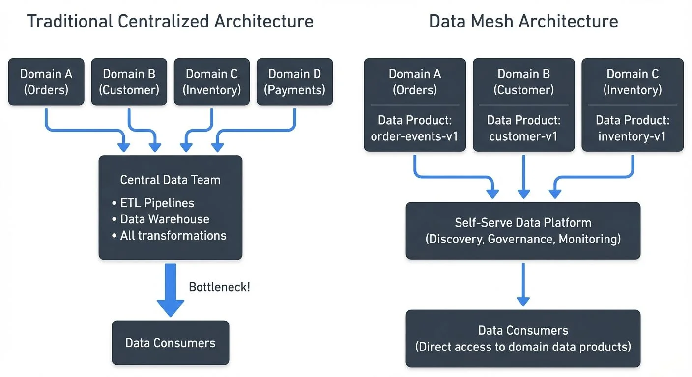
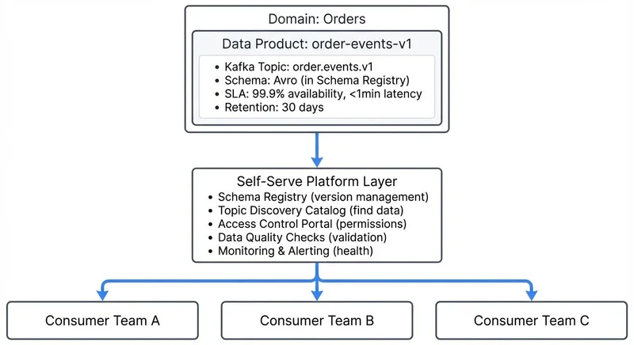

As organizations scale their data operations, traditional centralized data architectures often become bottlenecks. Data lakes and warehouses promise unified access to data, but they concentrate ownership and expertise in a single team, creating dependencies and slowing down the entire organization. Data Mesh emerged as an alternative paradigm that decentralizes data ownership while maintaining discoverability and governance.

## Introduction to Data Mesh

Data Mesh is a socio-technical approach to data architecture introduced by Zhamak Dehghani in 2019. Rather than treating data as a byproduct collected in a central repository, Data Mesh treats data as a product owned and maintained by the teams closest to its source—the domain teams themselves.

**Key Terms:**
- **SLA (Service Level Agreement)**: A commitment about performance metrics like availability (99.9% uptime) or latency (< 5 minute delay)
- **ETL (Extract, Transform, Load)**: The traditional process of moving data from sources to a data warehouse
- **Domain**: A distinct area of business logic (e.g., orders, customers, inventory in an e-commerce system)
- **Avro**: A binary data serialization format commonly used with Kafka for schemas

The core insight is that the team building an e-commerce checkout system understands checkout data better than any central data team ever could. They know its semantics, quality issues, and how it should be modeled. Data Mesh leverages this domain expertise by making these teams responsible for publishing high-quality data products that other teams can consume.

This represents a fundamental shift from "data as a side effect" to "data as a first-class concern" within each domain.

## The Four Core Principles

Data Mesh is built on four foundational principles that work together to enable decentralized data architecture.

### Domain-Oriented Decentralized Data Ownership

Instead of a central data team owning all data pipelines and transformations, each business domain owns its data products. In an e-commerce company, the customer domain would own customer data products, the inventory domain would own inventory data products, and so on.

This ownership includes the responsibility for data quality, schema evolution, documentation, and SLAs. Domain teams understand their data's context and can make informed decisions about its structure and evolution.

### Data as a Product

Each domain treats its data as a product with consumers, quality standards, and lifecycle management. A data product is not just raw data—it's discoverable, addressable, trustworthy, self-describing, and secure.

For example, a "customer-events-v1" data product might include:
- A well-defined schema with semantic descriptions
- Quality metrics and SLAs (e.g., 99.9% availability, < 5 minute latency)
- Clear versioning and deprecation policies
- Access controls and compliance documentation
- Usage examples and documentation

For detailed guidance on building and managing data products, see [Building and Managing Data Products](https://conduktor.io/glossary/building-and-managing-data-products). For governance aspects, refer to [Data Product Governance](https://conduktor.io/glossary/data-product-governance).

### Self-Serve Data Infrastructure as a Platform

To enable domain teams to own their data products without becoming infrastructure experts, organizations need a self-serve data platform. This platform provides standardized tools for creating, publishing, discovering, and consuming data products.

The platform handles cross-cutting concerns like deployment, monitoring, access control, and compliance, while domain teams focus on their specific data products. Think of it as "infrastructure as code" but for data products.

### Federated Computational Governance

Rather than centralized control, governance in Data Mesh is federated across domains but standardized through computational policies. In simpler terms: each domain team governs their own data products, but they all follow the same automated rules that are enforced by code rather than manual reviews.

For instance, policies might automatically enforce:
- Schema compatibility rules (e.g., no breaking changes without version bumps)
- Data privacy regulations (e.g., PII must be encrypted)
- Naming conventions and metadata requirements
- Quality thresholds before publishing

This allows domains to move fast while maintaining organizational standards. For comprehensive coverage of governance frameworks, see [Data Governance Framework: Roles and Responsibilities](https://conduktor.io/glossary/data-governance-framework-roles-and-responsibilities).

## Data Mesh vs Traditional Architectures

Traditional data architectures centralize data in warehouses or lakes managed by specialized teams. While this provides a single source of truth, it creates several problems:



<!-- ORIGINAL_DIAGRAM
```
        Traditional Centralized Architecture

┌──────────┐  ┌──────────┐  ┌──────────┐  ┌──────────┐
│ Domain A │  │ Domain B │  │ Domain C │  │ Domain D │
│ (Orders) │  │(Customer)│  │(Inventory)│ │(Payments)│
└─────┬────┘  └─────┬────┘  └─────┬────┘  └─────┬────┘
      │             │             │             │
      └─────────────┼─────────────┼─────────────┘
                    ▼             ▼
              ┌─────────────────────────┐
              │   Central Data Team     │
              │  • ETL Pipelines        │
              │  • Data Warehouse       │
              │  • All transformations  │
              └─────────┬───────────────┘
                        │ Bottleneck!
                        ▼
              ┌──────────────────┐
              │   Data Consumers │
              └──────────────────┘


             Data Mesh Architecture

┌─────────────────┐  ┌─────────────────┐  ┌─────────────────┐
│   Domain A      │  │   Domain B      │  │   Domain C      │
│   (Orders)      │  │   (Customer)    │  │  (Inventory)    │
├─────────────────┤  ├─────────────────┤  ├─────────────────┤
│ Data Product:   │  │ Data Product:   │  │ Data Product:   │
│ order-events-v1 │  │ customer-v1     │  │ inventory-v1    │
└────────┬────────┘  └────────┬────────┘  └────────┬────────┘
         │                    │                    │
         └────────────────────┼────────────────────┘
                              │
         ┌────────────────────┴────────────────────┐
         │     Self-Serve Data Platform            │
         │  (Discovery, Governance, Monitoring)    │
         └────────────┬────────────────────────────┘
                      │
                      ▼
         ┌──────────────────────────┐
         │    Data Consumers        │
         │ (Direct access to        │
         │  domain data products)   │
         └──────────────────────────┘
```
-->

**Scaling bottlenecks**: All data requests flow through the central team, creating dependencies and delays.

**Context loss**: The central team lacks deep domain knowledge, leading to mismodeled data and misunderstood semantics.

**Coupling**: Changes in source systems require coordination with the central team, slowing down both teams.

Data Mesh inverts this model. Instead of data flowing into a central repository, domain teams publish data products that consumers access directly. The central platform team provides tooling, not data.

This is similar to how microservices architecture moved from monolithic applications to decentralized services owned by different teams.

## Implementation Challenges and Considerations

Implementing Data Mesh is not purely technical—it requires organizational change.

**Cultural shift**: Teams must take on new responsibilities for data quality and consumer support. This requires training, tooling, and incentive alignment.

**Duplication concerns**: Multiple domains might model similar concepts differently (e.g., "customer" defined differently by marketing and billing). This requires good discovery and documentation to help consumers find the right data products.

**Platform investment**: Building a self-serve data platform requires significant upfront investment before domain teams can become productive.

**Governance complexity**: Federated governance requires sophisticated automation to enforce policies without creating bottlenecks.

Organizations should start small, typically with one or two domains, prove the value, and then expand incrementally.

## Partner Zones for Federated Data Sharing

A practical challenge in Data Mesh implementations is enabling secure data sharing between domains or with external partners while maintaining single source of truth. Conduktor Partner Zones address this by providing dedicated zones with customized access to Kafka topics without data duplication—domain teams share data products with specific partners while maintaining the original topic as the authoritative source.

Partner Zones also provide traffic analytics showing consumption patterns within each zone, enabling domain teams to understand usage and make informed decisions about their data products' evolution. Learn more in the [Partner Zones documentation](https://docs.conduktor.io/guide/conduktor-concepts/partner-zones).

## Data Mesh and Data Streaming

Data Mesh and streaming technologies like Apache Kafka are natural complements. Kafka's architecture aligns closely with Data Mesh principles.



<!-- ORIGINAL_DIAGRAM
```
      Data Mesh with Streaming (Kafka Example)

┌──────────────────────────────────────────────────────┐
│            Domain: Orders                            │
├──────────────────────────────────────────────────────┤
│  Data Product: order-events-v1                       │
│  ┌────────────────────────────────────────────────┐  │
│  │ Kafka Topic: order.events.v1                   │  │
│  │ Schema: Avro (in Schema Registry)              │  │
│  │ SLA: 99.9% availability, <1min latency         │  │
│  │ Retention: 30 days                             │  │
│  └────────────────────────────────────────────────┘  │
└───────────────────────┬──────────────────────────────┘
                        │
                        ▼
         ┌──────────────────────────────────────────┐
         │      Self-Serve Platform Layer           │
         ├──────────────────────────────────────────┤
         │ • Schema Registry (version management)   │
         │ • Topic Discovery Catalog (find data)    │
         │ • Access Control Portal (permissions)    │
         │ • Data Quality Checks (validation)       │
         │ • Monitoring & Alerting (health)         │
         └──────────┬───────────────────────────────┘
                    │
       ┌────────────┼────────────┐
       ▼            ▼            ▼
  ┌─────────┐  ┌─────────┐  ┌─────────┐
  │Consumer │  │Consumer │  │Consumer │
  │  Team A │  │  Team B │  │  Team C │
  └─────────┘  └─────────┘  └─────────┘
```
-->

**Decentralized ownership**: Kafka topics can be owned and managed by individual domain teams, who publish events representing their domain's data products.

**Real-time data products**: Instead of batch-only data products, streaming enables real-time data products. A "customer-events-v1" Kafka topic becomes a continuously updated data product.

**Schema governance**: Kafka's Schema Registry provides the foundation for data contracts, version management, and compatibility checks—key requirements for the "data as a product" principle. For details on schema management strategies, see [Schema Registry and Schema Management](https://conduktor.io/glossary/schema-registry-and-schema-management) and [Schema Evolution Best Practices](https://conduktor.io/glossary/schema-evolution-best-practices).

**Self-serve infrastructure**: Platforms like Conduktor provide a self-serve layer on top of Kafka, allowing domain teams to create topics, manage schemas, and configure access controls through intuitive interfaces without requiring deep Kafka expertise. This addresses the "self-serve infrastructure" principle by democratizing access to streaming infrastructure. See the [Conduktor Self-Service documentation](https://docs.conduktor.io/guide/conduktor-concepts/self-service) for details on enabling teams to manage their own data products.

Consumers can discover this data product through a catalog, understand its schema and SLAs, and request access—all without contacting the order team directly.

Tools like Conduktor Gateway help with federated governance by acting as a proxy layer that enforces naming conventions, schema compatibility rules, data quality checks, and access policies automatically across all domains. This ensures organizational standards are maintained while allowing teams to operate independently—critical for scaling Data Mesh implementations. For comprehensive guidance on building data products with proper governance, see [Conduktor's Data Products guide](https://docs.conduktor.io/guide/conduktor-concepts/data-products).

## Modern Data Mesh Patterns (2024-2025)

As Data Mesh has matured, several patterns and practices have emerged as industry standards:

### Data Contracts

Data contracts have become essential for Data Mesh implementations. A data contract is a formal agreement between data producers and consumers that specifies:

```yaml
# Example data contract for a data product
contract:
  name: order-events-v1
  owner: orders-domain-team
  schema:
    format: avro
    version: 1.2.0
    compatibility: backward
  sla:
    availability: 99.9%
    latency_p99: 1000ms
    freshness: 60s
  quality:
    completeness: 99%
    validity_rules:
      - order_total > 0
      - customer_id is not null
```

Data contracts provide clear expectations and enable automated validation. When a producer attempts to publish data that violates the contract, it's rejected immediately—preventing data quality issues from propagating downstream.

### Data Product Observability

Modern Data Mesh implementations include comprehensive observability for each data product:

- **Performance metrics**: Throughput, latency, consumer lag
- **Quality metrics**: Completeness, validity, consistency scores
- **Usage analytics**: Active consumers, query patterns, access frequency
- **Cost attribution**: Infrastructure costs allocated per data product

This observability enables domain teams to treat data products like software products, with clear SLIs (Service Level Indicators) and SLOs (Service Level Objectives). For understanding quality metrics, see [Data Quality Dimensions: Accuracy, Completeness, and Consistency](https://conduktor.io/glossary/data-quality-dimensions-accuracy-completeness-and-consistency).

### Kafka 4.0 and KRaft

Apache Kafka 4.0 (released 2024) eliminates ZooKeeper dependency through KRaft consensus. This simplifies Data Mesh implementations by:

- Reducing infrastructure complexity (fewer components to manage)
- Improving metadata operations (faster topic creation, partition rebalancing)
- Enabling better multi-tenancy through improved controller scalability

For Data Mesh, this means domain teams can create and manage data products with less operational overhead and faster provisioning times.

### Cost Allocation and Chargeback

As Data Mesh scales, organizations need mechanisms to allocate infrastructure costs to domain teams. Modern implementations track:

- Storage costs per topic (data product)
- Compute costs for processing (Kafka Streams, Flink applications)
- Network transfer costs
- Schema Registry and catalog usage

This enables internal chargeback models where domain teams have "skin in the game" for their data products' efficiency. Conduktor provides built-in [Chargeback capabilities](https://docs.conduktor.io/guide/conduktor-concepts/chargeback) to track and allocate streaming costs to teams and data products.

## Practical Implementation Steps

Organizations looking to adopt Data Mesh should follow an incremental approach:

1. **Identify pilot domains**: Choose one or two domains with clear ownership and well-understood data to start.

2. **Define data product standards**: Establish what constitutes a good data product—schema requirements, documentation, SLAs, etc.

3. **Build platform capabilities**: Start with basic self-serve capabilities like topic creation, schema management, and access control. Expand based on domain team feedback. For topic design guidance, see [Kafka Topic Design Guidelines](https://conduktor.io/glossary/kafka-topic-design-guidelines).

4. **Implement computational governance**: Encode key policies as automated checks (schema validation, naming conventions, quality metrics).

5. **Create discovery and cataloging**: Make data products discoverable through a catalog that shows available products, their schemas, owners, and SLAs.

6. **Measure and iterate**: Track metrics like time-to-publish for new data products, consumer satisfaction, and data quality incidents. Use these to improve the platform.

The goal is not to achieve perfect Data Mesh from day one, but to build capabilities incrementally while proving value.

## Summary

Data Mesh represents a fundamental rethinking of data architecture, moving from centralized control to decentralized ownership. Its four principles—domain-oriented ownership, data as a product, self-serve infrastructure, and federated governance—work together to enable scalable data operations.

While implementation requires significant organizational and technical investment, the payoff is faster data product development, better data quality through domain expertise, and reduced bottlenecks. Streaming technologies like Apache Kafka provide an excellent foundation for Data Mesh, enabling real-time data products with strong governance through schemas and automated policies.

Organizations should start small, prove value with pilot domains, and expand incrementally. The journey to Data Mesh is gradual, but it offers a sustainable path for data architecture at scale.

## Related Concepts

- [Data Governance Framework: Roles and Responsibilities](https://conduktor.io/glossary/data-governance-framework-roles-and-responsibilities) - Essential governance structures for implementing federated computational governance in data mesh architectures
- [Schema Registry and Schema Management](https://conduktor.io/glossary/schema-registry-and-schema-management) - Critical infrastructure for maintaining data contracts and schema governance across domain-owned data products
- [Data Contracts for Reliable Pipelines](https://conduktor.io/glossary/data-contracts-for-reliable-pipelines) - Formalized agreements between data producers and consumers that enable data-as-a-product principles

## Sources and References

1. Dehghani, Zhamak. "Data Mesh: Delivering Data-Driven Value at Scale." O'Reilly Media, 2022.
2. Dehghani, Zhamak. "How to Move Beyond a Monolithic Data Lake to a Distributed Data Mesh." Martin Fowler's website, 2019. [https://martinfowler.com/articles/data-monolith-to-mesh.html](https://martinfowler.com/articles/data-monolith-to-mesh.html)
3. Dehghani, Zhamak. "Data Mesh Principles and Logical Architecture." Martin Fowler's website, 2020. [https://martinfowler.com/articles/data-mesh-principles.html](https://martinfowler.com/articles/data-mesh-principles.html)
4. Apache Kafka Documentation. "Kafka Architecture and Design." Official documentation covering topics, schemas, and governance. [https://kafka.apache.org/documentation/](https://kafka.apache.org/documentation/)
5. Thoughtworks Technology Radar. "Data Mesh." Multiple editions covering Data Mesh adoption and patterns. [https://www.thoughtworks.com/radar](https://www.thoughtworks.com/radar)
