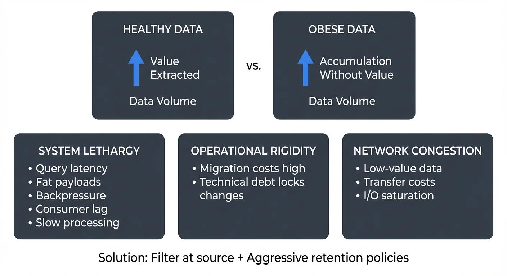

In the age of "data is the new oil," organizations face a counterintuitive problem: too much data can be as harmful as too little. Data obesity occurs when an organization's data infrastructure becomes bloated and lethargic because the volume of ingested data significantly outpaces the organization's ability to extract value from it.

Unlike healthy data growth, where increasing volumes correlate with improved insights, better decision-making, and measurable business outcomes, data obesity represents accumulation without purpose. The system becomes "heavy," burdened by petabytes of information that slow operations, inflate costs, and paradoxically reduce agility rather than enhance it.

This phenomenon is particularly acute in streaming architectures, where the velocity of data ingestion can mask underlying inefficiencies until performance degradation becomes severe.

<!-- ORIGINAL_DIAGRAM
```
┌──────────────────────────────────────────────────────────────────┐
│           THE THREE SYMPTOMS OF DATA OBESITY                     │
└──────────────────────────────────────────────────────────────────┘

         HEALTHY DATA              vs.         OBESE DATA
    ┌──────────────────┐                 ┌──────────────────┐
    │  Value Extracted │                 │  Accumulation    │
    │        ▲         │                 │  Without Value   │
    │        │         │                 │        ▲         │
    │   Data Volume    │                 │        │         │
    └──────────────────┘                 │   Data Volume    │
                                         └──────────────────┘

┌──────────────────┐    ┌──────────────────┐    ┌──────────────────┐
│  SYSTEM LETHARGY │    │ OPERATIONAL      │    │  NETWORK         │
│                  │    │ RIGIDITY         │    │  CONGESTION      │
│  • Query latency │    │                  │    │                  │
│  • Fat payloads  │    │  • Migration     │    │  • Low-value     │
│  • Backpressure  │    │    costs high    │    │    data          │
│  • Consumer lag  │    │  • Technical     │    │  • Transfer      │
│  • Slow processing│    │    debt locks    │    │    costs         │
│                  │    │    changes       │    │  • I/O saturation│
└──────────────────┘    └──────────────────┘    └──────────────────┘

         Solution: Filter at source + Aggressive retention policies
```
-->

## The Three Symptoms of Data Obesity

### System Lethargy: Performance Impact

The most immediate symptom of data obesity is degraded performance. Massive, uncurated datasets slow down every operation that touches them. Query latency increases. Batch jobs take hours instead of minutes. Real-time systems start to lag.

In streaming environments, this manifests as "fat" payloads that cause backpressure (downstream processing slowdowns due to overwhelming data volume) throughout the pipeline. When event producers serialize entire database rows, including large BLOB fields, audit columns, and metadata that downstream consumers never touch, they force every component in the chain to process, transmit, and store unnecessary bytes. For detailed coverage of backpressure patterns, see [Backpressure Handling in Streaming Systems](https://conduktor.io/glossary/backpressure-handling-in-streaming-systems).

A Kafka consumer that needs only a customer ID and purchase amount shouldn't receive a 50KB payload containing product images, full address history, and marketing preferences. Yet this pattern is common in Change Data Capture (CDC), the process of capturing database changes as events, implementations where convenience takes precedence over efficiency. For more on CDC patterns, refer to [What is Change Data Capture (CDC)](https://conduktor.io/glossary/what-is-change-data-capture-cdc-fundamentals).

### Operational Rigidity: Loss of Agility

Obese data systems are difficult to maneuver. What should be routine operations, upgrading a database, migrating to a new cloud region, implementing a new storage tier, become high-risk, multi-month projects.

The cost isn't just time. When your streaming platform contains 500TB of data with 90-day retention, even small architectural changes require careful choreography. Reprocessing historical data becomes prohibitively expensive. Testing new features against realistic data volumes becomes impractical. Teams become locked into legacy architectures simply because the migration path is too daunting. For capacity planning strategies to avoid this rigidity, see [Kafka Capacity Planning](https://conduktor.io/glossary/kafka-capacity-planning).

This rigidity creates a dangerous cycle: the system becomes harder to change, so technical debt accumulates, making future changes even more difficult.

### Network Congestion: The "Junk Food" Effect

Not all data provides equal nutritional value. Ingesting low-value data acts like consuming empty calories, it fills up your infrastructure without providing business benefit.

Consider a microservices architecture where services emit detailed debug logs to a central event stream "just in case." These logs consume network bandwidth, increase serialization overhead, and inflate storage costs. When a genuine performance issue arises, finding signal in this noise becomes harder, not easier.

In streaming systems, network congestion from unnecessary data manifests as:
- Increased cross-availability-zone transfer costs
- Higher serialization/deserialization CPU usage
- Longer replication lag between Kafka brokers
- Slower producer acknowledgments due to I/O saturation

## Data Obesity in Streaming Architectures

Streaming platforms like Apache Kafka, Apache Flink, and Pulsar are particularly vulnerable to obesity because they're designed for high throughput. This strength becomes a weakness when data volume lacks corresponding value.

### Fat Payloads in Change Data Capture

CDC tools capture every change to a database and stream it to downstream consumers. The default configuration often includes the entire row, before and after states, regardless of what consumers actually need.

A typical example: an e-commerce company streams order updates from PostgreSQL to Kafka. Each order record contains customer data (name, email, shipping address), product details (descriptions, images, specifications), payment information, and audit fields. Most consumers need only the order ID and status, yet they receive 100KB per event.

When order volume reaches 10,000 per minute, this translates to nearly 1GB/minute of unnecessary network traffic and storage consumption.

### Infinite Retention Without Purpose

Treating Kafka as "forever storage" creates obesity at the infrastructure level. Some organizations configure topics with infinite retention or multi-year retention periods without clear use cases.

The rationale is usually defensive: "We might need this data someday." But indefinite retention has real costs:
- Storage expenses that scale linearly with data volume
- Slower consumer group rebalancing as partition sizes grow
- Increased recovery time when brokers fail
- Higher operational complexity for upgrades and migrations

Effective streaming architectures distinguish between hot data (active processing), warm data (recent historical queries), and cold data (long-term archival). Conflating these tiers in a single Kafka cluster creates unnecessary burden.

For cold data archival, modern lakehouse architectures provide better economics and query capabilities than indefinite Kafka retention. Streaming data to Delta Lake or Apache Iceberg tables enables cost-effective long-term storage with ACID guarantees and SQL analytics. For details on lakehouse patterns, see [Introduction to Lakehouse Architecture](https://conduktor.io/glossary/introduction-to-lakehouse-architecture) and [Streaming to Lakehouse Tables](https://conduktor.io/glossary/streaming-to-lakehouse-tables).

**Modern Solution: Tiered Storage (Kafka 3.6+)**

Kafka's tiered storage feature (production-ready as of Kafka 3.6) addresses the retention obesity problem by automatically moving older log segments to object storage (S3, Azure Blob, GCS) while keeping recent data on local disks. This enables:

- **Unlimited retention at reduced cost**: Store years of data at object storage prices instead of high-performance disk
- **Faster broker operations**: Local disk contains only hot data, speeding up recovery and rebalancing
- **Cost optimization**: Pay ~$0.02/GB/month for cold data vs. ~$0.10/GB/month for provisioned disk
- **Simplified operations**: No manual archival pipelines or separate long-term storage systems

For organizations on Kafka 4.0+ with KRaft mode, tiered storage becomes even more efficient due to improved metadata handling and elimination of ZooKeeper coordination overhead. This combination represents the modern approach to retention management without infrastructure obesity. For more on Kafka's evolution, see [Understanding KRaft Mode in Kafka](https://conduktor.io/glossary/understanding-kraft-mode-in-kafka) and [Tiered Storage in Kafka](https://conduktor.io/glossary/tiered-storage-in-kafka).

### Backpressure Cascades

When producers overwhelm consumers with "obese" streams, backpressure propagates upstream. Consumers fall behind, lag metrics increase, and the system enters a degraded state where catch-up becomes impossible without intervention. For monitoring techniques to detect and respond to consumer lag, see [Consumer Lag Monitoring](https://conduktor.io/glossary/consumer-lag-monitoring).

This often creates a vicious cycle:
1. Fat payloads slow consumer processing
2. Consumers fall behind, increasing memory pressure
3. Out-of-memory errors force restarts
4. Restarts cause rebalancing (redistribution of partitions across consumer instances), further slowing the consumer group
5. Meanwhile, producers continue adding data, widening the gap

## Real-World Impact: Case Studies

### Case Study 1: Financial Services CDC Implementation

A financial services firm implemented CDC to stream transaction data from their core banking system to a fraud detection service. The initial implementation streamed complete customer records (including scanned documents stored as BLOBs) with each transaction event.

Within three months, they faced:
- Kafka cluster storage costs exceeding $50,000/month
- Average event processing latency of 8 seconds (vs. 200ms target)
- Regular consumer group failures from out-of-memory errors
- Inability to add new consumers without cluster capacity expansion

The solution involved schema redesign: transaction events referenced customer IDs rather than embedding full records. Document BLOBs were stored separately with URL references. This reduced average payload size from 2.1MB to 4KB, a 99.8% reduction.

Results: latency dropped to 150ms, storage costs decreased by 85%, and the system could scale to 5x transaction volume without additional infrastructure.

### Case Study 2: E-Commerce Event Stream Obesity

An e-commerce platform emitted product view events including the entire product catalog entry (description, images, reviews, inventory across all warehouses). Analytics consumers needed only product ID and category.

The bloated events caused:
- 40TB monthly network transfer costs between regions
- Flink jobs consuming 3x necessary CPU for deserialization
- 7-day retention limit (vs. desired 30 days) due to storage constraints

By implementing projection at the source, emitting only required fields, they reduced payload size by 94%, enabling 90-day retention at lower total cost than the original 7-day configuration.

## The Diet: Mitigation Strategies

### Filter at the Source

The most effective obesity prevention happens before data enters your streaming platform. Source-side filtering ensures only valuable data consumes downstream resources.

**For Kafka Connect CDC:**
Configure Single Message Transforms (SMTs) to:
- Drop unnecessary fields from change events
- Filter out rows that don't meet relevance criteria
- Extract nested structures into separate topics

For detailed SMT patterns, see [Kafka Connect: Single Message Transforms](https://conduktor.io/glossary/kafka-connect-single-message-transforms).

Example connector configuration to reduce payload obesity:

```json
{
  "name": "postgres-cdc-connector",
  "config": {
    "connector.class": "io.debezium.connector.postgresql.PostgresConnector",
    "tasks.max": "1",
    "database.hostname": "postgres.example.com",
    "database.port": "5432",
    "database.user": "debezium",
    "database.dbname": "orders",
    "topic.prefix": "cdc",
    "transforms": "dropFields,filterLargeImages,route",
    "transforms.dropFields.type": "org.apache.kafka.connect.transforms.ReplaceField$Value",
    "transforms.dropFields.exclude": "internal_notes,audit_log,created_by_ip",
    "transforms.filterLargeImages.type": "org.apache.kafka.connect.transforms.Filter",
    "transforms.filterLargeImages.predicate": "hasLargeBlob",
    "predicates": "hasLargeBlob",
    "predicates.hasLargeBlob.type": "org.apache.kafka.connect.transforms.predicates.RecordIsTombstone"
  }
}
```

This configuration drops audit fields, filters records with large BLOBs, and routes lean events to appropriate topics, reducing payload sizes by 70-90%.

**For application producers:**
- Implement schema-driven serialization (Avro, Protobuf)
- Design events with consumer needs in mind, not just producer convenience
- Use event types with specific purposes rather than generic "data dump" events
- Establish data contracts that define payload expectations and SLAs

For establishing clear expectations between producers and consumers, see [Data Contracts for Reliable Pipelines](https://conduktor.io/glossary/data-contracts-for-reliable-pipelines). For overall topic design principles, refer to [Kafka Topic Design Guidelines](https://conduktor.io/glossary/kafka-topic-design-guidelines).

### Aggressive Compaction

For topics maintaining current state (e.g., customer profiles, product catalogs), log compaction automatically removes historical values for each key, retaining only the latest. For deep dive into compaction mechanics, see [Kafka Log Compaction Explained](https://conduktor.io/glossary/kafka-log-compaction-explained).

Compaction strategies and configuration example:

```properties
# Topic configuration for state management
cleanup.policy=compact
# Trigger compaction when 50% of log contains old values (default: 50%)
min.cleanable.dirty.ratio=0.5
# More aggressive: trigger at 30% for faster space recovery
# min.cleanable.dirty.ratio=0.3

# Minimum time before a message can be compacted (default: 0)
min.compaction.lag.ms=0
# Maximum time before forcing compaction (default: Long.MAX_VALUE)
max.compaction.lag.ms=86400000  # 24 hours

# Tombstone retention (how long delete markers remain)
delete.retention.ms=86400000  # 24 hours

# Segment settings that affect compaction efficiency
segment.ms=3600000  # 1 hour - smaller segments compact faster
segment.bytes=104857600  # 100MB
```

**Recommended configuration for obesity prevention:**
- State topics: `cleanup.policy=compact` with aggressive `min.cleanable.dirty.ratio=0.3`
- Event topics: `cleanup.policy=delete` with retention based on actual query patterns (typically 7-30 days)
- Hybrid: `cleanup.policy=compact,delete` for state topics that also need time-based expiration

For topics with time-series data, implement retention policies aligned with actual query patterns. If 95% of queries touch data from the last 7 days, 90-day retention may be excessive.

### Schema Evolution and Projection

As consumer needs evolve, schemas should too. Removing deprecated fields prevents perpetuating obesity through inertia. For comprehensive coverage of schema management, see [Schema Registry and Schema Management](https://conduktor.io/glossary/schema-registry-and-schema-management) and [Schema Evolution Best Practices](https://conduktor.io/glossary/schema-evolution-best-practices).

Strategies:
- Use schema registries to version and govern event structures
- Implement backward-compatible changes that deprecate then remove unused fields
- Create topic-specific projections for different consumer groups rather than one-size-fits-all events

**Example:** Instead of a single "OrderEvent" with 50 fields, create:
- `order.created.minimal` (10 fields for real-time dashboards)
- `order.created.full` (50 fields for data warehouse)
- `order.created.audit` (20 fields for compliance systems)

For serialization format comparisons that impact payload size, refer to [Avro vs Protobuf vs JSON Schema](https://conduktor.io/glossary/avro-vs-protobuf-vs-json-schema).

## Governance as Prevention

Technology alone cannot prevent data obesity, organizational governance is essential.

### Visibility and Monitoring

You can't manage what you don't measure. Effective governance requires visibility into:
- Per-topic data volume and growth rates
- Payload size distributions (average, p95, p99)
- Consumer utilization (which fields are actually accessed)
- Cost attribution (which teams/services drive storage and network costs)

Modern tooling for data obesity monitoring:
- **Conduktor Platform**: Comprehensive Kafka management with payload inspection, schema governance, and cost tracking dashboards
- **Conduktor Gateway**: Data governance proxy that can enforce payload size limits, schema validation, and consumption quotas in real-time
- **Kafka Lag Exporter**: Open-source tool for monitoring consumer lag patterns that indicate processing bottlenecks
- **Cruise Control**: LinkedIn's open-source tool for automated cluster rebalancing and capacity planning

For comprehensive governance frameworks, see [Data Governance Framework: Roles and Responsibilities](https://conduktor.io/glossary/data-governance-framework-roles-and-responsibilities) and [Policy Enforcement in Streaming](https://conduktor.io/glossary/policy-enforcement-in-streaming).

### Policy Enforcement

Governance platforms enable organizations to define and enforce lean data policies:
- **Schema validation rules:** Prevent registration of schemas exceeding size thresholds or containing prohibited field types
- **Topic lifecycle management:** Automatically archive or delete topics that haven't been consumed in X days
- **Quota management:** Limit producer throughput or storage per team/application to prevent runaway growth

### Cost Attribution and Accountability

When storage and network costs are treated as shared overhead, individual teams lack incentive to optimize. Chargeback models that attribute costs to producing teams create accountability.

Governance platforms can:
- Track which services produce which topics
- Calculate storage and throughput costs per topic
- Generate reports showing each team's infrastructure footprint
- Trigger alerts when teams exceed allocated budgets

This economic feedback loop encourages teams to question whether they truly need to stream every field, keep every event, or maintain indefinite retention. For implementing chargeback mechanisms that make data obesity costs visible to producing teams, see [Conduktor's chargeback documentation](https://docs.conduktor.io/guide/conduktor-concepts/chargeback).

**FinOps for Streaming (2025 Best Practices):**
Modern organizations apply FinOps principles to streaming infrastructure:
- **Cost visibility dashboards**: Real-time tracking of per-topic, per-team cloud costs (compute, storage, network egress)
- **Budget alerts**: Automated notifications when topics exceed allocated spend
- **Right-sizing recommendations**: ML-driven analysis suggesting optimal partition counts, retention periods, and compression settings
- **Cross-AZ transfer optimization**: Identifying and minimizing expensive cross-availability-zone traffic

Data obesity directly correlates with "dark data tax", the hidden costs of maintaining unused or low-value data. To identify topics consuming disproportionate resources, use [VIP Topics insights](https://docs.conduktor.io/guide/insights/vip-topics) which highlight high-cost, high-volume topics requiring optimization attention. For more on this economic challenge, see [Dark Data Tax](https://conduktor.io/glossary/dark-data-tax) and [Streaming Total Cost of Ownership](https://conduktor.io/glossary/streaming-total-cost-of-ownership).

## Summary: Building Sustainable Data Infrastructure

Data obesity is not inevitable. It results from prioritizing short-term convenience ("let's capture everything") over long-term sustainability.

Healthy data infrastructure requires:

**Intentionality:** Every byte ingested should have a defined purpose and expected consumer. Default to lean payloads and expand only when justified by specific use cases.

**Right-Sizing:** Match retention policies to actual query patterns. Distinguish between hot, warm, and cold data with appropriate storage tiers.

**Continuous Optimization:** Schema evolution isn't a one-time activity. As business needs change, data structures should adapt, removing deprecated fields and avoiding perpetual accumulation.

**Economic Accountability:** Make data costs visible and attributable. When teams understand the infrastructure impact of their decisions, they make better tradeoffs.

**Governance as Culture:** Technology platforms can enforce policies, but sustainable change requires organizational commitment to treating data infrastructure as a finite resource requiring stewardship, not an infinite dumping ground.

The organizations that thrive in data-intensive environments aren't those that collect the most data, they're those that collect the right data and maintain the agility to evolve as needs change.

## Related Concepts

- [Apache Kafka](https://conduktor.io/glossary/apache-kafka) - Streaming platform where data obesity often manifests through bloated payloads and excessive retention
- [Dark Data Tax](https://conduktor.io/glossary/dark-data-tax) - The hidden costs of unused data that often accompanies data obesity
- [Kafka Capacity Planning](https://conduktor.io/glossary/kafka-capacity-planning) - Right-sizing infrastructure to prevent obesity while meeting performance requirements

---

## Sources and References

1. **Kleppmann, Martin.** "Designing Data-Intensive Applications." O'Reilly Media, 2017. Chapters on data storage patterns and system scalability.

2. **Apache Kafka Documentation.** "Tiered Storage" (Kafka 3.6+). Official documentation on configuring and managing tiered storage for cost-effective retention.

3. **Apache Kafka Documentation.** "KRaft Mode" (Kafka 4.0+). Guide to ZooKeeper-free Kafka operations and improved metadata management.

4. **Confluent Documentation.** "Kafka Configuration Reference - Log Compaction." Best practices for managing topic retention and compaction strategies.

5. **Narkhede, Neha, et al.** "Kafka: The Definitive Guide, 2nd Edition." O'Reilly Media, 2021. Updated sections on performance tuning and capacity planning.

6. **Beyer, Betsy, et al.** "Site Reliability Engineering: How Google Runs Production Systems." O'Reilly Media, 2016. Chapters on capacity planning and performance management.

7. **FinOps Foundation.** "Cloud FinOps for Streaming Data Platforms" (2025). Best practices for cost optimization and accountability in streaming infrastructure.

8. **DataCouncil Conference Proceedings.** Various talks on data platform economics and ROI measurement (2020-2025).

9. **Gartner Research.** "Managing Data Obesity: Storage Optimization Strategies for Modern Data Platforms." Reports on data management costs and organizational impact (2024-2025).

10. **Apache Flink Documentation.** "State Backends and Checkpointing." Guidelines for managing state size in streaming applications.

11. **Conduktor Documentation.** "Data Governance with Conduktor Gateway" (2025). Real-time policy enforcement and payload management patterns.
