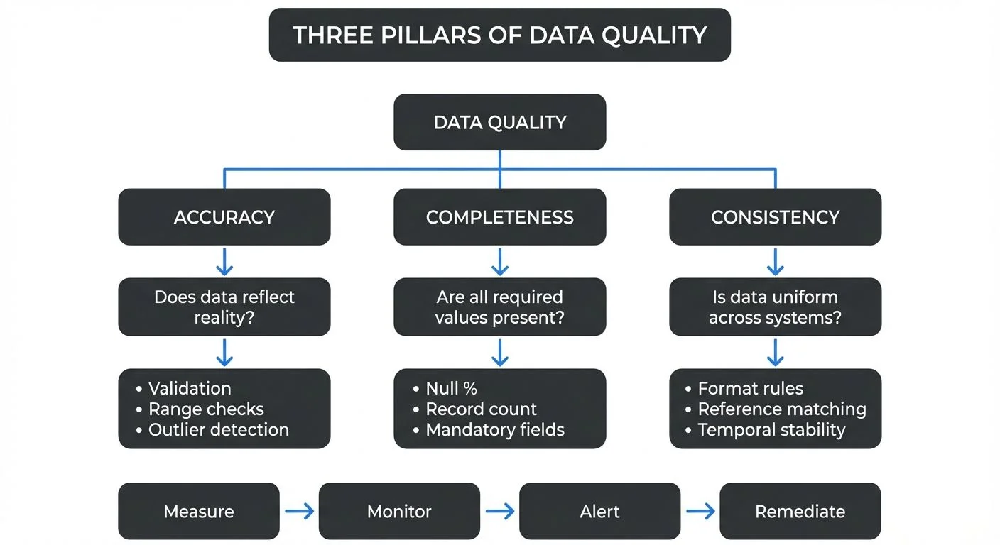

Data quality is the foundation of reliable analytics, informed decision-making, and successful data-driven organizations. Poor data quality costs businesses millions annually through bad decisions, operational inefficiencies, and missed opportunities. Understanding the core dimensions of data quality is essential for anyone working with data, whether you're analyzing datasets, building data pipelines, or establishing governance frameworks.

This article explores three fundamental dimensions of data quality: accuracy, completeness, and consistency. We'll examine what each dimension means, why it matters, and how to measure and maintain these qualities in both batch and streaming data systems.



<!-- ORIGINAL_DIAGRAM
```
┌──────────────────────────────────────────────────────────────────┐
│        THREE PILLARS OF DATA QUALITY                             │
└──────────────────────────────────────────────────────────────────┘

         ┌────────────────────────────────────────┐
         │         DATA QUALITY                   │
         └───────────────┬────────────────────────┘
                         │
         ┌───────────────┼───────────────┐
         │               │               │
         ▼               ▼               ▼
  ┌────────────┐  ┌────────────┐  ┌────────────┐
  │  ACCURACY  │  │COMPLETENESS│  │CONSISTENCY │
  └────────────┘  └────────────┘  └────────────┘
         │               │               │
         ▼               ▼               ▼
  ┌────────────┐  ┌────────────┐  ┌────────────┐
  │ Does data  │  │ Are all    │  │ Is data    │
  │ reflect    │  │ required   │  │ uniform    │
  │ reality?   │  │ values     │  │ across     │
  │            │  │ present?   │  │ systems?   │
  └────────────┘  └────────────┘  └────────────┘
         │               │               │
         ▼               ▼               ▼
  ┌────────────┐  ┌────────────┐  ┌────────────┐
  │• Validation│  │• Null %    │  │• Format    │
  │• Range     │  │• Record    │  │  rules     │
  │  checks    │  │  count     │  │• Reference │
  │• Outlier   │  │• Mandatory │  │  matching  │
  │  detection │  │  fields    │  │• Temporal  │
  │            │  │            │  │  stability │
  └────────────┘  └────────────┘  └────────────┘

         Measure → Monitor → Alert → Remediate
```
-->

## Understanding Data Quality Dimensions

Data quality dimensions are the different ways we measure whether data is good enough to use. Think of them like criteria for grading an essay: just as writing is assessed on grammar, clarity, and structure, data is evaluated on multiple characteristics. While various frameworks identify different numbers of dimensions (ranging from 4 to 15), accuracy, completeness, and consistency form the core trio that impacts nearly every data use case.

Think of these dimensions as the pillars supporting your data infrastructure. A weakness in any one dimension can compromise the entire structure, leading to unreliable reports, faulty machine learning models, or flawed business decisions.

## Accuracy: Getting the Data Right

**Data accuracy** refers to how correctly data represents the real-world entity or event it describes. Accurate data is free from errors and truthfully reflects reality at the point of capture.

### What Makes Data Inaccurate?

Data can become inaccurate through various means:

- **Entry errors**: Typos, transposed digits, or incorrect selections during manual data entry
- **Measurement errors**: Faulty sensors, miscalibrated instruments, or rounding issues
- **Processing errors**: Bugs in transformation logic, incorrect formulas, or data type mismatches
- **Temporal decay**: Data that was once accurate becomes outdated as reality changes

### Measuring Accuracy

Accuracy is often the most challenging dimension to measure because it requires a "source of truth" for comparison. Common approaches include:

- Comparing against trusted external sources or reference datasets
- Implementing validation rules based on business knowledge
- Statistical outlier detection to identify suspicious values
- Regular audits sampling random records for manual verification

For example, customer email addresses can be validated against format patterns and potentially verified through confirmation emails. Product prices can be checked against authorized price lists or supplier catalogs.

**Modern tools for accuracy validation (2025):**

```python
# Great Expectations 1.x for accuracy validation
import great_expectations as gx

context = gx.get_context()
batch = context.sources.pandas_default.read_csv("customer_data.csv")

# Validate email format accuracy
batch.expect_column_values_to_match_regex(
    column="email",
    regex=r"^[a-zA-Z0-9._%+-]+@[a-zA-Z0-9.-]+\.[a-zA-Z]{2,}$"
)

# Validate price accuracy against expected range
batch.expect_column_values_to_be_between(
    column="price",
    min_value=0,
    max_value=10000
)
```

You can also use **Soda Core** for declarative quality checks:

```yaml
# checks.yml
checks for products:
  - invalid_percent(email) < 1%:
      valid format: email
  - invalid_count(price) = 0:
      valid min: 0
      valid max: 10000
```

For comprehensive testing frameworks, see [Automated Data Quality Testing](https://conduktor.io/glossary/automated-data-quality-testing) and [Great Expectations Framework](https://conduktor.io/glossary/great-expectations-data-testing-framework).

### Maintaining Accuracy in Streaming Systems

In streaming data platforms like Apache Kafka, maintaining accuracy presents unique challenges. Data flows continuously at high velocity, making validation more critical yet more difficult.

**Tools for streaming data quality (2025):**

- **Conduktor**: Provides real-time data quality monitoring, governance, and testing for Kafka streams, including schema validation and custom quality rules. For implementation details, see [Enforcing Data Quality](https://docs.conduktor.io/guide/use-cases/enforce-data-quality) and [Data Quality Policies](https://docs.conduktor.io/guide/conduktor-concepts/data-quality-policies).
- **Schema registries**: Enforce structural accuracy by validating message formats against registered schemas (Confluent Schema Registry, Apicurio)
- **dbt integration**: Run data quality tests on streaming data landed in warehouses or lakehouses

These platforms enable you to set up schema validation to catch malformed records, implement custom quality checks on message content, and create alerts when accuracy thresholds are breached. This proactive approach prevents inaccurate data from propagating downstream where it might corrupt analytics or trigger incorrect automated actions.

For more on streaming validation patterns, see [Schema Registry and Schema Management](https://conduktor.io/glossary/schema-registry-and-schema-management) and [Building a Data Quality Framework](https://conduktor.io/glossary/building-a-data-quality-framework).

## Completeness: Having All the Data You Need

**Data completeness** measures whether all required data is present. Complete data contains all necessary fields, records, and attributes needed for its intended use.

### Types of Completeness

Completeness operates at multiple levels:

- **Column completeness**: Are all required fields populated for each record?
- **Row completeness**: Are all expected records present in the dataset?
- **Relationship completeness**: Are all necessary related records available across tables?

### The Impact of Incomplete Data

Missing data creates blind spots in analysis. An incomplete customer record might lack a postal code, preventing geographic analysis. Missing transaction records distort revenue calculations. Incomplete product hierarchies break down category-level reporting.

### Measuring Completeness

Completeness metrics are relatively straightforward to calculate:

- **Field completeness rate**: (Non-null values / Total values) × 100%
- **Record completeness rate**: (Actual record count / Expected record count) × 100%
- **Mandatory field compliance**: Percentage of records with all required fields populated

These metrics should be tracked over time and broken down by data source, table, or domain to identify patterns and problem areas.

**Example completeness check with Soda Core:**

```yaml
# checks.yml
checks for customer_table:
  # Column-level completeness
  - missing_count(email) = 0
  - missing_percent(postal_code) < 5%

  # Row-level completeness
  - row_count > 1000

  # Schema completeness
  - schema:
      fail:
        when required column missing: [customer_id, email, created_at]
```

**SQL-based completeness analysis:**

```sql
-- Check completeness across multiple dimensions
SELECT
    COUNT(*) as total_records,
    COUNT(email) as records_with_email,
    COUNT(postal_code) as records_with_postal,
    ROUND(100.0 * COUNT(email) / COUNT(*), 2) as email_completeness_pct,
    ROUND(100.0 * COUNT(postal_code) / COUNT(*), 2) as postal_completeness_pct
FROM customers
WHERE created_at >= CURRENT_DATE - INTERVAL '7 days';
```

### Streaming Data Completeness

In streaming architectures, completeness becomes more nuanced. Messages might arrive out of order, and related events might be scattered across time windows. Data engineers must implement strategies like:

- **Windowing and watermarks**: Define time boundaries to determine when a data window is "complete enough" to process (windowing groups events into time buckets, while watermarks indicate how long to wait for late-arriving data)
- **Late-arrival handling**: Incorporate delayed messages that arrive after the initial window closes
- **Join patterns**: Account for temporal gaps between related events across different streams

**Kafka Streams example for completeness tracking:**

```java
// Track expected vs actual message counts per time window
StreamsBuilder builder = new StreamsBuilder();
KStream<String, Order> orders = builder.stream("orders");

orders
    .groupByKey()
    .windowedBy(TimeWindows.ofSizeWithNoGrace(Duration.ofMinutes(5)))
    .count(Materialized.as("order-counts"))
    .toStream()
    .filter((windowedKey, count) -> {
        long expected = getExpectedCount(windowedKey.key());
        double completeness = (double) count / expected;
        // Alert if less than 95% complete
        return completeness < 0.95;
    })
    .to("quality-alerts");
```

Modern streaming platforms provide mechanisms to handle these scenarios. When monitoring streaming pipelines with tools like Conduktor, you can track message delivery rates, identify missing sequence numbers, and detect partition lag that might indicate incomplete data delivery.

For deeper coverage of streaming completeness patterns, see [Watermarks and Triggers in Stream Processing](https://conduktor.io/glossary/watermarks-and-triggers-in-stream-processing) and [Consumer Lag Monitoring](https://conduktor.io/glossary/consumer-lag-monitoring).

## Consistency: Keeping Data Aligned

**Data consistency** ensures that data values are uniform and coherent across different datasets, systems, and time periods. Consistent data follows the same formats, definitions, and business rules wherever it appears.

### Forms of Consistency

Consistency manifests in several ways:

- **Format consistency**: Dates always in the same format, phone numbers following the same pattern
- **Reference consistency**: The same customer ID represents the same customer across all systems
- **Temporal consistency**: Values remain stable across time unless legitimate changes occur
- **Cross-system consistency**: The same entity has matching attributes in different databases

### Why Consistency Matters

Inconsistent data creates confusion and errors. When customer names are formatted differently across systems ("John Smith" vs. "Smith, John" vs. "J. Smith"), matching records becomes difficult. When product categories use different naming conventions in sales versus inventory systems, cross-functional analysis breaks down.

### Measuring Consistency

Consistency can be measured through:

- **Format compliance rates**: Percentage of values matching expected patterns
- **Cross-reference accuracy**: Match rates when joining across systems
- **Duplicate detection**: Identifying multiple records representing the same entity
- **Temporal stability**: Tracking unexpected value changes

### Consistency in Event Streaming

Event streaming introduces consistency challenges around event ordering, exactly-once processing (ensuring each message is processed exactly once, not duplicated or lost), and maintaining state across distributed systems. Events describing the same entity might arrive at different consumers with different latencies, creating temporary inconsistencies.

**Schema registries** (centralized services that store and manage message schemas) help maintain consistency by enforcing data contracts. When all producers and consumers agree on message schemas, structural consistency is guaranteed. Governance platforms like Conduktor integrate with schema registries to provide visibility into schema evolution, helping teams identify when changes might introduce inconsistencies into downstream applications.

**Data contracts for consistency (2025):**

Modern streaming platforms increasingly use formal data contracts to define quality expectations:

```yaml
# Example data contract for order events
schema_version: "1.0"
domain: e-commerce
dataset: orders
owner: checkout-team

quality_requirements:
  accuracy:
    - field: total_amount
      rule: must_equal_sum_of_line_items
      tolerance: 0.01

  completeness:
    - required_fields: [order_id, customer_id, total_amount, timestamp]
    - null_rate: 0%

  consistency:
    - field: order_status
      allowed_values: [pending, confirmed, shipped, delivered, cancelled]
    - field: currency
      allowed_values: [USD, EUR, GBP]

sla:
  latency_p99: 500ms
  availability: 99.9%
```

For more on data contracts and streaming consistency, see [Data Contracts for Reliable Pipelines](https://conduktor.io/glossary/data-contracts-for-reliable-pipelines) and [Exactly-Once Semantics in Kafka](https://conduktor.io/glossary/exactly-once-semantics-in-kafka).

## Integrating Quality Dimensions

While we've discussed accuracy, completeness, and consistency separately, they're deeply interconnected. A dataset might be complete but inaccurate. Data might be accurate but inconsistent across sources. The most effective data quality programs address all dimensions holistically.

### Building a Quality Framework

Start by:

1. **Defining quality rules**: Establish specific, measurable criteria for each dimension relevant to your data domains
2. **Implementing validation**: Build automated checks at ingestion points and throughout processing pipelines
3. **Monitoring continuously**: Track quality metrics over time, in both batch and streaming contexts
4. **Creating feedback loops**: Alert data producers when quality issues arise so they can address root causes

Modern data platforms make this easier than ever. Whether you're working with traditional data warehouses or real-time streaming systems, tools like Great Expectations 1.x, Soda Core, dbt tests, and Conduktor for Kafka make it possible to instrument quality checks, visualize metrics, and alert teams to problems.

**Integrated quality framework example:**

```python
# dbt test for warehouse quality (schema.yml)
models:
  - name: orders
    tests:
      - dbt_utils.expression_is_true:
          expression: "total_amount = line_item_sum"
          config:
            severity: error

    columns:
      - name: order_id
        tests:
          - unique
          - not_null

      - name: order_status
        tests:
          - accepted_values:
              values: ['pending', 'confirmed', 'shipped', 'delivered', 'cancelled']

      - name: total_amount
        tests:
          - not_null
          - dbt_expectations.expect_column_values_to_be_between:
              min_value: 0
              max_value: 1000000
```

This approach combines accuracy (value range checks), completeness (not_null tests), and consistency (accepted_values) in a unified framework. For implementation guidance, see [Building a Data Quality Framework](https://conduktor.io/glossary/building-a-data-quality-framework) and [dbt Tests and Data Quality Checks](https://conduktor.io/glossary/dbt-tests-and-data-quality-checks).

## Conclusion

Data quality is not a one-time achievement but an ongoing discipline. Understanding accuracy, completeness, and consistency gives you a framework for assessing and improving your data assets. As data volumes grow and real-time requirements increase, maintaining these quality dimensions becomes both more critical and more challenging.

By implementing quality checks at every stage of your data pipelines, monitoring metrics continuously, and using modern platforms that support quality management in both batch and streaming scenarios, you can build trust in your data and confidence in the decisions it informs.

**Key takeaways for 2025:**

1. Use modern frameworks (Great Expectations 1.x, Soda Core, dbt) for automated quality testing
2. Implement data contracts to formalize quality expectations between teams
3. Monitor streaming quality in real-time with platforms like Conduktor
4. Combine multiple dimensions in your quality framework - no single dimension tells the full story
5. Track quality metrics over time to identify trends and prevent issues before they impact downstream systems

For comprehensive coverage of related topics, explore [Data Observability](https://conduktor.io/glossary/what-is-data-observability-the-five-pillars), [Data Quality Incidents](https://conduktor.io/glossary/data-quality-incidents), and [Data Governance Framework](https://conduktor.io/glossary/data-governance-framework-roles-and-responsibilities).

## Related Concepts

- [Building a Data Quality Framework](https://conduktor.io/glossary/building-a-data-quality-framework) - Systematic approach to quality management
- [Automated Data Quality Testing](https://conduktor.io/glossary/automated-data-quality-testing) - Testing strategies for quality validation
- [Data Contracts for Reliable Pipelines](https://conduktor.io/glossary/data-contracts-for-reliable-pipelines) - Formalizing quality expectations

## Sources and References

- [DAMA-DMBOK: Data Management Body of Knowledge](https://www.dama.org/cpages/body-of-knowledge)
- [The Six Dimensions of Data Quality (MIT Sloan)](https://mitsloan.mit.edu/ideas-made-to-matter/why-data-quality-matters-and-how-improve-it)
- [ISO 8000 Data Quality Standards](https://www.iso.org/standard/50798.html)
- [Great Expectations 1.x Documentation](https://docs.greatexpectations.io/) - Modern data quality framework (note: version 1.x is a major rewrite with breaking changes from 0.x)
- [Soda Core Documentation](https://docs.soda.io/soda-core/) - Open-source data quality testing framework
- [dbt Documentation: Tests](https://docs.getdbt.com/docs/build/tests) - Data warehouse quality testing
- [Apache Kafka Streams: Data Quality and Validation Patterns](https://kafka.apache.org/documentation/streams/)
- [Conduktor Platform](https://www.conduktor.io/) - Kafka governance and data quality monitoring
