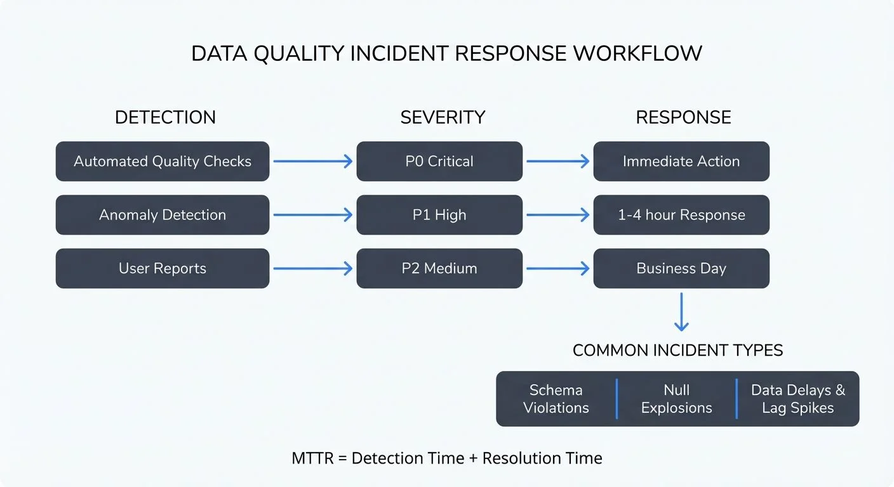

# Data Quality Incidents: Detection, Response, and Prevention

## Outline

1. **What is a Data Quality Incident?**
   - Definition and distinction from normal variance
   - Impact on streaming systems and downstream consumers

2. **Types of Data Quality Incidents**
   - Schema violations and format errors
   - Null explosions and missing data
   - Duplicate records
   - Data delays and lag spikes

3. **Detection Methods**
   - Automated quality checks and validation rules
   - Anomaly detection and statistical monitoring
   - User reports and feedback loops

4. **Severity Classification and Incident Response**
   - Severity levels: critical, high, medium, low
   - Response process: detect, assess, contain, resolve, review
   - Root cause analysis for streaming incidents

5. **Communication and Post-Mortems**
   - Stakeholder notification strategies
   - Status updates during incidents
   - Blameless post-mortem practices

6. **Prevention and Metrics**
   - Data contracts and validation
   - Testing strategies
   - Key metrics: MTTD, MTTR, incident frequency

7. **Building Incident Response Playbooks**
   - Creating runbooks for common scenarios
   - Tools and automation

---

## What is a Data Quality Incident?

A **data quality incident** occurs when data flowing through streaming systems fails to meet established quality standards, resulting in impact to downstream consumers, analytics, or business operations. Unlike normal statistical variance or expected fluctuations in data patterns, incidents represent significant deviations that require human intervention and remediation.

In streaming architectures, data quality incidents are particularly critical because they propagate in real-time to multiple downstream systems. A schema violation in a Kafka topic might cascade to break consumers, corrupt data lakes, and trigger false alerts across monitoring systems. The velocity and volume of streaming data mean that incidents can affect millions of records within minutes if not detected and contained quickly.

The key distinction between an incident and normal variance lies in **impact and deviation from acceptable bounds**. A 5% increase in null values might be within normal operating parameters, while a sudden 50% spike in nulls represents an incident requiring immediate attention. Organizations define these thresholds through **Service Level Objectives (SLOs)**—measurable targets for system reliability and data quality—and data quality contracts that specify acceptable ranges for metrics like completeness, accuracy, and timeliness.

For detailed coverage of these quality dimensions, see [Data Quality Dimensions](https://conduktor.io/glossary/data-quality-dimensions-accuracy-completeness-and-consistency).



<!-- ORIGINAL_DIAGRAM
```
┌──────────────────────────────────────────────────────────────────┐
│        DATA QUALITY INCIDENT RESPONSE WORKFLOW                   │
└──────────────────────────────────────────────────────────────────┘

DETECTION               SEVERITY               RESPONSE
┌──────────┐           ┌──────────┐          ┌──────────┐
│Automated │           │  P0      │          │ Immediate│
│ Quality  │──────────▶│ Critical │─────────▶│ Action   │
│ Checks   │           └──────────┘          └──────────┘
└──────────┘           ┌──────────┐          ┌──────────┐
┌──────────┐           │  P1      │          │ 1-4 hour │
│ Anomaly  │──────────▶│  High    │─────────▶│ Response │
│Detection │           └──────────┘          └──────────┘
└──────────┘           ┌──────────┐          ┌──────────┐
┌──────────┐           │  P2      │          │ Business │
│   User   │──────────▶│  Medium  │─────────▶│   Day    │
│ Reports  │           └──────────┘          └──────────┘
└──────────┘                                        │
                                                    ▼
                            COMMON INCIDENT TYPES
     ┌────────────────┬────────────────┬─────────────────┐
     │ Schema         │ Null           │ Data Delays     │
     │ Violations     │ Explosions     │ & Lag Spikes    │
     └────────────────┴────────────────┴─────────────────┘

         MTTR = Detection Time + Resolution Time
```
-->

## Types of Data Quality Incidents

### Schema Violations and Format Errors

Schema violations occur when incoming data doesn't match the expected structure. In streaming systems using Apache Kafka with Schema Registry, this might manifest as:
- Producers sending data with missing required fields
- Type mismatches (sending strings where integers are expected)
- Addition of unexpected fields that break strict schema enforcement
- Incompatible schema evolution (non-backward compatible changes)

Modern Schema Registry (2025) offers advanced compatibility modes like `FULL_TRANSITIVE` that check compatibility across all schema versions, preventing incidents from incompatible evolution. These incidents often cause immediate consumer failures, as applications cannot deserialize or process malformed records.

For comprehensive schema management practices, see [Schema Registry and Schema Management](https://conduktor.io/glossary/schema-registry-and-schema-management) and [Schema Evolution Best Practices](https://conduktor.io/glossary/schema-evolution-best-practices).

### Null Explosions and Missing Data

A **null explosion** happens when a normally populated field suddenly contains null or missing values at abnormally high rates. Common causes include:
- Upstream service failures that result in partial data
- Configuration errors in data producers
- Database replication lag causing incomplete record retrieval
- API timeouts leading to default null values

Missing critical business data (customer IDs, timestamps, transaction amounts) can invalidate entire analytical pipelines and business reports.

### Duplicate Records

Duplicates in streaming systems arise from:
- Producer retries due to transient network failures
- At-least-once delivery semantics without proper deduplication
- Replay scenarios where data is reprocessed
- Multiple producers writing the same logical events

While some duplication is acceptable in idempotent systems, excessive duplicates skew aggregations, inflate metrics, and waste processing resources.

### Data Delays and Lag Spikes

Timeliness incidents occur when:
- Event-time timestamps show growing lag from processing-time
- Producer throughput drops below expected rates
- Network partitions delay message delivery
- Consumer lag grows beyond acceptable thresholds (e.g., > 1 hour for near-real-time systems)

Delays can render time-sensitive applications ineffective, such as fraud detection or real-time recommendations.

**Modern monitoring (2025)**: Tools like [Kafka Lag Exporter](https://github.com/seglo/kafka-lag-exporter) provide Prometheus metrics for consumer lag with configurable alerting thresholds. Kafka 4.0's KRaft mode eliminates ZooKeeper-related latency issues, reducing incident surface area. For detailed consumer lag strategies, see [Consumer Lag Monitoring](https://conduktor.io/glossary/consumer-lag-monitoring).

## Detection Methods

### Automated Quality Checks and Validation Rules

Proactive monitoring involves continuous validation of streaming data against defined rules:

**Completeness checks**: Monitor null rates, record counts, and required field presence
**Accuracy checks**: Validate data ranges, enum values, and business rule compliance
**Consistency checks**: Verify referential integrity and cross-field relationships
**Timeliness checks**: Measure event-time vs. processing-time lag

**Example validation with Soda Core (2025)**:
```yaml
# checks.yml
checks for orders_stream:
  - missing_count(order_id) = 0
  - invalid_percent(status) < 1%:
      valid values: ['pending', 'completed', 'cancelled']
  - freshness(event_timestamp) < 5m
  - duplicate_count(order_id) < 0.1%
```

**Governance platforms** like Conduktor enable policy enforcement at the Kafka protocol level, validating data quality before it enters topics and preventing bad data from polluting streams. Conduktor Gateway can intercept messages, apply validation rules, and route violations to dead letter queues automatically. For practical implementation, see [Enforcing Data Quality with Conduktor](https://docs.conduktor.io/guide/use-cases/enforce-data-quality) and [Observing Data Quality](https://docs.conduktor.io/guide/use-cases/observe-data-quality).

For comprehensive testing strategies, see [Automated Data Quality Testing](https://conduktor.io/glossary/automated-data-quality-testing) and [Building a Data Quality Framework](https://conduktor.io/glossary/building-a-data-quality-framework).

### Anomaly Detection and Statistical Monitoring

Beyond rule-based validation, statistical anomaly detection identifies unusual patterns:
- Standard deviation analysis for numeric fields
- Time-series forecasting to detect unexpected volume changes
- Distribution drift detection comparing current data to historical baselines
- Outlier detection for individual record values

**2025 ML-based detection**: Modern observability platforms integrate machine learning models trained on historical data patterns to automatically flag deviations. OpenTelemetry provides standardized instrumentation for streaming applications, enabling correlation of data quality metrics with infrastructure signals. These systems can detect subtle incidents like gradual data drift that rule-based checks might miss.

For related drift patterns, see [Data Drift in Streaming](https://conduktor.io/glossary/data-drift-in-streaming) and [Model Drift in Streaming](https://conduktor.io/glossary/model-drift-in-streaming).

### Preventing Incidents with Data Quality Policies

Conduktor Data Quality Policies provide systematic prevention of data quality incidents by creating Rules that define expected message formats and content. These attach to specific topics, enabling centralized quality enforcement. In observe-only mode, Policies record violations without impacting flow; when integrated with Gateway, they validate records before production—blocking non-compliant messages or marking them with violation metadata.

This centralized approach catches schema violations, null explosions, and format errors at the infrastructure level rather than requiring each producer to implement validation independently, ensuring consistent quality standards. For implementation guidance, see [Data Quality Policies](https://docs.conduktor.io/guide/conduktor-concepts/data-quality-policies).

### User Reports and Feedback Loops

Despite automated monitoring, downstream consumers often detect quality issues first:
- Dashboard users noticing missing or incorrect data
- Business stakeholders questioning unexpected metric changes
- Consumers reporting processing errors or unexpected behavior

Establishing clear channels for users to report suspected data quality issues creates a critical feedback loop for incident detection.

## Severity Classification and Incident Response

### Severity Levels

Organizations typically classify incidents across four severity levels:

**Critical (P0)**: Complete data loss, major schema breaks, or incidents affecting critical business operations. Requires immediate response and escalation.

**High (P1)**: Significant data quality degradation affecting multiple systems or important analytical workloads. Response within 1-4 hours.

**Medium (P2)**: Moderate quality issues with workarounds available or limited impact. Response within business day.

**Low (P3)**: Minor issues with minimal impact. Tracked for resolution in normal workflow.

### Incident Response Process

A structured response process ensures consistent handling:

**1. Detect**: Automated monitoring or user report identifies potential incident
**2. Assess**: On-call engineer evaluates severity, scope, and impact
**3. Contain**: Implement immediate mitigation to prevent further damage (pause producers, reroute consumers to dead letter queues, isolate affected data)
**4. Resolve**: Identify root cause and implement fix (repair data, deploy corrected code, adjust configurations)
**5. Review**: Conduct post-mortem to prevent recurrence

For error isolation strategies, see [Dead Letter Queues for Error Handling](https://conduktor.io/glossary/dead-letter-queues-for-error-handling).

### Root Cause Analysis for Streaming Incidents

Effective RCA in streaming systems requires examining multiple layers:
- **Producer layer**: Code changes, configuration updates, dependency failures
- **Infrastructure layer**: Network issues, broker failures, resource exhaustion
- **Schema layer**: Evolution mistakes, registry failures
- **Data source layer**: Upstream system changes, database issues

**Modern tooling (2025)**: OpenTelemetry distributed tracing connects data quality incidents across the entire pipeline—from producer instrumentation through Kafka brokers to consumer processing. Audit logging platforms capture all configuration changes and schema modifications with timestamps, enabling precise correlation with incident onset. Kafka 4.0's improved observability APIs provide richer metadata for incident investigation.

For implementation guidance, see [Distributed Tracing for Kafka Applications](https://conduktor.io/glossary/distributed-tracing-for-kafka-applications) and [Audit Logging for Streaming Platforms](https://conduktor.io/glossary/audit-logging-for-streaming-platforms).

## Communication and Post-Mortems

### Stakeholder Notification Strategies

Timely communication prevents confusion and enables affected teams to take protective action:

- **Immediate notification**: Alert directly impacted consumers and data owners
- **Status page updates**: Provide public incident status for broader organization
- **Regular updates**: Share progress every 30-60 minutes during active incidents
- **Resolution notification**: Confirm when normal operations resume and any required actions

Use targeted communication channels (Slack, PagerDuty, email) based on severity and audience.

### Blameless Post-Mortem Practices

Post-incident reviews focus on **system improvement rather than individual blame**:

1. **Document timeline**: Reconstruct event sequence with precise timestamps
2. **Identify root cause**: Use "five whys" to uncover underlying systemic issues
3. **Analyze contributing factors**: Environmental, organizational, or technical factors that enabled the incident
4. **Define action items**: Specific, assignable improvements with owners and deadlines
5. **Share learnings**: Distribute post-mortem widely to improve organizational knowledge

Blameless culture encourages transparency and prevents future incidents by addressing systemic weaknesses rather than individual errors.

## Prevention and Metrics

### Data Contracts and Validation

**Data contracts** define explicit agreements between producers and consumers about data structure, quality, and SLAs. Contracts specify:
- Required and optional fields
- Data types and formats
- Acceptable value ranges
- Quality thresholds (max null rate, duplicate rate)
- Timeliness guarantees

**Modern contract enforcement (2025)**: Governance platforms like Conduktor enable enforcement of data policies and contracts at the infrastructure level, validating data before it reaches consumers and providing early detection of violations. Conduktor Gateway acts as an intelligent proxy layer, inspecting messages in real-time against contract definitions and preventing violating messages from entering topics.

Schema-based approaches using Protobuf with [buf](https://buf.build/) or Avro with Schema Registry provide compile-time and runtime validation, catching contract violations before deployment.

For contract implementation patterns, see [Data Contracts for Reliable Pipelines](https://conduktor.io/glossary/data-contracts-for-reliable-pipelines).

### Testing Strategies

Preventing incidents requires comprehensive testing:
- **Schema compatibility tests**: Verify evolution doesn't break consumers
- **Data quality unit tests**: Validate transformation logic with edge cases using dbt tests or Great Expectations 1.0+
- **Integration tests**: Test producer-consumer interactions with realistic data
- **Chaos engineering**: Intentionally inject failures to verify detection and recovery

**2025 testing practices**: Modern CI/CD pipelines integrate data quality gates that prevent deployment of code or schema changes that violate contracts. Conduktor Gateway enables controlled chaos testing by injecting schema violations, delays, or duplicates in non-production environments to validate incident response procedures.

For testing methodologies, see [Testing Strategies for Streaming Applications](https://conduktor.io/glossary/testing-strategies-for-streaming-applications), [Great Expectations Data Testing Framework](https://conduktor.io/glossary/great-expectations-data-testing-framework), and [Chaos Engineering for Streaming Systems](https://conduktor.io/glossary/chaos-engineering-for-streaming-systems).

### Key Metrics

Three critical metrics measure incident management effectiveness:

**MTTD (Mean Time to Detect)**: Average time from incident occurrence to detection. Target: < 5 minutes for critical systems.

**MTTR (Mean Time to Resolve)**: Average time from detection to full resolution. Target varies by severity but < 1 hour for P0 incidents.

**Incident Frequency**: Number of quality incidents per week/month, categorized by type and severity. Track trends to measure prevention effectiveness.

## Building Incident Response Playbooks

### Creating Runbooks for Common Scenarios

Playbooks provide step-by-step procedures for frequent incident types:

**Schema violation playbook**:
1. Identify affected topic and producer
2. Check Schema Registry for recent changes
3. Pause affected producer
4. Validate consumer compatibility
5. Roll back schema or update producer code
6. Resume processing and verify recovery

**Null explosion playbook**:
1. Query recent data to quantify impact
2. Identify affected fields and producers
3. Check upstream data sources
4. Implement filtering or default values in consumers
5. Fix root cause in producer
6. Backfill missing data if required

**Duplicate detection playbook**:
1. Measure duplicate rate using unique keys
2. Identify duplicate source (replay, retry, multiple producers)
3. Implement deduplication in affected consumers
4. Correct producer configuration
5. Clean duplicate records if necessary

### Tools and Automation

**Effective incident response (2025) relies on modern tooling**:
- **Automated alerting**: PagerDuty, Opsgenie for on-call escalation with intelligent routing
- **Monitoring and observability**:
  - Grafana, Datadog for real-time visibility into Kafka metrics
  - Kafka Lag Exporter for Prometheus-based consumer lag monitoring
  - OpenTelemetry for distributed tracing across streaming pipelines
- **Data quality platforms**:
  - Soda Core for declarative data quality checks
  - Great Expectations 1.0+ for Python-based validation
  - dbt tests for transformation quality validation
- **Governance and policy enforcement**:
  - Conduktor for Kafka cluster management, governance, and monitoring
  - Conduktor Gateway for protocol-level policy enforcement and chaos testing
- **Runbook automation**: Scripts and Kubernetes operators for common mitigation actions
- **Collaboration tools**: Slack, Microsoft Teams for incident coordination

**Kafka 4.0 benefits**: KRaft mode simplifies incident response by eliminating ZooKeeper dependencies, reducing operational complexity and failure modes. Improved metrics APIs provide richer incident context.

Automation reduces MTTD and MTTR by enabling instant response to common scenarios. For operational best practices, see [Kafka Cluster Monitoring and Metrics](https://conduktor.io/glossary/kafka-cluster-monitoring-and-metrics) and [DataOps for Streaming](https://conduktor.io/glossary/dataops-for-streaming).

## Conclusion

Data quality incidents in streaming systems require proactive detection, rapid response, and systematic prevention. By implementing comprehensive monitoring, clear severity classification, structured response processes, and blameless post-mortems, organizations minimize the impact of quality issues and continuously improve system resilience.

The combination of automated validation, statistical anomaly detection, and well-defined playbooks enables teams to detect incidents quickly and resolve them efficiently. Measuring MTTD, MTTR, and incident frequency provides visibility into improvement trends and helps prioritize prevention efforts.

**2025 best practices** emphasize prevention through data contracts, governance platforms like Conduktor, and comprehensive testing with modern frameworks (Soda Core, Great Expectations 1.0+, dbt tests). Kafka 4.0's KRaft mode and improved observability reduce incident complexity, while OpenTelemetry provides end-to-end visibility across distributed streaming architectures.

For understanding the relationship between data quality and observability, see [Data Quality vs Data Observability: Key Differences](https://conduktor.io/glossary/data-quality-vs-data-observability-key-differences). For incident management patterns, refer to [Data Incident Management and Root Cause Analysis](https://conduktor.io/glossary/data-incident-management-and-root-cause-analysis).

## Related Concepts

- [Building a Data Quality Framework](https://conduktor.io/glossary/building-a-data-quality-framework) - Systematic prevention strategies
- [Automated Data Quality Testing](https://conduktor.io/glossary/automated-data-quality-testing) - Early detection through testing
- [Consumer Lag Monitoring](https://conduktor.io/glossary/consumer-lag-monitoring) - Detecting freshness-related incidents

## Sources and References

- [Site Reliability Engineering: How Google Runs Production Systems](https://sre.google/books/)
- [Incident Response and Management for Data Engineering Teams](https://www.oreilly.com/library/view/fundamentals-of-data/9781098108298/)
- [Great Expectations Documentation: Data Quality Testing](https://docs.greatexpectations.io/)
- [Apache Kafka Operations Guide](https://kafka.apache.org/documentation/#operations)
- [Blameless Post-Mortems and Just Culture](https://www.atlassian.com/incident-management/postmortem/blameless)
