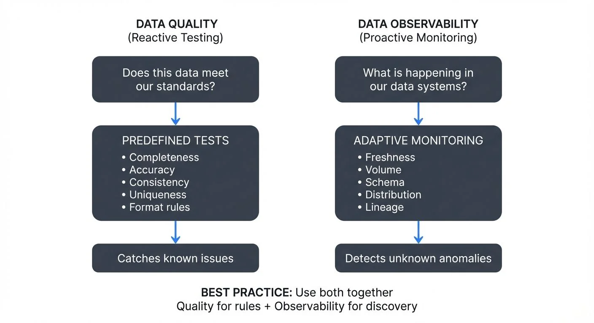

In modern data engineering, ensuring reliable and trustworthy data is paramount. As data pipelines grow more complex and real-time requirements become the norm, two distinct yet complementary approaches have emerged: data quality and data observability. While these terms are often used interchangeably, they represent fundamentally different philosophies and practices. Understanding their differences is crucial for building robust data systems.

## What is Data Quality?

Data quality is a reactive, testing-based approach that validates whether data meets predefined expectations and business rules. Think of it as a checkpoint system where data must pass specific tests before being considered valid.

At its core, data quality answers the question: "Does this data meet our standards?" It involves defining explicit rules and constraints, then verifying that incoming data conforms to these requirements. Common data quality checks include:

- **Completeness**: Are all required fields populated?
- **Accuracy**: Do values fall within expected ranges?
- **Consistency**: Do related data points align across systems?
- **Uniqueness**: Are there unwanted duplicates?
- **Timeliness**: Is data arriving within acceptable time windows?

For example, a data quality test might verify that all customer email addresses follow a valid format, that order amounts are positive numbers, or that timestamps fall within a reasonable range. These tests are typically implemented as assertions in your data pipeline, often using frameworks like [Great Expectations](https://conduktor.io/glossary/great-expectations-data-testing-framework) (GX 1.0+), [dbt tests](https://conduktor.io/glossary/dbt-tests-and-data-quality-checks), or Soda Core.

The strength of data quality lies in its precision. You define exactly what "good" looks like, and your system alerts you when data deviates from these expectations. However, this precision is also a limitation: you can only catch issues you've explicitly tested for. Unknown problems or emerging patterns will slip through undetected.

## What is Data Observability?

Data observability takes a proactive, monitoring-based approach inspired by software observability practices. Rather than testing for specific conditions, observability continuously monitors the behavior and health of your data systems, looking for anomalies and unexpected patterns.

Data observability answers a broader question: "What is happening in our data systems, and why?" For detailed coverage of observability fundamentals, see [What is Data Observability? The Five Pillars](https://conduktor.io/glossary/what-is-data-observability-the-five-pillars). It focuses on five key pillars:

- **Freshness**: Is data arriving on schedule?
- **Volume**: Are record counts within normal ranges?
- **Schema**: Has the structure of data changed unexpectedly?
- **Distribution**: Are value distributions behaving normally?
- **Lineage**: How does data flow through our systems?

Instead of predefined tests, observability systems use baseline metrics, statistical analysis, and machine learning to detect anomalies. Modern observability platforms (as of 2025) increasingly leverage AI-powered anomaly detection that adapts to seasonal patterns, business cycles, and evolving data characteristics. For instance, if your user events table typically receives 10,000 records per hour but suddenly drops to 100, an observability platform would flag this volume anomaly even without an explicit test.

The power of data observability is its ability to surface unknown issues. By monitoring the overall health of your data ecosystem—including integration with OpenTelemetry for distributed tracing and correlation across systems—it can catch problems you didn't anticipate. However, this breadth comes with trade-offs: observability systems may generate false positives and require tuning to understand what constitutes normal behavior.

## Key Differences

### Philosophy

Data quality is prescriptive: you define the rules. Data observability is descriptive: the system learns patterns and detects deviations.

### Coverage

Data quality provides deep validation for known requirements. Data observability provides broad monitoring for unexpected issues.

### Implementation

Data quality tests are explicit assertions in your code. Observability requires instrumentation, metrics collection, and analysis infrastructure.

### Response Time

Data quality catches issues at test execution time, often blocking bad data from propagating. Observability detects trends and anomalies over time, enabling faster root cause analysis.

### Mental Model

Think of data quality as unit tests for your data, while data observability is like application performance monitoring (APM) for your data pipelines.

## Streaming Integration: A Critical Context

The distinction between data quality and observability becomes even more important in streaming environments. Traditional batch processing allows for comprehensive testing before data moves downstream, but streaming systems demand different approaches.

In streaming architectures built on platforms like Apache Kafka, data flows continuously with minimal latency. Modern governance platforms like Conduktor provide comprehensive visibility into Kafka clusters, schema registries, and data flows, bridging the gap between quality testing and observability monitoring. To implement data quality policies in your streaming pipelines, see [Conduktor's Data Quality Policies guide](https://docs.conduktor.io/guide/conduktor-concepts/data-quality-policies) and [Enforcing Data Quality](https://docs.conduktor.io/guide/use-cases/enforce-data-quality).

For streaming use cases:

- **Data quality** can be implemented as stream processors that validate records in real-time, potentially routing invalid data to [dead letter queues](https://conduktor.io/glossary/dead-letter-queues-for-error-handling) for later analysis and reprocessing
- **Data observability** monitors stream health metrics like [consumer lag](https://conduktor.io/glossary/consumer-lag-monitoring), partition distribution, throughput rates, and schema evolution

You might set up data quality rules to validate message schemas against your registry, while simultaneously using observability to monitor whether consumers are keeping up with producers or if topic partition counts are balanced.

The real-time nature of streaming makes observability particularly valuable. Rather than waiting for batch tests to run, observability can alert you within seconds when message volumes drop, lag increases, or data distributions shift unexpectedly.

## Using Both Together

The most effective data reliability strategy combines both approaches. For a comprehensive framework that integrates quality and observability, see [Building a Data Quality Framework](https://conduktor.io/glossary/building-a-data-quality-framework).

1. **Use data quality** for critical business rules and compliance requirements. If customer IDs must be unique or transaction amounts must be positive, enforce these with explicit tests. Implement [automated data quality testing](https://conduktor.io/glossary/automated-data-quality-testing) to catch issues early in your pipelines.

2. **Use data observability** for holistic system health and anomaly detection. Monitor freshness, volume, and distribution to catch emerging issues. Track [data quality dimensions](https://conduktor.io/glossary/data-quality-dimensions-accuracy-completeness-and-consistency) across your entire data ecosystem.

3. **Let observability inform quality rules**. When observability surfaces a recurring anomaly, codify it as a quality test. This creates a feedback loop that continuously strengthens your data contracts.

4. **Use quality test failures to enrich observability context**. When tests fail, capture metadata that helps explain the failure in your observability platform. Modern tools support integration between validation frameworks and observability dashboards.

## Data Contracts: Bridging Quality and Observability

A growing best practice in 2025 is the use of data contracts that formalize expectations between data producers and consumers. These contracts combine elements of both quality testing and observability monitoring:

- **Contract definitions** specify schema, freshness SLAs, volume expectations, and quality thresholds
- **Quality tests** validate that data meets contract specifications
- **Observability monitoring** tracks contract compliance over time and alerts on violations
- **Lineage tracking** identifies impact when contracts are breached

For organizations implementing data contracts, see [Data Contracts for Reliable Pipelines](https://conduktor.io/glossary/data-contracts-for-reliable-pipelines) for implementation patterns.

## Choosing the Right Approach

For data engineers and data quality analysts, consider:

- Start with **data quality** for well-understood, critical requirements
- Add **data observability** as your systems scale and complexity increases
- Implement **observability first** in streaming environments where comprehensive testing isn't feasible
- Use both when reliability is paramount
- Consider **data contracts** to formalize expectations and combine quality + observability practices

## Conclusion

Data quality and data observability aren't competing approaches but complementary strategies for ensuring data reliability. Quality provides precise, rule-based validation for known requirements. Observability offers broad, intelligent monitoring for system health and emerging issues.

Understanding this distinction helps you build more resilient systems. Combining both approaches creates a robust defense against data issues, whether you're working with batch or streaming data.

The goal isn't to choose one over the other but to leverage each approach's strengths: the precision of quality testing and the breadth of observability monitoring. Together, they form a comprehensive data reliability strategy that scales with your organization's needs.

## Related Concepts

- [What is Data Observability: The Five Pillars](https://conduktor.io/glossary/what-is-data-observability-the-five-pillars) - Deep dive into observability fundamentals
- [Building a Data Quality Framework](https://conduktor.io/glossary/building-a-data-quality-framework) - Implementing systematic quality management
- [Data Freshness Monitoring: SLA Management](https://conduktor.io/glossary/data-freshness-monitoring-sla-management) - Timeliness as a quality dimension

## Sources and References

- [The Five Pillars of Data Observability](https://www.montecarlodata.com/blog-what-is-data-observability/)
- [Great Expectations 1.0+ Documentation](https://docs.greatexpectations.io/)
- [Soda Core: Open-Source Data Quality Testing](https://docs.soda.io/soda-core/)
- [Observability Engineering: Achieving Production Excellence](https://www.oreilly.com/library/view/observability-engineering/9781492076438/)
- [Data Quality Fundamentals (Google Cloud)](https://cloud.google.com/architecture/dq-fundamentals)
- [OpenTelemetry for Data Observability](https://opentelemetry.io/)
- [Apache Kafka Monitoring and Observability](https://kafka.apache.org/documentation/#monitoring)
- [Data Contracts: From Ground Zero to Automated Governance](https://www.datamesh-architecture.com/data-contracts)
