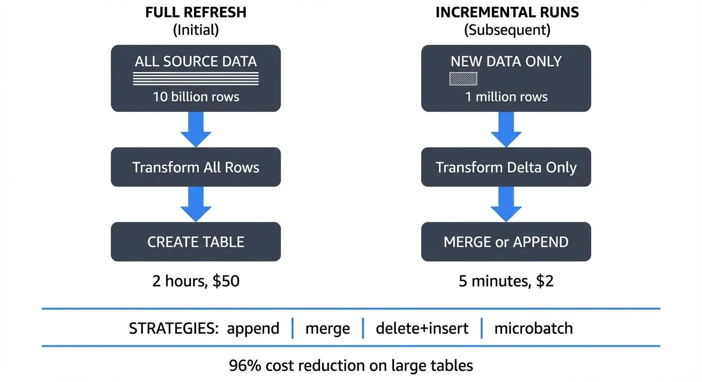

In modern data warehouses, transforming billions of rows daily becomes expensive and time-consuming when using traditional full-refresh approaches. dbt incremental models solve this challenge by processing only new or changed records, dramatically reducing compute costs and transformation times.

<!-- ORIGINAL_DIAGRAM
```
┌──────────────────────────────────────────────────────────────────┐
│         dbt INCREMENTAL MODEL PROCESSING FLOW                    │
└──────────────────────────────────────────────────────────────────┘

FULL REFRESH (Initial)          INCREMENTAL RUNS (Subsequent)
┌─────────────────────┐         ┌─────────────────────┐
│  ALL SOURCE DATA    │         │  NEW DATA ONLY      │
│  ═════════════════  │         │  ▓▓▓                │
│  10 billion rows    │         │  1 million rows     │
└──────────┬──────────┘         └──────────┬──────────┘
           │                               │
           ▼                               ▼
    ┌──────────────┐              ┌──────────────┐
    │  Transform   │              │  Transform   │
    │  All Rows    │              │  Delta Only  │
    └──────┬───────┘              └──────┬───────┘
           │                             │
           ▼                             ▼
    ┌──────────────┐              ┌──────────────┐
    │   CREATE     │              │    MERGE     │
    │   TABLE      │              │  or APPEND   │
    └──────────────┘              └──────┬───────┘
                                         │
           2 hours, $50                  ▼
                                  5 minutes, $2

STRATEGIES:  append  |  merge  |  delete+insert  |  microbatch
             ──────────────────────────────────────────────────
             96% cost reduction on large tables
```
-->

## Understanding Incremental Models

Incremental models operate on a simple but powerful principle: instead of rebuilding entire tables from scratch, they identify and process only the delta, the new or modified records since the last run. This approach transforms what might be hour-long jobs into minute-long operations.

Consider a typical scenario: you have an events table with billions of historical records. A full refresh would reprocess every single event, even though only today's data has changed. An incremental model processes just today's events, appending or merging them into the existing table.

## Basic Incremental Configuration

Let's start with a fundamental incremental model:

```sql
{{
  config(
    materialized='incremental',
    unique_key='event_id'
  )
}}

select
  event_id,
  user_id,
  event_type,
  event_timestamp,
  properties
from {{ source('raw', 'events') }}


  where event_timestamp > (select max(event_timestamp) from {{ this }})

```

This example uses dbt's Jinja templating syntax (the double curly braces `{{ }}`), which allows dynamic SQL generation. The `is_incremental()` macro is crucial, it returns `false` on the first run, building the full table. On subsequent runs, it returns `true`, triggering the filter that selects only new records. The `{{ this }}` reference is a special variable pointing to the current model's table in your data warehouse.

## Merge Strategies Explained

dbt supports multiple strategies for handling incremental updates, each suited to different use cases.

### Append Strategy

The simplest approach, new rows are added without checking for duplicates:

```sql
{{
  config(
    materialized='incremental',
    incremental_strategy='append'
  )
}}

select
  event_id,
  occurred_at,
  event_data
from {{ source('kafka', 'raw_events') }}

  where occurred_at > (select max(occurred_at) from {{ this }})

```

**When to use append**: Choose this strategy for truly immutable event streams where:
- Each record represents a point-in-time event that never changes (clicks, page views, transactions)
- Duplicates are impossible by design, or deduplication happens in an earlier pipeline stage
- You need maximum write performance since no uniqueness checks occur

### Merge Strategy

The merge strategy (default for Snowflake, BigQuery, Databricks) uses `unique_key` to update existing records and insert new ones:

```sql
{{
  config(
    materialized='incremental',
    unique_key='user_id',
    incremental_strategy='merge'
  )
}}

select
  user_id,
  email,
  last_login_at,
  total_purchases,
  updated_at
from {{ source('app_db', 'users') }}

  where updated_at > (select max(updated_at) from {{ this }})

```

This executes as a `MERGE` statement (or equivalent), perfect for slowly changing dimensions where records update over time.

**When to use merge**: Choose this strategy when:
- Records can be updated after initial creation (user profiles, order statuses, product catalogs)
- You need to maintain the latest version of each record
- Your data warehouse supports efficient merge operations (most modern warehouses do)

### Delete+Insert Strategy

For data warehouses lacking efficient merge operations (like Redshift), delete+insert removes matching records before inserting new ones:

```sql
{{
  config(
    materialized='incremental',
    unique_key='order_id',
    incremental_strategy='delete+insert'
  )
}}

select
  order_id,
  customer_id,
  order_status,
  order_total,
  updated_at
from {{ source('postgres', 'orders') }}

  where updated_at >= current_date - interval '7 days'

```

This strategy processes batches (like the last 7 days) and completely refreshes those records, handling late-arriving updates effectively.

**When to use delete+insert**: Choose this strategy when:
- Your warehouse lacks efficient merge operations (older Redshift clusters)
- You need to handle late-arriving data within a specific window
- You want transactional consistency within each batch

### Microbatch Strategy (2025 Best Practice)

For time-series data, dbt 1.6+ introduced the microbatch strategy, which has become the standard approach for incremental processing in 2025:

```sql
{{
  config(
    materialized='incremental',
    incremental_strategy='microbatch',
    unique_key='event_id',
    event_time='event_timestamp',
    batch_size='hour'
  )
}}

select
  event_id,
  user_id,
  event_type,
  event_timestamp,
  session_data
from {{ source('raw', 'events') }}
```

Microbatch automatically divides your data into time-based batches and processes them independently. This provides:
- **Automatic backfill orchestration**: dbt handles missing time periods intelligently
- **Parallel processing**: Multiple batches can run simultaneously
- **Idempotent reruns**: Each batch produces identical results regardless of execution timing
- **Built-in late data handling**: Overlapping windows catch late arrivals without custom logic

**When to use microbatch**: This is the recommended approach for any time-series data with consistent timestamps, logs, events, IoT sensor data, or streaming analytics.

## Streaming Integration with Kafka

Modern analytics pipelines increasingly integrate streaming data. When connecting dbt to Kafka topics, incremental models become essential for managing continuous data flows.

[Conduktor](https://www.conduktor.io/) provides enterprise-grade Kafka management, allowing you to monitor, transform, and route streaming data with features like [schema registry integration](https://docs.conduktor.io/guide/manage-kafka/kafka-resources/schema-registry), data quality rules, and real-time governance. Learn more about managing [Kafka topics](https://docs.conduktor.io/guide/manage-kafka/kafka-resources/topics) and [Kafka Connect](https://docs.conduktor.io/guide/manage-kafka/kafka-resources/kafka-connect) for streaming-to-warehouse pipelines. When paired with dbt incremental models, you can efficiently transform streaming data into analytics-ready tables:

```sql
{{
  config(
    materialized='incremental',
    unique_key=['event_id', 'partition'],
    incremental_strategy='append',
    on_schema_change='sync_all_columns'
  )
}}

with kafka_stream as (
  select
    value:event_id::varchar as event_id,        -- :: is Snowflake's cast operator
    value:user_id::varchar as user_id,
    value:action::varchar as action,
    to_timestamp(value:timestamp::bigint) as event_timestamp,
    _partition as partition,                    -- Kafka metadata columns from connector
    _offset as kafka_offset
  from {{ source('kafka_connector', 'user_activity_topic') }}
  
    where _offset > (select max(kafka_offset) from {{ this }})
  
)

select
  event_id,
  user_id,
  action,
  event_timestamp,
  partition,
  kafka_offset,
  current_timestamp() as processed_at
from kafka_stream
```

**Key concepts explained**:
- **Kafka offsets**: Sequential IDs for each message in a partition. Using offsets as your incremental filter guarantees exactly-once processing, each message is processed exactly one time, preventing duplicates or missing data.
- **Schema evolution handling**: The `on_schema_change='sync_all_columns'` option automatically adds new columns when your Kafka topic schema changes, preventing pipeline failures.
- **Metadata columns**: Most Kafka connectors (like Snowflake's Kafka connector) expose `_partition` and `_offset` as columns, enabling offset-based incremental processing.

For production Kafka integration, use Conduktor's schema registry to manage Avro/Protobuf schemas and enforce data contracts across your streaming pipeline.

## Performance Optimization Patterns

### Partitioned Tables

Combine incremental models with table partitioning for maximum efficiency. This BigQuery example shows the configuration syntax:

```sql
{{
  config(
    materialized='incremental',
    unique_key='transaction_id',
    partition_by={
      "field": "transaction_date",
      "data_type": "date",
      "granularity": "day"
    }
  )
}}
```

This limits scans to relevant partitions, dramatically reducing query costs. For example, querying last week's transactions scans only 7 partitions instead of the entire table, a typical cost reduction of 90%+ for large historical tables.

**Other warehouse syntax**:
- **Snowflake**: Use `cluster_by=['date_column']` for automatic clustering
- **Databricks**: Specify partitioning in table properties: `partition_cols=['date']`

### Clustered Keys

Add clustering for frequently filtered columns:

```sql
{{
  config(
    materialized='incremental',
    unique_key='session_id',
    cluster_by=['user_id', 'session_start']
  )
}}
```

### Lookback Windows

For late-arriving data, implement lookback windows:

```sql

  where event_date >= (select max(event_date) - interval '3 days' from {{ this }})

```

This reprocesses the last 3 days, catching late arrivals while avoiding full refreshes. Late data arrives due to:
- **Clock skew**: Different systems having slightly different time clocks
- **Network delays**: Temporary connectivity issues causing message delays
- **Data pipeline latency**: Upstream processing taking longer than expected

### Incremental Predicates (dbt 1.7+)

For more efficient filtering, especially with partitioned tables, use incremental predicates to push filters down to the source query:

```sql
{{
  config(
    materialized='incremental',
    unique_key='order_id',
    incremental_predicates=[
      "date_partition >= dateadd(day, -3, current_date)"
    ]
  )
}}

select * from {{ ref('staging_orders') }}

  where updated_at > (select max(updated_at) from {{ this }})

```

The `incremental_predicates` filter applies to both the source data and the existing table during merge operations, reducing the amount of data scanned.

## Testing and Monitoring

Always implement tests for incremental models:

```yaml
models:
  - name: incremental_events
    tests:
      - dbt_utils.recency:
          datepart: hour
          field: event_timestamp
          interval: 2
    columns:
      - name: event_id
        tests:
          - unique
          - not_null
```

**2025 Monitoring Options**:

- **dbt Cloud**: Built-in observability with model timing, row counts, and test results
- **Elementary Data**: Open-source data observability that monitors anomalies, schema changes, and data quality issues directly in your warehouse
- **dbt Mesh**: For large organizations, implement cross-project dependencies and centralized monitoring across multiple dbt projects
- **Custom macros**: Log metrics (row counts, runtime, error rates) to dedicated monitoring tables for trend analysis

Real-world example: A properly configured incremental model on a 5 billion row events table reduces processing from 2 hours (full refresh, $50 in compute) to 5 minutes (incremental, $2 in compute), a 96% cost reduction.

## When NOT to Use Incremental Models

While incremental models offer significant benefits, they're not always the right choice:

- **Small tables** (< 1 million rows): Full refresh is simpler and fast enough
- **Frequently changing dimensions**: If >50% of rows update each run, full refresh may be faster
- **Complex business logic**: When your transformation logic itself changes frequently, full refreshes ensure consistency
- **Initial development**: Start with full refresh (`materialized='table'`), then optimize to incremental once logic stabilizes

Consider dbt **snapshots** (Type 2 Slowly Changing Dimensions) instead of incremental models when you need to track the full history of how records change over time, not just the current state.

## Common Pitfalls and Troubleshooting

**Forgetting the initial load**: Always test your model with a full refresh (`dbt run --full-refresh`) to ensure it works without the incremental filter.

**Ignoring idempotency**: Incremental models should produce identical results whether run once or multiple times, critical for backfills and reruns. Test this by running your model twice and comparing results.

**Over-relying on timestamps**: Late-arriving data can cause missed records. Solutions:
- Use sequence numbers or Kafka offsets instead of timestamps when available
- Implement lookback windows to reprocess recent data
- Use the microbatch strategy which handles this automatically

**Common error: "Compilation Error in model"**: Usually indicates syntax errors in Jinja logic. Check that all `` blocks have matching `` tags.

**Duplicate records despite unique_key**: Verify your unique_key is truly unique with a test. Composite keys require list syntax: `unique_key=['col1', 'col2']`.

## Conclusion

Incremental models represent a fundamental shift from batch-oriented to continuous transformation patterns. By processing only what's changed, they enable real-time analytics at scale while controlling costs. Whether you're integrating Kafka streams with Conduktor or transforming traditional database changes, mastering incremental strategies is essential for modern analytics engineering.

**Quick decision guide**:
- **Immutable events** → Use `microbatch` (2025 best practice) or `append`
- **Updating dimensions** → Use `merge`
- **Late-arriving data in batches** → Use `delete+insert`
- **Real-time streams** → Use `append` with Kafka offsets

Start with simple strategies for immutable events, graduate to merge strategies for changing dimensions, and leverage streaming offsets for real-time pipelines. With proper testing, monitoring via Elementary Data or dbt Cloud, and the right incremental strategy, you can achieve 90%+ cost reductions while maintaining data freshness.

## Related Concepts

- [dbt Tests and Data Quality Checks](/dbt-tests-and-data-quality-checks) - Validating incremental models to ensure data quality
- [Streaming ETL vs Traditional ETL](/streaming-etl-vs-traditional-etl) - How incremental models bridge batch and streaming paradigms
- [Data Contracts for Reliable Pipelines](/data-contracts-for-reliable-pipelines) - Defining expectations for incremental model inputs

## Sources and References

- [dbt Documentation: Incremental Models](https://docs.getdbt.com/docs/build/incremental-models)
- [dbt Microbatch Strategy Guide](https://docs.getdbt.com/docs/build/incremental-microbatch)
- [dbt Best Practices: Incremental Model Strategies](https://docs.getdbt.com/best-practices/materializations/2-incremental-models)
- [Apache Kafka Consumer Offsets Documentation](https://kafka.apache.org/documentation/#consumerapi)
- [Conduktor Platform: Kafka Management and Governance](https://www.conduktor.io/)
- [Elementary Data: Open-Source Data Observability](https://www.elementary-data.com/)
- [Snowflake MERGE Statement Guide](https://docs.snowflake.com/en/sql-reference/sql/merge)
- [dbt Snapshots Documentation](https://docs.getdbt.com/docs/build/snapshots)
