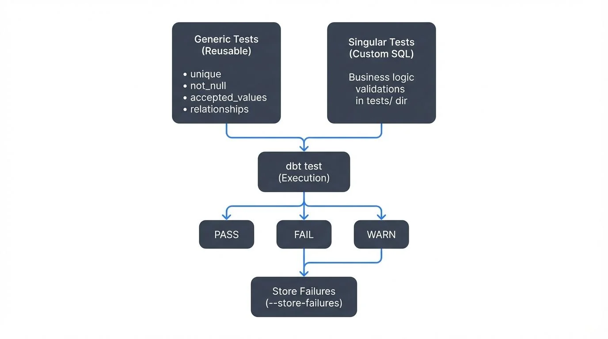

Data quality is the foundation of trustworthy analytics. As data pipelines grow in complexity, ensuring data integrity becomes critical. dbt (data build tool) provides a robust testing framework that allows Analytics Engineers and Data Quality Analysts to define, execute, and monitor data quality checks throughout the transformation pipeline.

<!-- ORIGINAL_DIAGRAM
```
┌─────────────────────────────────────────────────────────────────┐
│                     dbt Testing Framework                       │
├─────────────────────────────────────────────────────────────────┤
│                                                                 │
│  ┌──────────────────┐         ┌──────────────────┐            │
│  │  Generic Tests   │         │  Singular Tests  │            │
│  │  (Reusable)      │         │  (Custom SQL)    │            │
│  ├──────────────────┤         ├──────────────────┤            │
│  │ • unique         │         │ Business logic   │            │
│  │ • not_null       │         │ validations      │            │
│  │ • accepted_values│         │ in tests/ dir    │            │
│  │ • relationships  │         │                  │            │
│  └────────┬─────────┘         └────────┬─────────┘            │
│           │                            │                       │
│           └──────────┬─────────────────┘                       │
│                      ▼                                         │
│           ┌────────────────────┐                               │
│           │   dbt test         │                               │
│           │   (Execution)      │                               │
│           └─────────┬──────────┘                               │
│                     │                                          │
│         ┌───────────┼───────────┐                             │
│         ▼           ▼           ▼                             │
│    ┌────────┐  ┌────────┐  ┌────────┐                        │
│    │ PASS   │  │ FAIL   │  │ WARN   │                        │
│    └────────┘  └────────┘  └────────┘                        │
│                     │                                          │
│                     ▼                                          │
│           ┌───────────────────┐                               │
│           │ Store Failures    │                               │
│           │ (--store-failures)│                               │
│           └───────────────────┘                               │
└─────────────────────────────────────────────────────────────────┘
```
-->

## Understanding dbt's Testing Framework

dbt's testing approach treats data quality as code, enabling version control, peer review, and automated validation. Tests in dbt are essentially SELECT queries that return failing rows. If a test returns zero rows, it passes; any rows returned indicate failures that need attention.

### Generic Tests vs. Singular Tests

dbt offers two primary testing approaches:

**Generic tests** are reusable, parameterized tests that can be applied to any column or model. The four built-in generic tests are:

- `unique`: Ensures all values in a column are unique
- `not_null`: Validates that a column contains no null values
- `accepted_values`: Confirms values match a predefined list
- `relationships`: Enforces referential integrity between tables (ensures foreign key values exist in the referenced table)

**Singular tests** are custom SQL queries stored in the `tests/` directory, providing flexibility for complex business logic validation.

## Implementing Basic Data Quality Checks

Let's start with a practical example. Consider a customer orders model where we need to ensure data quality:

```yaml
# models/schema.yml
version: 2

models:
  - name: fct_orders
    description: "Fact table containing order transactions"
    columns:
      - name: order_id
        description: "Unique identifier for each order"
        tests:
          - unique
          - not_null

      - name: customer_id
        description: "Foreign key to customers dimension"
        tests:
          - not_null
          - relationships:
              to: ref('dim_customers')
              field: customer_id

      - name: order_status
        description: "Current status of the order"
        tests:
          - accepted_values:
              values: ['pending', 'processing', 'shipped', 'delivered', 'cancelled']

      - name: order_amount
        description: "Total order amount in USD"
        tests:
          - not_null
```

This example uses the standard built-in tests. For more advanced validations, you can leverage community packages like **dbt-utils** and **dbt-expectations**, which provide additional test types. Install them via `packages.yml`:

```yaml
# packages.yml
packages:
  - package: dbt-labs/dbt_utils
    version: 1.3.0
  - package: calogica/dbt_expectations
    version: 0.10.4
```

Then run `dbt deps` to install. Here's an extended example using these packages:

```yaml
# models/schema.yml (extended)
models:
  - name: fct_orders
    columns:
      - name: order_amount
        tests:
          - not_null
          - dbt_utils.expression_is_true:
              expression: ">= 0"

      - name: created_at
        tests:
          - dbt_expectations.expect_column_values_to_be_between:
              min_value: "'2020-01-01'"
              max_value: "CURRENT_DATE + INTERVAL '1 day'"
```

Running `dbt test` executes all defined tests and reports failures, enabling quick identification of data quality issues. A successful test run looks like:

```bash
$ dbt test
Running with dbt=1.8.0
Found 5 models, 12 tests, 0 snapshots, 0 analyses, 0 macros, 0 operations, 0 seed files, 0 sources

12:34:56  Running with dbt=1.8.0
12:34:57  1 of 12 START test not_null_fct_orders_order_id ...................... [RUN]
12:34:57  1 of 12 PASS not_null_fct_orders_order_id ............................ [PASS in 0.12s]
12:34:57  2 of 12 START test unique_fct_orders_order_id ........................ [RUN]
12:34:57  2 of 12 FAIL 3 unique_fct_orders_order_id ............................ [FAIL 3 in 0.15s]

Completed with 1 error and 0 warnings:

Failure in test unique_fct_orders_order_id (models/schema.yml)
  Got 3 results, configured to fail if != 0

  compiled Code at target/compiled/my_project/models/schema.yml/unique_fct_orders_order_id.sql
```

Failed tests indicate data quality issues requiring investigation. Use `dbt test --store-failures` to save failing rows for analysis.

## Advanced Testing with Custom Assertions

Beyond generic tests, singular tests enable complex validations. Create a file `tests/assert_order_totals_match.sql`:

```sql
-- Validate that order totals equal sum of line items
WITH order_totals AS (
    SELECT
        order_id,
        order_amount
    FROM {{ ref('fct_orders') }}
),

line_item_totals AS (
    SELECT
        order_id,
        SUM(quantity * unit_price) AS calculated_total
    FROM {{ ref('fct_order_lines') }}
    GROUP BY order_id
)

SELECT
    o.order_id,
    o.order_amount,
    l.calculated_total,
    ABS(o.order_amount - l.calculated_total) AS difference
FROM order_totals o
INNER JOIN line_item_totals l
    ON o.order_id = l.order_id
WHERE ABS(o.order_amount - l.calculated_total) > 0.01
```

This test ensures financial accuracy by validating that order totals match the sum of their line items, with a small tolerance for rounding differences.

## Unit Testing SQL Models (dbt v1.8+)

A major advancement in dbt testing arrived with **unit tests** in dbt v1.8 (2024). Unlike data tests that run against your actual data warehouse, unit tests validate transformation logic using mock data, similar to unit tests in software engineering.

Unit tests are defined in YAML and test specific models with predefined inputs and expected outputs:

```yaml
# models/schema.yml
unit_tests:
  - name: test_order_total_calculation
    model: fct_orders
    given:
      - input: ref('stg_orders')
        rows:
          - {order_id: 1, subtotal: 100.00, tax_rate: 0.10, shipping: 5.00}
          - {order_id: 2, subtotal: 50.00, tax_rate: 0.10, shipping: 3.00}
    expect:
      rows:
        - {order_id: 1, order_amount: 115.00}
        - {order_id: 2, order_amount: 58.00}

  - name: test_handles_null_shipping
    model: fct_orders
    given:
      - input: ref('stg_orders')
        rows:
          - {order_id: 3, subtotal: 100.00, tax_rate: 0.10, shipping: null}
    expect:
      rows:
        - {order_id: 3, order_amount: 110.00}
```

Run unit tests with `dbt test --select test_type:unit`. This provides fast feedback during development without needing actual data, making it ideal for:

- Testing edge cases (nulls, zeros, negative values)
- Validating complex calculation logic
- Regression testing when refactoring models
- Development environments where production data isn't available

**Best practice**: Combine unit tests for logic validation with data tests for data quality validation. Unit tests ensure your code works correctly; data tests ensure your data meets quality standards.

## Test Coverage and Quality Metrics

Measuring test coverage helps identify gaps in your data quality strategy. Use dbt packages like `dbt-coverage` to analyze which models and columns lack tests:

```bash
dbt-coverage compute documentation --cov-report coverage-doc.json
dbt-coverage compute test --cov-report coverage-test.json
```

Aim for comprehensive coverage on critical business metrics and primary keys. Not every column requires testing, but understanding your coverage helps prioritize testing efforts.

## Streaming Integration and Real-Time Data Quality

Modern data architectures increasingly incorporate streaming data. While dbt traditionally operates on batch transformations, integrating with streaming platforms enables near-real-time quality validation.

### Streaming Data Quality Integration

Kafka management platforms can complement dbt's testing framework for streaming scenarios. Here's how to architect an integrated approach:

**Architecture Pattern:**
1. Stream events flow through Kafka topics
2. Governance platforms validate schema compliance and basic data quality rules
3. Data lands in your data warehouse (incremental materialization)
4. dbt tests run on micro-batches to validate transformations
5. Failed tests trigger alerts through monitoring systems

Example incremental model with streaming considerations:

```sql
-- models/fct_streaming_events.sql
{{
    config(
        materialized='incremental',
        unique_key='event_id',
        on_schema_change='fail'  -- Fail if upstream schema changes unexpectedly
    )
}}

SELECT
    event_id,
    user_id,
    event_type,
    event_timestamp,
    properties,
    _kafka_partition,  -- Kafka metadata for debugging and partitioning
    _kafka_offset      -- Kafka metadata for exactly-once processing
FROM {{ source('kafka_raw', 'user_events') }}


    -- Only process new events since last run
    WHERE event_timestamp > (SELECT MAX(event_timestamp) FROM {{ this }})

```

**Note**: When streaming data from Kafka to your warehouse, many connectors (Kafka Connect, Fivetran, Airbyte) automatically add metadata columns like `_kafka_partition` and `_kafka_offset`. These are valuable for debugging data issues and ensuring exactly-once processing semantics.

Corresponding tests for streaming data:

```yaml
# models/schema.yml
models:
  - name: fct_streaming_events
    tests:
      # Ensure no duplicate events (composite uniqueness)
      # This catches cases where the same event_id appears with different timestamps
      - dbt_utils.unique_combination_of_columns:
          combination_of_columns:
            - event_id
            - event_timestamp
    columns:
      - name: event_id
        tests:
          - not_null

      - name: event_timestamp
        tests:
          - not_null
          # Validate events aren't too far in the future (clock skew tolerance)
          - dbt_utils.expression_is_true:
              expression: "<= CURRENT_TIMESTAMP + INTERVAL '5 minutes'"
          # Check for reasonable recency (catch stuck pipelines)
          - dbt_utils.expression_is_true:
              expression: ">= CURRENT_TIMESTAMP - INTERVAL '7 days'"
              config:
                severity: warn  # Warn instead of failing for old data
```

### Orchestrating Quality Checks

For streaming workflows, consider running dbt tests on a schedule (e.g., every 15 minutes) to catch issues quickly:

```yaml
# .github/workflows/dbt-streaming-tests.yml
name: Streaming Data Quality Checks
on:
  schedule:
    - cron: '*/15 * * * *'  # Every 15 minutes

jobs:
  test:
    runs-on: ubuntu-latest
    steps:
      - uses: actions/checkout@v4
      - name: Set up Python
        uses: actions/setup-python@v5
        with:
          python-version: '3.11'
      - name: Install dbt
        run: |
          pip install dbt-core dbt-snowflake  # or your warehouse adapter
      - name: Run dbt tests on streaming models
        run: |
          dbt test --select tag:streaming --fail-fast
```

**Modern Alternative**: For teams using dbt Cloud (2024-2025), leverage built-in CI/CD and scheduled runs instead of managing GitHub Actions:

```yaml
# dbt_cloud.yml (dbt Cloud configuration)
jobs:
  - name: Streaming Quality Checks
    schedule: "*/15 * * * *"  # Every 15 minutes
    commands:
      - dbt test --select tag:streaming
    on_failure:
      - notify_slack: "#data-alerts"
      - create_incident: true
```

dbt Cloud provides integrated monitoring, automatic retries, and observability features that simplify production data quality operations.

## Best Practices for Data Quality at Scale

1. **Start with critical paths**: Focus testing efforts on models that directly impact business decisions

2. **Test early and often**: Run tests in development, CI/CD, and production environments

3. **Document test intent**: Add clear descriptions to help team members understand validation logic

4. **Configure test severity appropriately**: Use `severity: warn` for non-critical issues and `severity: error` for critical failures:
   ```yaml
   # dbt_project.yml
   tests:
     +store_failures: true  # Save failing rows for investigation
     +store_failures_as: table  # or 'view'
     +schema: dbt_test_failures

   # Individual test configuration
   models:
     - name: fct_orders
       columns:
         - name: order_amount
           tests:
             - not_null  # Critical - fails the build
             - dbt_utils.expression_is_true:
                 expression: ">= 0"
                 config:
                   severity: warn  # Non-critical - warns but doesn't fail
   ```

5. **Store test failures for analysis**: Enable `store_failures: true` to save failing rows in your warehouse, making debugging faster

6. **Monitor test performance**: Track test execution times to prevent bottlenecks. Use `dbt test --select state:modified+` to test only changed models in CI

7. **Integrate with alerting**: Connect test failures to Slack, PagerDuty, or other notification systems

8. **Use Elementary Data for observability**: Consider data observability tools like Elementary (open-source) for automatic anomaly detection and test result dashboards

## Conclusion

dbt's testing framework transforms data quality from an afterthought into a first-class concern. Modern dbt (v1.8+) provides a comprehensive testing toolkit:

- **Data tests** validate your actual data meets quality standards
- **Unit tests** ensure transformation logic works correctly with mock data
- **Severity configurations** allow graceful degradation for non-critical issues
- **Store failures** enables deep investigation of quality issues

By combining generic tests for common patterns, singular tests for complex business logic, unit tests for transformation validation, and integration with streaming platforms, teams can build resilient data pipelines that maintain quality from source to consumption.

The key is treating tests as living documentation that evolves with your data models. As your understanding of data quality requirements deepens, continuously refine your testing strategy to catch issues before they impact stakeholders. With 2025's expanded testing capabilities, dbt provides enterprise-grade data quality assurance that scales with your organization.

## Related Concepts

- [Great Expectations: Data Testing Framework](/great-expectations-data-testing-framework) - Complementary testing framework for data validation beyond dbt
- [Automated Data Quality Testing](/automated-data-quality-testing) - Broader patterns for automated testing across data pipelines
- [Data Quality Dimensions: Accuracy, Completeness, and Consistency](/data-quality-dimensions-accuracy-completeness-and-consistency) - Understanding what to test for

## Sources and References

- [dbt Documentation: Data Tests](https://docs.getdbt.com/docs/build/data-tests)
- [dbt Documentation: Unit Tests](https://docs.getdbt.com/docs/build/unit-tests)
- [dbt Utils Package: Advanced Testing](https://github.com/dbt-labs/dbt-utils)
- [dbt Expectations Package](https://github.com/calogica/dbt-expectations)
- [dbt Best Practices: Testing Guide](https://docs.getdbt.com/best-practices/how-we-structure/1-guide-overview)
- [Elementary Data: Open-Source Data Observability](https://docs.elementary-data.com/)
- [dbt Cloud: Continuous Integration](https://docs.getdbt.com/docs/deploy/continuous-integration)
- [Great Expectations Integration with dbt](https://docs.greatexpectations.io/docs/deployment_patterns/how_to_use_great_expectations_with_dbt)
- [Analytics Engineering: Testing and Data Quality](https://www.getdbt.com/analytics-engineering/transformation/data-quality/)
