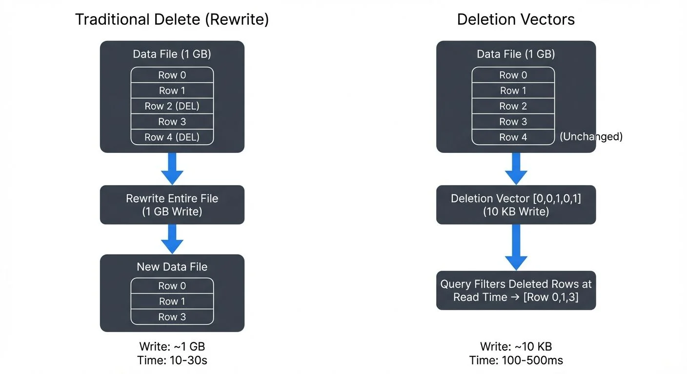

Row-level modifications in large-scale data lakes have traditionally been expensive operations. When you need to delete or update a few rows in a multi-gigabyte Parquet file, the standard approach requires rewriting the entire file. This write amplification problem becomes particularly acute in scenarios with frequent small updates, such as GDPR compliance deletions, real-time corrections, or slowly changing dimensions.

Delta Lake's deletion vectors feature, introduced in Delta Lake 2.3.0 (2023), addresses this challenge by enabling efficient row-level deletes without rewriting data files. As of 2025, this feature is mature and available in Delta Lake 3.x+ with enhanced performance characteristics and improved integration with modern lakehouse features like Liquid Clustering and UniForm. This article explores how deletion vectors work, their performance characteristics, and best practices for leveraging them in production environments.

<!-- ORIGINAL_DIAGRAM
```
Traditional Delete (Rewrite)          Deletion Vectors
─────────────────────────────          ────────────────

┌───────────────────┐                  ┌───────────────────┐
│ Data File (1 GB)  │                  │ Data File (1 GB)  │
│ ┌───────────────┐ │                  │ ┌───────────────┐ │
│ │ Row 0         │ │                  │ │ Row 0         │ │
│ │ Row 1         │ │                  │ │ Row 1         │ │
│ │ Row 2 (DEL)   │ │                  │ │ Row 2         │ │ (Unchanged)
│ │ Row 3         │ │                  │ │ Row 3         │ │
│ │ Row 4 (DEL)   │ │                  │ │ Row 4         │ │
│ └───────────────┘ │                  │ └───────────────┘ │
└─────────┬─────────┘                  └───────────────────┘
          │                                      │
          ▼                                      ▼
┌─────────────────────┐                ┌─────────────────────┐
│ Rewrite Entire File │                │ Deletion Vector     │
│    (1 GB Write)     │                │  [0,0,1,0,1]        │
│                     │                │  (10 KB Write)      │
└─────────┬───────────┘                └──────────┬──────────┘
          │                                       │
          ▼                                       ▼
┌───────────────────┐                  ┌───────────────────┐
│ New Data File     │                  │  Query Filters    │
│ ┌───────────────┐ │                  │  Deleted Rows at  │
│ │ Row 0         │ │                  │   Read Time       │
│ │ Row 1         │ │                  │ → [Row 0,1,3]     │
│ │ Row 3         │ │                  └───────────────────┘
│ └───────────────┘ │
└───────────────────┘

Write: ~1 GB                           Write: ~10 KB
Time: 10-30s                           Time: 100-500ms
```
-->

## What Are Deletion Vectors?

Deletion vectors are a metadata-based approach to marking rows as deleted without physically removing them from Parquet files. Instead of rewriting entire files when deleting rows, Delta Lake maintains a bitmap structure (a space-efficient data structure where each bit represents whether a row is deleted, essentially a list of true/false flags, one per row) that tracks which rows should be considered deleted during query execution.

Each deletion vector is a compact binary structure that encodes the positions of deleted rows within a specific data file. These vectors are stored separately from the data files themselves, typically as part of the Delta transaction log or as small sidecar files (separate metadata files stored alongside the data) referenced by the log.

Here's a simplified example of how a deletion vector works:
```
Data file: [row0, row1, row2, row3, row4]
Deletion vector: [0, 0, 1, 0, 1]  // Bitmap marks rows 2 and 4 as deleted
Query result: [row0, row1, row3]  // Deleted rows filtered at read time
```

The key innovation is that deletion vectors decouple logical deletion from physical file rewriting. When a query reads a data file with an associated deletion vector, the query engine filters out the marked rows at read time, presenting a consistent view of the data without the write overhead. This means queries do slightly more work at read time, but avoid massive write overhead (typically adding 5-15% read overhead while reducing write volume by 100-1000x).

## How Deletion Vectors Work

When you execute a DELETE operation on a Delta table with deletion vectors enabled, the following process occurs:

1. **Row Identification**: Delta Lake identifies which data files contain rows matching the delete predicate
2. **Vector Creation**: For each affected file, a deletion vector is created or updated to mark the deleted row positions
3. **Metadata Update**: The transaction log is updated with references to the deletion vectors, but the original data files remain unchanged
4. **Read-Time Filtering**: Subsequent queries consult both the data files and their deletion vectors to return only non-deleted rows

**Concurrent Delete Handling**: Starting with Delta Lake 3.0 (2024), deletion vectors support improved optimistic concurrency control. Multiple writers can delete different rows in the same file simultaneously, with automatic conflict resolution at commit time. This enables higher throughput for multi-writer DELETE workloads without the coordination overhead of traditional file-level locking.

Consider this example:

```sql
-- Enable deletion vectors on a new table
CREATE TABLE user_events (
  user_id BIGINT,
  event_type STRING,
  timestamp TIMESTAMP,
  data STRING
)
USING DELTA
TBLPROPERTIES ('delta.enableDeletionVectors' = 'true');

-- Insert sample data
INSERT INTO user_events VALUES
  (1001, 'login', '2025-01-15 10:00:00', '{"ip": "192.168.1.1"}'),
  (1002, 'purchase', '2025-01-15 10:15:00', '{"amount": 99.99}'),
  (1003, 'logout', '2025-01-15 10:30:00', '{}');

-- Delete specific rows (uses deletion vectors)
DELETE FROM user_events WHERE user_id = 1002;
```

In this example, instead of rewriting the entire Parquet file, Delta Lake creates a deletion vector marking the row with `user_id = 1002` as deleted. The physical file remains unchanged, but queries will exclude this row.

### UPDATE Operations with Deletion Vectors

While DELETE operations only mark rows as deleted, UPDATE operations in Delta Lake 3.0+ can leverage deletion vectors for the "delete" phase of the read-modify-write cycle:

```sql
-- Update uses deletion vectors internally
UPDATE user_events
SET data = '{"ip": "10.0.0.1"}'
WHERE user_id = 1001;

-- Internally: marks old row deleted via deletion vector,
-- writes new row to new data file
```

This hybrid approach reduces write amplification for updates by avoiding full file rewrites while still creating new data for the updated rows. The old version is marked as deleted using a deletion vector, and the new version is written to a separate data file, minimizing the I/O overhead.

## Performance Benefits and Trade-offs

The primary advantage of deletion vectors is **reduced write amplification**. Traditional delete operations on columnar formats require a copy-on-write approach (a pattern where any modification creates a new copy of the entire file) where entire files are rewritten. For large files, this means writing gigabytes of data to delete a handful of rows.

### Performance Comparison

Consider a table with 1GB data files where you need to delete 1% of rows:

**Traditional Approach:**
- Files rewritten: 1GB per file
- I/O overhead: Full file scan + full file write
- Latency: Proportional to file size (~10-30 seconds per file)

**Deletion Vectors Approach:**
- Files rewritten: 0 bytes
- Metadata written: ~10-100KB deletion vector
- Latency: Near-constant time (~100-500ms)

This represents a **100-1000x reduction** in write volume for small delete operations.

### Trade-offs to Consider

While deletion vectors offer significant write performance improvements, they introduce read-time overhead:

1. **Read Performance**: Queries must load and apply deletion vectors, adding small overhead (typically 5-15%)
2. **File Fragmentation**: Deleted rows still occupy storage until compaction runs
3. **Compaction Requirements**: Periodic OPTIMIZE operations are needed to physically remove deleted rows

```sql
-- Check deletion vector statistics
DESCRIBE DETAIL user_events;

-- Compact files to remove deleted rows physically
OPTIMIZE user_events;

-- For tables with frequent deletes, schedule regular compaction
OPTIMIZE user_events WHERE timestamp < current_date() - INTERVAL 7 DAYS;
```

## Enabling and Configuring Deletion Vectors

Deletion vectors can be enabled at table creation or on existing tables:

```sql
-- Enable on existing table
ALTER TABLE user_events
SET TBLPROPERTIES ('delta.enableDeletionVectors' = 'true');

-- Configure thresholds for automatic file rewriting
ALTER TABLE user_events
SET TBLPROPERTIES (
  'delta.deletionVectors.threshold' = '0.3',  -- Rewrite file if >30% deleted
  'delta.targetFileSize' = '128MB'
);
```

The `delta.deletionVectors.threshold` property controls when Delta Lake switches from using deletion vectors to rewriting files. If more than 30% of a file's rows are deleted, subsequent operations will rewrite the file to reclaim space (meaning files with heavy deletes eventually get rewritten automatically).

### Python API Example

Deletion vectors can also be configured programmatically using PySpark:

```python
# Enable deletion vectors programmatically (PySpark)
from delta.tables import DeltaTable

dt = DeltaTable.forPath(spark, "/path/to/user_events")
dt.alter().setProperties({
    'delta.enableDeletionVectors': 'true',
    'delta.deletionVectors.threshold': '0.3'
}).execute()

# Delete with deletion vectors
dt.delete("user_id = 1002")

# Update with deletion vectors
dt.update(
    condition="user_id = 1001",
    set={"data": "'\"ip\": \"10.0.0.1\"}'"}
)
```

### When to Use Deletion Vectors

Deletion vectors are most effective when:

- **Delete operations affect <20% of rows** in a file
- **Deletes occur frequently** (daily or more)
- **Write latency is critical** (real-time pipelines)
- **Compliance requires timely deletion** (GDPR, CCPA)

They are less beneficial when:

- Deletes affect entire partitions (use DROP PARTITION instead)
- Batch deletes remove >50% of data (traditional rewrite is more efficient)
- Tables are rarely queried (read overhead not amortized)

## Streaming Ecosystem Integration

Because deletion vectors avoid file rewrites, they're particularly valuable in streaming scenarios where data is continuously arriving and deletes must be processed without blocking writers. Deletion vectors integrate seamlessly with streaming pipelines, enabling real-time delete propagation without disrupting data ingestion workflows.

### Streaming Deletes with Structured Streaming

Delta Lake's deletion vectors work with Spark Structured Streaming to handle Change Data Capture (CDC) scenarios:

```sql
-- Streaming CDC pipeline with deletes
CREATE OR REPLACE TEMP VIEW user_changes AS
SELECT * FROM cloud_files(
  '/data/cdc-stream/',
  'json',
  map('cloudFiles.inferColumnTypes', 'true')
);

-- Apply changes using MERGE (leverages deletion vectors for deletes)
MERGE INTO user_events target
USING user_changes source
ON target.user_id = source.user_id
WHEN MATCHED AND source.operation = 'DELETE' THEN DELETE
WHEN MATCHED THEN UPDATE SET *
WHEN NOT MATCHED THEN INSERT *;
```

This pattern allows streaming applications to process deletes efficiently without blocking writers or causing write amplification.

### Cross-Format Compatibility with UniForm

Delta UniForm (introduced in 2024) enables Iceberg-compatible readers to access Delta tables with deletion vectors. When UniForm is enabled, deletion vectors are automatically translated to Iceberg's positional delete files, allowing heterogeneous query engines to read the same data:

```sql
-- Enable UniForm on deletion vector table
ALTER TABLE user_events
SET TBLPROPERTIES (
  'delta.enableDeletionVectors' = 'true',
  'delta.universalFormat.enabledFormats' = 'iceberg'
);

-- Now both Delta and Iceberg readers can query with deletes applied
-- Delta: SELECT * FROM delta.`/path/to/user_events`
-- Iceberg: SELECT * FROM iceberg.user_events  -- via Iceberg catalog
```

This enables query engines like Trino, Flink, Snowflake, and other Iceberg-compatible tools to read Delta tables with row-level deletes without requiring data rewrites. The deletion semantics are preserved across formats, ensuring consistent results regardless of the query engine used.

### Governance and Observability

In production environments, tracking deletion vector usage is critical for capacity planning and performance monitoring. Data governance tools can provide visibility into Delta Lake operations by analyzing the transaction log, including:

- **Deletion vector growth rates**: Monitor metadata overhead to predict storage requirements
- **File-level fragmentation**: Identify tables needing compaction based on deletion ratios
- **Query performance impact**: Track read-time overhead from deletion vectors across workloads
- **Compliance tracking**: Verify deletion operations complete within SLA windows for regulatory requirements

By integrating with Delta Lake's transaction log, governance platforms can audit which records were deleted, when, and by whom, critical for GDPR Article 17 (right to erasure) compliance and other data privacy regulations.

## Limitations and Considerations

While deletion vectors solve write amplification, they introduce several operational considerations:

### Storage Overhead

Deletion vectors consume metadata storage proportional to the number of deleted rows. For tables with sustained high delete rates, this metadata can accumulate:

```sql
-- Monitor deletion vector overhead (Databricks)
DESCRIBE DETAIL user_events;

-- For detailed deletion vector statistics from transaction log:
SELECT
  add.path AS file_path,
  add.deletionVector.pathOrInlineDv AS dv_location,
  add.deletionVector.cardinality AS deleted_rows,
  add.size_in_bytes AS file_size
FROM (
  SELECT explode(add) AS add FROM delta.`/path/to/table/_delta_log/*.json`
)
WHERE add.deletionVector IS NOT NULL;
```

In PySpark, you can access these metrics programmatically:

```python
from delta.tables import DeltaTable

dt = DeltaTable.forPath(spark, "/path/to/user_events")
details = dt.detail().collect()[0]
print(f"Files: {details.numFiles}")
print(f"Size: {details.sizeInBytes / 1024**3:.2f} GB")
```

### Compatibility

Deletion vectors require:
- Delta Lake 2.3.0+ readers
- Databricks Runtime 12.0+ or Apache Spark 3.3+ with Delta 2.3.0+
- Reader protocol version 3, writer protocol version 7

Protocol versions ensure compatibility between readers and writers. Version 3/7 means only newer clients (since 2023) can use deletion vectors. Tables using deletion vectors cannot be read by older clients. Consider this when sharing data across environments:

```sql
-- Check protocol versions
DESCRIBE HISTORY user_events;

-- Downgrade if needed (removes deletion vectors)
ALTER TABLE user_events
SET TBLPROPERTIES (
  'delta.minReaderVersion' = '1',
  'delta.minWriterVersion' = '2'
);

-- Databricks-specific command to purge deletion vectors:
REORG TABLE user_events APPLY (PURGE);

-- For OSS Delta Lake, run OPTIMIZE to consolidate files:
OPTIMIZE user_events;
-- Then vacuum to clean up old files
VACUUM user_events;
```

### VACUUM and Deletion Vector Cleanup

VACUUM operations remove data files older than the retention period, but deletion vector metadata is cleaned up through different mechanisms:

```sql
-- Standard vacuum removes old data files (default: 7 days retention)
VACUUM user_events RETAIN 168 HOURS;

-- Deletion vectors are cleaned automatically when:
-- 1. Their referenced data files are vacuumed
-- 2. OPTIMIZE rewrites files (consolidates deletion vectors into rewritten files)
-- 3. REORG TABLE APPLY (PURGE) explicitly removes them (Databricks only)
```

Monitor deletion vector cleanup to ensure metadata doesn't accumulate excessively:

```sql
-- Check for deletion vector metadata overhead
DESCRIBE DETAIL user_events;

-- Look for high deletion ratios indicating need for OPTIMIZE:
-- If deletionVectorSizeInBytes is growing or many files have deletion vectors,
-- schedule regular OPTIMIZE operations to consolidate and reclaim space
```

### Z-Ordering and Data Skipping

Deletion vectors work with Delta Lake's data skipping optimizations, but heavily deleted files may still be scanned unnecessarily. You can combine deletion vectors with Z-ORDERING for optimal performance:

```sql
OPTIMIZE user_events
ZORDER BY (user_id, timestamp);
```

Note: Z-ORDERING is a technique that arranges data by multiple columns to improve query performance through better data skipping (the query engine can skip entire files based on column statistics).

### Deletion Vectors with Liquid Clustering

As of Delta Lake 3.1+ (2024), deletion vectors integrate seamlessly with Liquid Clustering, the successor to Z-ORDERING. Liquid Clustering automatically adapts partitioning strategies based on query patterns while maintaining deletion vector efficiency:

```sql
-- Create table with liquid clustering and deletion vectors
CREATE TABLE user_events_clustered (
  user_id BIGINT,
  event_type STRING,
  timestamp TIMESTAMP,
  data STRING
)
USING DELTA
CLUSTER BY (user_id, DATE(timestamp))
TBLPROPERTIES ('delta.enableDeletionVectors' = 'true');

-- Clustering and deletion vectors work together automatically
DELETE FROM user_events_clustered WHERE user_id = 1002;
-- No manual OPTIMIZE ZORDER needed; liquid clustering adapts dynamically

-- OPTIMIZE still runs to consolidate small files and clean deletion vectors
OPTIMIZE user_events_clustered;
```

Liquid Clustering eliminates the need to manually choose clustering columns and reorder data. The clustering strategy evolves based on actual query patterns, while deletion vectors continue to provide efficient row-level deletes without file rewrites. This combination is the recommended approach for new tables in 2025, as it provides:

- Automatic clustering adaptation (no manual Z-ORDERING tuning)
- Efficient row-level deletes (deletion vectors)
- Reduced maintenance overhead (fewer OPTIMIZE operations needed)

For more details on Liquid Clustering, see the [Delta Lake Liquid Clustering](https://conduktor.io/glossary/delta-lake-liquid-clustering-adaptive-data-layout) article.

## Summary

Delta Lake deletion vectors provide an elegant solution to the write amplification problem inherent in columnar storage formats. By maintaining metadata-based deletion markers instead of rewriting entire files, deletion vectors enable:

- **100-1000x reduction** in write volume for small deletes
- **Sub-second delete latency** for compliance-driven row removal
- **Seamless streaming integration** for CDC pipelines
- **Backward-compatible compaction** through OPTIMIZE operations
- **Cross-format compatibility** via UniForm for Iceberg readers (2024+)
- **Concurrent delete handling** with improved optimistic concurrency (Delta 3.0+)

The trade-offs are manageable: slight read overhead (5-15%), increased metadata storage, and the need for periodic compaction. For workloads with frequent small deletes, GDPR compliance, real-time corrections, or CDC pipelines, deletion vectors dramatically improve operational efficiency.

Best practices for 2025 include:
1. Enable deletion vectors for tables with frequent (<20% rows) deletes
2. **Use Liquid Clustering instead of Z-ORDERING** for new tables (Delta 3.1+)
3. Schedule regular OPTIMIZE operations to reclaim storage and consolidate deletion vectors
4. Monitor deletion vector overhead using DESCRIBE DETAIL and transaction log queries
5. Enable UniForm for cross-format compatibility if using multiple query engines
6. Leverage concurrent delete capabilities for multi-writer scenarios (Delta 3.0+)
7. Configure VACUUM retention policies to balance time-travel needs with storage costs

As data lakes increasingly support transactional workloads and real-time updates, deletion vectors represent a critical evolution in storage engine design, bringing database-like mutation capabilities to open lakehouse architectures without sacrificing the scalability of columnar formats. The 2024-2025 improvements in Liquid Clustering integration, UniForm support, and concurrent delete handling make deletion vectors an essential feature for modern data lakehouse deployments.

## Related Concepts

- [Delta Lake Transaction Log: How It Works](/delta-lake-transaction-log-how-it-works) - Understanding the transaction log that tracks deletion vectors
- [Optimizing Delta Tables: OPTIMIZE and Z-ORDER](/optimizing-delta-tables-optimize-and-z-order) - Compaction strategies to consolidate deletion vectors
- [Data Quality Dimensions: Accuracy, Completeness, and Consistency](/data-quality-dimensions-accuracy-completeness-and-consistency) - Ensuring data quality when performing row-level deletes

## Sources and References

1. **Delta Lake Documentation - Deletion Vectors**: [https://docs.delta.io/latest/delta-deletion-vectors.html](https://docs.delta.io/latest/delta-deletion-vectors.html)
2. **Databricks Blog - "Deletion Vectors: Fast and Efficient Deletes on Delta Lake"**: [https://www.databricks.com/blog/2023/03/03/deletion-vectors-fast-and-efficient-deletes-delta-lake.html](https://www.databricks.com/blog/2023/03/03/deletion-vectors-fast-and-efficient-deletes-delta-lake.html)
3. **Delta Lake Protocol - Reader/Writer Versions**: [https://github.com/delta-io/delta/blob/master/PROTOCOL.md](https://github.com/delta-io/delta/blob/master/PROTOCOL.md)
4. **Apache Parquet Documentation**: [https://parquet.apache.org/docs/](https://parquet.apache.org/docs/)
5. **GDPR Article 17 - Right to Erasure**: [https://gdpr-info.eu/art-17-gdpr/](https://gdpr-info.eu/art-17-gdpr/)
6. **Databricks Documentation - OPTIMIZE Command**: [https://docs.databricks.com/sql/language-manual/delta-optimize.html](https://docs.databricks.com/sql/language-manual/delta-optimize.html)
