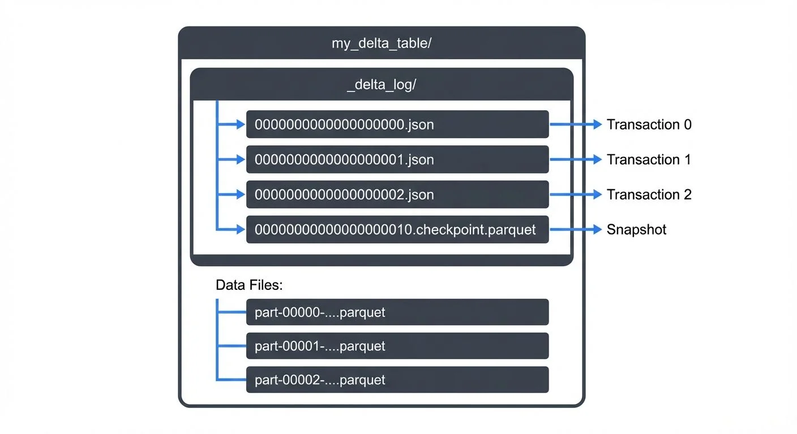
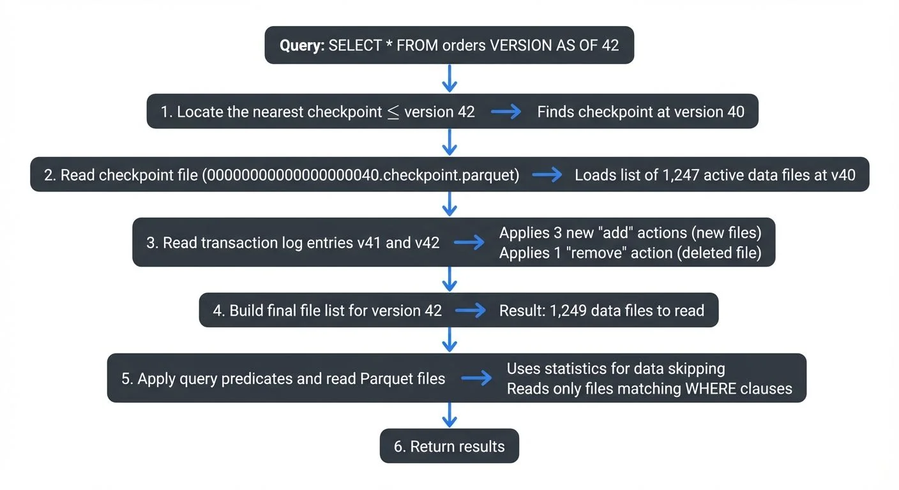
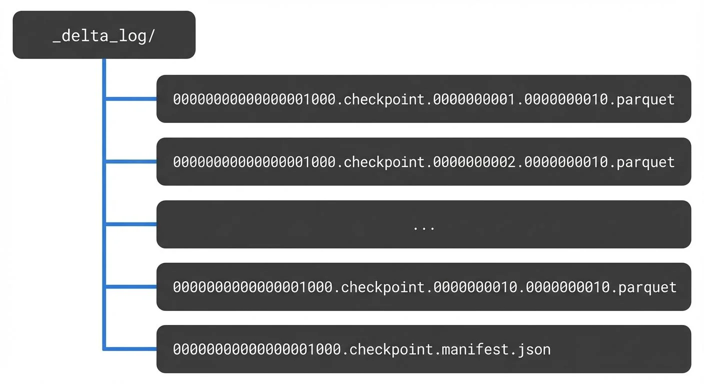
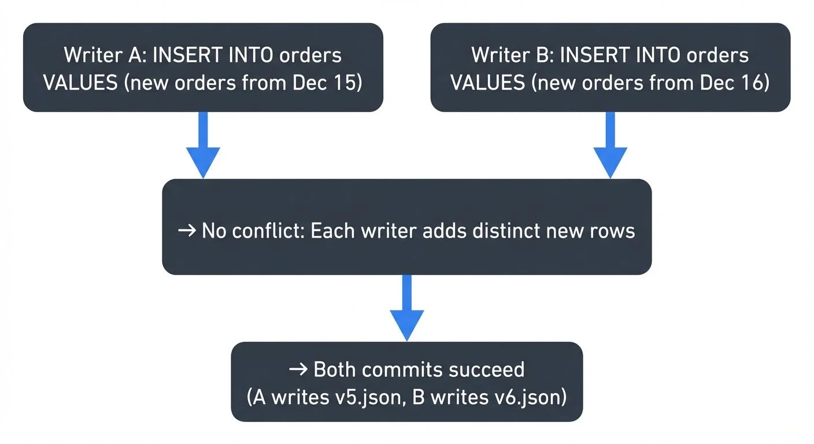
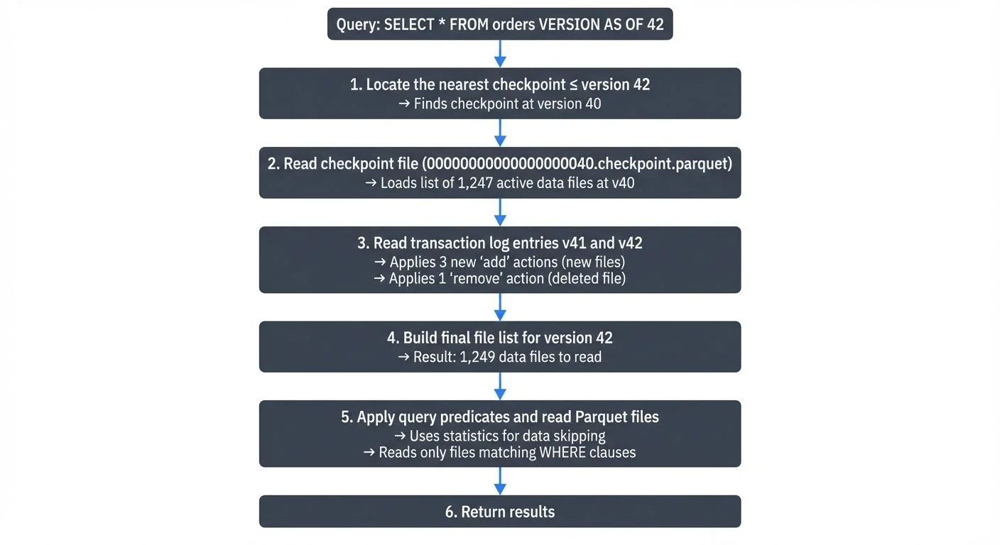

Delta Lake transforms cloud object storage into a reliable, **ACID-compliant** data platform through a single critical component: the transaction log. ACID stands for Atomicity (operations fully succeed or fail), Consistency (data remains valid), Isolation (concurrent operations don't interfere), and Durability (committed changes persist). Understanding how this transaction log works is essential for data engineers building modern data lakehouses, as it underpins every feature that differentiates Delta Lake from raw Parquet files on S3 or ADLS.

This article explores the architecture, mechanics, and operational characteristics of Delta Lake's transaction log, providing the technical foundation needed to leverage Delta Lake effectively in production environments.

## What Is the Delta Lake Transaction Log?

The Delta Lake transaction log, also called the DeltaLog, is an ordered record of every transaction committed to a Delta table since its creation. Stored as a series of JSON files in the `_delta_log` subdirectory of your table, this log serves as the single source of truth for the table's current state.

Each transaction appends a new JSON file numbered sequentially (e.g., `00000000000000000000.json`, `00000000000000000001.json`). These files contain metadata about:

- **Add operations**: New data files added to the table
- **Remove operations**: Files marked as logically deleted
- **Metadata changes**: Schema evolution, table properties
- **Protocol changes**: Delta Lake version requirements
- **Commit info**: Timestamp, operation type, isolation level

When a reader queries a Delta table, it reconstructs the current state by reading the transaction log from the beginning (or the last checkpoint) and applying each transaction sequentially. This append-only structure makes the log naturally immutable and provides built-in version control.

## The Optimistic Concurrency Commit Protocol

Delta Lake uses an **optimistic concurrency control** protocol to enable multiple writers to modify a table simultaneously while maintaining ACID guarantees.

"Optimistic" means Delta Lake assumes conflicts between writers are rare and doesn't lock resources upfront. Instead, each writer proceeds independently, and conflicts are detected only at commit time. This contrasts with "pessimistic" locking approaches (like traditional databases) that acquire locks before modifications, potentially blocking other writers even when conflicts wouldn't occur.

The optimistic approach provides better performance in data lake scenarios where:
- Most writes add new data (appends) rather than modifying existing rows
- Writers often work on different partitions or time ranges
- The cost of occasional retries is lower than the overhead of distributed locking

This protocol relies on atomic file operations supported by cloud object stores (S3, Azure Blob Storage, Google Cloud Storage).

### How Concurrent Writes Work

When a writer wants to commit changes:

1. **Read Phase**: The writer reads the latest version of the transaction log to understand the current state
2. **Execution Phase**: The writer performs the operation (write new Parquet files, compute statistics, etc.)
3. **Validation Phase**: Before committing, the writer re-reads the log to check if any new commits occurred
4. **Commit Phase**: If no conflicts exist, the writer attempts to atomically write the next sequential log entry

The atomicity guarantee comes from cloud storage's conditional PUT operations (e.g., S3's PUT-if-absent, ADLS's create-if-not-exists). These operations either fully succeed or fully fail—there's no in-between state where a file is "partially written." When S3 receives two simultaneous PUT-if-absent requests for the same file, exactly one succeeds and the other fails immediately. The failed writer detects the conflict, re-validates against the new state, and retries if the operation is still valid.

### Multi-Statement Transactions (Delta 3.0+)

Starting with Delta Lake 3.0 (2024), multi-statement transactions enable grouping multiple operations into a single atomic commit. This ensures that multiple related changes appear as one version in the transaction log, providing true ACID semantics across operations.

```sql
-- Begin a multi-statement transaction
BEGIN TRANSACTION;

-- Multiple operations that commit together
DELETE FROM orders WHERE status = 'cancelled';
UPDATE customers SET orders_count = orders_count - 1
  WHERE customer_id IN (SELECT customer_id FROM orders WHERE status = 'cancelled');
INSERT INTO audit_log VALUES (current_timestamp(), 'cleanup', user());

-- Commit all changes as a single transaction log entry
COMMIT;
```

Without multi-statement transactions, each operation would create a separate transaction log entry, potentially leaving the table in an inconsistent intermediate state if a failure occurs between operations. With multi-statement transactions, either all operations succeed together or all fail together, maintaining referential integrity.

In the transaction log, a multi-statement transaction appears as a single version containing all `add`, `remove`, and `cdc` actions from all statements:

```json
{
  "commitInfo": {
    "timestamp": 1735689600000,
    "operation": "TRANSACTION",
    "operationMetrics": {
      "numStatements": "3",
      "numTargetRowsDeleted": "150",
      "numTargetRowsUpdated": "45",
      "numTargetRowsInserted": "1"
    }
  }
}
```

This feature is particularly valuable for maintaining data consistency in complex ETL workflows, enforcing business rules across multiple tables, and ensuring atomic schema migrations.

### Conflict Detection and Resolution

Delta Lake categorizes conflicts into two types:

**1. Blind Append Conflicts** - Two writers adding new data with no dependency on existing rows. These typically proceed without conflict because writers are adding different data.

Example of compatible blind appends:

**2. Read-Modify-Write Conflicts** - Operations that depend on reading and filtering existing data. These must detect conflicts because concurrent changes might affect which rows match the predicate.

Example of read-modify-write conflict:
```
Initial state (v4): Table contains 100 inactive customers

Writer A: UPDATE customers SET status = 'archived' WHERE status = 'inactive'
Writer B: DELETE FROM customers WHERE status = 'inactive'

Both operations:
1. Read v4 and identify the same 100 rows
2. Write new data files
3. Attempt to commit

Outcome:
- Writer A commits v5 successfully
- Writer B's commit fails: "The files you read (inactive customers) were
  modified by v5"
- Writer B must retry: re-read v5, discover A already archived the rows,
  adjust DELETE predicate accordingly
```

For read-modify-write operations, Delta Lake checks if the files read during the operation were modified by concurrent transactions. If so, the transaction fails and must retry with the updated state. The retry logic typically succeeds after re-reading and re-evaluating against the new table version.

```json
// Example transaction log entry (simplified)
{
  "commitInfo": {
    "timestamp": 1735689600000,
    "operation": "MERGE",
    "operationMetrics": {
      "numTargetRowsUpdated": "1250",
      "numTargetRowsInserted": "340"
    }
  },
  "add": {
    "path": "part-00005-abc123.snappy.parquet",
    "partitionValues": {"date": "2025-01-01"},
    "size": 524288,
    "modificationTime": 1735689600000,
    "dataChange": true,
    "stats": "{\"numRecords\": 1590, \"minValues\": {...}, \"maxValues\": {...}}"
  },
  "remove": {
    "path": "part-00001-xyz789.snappy.parquet",
    "deletionTimestamp": 1735689600000
  }
}
```

## Checkpointing: Managing Transaction Log Growth

As tables evolve through hundreds or thousands of commits, reading the entire transaction log becomes inefficient. Delta Lake addresses this through checkpointing.

### How Checkpoints Work

Every 10 commits (by default), Delta Lake generates a checkpoint file that represents the complete table state at that version. This checkpoint is a Parquet file containing the same information as the aggregated JSON log entries up to that point.

Checkpoint files use the naming pattern `00000000000000000010.checkpoint.parquet` and allow readers to:

1. Start from the checkpoint (version 10)
2. Apply only subsequent transactions (11, 12, 13...)
3. Reconstruct the current state efficiently

### What's Inside a Checkpoint?

A checkpoint is essentially a Parquet-encoded snapshot of the transaction log state at a specific version. It contains:

- **All active data files**: Every `add` action that hasn't been logically deleted by a `remove` action
- **Current table metadata**: Schema definition, partition columns, table properties
- **Protocol version**: Current reader/writer version requirements and enabled features
- **Statistics**: Aggregated file-level statistics for data skipping

What checkpoints **don't** include:
- Removed files (already filtered out)
- Historical `commitInfo` entries (optimization metadata not needed for state reconstruction)
- Individual transaction details (only the net result matters)

Example: If transactions 0-10 added 50 files and removed 12 files, the checkpoint at version 10 contains only the 38 currently active files, not the full history of all 62 operations.

This compression dramatically reduces the amount of data readers must process to understand the current table state, especially for long-lived tables with thousands of commits.

For very large tables, Delta Lake can create multi-part checkpoints split across multiple Parquet files, with a JSON manifest coordinating the parts:

Checkpointing runs automatically during write operations, ensuring readers have recent snapshots even on frequently updated tables.

## Time Travel and Versioning

The transaction log's immutable, append-only nature enables time travel queries, allowing you to query historical versions of your data. Each transaction log entry represents a discrete version of the table.

You can query historical data using:

```sql
-- Query table as of version 42
SELECT * FROM my_table VERSION AS OF 42

-- Query table as of timestamp
SELECT * FROM my_table TIMESTAMP AS OF '2025-01-15 10:00:00'
```

### How Time Travel Queries Execute

When you run a time travel query, Delta Lake performs these steps:

**Important**: Time travel requires that the Parquet data files still exist on storage. If `VACUUM` has deleted old files, time travel to older versions will fail with "file not found" errors, even though the transaction log entries remain.

Delta Lake maps timestamps to versions by reading the `commitInfo.timestamp` fields in the transaction log. For timestamp-based queries, Delta Lake scans the log to find the most recent version committed before the specified timestamp, then executes the version-based query.

This feature supports:

- **Auditing**: Track data lineage and changes over time
- **Reproducibility**: Recreate historical analyses with exact data states
- **Rollback**: Revert tables to previous versions after errors
- **A/B testing**: Compare results across different table states

### VACUUM and Data Retention Tradeoffs

The retention of old data files and log entries is controlled by the `VACUUM` command and retention policies. Understanding the tradeoff between storage costs and time travel capabilities is critical for production deployments.

**What VACUUM Does:**

```sql
-- Remove files older than 7 days (must be >= 7 days for safety)
VACUUM my_table RETAIN 168 HOURS;
```

- **Keeps**: Transaction log JSON entries (history metadata is preserved)
- **Deletes**: Actual Parquet data files marked as removed and older than retention period
- **Impact**: You can see WHAT changed in the transaction log, but cannot query old data if files are deleted

**The Tradeoff:**

| Retention Period | Time Travel | Storage Cost | Use Case |
|-----------------|-------------|--------------|----------|
| 7 days | Recent versions only | Lowest | Cost-sensitive, no compliance requirements |
| 30 days (default) | Monthly history | Moderate | Balanced production workloads |
| 90+ days | Extended history | Higher | Compliance, long-running experiments |

**Example Scenario:**

```
Day 0: Table created, version 0
Day 10: Current version is 100, VACUUM with 7-day retention runs
Day 15: Analyst runs: SELECT * FROM table VERSION AS OF 50
Result: ERROR - "File not found: part-00042.parquet"
Reason: Version 50 data files were deleted by VACUUM on Day 10

However: Transaction log still shows version 50 metadata
You can see: WHAT changed at v50 (commitInfo, operation type)
You cannot: Query the actual data from v50
```

**Best Practices:**

1. **Set retention based on requirements**: Align with your SLAs for data recovery and historical analysis
2. **Run VACUUM regularly**: Prevent unbounded storage growth from accumulating old files
3. **Monitor retention**: Alert when VACUUM falls behind or retention period is too aggressive
4. **Document policies**: Ensure teams understand time travel limitations after VACUUM

By default, Delta Lake retains 30 days of history, though this is configurable via `delta.deletedFileRetentionDuration` table property.

## Streaming Integration and Real-Time Processing

The transaction log architecture makes Delta Lake particularly well-suited for streaming data pipelines. Streaming frameworks can efficiently tail the transaction log to process new data incrementally.

### Streaming Reads

Apache Spark Structured Streaming and other engines can use Delta tables as streaming sources by monitoring the transaction log for new commits. The streaming engine tracks the last processed version and reads only newly added files referenced in subsequent transactions, enabling efficient incremental processing.

### Streaming Writes

Streaming writes to Delta tables benefit from **exactly-once semantics** (ensuring each record is processed exactly one time, never duplicated or lost) through **idempotent retries** (operations that can safely be repeated without changing the result). If a streaming batch fails mid-commit, the retry attempts to create the same transaction log entry (with the same version number), which either succeeds or discovers the previous attempt succeeded.

This streaming integration extends Delta Lake's value beyond batch processing into real-time architectures, supporting use cases like:

- **CDC (Change Data Capture)** ingestion with MERGE operations: capturing row-level changes from operational databases and syncing them to the lakehouse
- Real-time analytics dashboards
- Event-driven architectures with guaranteed ordering
- **Lambda architecture** implementations with unified batch/streaming code: architectures that process data through both batch and real-time paths, converging results in a unified view

For organizations managing complex streaming topologies, platforms like **Conduktor** provide governance and visibility across streaming pipelines, complementing Delta Lake's transaction guarantees with operational monitoring, schema validation, and data quality checks.

## Transaction Log Schema and Internals

Understanding the transaction log's internal structure helps when debugging, optimizing, or building custom tooling around Delta Lake.

### Delta Kernel: Language-Agnostic Transaction Log Access

Introduced in 2023 and maturing in 2025, Delta Kernel is a set of libraries that provide low-level, language-agnostic APIs for reading and writing the Delta transaction log. Unlike the full Delta Lake libraries (which are tightly coupled to Spark), Delta Kernel enables building native Delta Lake integrations in any language.

Delta Kernel provides:
- **Transaction log parsing**: Read and interpret JSON log entries without Spark dependencies
- **Checkpoint reading**: Efficiently process Parquet checkpoint files
- **Protocol compliance**: Ensure correct handling of features like deletion vectors, column mapping, and UniForm
- **State reconstruction**: Build the current table state from the transaction log

This enables native Delta Lake support in:
- **Query engines**: Rust-based engines (DataFusion), Go applications, C++ systems
- **Data tools**: ETL frameworks, data quality tools, catalog systems
- **Streaming platforms**: Real-time processors that need direct Delta access

Delta Kernel has become the foundation for expanding Delta Lake's ecosystem beyond the JVM, making it a truly universal lakehouse format in 2025.

### Core Action Types

Each transaction log entry contains one or more actions:

| Action | Purpose |
|--------|---------|
| `add` | Register a new data file in the table |
| `remove` | Mark a data file as logically deleted |
| `metaData` | Define/update schema, partition columns, configuration |
| `protocol` | Specify minimum Delta Lake version required |
| `commitInfo` | Record operation metadata, metrics, provenance |
| `txn` | Support idempotent transactions with application IDs |
| `cdc` | Capture change data for Change Data Feed (CDF) |

### Change Data Feed (CDF)

Change Data Feed is a Delta Lake feature that tracks row-level changes (inserts, updates, deletes) in the transaction log. When enabled, CDF generates additional files containing change data with metadata indicating the type of operation.

```sql
-- Enable Change Data Feed on a table
ALTER TABLE user_profiles
SET TBLPROPERTIES (delta.enableChangeDataFeed = true);

-- Query changes between versions
SELECT * FROM table_changes('user_profiles', 10, 20);
```

The transaction log records CDF files using the `cdc` action:

```json
{
  "cdc": {
    "path": "_change_data/cdc-00001-a3f9b2c8.parquet",
    "partitionValues": {},
    "size": 4096,
    "dataChange": false
  }
}
```

Each CDF record includes:
- The changed row data
- `_change_type`: "insert", "update_preimage", "update_postimage", or "delete"
- `_commit_version`: Transaction log version where the change occurred
- `_commit_timestamp`: Timestamp of the change

CDF is essential for:
- **CDC pipelines**: Propagating changes downstream to data warehouses or operational systems
- **Incremental processing**: Processing only changed data rather than full table scans
- **Audit trails**: Tracking exactly what changed, when, and in which version
- **Real-time analytics**: Streaming change events to dashboards and alerting systems

Change Data Feed has become a mainstream feature in 2025 for building reactive data architectures, complementing streaming platforms like Apache Kafka with guaranteed change capture at the storage layer.

### Statistics and Data Skipping

The `add` actions include per-file statistics in the `stats` field:

```json
{
  "add": {
    "path": "date=2025-01-15/part-00000.parquet",
    "stats": "{\"numRecords\":10000,\"minValues\":{\"id\":1,\"timestamp\":\"2025-01-15T00:00:00\"},\"maxValues\":{\"id\":10000,\"timestamp\":\"2025-01-15T23:59:59\"}}"
  }
}
```

These statistics enable data skipping: when a query filters on `id = 5000`, Delta Lake reads the transaction log, checks the min/max statistics, and skips files where `5000 < minValues.id` or `5000 > maxValues.id`. This dramatically reduces the amount of data scanned, improving query performance without requiring manual partition management.

For example, if you query `WHERE date = '2025-01-15'` on a table with a year of data, Delta Lake checks the min/max statistics and only reads files containing January 15 data—potentially skipping 99% of files in the dataset. In practice, data skipping can reduce query times from minutes to seconds, and I/O costs by 10-100x depending on query selectivity.

### Deletion Vectors: Efficient Row-Level Operations

Starting with Delta Lake 2.4 (2023) and increasingly adopted in 2025, deletion vectors provide a performance optimization for UPDATE, DELETE, and MERGE operations that affect only a small percentage of rows in large files.

Traditional Delta Lake uses copy-on-write: updating a single row in a 1GB Parquet file requires rewriting the entire file. Deletion vectors change this by storing a bitmap of deleted row positions separately, allowing Delta Lake to mark rows as deleted without file rewrites.

```sql
-- Enable deletion vectors for a table
ALTER TABLE my_table
SET TBLPROPERTIES('delta.enableDeletionVectors' = 'true');

-- Now DELETE and UPDATE operations are much faster
DELETE FROM my_table WHERE user_id = 12345;
-- Only writes a small deletion vector, not the entire file
```

In the transaction log, deletion vectors appear as a new field in the `add` action:

```json
{
  "add": {
    "path": "part-00005-abc123.snappy.parquet",
    "size": 524288,
    "deletionVector": {
      "storageType": "u",
      "pathOrInlineDv": "ab3e7c9f8d2a1b5c",
      "offset": 1,
      "sizeInBytes": 40,
      "cardinality": 327
    }
  }
}
```

Deletion vectors dramatically improve write performance for selective updates (10-100x faster) and reduce write amplification, making Delta Lake more efficient for use cases like CDC ingestion, real-time updates, and GDPR deletion requests.

For a comprehensive exploration of deletion vectors and their performance characteristics, see [Delta Lake Deletion Vectors: Efficient Row-Level Deletes](https://conduktor.io/glossary/delta-lake-deletion-vectors-efficient-row-level-deletes).

### Protocol Evolution

The `protocol` action specifies:

- `minReaderVersion`: Minimum Delta Lake reader version needed
- `minWriterVersion`: Minimum Delta Lake writer version needed

This allows Delta Lake to evolve with new features (column mapping, deletion vectors, [liquid clustering](https://conduktor.io/glossary/delta-lake-liquid-clustering-modern-partitioning), identity columns) while maintaining compatibility. Older clients that don't support new features will fail fast with clear error messages rather than producing incorrect results.

### UniForm: Universal Format Compatibility

Introduced in Delta Lake 3.0 (2024) and widely adopted in 2025, UniForm (Universal Format) extends the transaction log to simultaneously maintain compatibility with Apache Iceberg and Apache Hudi formats. This allows readers that understand Iceberg or Hudi to query Delta tables without conversion.

```sql
-- Enable UniForm for multi-format reads
CREATE TABLE products (
  product_id BIGINT,
  name STRING,
  price DECIMAL(10,2)
) USING DELTA
TBLPROPERTIES(
  'delta.universalFormat.enabledFormats' = 'iceberg'
);
```

When UniForm is enabled, Delta Lake automatically maintains additional metadata alongside the transaction log:

- **For Iceberg**: Generates Iceberg metadata files (`metadata/*.json`) and manifest files
- **For Hudi**: Maintains Hudi timeline and metadata structures

The transaction log remains the authoritative source of truth, but Delta Lake's write operations automatically synchronize changes to the enabled format metadata. This enables:

- **Tool interoperability**: Use Iceberg-native query engines (Trino, Dremio) on Delta tables
- **Gradual migration**: Transition between table formats without full data rewrites
- **Multi-engine analytics**: Different teams using different engines can share the same physical tables

The transaction log's `protocol` action includes UniForm configuration, ensuring readers understand which formats are available:

```json
{
  "protocol": {
    "minReaderVersion": 3,
    "minWriterVersion": 7,
    "readerFeatures": ["deletionVectors"],
    "writerFeatures": ["deletionVectors", "universalFormat"]
  }
}
```

## Performance Considerations and Best Practices

To maximize the transaction log's effectiveness:

1. **Checkpoint frequency**: Adjust `delta.checkpointInterval` based on commit frequency (default: 10)
2. **Statistics collection**: Ensure statistics are computed for filter columns to enable data skipping
3. **Log retention**: Balance history requirements with storage costs using `delta.logRetentionDuration`
4. **Concurrent writes**: Design ETL patterns to minimize read-modify-write conflicts
5. **File size**: Target 128MB-1GB data files to keep transaction log entries manageable

For tables with extremely high commit rates (thousands per hour), consider:

- Batching smaller writes into larger transactions
- Using OPTIMIZE to consolidate small files periodically
- Monitoring transaction log size and checkpoint generation latency

## Summary

The Delta Lake transaction log is the foundational mechanism that transforms object storage into a reliable lakehouse platform. By maintaining an ordered, immutable log of all table operations, Delta Lake delivers:

- **ACID guarantees** through optimistic concurrency control
- **Time travel** via version history and timestamp mapping
- **Efficient reads** through checkpointing and data skipping statistics
- **Streaming integration** with exactly-once semantics and incremental processing
- **Schema evolution** with protocol versioning and backward compatibility

Understanding the transaction log's architecture helps data engineers design more efficient pipelines, debug production issues, and leverage advanced features like time travel and concurrent writes effectively. As Delta Lake continues to evolve with features like deletion vectors and liquid clustering, the transaction log remains the core abstraction that makes these capabilities possible while maintaining strong consistency guarantees.

For production deployments, combine Delta Lake's transactional guarantees with comprehensive monitoring and governance tools to ensure data quality and operational visibility across your lakehouse architecture.

## Related Concepts

- [Introduction to Lakehouse Architecture](/introduction-to-lakehouse-architecture) - Understanding the lakehouse paradigm that Delta Lake enables
- [Apache Iceberg](/apache-iceberg) - Alternative table format with similar ACID transaction capabilities
- [Streaming to Lakehouse Tables](/streaming-to-lakehouse-tables) - Patterns for writing streaming data to Delta tables with exactly-once semantics

## Sources and References

- [Delta Lake Transaction Log Protocol Specification](https://github.com/delta-io/delta/blob/master/PROTOCOL.md) - Official protocol documentation
- [Diving Into Delta Lake: Unpacking The Transaction Log](https://www.databricks.com/blog/2019/08/21/diving-into-delta-lake-unpacking-the-transaction-log.html) - Databricks engineering deep dive
- [Delta Lake: High-Performance ACID Table Storage over Cloud Object Stores](https://www.vldb.org/pvldb/vol13/p3411-armbrust.pdf) - VLDB 2020 research paper
- [Delta Lake GitHub Repository](https://github.com/delta-io/delta) - Open-source implementation and examples
- [Apache Spark Structured Streaming + Delta Lake](https://docs.delta.io/latest/delta-streaming.html) - Streaming integration guide
