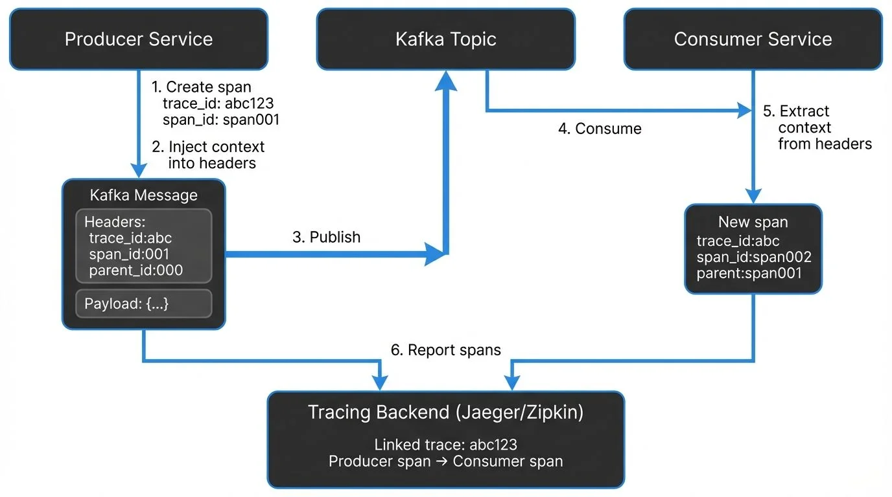

Monitoring distributed systems is challenging. When a single request spans multiple services, understanding what happened and where things went wrong requires visibility into the entire journey. This is where distributed tracing becomes essential, especially for event-driven architectures built on Apache Kafka.

## Introduction to Distributed Tracing

Distributed tracing is an observability technique that tracks requests as they flow through multiple services in a distributed system. Each operation creates a "span" that records timing data, metadata, and relationships to other spans. These spans are collected into a "trace" that represents the complete journey of a request.

In traditional synchronous systems, like HTTP-based microservices, tracing is relatively straightforward. A request enters the system, flows through various services via direct API calls, and returns a response. The call chain is explicit and easy to trace.

For Kafka-based applications, however, the story is different. Kafka decouples producers from consumers using asynchronous message passing. There are no direct transactions or synchronous call chains to follow. Messages are written to topics, buffered, and consumed independently. This architectural pattern creates implicit dependencies that are difficult to observe without proper instrumentation.

## The Unique Challenges of Tracing Kafka Applications

Kafka's architecture introduces several challenges for distributed tracing:

**Asynchronous Processing:** Unlike HTTP requests that have clear request-response patterns, Kafka messages are fire-and-forget. A producer sends a message without waiting for consumers to process it. This breaks the traditional parent-child relationship that tracing systems rely on.

**Temporal Decoupling:** Messages may sit in Kafka topics for seconds, minutes, or even longer before being consumed. The temporal gap between production and consumption makes it difficult to correlate related operations.

**One-to-Many Relationships:** A single message may be consumed by multiple consumer groups, each processing it differently. Tracing must account for these branching paths.

**Message Loss Visibility:** When messages disappear, you need to identify exactly where in the pipeline the loss occurred, during production, storage in Kafka, or consumption.

Despite these challenges, distributed tracing for Kafka is not only possible but essential for understanding the health and performance of event-driven systems.

## How Distributed Tracing Works with Kafka

The key to tracing Kafka applications is context propagation, passing trace metadata along with each message so that spans can be properly linked across service boundaries.

<!-- ORIGINAL_DIAGRAM
```
┌──────────────────────────────────────────────────────────────────┐
│          Distributed Tracing with Kafka                          │
├──────────────────────────────────────────────────────────────────┤
│                                                                  │
│  ┌──────────────┐         ┌──────────────┐        ┌────────────┐│
│  │   Producer   │         │    Kafka     │        │  Consumer  ││
│  │   Service    │         │    Topic     │        │  Service   ││
│  └──────┬───────┘         └──────┬───────┘        └─────┬──────┘│
│         │                        │                      │       │
│         │ 1. Create span         │                      │       │
│         │    trace_id: abc123    │                      │       │
│         │    span_id: span001    │                      │       │
│         │                        │                      │       │
│         │ 2. Inject context      │                      │       │
│         │    into headers        │                      │       │
│         ▼                        │                      │       │
│  ┌─────────────────────┐         │                      │       │
│  │  Kafka Message      │         │                      │       │
│  │  ┌───────────────┐  │         │                      │       │
│  │  │ Headers:      │  │         │                      │       │
│  │  │ trace_id:abc  │  │─────3. Publish ────▶          │       │
│  │  │ span_id:001   │  │         │                      │       │
│  │  │ parent_id:000 │  │         │                      │       │
│  │  └───────────────┘  │         │                      │       │
│  │  ┌───────────────┐  │         │                      │       │
│  │  │ Payload: {...}│  │         │                      │       │
│  │  └───────────────┘  │         │                      │       │
│  └─────────────────────┘         │                      │       │
│                                   │                      │       │
│                                   │ 4. Consume ◀─────────┘       │
│                                   │                      │       │
│                                   │    5. Extract context│       │
│                                   │       from headers   │       │
│                                   │                      ▼       │
│                                   │           ┌─────────────────┐│
│                                   │           │  New span       ││
│                                   │           │  trace_id:abc   ││
│                                   │           │  span_id:span002││
│                                   │           │  parent:span001 ││
│                                   │           └─────────────────┘│
│                                   │                      │       │
│                                   │ 6. Report spans ─────┼──────▶│
│                                   │                      │       │
│                                   ▼                      ▼       │
│                        ┌─────────────────────────────────────┐   │
│                        │  Tracing Backend (Jaeger/Zipkin)    │   │
│                        │  Linked trace: abc123               │   │
│                        │  Producer span → Consumer span      │   │
│                        └─────────────────────────────────────┘   │
│                                                                  │
└──────────────────────────────────────────────────────────────────┘
```
-->

### Context Propagation via Message Headers

Kafka messages support headers, key-value pairs similar to HTTP headers, which have been a core feature since Kafka 0.11 (and are standard in modern Kafka 3.x/4.x deployments). OpenTelemetry and other tracing frameworks use these headers to propagate trace context following the W3C Trace Context specification.

When a producer sends a message, the tracing instrumentation automatically injects trace metadata into the message headers. This typically includes:

- Trace ID: A unique identifier for the entire trace
- Span ID: An identifier for the current span
- Parent Span ID: The ID of the span that initiated this operation
- Sampling decision: Whether this trace should be recorded

When a consumer receives the message, it extracts this context from the headers and creates a new span that's linked to the producer's span. This maintains the trace continuity across the asynchronous boundary.

Here's what the trace context headers look like in a real Kafka message:

```
traceparent: 00-0af7651916cd43dd8448eb211c80319c-b7ad6b7169203331-01
tracestate: congo=t61rcWkgMzE
```

The `traceparent` header follows the W3C standard and includes the version, trace ID, parent span ID, and sampling decision. This compact representation adds approximately 150-200 bytes to message headers.

### Interceptors and Instrumentation Points

Kafka clients support interceptors (introduced via Kafka Improvement Proposal KIP-42), which allow custom code to be executed during key lifecycle events. Tracing frameworks leverage interceptors to:

- Create spans when messages are produced
- Inject trace context into message headers
- Extract trace context when messages are consumed
- Create spans for consumption operations
- Record timing data, topic names, partition information, and offsets

The resulting spans typically have operation names like `kafka.produce` and `kafka.consume`, with attributes defined by OpenTelemetry semantic conventions (v1.24+) that include:

- `messaging.system`: Always "kafka"
- `messaging.destination.name`: The Kafka topic name
- `messaging.kafka.message.key`: The message key
- `messaging.kafka.message.offset`: The message offset
- `messaging.kafka.destination.partition`: The partition number
- `messaging.kafka.consumer.group`: The consumer group (for consumers)

These standardized attributes ensure consistent trace visualization across different tools and platforms. This metadata allows you to trace individual messages through your entire system, from the moment they're produced until they're consumed and processed.

## Instrumentation Approaches

There are multiple approaches to instrumenting Kafka applications for distributed tracing, ranging from zero-code automatic instrumentation to fine-grained manual control.

### Automatic (Zero-Code) Instrumentation

Automatic instrumentation uses agents that attach to your application at runtime and inject tracing code without requiring source code changes. This is particularly effective for Java applications.

The agent uses bytecode instrumentation to automatically wrap Kafka client calls and create spans. This approach requires no code changes and works with existing applications, making it ideal for quickly adding observability to legacy systems.

**Advantages:**
- No code changes required
- Works with third-party libraries
- Quick to implement

**Disadvantages:**
- Less control over what's traced
- May not capture business-specific context
- Potential performance overhead

### Manual Instrumentation

Manual instrumentation involves explicitly adding tracing code to your application. This gives you fine-grained control over what's traced and allows you to add custom attributes.

**Advantages:**
- Full control over spans and attributes
- Can add business context
- Better performance tuning

**Disadvantages:**
- Requires code changes
- More maintenance overhead
- Developer training needed

Most organizations start with automatic instrumentation for quick wins, then add manual instrumentation for critical paths where custom context is valuable.

### Example: Manual Instrumentation with OpenTelemetry

Here's a practical example of instrumenting a Kafka producer and consumer with OpenTelemetry in Java:

```java
// Producer with OpenTelemetry tracing
import io.opentelemetry.api.trace.Span;
import io.opentelemetry.api.trace.Tracer;
import io.opentelemetry.context.Context;
import io.opentelemetry.context.propagation.TextMapSetter;
import org.apache.kafka.clients.producer.*;
import org.apache.kafka.common.header.Headers;

public class TracedKafkaProducer {
    private final KafkaProducer<String, String> producer;
    private final Tracer tracer;

    public TracedKafkaProducer(KafkaProducer<String, String> producer, Tracer tracer) {
        this.producer = producer;
        this.tracer = tracer;
    }

    public void send(String topic, String key, String value) {
        // Create a span for the produce operation
        Span span = tracer.spanBuilder("kafka.produce")
            .setSpanKind(SpanKind.PRODUCER)
            .setAttribute("messaging.system", "kafka")
            .setAttribute("messaging.destination.name", topic)
            .startSpan();

        try (var scope = span.makeCurrent()) {
            ProducerRecord<String, String> record =
                new ProducerRecord<>(topic, key, value);

            // Inject trace context into message headers
            Context current = Context.current();
            TextMapSetter<Headers> setter = (headers, k, v) ->
                headers.add(k, v.getBytes());
            GlobalOpenTelemetry.getPropagators()
                .getTextMapPropagator()
                .inject(current, record.headers(), setter);

            // Send the message
            producer.send(record, (metadata, exception) -> {
                if (exception != null) {
                    span.recordException(exception);
                    span.setStatus(StatusCode.ERROR);
                } else {
                    span.setAttribute("messaging.kafka.message.offset",
                        metadata.offset());
                    span.setAttribute("messaging.kafka.destination.partition",
                        metadata.partition());
                }
                span.end();
            });
        }
    }
}

// Consumer with OpenTelemetry tracing
public class TracedKafkaConsumer {
    private final KafkaConsumer<String, String> consumer;
    private final Tracer tracer;

    public void poll() {
        ConsumerRecords<String, String> records =
            consumer.poll(Duration.ofMillis(100));

        for (ConsumerRecord<String, String> record : records) {
            // Extract parent context from headers
            Context parentContext = GlobalOpenTelemetry.getPropagators()
                .getTextMapPropagator()
                .extract(Context.current(), record.headers(),
                    (headers, key) -> {
                        Header header = headers.lastHeader(key);
                        return header != null ?
                            new String(header.value()) : null;
                    });

            // Create child span linked to producer span
            Span span = tracer.spanBuilder("kafka.consume")
                .setParent(parentContext)
                .setSpanKind(SpanKind.CONSUMER)
                .setAttribute("messaging.system", "kafka")
                .setAttribute("messaging.destination.name", record.topic())
                .setAttribute("messaging.kafka.message.offset", record.offset())
                .setAttribute("messaging.kafka.destination.partition",
                    record.partition())
                .startSpan();

            try (var scope = span.makeCurrent()) {
                // Process the message
                processMessage(record);
                span.setStatus(StatusCode.OK);
            } catch (Exception e) {
                span.recordException(e);
                span.setStatus(StatusCode.ERROR);
            } finally {
                span.end();
            }
        }
    }

    private void processMessage(ConsumerRecord<String, String> record) {
        // Your business logic here
    }
}
```

This example demonstrates key concepts:
- Creating producer and consumer spans with proper span kinds
- Injecting trace context into Kafka message headers
- Extracting parent context to link consumer spans to producer spans
- Adding OpenTelemetry semantic convention attributes
- Recording errors and exceptions in spans

For Python, the approach is similar using the `opentelemetry-instrumentation-kafka-python` library, which provides automatic instrumentation:

```python
from opentelemetry import trace
from opentelemetry.instrumentation.kafka import KafkaInstrumentor
from kafka import KafkaProducer, KafkaConsumer

# Automatically instrument Kafka clients
KafkaInstrumentor().instrument()

# Now all Kafka operations are automatically traced
producer = KafkaProducer(bootstrap_servers='localhost:9092')
producer.send('my-topic', b'message')

consumer = KafkaConsumer('my-topic', bootstrap_servers='localhost:9092')
for message in consumer:
    # Consumer operations are automatically traced
    process_message(message.value)
```

### eBPF-Based Tracing (2025 Approach)

A newer approach gaining adoption in 2025 is eBPF (Extended Berkeley Packet Filter) based tracing, which provides observability with near-zero overhead. Tools like Pixie and Odigos use eBPF to automatically capture Kafka operations at the kernel level without requiring application changes or agents.

**Advantages:**
- Truly zero overhead (< 1% CPU impact)
- No application restarts required
- Works with compiled languages without instrumentation
- Captures network-level metrics alongside traces

**Disadvantages:**
- Requires Linux kernel 4.14+ with eBPF support
- Limited to operation-level tracing (no custom business context)
- More complex infrastructure setup

eBPF-based tracing is particularly valuable for high-throughput Kafka deployments where traditional instrumentation overhead becomes noticeable.

## Visualization and Analysis Tools

Once your Kafka applications are instrumented, you need a backend system to collect, store, and visualize traces.

### Jaeger

Jaeger is an open-source distributed tracing platform originally developed by Uber and now part of the Cloud Native Computing Foundation (CNCF). It provides:

- A collector that receives spans from applications
- Storage backends (Elasticsearch, Cassandra, Kafka)
- A UI for searching and visualizing traces
- Service dependency graphs

Jaeger can use Kafka as a buffer between collectors and storage, which is useful for high-volume environments. It also supports Zipkin-compatible instrumentation, making migration easier.

### Zipkin

Zipkin, open-sourced by Twitter in 2012, is another popular tracing system. It bundles the collector, storage, API, and UI into a single process, making it simpler to deploy for smaller systems. Zipkin also supports Kafka as a transport mechanism for receiving spans.

### OpenTelemetry Backends

OpenTelemetry is vendor-neutral and can export traces using OTLP (OpenTelemetry Protocol) over gRPC or HTTP to multiple backends, including:

- **Open-source solutions**: Jaeger, Zipkin, Grafana Tempo, SigNoz, Uptrace
- **Commercial observability platforms**: New Relic, Datadog, Honeycomb, Splunk
- **Cloud provider services**: AWS X-Ray, Google Cloud Trace, Azure Monitor

In 2025, Grafana Tempo has emerged as a popular choice for Kafka tracing due to its cost-effective object storage backend and seamless integration with Grafana dashboards. SigNoz offers an open-source alternative to commercial APM platforms with built-in support for Kafka-specific visualizations.

When analyzing Kafka traces, look for:

**End-to-End Latency:** The time from message production to consumption completion. High latency might indicate consumer lag or processing bottlenecks.

**Orphan Spans:** Spans with no parent could indicate message loss or incomplete instrumentation.

**Error Rates:** Traces with error status help identify failing operations.

**Partition Skew:** If certain partitions show consistently higher latency, you may have a hot partition problem.

## Best Practices and Considerations

Implementing distributed tracing for Kafka applications requires careful consideration of several factors.

### Payload Size Impact

Tracing metadata adds 150-200 bytes to each message's headers. For small messages, this can be significant overhead. If your average message is 500 bytes, tracing adds 30-40% to the payload size.

Before enabling tracing in production:
- Test in a development environment
- Verify your Kafka message size limits can accommodate the additional headers
- Monitor storage costs, as larger messages consume more disk space
- Consider sampling strategies for high-volume topics

### Sampling Strategies

Tracing every message in a high-throughput Kafka system can generate enormous amounts of data and impact performance. Sampling reduces the volume while maintaining visibility.

Common strategies:
- **Probabilistic sampling:** Trace a fixed percentage of messages (e.g., 1% of all messages)
- **Rate limiting:** Trace a maximum number of messages per second regardless of volume
- **Priority sampling:** Always trace errors or slow operations, sample normal operations at lower rates
- **Head-based sampling:** Decide at the start of a trace (when the producer creates a span) whether to record it. This decision propagates through the trace. Simple but may miss interesting traces that only become problematic later.
- **Tail-based sampling:** Decide after seeing the complete trace by buffering spans and analyzing the entire trace before deciding to keep or discard it. For example, keep all traces with errors or latency > 1 second, but sample only 1% of successful fast traces. More accurate and intelligent, but requires more infrastructure (buffering, coordination between collectors) and adds processing latency.

### Environment Variables and Configuration

Key OpenTelemetry configuration settings for Kafka applications:

- `OTEL_SERVICE_NAME`: Logical name of your service (critical for visualization, e.g., "payment-processor")
- `OTEL_TRACES_EXPORTER`: Where to send traces (`jaeger`, `zipkin`, `otlp`)
- `OTEL_EXPORTER_OTLP_ENDPOINT`: The collector endpoint (e.g., `http://localhost:4318`)
- `OTEL_EXPORTER_OTLP_PROTOCOL`: Protocol to use (`grpc`, `http/protobuf`, `http/json`)
- `OTEL_TRACES_SAMPLER`: Sampling strategy (`always_on`, `always_off`, `traceidratio`, `parentbased_traceidratio`)
- `OTEL_TRACES_SAMPLER_ARG`: Sampling rate for probabilistic sampling (e.g., `0.01` for 1%)
- `OTEL_RESOURCE_ATTRIBUTES`: Additional resource attributes (e.g., `deployment.environment=production,service.version=1.2.3`)

Example configuration for a production Kafka consumer:

```bash
export OTEL_SERVICE_NAME="order-consumer"
export OTEL_TRACES_EXPORTER="otlp"
export OTEL_EXPORTER_OTLP_ENDPOINT="https://tempo.example.com:4318"
export OTEL_EXPORTER_OTLP_PROTOCOL="http/protobuf"
export OTEL_TRACES_SAMPLER="parentbased_traceidratio"
export OTEL_TRACES_SAMPLER_ARG="0.05"  # 5% sampling
export OTEL_RESOURCE_ATTRIBUTES="deployment.environment=production,service.version=2.1.0,kafka.consumer.group=order-processors"
```

### Testing Before Production

Always test tracing in non-production environments:

1. Verify trace context propagates correctly between producers and consumers
2. Confirm spans appear in your visualization tool with correct parent-child relationships
3. Measure the performance impact on throughput and latency
4. Check that message size limits aren't exceeded
5. Ensure consumer groups handle traced messages correctly

### Integration with Existing Observability

Distributed tracing is most powerful when combined with other observability signals:

- **Metrics:** Track message rates, consumer lag, and throughput alongside traces
- **Logs:** Correlate log entries with trace IDs for detailed debugging
- **Infrastructure Monitoring:** Connect application traces with Kafka broker metrics

Platforms like Conduktor provide complementary observability features for Kafka infrastructure, including [real-time monitoring of topics, consumer groups, and cluster health](https://docs.conduktor.io/guide/monitor-brokers-apps/index). While distributed tracing shows you the application-level flow of messages, tools like Conduktor give you visibility into the Kafka layer itself, partition assignments, replication status, and configuration.

Conduktor Gateway is particularly valuable for testing your distributed tracing implementation. It acts as a proxy layer where you can [inject chaos scenarios](https://docs.conduktor.io/guide/use-cases/chaos-testing) (network latency, message loss, broker failures) to verify that your traces accurately capture failures and help you diagnose issues. This allows you to validate that:

- Traces correctly identify message loss and where it occurred
- Error spans are created when messages fail to produce or consume
- Retry logic is properly traced with parent-child relationships
- Latency spikes are visible in trace timelines

Together, application-level tracing and infrastructure monitoring form a complete observability picture for Kafka systems.

## Modern Considerations for 2025

Several developments in 2025 have enhanced distributed tracing for Kafka applications:

### Kafka 4.x and KRaft Mode

With Kafka's move to KRaft (removing ZooKeeper dependency), tracing has become more streamlined. The simplified architecture reduces the number of moving parts to monitor, and modern Kafka clients include better built-in instrumentation hooks.

### Cost Optimization in Cloud Environments

Trace storage costs can become significant in cloud environments with high-volume Kafka deployments. Modern strategies include:

- **Adaptive sampling**: Dynamically adjust sampling rates based on message volume and error rates
- **Trace retention policies**: Keep detailed traces for 7 days, aggregated metrics for 30+ days
- **Object storage backends**: Use Grafana Tempo with S3/GCS for cost-effective long-term storage
- **Selective attribute collection**: Only capture expensive attributes (message payloads) for sampled traces

### AI/ML Observability

Machine learning pipelines increasingly use Kafka for feature pipelines and model training data. Tracing these workflows presents unique challenges:

- Training jobs may process millions of messages in batch
- Feature transformations create complex trace trees
- Model inference traces need correlation with training data lineage

OpenTelemetry's semantic conventions are evolving to support ML-specific attributes alongside messaging attributes, enabling end-to-end visibility from raw events through feature engineering to model predictions.

## Summary

Distributed tracing solves the observability challenges inherent in Kafka-based applications. While Kafka's asynchronous, decoupled architecture makes traditional monitoring difficult, modern tracing frameworks like OpenTelemetry provide the tools needed to maintain visibility across the entire message lifecycle.

Key takeaways:

- Distributed tracing tracks messages from producers through Kafka to consumers using trace context propagated in message headers following the W3C Trace Context specification
- Multiple instrumentation approaches are available: automatic agents, manual instrumentation, and eBPF-based tracing, each with different trade-offs
- Modern backends like Grafana Tempo, Jaeger, and SigNoz provide cost-effective visualization and analysis capabilities
- Proper implementation requires attention to OpenTelemetry semantic conventions, sampling strategies, and thorough testing
- Combining application-level tracing with infrastructure monitoring (like Conduktor and Conduktor Gateway) creates comprehensive observability
- 2025 advances include eBPF-based tracing, improved cloud cost management, and better support for ML/AI workloads

As event-driven architectures become increasingly complex, distributed tracing is no longer optional, it's essential for maintaining reliable, performant Kafka applications. By implementing tracing thoughtfully, you gain the visibility needed to troubleshoot issues quickly, optimize performance, and understand how your distributed systems actually behave in production.

## Related Concepts

- [Consumer Lag Monitoring](https://conduktor.io/glossary/consumer-lag-monitoring) - Tracking consumer performance with distributed traces
- [Kafka Cluster Monitoring and Metrics](https://conduktor.io/glossary/kafka-cluster-monitoring-and-metrics) - Infrastructure observability alongside application tracing
- [Data Freshness Monitoring and SLA Management](https://conduktor.io/glossary/data-freshness-monitoring-sla-management) - Using traces to validate latency SLAs

## Related Articles

- [Consumer Lag](https://conduktor.io/glossary/consumer-lag) - Understanding and monitoring consumer lag, which traces help diagnose
- [Backpressure](https://conduktor.io/glossary/backpressure) - Managing flow control in streaming systems, visible through trace latencies
- [Chaos Engineering](https://conduktor.io/glossary/chaos-engineering) - Testing system resilience with tools like Conduktor Gateway
- [Message Ordering](https://conduktor.io/glossary/message-ordering) - Guaranteeing order in Kafka, which affects trace interpretation

## Sources and References

- [OpenTelemetry Semantic Conventions for Messaging](https://opentelemetry.io/docs/specs/semconv/messaging/) - v1.24+ standards
- [W3C Trace Context Specification](https://www.w3.org/TR/trace-context/) - Standard for trace context propagation
- [Instrumenting Apache Kafka clients with OpenTelemetry](https://opentelemetry.io/blog/2022/instrument-kafka-clients/)
- [The Importance of Distributed Tracing for Apache-Kafka-Based Applications](https://www.confluent.io/blog/importance-of-distributed-tracing-for-apache-kafka-based-applications/)
- [Kafka with OpenTelemetry: Distributed Tracing Guide](https://last9.io/blog/kafka-with-opentelemetry/)
- [Optimizing Kafka Tracing with OpenTelemetry: Boost Visibility & Performance](https://newrelic.com/blog/how-to-relic/optimizing-kafka-tracing-with-opentelemetry-boost-visibility-performance)
- [Tracing Apache Kafka With OpenTelemetry](https://www.instaclustr.com/blog/tracing-apache-kafka-with-opentelemetry/)
- [Grafana Tempo Documentation](https://grafana.com/docs/tempo/latest/) - Cost-effective trace storage
- [SigNoz Kafka Monitoring](https://signoz.io/docs/instrumentation/kafka/) - Open-source APM for Kafka
