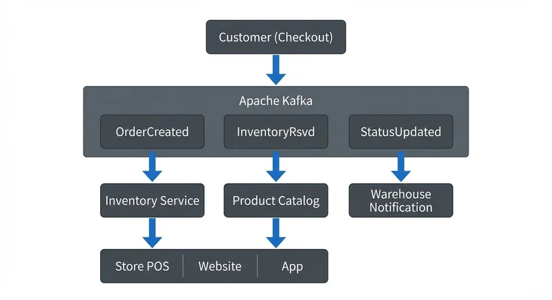

# E-Commerce Streaming Architecture Patterns

Modern e-commerce platforms face unprecedented demands for real-time responsiveness. Customers expect instant inventory updates, personalized recommendations, and seamless experiences across web, mobile, and physical stores. Traditional batch-oriented architectures struggle to meet these expectations, leading organizations to adopt streaming-first approaches built on [Event-Driven Architecture](https://conduktor.io/glossary/event-driven-architecture) principles.

This article explores the core architecture patterns that enable real-time e-commerce operations, the technologies that power them, and the practical challenges teams face when implementing these systems.

## Introduction to E-Commerce Streaming Challenges

E-commerce platforms generate thousands to millions of events per second: product views, cart additions, purchases, inventory adjustments, pricing changes, and shipping updates. Processing these events in real-time is not merely a technical preference but a business necessity.

Consider the classic inventory problem: a popular item is shown as available on the website, but by the time a customer completes checkout, it's out of stock. This creates customer frustration and operational overhead. Batch processing with 15-minute or hourly updates exacerbates this issue.

Beyond inventory, e-commerce systems must handle:
- Real-time fraud detection during checkout
- Dynamic pricing based on demand and competition
- Personalized product recommendations that reflect recent browsing behavior
- Coordinated fulfillment across warehouses and stores
- Near-instant customer notification across email, SMS, and push channels

These requirements demand architecture patterns that treat data as continuous streams of events rather than periodic snapshots.

## Core Architecture Patterns for E-Commerce Streaming

Several proven patterns form the foundation of streaming e-commerce architectures.

### Event Sourcing

Event sourcing stores every state change as an immutable event. Rather than updating a database record for an order status, the system appends events like "OrderPlaced," "PaymentConfirmed," "ItemsShipped," and "OrderDelivered."

This pattern provides a complete audit trail and enables temporal queries: "What was the inventory state at 2 PM yesterday?" It also allows rebuilding derived views by replaying events, which proves valuable when introducing new features or fixing bugs. For detailed coverage of implementing event sourcing with Kafka, see [Event Sourcing Patterns with Kafka](https://conduktor.io/glossary/event-sourcing-patterns-with-kafka).

### Command Query Responsibility Segregation (CQRS)

CQRS separates write operations (commands) from read operations (queries). Commands modify state and generate events, while queries read from optimized materialized views built from those events.

**Example: Product Search in E-Commerce**

When a merchant updates product details, the system:
1. **Command side:** Writes the change to a transactional database and publishes a "ProductUpdated" event to Kafka
2. **Event processing:** A stream processor consumes the event and updates multiple read-optimized views:
   - An Elasticsearch index for full-text search
   - A Redis cache for fast product detail lookups
   - A recommendation engine's graph database

When customers search for "blue running shoes," the query reads from Elasticsearch—a denormalized view optimized for text search with product attributes, inventory status, and pricing all pre-joined. This query never touches the transactional write database, allowing each side to scale independently. Writes prioritize consistency and durability, while reads optimize for speed and specific access patterns.

### Change Data Capture (CDC)

Many e-commerce platforms integrate with existing relational databases. CDC tools capture database changes (inserts, updates, deletes) and publish them as events to a streaming platform like Kafka.

This allows legacy order management or ERP systems to participate in real-time architectures without requiring application rewrites. CDC bridges traditional and modern components, enabling gradual migration strategies. For implementation details, see [Log-Based vs Query-Based CDC Comparison](https://conduktor.io/glossary/log-based-vs-query-based-cdc-comparison).

## Real-Time Inventory and Order Processing

Inventory accuracy directly impacts revenue and customer satisfaction. Streaming architectures enable real-time inventory visibility across all channels.

When a customer purchases an item online, the system publishes an "InventoryReserved" event. Warehouse management systems, store point-of-sale systems, and the website all consume this event and update their local views accordingly. This approach, called eventual consistency with event-driven synchronization, balances speed with accuracy.

**Example: Multi-Channel Inventory Synchronization**

A customer buys the last unit of a product online. Within milliseconds:
1. The checkout service publishes an "OrderCreated" event to Kafka
2. An inventory service consumes this event and publishes "InventoryReserved"
3. The product catalog service updates availability status
4. Store systems receive the update and remove the item from in-store pickup options
5. A notification service alerts warehouse staff to fulfill the order



<!-- ORIGINAL_DIAGRAM
```
┌──────────────┐
│   Customer   │
│  (Checkout)  │
└──────┬───────┘
       │
       ▼
┌────────────────────────────────────────────────────────────────┐
│                      Apache Kafka                              │
│  ┌──────────────┐  ┌──────────────┐  ┌──────────────┐         │
│  │OrderCreated  │  │InventoryRsvd │  │StatusUpdated │         │
│  └──────────────┘  └──────────────┘  └──────────────┘         │
└────────────────────────────────────────────────────────────────┘
       │                  │                    │
       ▼                  ▼                    ▼
┌────────────┐    ┌──────────────┐    ┌──────────────┐
│ Inventory  │    │   Product    │    │ Warehouse    │
│  Service   │    │   Catalog    │    │ Notification │
└────────────┘    └──────────────┘    └──────────────┘
       │                  │
       ▼                  ▼
┌──────────────────────────────────┐
│  Store POS  │  Website  │  App   │
└──────────────────────────────────┘
```
-->

This entire flow completes in under a second, preventing overselling and improving operational efficiency.

Order orchestration also benefits from streaming patterns. Rather than a monolithic order service, microservices coordinate through events. Payment verification, fraud checks, inventory allocation, and shipping preparation happen in parallel where possible, reducing total order processing time.

### Partitioning Strategy for E-Commerce Events

Kafka topics are divided into partitions for parallelism and scalability. E-commerce systems typically partition events by customer ID or order ID to ensure related events maintain ordering.

For example, all events for order #12345 must be processed in sequence: OrderCreated → PaymentProcessed → InventoryAllocated → OrderShipped. By partitioning on order_id, Kafka guarantees these events land in the same partition, preserving order. However, different orders process independently across partitions, enabling high throughput.

Inventory events often use product_id as the partition key, ensuring all updates for a specific product are processed sequentially while different products update in parallel. For comprehensive guidance on choosing partition keys and strategies, see [Kafka Partitioning Strategies and Best Practices](https://conduktor.io/glossary/kafka-partitioning-strategies-and-best-practices).

### Reliable Event Publishing with Transactional Outbox

A critical challenge is ensuring database changes and Kafka events stay synchronized. If an order service writes to its database but fails before publishing the OrderCreated event, the system becomes inconsistent.

The **transactional outbox pattern** solves this by writing events to an outbox table within the same database transaction. A separate process (often using CDC) reads the outbox table and publishes events to Kafka. This guarantees that database state changes and event publishing succeed or fail together, maintaining system-wide consistency. For a comprehensive guide to this pattern, see [Outbox Pattern for Reliable Event Publishing](https://conduktor.io/glossary/outbox-pattern-for-reliable-event-publishing).

### Example: Publishing Order Events with Kafka

Here's a simplified example of publishing an order creation event using Kafka's Java producer with exactly-once semantics:

```java
Properties props = new Properties();
props.put("bootstrap.servers", "localhost:9092");
props.put("transactional.id", "order-producer-1");
props.put("enable.idempotence", "true");

KafkaProducer<String, String> producer = new KafkaProducer<>(props);
producer.initTransactions();

try {
    producer.beginTransaction();

    // Publish order created event
    ProducerRecord<String, String> record = new ProducerRecord<>(
        "orders",
        orderId,  // partition key ensures ordering per order
        orderEventJson
    );
    producer.send(record);

    // Publish inventory reserved event
    ProducerRecord<String, String> inventoryRecord = new ProducerRecord<>(
        "inventory",
        productId,
        inventoryEventJson
    );
    producer.send(inventoryRecord);

    producer.commitTransaction();
} catch (Exception e) {
    producer.abortTransaction();
    throw e;
}
```

This ensures both events are published atomically—either both succeed or both fail, maintaining consistency across topics.

## Customer Experience and Personalization Streams

Real-time personalization requires processing customer behavior as it happens. When a customer views products, these events feed recommendation engines that update suggestions within the same session.

Streaming architectures enable:
- **Session-based recommendations:** Analyzing current browsing behavior to suggest complementary products
- **Real-time customer segmentation:** Updating customer profiles based on purchase patterns and assigning to dynamic segments for targeted promotions
- **Dynamic pricing:** Adjusting prices based on demand signals, competitor pricing, and inventory levels
- **Abandoned cart recovery:** Triggering immediate follow-up when customers leave items in their cart

**Example: Real-Time Recommendation Pipeline**

A fashion retailer uses Kafka to stream clickstream data to Apache Flink. Flink maintains stateful aggregations of customer preferences and product affinities. When a customer views a dress, Flink:
1. Updates the customer's style profile based on attributes (color, pattern, price range)
2. Queries similar products from a pre-computed graph
3. Publishes personalized recommendations to a cache
4. The web application retrieves and displays these recommendations in milliseconds

This real-time processing increases conversion rates by showing relevant products while customer intent is high. For related use cases, see [Real-Time Fraud Detection with Streaming](https://conduktor.io/glossary/real-time-fraud-detection-with-streaming) which discusses pattern detection techniques applicable to personalization engines.

## Data Streaming Technologies in E-Commerce

Apache Kafka has become the de facto standard for e-commerce event streaming. Its distributed, fault-tolerant design handles high throughput while maintaining event ordering guarantees within partitions. Modern deployments (Kafka 4.0+) use KRaft mode, eliminating ZooKeeper dependencies and simplifying operational complexity.

Key Kafka capabilities for e-commerce:
- **Durability:** Events persist to disk, enabling replay for recovery or new consumer applications
- **Scalability:** Horizontal scaling supports growing transaction volumes
- **Exactly-once semantics:** Critical for financial transactions and inventory operations. This guarantees that even with failures or retries, an order payment is processed exactly once—preventing duplicate charges or lost transactions. Kafka achieves this through idempotent producers and transactional writes. For a deep dive, see [Exactly-Once Semantics in Kafka](https://conduktor.io/glossary/exactly-once-semantics-in-kafka).
- **Consumer groups:** Multiple applications process the same events independently. For details on consumer group behavior, see [Kafka Consumer Groups Explained](https://conduktor.io/glossary/kafka-consumer-groups-explained).

Stream processing frameworks complement Kafka:

**Apache Flink** (version 1.18+) excels at stateful stream processing with low latency. E-commerce use cases include real-time analytics, complex event processing for fraud detection, and maintaining materialized views. Flink's SQL API enables business analysts to query streaming data using familiar SQL syntax. For implementation guidance, see [Flink DataStream API: Building Streaming Applications](https://conduktor.io/glossary/flink-datastream-api-building-streaming-applications) and [Flink SQL and Table API for Stream Processing](https://conduktor.io/glossary/flink-sql-and-table-api-for-stream-processing).

**Kafka Streams** provides a lightweight library for building streaming applications. Its simplicity makes it attractive for teams already invested in the Kafka ecosystem. Use it for straightforward transformations and aggregations where low latency matters more than complex stateful logic. For an introduction, see [Introduction to Kafka Streams](https://conduktor.io/glossary/introduction-to-kafka-streams).

**Apache Spark Structured Streaming** bridges batch and streaming paradigms, useful for organizations with existing Spark expertise. Its micro-batching approach trades some latency for throughput efficiency.

The choice depends on latency requirements (Flink for sub-second, Spark for few seconds), team skills, stateful processing complexity, and integration with existing infrastructure.

## Monitoring and Governance Challenges

Operating streaming architectures at e-commerce scale introduces significant operational challenges.

### Schema Evolution

Product catalogs change frequently—new attributes, seasonal categories, promotional fields. Each change potentially impacts dozens of microservices consuming product events. Managing schema evolution without breaking consumers requires discipline and tooling.

Schema registries enforce compatibility rules, preventing producers from publishing incompatible changes. Teams must decide between forward compatibility (new consumers can read old data), backward compatibility (old consumers can read new data), or full compatibility (both directions work) based on their deployment practices. For detailed coverage of compatibility modes and best practices, see [Schema Evolution Best Practices](https://conduktor.io/glossary/schema-evolution-best-practices) and [Schema Registry and Schema Management](https://conduktor.io/glossary/schema-registry-and-schema-management).

Platforms like **Conduktor** provide comprehensive governance capabilities including schema visualization, impact analysis, and data lineage tracking. These tools help teams understand how schema changes ripple through the ecosystem before deployment. This governance becomes critical when dozens of teams independently develop services consuming shared event streams.

### Data Quality and Monitoring

Real-time systems fail in real-time. Monitoring must detect issues like:
- Unexpected event volume spikes or drops
- Consumer lag indicating processing bottlenecks
- Schema validation failures
- Duplicate or out-of-order events

E-commerce platforms require monitoring at multiple levels: infrastructure metrics (broker health, disk usage), application metrics (processing latency, error rates), and business metrics (order completion rates, inventory accuracy).

**Conduktor** provides unified monitoring across Kafka clusters, showing consumer lag, throughput metrics, and schema registry health in a single interface. For chaos engineering and testing data quality policies, **Conduktor Gateway** acts as a proxy that can inject faults, enforce data contracts, and simulate production issues in test environments.

Distributed tracing (using OpenTelemetry) helps diagnose issues across microservices. When an order fails, teams need to trace the flow from checkout through payment, inventory, and fulfillment services to identify the failure point.

### Compliance and Data Privacy

E-commerce systems process sensitive customer data subject to regulations like GDPR and CCPA. Streaming architectures must implement:
- **Data masking:** Removing or encrypting PII in events. See [PII Detection and Handling in Event Streams](https://conduktor.io/glossary/pii-detection-and-handling-in-event-streams) for practical techniques.
- **Retention policies:** Automatically purging events after specified periods
- **Access controls:** Ensuring only authorized services consume sensitive topics. For detailed coverage, see [Kafka ACLs and Authorization Patterns](https://conduktor.io/glossary/kafka-acls-and-authorization-patterns).
- **Audit trails:** Tracking who accessed what data and when

These requirements demand robust governance frameworks with data masking and access control features to enforce these policies consistently across streaming infrastructure. For broader compliance considerations, see [GDPR Compliance for Data Teams](https://conduktor.io/glossary/gdpr-compliance-for-data-teams).

## Summary

E-commerce streaming architecture patterns enable the real-time responsiveness modern customers expect. Event sourcing, CQRS, and CDC provide the foundational patterns, while technologies like Apache Kafka and Flink deliver the required performance and scalability.

Successful implementations balance technical complexity with operational maturity. Start with high-value use cases like inventory synchronization or real-time recommendations where streaming provides clear business benefits. Build organizational expertise gradually, investing in monitoring, governance, and developer tooling.

The shift from batch to streaming represents a fundamental architectural change. Teams must evolve development practices, operational procedures, and organizational structure to fully realize the benefits. However, the competitive advantages—reduced overselling, improved personalization, faster order fulfillment—justify the investment for organizations operating at scale.

As e-commerce continues to grow and customer expectations rise, streaming architectures will transition from competitive advantage to baseline requirement. Understanding these patterns positions engineering teams to build platforms that scale with business demands.

## Sources and References

1. **Confluent - E-Commerce Reference Architecture**
   https://www.confluent.io/blog/event-driven-architecture-for-ecommerce-with-kafka/
   Detailed exploration of event-driven patterns for retail, including schema design and use cases.

2. **Kleppmann, Martin. "Designing Data-Intensive Applications"**
   O'Reilly Media, 2017
   Chapter 11 covers stream processing fundamentals and architectural patterns applicable to e-commerce.

3. **Shopify Engineering Blog - "Scaling to Millions of Transactions"**
   https://shopify.engineering/
   Real-world case studies on handling Black Friday traffic and real-time inventory management.

4. **AWS - "Real-Time Analytics and Insights for Retail"**
   https://aws.amazon.com/retail/real-time-analytics/
   Cloud architecture patterns for streaming retail data with managed services.

5. **Narkhede, Neha et al. "Kafka: The Definitive Guide"**
   O'Reilly Media, 2021
   Comprehensive coverage of Kafka architecture, operations, and e-commerce use cases including exactly-once semantics.
