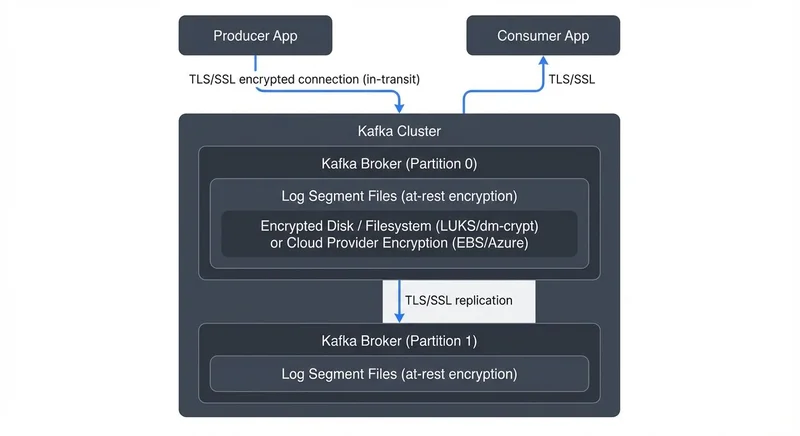

# Encryption at Rest and In Transit for Kafka

Data security is a critical concern for organizations running Apache Kafka in production environments. As Kafka often handles sensitive information such as financial transactions, personal data, or proprietary business events, protecting this data from unauthorized access is essential. Two fundamental security measures are encryption in transit and encryption at rest, which together ensure that data remains protected throughout its lifecycle in the streaming platform.

This article explores both encryption mechanisms, their implementation in modern Kafka deployments, and how they integrate with broader security architectures including authentication, authorization, and compliance frameworks. Whether you're securing a new Kafka cluster or hardening an existing deployment, understanding these encryption approaches is fundamental to building trustworthy streaming infrastructure.

## Understanding Encryption in Transit

Encryption in transit protects data as it moves between different components of your Kafka cluster. In a typical Kafka deployment, data flows between producers, brokers, consumers, and administrative tools. Without encryption, this data travels as plaintext across the network, making it vulnerable to interception through packet sniffing or man-in-the-middle attacks.



<!-- ORIGINAL_DIAGRAM
```
┌──────────────────────────────────────────────────────────────────┐
│              Kafka Encryption Architecture                       │
├──────────────────────────────────────────────────────────────────┤
│                                                                  │
│  Producer                    Kafka Cluster              Consumer │
│  ┌────────┐                                            ┌────────┐│
│  │        │  TLS/SSL encrypted                TLS/SSL  │        ││
│  │  App   │─────────────────────────────────────────▶│  App   ││
│  │        │     connection (in-transit)               │        ││
│  └────────┘                                            └────────┘│
│      │                                                      ▲    │
│      │                                                      │    │
│      ▼                                                      │    │
│  ┌──────────────────────────────────────────────────────────┐   │
│  │              Kafka Broker (Partition 0)                  │   │
│  │  ┌────────────────────────────────────────────────────┐  │   │
│  │  │  Log Segment Files (at-rest encryption)            │  │   │
│  │  │  ┌──────────────────────────────────────────────┐  │  │   │
│  │  │  │ Encrypted Disk / Filesystem (LUKS/dm-crypt) │  │  │   │
│  │  │  │ or Cloud Provider Encryption (EBS/Azure)     │  │  │   │
│  │  │  └──────────────────────────────────────────────┘  │  │   │
│  │  └────────────────────────────────────────────────────┘  │   │
│  └──────────────────────────────────────────────────────────┘   │
│                              │                                   │
│                              │ TLS/SSL replication               │
│                              ▼                                   │
│  ┌──────────────────────────────────────────────────────────┐   │
│  │              Kafka Broker (Partition 1)                  │   │
│  │  ┌────────────────────────────────────────────────────┐  │   │
│  │  │  Log Segment Files (at-rest encryption)            │  │   │
│  │  └────────────────────────────────────────────────────┘  │   │
│  └──────────────────────────────────────────────────────────┘   │
│                                                                  │
└──────────────────────────────────────────────────────────────────┘
```
-->

Kafka implements encryption in transit using Transport Layer Security (TLS), formerly known as SSL. When TLS is enabled, all communication between clients and brokers becomes encrypted, ensuring that even if network traffic is intercepted, the data remains unreadable to unauthorized parties.

TLS provides three key security benefits:

1. **Confidentiality**: Encrypts data to prevent eavesdropping during transmission
2. **Integrity**: Detects any tampering or modification of data in transit
3. **Authentication**: When combined with certificate verification, confirms the identity of communicating parties

Modern Kafka deployments should use TLS 1.3, which offers significant advantages over TLS 1.2. TLS 1.3 reduces handshake latency by 33%, eliminates deprecated cipher suites (including vulnerable algorithms like RC4 and 3DES), provides improved forward secrecy, and delivers better performance on modern CPUs with hardware acceleration.

For example, a financial services company streaming credit card transactions through Kafka would use TLS 1.3 encryption to ensure that transaction data cannot be captured and read by attackers monitoring network traffic between their payment processing microservices. The reduced handshake latency of TLS 1.3 also minimizes the performance impact on high-frequency trading systems where every millisecond matters.

Organizations planning for long-term security should also be aware of post-quantum cryptography developments. While not yet standard in Kafka, NIST's post-quantum algorithms (CRYSTALS-Kyber for key establishment and CRYSTALS-Dilithium for signatures) are being integrated into TLS 1.3 implementations to protect against future quantum computing threats. Forward-thinking security teams are monitoring these developments and preparing migration strategies.

## Understanding Encryption at Rest

Encryption at rest protects data stored on disk. In Kafka, this primarily means protecting log segments stored on broker filesystems. Even with encrypted network communication, data written to disk remains vulnerable if storage devices are physically stolen, improperly decommissioned, or accessed by unauthorized users with system-level privileges.

Unlike encryption in transit, Kafka does not provide built-in encryption at rest. Instead, organizations typically rely on filesystem-level or disk-level encryption mechanisms provided by the operating system or storage infrastructure.

Common approaches include:

- **Linux Unified Key Setup (LUKS)**: Provides full-disk encryption for Linux systems, transparently encrypting all data written to the partition
- **dm-crypt**: Offers block device encryption at the kernel level, working underneath the filesystem layer
- **eCryptfs**: Provides filesystem-level encryption with per-file granularity
- **Cloud provider encryption**: AWS EBS encryption, Azure Disk Encryption, and Google Cloud persistent disk encryption offer managed encryption with integrated key management
- **Hardware-based encryption**: Self-encrypting drives (SEDs) implement encryption in the drive controller, offering high performance with minimal CPU overhead

A healthcare organization handling patient records through Kafka event streams would implement encryption at rest to meet HIPAA (Health Insurance Portability and Accountability Act) compliance requirements, ensuring that even if backup tapes or decommissioned drives fall into the wrong hands, the data remains protected. HIPAA specifically requires encryption of electronic protected health information (ePHI) both in transit and at rest, with documented key management procedures.

Modern cloud deployments often use envelope encryption, where data is encrypted with a data encryption key (DEK), and the DEK itself is encrypted with a key encryption key (KEK) managed by a cloud KMS service like AWS KMS, Azure Key Vault, or Google Cloud KMS. This architecture separates data encryption from key management, enabling centralized key rotation and access policies without re-encrypting all stored data.

## Implementing Encryption in Transit for Kafka

Configuring TLS encryption in Kafka involves several steps. First, you must generate or obtain SSL certificates for your brokers. Each broker needs a keystore containing its private key and certificate, along with a truststore containing certificates of trusted certificate authorities (CAs).

### Certificate Generation and Management

In 2025, manual certificate management is largely obsolete for production Kafka deployments. Modern approaches use:

- **cert-manager** (Kubernetes): Automates certificate issuance, renewal, and rotation for Kafka running on Kubernetes
- **HashiCorp Vault PKI**: Provides automated certificate generation with short TTLs (time-to-live), reducing blast radius from compromised certificates
- **AWS Certificate Manager (ACM) Private CA**: Integrates with AWS infrastructure for managed certificate lifecycle
- **Let's Encrypt with ACME protocol**: Offers free, automated certificates for internet-facing Kafka endpoints

These tools eliminate the operational burden of tracking certificate expiration dates and performing manual rotations—a common source of production outages.

### Broker Configuration

The broker configuration requires enabling SSL on the appropriate listeners. Here's a modern broker configuration:

```properties
# Enable SSL listener (TLS 1.3 with KRaft)
listeners=SSL://kafka1.example.com:9093
security.inter.broker.protocol=SSL

# Keystore configuration (broker's certificate and private key)
ssl.keystore.location=/var/private/ssl/kafka.server.keystore.jks
ssl.keystore.password=keystore-password
ssl.key.password=key-password

# Truststore configuration (CA certificates for client validation)
ssl.truststore.location=/var/private/ssl/kafka.server.truststore.jks
ssl.truststore.password=truststore-password

# Require client authentication for mutual TLS (mTLS)
ssl.client.auth=required

# TLS 1.3 specific settings (2025 best practice)
ssl.enabled.protocols=TLSv1.3,TLSv1.2
ssl.cipher.suites=TLS_AES_256_GCM_SHA384,TLS_AES_128_GCM_SHA256

# Certificate validation
ssl.endpoint.identification.algorithm=https
```

### Client Configuration

Producer and consumer clients must also be configured with appropriate SSL properties:

```properties
security.protocol=SSL
ssl.truststore.location=/var/private/ssl/client.truststore.jks
ssl.truststore.password=truststore-password

# For mutual TLS authentication
ssl.keystore.location=/var/private/ssl/client.keystore.jks
ssl.keystore.password=client-keystore-password
ssl.key.password=client-key-password

# Enable TLS 1.3
ssl.enabled.protocols=TLSv1.3
```

### Simplified Management with Conduktor

Platforms like Conduktor simplify the process of connecting to SSL-enabled clusters by handling certificate configuration and validation through their interfaces, reducing the complexity of managing connection credentials across team members. Conduktor provides:

- Visual certificate upload and validation
- Automatic hostname verification
- Team-based credential sharing without exposing private keys
- Certificate expiration monitoring and alerts
- Integrated testing to verify SSL connectivity before deploying applications

This dramatically reduces the learning curve for teams new to Kafka security and prevents common misconfigurations that lead to connection failures.

## Implementing Encryption at Rest for Kafka

The most common approach to encryption at rest is operating system-level disk encryption. On Linux systems, LUKS provides a standard for full-disk encryption. Once configured, this encryption is transparent to Kafka—the broker reads and writes data normally while the OS handles encryption and decryption automatically.

### Cloud Provider Encryption

For cloud deployments, enabling provider-managed encryption is often the simplest approach:

- **AWS EBS encryption**: Encrypts volumes using AES-256 encryption with keys managed through AWS Key Management Service (KMS). Supports both AWS-managed keys and customer-managed keys (CMK) for enhanced control
- **Azure Disk Encryption**: Uses BitLocker (Windows) or dm-crypt (Linux) with keys stored in Azure Key Vault. Integrates with Azure RBAC for access control
- **Google Cloud persistent disk encryption**: Automatic encryption of all data at rest with Google-managed keys, or customer-managed encryption keys (CMEK) via Cloud KMS

These managed services handle key rotation, logging, and compliance reporting automatically, significantly reducing operational overhead.

### Key Management Best Practices

The key consideration with encryption at rest is key management. Encryption keys must be protected and rotated regularly according to security policies:

- **Hardware Security Modules (HSMs)**: Provide FIPS 140-2 Level 3 certified protection for encryption keys, required for many compliance frameworks
- **Cloud KMS services**: AWS KMS, Azure Key Vault, and Google Cloud KMS offer managed HSM-backed key storage with automated rotation and audit logging
- **Key rotation schedules**: Industry best practice recommends rotating encryption keys every 90 days for sensitive data, with automated rotation preventing human error
- **Separation of duties**: Key administrators should be separate from data administrators, preventing any single person from accessing both encrypted data and decryption keys

Modern zero-trust architectures treat key management as a critical control plane, with comprehensive audit trails showing every key access and usage.

### Application-Level Encryption

Some organizations implement application-level encryption, where data is encrypted by producers before being sent to Kafka and decrypted by consumers after retrieval. This approach provides end-to-end protection but requires careful key management and increases application complexity.

Benefits of application-level encryption:
- Data remains encrypted in Kafka brokers, protecting against broker compromise
- Enables selective encryption of specific fields (PII protection)
- Supports different encryption keys for different data sensitivity levels

Drawbacks include:
- Prevents Kafka from compressing encrypted data effectively
- Requires key distribution to all producers and authorized consumers
- Adds latency for encryption/decryption operations
- Complicates troubleshooting (cannot inspect message contents in brokers)

Governance platforms like Conduktor can implement encryption and decryption at an intermediate layer, providing a middle ground between application-level and infrastructure-level encryption. This approach centralizes key management and encryption policies while maintaining data utility within Kafka for operations like monitoring and debugging.

## Performance and Operational Considerations

Encryption introduces computational overhead that impacts throughput and latency, though 2025 hardware and software optimizations have significantly reduced these impacts.

### TLS Performance in 2025

Modern TLS 1.3 implementations with current hardware show:

- **CPU overhead**: 3-8% on brokers and clients with AVX-512 and AES-NI instruction sets (down from 5-15% in older implementations)
- **Handshake latency**: TLS 1.3's 1-RTT handshake adds 1-5ms for new connections, with 0-RTT resumption eliminating this for subsequent connections
- **Throughput impact**: Minimal at typical message sizes (>1KB); more noticeable for high-volume scenarios with tiny messages (<100 bytes)
- **Connection pooling**: Long-lived Kafka connections amortize handshake costs; proper client configuration reuses connections across thousands of messages

Intel and AMD processors with dedicated AES instructions (AES-NI) can encrypt/decrypt at line speed, while ARM processors with cryptography extensions (ARMv8-A) offer similar capabilities. AWS Graviton3 and Graviton4 instances provide exceptional price-performance for encrypted Kafka workloads.

### Encryption at Rest Performance

Hardware-accelerated encryption at rest using AES-256 typically adds less than 3% overhead. Self-encrypting drives (SEDs) implement encryption in the drive controller, delivering performance indistinguishable from unencrypted disks while providing transparent protection.

Cloud provider managed encryption (EBS, Azure Disk) uses hardware acceleration and adds negligible overhead—typically unmeasurable in Kafka benchmarks.

### Capacity Planning

When planning capacity for encrypted Kafka clusters:

- Allocate 5-10% additional CPU headroom for encryption overhead
- Monitor CPU utilization metrics: `kafka.server:type=BrokerTopicMetrics,name=BytesInPerSec` alongside CPU percentage
- Test under realistic load patterns—encryption impact varies with message size and throughput characteristics
- Consider hardware with dedicated encryption acceleration for cost-effective scaling

### Certificate and Key Rotation

Key rotation procedures should be established and tested regularly:

- **Automated certificate rotation**: Use cert-manager, Vault, or cloud-native tools to rotate certificates every 30-90 days
- **Zero-downtime rotation**: Kafka supports hot certificate reloading—update keystores without broker restart (requires Kafka 2.5+)
- **Pre-expiration monitoring**: Alert 30, 14, and 7 days before certificate expiration to prevent outages
- **Encryption key rotation**: Rotate KMS keys annually or per compliance requirements, using envelope encryption to avoid re-encrypting all data

Automated rotation eliminates human error—the leading cause of certificate-related outages. Tools like Conduktor monitor certificate expiration across all clusters and alert operations teams well in advance.

### Compliance Requirements

Understanding industry-specific compliance requirements helps determine appropriate encryption scope:

- **GDPR (General Data Protection Regulation)**: Requires "appropriate technical measures" for personal data protection, strongly recommending encryption for sensitive data
- **HIPAA (Health Insurance Portability and Accountability Act)**: Mandates encryption of electronic protected health information (ePHI) in transit and at rest
- **PCI DSS (Payment Card Industry Data Security Standard)**: Requires encryption of cardholder data in transit over public networks and encryption of stored data
- **SOC 2 Type II**: Expects encryption controls as part of security and confidentiality trust service criteria
- **FedRAMP (Federal Risk and Authorization Management Program)**: Mandates FIPS 140-2 validated cryptographic modules for government data

These frameworks increasingly expect encryption by default, not as an optional control. Modern security architectures treat encryption as foundational, not exceptional.

## Encryption and the Broader Security Architecture

Encryption works best as part of a comprehensive security strategy that includes authentication, authorization, and monitoring:

- **Authentication**: Encryption in transit often provides authentication through mutual TLS (mTLS), where both client and server certificates verify identity. Learn more in [Kafka Authentication: SASL, SSL, and OAuth](/kafka-authentication-sasl-ssl-oauth) and [mTLS for Kafka](/mtls-for-kafka)
- **Authorization**: After authentication, Kafka ACLs determine what encrypted connections can access. See [Kafka ACLs and Authorization Patterns](/kafka-acls-and-authorization-patterns)
- **Comprehensive security**: Encryption is one pillar of Kafka security. Review [Kafka Security Best Practices](/kafka-security-best-practices) for the complete security picture

For data governance and compliance:
- **GDPR compliance**: Encryption helps satisfy GDPR's data protection requirements. See [GDPR Compliance for Data Teams](/gdpr-compliance-for-data-teams)
- **PII protection**: Combine encryption with field-level masking and tokenization. Review [PII Detection and Handling in Event Streams](/pii-detection-and-handling-in-event-streams)

## Summary

Encryption at rest and in transit are complementary security measures essential for protecting sensitive data in Apache Kafka deployments. Encryption in transit uses TLS 1.3 to protect data moving between producers, brokers, and consumers, while encryption at rest protects data stored on broker disks using filesystem or disk-level encryption.

In 2025, encryption implementation has become significantly more manageable through automation tools like cert-manager, HashiCorp Vault, and cloud-native KMS services. These tools handle certificate lifecycle management, key rotation, and compliance reporting—eliminating the operational burden that historically made encryption challenging.

Modern hardware acceleration (AES-NI, AVX-512, ARM cryptographic extensions) reduces encryption overhead to 3-8% for TLS and under 3% for encryption at rest. TLS 1.3 delivers improved performance while eliminating deprecated cipher suites, making it the standard for new deployments.

Organizations handling regulated or sensitive data should treat encryption as a mandatory security control, not an optional enhancement. The combination of TLS 1.3 encryption, managed disk encryption, automated key rotation, and comprehensive monitoring creates a defense-in-depth security posture that protects data throughout its lifecycle in the streaming platform.

Platforms like Conduktor simplify encryption implementation by providing visual certificate management, expiration monitoring, and policy enforcement—reducing complexity for teams implementing security controls across distributed Kafka environments.

## Sources and References

1. **Apache Kafka Documentation - Security**: Official guide covering TLS configuration, encryption, and authentication mechanisms for Kafka: https://kafka.apache.org/documentation/#security

2. **RFC 8446 - The Transport Layer Security (TLS) Protocol Version 1.3**: The official specification for TLS 1.3, detailing protocol improvements and security enhancements: https://datatracker.ietf.org/doc/html/rfc8446

3. **NIST Special Publication 800-111 - Guide to Storage Encryption Technologies**: Comprehensive guidance on encryption at rest, including full-disk encryption and key management: https://csrc.nist.gov/publications/detail/sp/800-111/final

4. **NIST Special Publication 800-52 Rev. 2 - Guidelines for TLS Implementations**: Federal guidelines for secure TLS configuration, cipher suite selection, and certificate validation: https://csrc.nist.gov/publications/detail/sp/800-52/rev-2/final

5. **NIST Post-Quantum Cryptography Project**: Information on quantum-resistant algorithms and migration planning for long-term security: https://csrc.nist.gov/projects/post-quantum-cryptography

6. **OWASP Transport Layer Protection Cheat Sheet**: Best practices for implementing TLS encryption in applications and infrastructure: https://cheatsheetseries.owasp.org/cheatsheets/Transport_Layer_Protection_Cheat_Sheet.html

7. **Cloud Security Alliance - Encryption in Transit Best Practices**: Industry guidance on securing data in motion across cloud and hybrid environments: https://cloudsecurityalliance.org/
