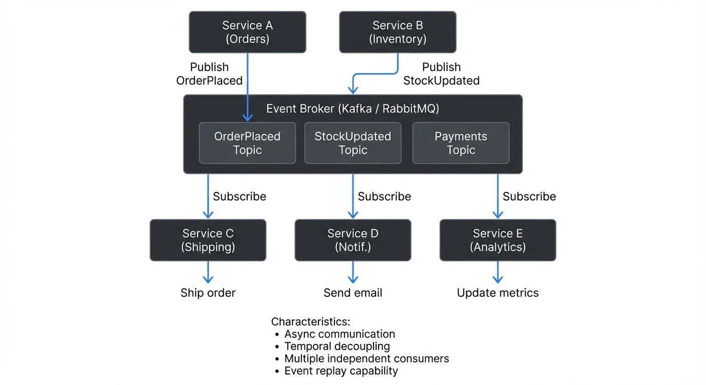

Modern software systems increasingly rely on real-time responsiveness, loose coupling between components, and the ability to scale independently. Event-driven architecture (EDA) has emerged as a fundamental design pattern for achieving these goals, enabling organizations to build systems that react to changes as they happen rather than polling for updates or maintaining tight integration between services.

Understanding event-driven architecture, its principles, patterns, and implementation challenges, is essential for anyone building distributed systems, microservices platforms, or real-time data pipelines.

## What is Event-Driven Architecture?

Event-driven architecture is a design pattern where systems communicate through events, immutable records of state changes or significant occurrences, rather than through direct, synchronous requests. An event is simply a notification that something happened: a change in the state of a system or a significant occurrence that other parts of the system might care about.

For example, a user clicking "Place Order" generates an event. Unlike traditional request-response architectures where Service A calls Service B directly and waits for a response, EDA allows Service A to publish the event and immediately continue its work, relying on the event infrastructure to handle delivery.

The core components include:

**Event Producers**: Services or applications that detect state changes and publish events. Producers are often unaware of which consumers will react to the event.

**Event Brokers**: The intermediary system responsible for receiving events from producers, persisting them, and routing them to interested consumers. This transport layer is crucial for achieving decoupling.

**Event Consumers**: Services that subscribe to events and react accordingly. Consumers act asynchronously and independently of one another.

<!-- ORIGINAL_DIAGRAM
```
┌────────────────────────────────────────────────────────────────┐
│              Event-Driven Architecture Flow                    │
├────────────────────────────────────────────────────────────────┤
│                                                                  │
│  ┌──────────────┐         ┌──────────────┐                    │
│  │   Service A  │         │   Service B  │                    │
│  │  (Orders)    │         │ (Inventory)  │                    │
│  └──────┬───────┘         └──────┬───────┘                    │
│         │ Publish                │ Publish                     │
│         │ OrderPlaced            │ StockUpdated                │
│         ▼                        ▼                             │
│  ┌─────────────────────────────────────────────────────┐      │
│  │            Event Broker (Kafka / RabbitMQ)          │      │
│  │  ┌──────────────┐  ┌──────────────┐  ┌──────────┐ │      │
│  │  │ OrderPlaced  │  │StockUpdated  │  │Payments  │ │      │
│  │  │   Topic      │  │   Topic      │  │  Topic   │ │      │
│  │  └──────────────┘  └──────────────┘  └──────────┘ │      │
│  └──────┬────────────────────┬────────────────┬───────┘      │
│         │                    │                │                │
│         │ Subscribe          │ Subscribe      │ Subscribe      │
│         ▼                    ▼                ▼                │
│  ┌────────────┐       ┌────────────┐   ┌─────────────┐       │
│  │  Service C │       │  Service D │   │  Service E  │       │
│  │ (Shipping) │       │  (Notif.)  │   │ (Analytics) │       │
│  └────────────┘       └────────────┘   └─────────────┘       │
│         │                    │                │                │
│         ▼                    ▼                ▼                │
│  Ship order          Send email      Update metrics           │
│                                                                  │
│  Characteristics:                                              │
│  • Async communication                                         │
│  • Temporal decoupling                                         │
│  • Multiple independent consumers                              │
│  • Event replay capability                                     │
│                                                                  │
└────────────────────────────────────────────────────────────────┘
```
-->

The general data flow: Producer publishes event → Broker ingests and persists event → Consumer(s) retrieve event and react.

## Core Principles: Decoupling, Asynchrony, and Reactivity

### Loose Coupling

In EDA, producers and consumers are decoupled, they don't need to know about each other's existence, location, or implementation details. The checkout service publishes "OrderPlaced" events without knowing whether one consumer, ten consumers, or zero consumers are listening. Adding a new consumer requires no code changes to the producer service.

This allows services to evolve independently, be deployed separately, and scale based on their own requirements rather than being limited by upstream or downstream dependencies.

### Asynchronous Communication

Unlike synchronous API calls that block until receiving a response, event-driven communication is inherently asynchronous. Producers publish events and continue processing without waiting for consumers to react. This prevents cascading failures, if the inventory service is temporarily unavailable, the checkout service continues operating, and events accumulate for processing once the inventory service recovers.

### Reactive Processing and Real-Time Responsiveness

Systems react to events in real time rather than polling for changes or operating on fixed schedules. When a payment completes, the fulfillment process begins immediately through event processing rather than waiting for a batch job to detect the status change. This reactivity enables lower latency, more responsive user experiences, and more efficient resource utilization.

## Event-Driven Patterns: Choreography vs Orchestration

### Event Choreography

In choreography, services react independently to events without centralized control. When an "OrderPlaced" event occurs, the inventory service reserves stock, the payment service processes payment, the fulfillment service begins shipping, and the notification service sends updates, all independently. No single service orchestrates this workflow. This pattern maximizes decoupling and service autonomy but can make workflows harder to understand and debug.

### Event Orchestration

In orchestration, a central workflow engine coordinates the process by sending commands to services and waiting for response events. A saga orchestrator sends commands sequentially: reserve stock, process payment, ship order, waiting for confirmation events between steps. This pattern provides centralized visibility and control, making workflows easier to understand and monitor, but introduces a coordination point that reduces some decoupling benefits.

**When to Use Each**: Choose choreography for simple workflows where services have clear, independent responsibilities. Use orchestration for complex, long-running workflows requiring compensation logic, human intervention, or centralized monitoring, such as financial transactions or order fulfillment with multiple failure scenarios.

## Streaming Platforms as the Event Backbone

### Apache Kafka: Beyond Message Queues

Apache Kafka has emerged as the dominant platform for event-driven systems due to its unique architecture. Unlike traditional message queues that delete messages after consumption, Kafka is a distributed, durable, and ordered commit log (a persistent, append-only data structure where events are stored sequentially):

**Durability and Replayability**: Kafka persists events for a configurable period (days, weeks, or indefinitely). If a consumer fails, it can resume from where it left off. New services can replay the entire history of events to build their initial state, enabling event sourcing (an architectural pattern where all state changes are stored as a sequence of events), where the event log becomes the system of record. For detailed coverage of this pattern, see [Event Sourcing Patterns with Kafka](https://conduktor.io/glossary/event-sourcing-patterns-with-kafka).

**Ordering Guarantees**: Events with the same partition key (a routing attribute that determines which partition an event goes to, such as order_id or customer_id) are written to the same partition, ensuring they're processed in the order they occurred. This maintains business logic integrity, all events for order #12345 process sequentially, while events for order #67890 process in parallel on different partitions. For partition strategy details, see [Kafka Partitioning Strategies and Best Practices](https://conduktor.io/glossary/kafka-partitioning-strategies-and-best-practices).

**Scalable Distribution**: Multiple independent consumers read the same events at their own pace without interfering. A real-time analytics service and a data warehouse loader both consume "OrderPlaced" events simultaneously, each processing at different speeds. For consumer group mechanics, see [Kafka Consumer Groups Explained](https://conduktor.io/glossary/kafka-consumer-groups-explained).

**Elastic Buffering**: Kafka accommodates high event traffic bursts by acting as a buffer between producers and consumers, preventing overload. Modern Kafka 4.0+ clusters with optimized configurations can handle millions of events per second per broker, with throughput scaling linearly as brokers are added.

### Modern Kafka Architecture: KRaft Mode

Since Kafka 4.0 (2024), Apache Kafka has eliminated its dependency on ZooKeeper through KRaft (Kafka Raft), a built-in consensus protocol that simplifies operations and improves performance:

**Simplified Operations**: KRaft removes the need to deploy and maintain a separate ZooKeeper ensemble, reducing operational complexity and infrastructure requirements. Cluster metadata is now managed internally by Kafka controllers.

**Faster Recovery**: Metadata changes propagate more quickly through the Raft consensus protocol, enabling faster leader elections and cluster recovery after failures, reducing downtime from minutes to seconds in some scenarios.

**Better Scalability**: KRaft supports larger clusters (10,000+ partitions) with improved metadata performance. Metadata operations that previously scaled with ZooKeeper's limitations now scale with Kafka's distributed log architecture.

**Production Ready**: KRaft became production-ready in Kafka 3.3 and is now the standard deployment mode in Kafka 4.0+. All new Kafka deployments should use KRaft mode. For migration details, see [Understanding KRaft Mode in Kafka](https://conduktor.io/glossary/understanding-kraft-mode-in-kafka).

## Building Event-Driven Systems: Design Considerations

### Event Schema Design

Events need well-defined schemas (structured definitions of event format and fields) to ensure producers and consumers agree on structure. Use schema registries to enforce contracts between services and manage schema evolution. A schema registry validates event schemas before allowing producers to publish, preventing malformed events from breaking downstream consumers.

Common schema formats include **Avro** (compact binary format with strong typing), **Protobuf** (Google's efficient binary protocol), and **JSON Schema** (human-readable but larger). Avro and Protobuf offer better performance and built-in versioning support.

Design events as immutable facts about what happened, including event type and version, timestamp, entity identifiers, and relevant state changes. For detailed schema management patterns, see [Schema Registry and Schema Management](https://conduktor.io/glossary/schema-registry-and-schema-management) and [Schema Evolution Best Practices](https://conduktor.io/glossary/schema-evolution-best-practices).

### Handling Eventual Consistency

Event-driven systems embrace eventual consistency, state across services converges over time rather than being immediately consistent. Design systems to handle this by using correlation IDs (unique identifiers like order-123-correlation-id) that propagate through all events in a workflow, allowing you to trace the entire chain from OrderPlaced through StockReserved to PaymentCompleted.

Implement the Saga Pattern to manage multi-step business transactions through a sequence of local transactions. If one step fails, compensating transactions (rollback actions that undo previous steps) undo previous steps, for example, if payment fails after inventory reservation, a compensation transaction releases the reserved stock. For comprehensive Saga implementation details, see [Saga Pattern for Distributed Transactions](https://conduktor.io/glossary/saga-pattern-for-distributed-transactions).

### Event Processing Styles

**Event Notification (Simple Reaction)**: A consumer performs an immediate, isolated action based on the received event, for example, sending a confirmation email when OrderPlaced arrives.

**Event Stream Processing (Stateful Computation)**: Consumers use dedicated stream processing engines like Apache Flink (1.19+) or Kafka Streams for complex, continuous, and stateful computations. For example, fraud detection reads PaymentAttempt events, maintains state per user, and blocks attempts after detecting five failures within 60 seconds. For framework comparisons, see [Kafka Streams vs Apache Flink](https://conduktor.io/glossary/kafka-streams-vs-apache-flink) and [Introduction to Kafka Streams](https://conduktor.io/glossary/introduction-to-kafka-streams).

### Ensuring Idempotency

Network failures and retries mean events may be delivered multiple times. Design consumers to be idempotent, processing the same event twice produces the same result as processing it once.

Common idempotency techniques include:

1. **Event ID Tracking**: Store processed event IDs in a database. Before processing, check if the event ID exists; if so, skip processing.

   ```python
   def process_event(event):
       if redis.exists(f"processed:{event.id}"):
           return  # Already processed

       # Process the event
       update_inventory(event.product_id, event.quantity)

       # Mark as processed (with expiration)
       redis.setex(f"processed:{event.id}", 86400, "1")
   ```

2. **Natural Idempotency**: Design operations that are inherently idempotent. For example, setting `order_status = "SHIPPED"` multiple times has the same effect.

3. **Exactly-Once Semantics**: Modern Kafka (3.0+) provides exactly-once processing guarantees through transactions. When enabled, Kafka ensures each event is processed exactly once, even with retries. For implementation details, see [Exactly-Once Semantics](https://conduktor.io/glossary/exactly-once-semantics) and [Kafka Transactions Deep Dive](https://conduktor.io/glossary/kafka-transactions-deep-dive).

### Error Handling and Dead Letter Queues

Implement retry logic with exponential backoff for transient failures. For events that fail repeatedly, route them to dead letter queues, separate Kafka topics where failed events are stored for manual inspection. This prevents poison messages (malformed or problematic events that cause repeated processing failures) from blocking subsequent events while preserving failed events for investigation.

Dead letter queues enable operations teams to inspect failures, fix issues, and replay events once resolved. Modern error handling strategies also include circuit breakers (automatically stopping processing after repeated failures to prevent cascade effects) and alerting on DLQ accumulation.

For reliable event publishing from databases, the **Outbox Pattern** ensures events are published atomically with database transactions, preventing data inconsistencies when services crash between database commits and event publishing. See [Outbox Pattern for Reliable Event Publishing](https://conduktor.io/glossary/outbox-pattern-for-reliable-event-publishing) for implementation details.

## Observability and Governance in Event-Driven Systems

As event-driven architectures scale, operational visibility becomes critical. Traditional monitoring focused on individual services misses the cross-service event flows that define business processes.

### Key Governance Challenges

**Tracking Event Flows**: Understanding how events flow through distributed systems, which services produce and consume each event type, processing times, and failure locations, requires sophisticated observability using correlation IDs to reconstruct complete business transaction paths.

**Event Lineage and Dependencies**: Before modifying an event schema, teams need to identify all downstream consumers and assess impact. Without centralized visibility, this requires manually surveying teams across repositories.

**Schema Management**: Schema validation prevents producers from publishing malformed events. When producers attempt new schema versions, registries validate backward compatibility before allowing changes.

**Monitoring Processing Latency**: End-to-end latency spans multiple services and event hops. Teams track metrics like time-in-broker and processing-time-per-event to identify optimization opportunities.

**Maintaining Event Catalogs**: As organizations adopt EDA, event types grow rapidly. Teams need catalogs documenting available events, schemas, business meaning, producing services, and consuming services.

### Modern Governance Tooling

Governance platforms like **Conduktor** address these challenges by providing centralized visibility across event-driven systems:

- **Event Lineage Visualization**: Track which services produce and consume each event type, understanding data flow dependencies across the architecture
- **Consumer Lag Monitoring**: Identify bottlenecks and processing delays by tracking how far behind consumers are from the latest events
- **Event Catalog Management**: Maintain searchable catalogs with schema documentation, ownership information, and business context. Teams can explore and manage [Kafka topics](https://docs.conduktor.io/guide/manage-kafka/kafka-resources/topics) through a unified interface
- **Security Policy Enforcement**: Apply access controls, data masking, and audit logging centrally across all event streams
- **Distributed Tracing**: Trace event flows through multiple services using correlation IDs to debug complex business processes
- **Testing and Chaos Engineering**: [Conduktor Gateway](https://docs.conduktor.io/guide/conduktor-in-production/deploy-artifacts/deploy-gateway/index) enables intercepting, modifying, or failing event flows to test resilience without disrupting production systems

These capabilities transform event-driven architectures from difficult-to-observe distributed systems into manageable platforms with full operational visibility.

## Summary

Event-driven architecture enables building reactive, loosely coupled systems that scale independently and respond to changes in real time. Modern streaming platforms like Apache Kafka 4.0+ with KRaft have transformed EDA from theoretical pattern into practical infrastructure, providing the durability, ordering guarantees, and scalability needed for production systems.

Success with event-driven architecture requires:

- **Choosing appropriate patterns** based on workflow complexity (choreography vs orchestration)
- **Designing robust event schemas** with versioning strategies using Avro or Protobuf
- **Implementing idempotent consumers** to handle duplicate event delivery safely
- **Mastering distributed transaction patterns** like Sagas for managing eventual consistency
- **Using correlation IDs** to trace business processes across service boundaries
- **Monitoring end-to-end latency** and consumer lag to identify performance bottlenecks
- **Establishing governance practices** for cataloging, lineage tracking, schema enforcement, and access control

As systems grow, governance becomes as critical as technical implementation. Platforms like Conduktor provide the centralized visibility, testing capabilities, and operational controls needed to operate event-driven architectures at scale. For related architectural patterns, see [Event-Driven Microservices Architecture](https://conduktor.io/glossary/event-driven-microservices-architecture) and [Event Stream Fundamentals](https://conduktor.io/glossary/event-stream-fundamentals).

## Related Concepts

- [Kafka Topics, Partitions, and Brokers: Core Architecture](https://conduktor.io/glossary/kafka-topics-partitions-brokers-core-architecture) - Understanding Kafka's foundational components for event-driven systems
- [Schema Registry and Schema Management](https://conduktor.io/glossary/schema-registry-and-schema-management) - Managing event schema evolution and validation
- [Event-Driven Microservices Architecture](https://conduktor.io/glossary/event-driven-microservices-architecture) - Applying event-driven patterns to microservices architectures

## Sources and References

- Fowler, Martin. [What do you mean by 'Event-Driven'?](https://martinfowler.com/articles/201701-event-driven.html) martinfowler.com, 2017.
- Apache Software Foundation. [Apache Kafka Documentation: Introduction and Use Cases](https://kafka.apache.org/intro)
- Fowler, Martin. [The Many Meanings of Event-Driven Architecture](https://www.youtube.com/watch?v=STKCRSUsyP0). Goto Conference 2017.
