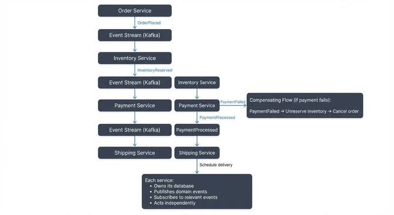

Modern applications require flexibility, scalability, and resilience. As systems grow in complexity, traditional request-response architectures often struggle to meet these demands. Event-driven microservices architecture addresses these challenges by combining the modularity of microservices with the loose coupling and asynchronous communication of event-driven design.

This article explores what event-driven microservices are, their core components, benefits and trade-offs, and how they connect to modern data streaming platforms.

## What is Event-Driven Microservices Architecture?

Event-driven microservices architecture is a design pattern where independent services communicate by publishing and consuming events rather than making direct synchronous calls. An event represents a state change or significant occurrence in the system, such as "OrderPlaced" or "PaymentProcessed."

In this architecture, services don't need to know about each other directly. Instead, they publish events to an event broker when something noteworthy happens. Other services that care about those events subscribe to them and react accordingly. This decoupling enables services to evolve independently and reduces cascading failures when one service becomes unavailable.

The key distinction from traditional microservices is the communication pattern. Instead of Service A calling Service B's API directly, Service A publishes an event that Service B listens for. This shift from "tell me" to "I'll tell you when something happens" fundamentally changes how systems are designed.

## Core Components and Patterns

### Event Broker

The event broker is the central nervous system of an event-driven architecture. It receives events from producers and delivers them to consumers. Popular event brokers include Apache Kafka, RabbitMQ, and Amazon EventBridge. The broker provides persistence, ordering guarantees, and the ability to replay events.

### Producers and Consumers

Producers are services that publish events when their internal state changes. Consumers subscribe to specific event types and execute business logic in response. A single event may have multiple consumers, each handling it differently based on their responsibilities.

### Common Patterns

**Event Sourcing** stores every state change as an event, creating an immutable audit log. Instead of storing current state, you store the sequence of events that led to that state. This enables time travel debugging and complete system reconstruction.

**Command Query Responsibility Segregation (CQRS)** separates write operations (commands) from read operations (queries). Events update specialized read models optimized for specific queries, improving performance and scalability.

For detailed implementation patterns combining these approaches, see [CQRS and Event Sourcing with Kafka](https://conduktor.io/glossary/cqrs-and-event-sourcing-with-kafka).

**Saga Pattern** manages distributed transactions across multiple services. Instead of a two-phase commit, each service performs its local transaction and publishes an event. If something fails, compensating events undo previous operations. For a comprehensive guide to implementing sagas, see [Saga Pattern for Distributed Transactions](https://conduktor.io/glossary/saga-pattern-for-distributed-transactions).

**Outbox Pattern** ensures reliable event publishing by writing events to a database table in the same transaction as business data, then asynchronously publishing them to the event broker. This prevents lost events when services crash after updating data but before publishing. For implementation details, see [Outbox Pattern for Reliable Event Publishing](https://conduktor.io/glossary/outbox-pattern-for-reliable-event-publishing).

## Benefits and Trade-offs

### Benefits

**Loose Coupling**: Services don't need to know about downstream consumers. You can add new services that react to existing events without modifying producers.

**Scalability**: Services can be scaled independently based on their event processing needs. If one consumer can't keep up, you can add more instances without affecting other parts of the system.

**Resilience**: When a service goes down, events are retained by the broker. Once the service recovers, it can process missed events. This prevents data loss and enables self-healing systems.

**Flexibility**: New features can be built by subscribing to existing events. This accelerates development and reduces the risk of breaking existing functionality.

### Trade-offs

**Increased Complexity**: Debugging distributed systems is harder than monoliths. Understanding how data flows through multiple asynchronous services requires sophisticated monitoring and tracing tools.

**Eventual Consistency**: Unlike synchronous systems where you get immediate confirmation, event-driven systems embrace eventual consistency. Different services may temporarily have different views of the data.

**Message Ordering**: Ensuring events are processed in the correct order across partitions and services requires careful design. Out-of-order processing can lead to incorrect state.

## Event-Driven Architecture and Data Streaming

Data streaming platforms like Apache Kafka and Apache Flink are the foundation of modern event-driven microservices. While a simple message queue might work for basic use cases, streaming platforms provide critical capabilities for production systems.

Modern Kafka deployments (Kafka 4.0+) use **KRaft mode**, which eliminates the ZooKeeper dependency and simplifies operations. KRaft provides faster metadata propagation, improved scalability, and easier cluster management, making it the recommended architecture for new deployments in 2025. For more details on this architectural change, see [Understanding KRaft Mode in Kafka](https://conduktor.io/glossary/understanding-kraft-mode-in-kafka).

### Event Persistence and Replay

Unlike traditional message queues that delete messages after consumption, Kafka retains events for a configured period. This enables new services to replay historical events, recover from failures, and reprocess data with updated logic. You can rebuild entire databases from the event stream if needed.

### Stream Processing

Apache Flink and Kafka Streams enable real-time event processing. You can filter, aggregate, join, and transform events as they flow through the system. For example, you might compute running totals, detect patterns, or enrich events with data from other sources.

For comprehensive coverage of stream processing frameworks, see [What is Apache Flink: Stateful Stream Processing](https://conduktor.io/glossary/what-is-apache-flink-stateful-stream-processing) and [Introduction to Kafka Streams](https://conduktor.io/glossary/introduction-to-kafka-streams).

### Scalability Through Partitioning

Kafka partitions events by key, enabling parallel processing across multiple consumer instances. If you partition orders by customer ID, different consumers can independently process different customers' orders, dramatically increasing throughput.

To understand how consumer groups enable parallel processing, see [Kafka Consumer Groups Explained](https://conduktor.io/glossary/kafka-consumer-groups-explained).

### Schema Evolution

As your system evolves, event structures change. Schema registries enforce compatibility rules and enable consumers to handle multiple event versions gracefully. This prevents breaking changes from cascading through your system.

The Schema Registry manages event schemas with compatibility modes (backward, forward, full) that ensure consumers can handle both old and new versions. Avro, Protobuf, and JSON Schema are common serialization formats that enable type safety and schema evolution.

For detailed guidance on managing schemas, see [Schema Registry and Schema Management](https://conduktor.io/glossary/schema-registry-and-schema-management) and [Schema Evolution Best Practices](https://conduktor.io/glossary/schema-evolution-best-practices). For comparing serialization formats, see [Avro vs Protobuf vs JSON Schema](https://conduktor.io/glossary/avro-vs-protobuf-vs-json-schema).

Tools like Conduktor provide visual monitoring of event flows, schema validation, and data governance capabilities across your streaming infrastructure. Teams can use [self-service capabilities](https://docs.conduktor.io/guide/conduktor-concepts/self-service) to request and manage [Kafka topics](https://docs.conduktor.io/guide/manage-kafka/kafka-resources/topics) with proper governance guardrails, making it easier to track schema evolution and enforce compatibility rules.

## Implementation Challenges

### Exactly-Once Semantics

Ensuring each event is processed exactly once is difficult in distributed systems. Network failures can cause duplicate deliveries or lost messages. Kafka provides exactly-once semantics, but implementing it correctly requires understanding idempotent producers and transactional consumers.

Example of a Kafka producer with exactly-once semantics (Java):

```java
Properties props = new Properties();
props.put("bootstrap.servers", "localhost:9092");
props.put("key.serializer", "org.apache.kafka.common.serialization.StringSerializer");
props.put("value.serializer", "io.confluent.kafka.serializers.KafkaAvroSerializer");
props.put("schema.registry.url", "http://localhost:8081");

// Enable idempotence for exactly-once semantics
props.put("enable.idempotence", "true");
props.put("acks", "all");
props.put("retries", Integer.MAX_VALUE);

// Transactional ID for exactly-once across multiple partitions
props.put("transactional.id", "order-service-producer-1");

KafkaProducer<String, GenericRecord> producer = new KafkaProducer<>(props);

// Initialize transactions
producer.initTransactions();

try {
    producer.beginTransaction();

    // Send multiple events atomically
    producer.send(new ProducerRecord<>("order-events", orderId, orderEvent));
    producer.send(new ProducerRecord<>("audit-events", orderId, auditEvent));

    producer.commitTransaction();
} catch (Exception e) {
    producer.abortTransaction();
    throw e;
}
```

This configuration ensures events are never duplicated and transactions are atomic across topics.

### Event Schema Design

Poorly designed event schemas create technical debt. Events should be immutable and self-contained with all necessary context. Avoid referencing external state that might change. Use descriptive names and include metadata like timestamps and correlation IDs for debugging.

Here's an example of a well-designed event schema using Avro:

```json
{
  "type": "record",
  "name": "OrderPlaced",
  "namespace": "com.example.orders.events",
  "fields": [
    {"name": "eventId", "type": "string"},
    {"name": "eventTime", "type": "long", "logicalType": "timestamp-millis"},
    {"name": "orderId", "type": "string"},
    {"name": "customerId", "type": "string"},
    {"name": "items", "type": {
      "type": "array",
      "items": {
        "type": "record",
        "name": "OrderItem",
        "fields": [
          {"name": "productId", "type": "string"},
          {"name": "quantity", "type": "int"},
          {"name": "pricePerUnit", "type": "double"}
        ]
      }
    }},
    {"name": "totalAmount", "type": "double"},
    {"name": "shippingAddress", "type": {
      "type": "record",
      "name": "Address",
      "fields": [
        {"name": "street", "type": "string"},
        {"name": "city", "type": "string"},
        {"name": "postalCode", "type": "string"},
        {"name": "country", "type": "string"}
      ]
    }},
    {"name": "correlationId", "type": "string"}
  ]
}
```

This schema is self-contained with all order details, includes metadata (eventId, eventTime, correlationId), and uses strong typing. Consumers can process this event without additional database lookups.

### Monitoring and Observability

Traditional request-response monitoring doesn't work for asynchronous systems. You need distributed tracing to follow events across service boundaries, metrics for lag and throughput, and alerting for processing delays. Understanding end-to-end latency requires correlation IDs that flow through the entire event chain.

Modern observability in 2025 leverages **OpenTelemetry** for standardized distributed tracing across microservices. OpenTelemetry provides automatic instrumentation for Kafka producers and consumers, enabling you to trace events from producer to consumer with minimal code changes.

Key monitoring tools include:
- **Kafka Lag Exporter**: Prometheus-based consumer lag monitoring
- **Burrow**: LinkedIn's consumer lag checking tool
- **Kafdrop**: Web UI for viewing topics, browsing messages, and monitoring consumer groups
- **Conduktor**: Enterprise platform for comprehensive monitoring, governance, and testing

For production systems, monitor these critical metrics:
- **Consumer lag**: Time delay between event production and consumption
- **Throughput**: Messages per second produced and consumed
- **Error rates**: Failed message processing and dead letter queue size
- **End-to-end latency**: Total time from event creation to final processing

### Testing

Testing event-driven systems is complex. Unit tests work for individual services, but integration tests must verify event flows across multiple services. Consider contract testing to ensure producers and consumers agree on event formats, and use test event streams to validate behavior without affecting production.

Modern testing strategies for 2025 include:

**Chaos Engineering**: Test system resilience by simulating failures. [Conduktor Gateway](https://docs.conduktor.io/guide/conduktor-in-production/deploy-artifacts/deploy-gateway/index) enables chaos testing scenarios like network latency, broker failures, message corruption, and throttling without affecting production infrastructure.

**Contract Testing**: Use tools like Pact to verify producer-consumer agreements. This ensures schema compatibility before deployment.

**Integration Testing**: Use embedded Kafka (Testcontainers) for realistic testing environments. This allows you to test complete event flows without requiring a full cluster.

**Performance Testing**: Validate throughput and latency under load to ensure your architecture meets SLAs before production deployment.

## Real-World Examples

### E-commerce Order Processing



<!-- ORIGINAL_DIAGRAM
```
┌──────────────────────────────────────────────────────────────────┐
│         Event-Driven Microservices: Order Processing             │
├──────────────────────────────────────────────────────────────────┤
│                                                                    │
│  ┌─────────────┐                                                 │
│  │   Order     │  OrderPlaced                                    │
│  │  Service    │──────┐                                          │
│  └─────────────┘      │                                          │
│                       ▼                                           │
│              ┌────────────────┐                                  │
│              │  Event Stream  │                                  │
│              │     (Kafka)    │                                  │
│              └───┬────────────┘                                  │
│                  │                                                │
│                  ▼                                                │
│         ┌────────────────┐     InventoryReserved                │
│         │   Inventory    │──────┐                                │
│         │    Service     │      │                                │
│         └────────────────┘      │                                │
│                                  ▼                                │
│                         ┌────────────────┐                       │
│                         │  Event Stream  │                       │
│                         │     (Kafka)    │                       │
│                         └───┬────────────┘                       │
│                             │                                     │
│                             ▼                                     │
│                    ┌────────────────┐   PaymentProcessed        │
│                    │    Payment     │──────┐                     │
│                    │    Service     │      │                     │
│                    └────────────────┘      │                     │
│                                             ▼                     │
│                                    ┌────────────────┐            │
│                                    │  Event Stream  │            │
│                                    │     (Kafka)    │            │
│                                    └───┬────────────┘            │
│                                        │                          │
│                                        ▼                          │
│                               ┌────────────────┐                 │
│                               │    Shipping    │                 │
│                               │    Service     │                 │
│                               └────────────────┘                 │
│                                        │                          │
│                                        ▼                          │
│                                 Schedule delivery                 │
│                                                                    │
│  ┌──────────────────────────────────────────────────────────┐   │
│  │  Compensating Flow (if payment fails):                   │   │
│  │  PaymentFailed → Unreserve inventory → Cancel order      │   │
│  └──────────────────────────────────────────────────────────┘   │
│                                                                    │
│  Each service:                                                   │
│  • Owns its database                                             │
│  • Publishes domain events                                       │
│  • Subscribes to relevant events                                 │
│  • Acts independently                                            │
│                                                                    │
└──────────────────────────────────────────────────────────────────┘
```
-->

When a customer places an order, the Order Service publishes an "OrderPlaced" event. The Inventory Service consumes this event and reserves stock, then publishes "InventoryReserved." The Payment Service listens for inventory confirmation and processes payment, publishing "PaymentProcessed." Finally, the Shipping Service reacts to successful payment and schedules delivery.

If payment fails, a "PaymentFailed" event triggers compensating actions in other services to unreserve inventory and cancel the order. Each service maintains its own database and operates independently, but they coordinate through events to complete the business process.

### Financial Transaction Processing

Banks use event sourcing to maintain complete audit trails of every transaction. Each account operation (deposit, withdrawal, transfer) is stored as an event. The current balance is computed by replaying all events for that account. This provides regulatory compliance, enables fraud detection through pattern analysis, and supports disaster recovery by rebuilding state from events.

## Summary

Event-driven microservices architecture combines the independence of microservices with the loose coupling of event-driven design. Services communicate through events published to a broker, enabling scalability, resilience, and flexibility. However, this approach introduces complexity around eventual consistency, debugging, and message ordering.

Data streaming platforms like Apache Kafka provide the foundation for production event-driven systems, offering persistence, replay, stream processing, and scalability through partitioning. Success requires careful attention to schema design, monitoring, testing, and operational tooling.

This architecture excels when you need independent service scaling, complex workflows across multiple systems, or complete audit trails. It's particularly valuable in domains like e-commerce, financial services, and real-time analytics where business processes span multiple bounded contexts.

Start small with a few services and core events, then expand as you gain experience with the patterns and operational practices. The investment in learning event-driven architecture pays dividends in system flexibility and resilience.

## Related Concepts

- [Saga Pattern for Distributed Transactions](https://conduktor.io/glossary/saga-pattern-for-distributed-transactions) - Managing distributed transactions across microservices with compensating actions
- [Outbox Pattern for Reliable Event Publishing](https://conduktor.io/glossary/outbox-pattern-for-reliable-event-publishing) - Ensuring atomic database updates and event publishing
- [Schema Registry and Schema Management](https://conduktor.io/glossary/schema-registry-and-schema-management) - Managing event schema evolution across microservices

## Sources and References

1. Fowler, Martin. "What do you mean by 'Event-Driven'?" martinfowler.com, 2017. https://martinfowler.com/articles/201701-event-driven.html
2. Newman, Sam. "Building Microservices: Designing Fine-Grained Systems." O'Reilly Media, 2021.
3. Richardson, Chris. "Pattern: Event-driven architecture." Microservices.io. https://microservices.io/patterns/data/event-driven-architecture.html
4. Apache Kafka Documentation. "KRaft: Apache Kafka Without ZooKeeper." Apache Software Foundation, 2025. https://kafka.apache.org/documentation/#kraft
5. OpenTelemetry. "OpenTelemetry for Apache Kafka." Cloud Native Computing Foundation, 2025. https://opentelemetry.io/
6. Stopford, Ben. "Designing Event-Driven Systems." 2018.
