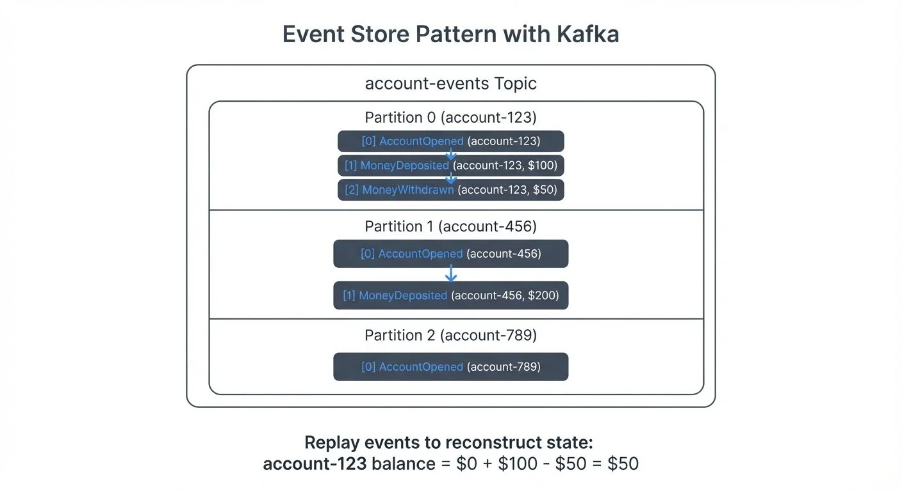
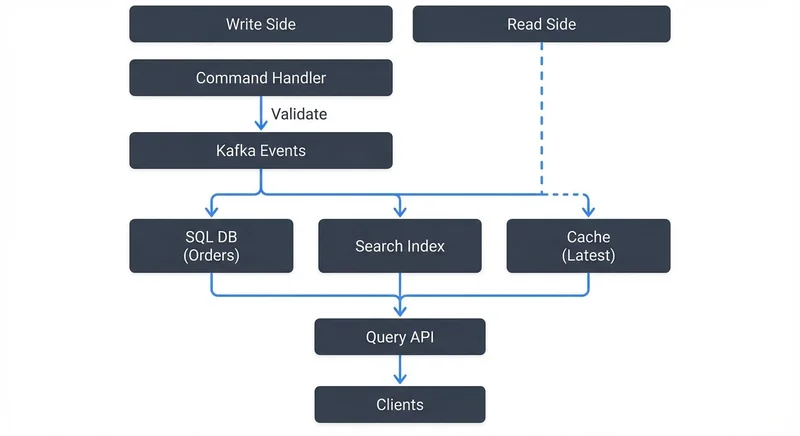

Event sourcing is a powerful architectural pattern that stores the state of a system as a sequence of events rather than as a current snapshot. When combined with Apache Kafka's distributed log capabilities, event sourcing enables scalable, auditable, and resilient systems. This article explores the core patterns, implementation strategies, and practical considerations for building event-sourced systems with Kafka.

## Understanding Event Sourcing

Event sourcing treats events as the source of truth for application state. Instead of storing only the current state of an entity in a database, event sourcing persists every state change as an immutable event. The current state can be reconstructed by replaying these events from the beginning.

For example, instead of storing a bank account balance as a single value that gets updated, an event-sourced system stores individual `AccountOpened`, `MoneyDeposited`, and `MoneyWithdrawn` events. The current balance is derived by processing all events in sequence.

This approach provides several benefits: complete audit trails, temporal queries (viewing state at any point in time), and the ability to rebuild state from scratch. However, it also introduces complexity in managing event schemas, handling event replay, and ensuring performance.

## Why Kafka Excels at Event Sourcing

Apache Kafka's architecture aligns naturally with event sourcing principles. Kafka topics function as distributed, durable, append-only logs—exactly what event sourcing requires. Modern Kafka deployments (Kafka 4.0+) use KRaft consensus for metadata management, eliminating ZooKeeper dependencies and simplifying operational complexity for event-sourced systems.

Key Kafka features that support event sourcing include:

**Immutability and Durability**: Events written to Kafka are immutable and persisted durably across multiple brokers, ensuring no data loss.

**Replay Capability**: Consumers can replay events from any point in the log by adjusting their offset, enabling state reconstruction and processing corrections. For details on managing consumer offsets and coordination, see [Kafka Consumer Groups Explained](https://conduktor.io/glossary/kafka-consumer-groups-explained).

**Ordering Guarantees**: Kafka maintains event order within a partition, critical for correctly reconstructing state when events must be processed sequentially.

**Scalability**: Kafka's partitioning allows horizontal scaling of event storage and processing across multiple consumers.

Unlike traditional databases that optimize for current state queries, Kafka is purpose-built for sequential event storage and streaming, making it a natural fit for event sourcing implementations.

## Core Event Sourcing Patterns with Kafka

### Event Store Pattern

The most fundamental pattern uses Kafka topics as event stores. Each aggregate or entity type has a dedicated topic (e.g., `account-events`, `order-events`). Events are keyed by entity ID to ensure all events for a specific entity land in the same partition, maintaining order.



<!-- ORIGINAL_DIAGRAM
```
        Event Store Pattern with Kafka

┌─────────────────────────────────────────────────┐
│          account-events Topic                   │
├─────────────────────────────────────────────────┤
│                                                 │
│  Partition 0 (account-123):                    │
│  ┌──────────────────────────────────────────┐  │
│  │ [0] AccountOpened (account-123)          │  │
│  │ [1] MoneyDeposited (account-123, $100)   │  │
│  │ [2] MoneyWithdrawn (account-123, $50)    │  │
│  └──────────────────────────────────────────┘  │
│                                                 │
│  Partition 1 (account-456):                    │
│  ┌──────────────────────────────────────────┐  │
│  │ [0] AccountOpened (account-456)          │  │
│  │ [1] MoneyDeposited (account-456, $200)   │  │
│  └──────────────────────────────────────────┘  │
│                                                 │
│  Partition 2 (account-789):                    │
│  ┌──────────────────────────────────────────┐  │
│  │ [0] AccountOpened (account-789)          │  │
│  └──────────────────────────────────────────┘  │
└─────────────────────────────────────────────────┘

         Replay events to reconstruct state:
         account-123 balance = $0 + $100 - $50 = $50
```
-->

### Snapshot Pattern

Replaying thousands or millions of events to reconstruct state can be slow. The snapshot pattern periodically saves the current state as a snapshot, then only replays events after the snapshot.

Kafka's compacted topics are useful here. By periodically publishing a snapshot event with the same key as the aggregate, Kafka's log compaction retains the latest snapshot while eventually removing older events, balancing storage with replay speed. For details on log compaction mechanics, see [Kafka Log Compaction Explained](https://conduktor.io/glossary/kafka-log-compaction-explained).

### CQRS Integration

Event sourcing often pairs with Command Query Responsibility Segregation (CQRS). Commands write events to Kafka, while read models are built by consuming those events into optimized query stores (databases, search indexes, caches).



<!-- ORIGINAL_DIAGRAM
```
              CQRS with Event Sourcing

    Write Side                           Read Side
        │                                    │
   ┌────┴────┐                               │
   │ Command │                               │
   │ Handler │                               │
   └────┬────┘                               │
        │ Validate                           │
        │                                    │
        ▼                                    │
   ┌─────────┐                               │
   │  Kafka  │                               │
   │  Events │                               │
   └────┬────┘                               │
        │                                    │
        └────────────────┬───────────────────┘
                         │
        ┌────────────────┼────────────────┐
        ▼                ▼                ▼
   ┌─────────┐    ┌──────────┐    ┌──────────┐
   │ SQL DB  │    │  Search  │    │  Cache   │
   │(Orders) │    │  Index   │    │ (Latest) │
   └────┬────┘    └────┬─────┘    └────┬─────┘
        │              │               │
        └──────────────┼───────────────┘
                       │
                  Query API
                       │
                       ▼
                   Clients
```
-->

A typical flow: a command handler validates a command, writes events to Kafka, then separate consumers project those events into read models tailored for specific query patterns.

### Event Replay for Corrections

When business logic changes or bugs are fixed, event replay allows reprocessing historical events to correct derived state. Kafka Streams applications can be reset to offset zero to rebuild state tables from scratch.

## Implementation Considerations

### Schema Evolution

Events are long-lived, so schema evolution is critical. Using a schema registry with formats like Avro or Protobuf enables backward and forward compatibility. Events must be designed to evolve without breaking existing consumers. For detailed coverage of schema management strategies, see [Schema Registry and Schema Management](https://conduktor.io/glossary/schema-registry-and-schema-management).

For example, adding optional fields is safe, but removing required fields or changing types requires careful versioning. Platforms like Conduktor provide schema management capabilities that help teams visualize schema evolution, validate compatibility rules, and prevent breaking changes before they reach production.

### Partitioning Strategy

Choosing the right partition key ensures event ordering. Typically, the aggregate ID (customer ID, order ID) serves as the key. However, if multiple aggregates interact, consider whether strict ordering across aggregates is needed, which might require single-partition topics or other coordination mechanisms. For comprehensive guidance on partitioning decisions, see [Kafka Partitioning Strategies and Best Practices](https://conduktor.io/glossary/kafka-partitioning-strategies-and-best-practices).

### Event Versioning

As events evolve, versioning strategies become necessary. Common approaches include:

- **Upcasting**: Transform old event versions to new formats during consumption
- **Versioned event types**: Use distinct event types for different versions (e.g., `OrderCreatedV1`, `OrderCreatedV2`)
- **Schema registry validation**: Enforce compatibility checks automatically

### Handling Failures

Event sourcing with Kafka requires idempotent consumers. Since events may be replayed, consumers must handle duplicate processing gracefully. Kafka 3.0+ provides mature exactly-once semantics through transactions, enabling atomic writes across multiple partitions and topics. Alternatively, implementing idempotency keys in downstream systems prevents duplicate effects. For comprehensive coverage of idempotency and transactional guarantees, see [Exactly-Once Semantics](https://conduktor.io/glossary/exactly-once-semantics).

## Common Challenges and Solutions

**Debugging Complex Event Chains**: Tracing how a sequence of events led to a particular state can be difficult. Platforms like Conduktor provide event flow visualization, filtering, and inspection capabilities that make it easier to understand event sequences and identify issues in event-sourced systems.

**Performance at Scale**: Replaying millions of events is expensive. Combine snapshots, appropriate retention policies, and event compaction. For frequently accessed aggregates, maintain in-memory state caches.

**Eventual Consistency**: Event-sourced systems are eventually consistent. The write side (events) and read side (projections) may be temporarily out of sync. Design UIs and APIs to handle this gracefully, perhaps showing "processing" states or using optimistic updates.

**Schema Governance**: Without proper governance, schema proliferation and breaking changes create chaos. Establishing schema review processes, compatibility policies, and centralized schema management prevents these issues.

## Real-World Applications

**Financial Services**: Banks use event sourcing for transaction logs. Every debit, credit, and fee becomes an immutable event in Kafka. Regulatory compliance benefits from complete audit trails, and account balances can be reconstructed at any historical point for dispute resolution.

**E-commerce Order Management**: An order progresses through states like `OrderPlaced`, `PaymentProcessed`, `OrderShipped`, `OrderDelivered`. Each state transition is an event. Kafka stores this complete order history, enabling analytics, customer service queries, and integration with warehouse systems that consume shipping events.

**IoT and Sensor Data**: IoT systems generate continuous streams of sensor events. Event sourcing captures every measurement, enabling historical analysis, anomaly detection, and model training on complete datasets.

## Related Patterns

Event sourcing often works in combination with other architectural patterns:

- **[Outbox Pattern](https://conduktor.io/glossary/outbox-pattern-for-reliable-event-publishing)**: Ensures reliable event publishing by storing events alongside application state in a transactional outbox before publishing to Kafka
- **[Saga Pattern](https://conduktor.io/glossary/saga-pattern-for-distributed-transactions)**: Manages distributed transactions across event-sourced services using compensating events
- **CQRS**: Separates command (write) and query (read) responsibilities, naturally complementing event sourcing's append-only write model

## Summary

Event sourcing with Kafka provides a robust foundation for building auditable, scalable, and flexible systems. Kafka's log-based architecture naturally supports the immutability, ordering, and replay requirements of event sourcing. By applying patterns like event stores, snapshots, and CQRS, and by carefully managing schemas, partitioning, and failure handling, teams can build systems that maintain complete history while delivering high performance.

Key takeaways:
- Use Kafka topics as durable, ordered event stores
- Apply snapshots to optimize replay performance
- Leverage schema registries for evolution and compatibility
- Design for idempotency and eventual consistency
- Consider governance and debugging tools for production operations
- Use testing tools like Conduktor Gateway to simulate failures and validate event replay behavior

Event sourcing is not a fit for every system, but when audit trails, temporal queries, or flexible event-driven processing are requirements, Kafka provides the infrastructure to implement it effectively.

## Related Concepts

- [CQRS and Event Sourcing with Kafka](https://conduktor.io/glossary/cqrs-and-event-sourcing-with-kafka) - Combining CQRS with event sourcing for scalable architectures
- [Exactly-Once Semantics](https://conduktor.io/glossary/exactly-once-semantics) - Ensuring data consistency in event-sourced systems
- [Schema Registry and Schema Management](https://conduktor.io/glossary/schema-registry-and-schema-management) - Managing event schema evolution for long-lived event stores

## Sources and References

1. Fowler, Martin. "Event Sourcing." martinfowler.com, 2005. https://martinfowler.com/eaaDev/EventSourcing.html
2. Narkhede, Neha, Gwen Shapira, and Todd Palino. *Kafka: The Definitive Guide*. O'Reilly Media, 2017.
3. Boner, Jonas, et al. "Reactive Microsystems: The Evolution of Microservices at Scale." O'Reilly Media, 2017.
4. Stopford, Ben. "Designing Event-Driven Systems." O'Reilly, 2018.
5. Apache Kafka Documentation. "Event Sourcing and Stream Processing." Apache Software Foundation, 2025. https://kafka.apache.org/documentation/
