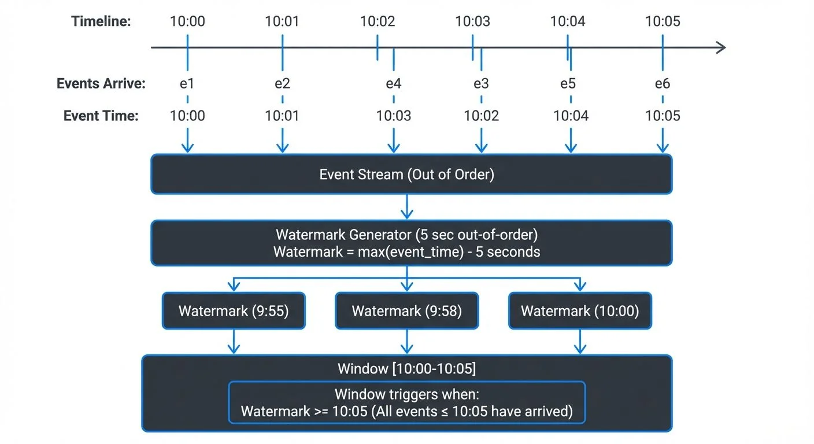

In stream processing, understanding when events occurred versus when they are processed is fundamental to building accurate real-time applications. Apache Flink provides sophisticated mechanisms for handling event time semantics through watermarks, enabling developers to build temporal processing pipelines that handle out-of-order data and late arrivals.

<!-- ORIGINAL_DIAGRAM
```
Event Time vs Processing Time with Watermarks

Timeline:  10:00    10:01    10:02    10:03    10:04    10:05
           ──┼────────┼────────┼────────┼────────┼────────┼──▶

Events     e1       e2    e4      e3       e5       e6
Arrive:    │        │     │       │        │        │
           │        │     │       │        │        │
Event      │        │     │       │        │        │
Time:    10:00   10:01  10:03  10:02   10:04    10:05
           │        │     │       │        │        │
           ▼        ▼     ▼       ▼        ▼        ▼
        ┌──────────────────────────────────────────────┐
        │         Event Stream (Out of Order)          │
        └──────────────────────────────────────────────┘
                              │
                              ▼
        ┌──────────────────────────────────────────────┐
        │  Watermark Generator (5 sec out-of-order)    │
        │  Watermark = max(event_time) - 5 seconds     │
        └──────────────────────────────────────────────┘
                              │
           ┌──────────────────┼──────────────────┐
           ▼                  ▼                  ▼
      Watermark          Watermark          Watermark
      (9:55)             (9:58)             (10:00)
           │                  │                  │
           ▼                  ▼                  ▼
    ┌─────────────────────────────────────────────────┐
    │  Window [10:00-10:05]                           │
    │  ┌────────────────────────────────────┐         │
    │  │ Window triggers when:              │         │
    │  │ Watermark >= 10:05                 │         │
    │  │ (All events ≤ 10:05 have arrived)  │         │
    │  └────────────────────────────────────┘         │
    └─────────────────────────────────────────────────┘
```
-->

## Understanding Time Semantics in Stream Processing

Flink supports three distinct notions of time:

**Processing Time** refers to the wall-clock time of the machine executing the streaming operation. While simple to implement, processing time offers no guarantees about determinism or correctness when events arrive out of order.

**Event Time** represents the timestamp embedded in the event itself, indicating when the event actually occurred at the source. This semantic provides deterministic results regardless of when events arrive at the processing system.

**Ingestion Time** captures the timestamp when an event enters the Flink system. It sits between processing time and event time in terms of determinism and complexity.

For applications requiring accurate temporal reasoning—such as sessionization (see [Session Windows in Stream Processing](https://conduktor.io/glossary/session-windows-in-stream-processing)), fraud detection, or time-based aggregations—event time is essential. However, event time processing introduces complexity: how does the system know when all events for a given time window have arrived?

## Watermarks: The Event Time Progress Indicator

Watermarks are Flink's mechanism for measuring progress in event time. A watermark with timestamp `t` asserts that all events with timestamps less than or equal to `t` have arrived. This allows Flink to trigger time-based operations like window computations.

Watermarks flow through the streaming topology as special records. When an operator receives a watermark, it can:

1. Trigger computations for windows whose end time is before the watermark
2. Emit results for completed windows
3. Forward the watermark downstream

The key challenge is balancing two competing concerns:

- **Too aggressive watermarks** (advancing time too quickly) may cause late data to be dropped or misclassified
- **Too conservative watermarks** (advancing time too slowly) increase latency as the system waits longer before triggering computations

## Watermark Strategies and Generators

Flink provides several built-in watermark strategies and allows custom implementations.

### Bounded Out-of-Orderness

The most common strategy assumes events arrive within a maximum delay:

```java
DataStream<Event> stream = env
    .fromSource(kafkaSource, WatermarkStrategy
        .<Event>forBoundedOutOfOrderness(Duration.ofSeconds(5))
        .withTimestampAssigner((event, timestamp) -> event.getTimestamp()),
        "Kafka Source");
```

This strategy generates watermarks that lag behind the maximum observed timestamp by the specified duration (5 seconds here). Events arriving more than 5 seconds late will be considered late data.

### Monotonous Timestamps

For sources that emit events in strictly increasing timestamp order:

```java
WatermarkStrategy<Event> strategy = WatermarkStrategy
    .<Event>forMonotonousTimestamps()
    .withTimestampAssigner((event, timestamp) -> event.getTimestamp());
```

This strategy generates watermarks equal to the latest observed timestamp, suitable for sources like database change streams or ordered log files.

### Custom Watermark Generators

For complex scenarios, implement custom watermark logic:

```java
public class CustomWatermarkGenerator implements WatermarkGenerator<Event> {
    private long maxTimestamp;
    private long outOfOrdernessMillis = 5000;

    @Override
    public void onEvent(Event event, long eventTimestamp, WatermarkOutput output) {
        maxTimestamp = Math.max(maxTimestamp, eventTimestamp);
    }

    @Override
    public void onPeriodicEmit(WatermarkOutput output) {
        output.emitWatermark(new Watermark(maxTimestamp - outOfOrdernessMillis));
    }
}
```

Flink calls `onPeriodicEmit()` at regular intervals (configured via `pipeline.auto-watermark-interval`, default 200ms), allowing the generator to emit watermarks based on accumulated state. In production, tune this interval based on your latency requirements: lower values (50-100ms) for low-latency applications, higher values (500ms-1s) for high-throughput batch-oriented workloads.

## Handling Late Data

Despite watermark strategies, some events will inevitably arrive after their corresponding windows have been triggered. Flink provides several mechanisms for late data handling:

### Allowed Lateness

Windows can be configured to accept late data for a specified duration after the watermark passes:

```java
stream
    .keyBy(Event::getUserId)
    .window(TumblingEventTimeWindows.of(Time.minutes(5)))
    .allowedLateness(Time.minutes(1))
    .aggregate(new AggregateFunction());
```

When late data arrives within the allowed lateness period, Flink re-triggers the window computation and emits updated results. This enables correction of previously emitted results at the cost of downstream complexity.

### Side Outputs

For auditing or alternative processing, late data can be redirected to a side output:

```java
OutputTag<Event> lateDataTag = new OutputTag<Event>("late-data"){};

SingleOutputStreamOperator<Result> result = stream
    .keyBy(Event::getUserId)
    .window(TumblingEventTimeWindows.of(Time.minutes(5)))
    .sideOutputLateData(lateDataTag)
    .aggregate(new AggregateFunction());

DataStream<Event> lateData = result.getSideOutput(lateDataTag);
```

This approach allows separate handling of late events—perhaps logging them for analysis or applying compensating logic. For comprehensive coverage of late data strategies beyond watermarks, see [Handling Late Arriving Data in Streaming](https://conduktor.io/glossary/handling-late-arriving-data-in-streaming).

## Integration with Kafka and the Streaming Ecosystem

When consuming from Apache Kafka, watermark configuration becomes critical for end-to-end correctness. For foundational understanding of Kafka's architecture and how it relates to stream processing, see [Kafka Topics, Partitions, and Brokers: Core Architecture](https://conduktor.io/glossary/kafka-topics-partitions-brokers-core-architecture). Kafka topics often contain out-of-order events due to:

- Multiple producers writing concurrently
- Network delays between producers and brokers
- Partition-level ordering but not global ordering

Flink's Kafka connector supports per-partition watermark generation. Each partition maintains its own watermark, and Flink merges them by taking the minimum across all partitions. For example, if partition 0 has watermark 12:00:00, partition 1 has 12:00:05, and partition 2 has 11:59:50, Flink uses 11:59:50 as the overall watermark—ensuring no events from any partition are incorrectly processed as late:

```java
KafkaSource<Event> source = KafkaSource.<Event>builder()
    .setBootstrapServers("localhost:9092")
    .setTopics("events")
    .setValueOnlyDeserializer(new EventDeserializationSchema())
    .build();

DataStream<Event> stream = env.fromSource(
    source,
    WatermarkStrategy
        .<Event>forBoundedOutOfOrderness(Duration.ofSeconds(10))
        .withTimestampAssigner((event, ts) -> event.getTimestamp()),
    "Kafka Source"
);
```

For visibility into watermark propagation and late data patterns, platforms like Conduktor provide comprehensive [monitoring capabilities](https://docs.conduktor.io/guide/monitor-brokers-apps/index) that surface metrics about event time lag, watermark advancement, and late event rates across your streaming topology. These tools offer real-time dashboards for tracking watermark progression, identifying lagging partitions, and alerting on excessive late data—essential capabilities for tuning watermark strategies in production environments.

## Watermark Alignment and Parallel Streams

In complex topologies with multiple input streams, watermark alignment becomes important. Flink takes the minimum watermark across all inputs to an operator, ensuring no operator processes data beyond any input's event time progress. For instance, when joining two streams (see [Stream Joins and Enrichment Patterns](https://conduktor.io/glossary/stream-joins-and-enrichment-patterns)), if stream A has watermark 12:05:00 and stream B has watermark 12:03:00, Flink uses 12:03:00—preventing the join from advancing past timestamps that stream B hasn't yet reached.

This conservative approach prevents incorrect results but can cause pipeline stalls if one partition or source falls behind. Flink 1.15 introduced watermark alignment features (enhanced in 1.18+) that can pause faster sources to prevent excessive skew:

```java
KafkaSource<Event> source = KafkaSource.<Event>builder()
    .setBootstrapServers("localhost:9092")
    .setTopics("events")
    .setValueOnlyDeserializer(new EventDeserializationSchema())
    .build();

env.fromSource(
    source,
    WatermarkStrategy
        .<Event>forBoundedOutOfOrderness(Duration.ofSeconds(5))
        .withWatermarkAlignment("alignment-group", Duration.ofSeconds(20)),
    "Kafka Source"
);
```

This configuration groups sources into alignment groups and limits the maximum drift between aligned sources, improving throughput while maintaining correctness.

## Modern Watermark Features (Flink 1.18+)

Recent Flink versions have introduced significant improvements to watermark handling:

### Enhanced Watermark Metrics (Flink 1.18+)

Flink 1.18 introduced more granular watermark metrics, exposing per-source and per-operator watermark values through the metrics system. This enables better observability:

```java
// Watermark metrics are now automatically exposed:
// - watermarkAlignment.drift: Maximum drift in alignment group
// - currentInputWatermark: Watermark for each input
// - currentOutputWatermark: Operator's emitted watermark
```

These metrics integrate with monitoring systems like Prometheus, allowing teams to track watermark progression and identify bottlenecks in real-time.

### Improved Watermark Propagation (Flink 1.19+)

Flink 1.19 optimized watermark propagation in complex topologies, reducing overhead in pipelines with many operators. The runtime now batches watermark updates more efficiently, improving throughput in watermark-heavy applications by 10-15%.

### Watermark Strategies for Unified Source API

Modern connectors built on the unified Source API (including the Kafka connector used throughout this article) provide better integration with watermark strategies:

```java
// Flink 1.18+ provides better control over per-partition watermark generation
WatermarkStrategy<Event> strategy = WatermarkStrategy
    .<Event>forBoundedOutOfOrderness(Duration.ofSeconds(5))
    .withTimestampAssigner((event, ts) -> event.getTimestamp())
    .withIdleness(Duration.ofMinutes(1))
    .withWatermarkAlignment("alignment-group", Duration.ofSeconds(20));
```

The unified approach ensures consistent watermark behavior across all source connectors, simplifying configuration and debugging. For deeper exploration of building streaming applications with these APIs, see [Flink DataStream API: Building Streaming Applications](https://conduktor.io/glossary/flink-datastream-api-building-streaming-applications).

## Best Practices and Edge Cases

### Idle Sources

When a partition or source stops emitting events, its watermark stops advancing, potentially stalling downstream operators. Flink's `withIdleness()` configuration allows sources to be marked idle:

```java
WatermarkStrategy
    .<Event>forBoundedOutOfOrderness(Duration.ofSeconds(5))
    .withIdleness(Duration.ofMinutes(1))
    .withTimestampAssigner((event, ts) -> event.getTimestamp())
```

After one minute without events, the source is considered idle and its watermark is ignored when computing the minimum across inputs.

### Debugging Watermark Issues

Common symptoms of watermark problems include:

- **Windows never triggering**: Watermarks not advancing (check timestamp extraction and source idleness)
- **Excessive late data**: Watermark advancing too aggressively (increase out-of-orderness bound)
- **High latency**: Watermark advancing too conservatively (reduce out-of-orderness bound or check for straggling partitions)

Enable watermark logging and metrics to diagnose these issues in production.

## Watermark Strategies in Flink SQL

For teams using Flink SQL (increasingly common in 2025), watermark strategies are declared directly in table DDL:

```sql
CREATE TABLE events (
    user_id STRING,
    event_type STRING,
    event_timestamp BIGINT,
    event_time AS TO_TIMESTAMP_LTZ(event_timestamp, 3),
    WATERMARK FOR event_time AS event_time - INTERVAL '5' SECOND
) WITH (
    'connector' = 'kafka',
    'topic' = 'events',
    'properties.bootstrap.servers' = 'localhost:9092',
    'format' = 'json'
);
```

The `WATERMARK FOR` clause defines the watermark strategy declaratively. The expression `event_time - INTERVAL '5' SECOND` creates a bounded out-of-orderness strategy with a 5-second delay, equivalent to the DataStream API's `forBoundedOutOfOrderness(Duration.ofSeconds(5))`.

For strictly ordered data, use the current timestamp:

```sql
WATERMARK FOR event_time AS event_time
```

Flink SQL automatically propagates watermarks through queries, making event time processing accessible to SQL users without requiring Java/Scala knowledge. This has made Flink SQL a popular choice for stream processing in 2025, particularly in data teams with strong SQL expertise. For more advanced stream processing patterns in SQL, see [Flink SQL and Table API for Stream Processing](https://conduktor.io/glossary/flink-sql-and-table-api-for-stream-processing).

## Summary

Event time processing with watermarks enables Flink applications to handle out-of-order data and produce accurate temporal results. Key takeaways:

- **Event time semantics** provide deterministic results based on when events actually occurred, essential for temporal reasoning
- **Watermarks** signal progress in event time, allowing time-based operations to trigger while balancing latency and completeness
- **Watermark strategies** must be tuned based on source characteristics: use bounded out-of-orderness for typical Kafka scenarios, monotonous timestamps for ordered sources, and custom generators for complex patterns
- **Late data handling** through allowed lateness and side outputs provides flexibility for correcting results or auditing late arrivals
- **Kafka integration** requires careful consideration of per-partition watermarks and alignment strategies
- **Observability** through monitoring tools helps track watermark propagation and tune strategies in production

Mastering event time and watermarks is essential for building production-grade streaming applications that handle real-world data characteristics while maintaining correctness and performance.

## Related Concepts

- [Watermarks and Triggers in Stream Processing](https://conduktor.io/glossary/watermarks-and-triggers-in-stream-processing) - Comprehensive guide to watermark strategies and trigger mechanisms across stream processing frameworks
- [Handling Late-Arriving Data in Streaming](https://conduktor.io/glossary/handling-late-arriving-data-in-streaming) - Advanced techniques for managing late events beyond basic watermark configuration
- [Windowing in Apache Flink](https://conduktor.io/glossary/windowing-in-apache-flink-tumbling-sliding-and-session-windows) - How watermarks interact with different window types in Flink

## Sources and References

- [Apache Flink Documentation: Event Time and Watermarks](https://nightlies.apache.org/flink/flink-docs-stable/docs/concepts/time/)
- [Apache Flink Documentation: Generating Watermarks](https://nightlies.apache.org/flink/flink-docs-stable/docs/dev/datastream/event-time/generating_watermarks/)
- [Flink Kafka Connector Documentation](https://nightlies.apache.org/flink/flink-docs-stable/docs/connectors/datastream/kafka/)
- [Watermark Alignment in Flink 1.15](https://flink.apache.org/2022/06/09/watermark-alignment.html)
