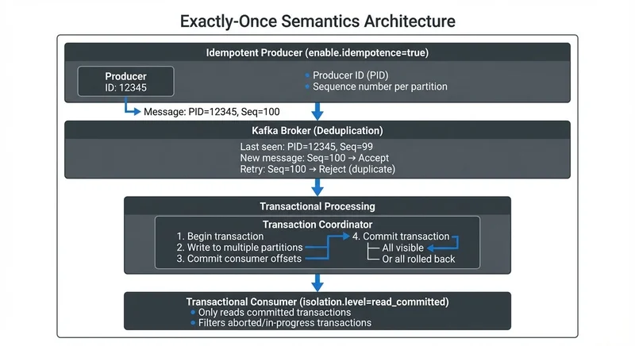

# Exactly-Once Semantics in Kafka

In distributed systems, ensuring reliable message delivery is one of the most challenging problems to solve. Data streaming platforms like Apache Kafka must handle network failures, broker crashes, and application restarts while maintaining data consistency. This is where message delivery guarantees become critical.

Traditionally, distributed systems offer two delivery semantics: at-most-once (messages may be lost but never duplicated) and at-least-once (messages are never lost but may be duplicated). Exactly-once semantics (EOS) provides a stronger guarantee: each message is delivered and processed exactly once, even when failures occur. This article explores how Kafka achieves exactly-once semantics and when to use it.

## Understanding Message Delivery Guarantees

Before diving into exactly-once semantics, it's important to understand the spectrum of delivery guarantees:

**At-most-once delivery** means messages may be lost but will never be delivered more than once. This occurs when a producer doesn't retry failed sends or when a consumer commits offsets before processing messages. While this offers the best performance, data loss is possible.

**At-least-once delivery** ensures no messages are lost, but duplicates can occur. If a producer sends a message and doesn't receive an acknowledgment due to a network issue, it will retry. The message may have been successfully written to Kafka, resulting in a duplicate. Similarly, if a consumer processes a message but crashes before committing its offset, it will reprocess that message after recovery.

**Exactly-once delivery** guarantees that each message is delivered and processed exactly once, eliminating both data loss and duplication. This is the strongest guarantee and the most complex to implement correctly in a distributed system.

## What is Exactly-Once Semantics?

Exactly-once semantics means that the effect of processing a message happens exactly once, even if the system encounters failures, retries, or network issues. In the context of Kafka, this involves two key guarantees:

1. **Idempotent production**: A producer can safely retry sending messages without creating duplicates
2. **Transactional processing**: Messages are produced, consumed, and processed as atomic operations

Achieving true exactly-once semantics in a distributed system requires coordination between producers, brokers, and consumers. Kafka introduced exactly-once semantics in version 0.11.0 and has continued to refine the implementation in subsequent releases. Kafka 2.5 introduced the improved `exactly_once_v2` protocol for Kafka Streams, and Kafka 4.0+ brings significant performance improvements to transactional processing in KRaft mode (Kafka's ZooKeeper-free architecture), with faster transaction commits and reduced coordinator overhead.

The challenge lies in the distributed nature of the system. When a producer sends a message to Kafka, multiple things can go wrong: the network request might fail, the broker might crash after writing to disk but before responding, or the producer might crash after sending but before receiving confirmation. Each of these scenarios must be handled correctly to prevent duplicates or data loss.

## How Kafka Achieves Exactly-Once Semantics

Kafka's exactly-once implementation relies on three core mechanisms: idempotent producers, transactions, and transactional consumers.



<!-- ORIGINAL_DIAGRAM
```
┌─────────────────────────────────────────────────────────────────┐
│         Exactly-Once Semantics Architecture                     │
├─────────────────────────────────────────────────────────────────┤
│                                                                 │
│  ┌─────────────────────────────────────────────────────────┐   │
│  │  Idempotent Producer (enable.idempotence=true)          │   │
│  │  ┌────────────┐                                         │   │
│  │  │ Producer   │  Each message has:                      │   │
│  │  │ ID: 12345  │  • Producer ID (PID)                    │   │
│  │  │            │  • Sequence number per partition        │   │
│  │  └─────┬──────┘                                         │   │
│  └────────┼────────────────────────────────────────────────┘   │
│           │                                                     │
│           │ Message: PID=12345, Seq=100                         │
│           ▼                                                     │
│  ┌─────────────────────────────────────────────────────────┐   │
│  │  Kafka Broker (Deduplication)                           │   │
│  │  ┌──────────────────────────────────────────┐           │   │
│  │  │ Last seen: PID=12345, Seq=99             │           │   │
│  │  │ New message: Seq=100 → Accept            │           │   │
│  │  │ Retry: Seq=100 → Reject (duplicate)      │           │   │
│  │  └──────────────────────────────────────────┘           │   │
│  └─────────────────────────────────────────────────────────┘   │
│           │                                                     │
│           ▼                                                     │
│  ┌─────────────────────────────────────────────────────────┐   │
│  │  Transactional Processing                               │   │
│  │  ┌──────────────────────────────────────────────────┐   │   │
│  │  │ Transaction Coordinator                          │   │   │
│  │  │  1. Begin transaction                            │   │   │
│  │  │  2. Write to multiple partitions ────┐           │   │   │
│  │  │  3. Commit consumer offsets          │           │   │   │
│  │  │  4. Commit transaction                │           │   │   │
│  │  │     ├─ All visible ◀──────────────────┘           │   │   │
│  │  │     └─ Or all rolled back                        │   │   │
│  │  └──────────────────────────────────────────────────┘   │   │
│  └─────────────────────────────────────────────────────────┘   │
│           │                                                     │
│           ▼                                                     │
│  ┌─────────────────────────────────────────────────────────┐   │
│  │  Transactional Consumer (isolation.level=read_committed)│   │
│  │  • Only reads committed transactions                    │   │
│  │  • Filters aborted/in-progress transactions             │   │
│  └─────────────────────────────────────────────────────────┘   │
│                                                                 │
└─────────────────────────────────────────────────────────────────┘
```
-->

### Idempotent Producers

An idempotent producer ensures that retrying a send operation won't create duplicate messages. Kafka achieves this by assigning each producer a unique Producer ID (PID) and maintaining sequence numbers for messages sent to each partition.

When a producer sends a message, it includes its PID and a sequence number. The broker tracks the last sequence number it received from each producer for each partition. If the broker receives a message with a sequence number it has already seen, it acknowledges the write without actually writing a duplicate. This makes retries safe and automatic.

To enable idempotent producers, set `enable.idempotence=true` in your producer configuration. Kafka 3.0+ enables this by default for all producers, making idempotent production the standard behavior. For more details on producer configuration and patterns, see [Kafka Producers](https://conduktor.io/glossary/kafka-producers).

### Transactions

For end-to-end exactly-once semantics, Kafka provides transactions. A transactional producer can send messages to multiple partitions and commit consumer offsets atomically. If any part of the transaction fails, the entire operation is rolled back.

Transactions work through a transaction coordinator, a broker component that manages the two-phase commit protocol (a distributed algorithm that ensures all participants agree to commit or abort). The producer begins a transaction, writes messages to various partitions, and then commits. The coordinator ensures that either all messages are visible to consumers or none are.

To use transactions, assign a `transactional.id` to your producer. This ID is persistent across producer restarts, allowing Kafka to fence out zombie producers (old instances that haven't fully shut down due to network partitions or slow shutdowns) and prevent split-brain scenarios (where two instances of the same producer could write simultaneously). For a comprehensive technical deep dive into Kafka's transactional mechanisms, see [Kafka Transactions Deep Dive](https://conduktor.io/glossary/kafka-transactions-deep-dive).

### Transactional Consumers

Consumers can participate in exactly-once processing by setting `isolation.level=read_committed`. This ensures they only read messages that are part of committed transactions, filtering out messages from aborted or in-progress transactions.

When processing messages transactionally, the consumer reads messages, processes them, produces results to output topics, and commits its offsets—all within a single transaction. This atomic operation ensures exactly-once processing: if the transaction fails, none of the effects are visible. For more information on consumer offset management and group coordination, see [Kafka Consumer Groups Explained](https://conduktor.io/glossary/kafka-consumer-groups-explained).

Tools like Conduktor provide visual monitoring of transaction markers in Kafka topics through [topic management](https://docs.conduktor.io/guide/manage-kafka/kafka-resources/topics) and real-time tracking of transactional producer states, making it easier to debug exactly-once configurations, verify transaction completion, and troubleshoot issues like stalled transactions or coordinator problems.

## Exactly-Once in Stream Processing

Stream processing frameworks like Kafka Streams and Apache Flink leverage Kafka's exactly-once semantics to provide end-to-end processing guarantees.

**Kafka Streams** provides exactly-once semantics out of the box when you set `processing.guarantee=exactly_once_v2` (introduced in Kafka 2.5 and the recommended setting for Kafka 2.5+). Internally, it uses Kafka transactions to ensure that reading from input topics, updating state stores, and writing to output topics happen atomically. If a stream processing task fails and is restarted, no duplicates are created and no messages are lost. Kafka 4.0+ further improves Kafka Streams EOS performance with optimized transaction handling in KRaft mode.

**Apache Flink** integrates with Kafka's transactional producers to achieve exactly-once semantics from Flink to Kafka. Flink uses its checkpointing mechanism to align with Kafka transactions. When a checkpoint completes, Flink commits the Kafka transaction, making all output visible. If a failure occurs before a checkpoint, Flink rolls back to the last successful checkpoint and Kafka aborts the incomplete transaction.

This integration between stream processors and Kafka enables complex, stateful stream processing applications that maintain data consistency even in the face of failures—a critical requirement for use cases like real-time analytics, fraud detection, and financial processing. For a detailed comparison of these stream processing frameworks, see [Kafka Streams vs Apache Flink](https://conduktor.io/glossary/kafka-streams-vs-apache-flink).

## Trade-offs and Performance Considerations

Exactly-once semantics comes with trade-offs. The additional coordination and bookkeeping required to guarantee exactly-once delivery impacts throughput and latency.

**Latency**: Transactional producers add latency because they must wait for the transaction coordinator to acknowledge commits. Typical overhead ranges from a few milliseconds to tens of milliseconds, depending on broker and network configuration.

**Throughput**: The two-phase commit protocol and additional metadata management reduce maximum throughput compared to at-least-once semantics. However, for many applications, this trade-off is acceptable given the correctness guarantees.

**Resource usage**: Transaction coordinators and the additional state tracking consume more broker resources. Each transactional producer maintains state, and transaction logs require disk space.

When deciding whether to use exactly-once semantics, consider your application's requirements. Financial transactions, order processing, and compliance-sensitive workloads often require exactly-once guarantees. For use cases like logging, metrics collection, or approximate analytics where occasional duplicates are tolerable, at-least-once semantics may be sufficient and more performant.

Platforms like Conduktor help you understand the performance impact of exactly-once semantics by providing comprehensive visibility into producer and consumer metrics through [topic monitoring](https://docs.conduktor.io/guide/manage-kafka/kafka-resources/topics), transaction success rates, coordinator performance, and end-to-end latency. This observability enables informed configuration decisions and helps identify bottlenecks in transactional workflows.

## Real-World Use Cases

**Financial Services**: A payments platform uses exactly-once semantics to ensure that each payment instruction is processed exactly once. When a customer initiates a wire transfer, the system publishes a transaction event to Kafka. Downstream services consume this event to debit the sender's account, credit the receiver's account, and record the transaction for compliance. Without exactly-once guarantees, a retry could cause a double charge or duplicate accounting entry.

**E-commerce Order Processing**: An online retailer processes orders through Kafka. When a customer places an order, an order service publishes the event transactionally along with inventory updates. The inventory service consumes these events with exactly-once semantics to ensure that each order decrements inventory counts exactly once. This prevents overselling products due to duplicate inventory decrements or underselling due to lost messages. For more e-commerce streaming patterns, see [E-commerce Streaming Architecture Patterns](https://conduktor.io/glossary/e-commerce-streaming-architecture-patterns).

## Summary

Exactly-once semantics in Kafka provides the strongest delivery guarantee for distributed streaming applications. Through idempotent producers, transactions, and transactional consumers, Kafka ensures that messages are processed exactly once, even in the presence of failures and retries.

While exactly-once semantics introduces some performance overhead, it is essential for applications where data consistency and correctness are paramount. Stream processing frameworks like Kafka Streams and Apache Flink build on these primitives to enable complex, stateful processing with end-to-end exactly-once guarantees.

Understanding when to use exactly-once semantics—and how to configure it properly—is crucial for building reliable data streaming systems. For handling distributed transactions across microservices using event-driven patterns, see [Saga Pattern for Distributed Transactions](https://conduktor.io/glossary/saga-pattern-for-distributed-transactions).

## Related Concepts

- [Kafka Transactions Deep Dive](https://conduktor.io/glossary/kafka-transactions-deep-dive) - Technical deep dive into Kafka's transactional mechanisms
- [Exactly-Once Semantics](https://conduktor.io/glossary/exactly-once-semantics) - General exactly-once concepts across streaming platforms
- [Saga Pattern for Distributed Transactions](https://conduktor.io/glossary/saga-pattern-for-distributed-transactions) - Managing distributed transactions with exactly-once guarantees

## Sources and References

1. Apache Kafka Documentation: [Exactly Once Semantics](https://kafka.apache.org/documentation/#semantics) - Official documentation on Kafka's delivery semantics and transactional API
2. Confluent Blog: [Exactly-Once Semantics Are Possible: Here's How Kafka Does It](https://www.confluent.io/blog/exactly-once-semantics-are-possible-heres-how-apache-kafka-does-it/) - In-depth technical explanation of Kafka's exactly-once implementation
3. KIP-98: [Exactly Once Delivery and Transactional Messaging](https://cwiki.apache.org/confluence/display/KAFKA/KIP-98+-+Exactly+Once+Delivery+and+Transactional+Messaging) - Original Kafka Improvement Proposal introducing exactly-once semantics
4. Apache Flink Documentation: [Fault Tolerance Guarantees of Data Sources and Sinks](https://nightlies.apache.org/flink/flink-docs-stable/docs/connectors/datastream/guarantees/) - How Flink integrates with Kafka for exactly-once processing
5. Jay Kreps: [Transactions in Apache Kafka](https://www.confluent.io/blog/transactions-apache-kafka/) - Technical deep dive into Kafka's transactional model
