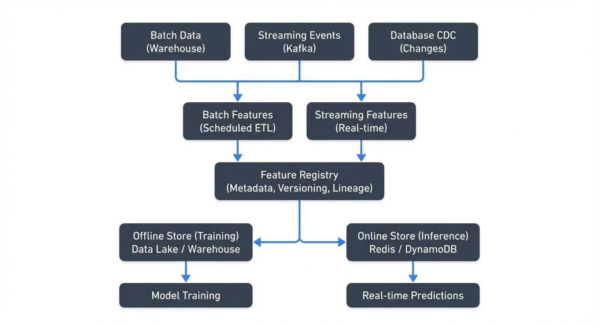

# Feature Stores for Machine Learning

Machine learning models depend on features—the measurable properties used to make predictions. As ML systems scale, managing these features becomes increasingly complex. Feature stores emerged to solve this challenge by providing a centralized platform for storing, serving, and managing features across the entire ML lifecycle.



<!-- ORIGINAL_DIAGRAM
```
┌─────────────────────────────────────────────────────────────────┐
│                   Feature Store Architecture                    │
└─────────────────────────────────────────────────────────────────┘

┌─────────────┐          ┌─────────────┐          ┌─────────────┐
│   Batch     │          │  Streaming  │          │   Database  │
│   Data      │          │   Events    │          │     CDC     │
│ (Warehouse) │          │   (Kafka)   │          │  (Changes)  │
└──────┬──────┘          └──────┬──────┘          └──────┬──────┘
       │                        │                        │
       └────────────┬───────────┴───────────┬────────────┘
                    │                       │
                    ▼                       ▼
         ┌──────────────────┐    ┌──────────────────┐
         │ Batch Features   │    │ Streaming        │
         │ (Scheduled ETL)  │    │ Features         │
         │                  │    │ (Real-time)      │
         └─────────┬────────┘    └────────┬─────────┘
                   │                      │
                   ▼                      ▼
         ┌─────────────────────────────────────────┐
         │       Feature Registry                  │
         │  (Metadata, Versioning, Lineage)        │
         └────────┬──────────────────────┬─────────┘
                  │                      │
      ┌───────────┴────────┐  ┌──────────┴──────────┐
      ▼                    │  │                     ▼
┌──────────────┐           │  │          ┌──────────────┐
│ Offline Store│◀──────────┘  └─────────▶│ Online Store │
│ (Training)   │                          │ (Inference)  │
│              │                          │              │
│ Data Lake /  │                          │ Redis /      │
│ Warehouse    │                          │ DynamoDB     │
└──────┬───────┘                          └──────┬───────┘
       │                                         │
       ▼                                         ▼
┌──────────────┐                          ┌──────────────┐
│ Model        │                          │ Real-time    │
│ Training     │                          │ Predictions  │
└──────────────┘                          └──────────────┘
```
-->

## What is a Feature Store?

A feature store is a data management system specifically designed for machine learning features. It acts as a central repository where features are defined once and reused consistently across training and inference workflows.

The core problem feature stores address is organizational and technical fragmentation. Without a feature store, data scientists often recreate the same features independently, leading to inconsistencies, duplicated effort, and subtle bugs. Different teams might compute "user_age" differently, or training pipelines might use different logic than production serving systems.

Feature stores standardize this process by treating features as reusable, versioned artifacts. They ensure that the features used to train a model are identical to those used when the model makes predictions in production.

## Key Capabilities of Feature Stores

Modern feature stores provide several essential capabilities:

**Feature Registry**: A catalog of all available features with metadata including definitions, owners, data types, and dependencies. This creates discoverability—teams can search for existing features before building new ones.

**Dual Storage Systems**: Feature stores typically maintain two storage backends. An offline store (often a data warehouse, [data lake](/data-lake-zones-bronze-silver-gold-architecture), or [lakehouse](/introduction-to-lakehouse-architecture)) serves batch workloads for model training. An online store (typically a low-latency key-value database—a specialized database optimized for fast lookups using unique keys—like Redis or DynamoDB) serves real-time predictions with millisecond latency requirements.

**Point-in-Time Correctness**: When creating training datasets, feature stores ensure historical features reflect what was known at that specific moment in time. This prevents data leakage—a critical ML error where future information accidentally influences training data, causing models to perform well in training but poorly in production. Point-in-time joins query historical feature values as they existed at the exact timestamp of each training example.

**Feature Versioning**: As feature definitions evolve, version control tracks changes and allows models to reference specific feature versions, ensuring reproducibility.

## Feature Store Architecture

The typical feature store architecture consists of three main components:

The **offline store** handles historical feature data for training. It stores large volumes of data efficiently and supports complex queries for creating training datasets. Common implementations use data warehouses like Snowflake, BigQuery, or [lakehouse tables](/streaming-to-lakehouse-tables) with formats like Apache Iceberg or Delta Lake. As of 2025, Apache Iceberg has become increasingly popular for offline feature storage due to its time-travel capabilities and efficient metadata management.

The **online store** prioritizes low-latency reads for real-time inference. It stores the most recent feature values indexed by entity keys (user ID, product ID, etc.). Redis, Cassandra, and DynamoDB are common choices. The online store typically contains a subset of features optimized for production serving. For ML applications involving embeddings and semantic search, vector databases like Pinecone, Qdrant, or Weaviate are increasingly integrated alongside traditional key-value stores.

The **feature registry** maintains metadata about all features: their definitions, schemas, [lineage](/data-lineage-tracking-data-from-source-to-consumption), and statistics. It serves as the control plane, while offline and online stores are the data planes.

Data flows from source systems into the feature store through transformation pipelines. For batch features, scheduled jobs compute features from data warehouses. For real-time features, [streaming pipelines](/streaming-data-pipeline) process events as they arrive.

## Solving Training-Serving Skew

Training-serving skew is one of the most insidious problems in production ML systems. It occurs when the features used during training differ from those used during inference, degrading model performance in unpredictable ways.

Consider a recommendation model trained with user click rates computed from the past 30 days. If the production system accidentally computes this metric over 7 days, the model receives different inputs than it was trained on, causing accuracy loss.

Feature stores eliminate this skew by enforcing consistency. The same feature computation logic serves both training and inference workloads. When you request "user_30day_click_rate" for training or prediction, the identical calculation runs in both contexts.

This consistency extends to timing. Point-in-time joins ensure training data uses features as they existed at the exact timestamp of each training example, matching the information available during real predictions.

## Feature Stores and Data Streaming

[Real-time machine learning](/real-time-ml-inference-with-streaming-data) increasingly relies on streaming data platforms like Apache Kafka and Apache Flink. Feature stores integrate deeply with streaming infrastructure to enable low-latency feature engineering.

Streaming features are computed from live event streams rather than batch data. For example, in [fraud detection](/real-time-fraud-detection-with-streaming), you might track "number of transactions in the past 5 minutes" as a feature. This requires processing a stream of transaction events in real-time, maintaining state, and updating feature values continuously.

**Stream Processing Integration**: Frameworks like [Flink](/what-is-apache-flink-stateful-stream-processing), Kafka Streams, or Spark Structured Streaming read from Kafka topics, apply transformations to compute features, and write results to the feature store's online storage. This creates a continuous [pipeline from raw events to production-ready features](/real-time-ml-pipelines).

**Feature Freshness**: Streaming enables fresh features with seconds or sub-second latency. A fraud detection model can use features reflecting activity from moments ago rather than yesterday's batch computation.

**Kafka as the Backbone**: Kafka topics often serve as both the source of raw events and the transport layer for computed features. [Change Data Capture](/what-is-change-data-capture-cdc-fundamentals) (CDC) from databases flows through Kafka into feature stores, keeping features synchronized with operational systems.

When implementing streaming feature pipelines, [data quality](/building-a-data-quality-framework) and [observability](/what-is-data-observability-the-five-pillars) become critical. Tools like Conduktor help teams monitor [Kafka topics](https://docs.conduktor.io/guide/manage-kafka/kafka-resources/topics) carrying feature data, validate [schemas](https://docs.conduktor.io/guide/manage-kafka/kafka-resources/schema-registry) to prevent feature corruption, and track [data quality metrics](https://docs.conduktor.io/guide/use-cases/observe-data-quality) across streaming pipelines. This governance layer ensures the features flowing into production models meet quality standards and alerts teams to anomalies that could degrade model performance.

## Common Use Cases and Examples

**Fraud Detection**: Financial institutions use feature stores to power real-time fraud models. Features might include:
- `transaction_count_5min`: Number of transactions in the past 5 minutes (streaming feature)
- `avg_transaction_amount_30d`: Historical average (batch feature)
- `merchant_risk_score`: Precomputed merchant attributes

These features combine real-time signals with historical patterns. The feature store ensures both are available with low latency when evaluating each transaction.

**Recommendation Systems**: [E-commerce platforms](/building-recommendation-systems-with-streaming-data) maintain features like:
- `user_category_affinity`: User's preference for product categories (batch)
- `recent_viewed_products`: Last 10 viewed items (streaming)
- `trending_score`: Real-time product popularity

**GenAI and RAG Applications** (2025): Modern feature stores increasingly support LLM-powered applications by managing:
- Vector embeddings for semantic search and retrieval
- Context features for prompt enrichment
- User interaction history for personalized AI responses
- Real-time signals for [RAG pipelines](/rag-pipelines-with-real-time-data)

A feature definition using modern feature store APIs (Feast 0.38+) might look like:

```python
from feast import Entity, FeatureView, Field
from feast.types import Int64
from datetime import timedelta

user = Entity(name="user_id", join_keys=["user_id"])

user_features = FeatureView(
    name="user_transaction_features",
    entities=[user],
    ttl=timedelta(days=30),
    schema=[
        Field(name="purchase_count_7d", dtype=Int64),
        Field(name="avg_transaction_amount_30d", dtype=Float64),
    ],
    source=transaction_source,
)
```

The feature store handles computing these features for training datasets and serving them in production with the appropriate storage backend, ensuring consistency across the ML lifecycle.

## Feature Store Ecosystem and Modern Tools (2025)

The feature store landscape has matured significantly, with several production-grade options available:

**Open-Source Solutions**: Feast remains the most popular open-source feature store, with version 0.38+ offering improved performance, better streaming support, and simplified deployment. It integrates seamlessly with modern data stacks including Snowflake, BigQuery, Redis, and DynamoDB.

**Cloud-Native Platforms**: AWS SageMaker Feature Store, Azure Machine Learning Feature Store, and Google Cloud Vertex AI Feature Store provide fully managed services integrated with their respective ML platforms. Databricks Feature Store offers tight integration with Delta Lake and Unity Catalog.

**Specialized Platforms**: Tecton provides enterprise-grade feature serving with advanced real-time capabilities. Featureform focuses on declarative feature definitions and automatic orchestration.

**Observability and Monitoring**: Modern feature stores require robust monitoring to detect [feature drift](/model-drift-in-streaming) and [data quality](/building-a-data-quality-framework) issues. Integration with tools like Great Expectations, Monte Carlo, or custom observability frameworks helps teams:
- Monitor feature distributions over time
- Detect anomalies in feature values
- Track feature serving latency
- Alert on schema changes or data quality degradation
- Measure training-serving skew in production

These monitoring capabilities are critical for maintaining reliable ML systems, as silent feature degradation can cause gradual model performance loss without obvious errors.

## Summary

Feature stores are essential infrastructure for mature ML operations. They centralize feature management, eliminate training-serving skew, and enable feature reuse across teams. By maintaining both offline storage for training and online storage for low-latency serving, feature stores bridge the gap between data engineering and ML deployment.

The integration with streaming platforms like Kafka and Flink extends feature stores into the real-time domain, enabling fresh features for time-sensitive applications. Modern feature stores (2025) now support emerging use cases including GenAI applications, vector embeddings, and RAG pipelines, while leveraging advanced storage formats like Apache Iceberg for improved performance and governance.

As organizations scale their ML efforts, feature stores become increasingly valuable—reducing duplication, improving consistency, accelerating the path from feature development to production models, and providing the observability needed to maintain reliable ML systems in production.

## Related Concepts

- [Real-Time Analytics with Streaming Data](/real-time-analytics-with-streaming-data) - Analytics patterns using features from feature stores
- [Kafka Connect: Building Data Integration Pipelines](/kafka-connect-building-data-integration-pipelines) - Integrate feature stores with data sources
- [Data Governance Framework: Roles and Responsibilities](/data-governance-framework-roles-and-responsibilities) - Govern feature definitions and access

## Sources and References

1. **Feast Documentation** - Open-source feature store project with 2025 updates: https://docs.feast.dev/
2. **Tecton Blog** - "What is a Feature Store?" - Comprehensive overview from a leading feature store platform: https://www.tecton.ai/blog/what-is-a-feature-store/
3. **Uber Engineering** - "Michelangelo: Uber's Machine Learning Platform" - Industry case study on feature management: https://www.uber.com/blog/michelangelo-machine-learning-platform/
4. **AWS SageMaker Feature Store** - Enterprise feature store with real-time and batch serving: https://aws.amazon.com/sagemaker/feature-store/
5. **Databricks Feature Store** - Integration with Delta Lake and Unity Catalog: https://docs.databricks.com/machine-learning/feature-store/
6. **Eugene Yan** - "Feature Stores: A Hierarchy of Needs" - Practical perspective on feature store adoption: https://eugeneyan.com/writing/feature-stores/
7. **Apache Iceberg** - Modern table format increasingly used for feature store offline storage: https://iceberg.apache.org/
