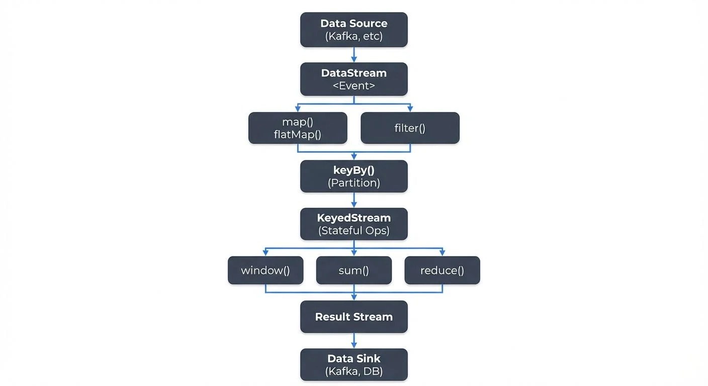

<!-- ORIGINAL_DIAGRAM
```
┌─────────────────────────────────────────────────────────────────┐
│             Flink DataStream API Transformation Flow            │
└─────────────────────────────────────────────────────────────────┘

    ┌───────────────┐
    │  Data Source  │
    │  (Kafka, etc) │
    └───────┬───────┘
            │
            ▼
    ┌──────────────────┐
    │   DataStream     │
    │   <Event>        │
    └───────┬──────────┘
            │
            ├──────────────┐
            ▼              ▼
    ┌──────────┐    ┌──────────────┐
    │  map()   │    │  filter()    │
    │flatMap() │    │              │
    └────┬─────┘    └──────┬───────┘
         │                 │
         └────────┬────────┘
                  ▼
          ┌───────────────┐
          │   keyBy()     │
          │  (Partition)  │
          └───────┬───────┘
                  │
                  ▼
         ┌────────────────┐
         │ KeyedStream    │
         │ (Stateful Ops) │
         └────────┬───────┘
                  │
         ┌────────┼────────┐
         ▼        ▼        ▼
    ┌────────┐ ┌────┐ ┌────────┐
    │window()│ │sum()│ │reduce()│
    │        │ │    │ │        │
    └────┬───┘ └─┬──┘ └───┬────┘
         │       │        │
         └───────┼────────┘
                 ▼
        ┌────────────────┐
        │  Result Stream │
        └────────┬───────┘
                 │
                 ▼
        ┌────────────────┐
        │   Data Sink    │
        │ (Kafka, DB)    │
        └────────────────┘
```
-->

## Introduction to Flink DataStream API

The DataStream API is Apache Flink's foundational interface for building streaming applications. It provides a declarative programming model that abstracts the complexities of distributed stream processing while offering precise control over state management, time semantics, and fault tolerance.

Unlike batch processing frameworks that operate on bounded datasets, the DataStream API is designed for continuous, unbounded streams of data. This makes it suitable for use cases such as real-time analytics, fraud detection, event-driven applications, and IoT data processing. The API supports Java, Scala, and Python (PyFlink), allowing developers to write type-safe transformations that Flink optimizes and executes across distributed clusters.

As of Flink 2.0+ (released in 2025), the DataStream API has matured with significant improvements to state backends, async state operations, and unified source/sink APIs that simplify integration with systems like Apache Kafka. For a broader introduction to Flink's capabilities, see [What is Apache Flink? Stateful Stream Processing](https://conduktor.io/glossary/what-is-apache-flink-stateful-stream-processing).

## Core Concepts and Architecture

### DataStream Abstraction

A `DataStream` represents an immutable, distributed collection of elements flowing through a Flink application. DataStreams are created from sources, transformed through various operations, and ultimately written to sinks. Each transformation produces a new DataStream, forming a directed acyclic graph (DAG) that Flink compiles into an optimized execution plan.

### Execution Environment

Every Flink application begins by obtaining an execution environment, which serves as the entry point for defining sources and configuring runtime parameters:

```java
StreamExecutionEnvironment env = StreamExecutionEnvironment.getExecutionEnvironment();
env.enableCheckpointing(60000); // Enable checkpointing every 60 seconds
env.getCheckpointConfig().setCheckpointingMode(CheckpointingMode.EXACTLY_ONCE);
```

Note: Since Flink 1.12+, event time is the default time characteristic, so `setStreamTimeCharacteristic()` is no longer needed and was removed in Flink 2.0. The execution environment determines whether the application runs locally for development or is submitted to a distributed cluster for production workloads.

### Sources and Sinks

Sources ingest data into the streaming pipeline from external systems such as Apache Kafka, file systems, or custom connectors. Sinks write processed data to downstream storage or messaging systems.

Since Flink 1.18+, the unified Source API (FLIP-27) has become the standard for implementing sources, replacing the older `SourceFunction` interface. The new API provides better support for bounded/unbounded sources, checkpointing, and event time. Similarly, the Sink API (FLIP-143) replaces `SinkFunction` with a more robust interface supporting exactly-once semantics and flexible writer implementations.

## Essential Transformations

The DataStream API offers a rich set of transformations for manipulating streaming data. Understanding these operations is fundamental to building effective stream processing applications.

### Basic Operations

- **map**: Applies a function to each element, producing one output per input
- **filter**: Selects elements matching a predicate
- **flatMap**: Produces zero or more outputs per input, useful for parsing and tokenization

```java
DataStream<String> events = env.fromElements("user:1,action:click", "user:2,action:view");

DataStream<UserAction> parsedEvents = events
    .flatMap((String value, Collector<UserAction> out) -> {
        String[] parts = value.split(",");
        if (parts.length == 2) {
            String userId = parts[0].split(":")[1];
            String action = parts[1].split(":")[1];
            out.collect(new UserAction(userId, action, System.currentTimeMillis()));
        }
    })
    .returns(UserAction.class);
```

### Keyed Streams and Stateful Operations

Partitioning data by key enables stateful processing, where Flink maintains state for each key independently. The `keyBy` operation creates a `KeyedStream`, which supports aggregations, reductions, and custom stateful functions:

```java
DataStream<UserAction> actions = ...;

DataStream<ActionCount> actionCounts = actions
    .keyBy(action -> action.getUserId())
    .window(TumblingEventTimeWindows.of(Time.minutes(5)))
    .aggregate(new CountAggregateFunction());
```

Keyed streams ensure that all events with the same key are processed by the same parallel instance, maintaining consistency for stateful operations.

### Rich Functions

Rich functions extend basic transformations with lifecycle methods and access to runtime context. The `RichMapFunction`, `RichFlatMapFunction`, and similar classes provide `open()` and `close()` methods for resource initialization and cleanup, as well as access to state and metrics:

```java
public class EnrichmentMapper extends RichMapFunction<Event, EnrichedEvent> {
    private transient ValueState<UserProfile> profileState;

    @Override
    public void open(Configuration parameters) {
        ValueStateDescriptor<UserProfile> descriptor =
            new ValueStateDescriptor<>("user-profile", UserProfile.class);
        profileState = getRuntimeContext().getState(descriptor);
    }

    @Override
    public EnrichedEvent map(Event event) throws Exception {
        UserProfile profile = profileState.value();
        return new EnrichedEvent(event, profile);
    }
}
```

For high-performance state access patterns, Flink 1.19+ introduces the Async State API, which allows non-blocking state operations that can significantly improve throughput in I/O-bound applications. This is particularly beneficial when using remote state backends. For comprehensive coverage of state management patterns, see [Flink State Management and Checkpointing](https://conduktor.io/glossary/flink-state-management-and-checkpointing).

## Windowing and Time Semantics

Time is a critical dimension in stream processing. Flink distinguishes between event time (when events actually occurred) and processing time (when events are processed by the system).

### Event Time Processing

Event time processing enables correct results even when events arrive out of order or delayed. Applications assign timestamps to events and define watermarks, which signal progress in event time:

```java
DataStream<Event> events = env
    .fromSource(kafkaSource,
        WatermarkStrategy.<Event>forBoundedOutOfOrderness(Duration.ofSeconds(10))
            .withTimestampAssigner((event, timestamp) -> event.getTimestamp()),
        "Kafka Source"
    );
```

Watermarks allow Flink to determine when all events up to a certain timestamp have arrived, triggering window computations and handling late data appropriately. For a deep dive into watermark mechanics, see [Watermarks and Triggers in Stream Processing](https://conduktor.io/glossary/watermarks-and-triggers-in-stream-processing). For strategies to handle events that arrive after watermarks have passed, see [Handling Late-Arriving Data in Streaming](https://conduktor.io/glossary/handling-late-arriving-data-in-streaming).

### Window Types

Windows group events into finite sets for aggregation. Flink supports several window types:

- **Tumbling Windows**: Fixed-size, non-overlapping intervals (e.g., every 5 minutes)
- **Sliding Windows**: Overlapping intervals that slide by a specified amount
- **Session Windows**: Dynamic windows based on inactivity gaps

```java
DataStream<SensorReading> readings = ...;

DataStream<AverageReading> averages = readings
    .keyBy(reading -> reading.getSensorId())
    .window(TumblingEventTimeWindows.of(Time.minutes(5)))
    .reduce((r1, r2) -> new SensorReading(
        r1.getSensorId(),
        Math.max(r1.getTimestamp(), r2.getTimestamp()),
        (r1.getValue() + r2.getValue()) / 2
    ));
```

## Kafka Integration and Ecosystem Connectivity

Apache Kafka is the most common data source and sink for Flink applications, enabling scalable, fault-tolerant streaming pipelines.

### Flink Kafka Connector

The Flink Kafka connector provides exactly-once semantics through Flink's checkpointing mechanism and Kafka's transactional producers:

```java
KafkaSource<Event> kafkaSource = KafkaSource.<Event>builder()
    .setBootstrapServers("localhost:9092")
    .setTopics("events")
    .setGroupId("flink-consumer-group")
    .setValueOnlyDeserializer(new EventDeserializationSchema())
    .setStartingOffsets(OffsetsInitializer.earliest())
    .build();

DataStream<Event> stream = env.fromSource(
    kafkaSource,
    WatermarkStrategy.noWatermarks(),
    "Kafka Source"
);
```

The connector handles offset management, consumer group coordination, and automatic failover, integrating seamlessly with Flink's state management.

### Monitoring and Governance with Conduktor

Production streaming applications require comprehensive monitoring and governance. Conduktor provides enterprise-grade visibility into Kafka topics, consumer lag, and data lineage, complementing Flink's built-in metrics. By [monitoring both Kafka and Flink metrics](https://docs.conduktor.io/guide/monitor-brokers-apps/index), teams can identify bottlenecks, track data quality, and ensure SLA compliance. Conduktor's capabilities include real-time monitoring of consumer group lag (critical for Flink applications consuming from Kafka), [schema registry integration](https://docs.conduktor.io/guide/manage-kafka/kafka-resources/schema-registry), and data quality validation—essential features for production Flink deployments.

## Practical Implementation Example

The following example demonstrates a complete streaming application that reads user events from Kafka, aggregates click counts per user over 10-minute windows, and writes results to another Kafka topic:

```java
public class ClickCountApplication {
    public static void main(String[] args) throws Exception {
        StreamExecutionEnvironment env = StreamExecutionEnvironment.getExecutionEnvironment();
        env.enableCheckpointing(30000);

        // Configure Kafka source
        KafkaSource<UserEvent> source = KafkaSource.<UserEvent>builder()
            .setBootstrapServers("localhost:9092")
            .setTopics("user-events")
            .setGroupId("click-count-app")
            .setValueOnlyDeserializer(new JsonDeserializationSchema<>(UserEvent.class))
            .build();

        // Define streaming pipeline
        DataStream<UserEvent> events = env.fromSource(
            source,
            WatermarkStrategy.<UserEvent>forBoundedOutOfOrderness(Duration.ofSeconds(5))
                .withTimestampAssigner((event, ts) -> event.getTimestamp()),
            "Kafka Source"
        );

        DataStream<ClickCount> clickCounts = events
            .filter(event -> "click".equals(event.getAction()))
            .keyBy(UserEvent::getUserId)
            .window(TumblingEventTimeWindows.of(Time.minutes(10)))
            .aggregate(new ClickAggregateFunction());

        // Write to Kafka sink
        KafkaSink<ClickCount> sink = KafkaSink.<ClickCount>builder()
            .setBootstrapServers("localhost:9092")
            .setRecordSerializer(new ClickCountSerializer("click-counts"))
            .setDeliveryGuarantee(DeliveryGuarantee.EXACTLY_ONCE)
            .build();

        clickCounts.sinkTo(sink);

        env.execute("Click Count Application");
    }
}
```

This pattern is common in production environments: reading from Kafka, applying stateful transformations with windowing, and writing results back to Kafka for downstream consumption.

## 2025 Features and Modern Patterns

Flink 1.18+ through 2.0+ has introduced several important enhancements to the DataStream API:

**Unified Source/Sink APIs**: The FLIP-27 Source API and FLIP-143 Sink API provide standardized interfaces with better support for exactly-once semantics, backpressure handling, and hybrid bounded/unbounded sources.

**Async State API (Flink 1.19+)**: Non-blocking state access improves throughput for stateful operations, particularly when using RocksDB or remote state backends.

**Changelog State Backend**: Materializes state changes immediately to distributed storage, reducing recovery time while maintaining performance for normal operations.

**Python DataStream API (PyFlink)**: Full-featured Python API enabling data engineers to build Flink applications in Python while leveraging the same runtime optimizations as Java/Scala applications.

**Improved Kafka Integration**: Enhanced partition discovery, better offset management, and optimized serialization for high-throughput scenarios.

These features make the DataStream API more performant, easier to use, and better suited for modern cloud-native deployments.

## Summary

The Flink DataStream API provides a powerful, expressive framework for building streaming applications. Key concepts include:

- **DataStream abstraction** for representing continuous data flows
- **Rich transformations** supporting both stateless and stateful processing
- **Event time processing** with watermarks for handling out-of-order data
- **Flexible windowing** for aggregating events over time intervals
- **Kafka integration** for scalable, fault-tolerant data pipelines
- **Modern APIs** with unified sources/sinks and async state (Flink 1.18+/2.0+)
- **Monitoring and governance** through platforms like Conduktor

By mastering these concepts, data engineers can build robust, production-grade streaming applications that process billions of events with low latency and strong consistency guarantees. The combination of Flink's processing capabilities and Kafka's messaging infrastructure forms the backbone of modern real-time data platforms.

For alternative declarative approaches to stream processing in Flink, explore [Flink SQL and Table API for Stream Processing](https://conduktor.io/glossary/flink-sql-and-table-api-for-stream-processing).

## Related Concepts

- [Event Time and Watermarks in Flink](https://conduktor.io/glossary/event-time-and-watermarks-in-flink) - Essential concepts for accurate time-based processing in the DataStream API
- [Stream Joins and Enrichment Patterns](https://conduktor.io/glossary/stream-joins-and-enrichment-patterns) - Advanced join strategies and data enrichment techniques
- [Backpressure Handling in Streaming Systems](https://conduktor.io/glossary/backpressure-handling-in-streaming-systems) - Managing throughput and flow control in DataStream applications

## References and Further Reading

- Apache Flink Documentation: DataStream API - https://nightlies.apache.org/flink/flink-docs-stable/docs/dev/datastream/overview/
- Flink Kafka Connector Documentation - https://nightlies.apache.org/flink/flink-docs-stable/docs/connectors/datastream/kafka/
- Stream Processing with Apache Flink (O'Reilly) by Fabian Hueske and Vasiliki Kalavri
- Event Time and Watermarks in Flink - https://nightlies.apache.org/flink/flink-docs-stable/docs/concepts/time/
