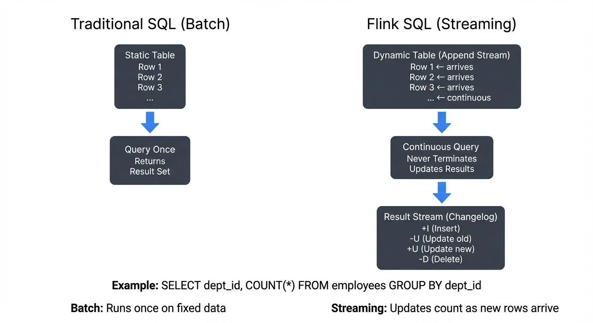

Apache Flink has revolutionized stream processing by bringing SQL to the world of real-time data pipelines. With Flink SQL and the Table API, data engineers and analysts can process unbounded streams using familiar SQL syntax or programmatic APIs in Java, Scala, and Python. This approach lowers the barrier to entry for stream processing while maintaining the power and performance needed for production workloads.

For a comprehensive introduction to Apache Flink's architecture and capabilities, see [What is Apache Flink: Stateful Stream Processing](https://conduktor.io/glossary/what-is-apache-flink-stateful-stream-processing).

## Understanding Dynamic Tables and Continuous Queries

Traditional SQL operates on static tables in batch mode—queries execute once and return a result set. Flink SQL introduces a fundamentally different concept: **dynamic tables** that continuously evolve as new data arrives.

A dynamic table represents a stream of data as a table abstraction. When you write a SQL query against a dynamic table, Flink creates a **continuous query** that never terminates. Instead, it continuously consumes new rows and updates its results in real time. This paradigm shift allows you to use standard SQL for stream processing without learning entirely new syntax.

For example, consider an append-only log of events flowing into a table. As new events arrive, they appear as new rows. A continuous query processes these rows incrementally, producing updates to an output dynamic table. This output can be materialized to external systems like Kafka topics, Elasticsearch indices, or key-value stores.

Flink supports two primary stream types:

- **Append streams**: New rows are only inserted (e.g., log events, sensor readings)
- **Changelog streams**: Rows can be inserted, updated, or deleted (e.g., database CDC streams). These streams emit change events with operation types: INSERT (+I), UPDATE_BEFORE (-U), UPDATE_AFTER (+U), and DELETE (-D).

Understanding these stream semantics is crucial because they determine what operations are valid and how state is managed.

## Flink SQL: Writing Streaming Queries

Flink SQL allows you to express stream processing logic using standard SQL syntax. The same query can run on both bounded (batch) and unbounded (streaming) datasets without modification.

### Basic Aggregation Query

Here's a simple continuous query that counts employees per department from an incoming stream:

```sql
SELECT dept_id, COUNT(*) as emp_count
FROM employee_information
GROUP BY dept_id;
```

This query maintains state for each department, updating the count as new employee records arrive. The output is a changelog stream that emits updates whenever counts change.

### Window Aggregations

Windowing allows you to bound computations over time intervals. Flink SQL supports tumbling, sliding, and session windows.

**Tumbling Window Example** (non-overlapping fixed intervals):

```sql
SELECT
  TUMBLE_START(event_time, INTERVAL '1' MINUTE) as window_start,
  product_id,
  SUM(quantity) as total_quantity
FROM orders
GROUP BY
  TUMBLE(event_time, INTERVAL '1' MINUTE),
  product_id;
```

This query aggregates orders into one-minute non-overlapping windows, computing total quantities per product.

**Sliding Window Example** (overlapping intervals):

```sql
SELECT
  HOP_END(event_time, INTERVAL '30' SECOND, INTERVAL '1' MINUTE) as window_end,
  sensor_id,
  AVG(temperature) as avg_temp
FROM sensor_readings
GROUP BY
  HOP(event_time, INTERVAL '30' SECOND, INTERVAL '1' MINUTE),
  sensor_id;
```

This creates one-minute windows that slide forward every 30 seconds, providing overlapping time-based aggregations useful for smoothing time-series data.

## Table API: Programmatic Stream Processing

While Flink SQL provides declarative query capabilities, the Table API offers a programmatic alternative for Java, Scala, and Python developers. The Table API sits at the same abstraction level as SQL but allows you to compose queries using code rather than SQL strings.

**Java Table API Example**:

```java
import org.apache.flink.table.api.*;

TableEnvironment tableEnv = TableEnvironment.create(EnvironmentSettings.inStreamingMode());

// Define a source table
tableEnv.executeSql(
    "CREATE TABLE transactions (" +
    "  account_id STRING," +
    "  amount DECIMAL(10, 2)," +
    "  event_time TIMESTAMP(3)," +
    "  WATERMARK FOR event_time AS event_time - INTERVAL '5' SECOND" +
    ") WITH (" +
    "  'connector' = 'kafka'," +
    "  'topic' = 'transactions'," +
    "  'properties.bootstrap.servers' = 'localhost:9092'" +
    ")"
);

// Use Table API to query
Table result = tableEnv.from("transactions")
    .groupBy($("account_id"))
    .select(
        $("account_id"),
        $("amount").sum().as("total_amount")
    );

// Convert to changelog stream (retraction/update events) for DataStream API
tableEnv.toChangelogStream(result).print();

// Or materialize directly to a sink table
tableEnv.executeSql("INSERT INTO output_table SELECT * FROM " + result);
```

The Table API is particularly useful when you need to:
- Mix SQL with custom business logic
- Build reusable query components
- Work within a strongly-typed programming environment
- Dynamically construct queries based on runtime conditions

### Python Table API (PyFlink)

As of Flink 2.x in 2025, **PyFlink** has matured into a production-ready option for Python developers. The Python Table API mirrors the Java/Scala API while leveraging Python's ecosystem:

```python
from pyflink.table import EnvironmentSettings, TableEnvironment

# Create streaming table environment
env_settings = EnvironmentSettings.in_streaming_mode()
table_env = TableEnvironment.create(env_settings)

# Define source table
table_env.execute_sql("""
    CREATE TABLE transactions (
        account_id STRING,
        amount DECIMAL(10, 2),
        event_time TIMESTAMP(3),
        WATERMARK FOR event_time AS event_time - INTERVAL '5' SECOND
    ) WITH (
        'connector' = 'kafka',
        'topic' = 'transactions',
        'properties.bootstrap.servers' = 'localhost:9092',
        'format' = 'json'
    )
""")

# Use Table API
result = table_env.from_path("transactions") \
    .group_by(col("account_id")) \
    .select(col("account_id"), col("amount").sum.alias("total"))

# Execute query
result.execute().print()
```

PyFlink now supports user-defined functions (UDFs), pandas integration for vectorized operations, and seamless interoperability with Python ML libraries, making it ideal for data science workflows.

## Catalogs and Metadata Management

Starting with Flink 1.18+ and continuing through the 2.x releases in 2025, **Catalogs** have become central to managing table metadata across environments. Catalogs provide a unified way to register, discover, and version table definitions.

Flink supports multiple catalog implementations:

- **GenericInMemoryCatalog**: Default in-memory catalog for development
- **HiveCatalog**: Integrates with Hive Metastore for table metadata persistence
- **JdbcCatalog**: Stores metadata in PostgreSQL or other JDBC databases
- **Iceberg Catalog**: Native integration with Apache Iceberg tables

**Example: Using Hive Catalog for persistent table definitions**:

```java
TableEnvironment tableEnv = TableEnvironment.create(EnvironmentSettings.inStreamingMode());

// Register Hive Catalog
tableEnv.executeSql(
    "CREATE CATALOG hive_catalog WITH (" +
    "  'type' = 'hive'," +
    "  'hive-conf-dir' = '/opt/hive/conf'" +
    ")"
);

// Use the catalog
tableEnv.useCatalog("hive_catalog");

// Tables created now persist in Hive Metastore
tableEnv.executeSql("CREATE TABLE my_table (id INT, name STRING) ...");
```

Catalogs enable teams to share table definitions across Flink jobs, environments, and even with other query engines like Spark and Trino, creating a unified data layer.

## Kafka Integration and the Streaming Ecosystem

Apache Kafka serves as the backbone of most streaming architectures, and Flink provides first-class integration through its Kafka SQL connector.

### Defining Kafka Tables

You can create a table backed by a Kafka topic directly in SQL:

```sql
CREATE TABLE user_events (
  user_id STRING,
  event_type STRING,
  timestamp BIGINT,
  properties MAP<STRING, STRING>,
  -- Computed column: converts Unix timestamp (ms) to TIMESTAMP type
  event_time AS TO_TIMESTAMP(FROM_UNIXTIME(timestamp / 1000)),
  -- Watermark: allows 10 seconds of out-of-order events
  WATERMARK FOR event_time AS event_time - INTERVAL '10' SECOND
) WITH (
  'connector' = 'kafka',
  'topic' = 'user-events',
  'properties.bootstrap.servers' = 'localhost:9092',
  'properties.group.id' = 'flink-consumer',
  'format' = 'json',
  'scan.startup.mode' = 'earliest-offset'
);
```

This definition includes a computed column for event time and a watermark strategy for handling out-of-order events.

### Change Data Capture (CDC) Support

Flink SQL natively supports CDC formats like Debezium, allowing you to process database changelog streams as they happen. The **Upsert Kafka** connector interprets changelog streams and maintains the latest state per key:

For foundational understanding of CDC concepts and patterns, see [What is Change Data Capture: CDC Fundamentals](https://conduktor.io/glossary/what-is-change-data-capture-cdc-fundamentals).

```sql
CREATE TABLE user_profiles (
  user_id STRING,
  name STRING,
  email STRING,
  updated_at TIMESTAMP(3),
  PRIMARY KEY (user_id) NOT ENFORCED
) WITH (
  'connector' = 'upsert-kafka',
  'topic' = 'user-profiles',
  'properties.bootstrap.servers' = 'localhost:9092',
  'key.format' = 'json',
  'value.format' = 'json'
);
```

This setup automatically handles inserts, updates, and deletes, maintaining only the current state for each user_id.

### Governance and Visibility

As streaming pipelines grow in complexity, governance becomes critical. **Conduktor** provides comprehensive visibility into Kafka topics, schemas, and data flows for production environments. When building Flink SQL applications that consume from or produce to Kafka, Conduktor allows teams to [monitor Kafka topics](https://docs.conduktor.io/guide/manage-kafka/kafka-resources/topics) for throughput and consumer lag, [validate schema compatibility with Schema Registry](https://docs.conduktor.io/guide/manage-kafka/kafka-resources/schema-registry), enforce data quality policies, and track data lineage across streaming pipelines to complement Flink's processing capabilities.

## 2025 Features: Unified Execution and Modern SQL

Flink 2.1 and 2.2 (released in 2025) introduce several game-changing features that further blur the line between batch and streaming processing:

### Materialized Tables

**Materialized tables** allow you to define continuously updated tables that Flink automatically refreshes:

```sql
-- Define a materialized table that continuously aggregates
CREATE MATERIALIZED TABLE sales_summary
REFRESH = CONTINUOUS
AS
SELECT
  product_id,
  COUNT(*) as order_count,
  SUM(amount) as total_revenue
FROM orders
GROUP BY product_id;

-- Query the materialized view like a regular table
SELECT * FROM sales_summary WHERE total_revenue > 10000;
```

Flink manages the materialization automatically, handling checkpointing and state management behind the scenes.

### Delta Joins for Reduced State

Traditional stream-stream joins require maintaining full state for both inputs. **Delta joins** (introduced in Flink 2.x) significantly reduce memory footprint by only storing changes:

```sql
-- Delta join maintains only recent changes instead of full state
SELECT o.order_id, o.amount, c.customer_name
FROM orders o
JOIN customers FOR SYSTEM_TIME AS OF o.order_time AS c
  ON o.customer_id = c.customer_id;
```

This optimization is particularly valuable for joins with large dimension tables.

### Unified Batch and Streaming Mode

Flink 2.x provides true unified execution where the same SQL query seamlessly handles both bounded (historical) and unbounded (real-time) data without code changes:

```java
// Same code works for both batch and streaming
TableEnvironment tableEnv = TableEnvironment.create(
    EnvironmentSettings.newInstance()
        .inStreamingMode()  // or .inBatchMode()
        .build()
);

// Query works identically in both modes
tableEnv.executeSql("SELECT COUNT(*) FROM orders WHERE amount > 100");
```

The optimizer automatically chooses the most efficient execution plan based on the mode and data characteristics.

## Practical Considerations

### State Management

Stateful operations like aggregations and joins require Flink to maintain state. Flink manages this state efficiently using RocksDB (an embedded key-value store) for large state backends, with automatic checkpointing for fault tolerance. Be mindful of state growth—unbounded aggregations without proper windowing can lead to ever-growing state.

For detailed coverage of state backends, checkpointing strategies, and savepoint management, see [Flink State Management and Checkpointing](https://conduktor.io/glossary/flink-state-management-and-checkpointing).

### Watermarks and Event Time

For time-based operations, Flink uses watermarks to track event time progress. Watermarks handle out-of-order events by allowing some lateness before closing windows. The Kafka connector can emit per-partition watermarks, which Flink merges to determine overall stream progress.

For a deep dive into watermark strategies, late data handling, and trigger mechanisms, see [Watermarks and Triggers in Stream Processing](https://conduktor.io/glossary/watermarks-and-triggers-in-stream-processing).

### Delivery Guarantees

With checkpointing enabled, Flink's Kafka connector provides exactly-once delivery semantics. Configure the `sink.semantic` option to choose between at-least-once, exactly-once, or none, depending on your consistency requirements and performance trade-offs.

## Summary

Flink SQL and the Table API democratize stream processing by providing familiar SQL interfaces and programmatic APIs for real-time data pipelines. Dynamic tables and continuous queries transform traditional SQL into a powerful stream processing paradigm, while Kafka integration connects Flink to the broader streaming ecosystem.

Key takeaways:
- **Flink SQL** enables declarative stream processing using standard SQL syntax with continuous queries on dynamic tables
- **Dynamic tables** evolve continuously, supporting append and changelog semantics with clear operation types
- **Table API** provides programmatic query composition for Java, Scala, and Python (PyFlink)
- **Catalogs** (Flink 1.18+) enable persistent metadata management across Hive, JDBC, and Iceberg
- **Kafka connectors** integrate seamlessly with CDC streams, upsert patterns, and Schema Registry
- **2025 features** include materialized tables, delta joins for reduced state, and unified batch/streaming execution
- **State management** and **watermarks** are essential for correctness and performance

For data engineers building real-time pipelines, Flink SQL offers a balance between ease of use and sophisticated stream processing capabilities. For data analysts familiar with SQL, it provides a path to work directly with streaming data without learning low-level APIs. PyFlink extends these capabilities to the Python ecosystem with pandas integration and ML library support.

The latest Flink releases (2.1 and 2.2 in 2025) continue to enhance SQL capabilities with features like materialized tables, delta joins for reduced state, and AI model integration, making Flink an increasingly powerful platform for unified data and AI workloads.

## Related Concepts

- [Real-Time Analytics with Streaming Data](https://conduktor.io/glossary/real-time-analytics-with-streaming-data) - Building analytics dashboards and metrics with Flink SQL
- [Stream Joins and Enrichment Patterns](https://conduktor.io/glossary/stream-joins-and-enrichment-patterns) - Implementing complex join patterns in Flink SQL and Table API
- [Handling Late-Arriving Data in Streaming](https://conduktor.io/glossary/handling-late-arriving-data-in-streaming) - Configuring watermarks and late data handling in Flink SQL DDL

## Sources and References

- [Apache Flink Table API & SQL Documentation](https://nightlies.apache.org/flink/flink-docs-master/docs/dev/table/overview/)
- [Continuous Queries on Dynamic Tables - Apache Flink Blog](https://flink.apache.org/2017/03/30/continuous-queries-on-dynamic-tables/)
- [Flink SQL Demo: Building an End-to-End Streaming Application](https://flink.apache.org/2020/07/28/flink-sql-demo-building-an-end-to-end-streaming-application/)
- [Apache Flink Kafka SQL Connector](https://nightlies.apache.org/flink/flink-docs-master/docs/connectors/table/kafka/)
- [Apache Flink 2.2.0 Release Announcement](https://flink.apache.org/2025/12/04/apache-flink-2.2.0-advancing-real-time-data--ai-and-empowering-stream-processing-for-the-ai-era/)
