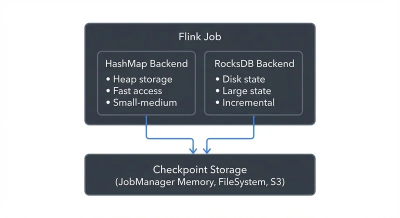

Apache Flink's ability to maintain stateful computations with strong fault tolerance guarantees is one of its defining features. Understanding state management and checkpointing is essential for building reliable, production-grade streaming applications that can recover from failures without data loss or duplication. For a broader overview of Flink's architecture and capabilities, see [What is Apache Flink: Stateful Stream Processing](https://conduktor.io/glossary/what-is-apache-flink-stateful-stream-processing).

## Understanding State in Flink

State in Flink represents information about past events that influences the processing of future events. Flink supports two primary types of state:

**Keyed State** is associated with a specific key and is accessible only by operations on the same key. This is the most common form of state in streaming applications. Flink provides several keyed state primitives:

- `ValueState<T>`: Stores a single value per key
- `ListState<T>`: Stores a list of elements per key
- `MapState<K, V>`: Stores a map of key-value pairs per key
- `ReducingState<T>`: Stores a single value representing aggregation results
- `AggregatingState<IN, OUT>`: Similar to ReducingState but with different input/output types

**Operator State** (or non-keyed state) is associated with parallel instances of operators rather than with specific keys. This is commonly used for source operators that need to track partition offsets or maintain buffered data.

State serves critical functions in streaming applications: maintaining session windows, tracking user interactions over time, computing running aggregations, and implementing complex event processing patterns. Without proper state management, streaming applications would be limited to stateless transformations. For practical implementation details, see [Flink DataStream API: Building Streaming Applications](https://conduktor.io/glossary/flink-datastream-api-building-streaming-applications).

## State Backends: Storage and Retrieval

Flink abstracts state storage through configurable state backends, which determine how state is stored locally during computation, and checkpoint storage, which determines how state is persisted during checkpoints. Starting with Flink 1.13, this separation provides clearer configuration and better flexibility.



<!-- ORIGINAL_DIAGRAM
```
                    State Backend Architecture

┌─────────────────────────────────────────────────────────────┐
│                    Flink Job                                │
├─────────────────────────────────────────────────────────────┤
│                                                              │
│  ┌────────────────┐                    ┌──────────────┐     │
│  │ HashMap Backend│                    │ RocksDB      │     │
│  │                │                    │ Backend      │     │
│  │ • Heap storage │                    │ • Disk state │     │
│  │ • Fast access  │                    │ • Large state│     │
│  │ • Small-medium │                    │ • Incremental│     │
│  └───────┬────────┘                    └───────┬──────┘     │
│          │                                     │            │
│          └─────────────────┬───────────────────┘            │
│                            │                                │
└────────────────────────────┼────────────────────────────────┘
                             ▼
                  ┌─────────────────────┐
                  │ Checkpoint Storage  │
                  │ (JobManager Memory, │
                  │  FileSystem, S3)    │
                  └─────────────────────┘
```
-->

**HashMapStateBackend** (introduced in Flink 1.13, replacing MemoryStateBackend) stores state as Java objects in the TaskManager's JVM heap. It provides fast state access but is limited by available heap memory. Suitable for state sizes up to hundreds of megabytes and development/testing environments.

**EmbeddedRocksDBStateBackend** (updated API in Flink 1.13+, replacing RocksDBStateBackend) uses an embedded RocksDB instance to store state on local disk. This backend supports state sizes larger than available memory and provides incremental checkpointing, making it the preferred choice for production applications with large state requirements (multi-gigabyte state). RocksDB serializes state objects, which adds CPU overhead but enables practically unlimited state size.

The checkpoint storage is configured separately and determines where completed checkpoints are persisted: JobManager memory (for testing only), distributed file systems (HDFS, S3, Azure Blob Storage, Google Cloud Storage), or other durable storage systems.

Configuration example for modern Flink 1.13+ state backend (Java):

```java
import org.apache.flink.contrib.streaming.state.EmbeddedRocksDBStateBackend;
import org.apache.flink.runtime.state.storage.FileSystemCheckpointStorage;
import org.apache.flink.streaming.api.environment.StreamExecutionEnvironment;

StreamExecutionEnvironment env = StreamExecutionEnvironment.getExecutionEnvironment();

// Configure RocksDB state backend with incremental checkpoints
EmbeddedRocksDBStateBackend rocksDBBackend = new EmbeddedRocksDBStateBackend();
rocksDBBackend.setIncrementalCheckpointsEnabled(true);

env.setStateBackend(rocksDBBackend);

// Configure checkpoint storage separately
env.getCheckpointConfig().setCheckpointStorage(
    new FileSystemCheckpointStorage("s3://my-bucket/checkpoints")
);

// Enable checkpointing with 60-second interval
env.enableCheckpointing(60000);
```

Configuration example using YAML (flink-conf.yaml):

```yaml
# State backend configuration (Flink 1.13+)
state.backend: rocksdb
state.backend.incremental: true

# Checkpoint storage configuration
state.checkpoints.dir: s3://my-bucket/checkpoints
state.savepoints.dir: s3://my-bucket/savepoints

# RocksDB-specific tuning
state.backend.rocksdb.localdir: /tmp/rocksdb
```

State backend selection depends on state size requirements, recovery time objectives, and available infrastructure. Small state (< 100 MB) fits in HashMapStateBackend, while multi-gigabyte state requires EmbeddedRocksDBStateBackend with incremental checkpointing enabled.

## Checkpointing: The Fault Tolerance Mechanism

Checkpointing is Flink's primary mechanism for fault tolerance. A checkpoint represents a consistent snapshot of the entire application state and stream positions across all operators. If a failure occurs, Flink restarts the application from the most recent successful checkpoint.

Flink implements the Chandy-Lamport algorithm for distributed snapshots, modified to work efficiently with streaming data. This algorithm ensures all operators capture their state at logically consistent points in the data stream, preventing partial processing or duplication. The process works as follows:


<!-- ORIGINAL_DIAGRAM
```
           Checkpointing Flow with Barriers

  Source            Operator          Operator          Sink
    │                  │                 │               │
    ├─ Data ──────────▶│                 │               │
    ├─ Data ──────────▶├─ Data ─────────▶│               │
    ├─ Data ──────────▶├─ Data ─────────▶├─ Data ───────▶│
    │                  │                 │               │
  ┌─┴─────────────┐    │                 │               │
  │ 1. JM triggers│    │                 │               │
  │  checkpoint   │    │                 │               │
  └───────────────┘    │                 │               │
    │                  │                 │               │
    ├─ [Barrier] ──────▶│                 │               │
    ├─ Data ──────────▶│                 │               │
    │                  │                 │               │
    │               ┌──┴───────────┐     │               │
    │               │ 2. Snapshot  │     │               │
    │               │    state     │     │               │
    │               └──┬───────────┘     │               │
    │                  │                 │               │
    │                  ├─ [Barrier] ─────▶│               │
    │                  ├─ Data ─────────▶│               │
    │                  │                 │               │
    │                  │              ┌──┴──────────┐    │
    │                  │              │ 3. Snapshot │    │
    │                  │              │    state    │    │
    │                  │              └──┬──────────┘    │
    │                  │                 │               │
    │                  │                 ├─ [Barrier] ───▶│
    │                  │                 │               │
    │                  │                 │            ┌──┴────────┐
    │                  │                 │            │4. Snapshot│
    │                  │                 │            │   state   │
    │                  │                 │            └──┬────────┘
    ▼                  ▼                 ▼               ▼

              5. All operators ACK → Checkpoint complete
```
-->

1. The JobManager triggers a checkpoint by injecting special barrier markers into the data streams
2. Barriers flow through the topology with the data stream
3. When an operator receives barriers from all input channels, it snapshots its state to the configured checkpoint storage
4. The operator then forwards the barrier to downstream operators
5. Once all operators acknowledge the checkpoint, it's marked as complete

Checkpointing configuration requires careful tuning:

```yaml
# flink-conf.yaml
execution.checkpointing.interval: 60000  # Checkpoint every 60 seconds
execution.checkpointing.mode: EXACTLY_ONCE
execution.checkpointing.timeout: 600000  # 10 minute timeout
execution.checkpointing.max-concurrent-checkpoints: 1
execution.checkpointing.min-pause: 30000  # Minimum 30s between checkpoints
state.backend.incremental: true  # Enable incremental checkpoints for RocksDB
```

Checkpoint intervals represent a trade-off: shorter intervals reduce potential data reprocessing after failure but increase overhead and storage costs. Production applications typically checkpoint every 30-120 seconds, depending on data volume and recovery time requirements.

The **exactly-once** processing semantics guarantee that each record affects the final results exactly once, even in the presence of failures. This requires coordinating checkpoints with external systems (sources and sinks) that support transactional or idempotent writes. For more on exactly-once guarantees in Kafka, see [Kafka Transactions Deep Dive](https://conduktor.io/glossary/kafka-transactions-deep-dive).

## Savepoints: Versioned Application State

While checkpoints are automatic and lightweight, savepoints are manually triggered, versioned snapshots of application state. Savepoints enable operational workflows that checkpoints cannot:

- **Application upgrades**: Deploy new application logic while maintaining existing state
- **Cluster migration**: Move applications between Flink clusters
- **Flink version upgrades**: Update the Flink runtime version
- **A/B testing**: Run different application versions with identical initial state
- **Time travel**: Revert to a known good state after detecting data quality issues

Creating and using savepoints:

```bash
# Trigger a savepoint
./bin/flink savepoint <jobId> [targetDirectory]

# Start job from savepoint
./bin/flink run -s <savepointPath> myApplication.jar

# Dispose of old savepoint
./bin/flink savepoint -d <savepointPath>
```

Savepoints are larger and slower than checkpoints because they use a canonical, version-stable format designed for long-term storage. Applications should trigger savepoints before planned maintenance rather than relying on automatic checkpoints.

## Integration with Kafka and the Streaming Ecosystem

Flink's state management integrates deeply with Apache Kafka through coordinated checkpointing. When Flink checkpoints successfully, it commits Kafka consumer offsets transactionally, ensuring exactly-once processing end-to-end.

The Kafka source connector participates in Flink's checkpointing by:

1. Storing current partition offsets as operator state
2. Committing offsets to Kafka only after checkpoint completion
3. Restoring offsets from state upon recovery

This coordination prevents message loss and duplication:

```java
KafkaSource<Event> source = KafkaSource.<Event>builder()
    .setBootstrapServers("broker:9092")
    .setTopics("events")
    .setGroupId("flink-consumer")
    .setStartingOffsets(OffsetsInitializer.committedOffsets())
    .setValueOnlyDeserializer(new EventDeserializer())
    .build();

DataStream<Event> events = env.fromSource(
    source,
    WatermarkStrategy.forBoundedOutOfOrderness(Duration.ofSeconds(10)),
    "Kafka Source"
);
```

Similarly, the Kafka sink provides exactly-once guarantees through two-phase commit protocol, coordinating with Flink's checkpointing. Transactions are committed only when checkpoints complete successfully.

For organizations managing complex streaming infrastructures, governance platforms like Conduktor provide visibility into Kafka-Flink integration patterns. [Monitor Kafka topics](https://docs.conduktor.io/guide/manage-kafka/kafka-resources/topics) to track consumption lag, offset commits aligned with Flink checkpoints, and data flow observability to identify state management issues before they impact production systems. [Schema Registry integration](https://docs.conduktor.io/guide/manage-kafka/kafka-resources/schema-registry) ensures event format compatibility across your Flink pipelines. For comprehensive lag monitoring strategies, see [Consumer Lag Monitoring and Alerting](https://conduktor.io/glossary/consumer-lag-monitoring-and-alerting) and [Kafka Cluster Monitoring and Metrics](https://conduktor.io/glossary/kafka-cluster-monitoring-and-metrics).

## Production Considerations and Best Practices

Successful production deployments require attention to several operational aspects:

**State Size Monitoring**: Track state growth over time using Flink's metrics system. Unbounded state growth often indicates logic errors (improper cleanup of old keys, window state not being evicted). Set up alerts when state size grows unexpectedly. Monitor metrics such as `state.backend.rocksdb.size` and `checkpoint.duration` to identify issues early.

**Checkpoint Alignment**: Unaligned checkpoints (introduced in Flink 1.11, stabilized in 1.13+) reduce backpressure impact during checkpointing by allowing barriers to overtake buffered data. Enable for high-throughput applications where checkpoint alignment causes slowdowns:

```yaml
execution.checkpointing.unaligned: true
execution.checkpointing.aligned-checkpoint-timeout: 60s  # Fallback to unaligned after 60s
```

**State TTL (Time-To-Live)**: Configure state time-to-live to automatically clean up expired entries, preventing unbounded state growth:

```java
StateTtlConfig ttlConfig = StateTtlConfig
    .newBuilder(Time.days(7))
    .setUpdateType(StateTtlConfig.UpdateType.OnCreateAndWrite)
    .setStateVisibility(StateTtlConfig.StateVisibility.NeverReturnExpired)
    .build();

ValueStateDescriptor<String> descriptor = new ValueStateDescriptor<>("state", String.class);
descriptor.enableTimeToLive(ttlConfig);
```

**Incremental Checkpointing**: For RocksDB backend, enable incremental checkpoints to avoid uploading full state snapshots. This dramatically reduces checkpoint duration and network I/O for large state:

```yaml
state.backend.incremental: true
```

Incremental checkpoints only upload changes since the last checkpoint, reducing checkpoint time from minutes to seconds for multi-gigabyte state.

**Generalized Log-Based Incremental Checkpoints**: Flink 1.18+ introduced generalized incremental checkpoints (FIP-306) that work with any state backend, not just RocksDB. This enables incremental checkpointing for HashMapStateBackend, combining fast heap access with efficient checkpointing:

```yaml
execution.checkpointing.incremental: true
dstl.dstl.enabled: true  # Distributed State Transaction Log
```

**Changelog State Backend**: Flink 1.15+ introduced and Flink 1.18+ stabilized the changelog state backend, which materializes state changes immediately to distributed storage. This reduces recovery time from minutes to seconds at the cost of higher I/O during normal operation. As of 2025, this is production-ready for latency-sensitive applications:

```yaml
state.backend.changelog.enabled: true
state.backend.changelog.storage: filesystem  # or memory
```

**Retention Policies**: Configure checkpoint retention to keep completed checkpoints even after job cancellation, enabling state recovery for debugging or reprocessing scenarios:

```yaml
execution.checkpointing.externalized-checkpoint-retention: RETAIN_ON_CANCELLATION
execution.checkpointing.max-retained-checkpoints: 3
```

## Summary

Flink's state management and checkpointing system provides the foundation for fault-tolerant stateful stream processing. Keyed and operator state enable complex computations across time, while configurable state backends balance performance and scalability requirements. Checkpointing implements the Chandy-Lamport algorithm to create consistent distributed snapshots with exactly-once semantics, and savepoints enable operational flexibility through versioned state snapshots.

Production deployments require careful configuration of checkpoint intervals, state backends (typically RocksDB with incremental checkpointing), and integration with external systems like Kafka. Monitoring state size, checkpoint duration, and alignment metrics helps identify issues before they cause outages. For broader Flink architectural decisions, see [Flink vs Spark Streaming: When to Choose Each](https://conduktor.io/glossary/flink-vs-spark-streaming-when-to-choose-each) and [Kafka Streams vs Apache Flink](https://conduktor.io/glossary/kafka-streams-vs-apache-flink).

Understanding these mechanisms transforms Flink from a computational framework into a reliable platform for mission-critical streaming applications that maintain correctness guarantees even in the face of failures. For testing strategies to validate your state management implementation, see [Testing Strategies for Streaming Applications](https://conduktor.io/glossary/testing-strategies-for-streaming-applications).

## Related Concepts

- [Exactly-Once Semantics in Kafka](https://conduktor.io/glossary/exactly-once-semantics-in-kafka) - How Flink coordinates with Kafka for end-to-end exactly-once processing
- [Kafka Transactions Deep Dive](https://conduktor.io/glossary/kafka-transactions-deep-dive) - Understanding the transactional guarantees that enable exactly-once Kafka sinks
- [Handling Late-Arriving Data in Streaming](https://conduktor.io/glossary/handling-late-arriving-data-in-streaming) - Strategies for managing late data with checkpointing and state

## Sources and References

- Apache Flink Documentation: [State Backends](https://nightlies.apache.org/flink/flink-docs-stable/docs/ops/state/state_backends/)
- Apache Flink Documentation: [Checkpointing](https://nightlies.apache.org/flink/flink-docs-stable/docs/dev/datastream/fault-tolerance/checkpointing/)
- Apache Flink Documentation: [Savepoints](https://nightlies.apache.org/flink/flink-docs-stable/docs/ops/state/savepoints/)
- Carbone, P., et al. (2017): "State Management in Apache Flink" - VLDB Conference
- Apache Flink Documentation: [Kafka Connector](https://nightlies.apache.org/flink/flink-docs-stable/docs/connectors/datastream/kafka/)
