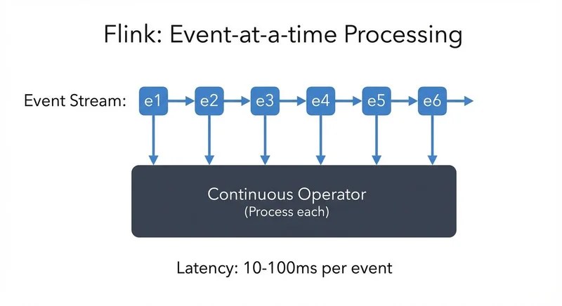
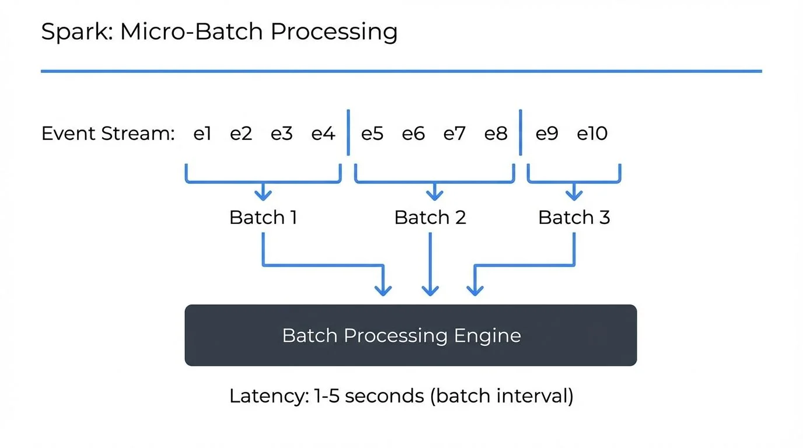

Choosing the right stream processing framework is a critical architectural decision that impacts latency, throughput, and operational complexity. Apache Flink and Apache Spark Streaming represent two different philosophies in stream processing: true event-at-a-time streaming versus micro-batching. Understanding their fundamental differences helps data architects and engineering leaders make informed technology choices.

## Understanding the Architectural Differences

### Apache Flink: True Stream Processing

Apache Flink 1.18+ treats streaming as the primary processing model, with batch processing as a special case of streaming. Every event flows through the system individually, processed by stateful operators that maintain consistency through distributed snapshots (checkpoints—periodic state backups for recovery).

<!-- ORIGINAL_DIAGRAM
```
Flink: Event-at-a-time Processing
━━━━━━━━━━━━━━━━━━━━━━━━━━━━━━━━━
Event Stream: e1→e2→e3→e4→e5→e6
              │  │  │  │  │  │
              ▼  ▼  ▼  ▼  ▼  ▼
          ┌────────────────────┐
          │ Continuous Operator│
          │ (Process each)     │
          └────────────────────┘
Latency: 10-100ms per event
```
-->

Flink's architecture centers on:
- **Event-driven processing**: Records flow continuously through operators
- **Asynchronous checkpointing**: State snapshots (periodic backups for recovery) don't block processing
- **Exactly-once semantics**: Built-in state management (the data your application remembers) with consistency guarantees
- **Low-latency pipelines**: Sub-second processing without artificial batching

### Apache Spark Streaming: Micro-Batch Architecture

Apache Spark 3.5+ Structured Streaming divides incoming data into small batches and processes them using Spark's batch processing engine. Even Structured Streaming, while providing a continuous API, operates on micro-batches internally. Recent versions (Spark 3.5+, released 2024) introduced significant improvements including RocksDB-backed state management, narrowing the gap with Flink's stateful processing capabilities.

<!-- ORIGINAL_DIAGRAM
```
Spark: Micro-Batch Processing
━━━━━━━━━━━━━━━━━━━━━━━━━━━━━━
Event Stream: e1 e2 e3 e4│e5 e6 e7 e8│e9 e10
              └─────────┘ └─────────┘ └──────
              Batch 1     Batch 2     Batch 3
                  │           │           │
                  ▼           ▼           ▼
              ┌─────────────────────────────┐
              │  Batch Processing Engine    │
              └─────────────────────────────┘
Latency: 1-5 seconds (batch interval)
```
-->

Spark's architecture features:
- **Micro-batch processing**: Data collected in small time windows (typically seconds)
- **Batch engine reuse**: Leverages Spark's mature batch processing capabilities
- **Unified API**: Same DataFrame/Dataset API for batch and streaming
- **Higher throughput focus**: Optimized for processing efficiency over latency

## Performance Characteristics Comparison

| Aspect | Apache Flink 1.18+ | Apache Spark 3.5+ Streaming |
|--------|--------------|------------------------|
| **Latency** | Milliseconds (10-100ms typical) | Seconds (1-5s typical) |
| **Throughput** | Very high (millions events/sec) | Very high (millions events/sec) |
| **State Management** | Native RocksDB, optimized for streaming | RocksDB-backed (3.5+) or heap-based |
| **Backpressure Handling** | Native flow control | Configurable with limitations |
| **Memory Model** | Managed memory with off-heap state | Off-heap with RocksDB (3.5+) or JVM heap |
| **Fault Tolerance** | Lightweight checkpoints | Checkpoints with state recovery |

### Latency Deep Dive

Flink achieves lower latency because it processes events immediately upon arrival. A single record triggers computation through the pipeline without waiting for a batch to fill. This makes Flink ideal for applications where every millisecond matters—fraud detection, real-time recommendations, or IoT control systems.

Spark Streaming's micro-batch approach introduces inherent latency equal to the batch interval. Even with intervals as low as one second, this represents a 1000ms minimum latency floor. The tradeoff enables higher throughput optimization and simpler recovery semantics.

### State Management Excellence

Flink's RocksDB-backed state management (an embedded key-value database that stores state on disk rather than memory) allows applications to maintain gigabytes or terabytes of state per operator. State lives off-heap, avoiding JVM garbage collection pressure. Incremental checkpointing means only changed state gets persisted, reducing checkpoint overhead dramatically. For detailed coverage of Flink's state capabilities, see [Flink State Management and Checkpointing](https://conduktor.io/glossary/flink-state-management-and-checkpointing).

Spark's state management has evolved significantly with Structured Streaming's state store API. Spark 3.5+ introduced RocksDB as a state backend option, bringing off-heap state storage capabilities similar to Flink's approach. This major improvement enables larger stateful operations without JVM memory pressure, though the micro-batch processing model still differs fundamentally from Flink's continuous approach. Earlier versions relied on heap-based storage, which could trigger memory pressure and required careful tuning for large state.

## Use Case Decision Matrix

### Choose Apache Flink When:

**Low-latency requirements dominate**
- Real-time fraud detection requiring <100ms response (see [Real-time Fraud Detection with Streaming](https://conduktor.io/glossary/real-time-fraud-detection-with-streaming))
- Live recommendation engines serving immediate results
- IoT applications with control loop requirements (see [IoT Data Streaming Architectures](https://conduktor.io/glossary/iot-data-streaming-architectures))
- Financial trading systems with millisecond SLAs (see [Streaming Data in Financial Services](https://conduktor.io/glossary/streaming-data-in-financial-services))

**Complex event processing is needed**
- Pattern detection across event sequences (Complex Event Processing/CEP library)
- Session windows with flexible timeout logic (see [Session Windows in Stream Processing](https://conduktor.io/glossary/session-windows-in-stream-processing))
- Stateful computations with large per-key state
- Event-time processing with late data handling (see [Handling Late-Arriving Data in Streaming](https://conduktor.io/glossary/handling-late-arriving-data-in-streaming) and [Watermarks and Triggers in Stream Processing](https://conduktor.io/glossary/watermarks-and-triggers-in-stream-processing))

**True streaming semantics matter**
- Applications benefiting from immediate event processing
- Systems where batch boundaries feel artificial
- Continuous aggregations over unbounded streams

### Choose Apache Spark Streaming When:

**You have existing Spark infrastructure**
- Teams already skilled in Spark development
- Batch pipelines that need streaming extensions
- Unified codebase for batch and streaming
- Existing Spark ecosystem integrations (MLlib, GraphX)

**Throughput over latency is the priority**
- Analytics pipelines with minute-level freshness requirements
- Log aggregation and ETL workloads
- Data lake ingestion with transformation
- Reporting dashboards with second-to-minute latency tolerance

**Ecosystem integration is valuable**
- Deep integration with Databricks or cloud-native Spark offerings
- Leveraging Spark SQL for complex transformations
- Using Delta Lake, Apache Iceberg, or Apache Hudi for streaming upserts and time travel
- Combining streaming with machine learning workflows (see [Real-time ML Inference with Streaming Data](https://conduktor.io/glossary/real-time-ml-inference-with-streaming-data))

## Operational Considerations

### Development and Debugging

Flink's DataStream API provides explicit control over streaming semantics, windows, and state. The learning curve is steeper but rewards developers with fine-grained control. Flink's Web UI excels at visualizing backpressure and checkpoint statistics. For a broader comparison of streaming frameworks, see [Kafka Streams vs Apache Flink](https://conduktor.io/glossary/kafka-streams-vs-apache-flink).

Spark's DataFrame API abstracts complexity, making it easier for SQL-oriented teams to adopt streaming. The unified API means batch developers transition smoothly to streaming. However, debugging micro-batch timing issues can be challenging.

### Resource Management and Scaling

Both frameworks integrate with YARN, Kubernetes, and standalone cluster managers. Flink's task slot model enables fine-grained resource allocation per operator (each processing step can have its own resources). Spark's executor model aligns naturally with batch workloads but adapts well to streaming.

Flink excels at rescaling stateful applications—you can change parallelism (the number of parallel instances processing data) and redistribute state automatically. Spark streaming applications require more careful planning around state checkpointing during scaling operations.

### Monitoring and Observability

Effective stream processing requires deep visibility into pipeline health, lag, throughput, and state size. Both Flink and Spark expose metrics through JMX and integrate with monitoring systems like Prometheus. For information on handling backpressure issues, see [Backpressure Handling in Streaming Systems](https://conduktor.io/glossary/backpressure-handling-in-streaming-systems).

Conduktor provides unified monitoring and management capabilities across stream processing frameworks, enabling teams to track data lineage, [monitor consumer lag](https://docs.conduktor.io/guide/monitor-brokers-apps/index), and enforce governance policies regardless of whether pipelines use Flink, Spark, or Kafka Streams. This becomes critical when running multiple frameworks in production, providing a single pane of glass for observability and control.

## Integration with Data Governance

Stream processing doesn't exist in isolation—it's part of a broader data platform requiring governance, quality controls, and operational oversight. Both Flink and Spark benefit from centralized data governance tools like Conduktor that:
- Monitor stream processing applications alongside Kafka infrastructure (see [Kafka Cluster Monitoring and Metrics](https://conduktor.io/glossary/kafka-cluster-monitoring-and-metrics))
- Enforce schema governance and data quality rules (see [Schema Registry and Schema Management](https://conduktor.io/glossary/schema-registry-and-schema-management))
- Track data lineage (the path data takes from source through transformations to destination) from source through stream processing to sinks
- Manage access controls and compliance requirements centrally

This unified governance layer becomes especially valuable in hybrid environments running both Flink and Spark, providing consistent observability and control regardless of the underlying processing framework.

## 2025 Platform Maturity and Recent Improvements

Both frameworks have evolved significantly, with recent releases addressing historical limitations and adding enterprise-grade capabilities.

### Flink 1.18+ Enhancements (2024-2025)

Apache Flink has matured substantially with improvements focused on operational simplicity and broader use case support:

- **Improved watermark alignment**: Better consistency in event-time processing across parallel streams, reducing late data issues
- **Enhanced exactly-once sink support**: More connectors support transactional writes with exactly-once guarantees
- **Native Kubernetes integration**: Flink Kubernetes Operator provides declarative management, auto-scaling, and simplified deployment
- **Expanded Table API and SQL capabilities**: Broader SQL standard support and better integration with streaming semantics
- **Better Python support**: PyFlink improvements make Flink more accessible to data scientists

For hands-on implementation, see [Flink DataStream API: Building Streaming Applications](https://conduktor.io/glossary/flink-datastream-api-building-streaming-applications) and [Flink SQL and Table API for Stream Processing](https://conduktor.io/glossary/flink-sql-and-table-api-for-stream-processing).

### Spark 3.5+ Enhancements (2024-2025)

Apache Spark has significantly improved its streaming capabilities, narrowing gaps with pure streaming frameworks:

- **RocksDB state backend for Structured Streaming**: Off-heap state storage dramatically improves stateful streaming scalability (major breakthrough)
- **Enhanced Python streaming support**: Better PySpark Structured Streaming APIs and performance
- **Improved monitoring and error handling**: Better visibility into streaming query health and failure recovery
- **Better integration with lakehouse formats**: Streamlined Delta Lake, Apache Iceberg, and Apache Hudi support for ACID streaming writes
- **Kubernetes enhancements**: Improved Spark on Kubernetes with better resource management

### Operational Tooling Evolution

Modern stream processing increasingly relies on cloud-native deployment:

- **Kubernetes operators**: Both frameworks now have mature operators (Flink Kubernetes Operator, Spark on K8s Operator) for declarative management
- **Observability standards**: Prometheus metrics, OpenTelemetry tracing, and structured logging are now standard
- **GitOps integration**: Infrastructure-as-code patterns for managing streaming applications at scale

## Making the Decision

The choice between Flink and Spark Streaming rarely comes down to a single factor. Consider these decision criteria:

**Start with latency requirements**: If you need sub-second latency, Flink is the clear choice. If minute-level freshness suffices, Spark remains viable.

**Evaluate existing skills and infrastructure**: Significant Spark investment favors Spark Streaming for incremental streaming adoption. Greenfield projects can choose based purely on technical fit.

**Assess state complexity**: Applications with large per-key state, complex event processing, or sophisticated windowing benefit from Flink's streaming-first design.

**Consider operational maturity**: Both frameworks are production-ready, but your team's expertise and existing operational tooling matter significantly.

**Plan for future requirements**: Architecture decisions have long-term consequences. Choose the framework that accommodates anticipated evolution in latency, scale, and complexity requirements.

## Summary

Apache Flink and Apache Spark Streaming represent different approaches to stream processing, each with clear strengths. Flink delivers true event-at-a-time processing with millisecond latencies, sophisticated state management, and complex event processing capabilities. Spark Streaming offers a unified batch-streaming API, higher throughput optimization, and seamless integration with the broader Spark ecosystem.

For real-time applications demanding minimal latency and complex stateful operations, Flink excels. For organizations with existing Spark infrastructure seeking to add streaming capabilities with second-level latency tolerance, Spark Streaming provides a natural extension.

The most successful data platforms often employ both frameworks strategically—Flink for low-latency critical paths and Spark for high-throughput analytics pipelines. Unified governance and monitoring tools enable teams to operate hybrid environments effectively, maintaining visibility and control regardless of the underlying processing technology.

## Related Concepts

- [What is Apache Flink: Stateful Stream Processing](https://conduktor.io/glossary/what-is-apache-flink-stateful-stream-processing) - Deep dive into Flink's architecture and capabilities
- [Apache Kafka](https://conduktor.io/glossary/apache-kafka) - Platform commonly used as input for both Flink and Spark Streaming
- [Streaming Total Cost of Ownership](https://conduktor.io/glossary/streaming-total-cost-of-ownership) - Evaluating costs across different stream processing frameworks

## Sources and References

- [Apache Flink Documentation](https://flink.apache.org/docs/stable/)
- [Apache Spark Structured Streaming Programming Guide](https://spark.apache.org/docs/latest/structured-streaming-programming-guide.html)
- [Flink vs Spark: A Comparison of Stream Processing Frameworks](https://www.ververica.com/blog/flink-vs-spark)
- [Databricks: Structured Streaming In Apache Spark](https://www.databricks.com/glossary/what-is-structured-streaming)
- Kleppmann, M. (2017). *Designing Data-Intensive Applications*. O'Reilly Media.
- Carbone, P., et al. (2015). "Apache Flink: Stream and Batch Processing in a Single Engine." *Bulletin of the IEEE Computer Society Technical Committee on Data Engineering*.
