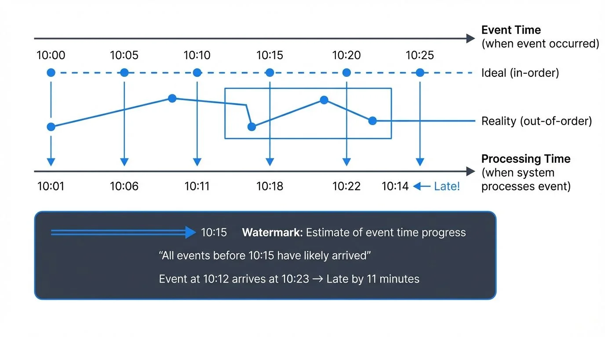
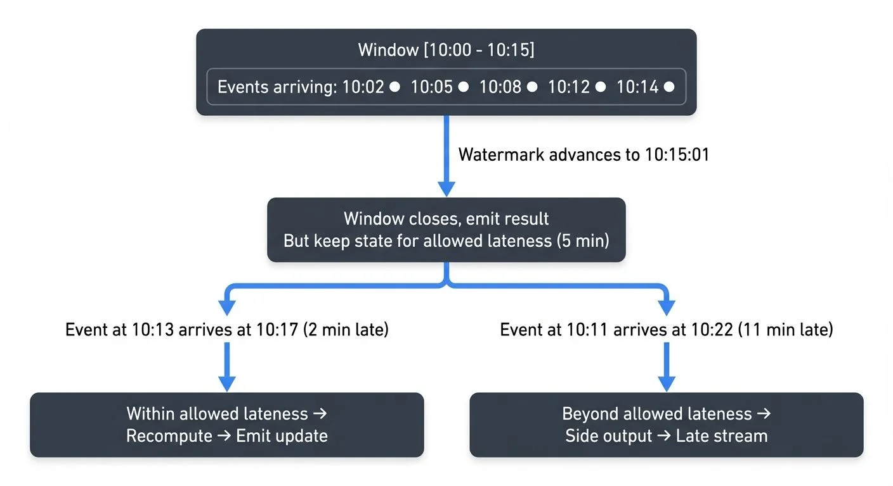

One of the most challenging aspects of stream processing is dealing with data that arrives later than expected. Unlike batch processing where you have a complete dataset before computation begins, streaming systems must make decisions about when to produce results even as new data continues to arrive. Understanding how to handle late-arriving data is essential for building accurate and reliable streaming applications.

## Understanding Event Time vs Processing Time

The root of the late data problem lies in the difference between two fundamental time concepts in streaming systems.



<!-- ORIGINAL_DIAGRAM
```
┌──────────────────────────────────────────────────────────────────┐
│            Event Time vs Processing Time                         │
├──────────────────────────────────────────────────────────────────┤
│                                                                  │
│  Event Time (when event occurred)                                │
│  ────────────────────────────────────────────────────────▶       │
│  10:00    10:05    10:10    10:15    10:20    10:25             │
│    │       │        │        │        │        │                 │
│    ●───────●────────●────────●────────●────────●  Ideal         │
│    │       │        │        │        │        │  (in-order)    │
│    │       │        │        │        │        │                 │
│    │       │        │   ┌────┼────────┼────┐   │                 │
│    │       │        │   │    │        │    │   │  Reality       │
│    ●───────●────────●───┼────●────────●────┼───●  (out-of-order)│
│    │       │        │   │              │   │                     │
│    ▼       ▼        ▼   ▼              ▼   ▼                     │
│  10:01   10:06   10:11 10:18        10:22 10:14  ◀── Late!      │
│                                                                  │
│  Processing Time (when system processes event)                   │
│  ────────────────────────────────────────────────────────▶       │
│                                                                  │
│  ┌────────────────────────────────────────────────────────────┐ │
│  │  Watermark: Estimate of event time progress               │ │
│  │  ════════════════════════▶ 10:15                           │ │
│  │  "All events before 10:15 have likely arrived"            │ │
│  │                                                            │ │
│  │  Event at 10:12 arrives at 10:23 → Late by 11 minutes     │ │
│  └────────────────────────────────────────────────────────────┘ │
│                                                                  │
└──────────────────────────────────────────────────────────────────┘
```
-->

**Event time** is when an event actually occurred in the real world. For example, when a sensor reading was taken, when a user clicked a button, or when a financial transaction was initiated. This timestamp is typically embedded in the event payload itself.

**Processing time** is when the streaming system processes the event. This is when your Kafka consumer reads the message or when your Flink job processes the record.

In an ideal world, events would arrive in perfect event time order, and processing time would closely match event time. In reality, network delays, system outages, mobile devices going offline, clock skew across distributed systems, and various other factors cause events to arrive out of order or significantly delayed.

Consider an IoT deployment where thousands of sensors monitor industrial equipment. Sensors in areas with poor connectivity might buffer readings locally and transmit them in batches when connectivity improves. A temperature reading from 10 minutes ago might arrive after readings from 5 minutes ago, creating challenges for time-based aggregations and alerts.

Late-arriving data is particularly challenging for session windows, which dynamically adjust their boundaries based on event timing. For detailed coverage of session-based processing, see [Session Windows in Stream Processing](https://conduktor.io/glossary/session-windows-in-stream-processing).

## Common Causes of Late-Arriving Data

Late data occurs for many reasons in distributed systems:

**Network issues** are perhaps the most common cause. Temporary connectivity problems, packet loss, or routing issues can delay message delivery. Mobile applications are particularly susceptible, as devices move between networks or lose connectivity entirely.

**System failures and retries** also contribute to late data. When a producer crashes and restarts, it might resend events that were already processed by downstream consumers. Kafka's at-least-once delivery guarantees mean duplicate or delayed messages are possible.

**Distributed clock skew** can cause events to appear late even when they arrive promptly. If different systems have clocks that are out of sync, an event timestamped on one server might appear to be from the past or future when processed on another server.

**Data corrections and updates** represent intentional late data. Financial systems often receive transaction adjustments or corrections hours or days after the initial transaction. These late corrections must be incorporated into historical calculations.

## Strategies for Handling Late Data

Modern stream processing frameworks provide several mechanisms for handling late-arriving data while maintaining result accuracy.

### Watermarks

Watermarks are the primary mechanism for tracking event time progress in streaming systems. A watermark is a special signal that indicates "all events with timestamps less than T have been seen." More precisely, a watermark represents a heuristic estimate of event time progress.



<!-- ORIGINAL_DIAGRAM
```
┌──────────────────────────────────────────────────────────────────┐
│              Watermark and Allowed Lateness                      │
├──────────────────────────────────────────────────────────────────┤
│                                                                  │
│  Window [10:00 - 10:15]                                          │
│  ┌────────────────────────────────────────────────────┐          │
│  │ Events arriving:                                   │          │
│  │ 10:02 ● 10:05 ● 10:08 ● 10:12 ● 10:14 ●           │          │
│  └────────────────────────────────────────────────────┘          │
│                             │                                    │
│                             │ Watermark advances to 10:15:01     │
│                             ▼                                    │
│  ┌────────────────────────────────────────────────────┐          │
│  │ Window closes, emit result                         │          │
│  │ But keep state for allowed lateness (5 min)        │          │
│  └────────────────────────────────────────────────────┘          │
│                             │                                    │
│         ┌───────────────────┴───────────────────┐                │
│         │                                       │                │
│         ▼                                       ▼                │
│  Event at 10:13                          Event at 10:11         │
│  arrives at 10:17                        arrives at 10:22       │
│  (2 min late)                            (11 min late)          │
│         │                                       │                │
│         ▼                                       ▼                │
│  ┌─────────────────┐                   ┌─────────────────┐      │
│  │ Within allowed  │                   │ Beyond allowed  │      │
│  │ lateness        │                   │ lateness        │      │
│  │ → Recompute     │                   │ → Side output   │      │
│  │ → Emit update   │                   │ → Late stream   │      │
│  └─────────────────┘                   └─────────────────┘      │
│                                                                  │
└──────────────────────────────────────────────────────────────────┘
```
-->

For example, a watermark of 10:15:00 suggests that the system has likely received all events with timestamps before 10:15:00. When a window computation spans 10:00:00 to 10:15:00, the system can trigger the computation and produce results once the watermark advances past 10:15:00.

Watermarks are necessarily heuristic because stream processing systems cannot know with certainty whether more late data will arrive. The watermark strategy must balance completeness (waiting longer to include more late data) against latency (producing results quickly).

Apache Flink provides flexible watermark strategies including periodic watermarks generated at regular intervals and punctuated watermarks based on special markers in the stream. Since Flink 1.18, the WatermarkStrategy API has been further simplified with built-in strategies like `forBoundedOutOfOrderness()` and `forMonotonousTimestamps()`, making it easier to handle common late data patterns. Kafka Streams automatically tracks stream time as the maximum timestamp seen so far, with Kafka Streams 3.7+ offering improved grace period semantics for more predictable late data handling.

### Allowed Lateness

Even with watermarks, some data will inevitably arrive after the watermark has passed. The allowed lateness parameter defines a grace period during which late data is still incorporated into computations.

When a window closes based on the watermark, the system doesn't immediately discard the window state. Instead, it keeps the window open for the allowed lateness period. Late events arriving during this grace period trigger recomputation and emission of updated results.

For instance, with an allowed lateness of 5 minutes, an event with timestamp 10:12:00 arriving at 10:21:00 (after the 10:15:00 watermark but within the grace period) would still update the 10:00-10:15 window and emit a corrected result.

### Side Outputs and Late Data Streams

Some data arrives so late that it falls outside even the allowed lateness window. Rather than silently dropping this data, modern frameworks allow routing it to side outputs or separate late data streams.

This pattern enables multiple strategies for handling extremely late data:
- Log late data for auditing and debugging
- Store late data in a separate system for batch reprocessing
- Trigger alerts when late data volumes exceed thresholds
- Merge late data results in downstream systems that can handle corrections

## Implementation in Streaming Frameworks

Different streaming platforms provide various approaches to handling late data.

**Apache Flink** offers comprehensive event time support with customizable watermark generators, allowed lateness configuration, and side outputs for late data. Flink's DataStream API makes event time processing explicit, requiring developers to specify timestamp extraction and watermark generation strategies. For foundational understanding of Flink's architecture and state management, see [What is Apache Flink: Stateful Stream Processing](https://conduktor.io/glossary/what-is-apache-flink-stateful-stream-processing). For detailed coverage of windowing strategies in Flink, see [Windowing in Apache Flink: Tumbling, Sliding, and Session Windows](https://conduktor.io/glossary/windowing-in-apache-flink-tumbling-sliding-and-session-windows).

Here's a practical example of handling late data in Flink 1.18+:

```java
DataStream<Event> events = // ... source
    .assignTimestampsAndWatermarks(
        WatermarkStrategy.<Event>forBoundedOutOfOrderness(Duration.ofMinutes(5))
            .withTimestampAssigner((event, timestamp) -> event.getEventTime())
    );

SingleOutputStreamOperator<Result> results = events
    .keyBy(Event::getUserId)
    .window(TumblingEventTimeWindows.of(Time.minutes(15)))
    .allowedLateness(Time.minutes(5))
    .sideOutputLateData(lateDataTag)
    .aggregate(new EventAggregator());

// Access late data that arrived beyond allowed lateness
DataStream<Event> lateEvents = results.getSideOutput(lateDataTag);
```

**Kafka Streams** provides built-in support for windowed operations with configurable grace periods. The framework automatically manages watermarks based on stream time and allows specifying how long windows remain open for late data. Kafka Streams 3.7+ improved grace period behavior to be more consistent and predictable. The framework also supports suppression operators that can wait for late data before emitting final results. For an introduction to Kafka Streams fundamentals, see [Introduction to Kafka Streams](https://conduktor.io/glossary/introduction-to-kafka-streams).

Example with Kafka Streams 3.7+:

```java
KStream<String, Event> events = builder.stream("events");

events
    .groupByKey()
    .windowedBy(TimeWindows.ofSizeWithNoGrace(Duration.ofMinutes(15))
        .grace(Duration.ofMinutes(5)))  // Grace period for late data
    .aggregate(
        () -> new EventAggregate(),
        (key, event, aggregate) -> aggregate.add(event),
        Materialized.as("events-store")
    )
    .suppress(Suppressed.untilWindowCloses(unbounded()))  // Wait for late data
    .toStream()
    .to("results");
```

**Apache Beam** (and cloud services like Google Dataflow) pioneered many late data handling concepts, including the separation of event time and processing time, watermarks, and triggers. Beam's model allows precise control over when results are materialized and how late data updates are handled.

For deeper understanding of watermark mechanics and triggering strategies, refer to [Watermarks and Triggers in Stream Processing](https://conduktor.io/glossary/watermarks-and-triggers-in-stream-processing).

## Monitoring and Observability

Effective late data handling requires good observability. Key metrics to track include:

**Watermark lag** measures the difference between current event time (watermark position) and current processing time. Growing watermark lag indicates the system is falling behind in processing events.

**Late event count and latency** tracks how many events arrive after watermarks and how late they are. Sudden increases might indicate upstream problems or changing data patterns.

**Window trigger frequency** for recomputation shows how often late data causes windows to re-emit results. Excessive recomputation might indicate watermark strategies need tuning.

Monitoring event timestamp distributions across topics can reveal producers with clock skew or connectivity problems.

**Modern monitoring tools** like Conduktor provide comprehensive [visibility into streaming pipelines](https://docs.conduktor.io/guide/monitor-brokers-apps/index), including late data metrics, watermark progression tracking, and consumer lag monitoring. These platforms help identify late data patterns and optimize watermark strategies based on actual production behavior. For production deployments, tools like Prometheus and Grafana integrate well with Flink and Kafka Streams to expose late data metrics through standard metric endpoints.

## 2025 Advances in Late Data Handling

Modern stream processing frameworks have significantly improved late data handling capabilities:

**Flink 1.18+ improvements** include more efficient watermark alignment across parallel operators, reducing memory overhead for windows with long allowed lateness periods. The new `WatermarkStrategy.forGenerator()` API provides fine-grained control over watermark generation logic, including custom strategies that adapt to changing data patterns.

**Kafka Streams 3.7+ enhancements** provide clearer semantics around grace periods, with better documentation of when windows close and state is purged. The `ofSizeAndGrace()` method makes it explicit when windows will no longer accept late data, improving predictability for downstream consumers.

**Adaptive watermarking** is an emerging pattern where systems dynamically adjust watermark delays based on observed late data patterns. Instead of static watermark strategies, machine learning models can predict optimal watermark delays based on historical latency patterns, time of day, and data source characteristics.

**Exactly-once semantics** have become more robust in handling late data. Both Flink and Kafka Streams now provide stronger guarantees that late data updates are processed exactly once, even in the presence of failures and reprocessing.

## Best Practices

When designing systems to handle late-arriving data, consider these guidelines:

**Choose appropriate watermark strategies** based on your data characteristics. If events arrive mostly in order with occasional stragglers, aggressive watermarks with moderate allowed lateness work well. For highly out-of-order data, more conservative watermarks or longer grace periods may be necessary.

**Set allowed lateness based on business requirements**, not arbitrary values. Analyze your actual late data patterns and balance accuracy needs against state management costs. Longer allowed lateness means more state to maintain.

**Design downstream systems to handle updates**. Since late data can trigger result recomputation, consumers of your streaming results must gracefully handle updated values for previously computed time windows.

**Monitor and alert on late data patterns**. Sudden changes in late data frequency or severity often indicate infrastructure problems, upstream failures, or data quality issues that require investigation.

**Test with realistic late data scenarios**. Many streaming application bugs only appear when processing out-of-order or late-arriving data. Include late data scenarios in your testing strategy. Tools like Conduktor Gateway can simulate network delays and out-of-order message delivery to test late data handling in controlled environments. For comprehensive testing approaches, see [Testing Strategies for Streaming Applications](https://conduktor.io/glossary/testing-strategies-for-streaming-applications).

## Summary

Handling late-arriving data is a fundamental challenge in stream processing that distinguishes it from batch processing. The difference between event time and processing time, combined with the realities of distributed systems, means data will inevitably arrive out of order or delayed.

Modern streaming frameworks provide robust mechanisms for handling late data through watermarks, allowed lateness, and side outputs. Watermarks enable event time-based computations by providing heuristic estimates of stream progress. Allowed lateness offers a grace period for incorporating late events into computations. Side outputs ensure extremely late data isn't lost.

As of 2025, frameworks like Flink 1.18+ and Kafka Streams 3.7+ have significantly improved late data handling with better APIs, clearer semantics, and more efficient implementations. Tools like Conduktor provide comprehensive monitoring to understand late data patterns in production, while Conduktor Gateway enables realistic testing of late data scenarios.

Successful late data handling requires understanding your data patterns, choosing appropriate watermark strategies, configuring reasonable allowed lateness based on business requirements, and maintaining good observability. By designing systems that explicitly account for late-arriving data rather than ignoring it, you can build streaming applications that are both timely and accurate.

## Related Concepts

- [What is Apache Flink: Stateful Stream Processing](https://conduktor.io/glossary/what-is-apache-flink-stateful-stream-processing) - Framework with sophisticated watermark and late data handling
- [Apache Kafka](https://conduktor.io/glossary/apache-kafka) - Streaming platform providing offset-based replay capabilities
- [Exactly-Once Semantics in Kafka](https://conduktor.io/glossary/exactly-once-semantics-in-kafka) - Processing guarantees when handling late data

## Sources and References

- Akidau, Tyler, et al. "The Dataflow Model: A Practical Approach to Balancing Correctness, Latency, and Cost in Massive-Scale, Unbounded, Out-of-Order Data Processing." VLDB Endowment, 2015. [https://research.google/pubs/pub43864/](https://research.google/pubs/pub43864/)

- Apache Flink Documentation. "Event Time and Watermarks." [https://nightlies.apache.org/flink/flink-docs-stable/docs/concepts/time/](https://nightlies.apache.org/flink/flink-docs-stable/docs/concepts/time/)

- Akidau, Tyler. "Streaming 101: The world beyond batch." O'Reilly Radar, 2015. [https://www.oreilly.com/radar/the-world-beyond-batch-streaming-101/](https://www.oreilly.com/radar/the-world-beyond-batch-streaming-101/)

- Apache Kafka Documentation. "Kafka Streams - Time Concepts." [https://kafka.apache.org/documentation/streams/](https://kafka.apache.org/documentation/streams/)

- Kleppmann, Martin. "Designing Data-Intensive Applications." O'Reilly Media, 2017. Chapter 11: Stream Processing.
