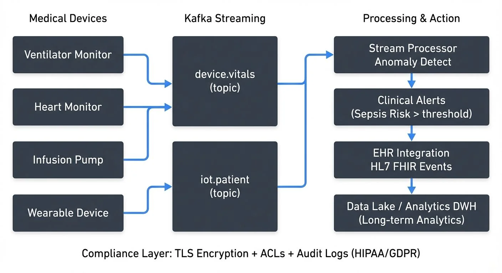

Healthcare organizations are increasingly adopting real-time data streaming architectures to improve patient outcomes, enhance operational efficiency, and enable data-driven decision making. Unlike traditional batch processing systems that analyze data hours or days after collection, streaming platforms like Apache Kafka 4.0+ and Apache Flink process healthcare data as it's generated, enabling immediate insights and faster responses to critical events.

Modern streaming platforms have matured significantly for healthcare workloads. Apache Kafka 4.0+ operates in KRaft mode (removing ZooKeeper dependencies for simplified operations), offers tiered storage for long-term retention of patient data, and provides enhanced security features critical for HIPAA compliance. For detailed coverage of KRaft architecture, see [Understanding KRaft Mode in Kafka](https://conduktor.io/glossary/understanding-kraft-mode-in-kafka).

This shift toward real-time processing addresses fundamental challenges in modern healthcare: managing data from thousands of connected medical devices, coordinating care across multiple systems, and detecting life-threatening conditions before they become emergencies.

<!-- ORIGINAL_DIAGRAM
```
┌─────────────────────────────────────────────────────────────────┐
│              Healthcare Streaming Data Flow                     │
└─────────────────────────────────────────────────────────────────┘

Medical Devices         Kafka Streaming           Processing & Action
     │                       │                           │
     ▼                       ▼                           ▼
┌──────────┐         ┌──────────────┐         ┌──────────────────┐
│Ventilator│────────▶│device.vitals │────────▶│ Stream Processor │
│ Monitor  │         │   (topic)    │         │  Anomaly Detect  │
└──────────┘         └──────────────┘         └──────────────────┘
     │                       │                           │
┌──────────┐                │                           ▼
│  Heart   │───────────┐    │                 ┌──────────────────┐
│ Monitor  │           │    │                 │  Clinical Alerts │
└──────────┘           ├───▶│                 │  (Sepsis Risk >  │
     │                 │    │                 │   threshold)     │
┌──────────┐           │    │                 └──────────────────┘
│ Infusion │───────────┘    │                           │
│  Pump    │                │                           ▼
└──────────┘                │                 ┌──────────────────┐
     │                      │                 │  EHR Integration │
┌──────────┐                ▼                 │  HL7 FHIR Events │
│ Wearable │         ┌──────────────┐         └──────────────────┘
│  Device  │────────▶│ iot.patient  │                  │
└──────────┘         │   (topic)    │                  ▼
                     └──────────────┘         ┌──────────────────┐
                            │                 │   Data Lake /    │
                            │                 │  Analytics DWH   │
                            └────────────────▶│ (Long-term       │
                                              │  Analytics)      │
                                              └──────────────────┘

Compliance Layer: TLS Encryption + ACLs + Audit Logs (HIPAA/GDPR)
```
-->

## Real-Time Patient Monitoring and Critical Care

Intensive care units (ICUs) generate continuous streams of patient data from ventilators, cardiac monitors, infusion pumps, and other medical devices. Each device may produce hundreds of data points per second, including vital signs, medication dosages, and equipment status.

Data streaming platforms consume these device feeds in real time, applying stream processing logic to detect anomalies, trigger alerts, and update clinical dashboards. For example, a streaming pipeline might correlate heart rate variability with blood pressure trends to identify early signs of septic shock, alerting clinicians minutes or hours before traditional monitoring systems would flag the issue.

Apache Kafka topics can organize patient data by ward, device type, or clinical priority, while stream processors like Kafka Streams or Apache Flink apply complex event processing rules. These systems must handle high throughput with low latency—delays of even a few seconds can impact critical care decisions.

## Medical Device Integration and IoT

The proliferation of connected medical devices—from bedside monitors to implantable sensors and consumer wearables—creates massive volumes of streaming health data. Remote patient monitoring programs track chronic conditions like diabetes and heart disease by continuously ingesting data from glucose meters, blood pressure cuffs, and smartwatches.

These IoT ecosystems rely on event-driven architectures where devices publish measurements to streaming platforms. The data flows through validation and enrichment stages before being routed to clinical systems, analytics platforms, or long-term storage. For comprehensive coverage of IoT streaming patterns, protocols, and edge processing strategies, see [IoT Data Streaming Architectures](https://conduktor.io/glossary/iot-data-streaming-architectures).

A typical architecture might use MQTT or HTTP for device ingestion, with an Apache Kafka cluster serving as the central event backbone. Stream processors normalize data formats, filter noise, and detect threshold violations. For instance, a streaming application might monitor a diabetic patient's continuous glucose monitor (CGM) and automatically alert care teams when blood sugar levels exceed safe ranges for more than 15 minutes.

## Clinical Decision Support and Predictive Analytics

Clinical decision support systems (CDSS) leverage streaming data to provide real-time recommendations at the point of care. By analyzing current patient state alongside historical patterns and clinical guidelines, these systems help clinicians make more informed decisions.

Stream processing enables predictive models that continuously score patient risk. A sepsis prediction model might consume lab results, vital signs, and medication data in real time, recalculating risk scores every time new information arrives. When risk crosses a threshold, the system can trigger care protocols, order additional tests, or notify rapid response teams.

Machine learning models deployed in streaming pipelines must handle concept drift—the phenomenon where the statistical properties of the target variable change over time, meaning patient populations and disease patterns evolve, requiring models to adapt. For example, a sepsis prediction model trained on pre-pandemic data may need retraining to account for COVID-19 complications. Streaming architectures support online learning and model retraining by capturing prediction outcomes and feeding them back into training pipelines. For implementation patterns, see [Real-Time ML Pipelines](https://conduktor.io/glossary/real-time-ml-pipelines) and [Model Drift in Streaming](https://conduktor.io/glossary/model-drift-in-streaming).

## Healthcare Interoperability and Data Exchange

Healthcare data exists in silos across electronic health records (EHRs), laboratory information systems (LIS), picture archiving systems (PACS), and countless other specialized applications. Achieving interoperability requires real-time data exchange using standards like HL7 v2, HL7 FHIR, and DICOM.

Streaming platforms serve as integration backbones that mediate between these heterogeneous systems. When a patient visits the emergency department, their record might trigger a cascade of events: retrieving medical history from the EHR, checking medication lists from the pharmacy system, and pulling recent imaging from PACS—all happening in seconds rather than minutes.

HL7 FHIR's event-driven design aligns naturally with streaming architectures. FHIR subscriptions allow systems to publish resource changes (new lab results, updated medications, revised diagnoses) to Kafka topics, where downstream consumers can react in real time. Schema registries become critical for managing the evolution of FHIR resource definitions and ensuring compatibility across system versions. For comprehensive coverage of schema management strategies, versioning, and compatibility rules, see [Schema Registry and Schema Management](https://conduktor.io/glossary/schema-registry-and-schema-management).

Here's an example of a Kafka producer publishing a FHIR patient resource update:

```python
from kafka import KafkaProducer
import json

# Initialize producer with encryption
producer = KafkaProducer(
    bootstrap_servers=['kafka-broker:9093'],
    security_protocol='SSL',
    ssl_cafile='/path/to/ca-cert',
    ssl_certfile='/path/to/client-cert',
    ssl_keyfile='/path/to/client-key',
    value_serializer=lambda v: json.dumps(v).encode('utf-8')
)

# FHIR Patient resource update event
fhir_patient_update = {
    "resourceType": "Patient",
    "id": "patient-12345",
    "meta": {
        "versionId": "2",
        "lastUpdated": "2025-12-08T10:30:00Z"
    },
    "identifier": [{
        "system": "http://hospital.example.org/patients",
        "value": "MRN-987654"
    }],
    "name": [{
        "family": "Smith",
        "given": ["John"]
    }],
    "telecom": [{
        "system": "phone",
        "value": "+1-555-0100",
        "use": "mobile"
    }],
    "birthDate": "1985-03-15",
    "address": [{
        "line": ["123 Main St"],
        "city": "Boston",
        "state": "MA",
        "postalCode": "02101"
    }]
}

# Publish to Kafka topic
producer.send(
    'fhir.patient.updates',
    key=b'patient-12345',
    value=fhir_patient_update
)

producer.flush()
```

## Compliance, Security, and Data Governance

Healthcare data streaming must comply with strict regulations including HIPAA in the United States, GDPR in Europe, and various regional privacy laws. These requirements affect every aspect of streaming architecture—from encryption and access controls to audit logging and data retention. For comprehensive guidance on GDPR requirements for data teams, see [GDPR Compliance for Data Teams](https://conduktor.io/glossary/gdpr-compliance-for-data-teams).

Data in motion requires end-to-end encryption using TLS for network transmission and encryption at rest for data stored in Kafka topics. Access control lists (ACLs) limit which applications can produce to or consume from specific topics containing protected health information (PHI). For detailed security implementation patterns, see [Kafka Security Best Practices](https://conduktor.io/glossary/kafka-security-best-practices) and [Kafka ACLs and Authorization Patterns](https://conduktor.io/glossary/kafka-acls-and-authorization-patterns).

Audit trails must capture who accessed what data and when. Streaming platforms generate their own audit events, creating meta-streams (streams about streams)—dedicated Kafka topics that track data lineage, schema changes, and consumer access patterns. These audit streams feed compliance dashboards and support forensic investigation when breaches occur. For detailed implementation patterns for audit logging in streaming platforms, see [Streaming Audit Logs](https://conduktor.io/glossary/streaming-audit-logs).

Data governance tools become essential for managing consent, data retention policies, and right-to-deletion requirements. When a patient exercises their right to be forgotten under GDPR, systems must identify and purge all related events across topics and downstream systems—a complex operation that requires careful tracking of data lineage.

Here's an example of processing patient consent events in a streaming pipeline:

```python
from kafka import KafkaConsumer
from datetime import datetime
import json

# Consumer for consent management stream
consumer = KafkaConsumer(
    'patient.consent.updates',
    bootstrap_servers=['kafka-broker:9093'],
    security_protocol='SSL',
    ssl_cafile='/path/to/ca-cert',
    ssl_certfile='/path/to/client-cert',
    ssl_keyfile='/path/to/client-key',
    value_deserializer=lambda m: json.loads(m.decode('utf-8')),
    group_id='consent-processor'
)

# Process consent events
for message in consumer:
    consent_event = message.value

    if consent_event['action'] == 'REVOKE':
        # Patient revoked consent - trigger data deletion
        patient_id = consent_event['patientId']
        data_category = consent_event['category']  # e.g., 'research', 'marketing'

        print(f"Processing consent revocation for patient {patient_id}")
        print(f"Category: {data_category}")
        print(f"Timestamp: {consent_event['timestamp']}")

        # Trigger data deletion workflow
        initiate_data_purge(patient_id, data_category)

    elif consent_event['action'] == 'GRANT':
        # Patient granted new consent
        patient_id = consent_event['patientId']
        consent_scope = consent_event['scope']

        print(f"Recording consent grant for patient {patient_id}")
        update_consent_registry(patient_id, consent_scope)

def initiate_data_purge(patient_id, category):
    """Initiate GDPR-compliant data deletion across all systems"""
    # Publish deletion event to downstream systems
    deletion_event = {
        'patientId': patient_id,
        'category': category,
        'action': 'DELETE',
        'timestamp': datetime.utcnow().isoformat()
    }
    # Send to deletion orchestration topic
    # downstream consumers will handle purging from their systems
    pass

def update_consent_registry(patient_id, scope):
    """Update central consent registry"""
    # Store consent in persistent registry
    pass
```

Governance platforms like Conduktor provide capabilities to enforce data policies, monitor compliance, and manage the lifecycle of sensitive healthcare data flowing through streaming systems. Conduktor offers data masking ([documentation](https://docs.conduktor.io/guide/conduktor-in-production/admin/data-mask)), audit trails, and policy enforcement features specifically designed for regulated industries like healthcare, helping organizations maintain HIPAA and GDPR compliance while managing Kafka clusters at scale. For proactive alerts on compliance violations or system issues, configure [Conduktor Alerts](https://docs.conduktor.io/guide/monitor-brokers-apps/alerts).

## Streaming Architecture Considerations

Building healthcare streaming systems requires careful architectural decisions. High availability is non-negotiable—downtime in critical monitoring systems can have life-threatening consequences. This demands multi-datacenter replication, automated failover, and robust disaster recovery plans. For cross-cluster replication strategies, see [Kafka MirrorMaker 2 for Cross-Cluster Replication](https://conduktor.io/glossary/kafka-mirrormaker-2-for-cross-cluster-replication).

Latency requirements vary by use case. Critical alerts must propagate in seconds (typically under 5 seconds end-to-end), while population health analytics might tolerate minute-level delays. Event ordering matters for clinical accuracy—lab results must be processed in the sequence they were collected, and medication administration events must maintain precise timestamps.

Data quality deserves special attention in healthcare contexts. Invalid readings from malfunctioning devices, duplicate events from system retries, and schema inconsistencies across sources can corrupt analytics and trigger false alarms. Stream processing pipelines must include validation, deduplication, and error handling at every stage.

Modern Kafka deployments (4.0+) benefit from several features particularly valuable for healthcare:

- **Tiered Storage**: Enables long-term retention of patient data (required for compliance) without expanding expensive broker storage. Historical data moves to cost-effective object storage while remaining queryable. See [Tiered Storage in Kafka](https://conduktor.io/glossary/tiered-storage-in-kafka).
- **KRaft Mode**: Simplifies operations by removing ZooKeeper dependencies, reducing failure points in critical healthcare infrastructure.
- **Enhanced Security**: Native support for OAuth 2.0 and improved encryption options align with healthcare security requirements. See [Kafka Authentication: SASL, SSL, OAuth](https://conduktor.io/glossary/kafka-authentication-sasl-ssl-oauth).

Monitoring and observability are critical. Healthcare teams need real-time visibility into pipeline health, data quality metrics, consumer lag, and system performance. Conduktor provides unified monitoring dashboards, alerting, and troubleshooting capabilities specifically designed for complex Kafka deployments in regulated environments.

## Summary

Healthcare data streaming enables organizations to transition from reactive, batch-oriented systems to proactive, real-time care delivery. The use cases span real-time patient monitoring that saves lives in critical care settings, medical device integration that extends care beyond hospital walls, clinical decision support that augments human expertise, and interoperability frameworks that break down data silos. For broader streaming analytics patterns applicable to healthcare, see [Real-Time Analytics with Streaming Data](https://conduktor.io/glossary/real-time-analytics-with-streaming-data).

Success requires addressing unique healthcare challenges: stringent compliance requirements, complex data formats like HL7 FHIR, high reliability demands, and the need to integrate legacy systems with modern streaming architectures. Organizations that master these challenges gain competitive advantages through improved patient outcomes, operational efficiency, and the ability to leverage data for continuous care improvement.

Modern platforms like Apache Kafka 4.0+ with KRaft mode, combined with governance tools like Conduktor, provide the foundation for building compliant, scalable, and reliable healthcare streaming systems that meet both technical and regulatory requirements.

As healthcare continues its digital transformation, streaming platforms will become foundational infrastructure—as essential as electronic health records are today.

## Related Concepts

- [Apache Kafka](/apache-kafka) - Distributed streaming platform for healthcare data pipelines
- [Data Governance Framework: Roles and Responsibilities](/data-governance-framework-roles-and-responsibilities) - Govern sensitive healthcare data
- [GDPR Compliance for Data Teams](/gdpr-compliance-for-data-teams) - Ensure regulatory compliance for patient data

## Sources and References

1. HL7 International. "FHIR R4 Specification - Subscriptions Framework." HL7.org, https://www.hl7.org/fhir/subscription.html
2. U.S. Department of Health & Human Services. "HIPAA Security Rule - Technical Safeguards." HHS.gov, https://www.hhs.gov/hipaa/for-professionals/security/index.html
3. Hathaliya, Jigna J., and Sudeep Tanwar. "An exhaustive survey on security and privacy issues in Healthcare 4.0." Computer Communications, vol. 153, 2020, pp. 311-335. doi:10.1016/j.comcom.2020.02.018
4. Apache Software Foundation. "Apache Kafka Use Cases - Healthcare Data Pipelines." Kafka.apache.org, https://kafka.apache.org/documentation/#uses
5. Roine, Roy, et al. "Real-time clinical decision support: The role of streaming analytics in healthcare." Journal of Medical Systems, vol. 45, no. 3, 2021. doi:10.1007/s10916-020-01704-3
