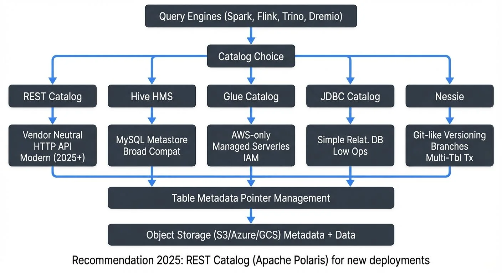

Apache Iceberg has emerged as a leading table format for data lakes, offering ACID transactions, schema evolution, and time travel capabilities. At the heart of Iceberg's architecture lies the catalog—a critical component responsible for tracking table metadata, managing table locations, and coordinating concurrent operations. Understanding the differences between catalog implementations is essential for data architects and platform engineers building scalable data infrastructures.

This article explores the major catalog solutions available in 2025: the vendor-neutral REST Catalog (recommended for new deployments), traditional Hive Metastore, AWS Glue for cloud-native architectures, and Project Nessie for Git-like versioning workflows. For foundational concepts about Iceberg's architecture, see [Apache Iceberg Table Architecture: Metadata and Snapshots](https://conduktor.io/glossary/iceberg-table-architecture-metadata-and-snapshots).

## Understanding Iceberg Catalogs

An Iceberg catalog serves as the authoritative source for table metadata, maintaining pointers to the current metadata file for each table. When a query engine or processing framework needs to read or write an Iceberg table, it first consults the catalog to locate the table's metadata.

The catalog's responsibilities include:

- **Table Discovery**: Maintaining a registry of available tables and their locations
- **Metadata Pointer Management**: Tracking the current metadata file for each table
- **Atomic Updates**: Ensuring that metadata updates occur atomically to prevent corruption
- **Namespace Management**: Organizing tables into hierarchical namespaces or databases

The choice of catalog implementation impacts operational complexity, scalability, multi-engine compatibility, and advanced features like versioning and branching.

## REST Catalog (Recommended for New Deployments)

The REST Catalog, standardized in Iceberg 1.0+ (2022) and refined through 2025, has become the recommended approach for new implementations. It provides a vendor-neutral HTTP API that any query engine can use, eliminating the need for engine-specific catalog implementations.

### Architecture and Characteristics

The REST Catalog defines a standard HTTP API specification for catalog operations. Implementations can be backed by any storage system—databases, object stores, or specialized metadata stores. This abstraction allows organizations to switch backend implementations without changing client configurations.

**Advantages:**
- **Vendor Neutrality**: Works consistently across Spark, Flink, Trino, Dremio, and other engines
- **Simplified Client Configuration**: Single HTTP endpoint instead of engine-specific settings
- **Modern API Design**: RESTful interface with JWT authentication support
- **Cloud-Native**: Naturally fits serverless and containerized deployments
- **Extensibility**: Custom implementations can add features like caching, auditing, or access control
- **Active Development**: Apache Polaris (incubating since 2024) provides an open-source implementation with advanced access control

**Limitations:**
- Requires HTTP server infrastructure (though lightweight)
- Network latency for remote catalog access
- Relatively newer ecosystem compared to Hive Metastore

### Configuration Example

```python
# Spark 3.5+ Configuration for REST Catalog
from pyspark.sql import SparkSession

spark = SparkSession.builder \
    .appName("IcebergRESTCatalog") \
    .config("spark.sql.catalog.rest_catalog", "org.apache.iceberg.spark.SparkCatalog") \
    .config("spark.sql.catalog.rest_catalog.catalog-impl", "org.apache.iceberg.rest.RESTCatalog") \
    .config("spark.sql.catalog.rest_catalog.uri", "https://catalog-server:8181") \
    .config("spark.sql.catalog.rest_catalog.warehouse", "s3://bucket/warehouse") \
    .config("spark.sql.catalog.rest_catalog.token", "eyJhbGc...") \
    .getOrCreate()

# Create table using REST catalog
spark.sql("""
    CREATE TABLE rest_catalog.analytics.events (
        event_id STRING,
        timestamp TIMESTAMP,
        user_id STRING,
        event_type STRING,
        properties MAP<STRING, STRING>
    )
    USING iceberg
    PARTITIONED BY (days(timestamp))
    TBLPROPERTIES (
        'format-version' = '2',  -- Iceberg V2 format (1.0+)
        'write.delete.mode' = 'merge-on-read',  -- Optimized deletes
        'write.update.mode' = 'merge-on-read'   -- Optimized updates
    )
""")
```

### Apache Polaris: Open-Source REST Catalog

Apache Polaris (donated by Snowflake in 2024) is an open-source REST Catalog implementation offering:
- Multi-catalog support within a single server
- Fine-grained access control policies
- Multi-tenant isolation
- Integration with OAuth 2.0 and OpenID Connect

## Hive Metastore Catalog

The Hive Metastore has long been the de facto metadata repository in the Hadoop ecosystem. Iceberg's Hive catalog implementation leverages this existing infrastructure, making it a natural choice for organizations with established Hive deployments.

### Architecture and Characteristics

The Hive Metastore uses a relational database (typically MySQL, PostgreSQL, or MariaDB) to store metadata. For Iceberg tables, the metastore stores the table location and a pointer to the current metadata file. The actual table metadata, manifests, and data files reside in object storage or HDFS.

**Advantages:**
- Broad compatibility with existing tools and engines
- Mature and well-understood operational model
- Native support in most query engines (Spark, Trino, Flink)

**Limitations:**
- No built-in versioning or branching capabilities
- Potential bottleneck for high-concurrency environments
- Requires separate infrastructure management

### Configuration Example

```python
# Spark 3.5+ Configuration for Hive Metastore Catalog
from pyspark.sql import SparkSession

spark = SparkSession.builder \
    .appName("IcebergHiveCatalog") \
    .config("spark.sql.catalog.hive_catalog", "org.apache.iceberg.spark.SparkCatalog") \
    .config("spark.sql.catalog.hive_catalog.type", "hive") \
    .config("spark.sql.catalog.hive_catalog.uri", "thrift://metastore-host:9083") \  # Hive Metastore Thrift endpoint
    .config("spark.sql.catalog.hive_catalog.warehouse", "s3://bucket/warehouse") \  # Table storage location
    .enableHiveSupport() \  # Required for Hive catalog integration
    .getOrCreate()

# Create a table using Hive catalog
spark.sql("""
    CREATE TABLE hive_catalog.db.events (
        event_id STRING,
        timestamp TIMESTAMP,
        user_id STRING,
        event_type STRING
    )
    USING iceberg
    PARTITIONED BY (days(timestamp))  -- Time-based partitioning for efficient queries
""")
```

## AWS Glue Catalog

AWS Glue provides a fully managed metadata catalog service that integrates seamlessly with the AWS ecosystem. The Glue catalog implementation for Iceberg offers serverless operation without the overhead of managing metastore infrastructure.

### Architecture and Characteristics

The Glue catalog stores Iceberg table metadata in a managed service, eliminating the need for database administration. It integrates naturally with other AWS services like Athena, EMR, and Redshift Spectrum.

**Advantages:**
- Serverless and fully managed—no infrastructure to maintain
- Fine-grained IAM-based access control
- Native integration with AWS analytics services
- Built-in data cataloging and discovery features

**Limitations:**
- AWS ecosystem lock-in
- API rate limits may impact high-frequency operations
- Limited versioning capabilities compared to specialized solutions

### Configuration Example

```python
# Spark 3.5+ Configuration for AWS Glue Catalog
spark = SparkSession.builder \
    .appName("IcebergGlueCatalog") \
    .config("spark.sql.catalog.glue_catalog", "org.apache.iceberg.spark.SparkCatalog") \
    .config("spark.sql.catalog.glue_catalog.catalog-impl", "org.apache.iceberg.aws.glue.GlueCatalog") \  # Glue-specific implementation
    .config("spark.sql.catalog.glue_catalog.warehouse", "s3://bucket/warehouse") \  # S3 warehouse location
    .config("spark.sql.catalog.glue_catalog.io-impl", "org.apache.iceberg.aws.s3.S3FileIO") \  # S3-optimized file operations
    .getOrCreate()

# Create table using Glue catalog
spark.sql("""
    CREATE TABLE glue_catalog.analytics.user_sessions (
        session_id STRING,
        start_time TIMESTAMP,
        end_time TIMESTAMP,
        page_views INT
    )
    USING iceberg
    TBLPROPERTIES (
        'write.format.default' = 'parquet',  -- File format
        'write.parquet.compression-codec' = 'snappy'  -- Compression for storage efficiency
    )
""")
```

### Alternative: JDBC Catalog for Simpler Deployments

For organizations not tied to AWS or Hive infrastructure, the JDBC Catalog offers a lightweight alternative backed by any relational database (PostgreSQL, MySQL, etc.):

```python
# JDBC Catalog configuration
spark = SparkSession.builder \
    .config("spark.sql.catalog.jdbc_catalog", "org.apache.iceberg.spark.SparkCatalog") \
    .config("spark.sql.catalog.jdbc_catalog.catalog-impl", "org.apache.iceberg.jdbc.JdbcCatalog") \
    .config("spark.sql.catalog.jdbc_catalog.uri", "jdbc:postgresql://localhost:5432/iceberg") \
    .config("spark.sql.catalog.jdbc_catalog.jdbc.user", "iceberg") \
    .config("spark.sql.catalog.jdbc_catalog.jdbc.password", "password") \
    .config("spark.sql.catalog.jdbc_catalog.warehouse", "s3://bucket/warehouse") \
    .getOrCreate()
```

## Project Nessie Catalog

Project Nessie represents a paradigm shift in catalog management by introducing Git-like versioning semantics to data lakes. For readers unfamiliar with Git: it's a system that tracks changes over time with branches (parallel versions), commits (snapshots), and merges (combining changes)—Nessie applies these concepts to data tables. It provides branches, tags, and commit history for Iceberg tables, enabling advanced workflows like experimentation, rollback, and cross-table consistency.

### Architecture and Characteristics

Nessie 2.x (released 2023, matured through 2025) stores catalog state in a versioned data structure, supporting multiple branches of table metadata. This allows data engineers to create isolated environments for development, testing, and production within the same catalog—similar to how software developers work on feature branches before merging to production.

**Advantages:**
- **Git-like Branching**: Create isolated environments for testing without affecting production
- **Cross-table Transactions**: Atomically commit changes across multiple tables
- **Full Audit Trail**: Complete commit history showing who changed what and when
- **Safe Experimentation**: Test schema changes or data transformations, then rollback if needed
- **Time Travel Across Tables**: Query consistent snapshots across multiple related tables
- **Multi-table Atomic Commits**: Ensure consistency in multi-table operations

**Limitations:**
- Relatively newer technology with smaller adoption (though growing rapidly)
- Additional operational complexity compared to simpler catalogs
- Requires understanding of version control concepts
- More moving parts to monitor and maintain

### Configuration Example

```python
# Spark 3.5+ Configuration for Nessie 2.x Catalog
spark = SparkSession.builder \
    .appName("IcebergNessieCatalog") \
    .config("spark.sql.catalog.nessie", "org.apache.iceberg.spark.SparkCatalog") \
    .config("spark.sql.catalog.nessie.catalog-impl", "org.apache.iceberg.nessie.NessieCatalog") \
    .config("spark.sql.catalog.nessie.uri", "http://nessie-server:19120/api/v2") \  # Nessie 2.x uses /api/v2
    .config("spark.sql.catalog.nessie.ref", "main") \  # Default branch (like 'main' in Git)
    .config("spark.sql.catalog.nessie.warehouse", "s3://bucket/warehouse") \
    .config("spark.sql.catalog.nessie.authentication.type", "BEARER") \  # Optional: JWT authentication
    .getOrCreate()

# Create a branch for development (isolated environment)
spark.sql("CREATE BRANCH IF NOT EXISTS dev IN nessie FROM main")

# Switch to dev branch and create table
spark.sql("USE REFERENCE dev IN nessie")
spark.sql("""
    CREATE TABLE nessie.analytics.experiments (
        experiment_id STRING,
        variant STRING,
        metrics MAP<STRING, DOUBLE>,
        created_at TIMESTAMP
    )
    USING iceberg
    TBLPROPERTIES (
        'format-version' = '2'  -- Use Iceberg V2 format
    )
""")

# After testing, view changes before merging
spark.sql("SHOW LOG IN nessie")

# Merge changes back to main after validation (atomic cross-table commit)
spark.sql("MERGE BRANCH dev INTO main IN nessie")
```

**Nessie 2.x Improvements:**
- Enhanced REST API with better performance
- Improved conflict resolution for concurrent operations
- Native support for Iceberg views (1.5+)
- Better integration with access control systems
- Reduced metadata overhead for large catalogs

## Streaming Ecosystem Integration

Iceberg catalogs play a crucial role in streaming architectures, where real-time data pipelines continuously ingest and process events. The catalog choice impacts streaming framework integration, particularly with Apache Flink, Spark Structured Streaming, and Kafka-based pipelines. For comprehensive coverage of streaming to lakehouses, see [Streaming to Lakehouse Tables](https://conduktor.io/glossary/streaming-to-lakehouse-tables).

### Streaming Considerations

**Catalog Commit Frequency**: Streaming jobs commit snapshots at regular intervals (e.g., every checkpoint in Flink). The catalog must handle these frequent metadata updates efficiently without becoming a bottleneck.

**Multi-Writer Scenarios**: Stream processing often involves multiple parallel writers. The catalog must provide optimistic concurrency control to prevent conflicts—this means writers detect and retry when concurrent updates occur, rather than blocking each other.

**Schema Evolution**: Streaming schemas evolve over time as business requirements change. The catalog should support backward-compatible schema changes without disrupting active streams. For detailed guidance, see [Schema Evolution in Apache Iceberg](https://conduktor.io/glossary/schema-evolution-in-apache-iceberg).

### Apache Flink Example

```java
// Flink 1.19+ streaming write to Iceberg with REST Catalog (recommended)
StreamExecutionEnvironment env = StreamExecutionEnvironment.getExecutionEnvironment();
env.enableCheckpointing(60000); // Checkpoint every 60 seconds (controls commit frequency)
StreamTableEnvironment tableEnv = StreamTableEnvironment.create(env);

// Configure REST catalog (modern approach)
tableEnv.executeSql(
    "CREATE CATALOG rest_catalog WITH (" +
    "  'type' = 'iceberg'," +
    "  'catalog-impl' = 'org.apache.iceberg.rest.RESTCatalog'," +
    "  'uri' = 'https://catalog-server:8181'," +
    "  'warehouse' = 's3://bucket/warehouse'" +
    ")"
);

// Define Kafka source (for context - see kafka-connect-building-data-integration-pipelines.md)
tableEnv.executeSql(
    "CREATE TABLE kafka_source (" +
    "  event_id STRING," +
    "  event_time TIMESTAMP(3)," +
    "  user_id STRING," +
    "  event_type STRING," +
    "  WATERMARK FOR event_time AS event_time - INTERVAL '5' SECOND" +
    ") WITH (" +
    "  'connector' = 'kafka'," +
    "  'topic' = 'events'," +
    "  'properties.bootstrap.servers' = 'localhost:9092'," +
    "  'format' = 'json'" +
    ")"
);

// Streaming INSERT to Iceberg with automatic commits at checkpoints
tableEnv.executeSql(
    "INSERT INTO rest_catalog.db.events " +
    "SELECT event_id, event_time, user_id, event_type " +
    "FROM kafka_source"
);
```

For detailed Flink streaming patterns, see [Apache Flink: Stateful Stream Processing](https://conduktor.io/glossary/what-is-apache-flink-stateful-stream-processing) and [Flink DataStream API](https://conduktor.io/glossary/flink-datastream-api-building-streaming-applications).

### Governance and Visibility

For organizations managing complex streaming pipelines with Iceberg tables, data governance platforms provide essential visibility into catalog operations. **Conduktor** offers comprehensive governance capabilities for Kafka-to-Iceberg pipelines, including:

- **Schema Registry Integration**: Monitor schema evolution from Kafka topics to Iceberg tables
- **Data Lineage Tracking**: Visualize data flows from streaming sources through catalog operations to table storage
- **Access Control Auditing**: Track who accesses which catalogs and tables
- **Policy Enforcement**: Set governance rules for catalog operations and schema changes
- **Migration Visibility**: Monitor catalog migrations and ensure consistency during transitions

This governance layer becomes particularly valuable when managing multiple catalogs or migrating between catalog implementations, ensuring that metadata changes and access patterns remain auditable and compliant. Conduktor integrates with all major catalog types (REST, Hive, Glue, Nessie) to provide unified visibility across your data platform.

## Catalog Migration Strategies

Organizations may need to migrate between catalog implementations as requirements evolve. Common migration scenarios include moving from Hive Metastore to AWS Glue for operational simplification, or adopting Nessie for advanced versioning capabilities.

### Migration Approaches

**1. Dual-Catalog Operation**

Temporarily maintain both catalogs, registering tables in both systems during the transition period. This allows gradual migration of workloads.

```python
# Register table in both catalogs
spark.sql("CREATE TABLE hive_catalog.db.events USING iceberg ...")
spark.sql("CREATE TABLE glue_catalog.db.events USING iceberg LOCATION 's3://...'")
```

**2. Metadata Export and Import**

Export table metadata from the source catalog and re-register in the target catalog. The underlying data files remain unchanged.

```python
# Export metadata location from Hive
hive_location = spark.sql("DESCRIBE EXTENDED hive_catalog.db.events") \
    .filter("col_name = 'Location'").collect()[0].data_type

# Register in Glue catalog
spark.sql(f"CREATE TABLE glue_catalog.db.events USING iceberg LOCATION '{hive_location}'")
```

**3. Catalog Proxy Pattern**

Use a catalog proxy or abstraction layer that can route requests to different underlying catalogs based on configuration.

### Migration Considerations

- **Downtime Requirements**: Determine if zero-downtime migration is necessary
- **Consistency Guarantees**: Ensure atomic cutover to prevent split-brain scenarios
- **Access Control**: Map permissions from source to target catalog
- **Validation**: Verify table accessibility and metadata integrity post-migration

## Catalog Selection Criteria

Choosing the right catalog implementation depends on several factors:

**REST Catalog** is recommended when:
- Starting a new Iceberg deployment in 2025
- You want vendor-neutral, engine-agnostic architecture
- Cloud-native or containerized environments are preferred
- You need flexibility to change backend storage without affecting clients
- Modern authentication (JWT, OAuth) is required
- Consider Apache Polaris for open-source implementation with advanced access control

**Hive Metastore** is appropriate when:
- You have existing Hive infrastructure and expertise
- Multi-cloud or on-premises deployment is required with existing Hadoop ecosystem
- Broad tool compatibility is the primary concern (though REST catalog now matches this)
- You're migrating from traditional Hive tables to Iceberg
- Advanced versioning is not a requirement

**AWS Glue** is suitable when:
- Your infrastructure is exclusively AWS-based
- You prefer fully managed services over self-hosted solutions
- Integration with AWS analytics services (Athena, EMR, Redshift Spectrum) is critical
- You want zero infrastructure management for the catalog
- IAM-based access control fits your security model

**JDBC Catalog** works well for:
- Small to medium deployments
- When you already have a PostgreSQL/MySQL database available
- Simple requirements without advanced features
- Development and testing environments

**Project Nessie** excels when:
- You need Git-like versioning, branching, and tagging
- Cross-table consistency and multi-table atomic commits are critical
- You want to support isolated development/staging/production environments
- Audit trails and safe experimentation workflows are important
- Time travel across multiple related tables is required

## Related Concepts

- [Kafka Connect: Building Data Integration Pipelines](/kafka-connect-building-data-integration-pipelines)
- [Data Lineage: Tracking Data from Source to Consumption](/data-lineage-tracking-data-from-source-to-consumption)
- [Data Pipeline Orchestration with Streaming](/data-pipeline-orchestration-with-streaming)

## Summary

Iceberg catalogs are foundational to successful data lake implementations, and the choice between REST Catalog, Hive Metastore, AWS Glue, JDBC Catalog, and Project Nessie significantly impacts your platform's capabilities and operational characteristics.

**As of 2025, the REST Catalog is recommended for new deployments** due to its vendor-neutral API, broad engine support, and modern architecture. Apache Polaris provides an open-source implementation with enterprise-grade access control.

Hive Metastore offers broad compatibility and maturity but requires infrastructure management—best for existing Hadoop environments. AWS Glue provides serverless convenience within the AWS ecosystem, ideal for AWS-native architectures. JDBC Catalog offers a lightweight option for simpler deployments. Project Nessie introduces powerful Git-like versioning semantics, enabling advanced workflows like isolated environments and multi-table transactions, at the cost of increased operational complexity.

For streaming workloads (covered in [Streaming to Lakehouse Tables](https://conduktor.io/glossary/streaming-to-lakehouse-tables)), catalog performance under frequent commits and multi-writer scenarios becomes critical. Integration with governance platforms like **Conduktor** helps maintain visibility and control as catalog complexity grows, particularly for Kafka-based data pipelines.

When evaluating catalog options, consider your infrastructure constraints, operational capabilities, versioning requirements, and long-term platform evolution. Many organizations benefit from a multi-catalog strategy, using different implementations for different use cases or environments. For related topics, see [Lakehouse Architecture](https://conduktor.io/glossary/introduction-to-lakehouse-architecture), [Iceberg Table Maintenance](https://conduktor.io/glossary/maintaining-iceberg-tables-compaction-and-cleanup), and [Metadata Management](https://conduktor.io/glossary/metadata-management-technical-vs-business-metadata).

## Sources and References

- [Apache Iceberg Documentation - Catalogs](https://iceberg.apache.org/docs/latest/configuration/)
- [AWS Glue Catalog Integration with Iceberg](https://docs.aws.amazon.com/glue/latest/dg/catalog-and-crawler.html)
- [Project Nessie Documentation](https://projectnessie.org/docs/)
- [Iceberg Catalog Specification](https://iceberg.apache.org/spec/#catalog)
- [Apache Flink Iceberg Integration](https://nightlies.apache.org/flink/flink-docs-stable/docs/connectors/table/iceberg/)
- [Iceberg Hive Metastore Catalog](https://iceberg.apache.org/docs/latest/hive/)
- [Tabular: Iceberg Catalog Best Practices](https://tabular.io/blog/)
