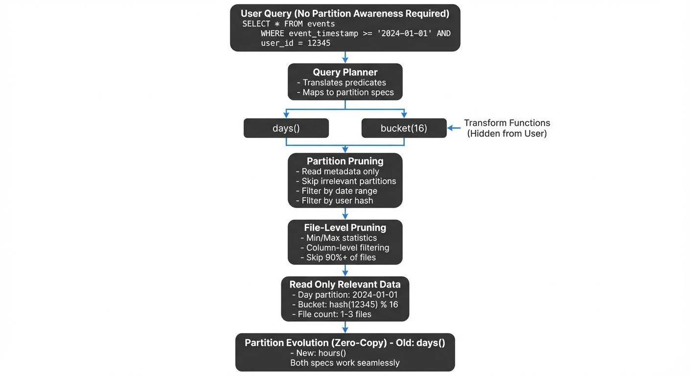

Apache Iceberg revolutionizes how modern data platforms handle partitioning by introducing hidden partitioning and partition evolution capabilities. Unlike traditional table formats that expose partitioning as part of the schema and require users to manually manage partition predicates, Iceberg abstracts partitioning away from queries while maintaining exceptional performance. This article explores advanced partitioning strategies, performance optimization techniques, and practical implementations for data engineers building high-performance data lakehouses.

For foundational concepts about Iceberg's role in modern data architectures, see [Introduction to Lakehouse Architecture](https://conduktor.io/glossary/introduction-to-lakehouse-architecture).



<!-- ORIGINAL_DIAGRAM
```
┌──────────────────────────────────────────────────────────────────┐
│       Iceberg Hidden Partitioning & Query Optimization           │
└──────────────────────────────────────────────────────────────────┘

User Query (No Partition Awareness Required)
       │
       ▼
SELECT * FROM events
WHERE event_timestamp >= '2024-01-01'
  AND user_id = 12345
       │
       ▼
┌──────────────────────────┐
│ Query Planner            │
│ - Translates predicates  │
│ - Maps to partition specs│
└──────────────────────────┘
       │
   ┌───┴────┐
   ▼        ▼
days()   bucket(16)   ← Transform Functions (Hidden from User)
   │        │
   ▼        ▼
┌─────────────────────────────┐
│ Partition Pruning           │
│ - Read metadata only        │
│ - Skip irrelevant partitions│
│ - Filter by date range      │
│ - Filter by user hash       │
└─────────────────────────────┘
       │
       ▼
┌─────────────────────────────┐
│ File-Level Pruning          │
│ - Min/Max statistics        │
│ - Column-level filtering    │
│ - Skip 90%+ of files        │
└─────────────────────────────┘
       │
       ▼
┌─────────────────────────────┐
│ Read Only Relevant Data     │
│ - Day partition: 2024-01-01 │
│ - Bucket: hash(12345) % 16  │
│ - File count: 1-3 files     │
└─────────────────────────────┘
       │
       ▼
┌─────────────────────────────┐
│ Partition Evolution (Zero-  │
│ Copy) - Old: days()         │
│      - New: hours()         │
│ Both specs work seamlessly  │
└─────────────────────────────┘
```
-->

## Understanding Hidden Partitioning

Hidden partitioning is one of Iceberg's most powerful features, fundamentally changing how users interact with partitioned tables. In traditional systems like Hive, users must include partition columns in their WHERE clauses to benefit from partition pruning. For example, a Hive table partitioned by date requires queries like `WHERE date_partition = '2024-01-01'`, forcing users to know and manage the partitioning scheme. This creates brittle queries that break when partition strategies evolve.

Iceberg eliminates this requirement by maintaining partition metadata separately from the table schema. Users query against the original columns, and Iceberg's metadata layer automatically translates predicates into efficient partition filters—without requiring any partition awareness in the query.

When you partition an Iceberg table by `day(timestamp)` or `bucket(user_id, 16)`, users query the original columns without knowing the partitioning strategy:

```sql
-- Create table with hidden partitioning
CREATE TABLE events (
  event_id BIGINT,
  user_id BIGINT,
  event_timestamp TIMESTAMP,
  event_type STRING
)
PARTITIONED BY (days(event_timestamp), bucket(user_id, 16));

-- Query using original columns - partitioning is automatic
SELECT * FROM events
WHERE event_timestamp >= '2024-01-01'
  AND user_id = 12345;
```

Iceberg's query planner automatically translates predicates on `event_timestamp` and `user_id` into partition filters, reading only the relevant data files. This abstraction allows partition strategies to evolve without breaking existing queries.

## Partition Transform Functions

Iceberg provides built-in transform functions that derive partition values from column data without storing redundant information:

**Temporal Transforms:**
- `years(timestamp)` - Partition by year
- `months(timestamp)` - Partition by month
- `days(timestamp)` - Partition by day
- `hours(timestamp)` - Partition by hour

**Bucketing and Truncation:**
- `bucket(N, col)` - Hash partition into N buckets
- `truncate(width, col)` - Truncate strings or numbers to width

These transforms ensure partition values are derived at write time and stored only in metadata, not duplicated in data files.

```sql
-- Example: Multi-dimensional partitioning
CREATE TABLE user_activity (
  user_id BIGINT,
  session_id STRING,
  activity_time TIMESTAMP,
  region STRING,
  activity_data STRING
)
PARTITIONED BY (
  days(activity_time),
  truncate(2, region),
  bucket(user_id, 32)
);
```

This strategy enables efficient queries across time ranges, geographic regions, and specific users without scanning unnecessary data.

## 2025 Performance Improvements (Iceberg 1.5+)

Recent Iceberg releases have introduced significant performance enhancements that improve partitioning and query optimization:

### Position Delete Performance (Iceberg 1.5)

Iceberg 1.5 introduced optimized position delete handling that dramatically improves performance for tables with row-level deletes. Position delete files now support better pruning and compaction:

```sql
-- Position deletes are now more efficient for partitioned tables
DELETE FROM events
WHERE event_timestamp = '2024-06-15'
  AND event_type = 'duplicate';
```

Previously, position deletes could impact query performance across all partitions. The 1.5 optimization ensures delete files are partition-aware, allowing query engines to skip entire partitions containing no deletes.

### Advanced Statistics Collection (Iceberg 1.6+)

Iceberg 1.6 enhanced statistics collection to include:
- **Column-level null counts** for better predicate pushdown
- **Distinct value estimates** using HyperLogLog sketches
- **Bloom filters** for high-cardinality columns (optional)

Enable enhanced statistics during table creation:

```sql
CREATE TABLE enhanced_events (
  user_id BIGINT,
  event_data STRING,
  event_timestamp TIMESTAMP
)
PARTITIONED BY (days(event_timestamp))
TBLPROPERTIES (
  'write.metadata.metrics.column.user_id'='full',
  'write.metadata.metrics.column.event_data'='counts'
);
```

### REST Catalog Standard

The REST catalog has become the recommended catalog implementation for 2025 deployments. Unlike Hive Metastore or AWS Glue, REST catalogs provide:
- **Standardized API** across all Iceberg implementations
- **Better scalability** for high-concurrency workloads
- **Multi-table transactions** for atomic operations across tables
- **Built-in credential vending** for secure data access

For catalog management details, see [Iceberg Catalog Management: Hive, Glue, and Nessie](https://conduktor.io/glossary/iceberg-catalog-management-hive-glue-and-nessie), which now includes REST catalog patterns alongside traditional implementations.

## Partition Evolution

Partition evolution allows you to change partitioning strategies as data volumes grow or query patterns shift, without rewriting existing data. This capability is critical for production systems where initial partition designs may become suboptimal over time.

```sql
-- Initial partitioning by day
CREATE TABLE metrics (
  metric_id BIGINT,
  timestamp TIMESTAMP,
  value DOUBLE
)
PARTITIONED BY (days(timestamp));

-- Later: evolve to hourly partitioning for recent data
ALTER TABLE metrics
DROP PARTITION FIELD days(timestamp);

ALTER TABLE metrics
ADD PARTITION FIELD hours(timestamp);
```

After evolution, Iceberg maintains metadata about which data files use which partition spec. The query planner considers all partition specs when pruning files, ensuring optimal performance across both old and new data.

**Performance Impact:**
- Old data remains partitioned by day
- New data writes use hourly partitioning
- Queries automatically leverage both schemes
- No data rewrite required

This zero-copy evolution enables continuous optimization without expensive migration operations.

## Query Optimization Techniques

### Partition Pruning

Iceberg's advanced metadata layer enables aggressive partition pruning. The table metadata stores min/max statistics for each partition, allowing the query engine to skip entire partitions before reading any data files. For detailed coverage of how Iceberg's metadata architecture supports this functionality, see [Iceberg Table Architecture: Metadata and Snapshots](https://conduktor.io/glossary/iceberg-table-architecture-metadata-and-snapshots).

```sql
-- Partition pruning with range predicate
SELECT COUNT(*) FROM events
WHERE event_timestamp BETWEEN '2024-06-01' AND '2024-06-30';
```

For a table partitioned by `days(event_timestamp)`, Iceberg:
1. Reads partition metadata from manifest files
2. Filters to partitions overlapping June 2024 (30 partitions)
3. Skips all other partitions entirely
4. Within selected partitions, applies file-level pruning using min/max stats

### File-Level Statistics

Beyond partition pruning, Iceberg maintains column statistics at the data file level. This enables file pruning even within partitions:

```sql
-- File pruning within partitions
SELECT * FROM events
WHERE event_timestamp = '2024-06-15'
  AND event_type = 'purchase';
```

Iceberg prunes to:
1. Single partition (June 15)
2. Files where min/max values for `event_type` include 'purchase'
3. Potentially 90%+ reduction in data scanned

### Small Files Problem

Over-partitioning creates small files that degrade query performance. Iceberg provides several solutions:

**Bin-Packing During Writes:**

Bin-packing is a compaction strategy that groups small files together into optimally-sized files (similar to packing small boxes into larger shipping containers). This happens automatically during writes or through explicit compaction operations.
```sql
-- Configure target file size
ALTER TABLE events SET TBLPROPERTIES (
  'write.target-file-size-bytes'='536870912'  -- 512MB
);
```

**Periodic Compaction:**
```sql
-- Trigger compaction using REWRITE FILES
CALL catalog.system.rewrite_data_files(
  table => 'events',
  strategy => 'bin-pack',
  options => map('target-file-size-bytes', '536870912')
);
```

**Performance Comparison:**

| Metric | Before Compaction | After Compaction |
|--------|------------------|------------------|
| Avg File Size | 8 MB | 512 MB |
| Files per Partition | 64 | 1 |
| Query Scan Time | 45 sec | 3 sec |
| Metadata Read Time | 2 sec | 0.1 sec |

For comprehensive coverage of compaction strategies, snapshot expiration, and orphan file cleanup, see [Maintaining Iceberg Tables: Compaction and Cleanup](https://conduktor.io/glossary/maintaining-iceberg-tables-compaction-and-cleanup).

## Streaming Ecosystem Integration

Iceberg's partitioning integrates seamlessly with streaming platforms, enabling real-time data ingestion with optimal partition layouts. For broader patterns on streaming data to lakehouse formats, see [Streaming to Lakehouse Tables: Delta Lake, Iceberg, and Hudi](https://conduktor.io/glossary/streaming-to-lakehouse-tables).

### Apache Kafka with Iceberg

Streaming writes from Kafka to Iceberg require careful partition strategy design. Kafka's high-throughput nature can create small files if not managed properly:

```sql
-- Optimal partitioning for streaming data
CREATE TABLE kafka_events (
  event_key STRING,
  event_value STRING,
  event_timestamp TIMESTAMP,
  kafka_partition INT,
  kafka_offset BIGINT
)
PARTITIONED BY (hours(event_timestamp));
```

**Best Practices:**
- Use hourly partitioning for streaming data (balances file size and query granularity)
- Enable auto-compaction in streaming jobs
- Configure writers to buffer data before committing
- Monitor partition cardinality to avoid over-partitioning

### Governance and Visibility with Conduktor

As Iceberg tables receive streaming data from Kafka, maintaining visibility into data lineage, partition health, and query patterns becomes critical. Conduktor provides comprehensive governance capabilities for Kafka-to-Iceberg pipelines:

- **Pipeline monitoring**: Track data flow from Kafka topics to Iceberg tables with real-time throughput and lag metrics
- **Data lineage visualization**: Map relationships between Kafka topics, consumer groups, and target Iceberg partitions
- **Schema compatibility validation**: Ensure schema evolution in Kafka producers maintains compatibility with Iceberg partition specs
- **Partition health metrics**: Monitor partition growth, file sizes, and compaction needs across streaming ingestion pipelines
- **Access audit logs**: Track which teams and applications write to Iceberg tables for compliance and optimization

For streaming pipelines where Kafka feeds Iceberg tables, Conduktor's unified observability ensures partition strategies remain optimal as data volumes scale.

### Flink and Spark Streaming

Both Flink and Spark provide native Iceberg connectors with partition-aware writing:

```python
# Spark Structured Streaming to Iceberg
df.writeStream \
  .format("iceberg") \
  .outputMode("append") \
  .option("fanout-enabled", "true") \
  .option("target-file-size-bytes", "536870912") \
  .partitionBy("days(event_timestamp)") \
  .toTable("events")
```

The `fanout-enabled` option prevents writer contention when multiple tasks write to the same partition simultaneously. Without fanout mode, concurrent writers to a partition compete to update the same manifest files, causing retries and reduced throughput. Fanout mode creates separate data files per writer, eliminating contention—critical for high-throughput streaming where hundreds of Spark tasks may write to a single time-based partition concurrently.

## Advanced Partition Strategies

### Time-Based Partitioning Evolution

For time-series data, partition granularity should match data volume. A table might start with daily partitions but evolve to hourly as data grows:

**Strategy:**
- Days 0-90: Hourly partitions (recent data, high query frequency)
- Days 91-365: Daily partitions (medium-age data)
- Days 365+: Monthly partitions (archive data, rare queries)

Implement with partition evolution:

```sql
-- Initial: hourly
PARTITIONED BY (hours(timestamp));

-- After 90 days: add daily partitioning for new data
ALTER TABLE metrics ADD PARTITION FIELD days(timestamp);
ALTER TABLE metrics DROP PARTITION FIELD hours(timestamp);
```

### Multi-Dimensional Partitioning

Combine temporal and bucketing transforms for multi-access-pattern tables:

```sql
CREATE TABLE user_events (
  user_id BIGINT,
  event_time TIMESTAMP,
  event_data STRING
)
PARTITIONED BY (days(event_time), bucket(user_id, 128));
```

This supports both:
- Time-range queries: `WHERE event_time >= '2024-01-01'`
- User-specific queries: `WHERE user_id = 12345`
- Combined queries with maximum pruning

**Performance Consideration:**
Avoid excessive partition dimensions. Each additional dimension multiplicatively increases partition count. A table with 365 days × 128 buckets = 46,720 partitions may create too many small files. Why is this problematic? Each partition needs enough data to fill reasonable file sizes (128MB+). With 46,720 partitions, you'd need 6TB of data just to have one 128MB file per partition. Lower-volume tables with high partition counts end up with thousands of tiny files, dramatically increasing metadata overhead and query planning time.

## Performance Tuning Checklist

1. **Choose appropriate partition granularity:**
   - High-volume tables: Hourly or bucket-based
   - Medium-volume: Daily
   - Low-volume: Monthly or no partitioning

2. **Monitor file sizes:**
   - Target 128MB - 1GB per file
   - Use compaction for files < 100MB
   - Split large files if necessary

3. **Leverage partition evolution:**
   - Start coarse, refine as data grows
   - Archive old data to less granular partitions

4. **Enable metadata caching:**
   - Configure catalog caching for manifest files
   - Reduces query planning overhead

5. **Use column statistics:**
   - Ensure statistics collection is enabled
   - Prunes files beyond partition-level filtering

6. **Test query patterns:**
   - Analyze query execution plans
   - Verify partition and file pruning effectiveness

## Related Concepts

- [Real-Time Analytics with Streaming Data](/real-time-analytics-with-streaming-data)
- [Data Pipeline Orchestration with Streaming](/data-pipeline-orchestration-with-streaming)
- [Kafka Connect: Building Data Integration Pipelines](/kafka-connect-building-data-integration-pipelines)

## Summary

Apache Iceberg's partitioning capabilities provide unmatched flexibility and performance for modern data lakehouses. Hidden partitioning abstracts partition management from users while maintaining optimal query performance. Partition evolution enables zero-copy migration as data patterns change. Advanced metadata tracking enables aggressive pruning at both partition and file levels.

For data engineers, the key is balancing partition granularity with file sizes, leveraging transform functions to match access patterns, and monitoring partition health over time. Integration with streaming platforms like Kafka requires careful configuration to prevent small file proliferation while maintaining low latency.

The combination of Iceberg's technical capabilities with governance tools provides the complete stack needed for production-grade data lakehouse platforms that scale from gigabytes to petabytes while maintaining query performance.

## Sources and References

1. **Apache Iceberg Documentation - Partitioning**
   https://iceberg.apache.org/docs/latest/partitioning/

2. **Apache Iceberg - Partition Evolution**
   https://iceberg.apache.org/docs/latest/evolution/#partition-evolution

3. **Apache Iceberg - Performance Tuning**
   https://iceberg.apache.org/docs/latest/performance/

4. **Netflix Tech Blog - Iceberg at Netflix**
   https://netflixtechblog.com/netflix-data-mesh-composable-data-processing-c88b9e30f6e0

5. **Tabular - Iceberg Best Practices**
   https://tabular.io/blog/partitioning-best-practices/

6. **Apache Flink - Iceberg Connector**
   https://nightlies.apache.org/flink/flink-docs-stable/docs/connectors/table/iceberg/

