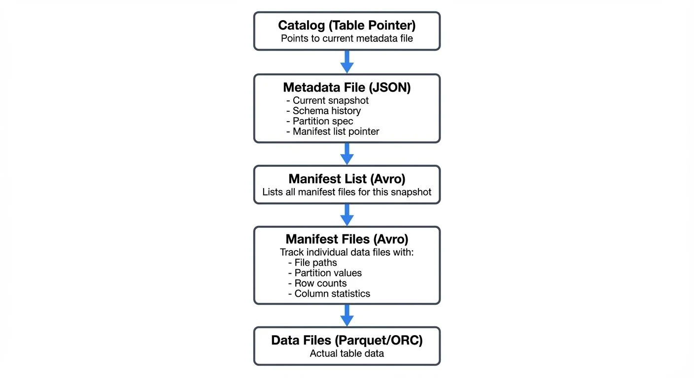

# Iceberg Table Architecture: Metadata and Snapshots

Apache Iceberg has emerged as a leading table format for data lakehouses, addressing fundamental limitations in traditional data lake architectures. At its core, Iceberg's power comes from its sophisticated metadata layer that enables ACID transactions, snapshot isolation, and schema evolution—capabilities previously available only in proprietary data warehouses.

This article explores Iceberg's architectural components, focusing on how metadata layers and snapshots work together to provide reliable, scalable data management for modern data platforms.

For a broader overview of Iceberg's features and ecosystem, see [Apache Iceberg](https://conduktor.io/glossary/apache-iceberg). For practical catalog implementation guidance, refer to [Iceberg Catalog Management: Hive, Glue, and Nessie](https://conduktor.io/glossary/iceberg-catalog-management-hive-glue-and-nessie).

## The Three-Layer Metadata Architecture

Iceberg's architecture is built on three distinct metadata layers that work together to track table state and data files:



<!-- ORIGINAL_DIAGRAM
```
┌─────────────────────────────────────┐
│     Catalog (Table Pointer)         │
│  Points to current metadata file    │
└──────────────┬──────────────────────┘
               │
               ▼
┌─────────────────────────────────────┐
│      Metadata File (JSON)           │
│  - Current snapshot                 │
│  - Schema history                   │
│  - Partition spec                   │
│  - Manifest list pointer            │
└──────────────┬──────────────────────┘
               │
               ▼
┌─────────────────────────────────────┐
│      Manifest List (Avro)           │
│  Lists all manifest files for       │
│  this snapshot                      │
└──────────────┬──────────────────────┘
               │
               ▼
┌─────────────────────────────────────┐
│      Manifest Files (Avro)          │
│  Track individual data files with:  │
│  - File paths                       │
│  - Partition values                 │
│  - Row counts                       │
│  - Column statistics                │
└──────────────┬──────────────────────┘
               │
               ▼
┌─────────────────────────────────────┐
│      Data Files (Parquet/ORC)       │
│  Actual table data                  │
└─────────────────────────────────────┘
```
-->

### Catalog Layer

The catalog serves as the entry point to an Iceberg table, maintaining a pointer to the current metadata file. The catalog's atomic update mechanism ensures only one metadata file is considered "current," preventing split-brain scenarios during concurrent writes.

**Modern Catalog Implementations (2025)**:

Since Iceberg 1.5, the **REST Catalog** has emerged as the standard for cloud-native deployments. Unlike traditional catalogs that depend on Hive Metastore or cloud-specific services, REST Catalog provides a vendor-neutral HTTP API for catalog operations:

```properties
# Modern REST Catalog configuration
catalog-impl=org.apache.iceberg.rest.RESTCatalog
uri=https://catalog.example.com
credential=<token>
warehouse=s3://my-warehouse/
```

REST Catalog advantages include:
- **Vendor neutrality**: Works across any cloud or on-premises infrastructure
- **Multi-tenancy**: Built-in namespace isolation for different teams
- **Fine-grained security**: OAuth2/token-based authentication and authorization
- **Simplified operations**: No external metastore dependencies to manage

Other catalog options remain available for specific use cases:
- **Hive Metastore**: Legacy compatibility for existing Hadoop ecosystems
- **AWS Glue**: Native AWS integration with IAM-based access control
- **Nessie**: Git-like versioning for data with multi-table transactions
- **JDBC Catalog**: Lightweight option using relational databases

### Metadata Files

Each metadata file is a JSON document containing:

- **Current snapshot reference**: Points to the active table state
- **Snapshot history**: List of all previous snapshots with timestamps
- **Schema**: Current and historical table schemas
- **Partition spec**: How the table is partitioned (supports evolution)
- **Sort order**: Optional ordering specification for data optimization
- **Table properties**: Configuration and operational metadata

Metadata files are immutable and versioned. Each write operation creates a new metadata file, enabling time travel to any previous table state.

### Manifest Lists and Manifest Files

The manifest list (Avro format) contains references to all manifest files for a given snapshot. Each manifest file tracks a subset of data files along with:

- **File-level statistics**: Row counts, column bounds (min/max values), null counts, and distinct value counts
- **Partition values**: For partitioned tables, the partition key-value pairs for each file
- **File metadata**: File size, format (Parquet/ORC/Avro), file paths in object storage

**Advanced Statistics with Puffin Files (Iceberg 1.4+)**:

Since Iceberg 1.4, the **Puffin file format** enables storage of advanced statistics that go beyond simple min/max bounds:

- **Theta sketches**: Probabilistic cardinality estimation for high-cardinality columns
- **Bloom filters**: Membership testing to skip files that definitely don't contain a value
- **NDV (Number of Distinct Values)**: Accurate distinct counts for query optimization
- **Histogram data**: Value distribution information for cost-based optimization

```sql
-- Query engines automatically use Puffin statistics when available
SELECT DISTINCT user_id FROM events
WHERE user_id = 'abc123';  -- Bloom filter eliminates non-matching files

SELECT COUNT(DISTINCT user_id) FROM events;  -- Uses Theta sketch for estimation
```

Puffin files are referenced in the manifest list and stored separately from manifest files, allowing statistics to be updated independently of the core metadata structure.

This hierarchical structure enables efficient query planning. Engines can read manifest files and Puffin statistics to determine which data files are relevant for a query without scanning the entire dataset—a critical optimization for large tables with millions of files.

## Snapshot Isolation and ACID Transactions

Snapshots are the cornerstone of Iceberg's transactional guarantees. Each snapshot represents an immutable, consistent view of the table at a specific point in time.

### How Snapshots Work

When a write operation occurs:

1. New data files are written to object storage
2. New manifest files are created describing these data files
3. A new manifest list aggregates all relevant manifests
4. A new metadata file is created with updated snapshot information
5. The catalog pointer is atomically updated to the new metadata file

If the atomic catalog update fails (due to concurrent modification), the write operation is retried with the latest table state, ensuring **serializable isolation**—the highest level of transaction isolation where concurrent operations appear to execute sequentially, preventing anomalies like dirty reads or lost updates.

### Snapshot Benefits

**Time Travel**: Query historical table states by specifying a snapshot ID or timestamp:

```sql
SELECT * FROM orders
FOR SYSTEM_TIME AS OF '2025-01-15 10:00:00';
```

For detailed time travel patterns and use cases, see [Time Travel with Apache Iceberg](https://conduktor.io/glossary/time-travel-with-apache-iceberg).

**Rollback**: Revert to previous snapshots instantly without data movement:

```sql
CALL catalog.system.rollback_to_snapshot('orders', 12345678901234);
```

**Incremental Processing**: Read only changes between snapshots for efficient ETL:

```sql
SELECT * FROM orders
FOR SYSTEM_VERSION AS OF 100
WHERE _iceberg_snapshot_id > 99;
```

### Branching and Tagging (Iceberg 1.5+)

Iceberg 1.5 introduced **branches** and **tags** for managing multiple table versions simultaneously—think of them as Git branches for your data:

```sql
-- Create a branch for experimental changes
ALTER TABLE orders CREATE BRANCH IF NOT EXISTS experimental;

-- Write to a specific branch
INSERT INTO orders.branch_experimental
VALUES (12345, 'customer@example.com', 599.99, CURRENT_TIMESTAMP);

-- Create a tag to mark an important snapshot (e.g., end of quarter)
ALTER TABLE orders CREATE TAG IF NOT EXISTS q1_2025_snapshot;

-- Query from a branch
SELECT * FROM orders VERSION AS OF 'experimental';

-- Query from a tag
SELECT * FROM orders VERSION AS OF 'q1_2025_snapshot';

-- Fast-forward main branch to experimental after testing
CALL catalog.system.fast_forward('orders', 'main', 'experimental');
```

**Use Cases for Branches**:
- **Isolated testing**: Test schema changes, data migrations, or quality rules without affecting production queries
- **Staging environments**: Create `dev`, `staging`, and `prod` branches within the same table
- **A/B testing**: Compare different data transformation approaches on branches before merging
- **Data science experimentation**: Allow data scientists to experiment with feature engineering on separate branches

**Use Cases for Tags**:
- **Compliance snapshots**: Tag end-of-period snapshots for regulatory retention
- **Rollback points**: Mark known-good states before risky operations
- **Reproducibility**: Tag data versions used for model training or reports
- **Audit trails**: Immutable references to historical data states

Each branch maintains its own snapshot lineage and can have independent retention policies, making branches ideal for data engineering workflows that need production isolation.

## Schema Evolution and Partition Evolution

Unlike traditional formats, Iceberg supports safe schema and partition evolution without requiring full table rewrites.

### Schema Evolution

Iceberg tracks schema changes with unique field IDs that remain constant even when columns are renamed or reordered. Supported operations include:

- Add columns (anywhere in the schema)
- Drop columns
- Rename columns
- Update column types (with compatible promotions)
- Reorder columns

Each schema change creates a new schema version in the metadata file, but existing data files remain valid. Query engines use the schema evolution history to correctly read older files.

For comprehensive schema evolution patterns, best practices, and migration strategies, see [Schema Evolution in Apache Iceberg](https://conduktor.io/glossary/schema-evolution-in-apache-iceberg).

### Partition Evolution

Partition specifications can evolve over time. For example, you might start with daily partitioning and later switch to hourly:

```sql
-- Initial partition spec
ALTER TABLE events
SET PARTITION SPEC (day(event_time));

-- Evolve to hourly partitioning
ALTER TABLE events
SET PARTITION SPEC (hour(event_time));
```

Iceberg maintains partition evolution history, ensuring queries correctly apply partition filters regardless of when data was written. For detailed partitioning strategies and performance optimization techniques, see [Iceberg Partitioning and Performance Optimization](https://conduktor.io/glossary/iceberg-partitioning-and-performance-optimization).

## Metadata Tables for Operational Monitoring

Iceberg exposes internal metadata through queryable **metadata tables**, enabling operational insights without external tools:

```sql
-- View snapshot history
SELECT snapshot_id, parent_id, timestamp_ms, operation, summary
FROM orders.snapshots
ORDER BY timestamp_ms DESC
LIMIT 10;

-- Inspect all data files in current snapshot
SELECT file_path, file_format, record_count, file_size_in_bytes,
       partition, value_counts, null_value_counts, lower_bounds, upper_bounds
FROM orders.files
WHERE file_size_in_bytes > 100000000;  -- Files larger than 100MB

-- Analyze manifest files
SELECT path, length, partition_spec_id, added_snapshot_id, added_data_files_count
FROM orders.manifests
ORDER BY added_snapshot_id DESC;

-- Review table history (all changes)
SELECT made_current_at, snapshot_id, is_current_ancestor
FROM orders.history
WHERE made_current_at > CURRENT_TIMESTAMP - INTERVAL '7' DAY;

-- Check partition statistics
SELECT partition, record_count, file_count, spec_id
FROM orders.partitions
WHERE record_count > 1000000;  -- High-volume partitions
```

**Common Operational Use Cases**:

- **Performance monitoring**: Identify small files that need compaction
- **Cost analysis**: Track data file growth and storage costs by partition
- **Debugging**: Investigate snapshot lineage and failed operations
- **Capacity planning**: Analyze partition distribution and file count trends
- **Compliance**: Query snapshot history for audit trails

Metadata tables integrate seamlessly with BI tools and monitoring dashboards, providing observability into Iceberg's internal state.

## Streaming Ecosystem Integration

Iceberg's architecture is well-suited for streaming data ingestion, providing exactly-once semantics and low-latency visibility of new data. For architectural patterns and best practices for streaming ingestion, see [Streaming Ingestion to Lakehouse](https://conduktor.io/glossary/streaming-ingestion-to-lakehouse) and [Streaming to Lakehouse Tables](https://conduktor.io/glossary/streaming-to-lakehouse-tables).

### Kafka and Flink Integration

Apache Flink (1.18+) provides native Iceberg sink connectors that leverage snapshots for exactly-once processing:

```java
// Modern Flink 1.18+ with Iceberg connector
StreamExecutionEnvironment env = StreamExecutionEnvironment.getExecutionEnvironment();

// Enable checkpointing for exactly-once guarantees
env.enableCheckpointing(60000, CheckpointingMode.EXACTLY_ONCE);
env.getCheckpointConfig().setMinPauseBetweenCheckpoints(30000);

// Configure Kafka source
KafkaSource<RowData> kafkaSource = KafkaSource.<RowData>builder()
    .setBootstrapServers("localhost:9092")
    .setTopics("events-topic")
    .setGroupId("flink-iceberg-sink")
    .setDeserializer(new RowDataDeserializationSchema())
    .setStartingOffsets(OffsetsInitializer.latest())
    .build();

DataStream<RowData> stream = env.fromSource(
    kafkaSource,
    WatermarkStrategy.forBoundedOutOfOrderness(Duration.ofSeconds(5)),
    "Kafka Source"
);

// Configure Iceberg catalog and table
Configuration config = new Configuration();
config.setString("type", "iceberg");
config.setString("catalog-type", "rest");
config.setString("uri", "http://catalog.example.com");
config.setString("warehouse", "s3://bucket/warehouse/");

TableLoader tableLoader = TableLoader.fromCatalog(
    CatalogLoader.rest("rest_catalog", config, new HashMap<>()),
    TableIdentifier.of("default", "events")
);

// Write to Iceberg with modern API
FlinkSink.forRowData(stream)
    .tableLoader(tableLoader)
    .equalityFieldColumns(Arrays.asList("event_id"))  // Upsert mode
    .upsert(true)  // Enable upserts for CDC patterns
    .distributionMode(DistributionMode.HASH)
    .writeParallelism(4)
    .build();

env.execute("Kafka to Iceberg Pipeline");
```

Each Flink checkpoint triggers an Iceberg commit, creating a new snapshot. If the job fails and restarts from a checkpoint, Iceberg's atomic commits prevent duplicate data.

### Streaming Read Patterns

Iceberg supports streaming reads through incremental snapshots:

- **Micro-batch streaming**: Poll for new snapshots at regular intervals
- **Continuous streaming**: Subscribe to catalog notifications for new commits
- **CDC patterns**: Use row-level deletes and position deletes for change data capture (see [Implementing CDC with Debezium](https://conduktor.io/glossary/implementing-cdc-with-debezium) for CDC to Iceberg patterns)

Tools like Apache Flink, Apache Spark Structured Streaming, and Kafka Connect can consume Iceberg tables incrementally, enabling real-time analytics pipelines.

### Governance and Visibility

When building streaming pipelines with Iceberg, data governance becomes critical. **Conduktor** provides comprehensive visibility and governance for Kafka-to-Iceberg pipelines:

- **Data lineage tracking**: Trace data flow from Kafka topics through transformations to Iceberg snapshots
- **Schema compatibility monitoring**: Validate that Kafka producer schemas match Iceberg table schemas before commits
- **Data quality enforcement**: Apply validation rules and quality checks before data reaches Iceberg tables
- **Access auditing**: Track which consumers (streaming and batch) access Iceberg tables and at what snapshot versions
- **Performance monitoring**: Monitor Flink checkpoint durations, Iceberg commit latency, and snapshot growth rates
- **Chaos testing with Conduktor Gateway**: Test pipeline resilience by simulating Kafka failures, slow brokers, or network partitions

This governance layer ensures that the flexibility of Iceberg's architecture doesn't compromise data quality or compliance requirements in production streaming environments.

## Metadata Optimization and Maintenance

While Iceberg's metadata architecture provides powerful capabilities, it requires periodic maintenance to prevent metadata bloat. For comprehensive maintenance procedures and strategies, see [Maintaining Iceberg Tables: Compaction and Cleanup](https://conduktor.io/glossary/maintaining-iceberg-tables-compaction-and-cleanup).

### Snapshot Expiration

Old snapshots should be periodically expired to remove unreferenced data and manifest files:

```sql
CALL catalog.system.expire_snapshots(
    table => 'orders',
    older_than => TIMESTAMP '2025-01-01 00:00:00',
    retain_last => 100
);
```

This operation:
- Removes metadata files for expired snapshots
- Deletes unreferenced manifest files
- Marks unreferenced data files for deletion (actual deletion happens during orphan file cleanup)

### Manifest File Compaction

As tables accumulate many small manifest files, query planning can slow down. Manifest compaction consolidates small manifests:

```sql
CALL catalog.system.rewrite_manifests('orders');
```

### Orphan File Cleanup

Failed writes can leave orphaned data files. Periodic cleanup removes these files:

```sql
CALL catalog.system.remove_orphan_files(
    table => 'orders',
    older_than => TIMESTAMP '2025-01-01 00:00:00'
);
```

### Metadata Caching

Query engines cache manifest files and statistics to avoid repeated reads. Understanding cache behavior is crucial for performance tuning in high-throughput environments.

## Performance Considerations

Iceberg's metadata architecture directly impacts query performance:

**Partition Pruning**: Manifest files contain partition statistics, enabling engines to skip entire manifests during query planning.

**Column Statistics**: Min/max values and null counts allow predicate pushdown without reading data files.

**Manifest Filtering**: When only specific partitions are modified, Iceberg reuses unchanged manifest files across snapshots, reducing metadata overhead.

**Vectorized Reads**: Manifest files in Avro format support efficient vectorized reading for large-scale query planning.

For large tables (billions of rows, millions of files), proper partition design and regular metadata maintenance are essential for maintaining sub-second query planning.

## Summary

Apache Iceberg's metadata architecture represents a fundamental shift in how data lakes handle table semantics. By separating metadata into distinct layers—catalog, metadata files, manifest lists, and manifest files—Iceberg provides:

- **ACID transactions** through atomic catalog updates and immutable snapshots
- **Snapshot isolation** enabling time travel and concurrent read/write workloads
- **Schema and partition evolution** without data rewrites
- **Efficient query planning** through hierarchical metadata and statistics
- **Streaming integration** with exactly-once semantics for real-time pipelines

Understanding these architectural components is essential for data engineers building modern data platforms. The metadata layer isn't just an implementation detail—it's the foundation that enables Iceberg to deliver warehouse-like reliability on data lake infrastructure.

As organizations adopt streaming-first architectures with tools like Kafka and Flink, Iceberg's snapshot model provides the transactional guarantees needed for production-grade real-time analytics.

## Related Concepts

- [Kafka Connect: Building Data Integration Pipelines](/kafka-connect-building-data-integration-pipelines)
- [What is Change Data Capture: CDC Fundamentals](/what-is-change-data-capture-cdc-fundamentals)
- [Data Lineage: Tracking Data from Source to Consumption](/data-lineage-tracking-data-from-source-to-consumption)

**Related Articles**:
- [Apache Iceberg](https://conduktor.io/glossary/apache-iceberg) - Comprehensive overview of Iceberg features
- [Time Travel with Apache Iceberg](https://conduktor.io/glossary/time-travel-with-apache-iceberg) - Advanced time travel patterns
- [Schema Evolution in Apache Iceberg](https://conduktor.io/glossary/schema-evolution-in-apache-iceberg) - Schema evolution best practices
- [Iceberg Partitioning and Performance Optimization](https://conduktor.io/glossary/iceberg-partitioning-and-performance-optimization) - Partitioning strategies
- [Maintaining Iceberg Tables: Compaction and Cleanup](https://conduktor.io/glossary/maintaining-iceberg-tables-compaction-and-cleanup) - Maintenance procedures
- [Iceberg Catalog Management: Hive, Glue, and Nessie](https://conduktor.io/glossary/iceberg-catalog-management-hive-glue-and-nessie) - Catalog implementations
- [Streaming Ingestion to Lakehouse](https://conduktor.io/glossary/streaming-ingestion-to-lakehouse) - Streaming architecture patterns
- [Implementing CDC with Debezium](https://conduktor.io/glossary/implementing-cdc-with-debezium) - CDC to Iceberg integration

## Sources and References

- [Apache Iceberg Official Documentation - Table Spec](https://iceberg.apache.org/spec/)
- [Apache Iceberg Official Documentation - Metadata](https://iceberg.apache.org/docs/latest/metadata/)
- [Netflix Technology Blog - Iceberg: A Fast Table Format](https://netflixtechblog.com/iceberg-tables-turning-the-database-inside-out-11e8b91f5677)
- [Apache Flink Documentation - Iceberg Connector](https://nightlies.apache.org/flink/flink-docs-master/docs/connectors/table/iceberg/)
- [Tabular Blog - Understanding Iceberg Snapshots](https://tabular.io/blog/how-iceberg-snapshots-work/)
- [Dremio Blog - Iceberg Metadata Optimization](https://www.dremio.com/blog/apache-iceberg-metadata-optimization/)
