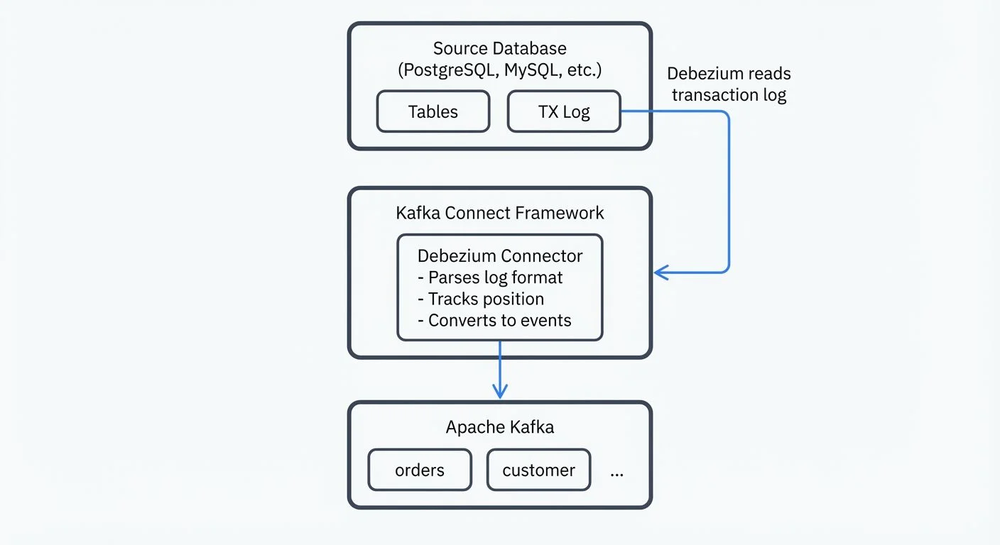

# Implementing CDC with Debezium

Change Data Capture (CDC) has become a foundational pattern for modern data architectures, enabling real-time data streaming from operational databases to downstream systems. Debezium, an open-source distributed platform built on Apache Kafka Connect, provides a robust solution for implementing CDC across various database systems.

This guide walks through the practical aspects of implementing CDC with Debezium, from understanding the underlying mechanisms to configuring connectors and integrating with the broader data streaming ecosystem. For foundational CDC concepts and architecture patterns, see [What is Change Data Capture (CDC) Fundamentals](https://conduktor.io/glossary/what-is-change-data-capture-cdc-fundamentals).

## Understanding Debezium's CDC Approach

Debezium captures row-level changes from database transaction logs rather than querying tables directly. This log-based approach offers several advantages: minimal impact on source database performance, capture of all change types (inserts, updates, deletes), and preservation of the exact order of operations.

When a database transaction commits, the changes are first written to the transaction log (also called write-ahead log or WAL - these terms are used interchangeably throughout database systems). Debezium connectors read these logs, parse the binary format, and convert change events into structured messages that flow through Kafka topics. Each table typically maps to a dedicated topic, with each message representing a single row change.

**Key Terminology:**
- **Transaction Log / WAL (Write-Ahead Log)**: The database's internal log recording all changes before they're committed to disk. Used for crash recovery and replication.
- **Replication Slot**: A persistent position marker in the transaction log (PostgreSQL-specific) that prevents the database from discarding log data before Debezium processes it.
- **Offset**: Debezium's position tracking mechanism stored in Kafka that records how far through the transaction log it has processed. Enables fault tolerance and exactly-once processing.

The key benefit of this architecture is that Debezium acts as a passive observer. Unlike trigger-based CDC solutions that add overhead to database operations, log-based CDC reads from logs that databases already maintain for replication and recovery purposes.

## Connector Architecture and Components

A Debezium deployment consists of several components working together. At the core is the Kafka Connect framework, which provides the runtime environment for Debezium connectors. Each connector is database-specific (MySQL, PostgreSQL, MongoDB, SQL Server, Oracle, etc.) and understands how to parse that database's transaction log format. For comprehensive coverage of Kafka Connect architecture and patterns, see [Kafka Connect: Building Data Integration Pipelines](https://conduktor.io/glossary/kafka-connect-building-data-integration-pipelines).



<!-- ORIGINAL_DIAGRAM
```
┌──────────────────────────────────────────────────────────────┐
│               Debezium CDC Architecture                      │
└──────────────────────────────────────────────────────────────┘

  ┌────────────────┐
  │ Source Database│  (PostgreSQL, MySQL, etc.)
  │  ┌──────────┐  │
  │  │ Tables   │  │
  │  └──────────┘  │
  │  ┌──────────┐  │
  │  │ TX Log   │◀─┼── Debezium reads transaction log
  │  └──────────┘  │
  └────────────────┘
         │
         ▼
  ┌────────────────────────────────────┐
  │    Kafka Connect Framework         │
  │  ┌──────────────────────────────┐  │
  │  │   Debezium Connector         │  │
  │  │  - Parses log format         │  │
  │  │  - Tracks position           │  │
  │  │  - Converts to events        │  │
  │  └──────────────────────────────┘  │
  └────────────────┬───────────────────┘
                   │
                   ▼
  ┌────────────────────────────────────┐
  │         Apache Kafka               │
  │  ┌────────┐  ┌────────┐           │
  │  │orders  │  │customer│  ...      │
  │  └────────┘  └────────┘           │
  └────────────────────────────────────┘
```
-->

The connector runs as a task within Kafka Connect and maintains its own state, tracking which portion of the transaction log has been processed. This state is stored in Kafka topics, enabling fault tolerance: if a connector crashes and restarts, it resumes from where it left off without losing or duplicating events.

Debezium also includes a snapshot mechanism. When a connector first starts, it can optionally perform an initial snapshot of existing table data before switching to log-based streaming. This ensures downstream systems receive both historical data and ongoing changes.

### CDC Event Structure

Understanding the message format is crucial for downstream processing. Here's an example of a Debezium event for a new order insertion:

```json
{
  "before": null,
  "after": {
    "id": 1001,
    "customer_id": 5,
    "order_date": "2025-01-15",
    "status": "pending",
    "total": 99.99
  },
  "source": {
    "version": "2.5.0.Final",
    "connector": "postgresql",
    "name": "orders_server",
    "ts_ms": 1705305600000,
    "snapshot": "false",
    "db": "orders_db",
    "sequence": "[\"123456789\",\"123456800\"]",
    "schema": "public",
    "table": "orders",
    "txId": 789,
    "lsn": 24023128,
    "xmin": null
  },
  "op": "c",
  "ts_ms": 1705305601000,
  "transaction": null
}
```

Key fields:
- **before**: Row state before the change (null for inserts)
- **after**: Row state after the change (null for deletes)
- **op**: Operation type - `c` (create/insert), `u` (update), `d` (delete), `r` (read/snapshot)
- **source**: Metadata about the change origin, including timestamp, database coordinates, and transaction information
- **ts_ms**: Timestamp when Debezium processed the event

For updates, both `before` and `after` contain values, allowing consumers to see exactly what changed. This structure supports complex downstream logic like maintaining materialized views or triggering business workflows.

## Setting Up Your First Debezium Connector

Let's walk through configuring a PostgreSQL Debezium connector. Before starting, ensure you have:

- Kafka and Kafka Connect running
- PostgreSQL configured with logical replication enabled (`wal_level = logical`)
- A replication slot and publication created for the tables you want to capture

Here's a complete, production-ready connector configuration:

```json
{
  "name": "postgres-orders-connector",
  "config": {
    "connector.class": "io.debezium.connector.postgresql.PostgresConnector",
    "database.hostname": "postgres.example.com",
    "database.port": "5432",
    "database.user": "debezium_user",
    "database.password": "${env:DB_PASSWORD}",
    "database.dbname": "orders_db",
    "database.server.name": "orders_server",
    "plugin.name": "pgoutput",
    "publication.name": "dbz_publication",
    "publication.autocreate.mode": "filtered",
    "table.include.list": "public.orders,public.order_items",
    "topic.prefix": "cdc.postgres.orders",
    "key.converter": "org.apache.kafka.connect.json.JsonConverter",
    "value.converter": "org.apache.kafka.connect.json.JsonConverter",
    "heartbeat.interval.ms": "5000",
    "heartbeat.topics.prefix": "__debezium-heartbeat"
  }
}
```

Key configuration elements:

- `database.server.name`: A logical name identifying this database server, used in topic naming
- `plugin.name`: The PostgreSQL logical decoding plugin. `pgoutput` is the default output plugin since PostgreSQL 10+, requiring no additional installation. It's the recommended choice for modern deployments. Alternative plugins like `wal2json` and `decoderbufs` are now deprecated and should be avoided.
- `publication.name`: The PostgreSQL publication that defines which tables to replicate
- `publication.autocreate.mode`: Debezium 2.x+ can automatically create publications - `filtered` mode creates publications for only the specified tables
- `table.include.list`: Specifies which tables to capture (use `table.exclude.list` to exclude specific tables)
- `topic.prefix`: Prefix for all Kafka topics created by this connector

Deploy this connector by POSTing the JSON to your Kafka Connect REST API:

```bash
curl -X POST http://localhost:8083/connectors \
  -H "Content-Type: application/json" \
  -d @postgres-connector.json
```

## Configuration Patterns and Best Practices

**Snapshot Modes**: Control how initial snapshots are handled with `snapshot.mode`. Common values include:
- `initial`: Perform a snapshot on first run (default)
- `always`: Always perform a snapshot on startup
- `never`: Skip snapshots, only stream changes
- `when_needed`: Perform snapshot if no offset exists
- `initial_only`: Perform snapshot then stop the connector
- `exported`: Use database's native export functionality (PostgreSQL 15+, with improvements in PostgreSQL 16 and 17 for better performance and parallel execution)

**Incremental Snapshots**: A powerful 2025 feature that allows re-snapshotting tables without stopping the connector or locking tables:

```json
{
  "incremental.snapshot.enabled": true,
  "signal.data.collection": "public.debezium_signal",
  "snapshot.max.threads": 4,
  "snapshot.fetch.size": 10000
}
```

Create a signal table in your source database:

```sql
CREATE TABLE debezium_signal (
  id VARCHAR(42) PRIMARY KEY,
  type VARCHAR(32) NOT NULL,
  data TEXT
);
```

Trigger an incremental snapshot by inserting into the signal table:

```sql
INSERT INTO debezium_signal VALUES (
  'snapshot-orders-' || NOW()::TEXT,
  'execute-snapshot',
  '{"data-collections": ["public.orders"], "type": "incremental"}'
);
```

**Heartbeat Configuration**: Enable heartbeats to ensure offset commits during low database activity:

```json
{
  "heartbeat.interval.ms": "5000",
  "heartbeat.topics.prefix": "__debezium-heartbeat"
}
```

This prevents consumer lag accumulation and ensures connectors maintain their position in the transaction log.

**Message Transformations**: Debezium supports Single Message Transforms (SMTs) to modify events before they're written to Kafka. The `ExtractNewRecordState` SMT is particularly useful as it simplifies the event structure by extracting just the "after" state of a row change, making downstream consumption easier.

For example, without SMT, the full Debezium event structure includes `before`, `after`, `source`, and `op` fields. With `ExtractNewRecordState`:

```json
{
  "transforms": "unwrap",
  "transforms.unwrap.type": "io.debezium.transforms.ExtractNewRecordState",
  "transforms.unwrap.drop.tombstones": "false",
  "transforms.unwrap.delete.handling.mode": "rewrite",
  "transforms.unwrap.add.fields": "op,db,table,ts_ms"
}
```

This configuration:
- Extracts only the `after` state for inserts/updates
- Preserves delete events by rewriting them with the `before` state
- Adds metadata fields (`op`, `db`, `table`, `ts_ms`) to the simplified record
- Produces flattened records easier for downstream consumers to process

The simplified output looks like:

```json
{
  "id": 1001,
  "customer_id": 5,
  "order_date": "2025-01-15",
  "status": "pending",
  "total": 99.99,
  "__op": "c",
  "__db": "orders_db",
  "__table": "orders",
  "__ts_ms": 1705305601000
}
```

For more on transformation patterns, see [Kafka Connect Single Message Transforms](https://conduktor.io/glossary/kafka-connect-single-message-transforms).

**Handling Schema Changes**: Debezium tracks schema evolution through a schema history topic. This ensures connectors can correctly interpret older log entries even after table schema changes. Configure appropriate retention policies for this topic to prevent data loss.

**Performance Tuning**: For high-throughput scenarios based on 2025 production benchmarks:

```json
{
  "max.batch.size": "2048",
  "max.queue.size": "8192",
  "poll.interval.ms": "100",
  "producer.override.batch.size": "1000000",
  "producer.override.linger.ms": "500",
  "producer.override.compression.type": "lz4"
}
```

These Kafka producer overrides can reduce snapshot times by 25% or more. Monitor connector lag using JMX metrics or Kafka Connect's REST API at `/connectors/{name}/status`.

## Kafka 4.0 and KRaft Mode Integration

Debezium 2.5+ fully supports Kafka 4.0's KRaft mode, which eliminates the ZooKeeper dependency for Kafka cluster management. This represents a significant architectural improvement for production deployments, offering better scalability, simplified operations, and faster metadata propagation.

When deploying Debezium with KRaft-based Kafka clusters:

- **No Configuration Changes**: From the connector's perspective, KRaft mode is transparent. Your connector configurations remain identical.
- **Kafka Connect Setup**: Ensure your Kafka Connect cluster is configured for KRaft by removing any `zookeeper.connect` properties and using bootstrap servers.
- **Internal Topics Management**: Offset, config, and status topics are now managed by Kafka controllers instead of ZooKeeper.

```json
{
  "offset.storage.topic": "debezium-offsets",
  "config.storage.topic": "debezium-configs",
  "status.storage.topic": "debezium-status",
  "offset.storage.replication.factor": "3",
  "config.storage.replication.factor": "3",
  "status.storage.replication.factor": "3",
  "offset.storage.partitions": "25",
  "config.storage.partitions": "1",
  "status.storage.partitions": "5"
}
```

For production KRaft deployments, ensure these internal topics have appropriate replication factors (typically 3) and configure partition counts based on your connector scale. Higher partition counts for offset topics improve parallelism when running many connectors.

**Performance Benefits**: KRaft mode reduces metadata latency from ~50ms to ~5ms in typical deployments, resulting in faster connector task rebalancing and improved recovery times. For detailed KRaft architecture, see [Understanding KRaft Mode in Kafka](https://conduktor.io/glossary/understanding-kraft-mode-in-kafka).

## Cloud-Native Deployment Patterns

Modern Debezium deployments leverage cloud-native patterns for improved reliability, scalability, and operational efficiency.

### Kubernetes with Strimzi

The Strimzi operator provides declarative Kafka Connect management on Kubernetes, with first-class support for Debezium connectors:

```yaml
apiVersion: kafka.strimzi.io/v1beta2
kind: KafkaConnect
metadata:
  name: debezium-connect-cluster
  annotations:
    strimzi.io/use-connector-resources: "true"
spec:
  version: 3.6.0
  replicas: 3
  bootstrapServers: kafka-cluster-kafka-bootstrap:9093
  tls:
    trustedCertificates:
      - secretName: kafka-cluster-cluster-ca-cert
        certificate: ca.crt
  config:
    group.id: debezium-connect-cluster
    offset.storage.topic: debezium-offsets
    config.storage.topic: debezium-configs
    status.storage.topic: debezium-status
    config.storage.replication.factor: 3
    offset.storage.replication.factor: 3
    status.storage.replication.factor: 3
  build:
    output:
      type: docker
      image: my-registry.io/debezium-connect:2.5.0
    plugins:
      - name: debezium-postgres-connector
        artifacts:
          - type: tgz
            url: https://repo1.maven.org/maven2/io/debezium/debezium-connector-postgres/2.5.0.Final/debezium-connector-postgres-2.5.0.Final-plugin.tar.gz
      - name: debezium-mysql-connector
        artifacts:
          - type: tgz
            url: https://repo1.maven.org/maven2/io/debezium/debezium-connector-mysql/2.5.0.Final/debezium-connector-mysql-2.5.0.Final-plugin.tar.gz
  resources:
    requests:
      memory: "2Gi"
      cpu: "1000m"
    limits:
      memory: "4Gi"
      cpu: "2000m"
```

Deploy individual connectors as Kubernetes resources:

```yaml
apiVersion: kafka.strimzi.io/v1beta2
kind: KafkaConnector
metadata:
  name: postgres-orders-connector
  labels:
    strimzi.io/cluster: debezium-connect-cluster
spec:
  class: io.debezium.connector.postgresql.PostgresConnector
  tasksMax: 1
  config:
    database.hostname: postgres.database.svc.cluster.local
    database.port: "5432"
    database.user: debezium
    database.password: "${secret:postgres-credentials:password}"
    database.dbname: orders_db
    database.server.name: orders-server
    plugin.name: pgoutput
    publication.name: dbz_publication
    publication.autocreate.mode: filtered
    table.include.list: public.orders,public.order_items
    topic.prefix: cdc.postgres.orders
    heartbeat.interval.ms: "5000"
    heartbeat.topics.prefix: "__debezium-heartbeat"
```

**Key Kubernetes Benefits**:
- **Declarative Management**: Define connectors as YAML resources managed by GitOps workflows
- **Automatic Scaling**: Scale Kafka Connect pods based on CPU/memory metrics
- **Secret Management**: Integrate with Kubernetes secrets for database credentials
- **Health Monitoring**: Leverage Kubernetes liveness/readiness probes for automatic recovery

For comprehensive Kubernetes deployment patterns, see [Running Kafka on Kubernetes](https://conduktor.io/glossary/running-kafka-on-kubernetes) and [Strimzi Kafka Operator](https://conduktor.io/glossary/strimzi-kafka-operator-for-kubernetes).

### Debezium Server (Standalone Mode)

Debezium Server 2.x provides a lightweight alternative to Kafka Connect for scenarios where you need CDC without full Kafka Connect infrastructure. It can stream changes to Kafka, Amazon Kinesis, Google Pub/Sub, Apache Pulsar, or custom sinks.

**Configuration Example** (`application.properties`):

```properties
# Source Configuration (PostgreSQL)
debezium.source.connector.class=io.debezium.connector.postgresql.PostgresConnector
debezium.source.offset.storage.file.filename=/debezium/offsets/offsets.dat
debezium.source.offset.flush.interval.ms=5000
debezium.source.database.hostname=postgres.example.com
debezium.source.database.port=5432
debezium.source.database.user=debezium
debezium.source.database.password=${DB_PASSWORD}
debezium.source.database.dbname=inventory
debezium.source.topic.prefix=dbserver1
debezium.source.plugin.name=pgoutput
debezium.source.publication.autocreate.mode=filtered
debezium.source.table.include.list=public.orders,public.customers

# Sink Configuration (Kafka)
debezium.sink.type=kafka
debezium.sink.kafka.producer.bootstrap.servers=kafka:9092
debezium.sink.kafka.producer.key.serializer=org.apache.kafka.common.serialization.StringSerializer
debezium.sink.kafka.producer.value.serializer=org.apache.kafka.common.serialization.StringSerializer
debezium.sink.kafka.producer.acks=all
debezium.sink.kafka.producer.compression.type=lz4

# For cloud storage sinks (alternative to Kafka)
# debezium.sink.type=kinesis
# debezium.sink.kinesis.region=us-east-1
```

**When to Use Debezium Server**:
- **Edge Deployments**: Running CDC at remote locations with limited infrastructure
- **Serverless Environments**: Lambda, Cloud Run, or container instances where full Kafka Connect is overkill
- **Non-Kafka Targets**: Streaming directly to Kinesis, Pub/Sub, or custom HTTP endpoints
- **Simplified Operations**: Single-process deployment with minimal operational overhead

Deploy as a container:

```dockerfile
FROM quay.io/debezium/server:2.5
COPY application.properties /debezium/conf/
EXPOSE 8080
```

Debezium Server includes a health endpoint at `/q/health` for monitoring and a Prometheus metrics endpoint at `/q/metrics` for observability.

## Integrating with the Kafka Ecosystem

Debezium connectors produce events to Kafka topics, making them immediately available to the broader Kafka ecosystem. This integration enables several powerful patterns:

**Stream Processing**: Use Kafka Streams, ksqlDB, or Apache Flink to process CDC events in real-time. For example, joining order changes with customer data to build enriched materialized views. Apache Flink has become the industry standard for stateful stream processing in 2025, offering superior state management and exactly-once guarantees. For a detailed comparison, see [Kafka Streams vs Apache Flink](https://conduktor.io/glossary/kafka-streams-vs-apache-flink).

**Data Lake Ingestion**: Connect Debezium to sink connectors that write to object storage or data warehouses, creating an automated pipeline from operational databases to analytical systems. For lakehouse integration, see [Streaming to Lakehouse Tables](https://conduktor.io/glossary/streaming-to-lakehouse-tables) and [Streaming Ingestion to Lakehouse](https://conduktor.io/glossary/streaming-ingestion-to-lakehouse).

**Event-Driven Architecture**: CDC events can trigger downstream microservices. An order status change captured by Debezium might trigger fulfillment systems, notification services, or analytics pipelines. For related patterns, see [Outbox Pattern for Reliable Event Publishing](https://conduktor.io/glossary/outbox-pattern-for-reliable-event-publishing) and [Saga Pattern for Distributed Transactions](https://conduktor.io/glossary/saga-pattern-for-distributed-transactions).

**Schema Management**: Integrate Debezium with Schema Registry to enforce schema evolution rules and maintain a centralized schema catalog. Debezium 2.x+ supports multiple serialization formats:

**Avro with Schema Registry** (recommended for production):

```json
{
  "key.converter": "io.confluent.connect.avro.AvroConverter",
  "key.converter.schema.registry.url": "http://schema-registry:8081",
  "key.converter.schemas.enable": true,
  "value.converter": "io.confluent.connect.avro.AvroConverter",
  "value.converter.schema.registry.url": "http://schema-registry:8081",
  "value.converter.schemas.enable": true
}
```

**Protobuf** (Debezium 2.1+, ideal for high-performance scenarios):

```json
{
  "key.converter": "io.confluent.connect.protobuf.ProtobufConverter",
  "key.converter.schema.registry.url": "http://schema-registry:8081",
  "value.converter": "io.confluent.connect.protobuf.ProtobufConverter",
  "value.converter.schema.registry.url": "http://schema-registry:8081"
}
```

**JSON Schema** (balance between readability and schema enforcement):

```json
{
  "key.converter": "io.confluent.connect.json.JsonSchemaConverter",
  "key.converter.schema.registry.url": "http://schema-registry:8081",
  "value.converter": "io.confluent.connect.json.JsonSchemaConverter",
  "value.converter.schema.registry.url": "http://schema-registry:8081"
}
```

Schema Registry ensures backward and forward compatibility as database schemas evolve, preventing breaking changes from impacting downstream consumers. For comprehensive schema management strategies, see [Schema Registry and Schema Management](https://conduktor.io/glossary/schema-registry-and-schema-management) and [Schema Evolution Best Practices](https://conduktor.io/glossary/schema-evolution-best-practices).

**Monitoring and Governance**: Governance platforms provide visibility into Debezium topics, helping teams monitor data quality, track schema evolution, and govern access to sensitive CDC streams. Conduktor offers comprehensive data governance capabilities including [data masking](https://docs.conduktor.io/guide/conduktor-concepts/interceptors) for CDC pipelines containing PII, [lineage tracking](https://docs.conduktor.io/guide/features/data-lineage), and quality monitoring through [topic management](https://docs.conduktor.io/guide/manage-kafka/kafka-resources/topics) - all without modifying connector configurations. This allows teams to enforce privacy policies and compliance requirements centrally.

## Common Patterns and Use Cases

**Database Replication**: Replicate data from operational databases to read replicas, analytics databases, or search indexes without impacting source database performance.

**Event Sourcing**: Capture all database changes as immutable events, creating an audit trail and enabling temporal queries.

**Cache Invalidation**: Propagate database changes to distributed caches in real-time, ensuring cache consistency without complex invalidation logic.

**Microservices Data Synchronization**: Share data between microservices while maintaining service autonomy. Each service consumes relevant CDC topics to maintain its own local copy of data owned by other services. For architectural considerations, see [Apache Kafka](https://conduktor.io/glossary/apache-kafka) for foundational concepts and [Kafka Consumer Groups Explained](https://conduktor.io/glossary/kafka-consumer-groups-explained) for consumption patterns.

## Monitoring and Troubleshooting

Successful Debezium deployments require comprehensive observability. Modern Debezium 2.5+ includes enhanced monitoring capabilities integrated with cloud-native observability stacks.

### Prometheus Metrics and Grafana Dashboards

Debezium exposes detailed metrics via JMX and Prometheus endpoints. Key metrics to track:

```yaml
# Kafka Connect with Prometheus JMX exporter
apiVersion: kafka.strimzi.io/v1beta2
kind: KafkaConnect
metadata:
  name: debezium-connect-cluster
spec:
  metricsConfig:
    type: jmxPrometheusExporter
    valueFrom:
      configMapKeyRef:
        name: connect-metrics
        key: metrics-config.yml
```

**Critical Metrics**:
- `debezium_metrics_MilliSecondsSinceLastEvent`: Lag between database change and Debezium processing
- `debezium_metrics_TotalNumberOfEventsSeen`: Total events processed (monitors throughput)
- `debezium_metrics_NumberOfEventsFiltered`: Events excluded by filters (validates configuration)
- `debezium_metrics_SnapshotRunning`: Snapshot status (0 = complete, 1 = in progress)
- `debezium_metrics_Connected`: Database connection health
- `kafka_connect_connector_status`: Connector state (1 = running, 0 = failed)

Grafana dashboards are available from the Debezium community, providing pre-built visualizations for connector health, throughput, lag, and snapshot progress.

### OpenTelemetry Integration

Debezium 2.5+ supports OpenTelemetry for distributed tracing, enabling end-to-end visibility from database transaction to Kafka consumer:

```json
{
  "opentelemetry.enabled": "true",
  "opentelemetry.trace.enabled": "true",
  "opentelemetry.metrics.enabled": "true"
}
```

This creates trace spans for each CDC event, allowing correlation of database changes with downstream processing in tools like Jaeger or Zipkin.

### Common Issues and Solutions

**Replication Slot Growth**: If a connector is stopped for extended periods, PostgreSQL replication slots can accumulate WAL files, consuming disk space. Monitor with:

```sql
SELECT slot_name, pg_size_pretty(pg_wal_lsn_diff(pg_current_wal_lsn(), restart_lsn)) AS lag_size
FROM pg_replication_slots;
```

Mitigation: Set `max_wal_size` and `wal_keep_size` in PostgreSQL configuration, and configure alerts when lag exceeds thresholds (e.g., 10GB). Consider using `slot.drop.on.stop=true` for non-production connectors.

**Connector Task Failures**: Check logs via Kafka Connect API:

```bash
curl http://localhost:8083/connectors/postgres-orders-connector/status | jq
```

Common causes: database connection issues, insufficient permissions, or schema changes that violate compatibility rules.

**High Memory Usage During Snapshots**: Large initial snapshots can cause OOM errors. Solutions:
- Reduce `snapshot.fetch.size` (default 10000)
- Increase Kafka Connect heap size
- Use `snapshot.mode=exported` for PostgreSQL 15+ (offloads snapshot to database)
- Enable incremental snapshots to spread load over time

**Network Partitions**: Debezium connectors must maintain persistent connections to both the database and Kafka. Network issues can cause connector failures. Implement:
- Connection retry policies: `database.initial.statements` for connection validation
- Health checks via Kafka Connect REST API
- Alerting on connector state changes

For comprehensive monitoring strategies, see [Kafka Cluster Monitoring and Metrics](https://conduktor.io/glossary/kafka-cluster-monitoring-and-metrics).

## Security Configuration

Production Debezium deployments require multiple security layers to protect sensitive data in transit and at rest.

### Database Connection Security

**SSL/TLS for PostgreSQL**:

```json
{
  "database.sslmode": "verify-full",
  "database.sslcert": "/path/to/client-cert.pem",
  "database.sslkey": "/path/to/client-key.pem",
  "database.sslrootcert": "/path/to/ca-cert.pem"
}
```

**SSL/TLS for MySQL**:

```json
{
  "database.ssl.mode": "required",
  "database.ssl.truststore": "/path/to/truststore.jks",
  "database.ssl.truststore.password": "${secret:db-ssl:truststore-password}",
  "database.ssl.keystore": "/path/to/keystore.jks",
  "database.ssl.keystore.password": "${secret:db-ssl:keystore-password}"
}
```

### Kafka Security Integration

**SASL/SCRAM Authentication with TLS**:

```json
{
  "producer.security.protocol": "SASL_SSL",
  "producer.sasl.mechanism": "SCRAM-SHA-512",
  "producer.sasl.jaas.config": "org.apache.kafka.common.security.scram.ScramLoginModule required username=\"debezium-user\" password=\"${secret:kafka-creds:password}\";",
  "producer.ssl.truststore.location": "/path/to/kafka.truststore.jks",
  "producer.ssl.truststore.password": "${secret:kafka-ssl:truststore-password}"
}
```

**mTLS (Mutual TLS)**:

```json
{
  "producer.security.protocol": "SSL",
  "producer.ssl.truststore.location": "/path/to/kafka.truststore.jks",
  "producer.ssl.truststore.password": "${secret:kafka-ssl:truststore-password}",
  "producer.ssl.keystore.location": "/path/to/kafka.keystore.jks",
  "producer.ssl.keystore.password": "${secret:kafka-ssl:keystore-password}",
  "producer.ssl.key.password": "${secret:kafka-ssl:key-password}"
}
```

### Secrets Management

**Kubernetes Secrets** (with Strimzi):

```yaml
apiVersion: v1
kind: Secret
metadata:
  name: postgres-credentials
type: Opaque
stringData:
  password: "secure-db-password"
---
apiVersion: kafka.strimzi.io/v1beta2
kind: KafkaConnector
spec:
  config:
    database.password: "${secret:postgres-credentials:password}"
```

**External Secrets Providers** (HashiCorp Vault, AWS Secrets Manager):

```json
{
  "config.providers": "vault",
  "config.providers.vault.class": "io.confluent.connect.secretregistry.ConnectSecretRegistryConfigProvider",
  "config.providers.vault.param.master.encryption.key": "${VAULT_TOKEN}",
  "database.password": "${vault:debezium/postgres:password}"
}
```

### Data Masking and PII Protection

For sensitive data in CDC streams, implement field-level transformations:

```json
{
  "transforms": "maskPII",
  "transforms.maskPII.type": "org.apache.kafka.connect.transforms.MaskField$Value",
  "transforms.maskPII.fields": "ssn,credit_card",
  "transforms.maskPII.replacement": "****MASKED****"
}
```

For more sophisticated data governance including dynamic masking, tokenization, and role-based access, Conduktor provides enterprise-grade governance capabilities that integrate seamlessly with Debezium CDC pipelines.

For comprehensive security patterns, see [Kafka Security Best Practices](https://conduktor.io/glossary/kafka-security-best-practices), [Kafka Authentication (SASL, SSL, OAuth)](https://conduktor.io/glossary/kafka-authentication-sasl-ssl-oauth), and [mTLS for Kafka](https://conduktor.io/glossary/mtls-for-kafka).

## Summary

Debezium provides a production-ready platform for implementing Change Data Capture across various database systems. By leveraging transaction logs, it captures database changes with minimal overhead while maintaining strict ordering guarantees and exactly-once semantics.

Modern Debezium 2.5+ deployments in 2025 benefit from significant enhancements: Kafka 4.0 KRaft integration, cloud-native deployment patterns via Kubernetes and Strimzi, Debezium Server for lightweight scenarios, comprehensive observability with OpenTelemetry and Prometheus, and production-grade security with mTLS and secrets management.

The key to successful implementation lies in understanding your specific requirements: choosing appropriate snapshot modes, configuring message transformations, and integrating with downstream consumers. When combined with Kafka's distributed architecture and ecosystem tools, Debezium enables real-time data pipelines that bridge operational and analytical systems.

Start with a single table connector in a non-production environment to understand the event format and behavior. Gradually expand to more tables, implement monitoring, and integrate with downstream systems. This incremental approach reduces risk while building team expertise with CDC patterns.

For broader streaming architecture context, see [Streaming Data Pipeline](https://conduktor.io/glossary/streaming-data-pipeline), [Real-Time Data Streaming](https://conduktor.io/glossary/what-is-real-time-data-streaming), and [Streaming ETL vs Traditional ETL](https://conduktor.io/glossary/streaming-etl-vs-traditional-etl).

## Sources and References

- [Debezium Documentation](https://debezium.io/documentation/)
- [Debezium Connector for PostgreSQL](https://debezium.io/documentation/reference/stable/connectors/postgresql.html)
- [PostgreSQL Logical Replication](https://www.postgresql.org/docs/current/logical-replication.html)
- [Kafka Connect Documentation](https://kafka.apache.org/documentation/#connect)
- [Debezium Tutorial](https://debezium.io/documentation/reference/stable/tutorial.html)
- [Single Message Transforms (SMTs)](https://kafka.apache.org/documentation/#connect_transforms)
