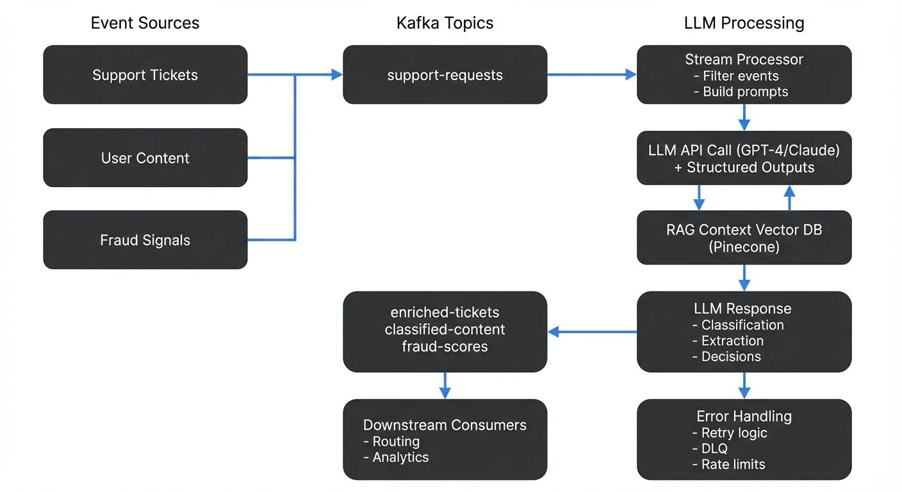

Large Language Models (LLMs) have become powerful tools for understanding and generating human-like text, while streaming platforms like Apache Kafka and Apache Flink excel at processing high-volume, real-time data. Combining these technologies enables organizations to build intelligent, event-driven applications that can analyze, enrich, and respond to data as it flows through their systems.

The 2025 LLM landscape offers diverse options: proprietary models like GPT-4, Claude 3.5 Sonnet, and Gemini 2.0 provide cutting-edge capabilities with streaming APIs, while open-source alternatives like Llama 3.3, Mistral, and Qwen enable on-premises deployment for sensitive data. Modern LLMs support structured outputs, function calling, and streaming responses—features that integrate naturally with event-driven architectures.

This article explores the technical patterns, implementation approaches, and practical considerations for integrating LLMs with streaming platforms.

<!-- ORIGINAL_DIAGRAM
```
┌──────────────────────────────────────────────────────────────────┐
│         LLM Integration with Streaming Platforms                 │
└──────────────────────────────────────────────────────────────────┘

Event Sources                Kafka Topics              LLM Processing
     │                            │                         │
     ▼                            ▼                         ▼
┌──────────┐              ┌──────────────┐        ┌─────────────────┐
│Support   │─────────────▶│support-      │───────▶│ Stream Processor│
│Tickets   │              │requests      │        │ - Filter events │
└──────────┘              └──────────────┘        │ - Build prompts │
     │                            │                └─────────────────┘
┌──────────┐                      │                        │
│User      │─────────────┐        │                        ▼
│Content   │             ├───────▶│               ┌─────────────────┐
└──────────┘             │        │               │ LLM API Call    │
     │                   │        │               │ (GPT-4/Claude)  │
┌──────────┐             │        │               │ + Structured    │
│Fraud     │─────────────┘        │               │   Outputs       │
│Signals   │                      │               └─────────────────┘
└──────────┘                      │                        │
                                  │                        ▼
                                  │               ┌─────────────────┐
                                  │               │  RAG Context    │
                                  │               │  Vector DB      │
                                  │               │  (Pinecone)     │
                                  │               └─────────────────┘
                                  │                        │
                                  ▼                        ▼
                          ┌──────────────┐       ┌─────────────────┐
                          │enriched-     │◀──────│ LLM Response    │
                          │tickets       │       │ - Classification│
                          │classified-   │       │ - Extraction    │
                          │content       │       │ - Decisions     │
                          │fraud-scores  │       └─────────────────┘
                          └──────────────┘                │
                                  │                       │
                                  ▼                       ▼
                          ┌──────────────┐       ┌─────────────────┐
                          │ Downstream   │       │ Error Handling  │
                          │ Consumers    │       │ - Retry logic   │
                          │ - Routing    │       │ - DLQ           │
                          │ - Analytics  │       │ - Rate limits   │
                          └──────────────┘       └─────────────────┘
```
-->

## Why Integrate LLMs with Streaming Platforms?

The integration of LLMs with streaming platforms addresses several business and technical needs. Real-time AI applications require immediate responses to events, whether that's analyzing customer support tickets, detecting fraudulent transactions, or moderating user-generated content.

Streaming platforms provide the infrastructure to handle high-throughput data ingestion and distribution, while LLMs add natural language understanding and generation capabilities. Together, they enable use cases that neither technology could handle effectively alone.

Traditional batch processing approaches introduce latency that makes them unsuitable for time-sensitive applications. When a customer submits a support ticket, waiting hours for batch processing to analyze and route it creates poor user experiences. Streaming architectures allow events to trigger LLM inference immediately, reducing response times from hours to seconds.

Additionally, streaming platforms offer built-in reliability features like message persistence, replay capabilities, and exactly-once semantics. These features are essential when dealing with LLM operations that may be expensive, non-deterministic, or subject to rate limits.

## RAG and Real-Time Context

Retrieval Augmented Generation (RAG) has become a foundational pattern for building LLM applications that need fresh, domain-specific knowledge. Traditional RAG systems query static knowledge bases, but streaming architectures enable real-time RAG pipelines where context updates continuously as events flow through the system.

For detailed coverage of RAG with streaming data, see [RAG Pipelines with Real-Time Data](https://conduktor.io/glossary/rag-pipelines-with-real-time-data).

In a streaming RAG architecture, events trigger vector embedding generation, which updates vector databases like Pinecone, Weaviate, or Qdrant in real-time. When an LLM inference request arrives, the system retrieves the most current relevant documents, ensuring responses reflect the latest information. This pattern is essential for customer support systems that need to reference recent interactions, fraud detection that learns from new attack patterns, or recommendation engines that adapt to trending content.

For real-time embedding strategies, see [Vector Embeddings in Streaming](https://conduktor.io/glossary/vector-embeddings-in-streaming). For architectural patterns connecting vector databases with streaming platforms, see [Vector Databases and Streaming Architectures](https://conduktor.io/glossary/vector-databases-and-streaming-architectures).

Streaming platforms handle the orchestration: Kafka topics carry raw events, stream processors generate embeddings (either via embedding APIs or local models), and change data capture streams database updates back into Kafka for downstream consumers. This creates feedback loops where LLM outputs become inputs for future context, continuously improving relevance.

For CDC patterns that enable these feedback loops, see [What is Change Data Capture? CDC Fundamentals](https://conduktor.io/glossary/what-is-change-data-capture-cdc-fundamentals).

## Common Integration Patterns

Several architectural patterns have emerged for integrating LLMs with streaming platforms.

### Consumer-Transform-Producer Pattern

The most straightforward pattern involves consuming events from a topic, sending them to an LLM API, and producing the results to another topic. A microservice or stream processing application reads messages from an input topic, constructs prompts for the LLM, calls the API, and writes the responses to an output topic.

For example, a support ticket system might consume tickets from a `support-requests` topic, use an LLM to classify urgency and extract key information, then produce enriched tickets to a `classified-tickets` topic for routing to the appropriate team.

### Event-Driven Inference

In this pattern, specific events trigger LLM inference rather than processing every message. A stream processor filters events based on criteria, then invokes the LLM only for relevant cases. This reduces costs and latency by avoiding unnecessary API calls.

A fraud detection system might only invoke an LLM when a transaction exceeds certain thresholds or matches suspicious patterns, rather than analyzing every transaction.

### Streaming ETL for LLM Training

Organizations can use streaming platforms to collect and prepare training data for fine-tuning LLMs. Events flow through transformation pipelines that clean, anonymize, and structure data before storing it in formats suitable for model training.

This pattern creates feedback loops where production data continuously improves model performance, though it requires careful attention to data quality and privacy. For ETL patterns, see [Streaming ETL vs Traditional ETL](https://conduktor.io/glossary/streaming-etl-vs-traditional-etl).

### Kafka Connect for LLM Integration

Kafka Connect provides a declarative approach for integrating LLMs with streaming data through custom connectors or single message transforms (SMTs). Organizations can build source connectors that poll LLM APIs for batch inference results, or sink connectors that send batched events to LLM endpoints.

For Kafka Connect fundamentals, see [Kafka Connect: Building Data Integration Pipelines](https://conduktor.io/glossary/kafka-connect-building-data-integration-pipelines). For transformation patterns, see [Kafka Connect Single Message Transforms](https://conduktor.io/glossary/kafka-connect-single-message-transforms).

While less flexible than stream processors for complex workflows, Kafka Connect simplifies deployment and operations for straightforward LLM enrichment use cases. It's particularly effective for batch-oriented LLM operations where latency requirements are measured in seconds rather than milliseconds.

## Technical Implementation Approaches

Implementing LLM integration with streaming platforms involves several technical considerations.

### Using Kafka Streams or Flink

Stream processing frameworks like Kafka Streams and Apache Flink provide natural integration points for LLM calls. Modern implementations use structured outputs (JSON Schema or function calling) to ensure consistent parsing, and async patterns to handle LLM latency without blocking.

A Kafka Streams application can implement custom processors that invoke LLM APIs with proper error handling:

```java
StreamsBuilder builder = new StreamsBuilder();
KStream<String, SupportTicket> tickets = builder.stream("support-requests");

KStream<String, EnrichedTicket> enriched = tickets.mapValues(ticket -> {
    try {
        // Build prompt with structured output schema
        String prompt = buildPrompt(ticket);
        JsonSchema schema = JsonSchema.builder()
            .properties("urgency", "string")
            .properties("category", "string")
            .properties("summary", "string")
            .required("urgency", "category", "summary")
            .build();

        // Use structured outputs for reliable parsing (GPT-4, Claude 3.5+)
        LLMResponse response = llmClient.completeWithSchema(prompt, schema);
        return enrichTicket(ticket, response);
    } catch (RateLimitException e) {
        // Send to retry topic with backoff
        throw new RetryableException(e);
    } catch (LLMException e) {
        // Send to dead letter queue for manual review
        sendToDeadLetterQueue(ticket, e);
        return ticket; // Pass through unchanged
    }
});

enriched.to("enriched-tickets");
```

For foundational Kafka Streams concepts, see [Introduction to Kafka Streams](https://conduktor.io/glossary/introduction-to-kafka-streams).

Flink offers similar capabilities with its AsyncFunction interface for non-blocking LLM calls, allowing stateful processing and access to timers for handling LLM timeouts. For Flink processing patterns, see [What is Apache Flink? Stateful Stream Processing](https://conduktor.io/glossary/what-is-apache-flink-stateful-stream-processing).

### Managing Latency and Throughput

LLM API calls introduce latency that can impact stream processing throughput. A single LLM inference might take 500ms to several seconds, which becomes a bottleneck when processing high-volume streams.

Parallelization helps by running multiple stream processor instances, each handling a partition of the input topic. Batching requests where the LLM API supports it can improve throughput, though it trades off latency.

Some teams implement caching layers to avoid redundant LLM calls for similar inputs. A Redis cache keyed by prompt content can serve repeated queries without API calls, though cache invalidation requires careful consideration.

### Streaming LLM Responses

Modern LLM APIs support streaming responses that emit tokens incrementally rather than waiting for complete generation. This pattern reduces perceived latency in real-time applications, allowing downstream systems to process partial results while generation continues.

In event-driven architectures, streaming LLM responses can be captured as multiple events in a Kafka topic. Each token or token chunk becomes an event, enabling real-time display in user interfaces, progressive processing in downstream services, or early termination when sufficient information is available. This is particularly valuable for chatbots, content generation systems, and interactive analytics where immediate feedback improves user experience.

Kafka Streams or Flink can aggregate streaming tokens back into complete messages for services that require full context, while still enabling low-latency display layers to consume individual tokens as they arrive.

### Function Calling and Tool Use

2025 LLMs support function calling (also called tool use), allowing models to invoke external APIs and integrate results into their reasoning. In streaming architectures, this creates powerful patterns where LLMs can query databases, fetch real-time data from Kafka topics, or trigger actions in external systems—forming the foundation for agentic AI systems.

A fraud detection LLM might use function calling to query recent transaction history from a state store, check velocity rules in a feature store, or look up customer risk profiles from a database—all within a single inference request. The streaming platform orchestrates these lookups, maintains state stores for fast access, and ensures consistent data across function calls.

For managing state in stream processing, see [State Stores in Kafka Streams](https://conduktor.io/glossary/state-stores-in-kafka-streams). For autonomous agents built on streaming data, see [Agentic AI Pipelines: Streaming Data for Autonomous Agents](https://conduktor.io/glossary/agentic-ai-pipelines).

### Error Handling and Reliability

LLM APIs can fail due to rate limits, timeouts, or service issues. Robust implementations include retry logic with exponential backoff, circuit breakers to prevent cascading failures, and dead letter queues for messages that repeatedly fail processing.

For patterns on handling failed messages, see [Dead Letter Queues for Error Handling](https://conduktor.io/glossary/dead-letter-queues-for-error-handling).

Monitoring API rate limits and costs is essential. Stream processors should track metrics like API call volume, latency percentiles, token usage, and error rates. Platforms like Conduktor provide comprehensive monitoring for Kafka-based LLM pipelines, offering visibility into message flow, [topic management](https://docs.conduktor.io/guide/manage-kafka/kafka-resources/topics), processing metrics, consumer lag, and cost tracking across the entire system. For Kafka-specific monitoring approaches, see [Kafka Cluster Monitoring and Metrics](https://conduktor.io/glossary/kafka-cluster-monitoring-and-metrics) and [Consumer Lag: Monitoring and Managing Streaming Health](https://conduktor.io/glossary/consumer-lag-monitoring).

## Challenges and Best Practices

Several challenges arise when integrating LLMs with streaming platforms.

**Cost Management**: LLM API calls can be expensive at scale. Track token usage carefully and consider strategies like prompt optimization to reduce tokens, caching common responses, and filtering events before LLM processing. Some organizations run smaller, self-hosted models (Llama 3.3, Mistral, Qwen) for simpler tasks while reserving powerful cloud APIs (GPT-4, Claude 3.5) for complex cases. For cost visibility across streaming infrastructure, see [Streaming Total Cost of Ownership](https://conduktor.io/glossary/streaming-total-cost-of-ownership).

**Data Privacy**: Streaming applications often process sensitive data. Ensure LLM providers meet compliance requirements for your industry. Consider techniques like data anonymization before sending to LLM APIs, or running models on-premises when data cannot leave your infrastructure. For PII handling in streams, see [PII Detection and Handling in Event Streams](https://conduktor.io/glossary/pii-detection-and-handling-in-event-streams) and [Data Masking and Anonymization for Streaming](https://conduktor.io/glossary/data-masking-and-anonymization-for-streaming).

**Schema Evolution**: While 2025 LLMs support structured outputs via JSON Schema, managing schema evolution across streaming pipelines remains critical. Define clear schemas for structured data extraction from LLM responses. Schema registries help manage these data contracts as they evolve, ensuring data consistency across streaming pipelines. For schema management patterns, see [Schema Registry and Schema Management](https://conduktor.io/glossary/schema-registry-and-schema-management) and [Schema Evolution Best Practices](https://conduktor.io/glossary/schema-evolution-best-practices).

**Testing**: LLM outputs are non-deterministic, making traditional testing approaches challenging. Focus on property-based testing that verifies outputs meet requirements rather than exact matching. Test error handling paths thoroughly since LLM failures are common. For comprehensive testing strategies, see [Testing Strategies for Streaming Applications](https://conduktor.io/glossary/testing-strategies-for-streaming-applications).

**Prompt Engineering**: The quality of LLM responses depends heavily on prompt design. Maintain prompt templates in version control, test changes systematically, and monitor output quality in production. Include examples in prompts (few-shot learning) to guide the model toward desired formats. Modern LLMs support system prompts, user/assistant message structure, and function definitions—leverage these features to improve consistency.

**LLM Governance**: Organizations must track LLM usage, costs, and outputs for compliance and quality assurance. Implement logging for all LLM requests and responses, track which models and prompts are used in production, and establish approval processes for new LLM integrations. For AI governance patterns, see [Shadow AI: Governing Unauthorized AI in the Enterprise](https://conduktor.io/glossary/shadow-ai-governance) and [AI Discovery and Monitoring](https://conduktor.io/glossary/ai-discovery-and-monitoring).

## Real-World Use Cases

**Customer Support Automation**: A SaaS company streams incoming support tickets through Kafka. An LLM analyzes each ticket to extract the problem description, classify urgency (low/medium/high), identify the product area, and suggest potential solutions based on the knowledge base. The enriched tickets are routed to appropriate support queues, and low-priority issues with clear solutions trigger automated responses. This reduces first-response time from hours to minutes while ensuring complex issues reach specialized teams.

**Content Moderation**: A social media platform processes millions of user posts daily. Posts flow through Kafka topics to content moderation services. An LLM analyzes posts flagged by keyword filters or user reports, determining whether they violate community guidelines. The system produces moderation decisions to downstream topics that trigger actions like hiding posts, notifying moderators for review, or updating user reputation scores. This hybrid approach combines scalable keyword filtering with nuanced LLM analysis only where needed.

**Fraud Detection**: A payment processor streams transaction events through Flink. The system maintains state about user behavior patterns and flags anomalous transactions. For flagged transactions, an LLM analyzes the transaction context, user history, and merchant details to generate risk assessments using function calling to query feature stores and user profiles in real-time. These assessments combine with rule-based scoring to make real-time approval or decline decisions. The LLM's ability to understand complex patterns complements traditional fraud rules, catching sophisticated attacks that rules miss. For detailed patterns, see [Real-Time Fraud Detection with Streaming](https://conduktor.io/glossary/real-time-fraud-detection-with-streaming).

**Real-Time Recommendations**: E-commerce platforms use LLMs with streaming data to generate personalized product recommendations. As users browse, click events flow through Kafka to recommendation services that use RAG patterns to retrieve similar products from vector databases, then invoke LLMs to generate natural language explanations for why products match user interests. For recommendation architecture, see [Building Recommendation Systems with Streaming Data](https://conduktor.io/glossary/building-recommendation-systems-with-streaming-data).

## Summary

Integrating LLMs with streaming platforms combines the real-time processing capabilities of technologies like Kafka and Flink with the natural language understanding of modern AI models. This integration enables applications that can analyze, enrich, and respond to events intelligently as they occur.

The 2025 landscape offers significant advantages: structured outputs eliminate parsing errors, streaming responses reduce latency, function calling enables complex workflows, and diverse model options (from GPT-4 and Claude 3.5 to open-source Llama 3.3 and Mistral) support various deployment models and cost profiles.

Success requires careful attention to architecture patterns, performance optimization, cost management, and operational concerns. The consumer-transform-producer pattern provides a straightforward starting point, while more sophisticated approaches like RAG with real-time context, selective event-driven inference, and vector database integration enable advanced use cases at scale.

Key considerations include managing API latency through parallelization and async patterns, implementing robust error handling with dead letter queues and circuit breakers, and leveraging structured outputs to ensure data consistency across streaming pipelines. Organizations should also address data privacy through masking and anonymization, monitor costs closely with platforms like Conduktor, and invest in prompt engineering to maximize output quality.

For foundational Kafka concepts, see [Apache Kafka](https://conduktor.io/glossary/apache-kafka). For event-driven architecture principles, see [Event-Driven Architecture](https://conduktor.io/glossary/event-driven-architecture). For ML integration patterns, see [Real-Time ML Inference with Streaming Data](https://conduktor.io/glossary/real-time-ml-inference-with-streaming-data) and [Real-Time ML Pipelines](https://conduktor.io/glossary/real-time-ml-pipelines).

As LLMs become faster and more capable, and as streaming platforms evolve to better support AI workloads, this integration pattern will become increasingly important for building intelligent, real-time applications.

## Related Concepts

- [Kafka Connect: Building Data Integration Pipelines](/kafka-connect-building-data-integration-pipelines) - Integrate LLM APIs with streaming data
- [Real-Time Analytics with Streaming Data](/real-time-analytics-with-streaming-data) - Analytics on LLM outputs and performance
- [Data Governance Framework: Roles and Responsibilities](/data-governance-framework-roles-and-responsibilities) - Govern LLM usage and data access

## Sources and References

1. Apache Kafka Documentation: "Kafka Streams" - https://kafka.apache.org/documentation/streams/
2. OpenAI API Documentation: "Structured Outputs" - https://platform.openai.com/docs/guides/structured-outputs
3. Anthropic Claude Documentation: "Function Calling and Tool Use" - https://docs.anthropic.com/en/docs/build-with-claude/tool-use
4. Apache Flink Documentation: "Event-driven Applications" - https://flink.apache.org/what-is-flink/use-cases/#event-driven-applications
5. Google Cloud: "Gemini API Streaming" - https://ai.google.dev/gemini-api/docs/text-generation
6. AWS: "Building Real-time AI Applications with Amazon Bedrock and Kafka" - https://aws.amazon.com/blogs/machine-learning/
7. Martin Kleppmann: "Designing Data-Intensive Applications" (O'Reilly, 2017) - Chapters on stream processing fundamentals
8. Conduktor Documentation: "Monitoring Kafka Applications" - https://docs.conduktor.io/
