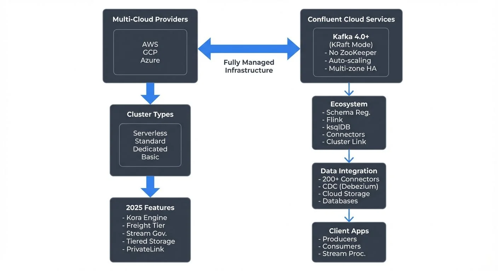

As organizations adopt real-time data architectures, managing Apache Kafka infrastructure becomes increasingly complex. Confluent Cloud addresses this challenge by providing a fully managed, cloud-native Kafka service that handles operational overhead while delivering enterprise-grade features.

This article explores what Confluent Cloud is, how it works, and when organizations should consider using it versus self-managed Apache Kafka with platforms like Conduktor for governance and monitoring.

For foundational Kafka concepts, see [Apache Kafka](https://conduktor.io/glossary/apache-kafka).

<!-- ORIGINAL_DIAGRAM
```
┌──────────────────────────────────────────────────────────────────┐
│             Confluent Cloud Architecture (2025)                  │
└──────────────────────────────────────────────────────────────────┘

Multi-Cloud Providers              Confluent Cloud Services
     │                                      │
     ▼                                      ▼
┌──────────┐                      ┌──────────────────┐
│   AWS    │◀────────────────────▶│ Kafka 4.0+       │
│   GCP    │   Fully Managed      │ (KRaft Mode)     │
│  Azure   │   Infrastructure     │ - No ZooKeeper   │
└──────────┘                      │ - Auto-scaling   │
     │                            │ - Multi-zone HA  │
     │                            └──────────────────┘
     │                                      │
     ▼                                      │
┌──────────────────┐                       │
│ Cluster Types    │                       │
│ ┌──────────────┐ │                       ▼
│ │ Serverless   │ │             ┌──────────────────┐
│ │ Standard     │ │             │  Ecosystem       │
│ │ Dedicated    │ │             │  - Schema Reg.   │
│ │ Basic        │ │             │  - Flink         │
│ └──────────────┘ │             │  - ksqlDB        │
└──────────────────┘             │  - Connectors    │
     │                           │  - Cluster Link  │
     │                           └──────────────────┘
     ▼                                     │
┌──────────────────┐                      │
│  2025 Features   │                      │
│ - Kora Engine    │                      │
│ - Freight Tier   │                      ▼
│ - Stream Gov.    │            ┌──────────────────┐
│ - Tiered Storage │            │ Data Integration │
│ - PrivateLink    │            │ - 200+ Connectors│
└──────────────────┘            │ - CDC (Debezium) │
                                │ - Cloud Storage  │
                                │ - Databases      │
                                └──────────────────┘
                                         │
                                         ▼
                                ┌──────────────────┐
                                │ Client Apps      │
                                │ - Producers      │
                                │ - Consumers      │
                                │ - Stream Proc.   │
                                └──────────────────┘
```
-->

## What is Confluent Cloud?

Confluent Cloud is a fully managed Apache Kafka service developed by Confluent, the company founded by the original creators of Apache Kafka. It provides a complete data streaming platform that runs across multiple cloud providers including AWS, Google Cloud, and Microsoft Azure.

Unlike self-hosted Kafka deployments, Confluent Cloud removes the operational burden of managing brokers, maintaining clusters, scaling infrastructure, and handling upgrades. The platform handles these tasks automatically while providing guaranteed uptime SLAs (Service Level Agreements - commitments to availability percentages).

As of 2025, Confluent Cloud runs on Apache Kafka 4.0+ using KRaft mode (Kafka Raft metadata mode), which eliminates the ZooKeeper dependency that existed in earlier Kafka versions. This architecture provides faster metadata operations, improved scalability, and simpler cluster management. For more on this transition, see [Understanding KRaft Mode in Kafka](https://conduktor.io/glossary/understanding-kraft-mode-in-kafka).

The service goes beyond basic Kafka functionality by including additional components like Schema Registry, managed Apache Flink and ksqlDB for stream processing, and a rich ecosystem of pre-built connectors for data integration.

## Core Capabilities and Features

Confluent Cloud provides several key capabilities that distinguish it from self-managed Kafka deployments.

**Multi-Cloud and Multi-Region Support**: Organizations can deploy clusters across AWS, GCP, and Azure in different regions worldwide. This enables data locality compliance, disaster recovery strategies, and global data distribution patterns.

**Fully Managed Infrastructure**: Confluent handles all infrastructure operations including broker management, storage scaling, software patching, and security updates. Teams can focus on building streaming applications rather than maintaining infrastructure.

**Elastic Scaling**: Clusters can scale up or down based on demand without manual intervention. Storage automatically expands as data grows, and compute resources adjust to handle throughput changes.

**Integrated Ecosystem**: The platform includes Schema Registry for data governance, Kafka Connect for integrating with external systems, managed Apache Flink and ksqlDB for stream processing, and Cluster Linking for cross-cluster data replication. Cluster Linking enables real-time data mirroring between Kafka clusters for disaster recovery, multi-region architectures, and cloud migrations without custom replication code.

**Stream Governance (2025)**: Confluent Cloud includes advanced governance capabilities such as Stream Lineage for tracking data flows, data quality rules enforcement, and business metadata management. These features provide visibility into how data moves through streaming pipelines.

**Enterprise Security**: Built-in encryption at rest and in transit, role-based access control (RBAC - Role-Based Access Control), audit logging, and compliance with standards like SOC 2, ISO 27001, and HIPAA. Private networking options include AWS PrivateLink, Azure Private Link, and GCP Private Service Connect for secure connectivity without exposing traffic to the public internet. For detailed security practices, see [Kafka Security Best Practices](https://conduktor.io/glossary/kafka-security-best-practices).

## Architecture and Deployment Models

Confluent Cloud offers four main cluster types designed for different use cases and requirements (as of 2025).

**Basic Clusters** provide a single-zone deployment suitable for development, testing, and non-critical workloads. They offer a cost-effective entry point with limited availability guarantees.

**Standard Clusters** deliver multi-zone deployment within a single region, providing high availability with 99.95% uptime SLA. These clusters suit production workloads requiring reliability without extreme scale requirements.

**Dedicated Clusters** offer isolated infrastructure with customizable configurations, private networking options, and 99.99% uptime SLA. They support the highest throughput and storage requirements for mission-critical enterprise applications.

**Serverless Clusters (2025)** provide on-demand Kafka capacity that automatically scales based on actual usage without pre-provisioning resources. Organizations pay only for data transferred and stored, making serverless ideal for variable workloads, development environments, and proof-of-concepts where predictable costs matter less than operational simplicity.

For example, a financial services company might use a Dedicated cluster for transaction processing in their primary region, with Cluster Linking replicating data to Standard clusters in other regions for analytics and disaster recovery. For infrastructure planning, see [Kafka Capacity Planning](https://conduktor.io/glossary/kafka-capacity-planning).

## Confluent Cloud in the Data Streaming Ecosystem

Confluent Cloud serves as a central hub in modern data streaming architectures, integrating with various technologies and platforms.

**Apache Kafka Core**: At its foundation, Confluent Cloud provides fully compatible Apache Kafka APIs. Applications using standard Kafka clients can connect without modification, ensuring portability and avoiding vendor lock-in. For core concepts, see [Kafka Topics, Partitions, Brokers: Core Architecture](https://conduktor.io/glossary/kafka-topics-partitions-brokers-core-architecture).

**Stream Processing**: The platform includes both managed Apache Flink (as of 2025) and ksqlDB, enabling SQL-based stream processing directly within Confluent Cloud. Teams can also connect external stream processing engines or Kafka Streams applications running in their own infrastructure. For Flink details, see [What is Apache Flink: Stateful Stream Processing](https://conduktor.io/glossary/what-is-apache-flink-stateful-stream-processing) and [ksqlDB for Real-Time Data Processing](https://conduktor.io/glossary/ksqldb-for-real-time-data-processing).

**Data Integration**: Kafka Connect provides pre-built connectors for databases, data warehouses, cloud storage, and SaaS applications. This enables building real-time data pipelines without custom integration code. For detailed connector patterns, see [Kafka Connect: Building Data Integration Pipelines](https://conduktor.io/glossary/kafka-connect-building-data-integration-pipelines).

**Schema Management**: Schema Registry provides centralized schema storage and evolution management. It ensures data compatibility across producers and consumers, preventing breaking changes in streaming pipelines. See [Schema Registry and Schema Management](https://conduktor.io/glossary/schema-registry-and-schema-management) for implementation details.

**Observability Integration**: Confluent Cloud exports metrics to monitoring platforms like Datadog, Prometheus, and CloudWatch, enabling integration with existing observability stacks. For comprehensive monitoring strategies, see [Kafka Cluster Monitoring and Metrics](https://conduktor.io/glossary/kafka-cluster-monitoring-and-metrics).

This ecosystem approach allows organizations to build complete data streaming platforms where Confluent Cloud handles the message broker while integrating with specialized tools for processing, storage, and analysis.

## Common Use Cases

Organizations adopt Confluent Cloud for various real-time data scenarios.

**Event-Driven Microservices**: Services communicate through Kafka topics, enabling loose coupling and asynchronous processing. When a customer places an order in an e-commerce platform, the order service publishes an event that inventory, payment, and notification services consume independently.

**Real-Time Analytics**: Streaming data from applications, IoT devices, or clickstreams into data warehouses or analytics platforms. A ride-sharing company might stream location updates, ride events, and payment transactions for real-time dashboards and dynamic pricing algorithms.

**Data Integration and CDC**: Capturing database changes in real-time using change data capture (CDC) connectors and replicating them to analytics systems. This creates near-real-time data warehouses without batch ETL processes. For CDC fundamentals, see [What is Change Data Capture: CDC Fundamentals](https://conduktor.io/glossary/what-is-change-data-capture-cdc-fundamentals).

**Log Aggregation**: Centralizing application logs, metrics, and traces from distributed systems for analysis and troubleshooting. Multiple services across regions send logs to Kafka topics, which feed into log analysis platforms.

**Machine Learning Feature Stores**: Streaming feature data to ML models for real-time predictions. A fraud detection system processes transaction events in real-time, enriching them with historical patterns before feeding them to ML models.

## Operating Confluent Cloud at Scale

While Confluent Cloud manages infrastructure, organizations still need to handle application-level operations and governance.

**Monitoring and Observability**: Confluent Cloud provides built-in metrics dashboards showing throughput, latency, and consumer lag. Teams should establish alerting on key metrics like under-replicated partitions, consumer lag exceeding thresholds, and connector failures. The 2025 Stream Designer visual interface provides real-time topology views of data flows. For consumer lag patterns, see [Consumer Lag Monitoring](https://conduktor.io/glossary/consumer-lag-monitoring).

**Security and Access Control**: Implementing proper RBAC policies ensures teams have appropriate access levels. Service accounts with API keys enable applications to authenticate securely without sharing credentials. For detailed access patterns, see [Kafka ACLs and Authorization Patterns](https://conduktor.io/glossary/kafka-acls-and-authorization-patterns).

**Topic and Schema Governance**: As Kafka deployments grow, managing hundreds or thousands of topics becomes challenging. Establishing naming conventions, retention policies, and schema evolution standards prevents sprawl and maintains data quality. See [Kafka Topic Design Guidelines](https://conduktor.io/glossary/kafka-topic-design-guidelines) for best practices.

**Comparison with Self-Managed Kafka**: Organizations running self-managed Apache Kafka can achieve similar governance and monitoring capabilities using platforms like Conduktor. Conduktor provides topic visualization, schema management, consumer group monitoring, data masking, and permission management across self-managed Kafka clusters. This approach offers more infrastructure control while maintaining operational efficiency through modern tooling. For self-managed operations, see [Kafka Admin Operations and Maintenance](https://conduktor.io/glossary/kafka-admin-operations-and-maintenance).

**Cost Optimization**: Monitoring usage patterns helps optimize costs. This includes adjusting retention periods, archiving cold data to object storage using Tiered Storage, rightsizing cluster types, and using committed use discounts for predictable workloads. The 2025 Kora engine provides improved storage efficiency and faster queries. See [Tiered Storage in Kafka](https://conduktor.io/glossary/tiered-storage-in-kafka) for archival strategies.

## Pricing and Total Cost of Ownership

Confluent Cloud uses consumption-based pricing with several components (as of 2025).

**Cluster Costs**: Fixed hourly rates based on cluster type (Basic, Standard, Dedicated, Serverless). Dedicated clusters charge for provisioned capacity, while Serverless clusters charge only for actual usage, making them ideal for variable workloads.

**Data Transfer**: Charges for data written to and read from Kafka. The 2025 Freight tier optimizes inter-region data transfer costs for Cluster Linking and multi-region deployments, offering significant savings compared to standard cloud provider egress fees.

**Storage**: Costs for data retained in Kafka topics, with charges varying by retention period and cluster type. Tiered Storage (powered by the Kora engine) provides lower-cost archival storage for historical data while maintaining query performance.

**Additional Services**: Separate pricing for Schema Registry, managed Apache Flink compute resources, ksqlDB processing units, and Kafka Connect connectors. Stream Governance features are included in Enterprise tiers.

**2025 Pricing Improvements**: The Kora storage engine reduces storage costs by up to 50% through improved compression and encoding. Combined with Tiered Storage, organizations can retain longer histories economically.

When comparing with self-managed Kafka, organizations should consider the total cost of ownership. Self-managed deployments require infrastructure costs (compute, storage, networking), operational staff time for maintenance and on-call support, expertise for upgrades and troubleshooting, and potential costs of downtime. However, organizations gain full control over infrastructure, security configurations, and can leverage platforms like Conduktor for governance and monitoring without vendor lock-in.

Confluent Cloud typically provides better economics for small to medium deployments, teams without deep Kafka expertise, or when engineering time is expensive. Very large deployments with predictable workloads and experienced Kafka teams may find self-managed Apache Kafka with Conduktor more cost-effective while maintaining operational efficiency. For implementing cost visibility and chargeback across any Kafka deployment (cloud or self-managed), see [Conduktor's Cost Control Insights](https://docs.conduktor.io/guide/insights/cost-control). For detailed cost analysis, see [Streaming Total Cost of Ownership](https://conduktor.io/glossary/streaming-total-cost-of-ownership).

## Summary

Confluent Cloud provides a fully managed Apache Kafka 4.0+ platform running on KRaft architecture that eliminates infrastructure management while delivering enterprise features across multiple clouds. As of 2025, the platform includes Serverless clusters, managed Apache Flink, the Kora storage engine, Stream Governance, and enhanced security through private networking options.

The platform integrates naturally into data streaming ecosystems, providing not just Kafka but also stream processing (Flink and ksqlDB), schema management, and data integration capabilities. Common use cases include event-driven microservices, real-time analytics, CDC pipelines, and machine learning feature stores.

While Confluent Cloud handles infrastructure operations, organizations must still manage application-level concerns like monitoring, security, governance, and cost optimization. The service trades infrastructure control for operational simplicity, making it attractive for teams that want to focus on building streaming applications rather than managing Kafka clusters.

**Choosing Between Confluent Cloud and Self-Managed Kafka**: The decision depends on several factors:
- **Choose Confluent Cloud** when you need rapid deployment, lack Kafka expertise, want predictable SLAs, or prefer consumption-based pricing
- **Choose Self-Managed Kafka with Conduktor** when you need maximum infrastructure control, have experienced Kafka teams, require specific security configurations, or operate at massive scale where self-management becomes cost-effective

Both approaches can deliver production-grade streaming platforms - Confluent Cloud through managed services, and self-managed Kafka through modern platforms like Conduktor that provide governance, monitoring, and operational tooling without vendor lock-in.

## Related Concepts

- [Apache Kafka](https://conduktor.io/glossary/apache-kafka) - The foundational open-source platform that Confluent Cloud is built on
- [Kafka Capacity Planning](https://conduktor.io/glossary/kafka-capacity-planning) - Critical for right-sizing both cloud and self-managed deployments
- [Streaming Total Cost of Ownership](https://conduktor.io/glossary/streaming-total-cost-of-ownership) - Analyzing the full economic impact of managed vs. self-hosted Kafka

## Sources and References

1. **Confluent Cloud Documentation (2025)** - Official documentation covering architecture, features, KRaft mode, and best practices
   https://docs.confluent.io/cloud/current/overview.html

2. **Apache Kafka 4.0+ Documentation** - Core Kafka concepts, KRaft mode, and APIs that Confluent Cloud implements
   https://kafka.apache.org/documentation/

3. **Confluent Cloud Pricing (2025)** - Detailed pricing for Serverless, Dedicated clusters, Kora engine, and Freight tier
   https://www.confluent.io/confluent-cloud/pricing/

4. **Confluent Kora Engine Technical Overview** - Architecture and performance improvements in 2025 storage engine
   https://www.confluent.io/blog/kora-engine-cloud-native-kafka-storage/

5. **Apache Flink on Confluent Cloud** - Managed Flink for stream processing integration
   https://docs.confluent.io/cloud/current/flink/overview.html

6. **Conduktor Platform Documentation** - Governance and monitoring for self-managed Kafka environments
   https://docs.conduktor.io/

7. **Gartner Market Guide for Event Stream Processing (2025)** - Industry analysis of streaming platforms
   https://www.gartner.com/en/documents/event-stream-processing
